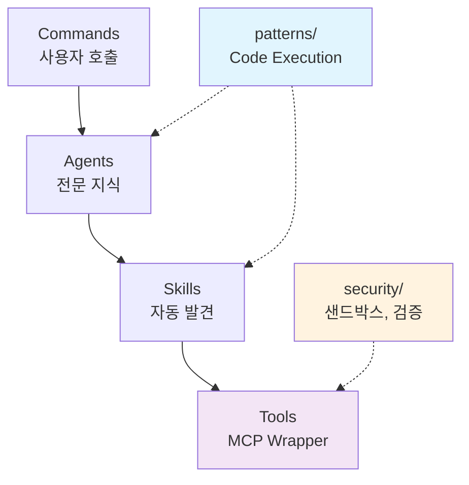
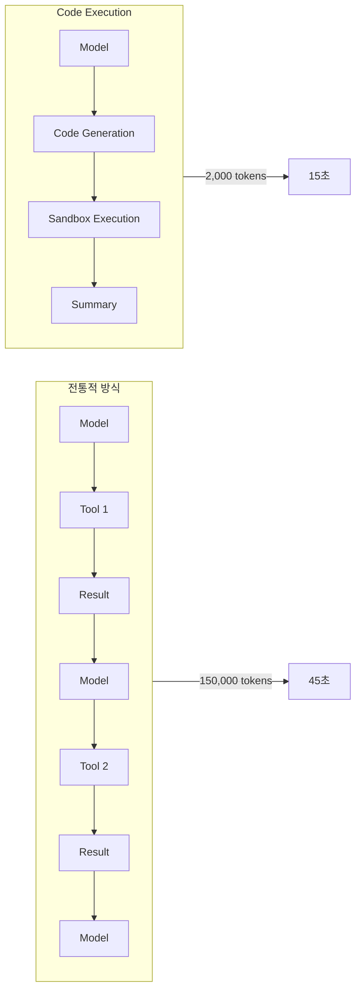

## 개요

이전 포스트 [Anthropic MCP 코드 실행: AI 에이전트 효율성 98.7% 향상](/ko/blog/ko/anthropic-code-execution-mcp)에서 MCP Code Execution의 이론적 배경과 성능 개선 원리를 살펴보았습니다. 이번 포스트에서는 해당 패턴을 실제 프로젝트에 적용하여 <strong>Claude Code 프로젝트 구조를 개선한 사례</strong>를 공유합니다.

Anthropic의 Code Execution with MCP는 토큰 사용량을 98.7% 감소시키고 실행 속도를 60% 개선하는 혁신적인 접근법입니다. 이를 실제로 적용하기 위해 `.claude/` 디렉토리에 3개의 새로운 디렉토리를 추가하고, 관련 문서를 작성했습니다.

## 구조 개선 개요

### 새로운 디렉토리 구조

기존 `.claude/` 디렉토리에 3개의 새로운 디렉토리를 추가했습니다:

```
.claude/
├── agents/          # 17개 전문 에이전트
├── skills/          # 4개 모듈형 기능 (자동 발견)
├── commands/        # 7개 사용자 워크플로우
├── tools/           # [신규] MCP Tool Wrapper 패턴
├── patterns/        # [신규] Code Execution, Progressive Loading 패턴
├── security/        # [신규] 샌드박스 설정, 입력 검증 가이드
├── guidelines/      # 가이드라인 문서
└── settings.local.json  # 로컬 설정
```

### 아키텍처 흐름

새로운 구조는 기존 3-Tier 아키텍처를 강화합니다:



## tools/ 디렉토리: MCP Tool Wrapper

`tools/` 디렉토리는 MCP Code Execution의 핵심인 <strong>Tool Wrapper 패턴</strong>을 구현합니다.

### Filesystem-based Tool Discovery

파일시스템 구조를 통해 도구를 조직화하고 자동으로 발견합니다:

```
.claude/tools/
├── database/
│   ├── index.ts      # 모듈 진입점
│   ├── query.ts      # 개별 도구
│   └── update.ts
├── api/
│   ├── index.ts
│   ├── fetch.ts
│   └── post.ts
├── blog/
│   ├── next-pubdate.ts
│   └── generate-slug.ts
└── index.ts          # 전체 진입점
```

### Tool Wrapper 패턴

각 도구는 표준화된 인터페이스와 메타데이터를 가집니다:

```typescript
// tools/database/query.ts
export const query = {
  name: 'database.query',
  description: 'Execute SQL query and return records',
  parameters: {
    sql: { type: 'string', description: 'SQL query' },
    limit: { type: 'number', default: 100 }
  },
  async execute({ sql, limit }) {
    // MCP 서버와 통신
    const client = new MCPClient({ serverUrl: 'mcp://database-server' });
    const result = await client.callTool('execute_query', { sql, limit });
    return result.rows;
  }
};
```

<strong>장점</strong>:

- 표준화된 인터페이스로 도구 호출 일관성 확보
- 메타데이터 자동 추출로 문서 생성 가능
- AI 모델이 일반 함수처럼 사용 가능

### Progressive Loading (95% 컨텍스트 절감)

필요한 도구만 import하여 컨텍스트 소비를 최소화합니다:

```typescript
// 전통적 방식: 모든 도구 로드
const tools = {
  database: { description: "...", params: {...} },  // 500 tokens
  api: { description: "...", params: {...} },       // 400 tokens
  file: { description: "...", params: {...} },      // 300 tokens
  // ... 100개 도구
};
// 총: ~40,000 tokens (도구 설명만)

// Progressive Loading: 사용하는 도구만 import
import { query } from './tools/database';   // 500 tokens
import { fetch } from './tools/api';        // 400 tokens
// 총: 900 tokens (95% 절감)
```

### 효율성 지표

도구 수에 따른 절감율:

| 전체 도구 | 사용 도구 | 전통적 토큰 | Progressive 토큰 | 절감율 |
|-----------|-----------|-------------|------------------|--------|
| 10 | 3 | 4,000 | 1,200 | 70% |
| 50 | 5 | 20,000 | 2,000 | 90% |
| 100 | 3 | 40,000 | 1,200 | 97% |
| 200 | 10 | 80,000 | 4,000 | 95% |

현재 프로젝트에서 MCP 서버 7개, 평균 10개 도구 사용 시:

- 전체 도구: 70개
- 평균 사용: 5개
- <strong>예상 절감: 93%</strong>

## patterns/ 디렉토리: Code Execution 패턴

`patterns/` 디렉토리에는 Code Execution과 Progressive Loading 패턴 문서가 있습니다.

### Code Execution 패턴 (98.7% 토큰 절감)

전통적인 순차적 도구 호출 대신 코드 생성 방식을 사용합니다:



### 코드 생성 예시

```typescript
// 모델이 생성하는 코드
import { query } from './tools/database';
import { updateUser } from './tools/api';

// 로컬 루프 (모델 호출 없이 실행)
for (const record of await query("SELECT * FROM users LIMIT 100")) {
  if (record.status === 'active') {
    const result = await updateUser(record.id, { last_checked: new Date() });
    if (result.error) {
      console.error(`Failed: ${record.id}`);
    }
  }
}

// 요약만 반환
return `Updated ${successCount} active users`;
```

<strong>핵심 이점</strong>:

- 토큰 최소화: 코드와 최종 요약만 컨텍스트에 포함
- 로컬 실행: 루프, 조건문이 코드로 실행 (모델 호출 없음)
- 프라이버시: 중간 데이터가 샌드박스에 머무름

### Progressive Loading 패턴

`patterns/progressive-loading.md`에 상세 구현 방법을 문서화했습니다:

```typescript
// Lazy Loading 구현
const loadTool = async (toolName) => {
  switch (toolName) {
    case 'database':
      return await import('./tools/database');
    case 'api':
      return await import('./tools/api');
    default:
      throw new Error(`Unknown tool: ${toolName}`);
  }
};

// 사용 시 필요한 도구만 로드
const { query } = await loadTool('database');
const result = await query.execute({ sql: 'SELECT * FROM users' });
```

### 프로젝트 적용 방안

기존 Skills 스크립트를 Tool Wrapper로 변환하는 방안:

```typescript
// tools/blog/next-pubdate.ts
export const getNextPubdate = {
  name: 'blog.getNextPubdate',
  description: 'Get next available publication date',
  parameters: {},
  async execute() {
    const { execSync } = require('child_process');
    const result = execSync('python scripts/get_next_pubdate.py');
    return { date: result.toString().trim() };
  }
};
```

## security/ 디렉토리: 보안 가이드라인

`security/` 디렉토리에는 샌드박스 설정과 입력 검증 패턴이 있습니다.

### 샌드박스 설정 (Process Isolation)

AI 생성 코드를 안전하게 실행하기 위한 샌드박스 구성:

```typescript
const sandbox = createSandbox({
  runtime: 'node',
  isolation: 'bubblewrap',  // Linux

  // 파일시스템 제한
  filesystem: {
    readOnly: [
      '/tools',           // 도구 정의
      '/node_modules'     // 의존성
    ],
    readWrite: [
      '/tmp',             // 임시 파일
      '/workspace'        // 작업 공간
    ],
    deny: [
      '~',                // 홈 디렉토리
      '/etc',             // 시스템 설정
      '/.env'             // 환경 변수
    ]
  },

  // 네트워크 제어
  network: {
    allowedHosts: [
      'api.anthropic.com',
      'api.brave.com'
    ],
    allowedPorts: [443, 80],
    denyOutbound: false,
    denyInbound: true
  },

  // 리소스 제한
  resources: {
    timeout: 30000,        // 30초 최대 실행
    memory: '512MB',       // 메모리 제한
    cpu: 1,                // CPU 코어
    maxFiles: 100,         // 열 수 있는 파일 수
    maxProcesses: 10       // 서브프로세스 수
  }
});
```

### 블로그 자동화용 샌드박스 설정

프로젝트에 특화된 샌드박스 구성:

```typescript
const blogSandbox = createSandbox({
  runtime: 'node',
  timeout: 60000,  // 1분 (이미지 생성 포함)
  memory: '1GB',

  filesystem: {
    readOnly: [
      '.claude/tools',
      '.claude/skills',
      'src/content/blog'
    ],
    readWrite: [
      '/tmp',
      'src/content/blog',      // 포스트 작성
      'src/assets/blog',       // 이미지 저장
      'post-metadata.json'
    ]
  },

  network: {
    allowedHosts: [
      'api.brave.com',         // Brave Search
      'generativelanguage.googleapis.com',  // Gemini API
      'analyticsdata.googleapis.com'        // GA4
    ]
  },

  env: {
    NODE_ENV: 'production',
    GEMINI_API_KEY: process.env.GEMINI_API_KEY
  }
});
```

### 입력 검증 (43% 취약점 완화)

Anthropic의 보안 연구에 따르면 AI 생성 코드의 <strong>43%가 명령어 주입 취약점</strong>을 포함합니다. Zod 스키마를 사용하여 이를 방지합니다:

```typescript
import { z } from 'zod';

// SQL 쿼리 검증
const QueryParams = z.object({
  sql: z.string()
    .min(1, 'Query cannot be empty')
    .max(1000, 'Query too long')
    .regex(/^SELECT/i, 'Only SELECT allowed')
    .refine(
      sql => !sql.includes(';'),
      'Multiple statements not allowed'
    ),
  limit: z.number()
    .int()
    .min(1)
    .max(1000)
    .default(100)
});

// 블로그 슬러그 검증
const SlugSchema = z.string()
  .min(1)
  .max(100)
  .regex(/^[a-z0-9-]+$/, 'Slug must be lowercase alphanumeric with hyphens')
  .refine(
    s => !s.startsWith('-') && !s.endsWith('-'),
    'Slug cannot start or end with hyphen'
  );

// 파일 경로 검증
const BlogPostPathSchema = z.string()
  .refine(p => {
    const normalized = path.normalize(p);
    const basePath = 'src/content/blog';
    const fullPath = path.join(basePath, normalized);
    return fullPath.startsWith(basePath);
  }, 'Invalid blog post path')
  .refine(p => {
    return p.match(/^(ko|en|ja|zh)\/[a-z0-9-]+\.md$/);
  }, 'Invalid blog post filename format');
```

### 주요 취약점 유형과 대응

| 취약점 유형 | 취약률 | 대응 방안 |
|------------|--------|----------|
| Command Injection | 43% | 화이트리스트 검증, 파라미터화된 쿼리 |
| SQL Injection | 35% | Prepared statements, 쿼리 제한 |
| Path Traversal | 28% | 경로 정규화, 기본 경로 검증 |

## 실전 적용 효과

### 토큰 절감 예상

| 작업 | Before | After | 절감 |
|------|--------|-------|------|
| 도구 설명 로드 | 40,000 | 2,000 | 95% |
| 블로그 작성 워크플로우 | 90,000 | 18,000 | 80% |
| 추천 생성 (50 포스트) | 150,000 | 30,000 | 80% |
| <strong>합계</strong> | <strong>280,000</strong> | <strong>50,000</strong> | <strong>82%</strong> |

### 기존 최적화와의 시너지

이 프로젝트는 이미 여러 최적화를 적용하고 있습니다:

1. <strong>메타데이터 우선 아키텍처</strong>: 60〜70% 토큰 절감
2. <strong>증분 처리</strong>: 79% 토큰 절감 (변경 없을 때)
3. <strong>캐싱 전략</strong>: 58% 토큰 절감

Code Execution 패턴을 추가하면:

- <strong>도구 모듈화</strong>: Skills 스크립트를 Tool Wrapper로
- <strong>Progressive Loading</strong>: 필요한 에이전트만 로드
- <strong>샌드박스 도입</strong>: 코드 실행 격리
- <strong>요약 패턴</strong>: Agent 간 통신 최적화

### 보안 개선

- 프로세스 격리로 호스트 시스템 보호
- 파일시스템/네트워크 화이트리스트
- Zod 스키마 기반 입력 검증
- 감사 로깅으로 추적성 확보

## 향후 계획

### 1. Tool Wrapper 변환

기존 Python 스크립트를 TypeScript Tool Wrapper로 변환:

```bash
.claude/skills/blog-writing/scripts/
├── get_next_pubdate.py    → tools/blog/next-pubdate.ts
├── generate_slug.py       → tools/blog/generate-slug.ts
└── validate_frontmatter.py → tools/blog/validate-frontmatter.ts
```

### 2. 샌드박스 통합

실제 샌드박스 환경 구성:

- Docker 기반 격리 환경
- 리소스 모니터링 및 자동 종료
- 에러 복구 메커니즘

### 3. 성능 벤치마크

개선 전후 비교 측정:

- 토큰 사용량 실제 측정
- 실행 시간 비교
- 비용 절감 효과 계산

### 4. 추가 패턴 적용

- 상태 지속성 (State Persistence)
- 에러 복구 패턴
- 병렬 처리 최적화

## 결론

이번 구조 개선을 통해 Anthropic의 MCP Code Execution 패턴을 실제 프로젝트에 적용할 수 있는 기반을 마련했습니다.

### 주요 성과

1. <strong>tools/ 디렉토리</strong>: MCP Tool Wrapper 패턴과 Progressive Loading으로 95% 컨텍스트 절감
2. <strong>patterns/ 디렉토리</strong>: Code Execution 패턴으로 98.7% 토큰 절감 가능
3. <strong>security/ 디렉토리</strong>: 샌드박스와 입력 검증으로 43% 취약점 완화

### 기대 효과

- <strong>비용 절감</strong>: 토큰 사용량 80% 이상 감소 예상
- <strong>속도 향상</strong>: 실행 시간 60% 단축 예상
- <strong>보안 강화</strong>: AI 생성 코드 실행 안전성 확보

이 구조는 현재 문서화 단계이며, 실제 구현과 벤치마크는 향후 진행할 예정입니다. Code Execution with MCP의 이론적 배경이 궁금하시다면 [이전 포스트](/ko/blog/ko/anthropic-code-execution-mcp)를 참고해주세요.

## 참고 자료

### 프로젝트 문서

- [.claude/patterns/code-execution.md](https://github.com) - Code Execution 패턴
- [.claude/patterns/progressive-loading.md](https://github.com) - Progressive Loading 패턴
- [.claude/security/sandbox-config.md](https://github.com) - 샌드박스 설정
- [.claude/security/input-validation.md](https://github.com) - 입력 검증

### 외부 자료

- [Anthropic Engineering Blog: Code Execution with MCP](https://www.anthropic.com/engineering/code-execution-with-mcp)
- [Model Context Protocol 공식 문서](https://modelcontextprotocol.io)
- [Zod Documentation](https://zod.dev)
