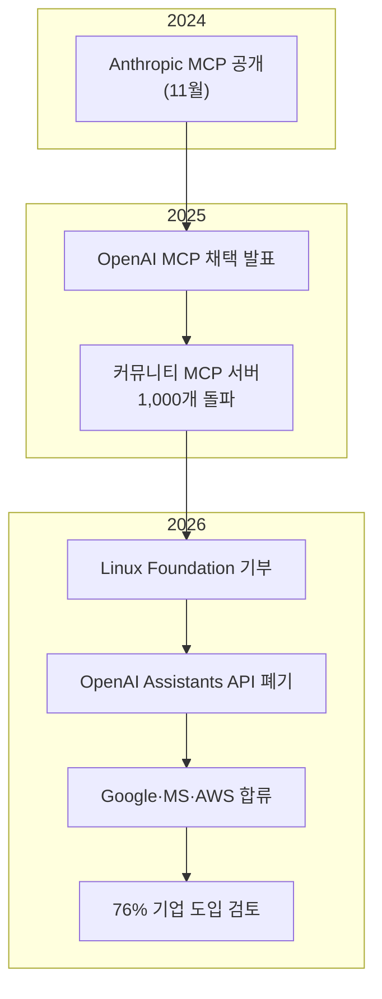
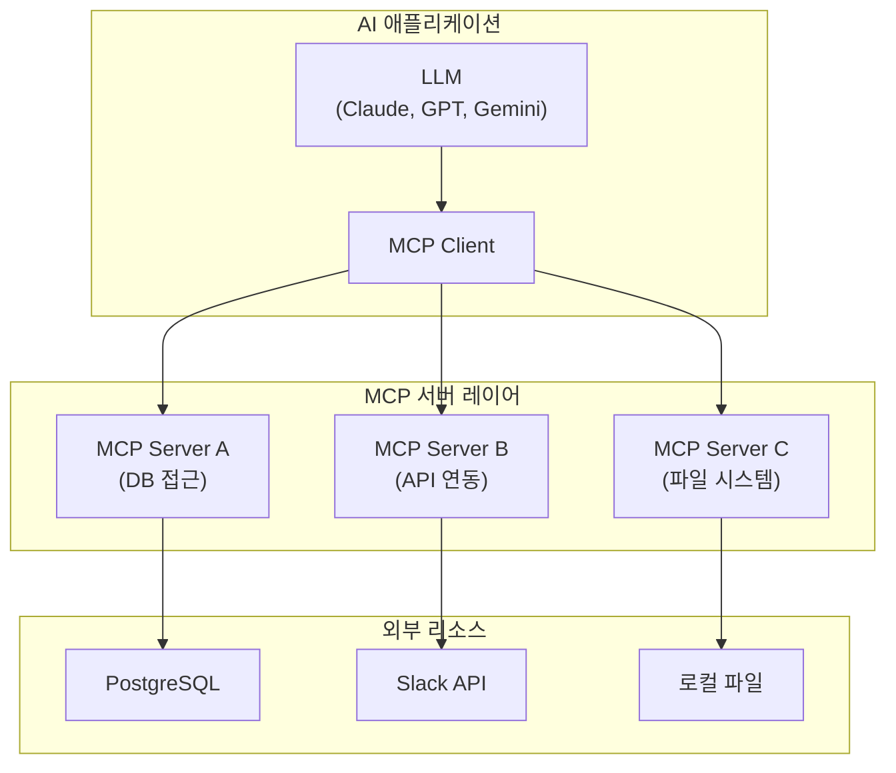
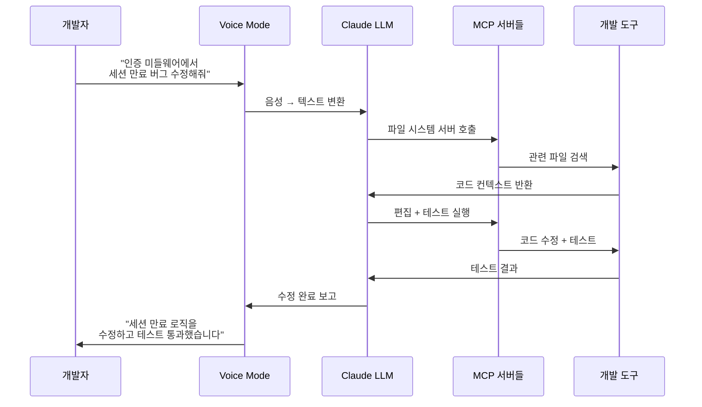
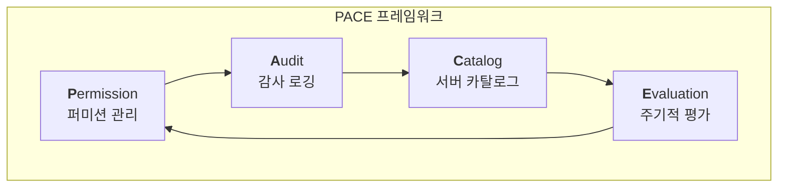
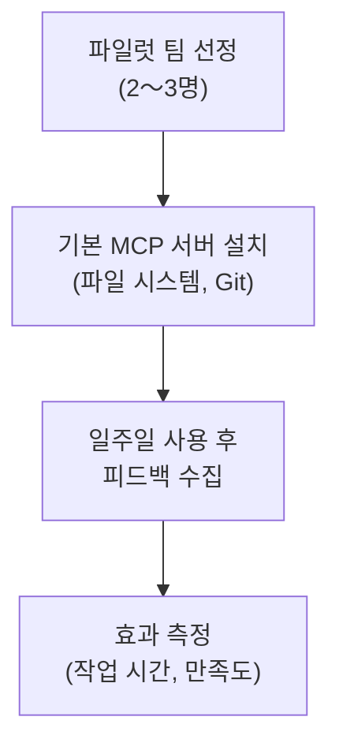

## MCP, "AI의 USB-C"가 산업 표준이 되기까지

2024년 11월, Anthropic이 공개한 <strong>Model Context Protocol(MCP)</strong>은 처음에는 "또 하나의 프로토콜"로 받아들여졌습니다. 하지만 불과 16개월 만에 상황이 완전히 달라졌습니다.

2026년 초, Anthropic은 MCP를 <strong>Linux Foundation</strong>에 기부했고, OpenAI(Assistants API를 폐기하고 MCP 채택), Google DeepMind, Microsoft, AWS, Cloudflare가 공동 창립 멤버로 합류했습니다. "AI 모델이 외부 도구와 대화하는 방식"에 대한 사실상의 유일한 표준이 탄생한 것입니다.

이 글에서는 MCP 표준화가 엔지니어링 조직에 무엇을 의미하는지, 그리고 <strong>EM/VPoE/CTO</strong>가 어떻게 도입을 준비해야 하는지를 실전 사례와 함께 다룹니다.

## 왜 지금 MCP인가 — 3가지 전환점

### 1. 프로토콜 전쟁의 종결

2025년까지만 해도 AI 도구 연결 방식은 파편화되어 있었습니다.

- OpenAI: Function Calling + Assistants API
- Google: Vertex AI Extensions
- Anthropic: Tool Use + MCP
- 각 프레임워크: LangChain Tools, CrewAI Tools 등

2026년, OpenAI가 Assistants API를 공식 폐기하고 MCP를 전면 채택하면서 이 파편화는 사실상 종결되었습니다. Linux Foundation 거버넌스 아래에서 단일 표준이 확립된 것은 HTTP, REST 이후 가장 중요한 인프라 표준화 중 하나입니다.

### 2. 76%의 기업이 이미 움직이고 있다

CData의 2026년 조사에 따르면, <strong>76%의 소프트웨어 제공업체</strong>가 이미 MCP를 탐색하거나 구현 중입니다. 이는 "도입할지 말지"가 아니라 "어떻게 도입할 것인가"의 문제로 전환되었음을 의미합니다.

### 3. 보안 통제가 채택을 따라가지 못하고 있다

VentureBeat의 보도에 따르면, <strong>엔터프라이즈 MCP 도입 속도가 보안 통제 수립 속도를 앞지르고 있습니다</strong>. 이는 2000년대 초반 REST API 확산기와 유사한 패턴입니다 — 편의성이 보안을 앞서가고, 나중에 대가를 치르는 구조입니다.

## MCP 아키텍처 핵심 — 5분 요약

MCP를 처음 접하는 분들을 위해 핵심 아키텍처를 정리합니다.

<strong>핵심 개념</strong>:

- <strong>MCP Host</strong>: AI 애플리케이션 (Claude Code, Cursor, Windsurf 등)
- <strong>MCP Client</strong>: 호스트 내부에서 서버와 1:1 연결을 관리
- <strong>MCP Server</strong>: 특정 리소스(DB, API, 파일 등)에 대한 접근을 제공
- <strong>Transport</strong>: stdio(로컬) 또는 HTTP+SSE(원격) 프로토콜

USB-C 비유가 적절한 이유는 이것입니다 — 하나의 프로토콜로 어떤 AI 모델이든 어떤 도구와도 연결할 수 있습니다.

## 실전 사례 3가지 — MCP가 바꾸는 워크플로우

### 사례 1: Perplexity Computer — 19개 모델의 에이전틱 오케스트레이션

2026년 2월 출시된 <strong>Perplexity Computer</strong>는 MCP 기반 멀티 모델 오케스트레이션의 가장 극적인 사례입니다.

| 역할 | 모델 | 용도 |
|------|------|------|
| 핵심 추론 | Claude Opus 4.6 | 복잡한 의사결정 |
| 딥 리서치 | Gemini | 대량 문서 분석 |
| 경량 작업 | Grok | 빠른 응답 |
| 장문맥 리콜 | ChatGPT 5.2 | 긴 대화 이력 활용 |

Perplexity는 각 모델을 <strong>MCP 서버로 래핑</strong>하여 서브에이전트들이 병렬로 작업을 수행합니다. 사용자가 "이 PDF를 분석하고 요약해서 이메일로 보내줘"라고 요청하면, 시스템이 자동으로 최적의 모델 조합을 선택하고 작업을 분배합니다.

<strong>EM 관점에서의 시사점</strong>: 단일 모델에 종속되지 않는 멀티 모델 전략이 가능해졌습니다. 팀 내 AI 도구 선택이 "어떤 모델을 쓸 것인가"에서 "어떤 작업에 어떤 모델을 할당할 것인가"로 진화합니다.

### 사례 2: Claude Code Voice Mode — 3.7배 생산성 향상

2026년 3월 3일 출시된 <strong>Claude Code Voice Mode</strong>는 `/voice` 명령으로 활성화되어, 개발자가 음성으로 버그 설명, 아키텍처 결정, 리팩토링을 지시하면 Claude가 코드를 작성하고 실행합니다.

초기 사용자 데이터에 따르면 <strong>3.7배 빠른 워크플로우</strong>를 달성한 사례가 보고되고 있습니다. 이 속도 향상의 핵심은 MCP 기반의 도구 연결입니다 — Voice Mode가 파일 시스템, Git, 테스트 러너, 빌드 시스템 등을 MCP 서버로 연결하여 음성 명령 하나로 전체 개발 파이프라인을 제어합니다.

### 사례 3: 플랫폼 엔지니어링 팀의 MCP 게이트웨이

MintMCP, Cloudflare Workers 등이 제공하는 <strong>MCP 게이트웨이</strong>는 플랫폼 엔지니어링 팀이 조직 전체의 MCP 서버를 중앙에서 관리할 수 있게 합니다.

실제 도입 사례에서 보고된 효과:

- <strong>반복 작업 시간 40% 절감</strong>: Jira 이슈 생성, Slack 알림, DB 쿼리 등을 MCP로 자동화
- <strong>온보딩 시간 단축</strong>: 신규 팀원이 표준화된 MCP 서버를 통해 팀 도구에 즉시 접근
- <strong>섀도우 IT 감소</strong>: 개인별 스크립트 대신 표준 MCP 서버로 도구 접근 통일

## EM/VPoE가 주의할 보안과 거버넌스

### 보안 리스크 현실

MCP의 빠른 확산에는 대가가 따릅니다. Cisco의 분석에 따르면 주요 위험은 다음과 같습니다:

1. <strong>프롬프트 인젝션</strong>: MCP 서버가 반환하는 데이터에 악의적 프롬프트가 포함될 수 있음
2. <strong>공급망 공격</strong>: 커뮤니티 MCP 서버(예: OpenClaw의 5,700개+ 스킬)의 품질 관리 문제
3. <strong>과도한 권한 부여</strong>: MCP 서버에 필요 이상의 시스템 접근 권한 부여
4. <strong>데이터 유출</strong>: AI 모델을 통한 내부 데이터의 비의도적 외부 전송

### 거버넌스 프레임워크: PACE 모델

엔지니어링 조직을 위한 MCP 거버넌스 프레임워크를 제안합니다.

<strong>Permission (퍼미션 관리)</strong>:
- MCP 서버별 최소 권한 원칙 적용
- 읽기 전용 vs 쓰기 가능 서버 명확 분리
- 팀별 접근 가능한 서버 화이트리스트 관리

<strong>Audit (감사 로깅)</strong>:
- 모든 MCP 호출에 대한 로그 기록
- 비정상 패턴 탐지 (대량 데이터 접근, 비근무시간 호출 등)
- 주간 감사 리포트 자동 생성

<strong>Catalog (서버 카탈로그)</strong>:
- 승인된 MCP 서버 목록 중앙 관리
- 버전 관리 및 보안 패치 추적
- 커뮤니티 서버 사용 시 코드 리뷰 필수

<strong>Evaluation (주기적 평가)</strong>:
- 분기별 MCP 서버 보안 감사
- 사용률 기반 불필요 서버 정리
- 새로운 보안 취약점에 대한 영향 평가

## 엔지니어링 조직 도입 로드맵

### Phase 1: 파일럿 (2〜4주)

- <strong>대상</strong>: AI 도구에 관심 있는 2〜3명의 시니어 엔지니어
- <strong>서버</strong>: 파일 시스템, Git, 기본 DB 조회 등 저위험 서버만
- <strong>측정</strong>: 반복 작업 시간 변화, 개발자 만족도

### Phase 2: 팀 확장 (1〜2개월)

- <strong>대상</strong>: 전체 팀 (10〜20명)
- <strong>서버 추가</strong>: Slack, Jira, CI/CD 연동
- <strong>거버넌스</strong>: PACE 프레임워크 적용 시작
- <strong>교육</strong>: MCP 기본 개념 + 보안 가이드라인 공유

### Phase 3: 조직 표준화 (2〜3개월)

- <strong>MCP 게이트웨이 도입</strong>: 중앙 관리 + 인증/권한 통합
- <strong>커스텀 서버 개발</strong>: 사내 시스템 전용 MCP 서버
- <strong>CI/CD 통합</strong>: MCP 서버 배포 파이프라인 구축
- <strong>KPI 설정</strong>: 생산성 메트릭 정식 추적

### Phase 4: 최적화 (지속)

- 멀티 모델 전략 수립 (Perplexity Computer 사례 참고)
- MCP 서버 성능 모니터링
- 신규 서버 평가 및 도입 프로세스 자동화

## "80/13 갭"을 줄이는 열쇠

McKinsey의 2026년 조사에 따르면, <strong>80%의 기업이 GenAI를 배포했지만 실질적 임팩트를 보는 곳은 13%에 불과합니다</strong>. 이 격차의 핵심 원인은 "도구 파편화"와 "워크플로우 미통합"입니다.

MCP 표준화는 이 갭을 줄이는 인프라 레이어입니다:

| 문제 | MCP 이전 | MCP 이후 |
|------|---------|---------|
| 도구 연결 | 모델별 커스텀 통합 | 표준 프로토콜로 통일 |
| 전환 비용 | 모델 교체 시 모든 통합 재구축 | 서버 유지, 클라이언트만 교체 |
| 팀 협업 | 개인별 스크립트 난립 | 표준 서버 카탈로그 공유 |
| 보안 관리 | 통합별 개별 감사 | 게이트웨이 레벨 일괄 관리 |

## CTO 관점: 투자 트렌드가 말해주는 것

TechCrunch의 2026년 3월 보도에 따르면, VC들은 더 이상 <strong>"얇은 워크플로우 레이어"</strong> SaaS에 투자하지 않습니다. 대신 <strong>미션 크리티컬 워크플로우에 깊이 임베디드된 AI 네이티브 인프라</strong>에 집중하고 있습니다.

이는 MCP를 "단순한 도구 연결"이 아닌 <strong>"조직의 AI 인프라 레이어"</strong>로 포지셔닝해야 함을 의미합니다. MCP 서버 생태계를 조기에 구축한 조직은:

1. <strong>모델 교체에 유연</strong>: Claude에서 GPT로, 또는 오픈소스 모델로 전환해도 워크플로우 유지
2. <strong>벤더 종속 탈피</strong>: 특정 AI 제공자에 의존하지 않는 인프라 구축
3. <strong>지속적 혁신</strong>: 새로운 MCP 서버 추가만으로 AI 역량 확장 가능

## 결론 — 지금이 MCP 투자의 적기

MCP의 Linux Foundation 합류는 "이 프로토콜이 살아남을 것인가"에 대한 질문을 종결시켰습니다. OpenAI, Google, Microsoft, AWS가 모두 같은 테이블에 앉았다는 것은 <strong>HTTP 이후 가장 중요한 인프라 합의</strong>에 가깝습니다.

엔지니어링 리더로서 지금 해야 할 일은 세 가지입니다:

1. <strong>파일럿을 시작하세요</strong> — 2〜3명의 시니어 엔지니어와 기본 MCP 서버로 시작
2. <strong>거버넌스를 먼저 설계하세요</strong> — 보안 통제 없이 확산시키면 나중에 대가를 치릅니다
3. <strong>멀티 모델 전략을 고려하세요</strong> — MCP 덕분에 특정 모델에 종속되지 않는 아키텍처가 가능합니다

"USB-C가 모든 기기의 충전 방식을 통일한 것처럼, MCP는 모든 AI의 도구 연결 방식을 통일합니다. 차이점은 — USB-C는 10년 걸렸고, MCP는 2년도 안 걸렸다는 것입니다."

## 참고 자료

- [How MCP will supercharge AI automation in 2026 — Hallam](https://hallam.agency/blog/how-mcp-will-supercharge-ai-automation-in-2026/)
- [Enterprise MCP adoption is outpacing security controls — VentureBeat](https://venturebeat.com/security/enterprise-mcp-adoption-is-outpacing-security-controls)
- [2026: The Year for Enterprise-Ready MCP Adoption — CData](https://www.cdata.com/blog/2026-year-enterprise-ready-mcp-adoption)
- [MCP Explained: How AI Agents Actually Work (2026) — DEV Community](https://dev.to/aristoaistack/mcp-explained-how-ai-agents-actually-work-2026-5p8)
- [Claude Code rolls out a voice mode — TechCrunch](https://techcrunch.com/2026/03/03/claude-code-rolls-out-a-voice-mode-capability/)
- [Best MCP Gateways for Platform Engineering Teams — MintMCP](https://www.mintmcp.com/blog/mcp-gateways-platform-engineering-teams)
