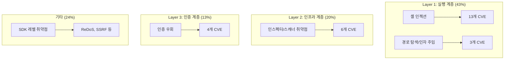
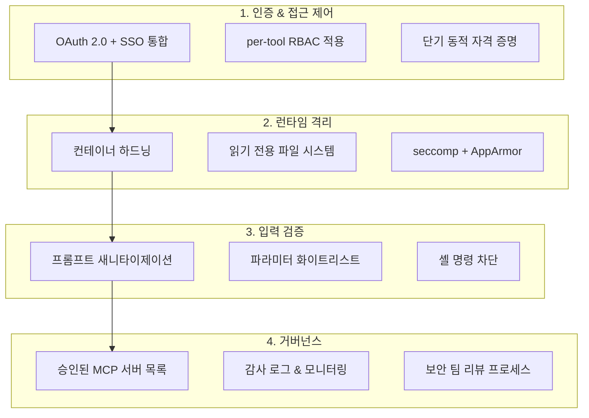

## MCP, AI의 USB 포트가 된 대가

Model Context Protocol(MCP)은 LLM이 외부 도구와 데이터를 연결하는 사실상의 표준이 되었습니다. Linux Foundation 산하 오픈 거버넌스 체제로 전환되고, Anthropic·OpenAI·Google 등 주요 벤더가 지원을 선언하면서 채택이 폭발적으로 늘었습니다. 그러나 <strong>편의성이 확보된 자리에는 반드시 공격 표면이 따라옵니다.</strong>

2026년 1〜2월, 불과 60일 사이에 <strong>30개의 CVE</strong>가 MCP 생태계에서 보고되었고, 인터넷에 노출된 MCP 서버 인스턴스는 42,665개에 달합니다. 스캔 대상 560개 서버 중 36%가 인증 자체가 없었습니다. MCP가 AI 시대의 가장 빠르게 성장하는 공격 표면이 되고 있다는 것은 더 이상 과장이 아닙니다.

이 글에서는 EM/VPoE/CTO 관점에서 MCP 보안 현황을 분석하고, 팀과 조직이 즉시 적용할 수 있는 하드닝 가이드를 제시합니다.

## 30개 CVE가 말해주는 3계층 공격 모델

보고된 30개 CVE를 분류하면 MCP의 공격 표면이 <strong>세 개의 뚜렷한 계층</strong>으로 진화했음을 알 수 있습니다.

### Layer 1 — 실행 계층 (43%, 13+3개 CVE)

가장 고전적이면서도 여전히 가장 많은 비중을 차지합니다. MCP 서버가 사용자 입력을 셸 명령에 직접 전달하는 패턴이 반복적으로 발견되었습니다.

<strong>대표 사례</strong>: Anthropic의 공식 Git MCP 서버에서 발견된 3개 취약점(CVE-2025-68143〜68145)은 프롬프트 인젝션을 통해 원격 코드 실행(RCE)이 가능했습니다. 경로 검증 우회, 무제한 `git_init`, 인자 주입이 복합적으로 작용했습니다.

### Layer 2 — 인프라 계층 (20%, 6개 CVE)

MCP 서버 자체가 아니라 <strong>MCP를 관리·모니터링하는 도구</strong>가 취약점이 되는 새로운 패턴입니다. 인스펙터, 스캐너, 호스트 애플리케이션 등 "메타 도구"가 공격 대상이 됩니다.

### Layer 3 — 인증 계층 (13%, 4개 CVE)

<strong>macOS에서 OAuth 토큰 갱신 메커니즘 조작</strong>(CVE-2026-27487), `~/.openclaw/credentials/`에 평문 저장된 자격 증명 등 인증 관련 취약점이 보고되었습니다.

## SDK 수준의 위협 — 공급망 오염

개별 서버를 넘어 <strong>MCP 생태계 전체를 위협하는 공급망 공격</strong>이 감지되었습니다.

### 공식 TypeScript SDK 취약점

`@modelcontextprotocol/sdk`(공식 TypeScript SDK)에서 2건의 크리티컬 취약점이 확인되었습니다.

- <strong>ReDoS</strong>: `UriTemplate` 클래스의 리소스 URI 매칭에 사용되는 정규식이 재앙적 백트래킹에 취약. 특수 URI로 서버 프로세스 행업 가능
- <strong>SSRF</strong>: Microsoft의 MarkItDown MCP 서버에서 발견된 SSRF 취약점이 전체 MCP 서버의 약 36.7%에 잠재적으로 존재

### 스킬 레지스트리 오염

| 시기 | 스캔 범위 | 악성 스킬 수 | 비율 |
|------|----------|-------------|------|
| 2026-01-29 | 2,857개 패키지 | 341개 | 11.9% |
| 2026-02-16 | 10,700+개 패키지 | 824+개 | 7.7% |

Bitdefender Labs는 심층 분석 대상의 약 <strong>20%에서 악성 페이로드</strong>를 확인했습니다. npm이나 PyPI의 공급망 공격이 MCP 스킬 레지스트리로 확장된 셈입니다.

## EM/CTO를 위한 엔터프라이즈 하드닝 체크리스트

### 1. 인증 & 접근 제어

- <strong>OAuth 2.0 + SSO 통합 필수</strong>: MCP 엔드포인트를 SSO 뒤에 배치. 36%의 서버가 인증 없이 노출된 현실을 감안하면 최우선 과제
- <strong>Per-tool RBAC</strong>: 모든 MCP 도구에 역할 기반 접근 제어 적용. "파일 읽기" 도구에 "파일 삭제" 권한이 함께 부여되지 않도록 분리
- <strong>동적 자격 증명</strong>: 정적 API 키 대신 단기 토큰 사용. 자동 로테이션 구현

### 2. 런타임 격리

- <strong>불변 인프라</strong>: 읽기 전용 컨테이너 파일 시스템, 제한된 Linux 케이퍼빌리티
- <strong>리소스 제한</strong>: CPU/메모리 할당량 설정으로 ReDoS 등 자원 고갈 공격 완화
- <strong>강제 접근 제어</strong>: seccomp 프로파일 + AppArmor/SELinux로 시스템 콜 수준 제한

### 3. 입력 검증

- <strong>프롬프트 새니타이제이션</strong>: 프롬프트 인젝션 방어. 모든 사용자 입력과 도구 파라미터를 화이트리스트 기반으로 검증
- <strong>셸 명령 직접 실행 차단</strong>: 사전 정의된 명령만 허용하는 구조로 전환

### 4. 거버넌스

- <strong>승인된 서버 목록 운영</strong>: 개발자가 임의로 MCP 서버를 설치하지 못하도록 보안 팀 승인 프로세스 구축
- <strong>감사 로그</strong>: 모든 MCP 도구 호출에 대한 감사 추적. 규제 요건(GDPR, HIPAA, SOC2) 충족
- <strong>SAST + SCA</strong>: MCP 서버 코드에 정적 분석 도구와 소프트웨어 컴포지션 분석 적용

## 실무 적용 — MCP 보안 성숙도 3단계

조직의 현재 상황에 맞게 단계적으로 보안 수준을 높이는 접근이 현실적입니다.

### Stage 1: 즉시 조치 (1〜2주)

- 인증 없는 MCP 엔드포인트 즉시 비활성화 또는 접근 차단
- 자격 증명 평문 저장 여부 점검 (`~/.openclaw/credentials/`, `.env`)
- 사용 중인 MCP SDK 버전 확인 및 패치 적용

### Stage 2: 기반 구축 (1〜2개월)

- OAuth 2.0 + SSO 통합 완료
- 컨테이너 기반 MCP 서버 배포 전환
- 승인된 MCP 서버/스킬 레지스트리 구축
- SAST/SCA 파이프라인에 MCP 서버 코드 포함

### Stage 3: 성숙 운영 (3〜6개월)

- 실시간 모니터링 및 이상 행위 탐지
- 정기 보안 감사 프로세스 정착
- MCP 보안 정책 사내 교육 프로그램
- 레드팀 연습에 MCP 시나리오 포함

## OWASP의 MCP 보안 가이드

OWASP는 2026년 초 MCP 서버 보안 개발을 위한 실무 가이드를 발표했습니다. 핵심 권고사항은 다음과 같습니다.

- <strong>최소 권한 원칙</strong>: 각 MCP 도구에 필요한 최소한의 권한만 부여
- <strong>시크릿 관리</strong>: 환경 변수가 아닌 전용 시크릿 매니저 사용. 런타임에 동적으로 주입
- <strong>컴포넌트 서명</strong>: MCP 서버 바이너리와 스킬 패키지에 서명 적용
- <strong>DevSecOps 통합</strong>: MCP 보안을 CI/CD 파이프라인의 일부로 자동화

## 결론 — 편의성과 보안의 균형점 찾기

MCP는 AI 에이전트의 실질적인 업무 수행을 가능하게 한 핵심 프로토콜입니다. 하지만 60일 동안 30개의 CVE가 쏟아진 현실은 <strong>"연결성이 곧 취약성"</strong>이라는 보안의 기본 원칙을 다시 한번 상기시킵니다.

EM과 CTO에게 중요한 것은 MCP 사용을 금지하는 것이 아니라, <strong>통제된 환경에서 안전하게 활용하는 체계를 구축</strong>하는 것입니다. 인증 없는 서버 제거, 런타임 격리, 승인 프로세스 — 이 세 가지만 즉시 시행해도 현재 보고된 CVE의 76% 이상을 완화할 수 있습니다.

AI 에이전트가 조직의 핵심 업무에 깊이 들어가는 지금, MCP 보안은 선택이 아닌 필수입니다.

## 참고 자료

- [Adversa AI — Top MCP Security Resources (March 2026)](https://adversa.ai/blog/top-mcp-security-resources-march-2026/)
- [30 CVEs Later: How MCP's Attack Surface Expanded Into Three Distinct Layers](https://dev.to/kai_security_ai/30-cves-later-how-mcps-attack-surface-expanded-into-three-distinct-layers-ihp)
- [OWASP — A Practical Guide for Secure MCP Server Development](https://genai.owasp.org/resource/a-practical-guide-for-secure-mcp-server-development/)
- [MCP Security Best Practices — Model Context Protocol Official](https://modelcontextprotocol.io/specification/draft/basic/security_best_practices)
- [Red Hat — Model Context Protocol: Understanding Security Risks and Controls](https://www.redhat.com/en/blog/model-context-protocol-mcp-understanding-security-risks-and-controls)
- [Practical DevSecOps — MCP Security Vulnerabilities](https://www.practical-devsecops.com/mcp-security-vulnerabilities/)
