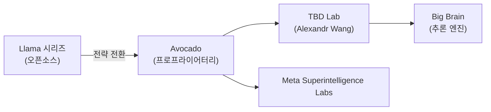
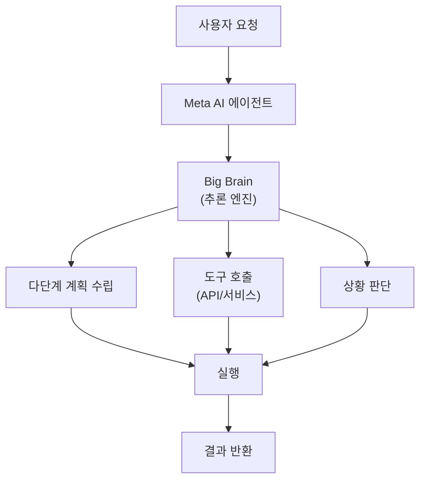
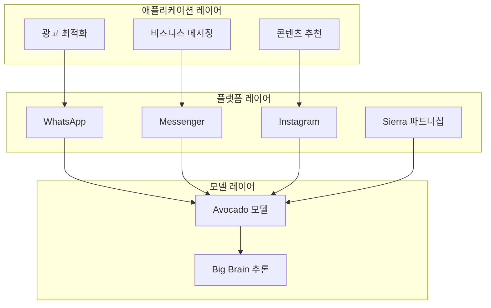

## 개요

Meta가 단순한 소셜 미디어 기업에서 <strong>AI 에이전트 플랫폼 기업</strong>으로 대전환을 시도하고 있습니다. 2025년 말부터 본격화된 이 전략은 세 가지 핵심 키워드로 요약됩니다: 외부 에이전트 파트너십인 <strong>Sierra</strong>, 차세대 프론티어 모델의 내부 코드네임인 <strong>Avocado</strong>, 그리고 고급 추론 능력을 의미하는 <strong>Big Brain</strong>입니다.

이 글에서는 Meta의 AI 전략이 어떻게 변화하고 있는지, 그리고 이것이 개발자와 비즈니스에 어떤 의미를 갖는지 분석합니다.

## Llama에서 Avocado로 — 전략의 대전환

### 오픈소스에서 독점 모델로

Meta는 오랫동안 Llama 모델 시리즈를 통해 <strong>오픈소스 AI</strong>의 선두주자로 자리매김해 왔습니다. 2024년 Mark Zuckerberg는 Llama가 "업계에서 가장 진보된 모델"이 될 것이라고 예측했습니다.

그러나 2025년 4월 Llama 4의 출시가 개발자 커뮤니티에서 기대에 미치지 못하면서 전략 전환의 계기가 되었습니다. Zuckerberg는 2025년 7월 "오픈소스로 공개할 내용에 대해 신중해야 한다"고 언급하며 방향 전환을 시사했습니다.

### Avocado — 차세대 프론티어 모델

<strong>Avocado</strong>는 Meta의 차세대 프론티어 AI 모델의 코드네임입니다. CNBC 보도에 따르면, 이 모델은 다음과 같은 특징을 가집니다:

- <strong>독점(Proprietary) 모델</strong>: 기존 Llama와 달리 가중치를 공개하지 않을 가능성
- <strong>TBD Lab에서 개발</strong>: Scale AI 출신 Alexandr Wang이 이끄는 엘리트 연구 조직
- <strong>2026년 1분기 출시 예정</strong>: OpenAI, Google, Anthropic과의 경쟁 본격화

## Sierra — 외부 에이전트 파트너십

### Sierra AI란?

Sierra AI는 전 Salesforce 공동 CEO이자 OpenAI 이사회 의장인 <strong>Bret Taylor</strong>가 설립한 AI 에이전트 스타트업입니다. 기업용 AI 에이전트 플랫폼을 제공하며, 복잡하고 규제가 많은 비즈니스 환경에서도 에이전트를 빠르게 배포할 수 있는 확장 가능한 플랫폼을 보유하고 있습니다.

### Meta × Sierra의 시너지

Meta가 Sierra와의 파트너십을 추진하는 것은 전략적으로 의미가 큽니다:

| 영역 | Meta의 강점 | Sierra의 강점 |
|------|-----------|-------------|
| <strong>사용자 기반</strong> | 30억+ 일일 사용자 | 기업 고객 네트워크 |
| <strong>AI 모델</strong> | Avocado/Llama | 에이전트 오케스트레이션 |
| <strong>채널</strong> | WhatsApp, Messenger, Instagram | B2B 커뮤니케이션 |
| <strong>데이터</strong> | 소셜 그래프 | 비즈니스 프로세스 |

Meta는 이미 WhatsApp에서 <strong>Business AI</strong>를 통해 주 100만 건 이상의 대화를 처리하고 있으며, 이를 더욱 확장할 계획입니다.

## Big Brain — 고급 추론 엔진

### 추론 능력의 중요성

<strong>Big Brain</strong>은 Meta AI의 고급 추론 기능을 가리키는 것으로 알려져 있습니다. OpenAI의 o1/o3 시리즈나 Google의 Gemini 3가 보여준 것처럼, 단순한 텍스트 생성을 넘어선 <strong>심층 추론(deep reasoning)</strong> 능력은 AI 에이전트의 핵심 경쟁력입니다.

에이전트가 복잡한 비즈니스 태스크를 수행하려면 다음이 필요합니다:

1. <strong>다단계 계획 수립</strong>: 복잡한 요청을 단계별로 분해
2. <strong>도구 활용</strong>: 외부 API와 서비스 호출
3. <strong>상황 판단</strong>: 예외 상황에서의 적절한 의사결정
4. <strong>자기 검증</strong>: 결과의 정확성 확인

Big Brain은 이러한 추론 능력을 Avocado 모델에 내장하여, Meta의 에이전트 생태계를 한 단계 끌어올리는 역할을 합니다.

## Meta의 에이전트 플랫폼 전략 전체 그림

Meta의 AI 에이전트 플랫폼 전략은 세 개의 레이어로 구성됩니다:

### 1. 모델 레이어 (Avocado + Big Brain)

- 차세대 프론티어 모델로 경쟁사 대비 성능 우위 확보
- 추론 능력을 통한 에이전트 자율성 향상

### 2. 플랫폼 레이어 (Sierra + Business AI)

- WhatsApp, Messenger, Instagram을 통한 에이전트 배포
- 기업용 에이전트 SDK 및 API 제공
- 비즈니스 AI 어시스턴트의 글로벌 확장

### 3. 애플리케이션 레이어

- <strong>광고 최적화</strong>: AI 기반 광고 크리에이티브 생성 (2025년 Q4 동영상 생성 도구 매출 $100억 달성)
- <strong>콘텐츠 추천</strong>: 7% 유기적 피드 조회 증가
- <strong>비즈니스 메시징</strong>: 클릭-투-메시지 광고 매출 미국 내 50% 이상 성장

## 개발자에게 미치는 영향

### 주목해야 할 포인트

1. <strong>에이전트 API 생태계</strong>: Meta가 에이전트 SDK를 공개하면, 30억 사용자 대상 에이전트 개발이 가능해집니다
2. <strong>WhatsApp 비즈니스 에이전트</strong>: 이미 멕시코와 필리핀에서 시작된 비즈니스 AI가 글로벌로 확대 예정
3. <strong>Avocado 모델의 성능</strong>: 독점 모델로 전환 시 API 기반 접근이 주요 활용 방식이 될 가능성
4. <strong>Sierra 플랫폼과의 통합</strong>: 기업용 에이전트 개발 시 Sierra의 오케스트레이션 레이어 활용 가능

### 경쟁 구도 변화

| 기업 | 에이전트 전략 | 핵심 모델 |
|------|------------|---------|
| <strong>Meta</strong> | 소셜 플랫폼 기반 에이전트 | Avocado |
| <strong>OpenAI</strong> | ChatGPT + Operator | o3/GPT-5 |
| <strong>Google</strong> | Gemini + Android 통합 | Gemini 3 |
| <strong>Anthropic</strong> | Claude + Agent Teams | Opus 4.6 |
| <strong>Salesforce</strong> | Agentforce + CRM | Einstein |

## 결론

Meta의 AI 에이전트 플랫폼화는 단순한 기술 전환이 아니라 <strong>비즈니스 모델의 근본적 재편</strong>입니다. 광고 수익이라는 든든한 기반 위에서, 30억 사용자를 가진 플랫폼을 에이전트 인프라로 전환하려는 이 시도는 AI 업계의 판도를 바꿀 잠재력을 가지고 있습니다.

Sierra 파트너십으로 기업 에이전트 역량을 강화하고, Avocado로 모델 경쟁력을 확보하며, Big Brain으로 추론 능력을 끌어올리는 이 삼각 전략이 성공한다면, Meta는 소셜 미디어 기업에서 <strong>AI 에이전트 플랫폼의 강자</strong>로 자리매김할 수 있을 것입니다.

2026년 1분기 Avocado 모델의 출시와 Business AI의 글로벌 확장이 그 첫 번째 시험대가 될 것입니다.

## 참고 자료

- [CNBC: From Llamas to Avocados: Meta's shifting AI strategy](https://www.cnbc.com/2025/12/09/meta-avocado-ai-strategy-issues.html)
- [Meta: 2026 AI Drives Performance](https://about.fb.com/news/2026/01/2026-ai-drives-performance/)
- [Sierra AI: Year Two in Review](https://sierra.ai/blog/year-two-in-review)
- [Gadgets360: Meta AI Could Get New Avocado Models, AI Agents](https://www.gadgets360.com/ai/news/meta-ai-avocado-models-ai-agents)
