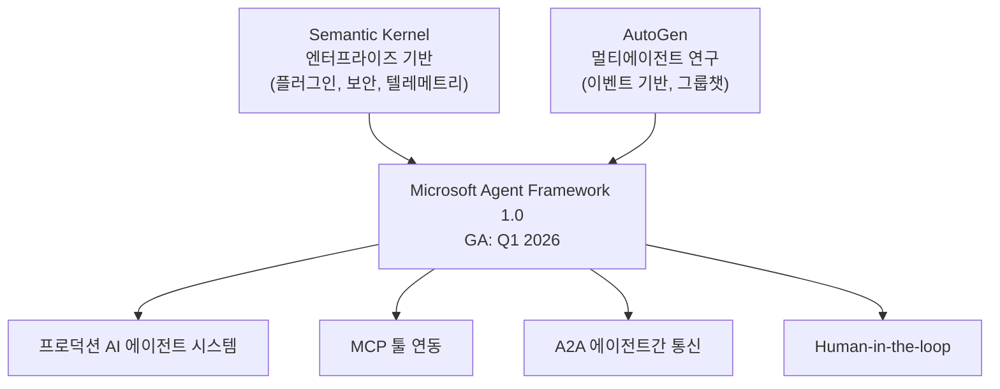
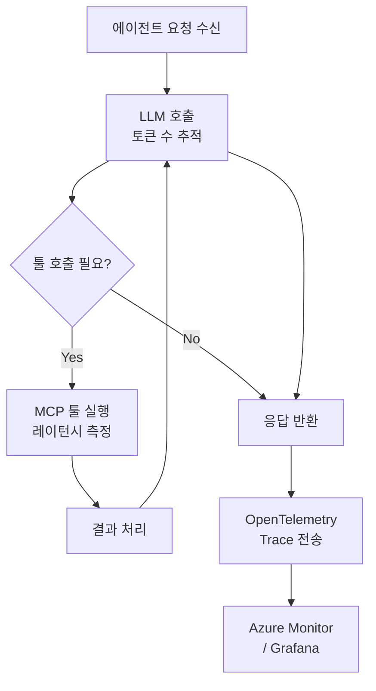
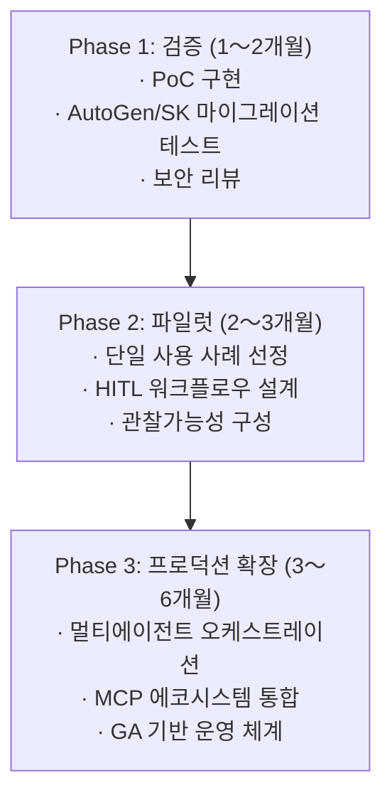

2026년 3월 현재, AI 에이전트 프레임워크 시장에서 가장 주목할 만한 움직임이 완성 단계에 접어들었다. Microsoft가 수년에 걸쳐 각각 발전시켜온 <strong>AutoGen</strong>과 <strong>Semantic Kernel</strong>이 하나의 플랫폼, 즉 <strong>Microsoft Agent Framework</strong>로 통합된 것이다. 2026년 2월 19일 RC(Release Candidate) 1.0이 출시되었고, Q1 2026 GA(General Availability)를 목전에 두고 있다.

이 글은 Engineering Manager 또는 CTO 관점에서, 이 통합이 무엇을 의미하는지, 기존 팀이 어떻게 대응해야 하는지, 그리고 프로덕션 도입을 어떻게 계획해야 하는지를 정리한 것이다.

## 왜 통합인가: 프레임워크 분열의 끝

AutoGen과 Semantic Kernel은 Microsoft 내에서 서로 다른 철학으로 출발했다.

- <strong>AutoGen</strong>: Microsoft Research 주도, 이벤트 기반 멀티에이전트 프레임워크. 에이전트 간 비동기 대화를 강조.
- <strong>Semantic Kernel</strong>: Azure AI 팀 주도, 플러그인 패턴과 엔터프라이즈 기능(텔레메트리, 보안, 메모리)에 강점.

개발자 커뮤니티는 수년간 "둘 중 무엇을 써야 하는가?"라는 질문에 시달렸다. 두 프레임워크는 생태계를 분열시켰고, 기업들은 인력과 학습 비용을 이중으로 부담해야 했다. Microsoft Agent Framework는 이 질문에 명확한 답을 내놓는다: <strong>앞으로는 하나만 있다.</strong>



## Microsoft Agent Framework의 핵심 기능

### 1. 그래프 기반 워크플로우 오케스트레이션

LangGraph처럼 상태를 가진(stateful) 그래프 기반 워크플로우를 지원한다. 순차 실행, 병렬 실행, 조건부 분기를 모두 처리할 수 있으며, <strong>체크포인팅(checkpointing)</strong>으로 장기 실행 워크플로우의 중단/재개가 가능하다.

```python
from microsoft.agents import AgentRuntime, Agent, tool
from microsoft.agents.workflows import SequentialWorkflow, ParallelWorkflow

# 기본 에이전트 정의
@tool
def get_customer_data(customer_id: str) -> dict:
    """CRM에서 고객 데이터 조회"""
    return crm_client.get(customer_id)

# 에이전트 생성
analyst = Agent(
    name="customer_analyst",
    instructions="고객 데이터를 분석하고 위험 점수를 산출합니다.",
    tools=[get_customer_data],
    model="gpt-4o"
)

# 워크플로우 구성 (순차 + 병렬)
workflow = SequentialWorkflow([
    analyst,
    ParallelWorkflow([risk_scorer, compliance_checker]),
    approval_agent  # Human-in-the-loop
])
```

### 2. MCP 및 A2A 프로토콜 네이티브 지원

Microsoft Agent Framework는 처음부터 MCP(Model Context Protocol)와 A2A(Agent-to-Agent) 프로토콜을 지원하도록 설계되었다. 이는 HubSpot, Salesforce, Slack, Azure DevOps 등 수백 개의 MCP 서버와 즉시 연동 가능하다는 것을 의미한다.

```python
from microsoft.agents.mcp import MCPToolServer

# MCP 서버 연결 (예: GitHub MCP)
github_tools = MCPToolServer(
    name="github",
    transport="stdio",
    command=["npx", "@modelcontextprotocol/server-github"]
)

# 에이전트에 MCP 툴 주입
dev_agent = Agent(
    name="dev_assistant",
    instructions="코드 리뷰와 PR 관리를 담당합니다.",
    tools=[*github_tools.get_tools()],
    model="gpt-4o"
)
```

### 3. Human-in-the-loop (HITL) 아키텍처

엔터프라이즈 환경에서 가장 중요한 기능 중 하나가 <strong>승인 워크플로우</strong>다. Microsoft Agent Framework는 에이전트가 특정 임계값을 초과하는 작업을 수행하기 전에 사람의 승인을 받도록 설계할 수 있다.

```python
from microsoft.agents.human import HumanApprovalInterrupt

# 고위험 작업에 Human-in-the-loop 추가
@tool(requires_approval=lambda result: result.get("risk_score", 0) > 0.8)
def execute_transaction(amount: float, account: str) -> dict:
    """금융 트랜잭션 실행 (위험 점수 0.8 초과 시 승인 필요)"""
    return finance_client.transact(amount, account)
```

### 4. YAML 기반 선언적 에이전트 정의

코드 대신 YAML로 에이전트를 정의하면 버전 관리와 팀 협업이 훨씬 쉬워진다.

```yaml
# agents/customer-support.yaml
name: customer_support_agent
instructions: |
  고객 문의를 처리하고, 필요시 적절한 부서로 에스컬레이션합니다.
  응답은 반드시 친절하고 명확해야 합니다.
model: gpt-4o
tools:
  - crm_lookup
  - ticket_create
  - email_send
escalation_policy:
  threshold: 3  # 3번 이상 해결 실패 시 에스컬레이션
  target: human_agent
```

### 5. 프로덕션 등급 관찰가능성

OpenTelemetry 기반의 완전한 텔레메트리가 내장되어 있다. 모든 에이전트 동작, 툴 호출, 오케스트레이션 단계가 자동으로 추적된다.



## EM/CTO가 알아야 할 전략적 포인트

### 1. AutoGen 또는 Semantic Kernel을 이미 사용 중이라면

Microsoft는 명확한 마이그레이션 가이드를 제공하고 있다. 두 프레임워크 모두 v1.x 보안 패치는 계속 제공되지만, <strong>신규 기능은 Microsoft Agent Framework에만 추가</strong>된다. 6〜12개월 내 마이그레이션을 권장한다.

| 기존 프레임워크 | 핵심 변경점 |
|---|---|
| Semantic Kernel | 플러그인(Plugin) → Tool, Kernel → AgentRuntime |
| AutoGen | AssistantAgent → Agent, GroupChat → Workflow |
| 공통 | 벡터 스토어 통합 그대로 유지 |

### 2. 완전히 새로 시작하는 팀

Microsoft 생태계(Azure AI, Microsoft 365, Copilot Studio)에 깊이 투자한 조직이라면 Microsoft Agent Framework가 <strong>가장 자연스러운 선택</strong>이다. Azure AI Foundry와의 완전한 통합, Entra ID 인증, 컴플라이언스 지원은 다른 프레임워크에서 구현하기 어려운 엔터프라이즈 기능이다.

반면 AWS나 GCP 기반 조직, 또는 Python-native 팀이라면 LangGraph 또는 CrewAI가 더 적합할 수 있다. <strong>선택은 기술 스택이 아닌 조직 생태계를 기준으로 해야 한다.</strong>

### 3. Q1 2026 GA 이전 주의사항

RC 단계에서 GA 전환 시 마이너 브레이킹 체인지가 있을 수 있다. 프로덕션 배포는 GA 공식 발표 이후로 미루는 것이 안전하다. 지금은 <strong>PoC(개념 검증)와 내부 실험 단계</strong>로 활용하는 것이 적절하다.

### 4. 실제 도입 기업 사례

Microsoft Agent Framework는 이미 여러 글로벌 기업이 검증 중이다:

- <strong>KPMG</strong>: 감사 자동화 — 에이전트가 재무 데이터 이상 감지 후 HITL 승인 워크플로우 연동
- <strong>BMW</strong>: 차량 텔레메트리 분석 — 멀티에이전트가 센서 데이터를 병렬 처리
- <strong>Commerzbank</strong>: 고객 지원 자동화 — MCP를 통한 CRM/ERP 연동
- <strong>Fujitsu</strong>: 엔터프라이즈 IT 운영 자동화 — 선언적 YAML 기반 에이전트 오케스트레이션

## 팀 도입 로드맵 (3단계)



<strong>Phase 1 — 검증 (1〜2개월)</strong>: GA 발표 직후 간단한 PoC를 구현한다. 기존 AutoGen/SK 코드를 마이그레이션하여 호환성을 확인한다. 보안 팀과 함께 Azure AI Foundry 통합 및 Entra ID 연동을 검토한다.

<strong>Phase 2 — 파일럿 (2〜3개월)</strong>: 실제 비즈니스 임팩트가 있는 사용 사례 하나를 선정한다(예: 고객 지원 에스컬레이션 자동화). HITL 임계값을 정의하고, OpenTelemetry 대시보드를 설정한다.

<strong>Phase 3 — 프로덕션 확장</strong>: 파일럿 성과를 기반으로 멀티에이전트 아키텍처를 확장한다. MCP 에코시스템(CRM, ERP, BI 툴)과의 통합을 체계화한다.

## 결론

Microsoft Agent Framework는 단순한 프레임워크 업그레이드가 아니다. 이것은 Microsoft가 엔터프라이즈 AI 에이전트 시장에서 <strong>단일 플랫폼 전략</strong>을 선언한 것이다.

AutoGen 또는 Semantic Kernel을 사용하는 팀이라면 지금이 바로 마이그레이션 계획을 세울 시점이다. 새로 시작하는 팀이라면 Microsoft 생태계 내에서 Microsoft Agent Framework는 사실상 디폴트 선택이 되었다.

중요한 것은 기술 선택이 아닌 <strong>조직의 AI 에이전트 역량 내재화</strong>다. 어떤 프레임워크를 선택하더라도, HITL 설계, 관찰가능성 구축, 점진적 롤아웃 원칙은 동일하게 적용된다.

## 참고 자료

- [Microsoft Agent Framework 공식 발표 (Microsoft Foundry Blog)](https://devblogs.microsoft.com/foundry/introducing-microsoft-agent-framework-the-open-source-engine-for-agentic-ai-apps/)
- [Microsoft Agent Framework RC 릴리즈 노트 (InfoQ)](https://www.infoq.com/news/2026/02/ms-agent-framework-rc/)
- [Semantic Kernel → Microsoft Agent Framework 마이그레이션 가이드](https://devblogs.microsoft.com/semantic-kernel/migrate-your-semantic-kernel-and-autogen-projects-to-microsoft-agent-framework-release-candidate/)
- [Microsoft Learn: Agent Framework Overview](https://learn.microsoft.com/en-us/agent-framework/overview/)
- [AutoGen GitHub Discussion #7066](https://github.com/microsoft/autogen/discussions/7066)
