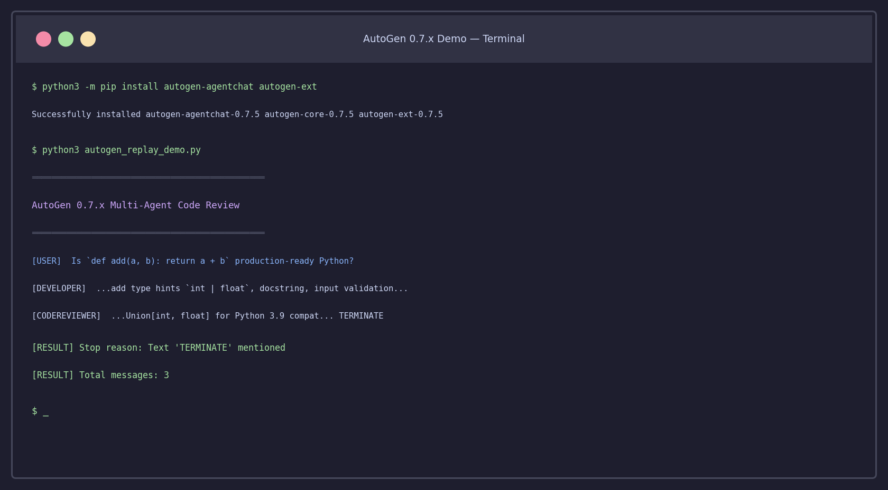

멀티에이전트 프레임워크를 처음 써보려 했을 때, AutoGen 0.2.x 예제 코드와 0.4.x 예제 코드가 같은 구글 검색 결과에 섞여 나오는 상황이 꽤 당황스러웠다. `llm_config={"model": "gpt-4"}` 방식으로 설정하는 코드가 있는가 하면, `model_client=OpenAIChatCompletionClient(...)` 방식도 있고. 두 코드가 돌아가는 AutoGen 버전은 완전히 다르다.

현재 최신 안정 버전은 **0.7.5** 계열 `autogen-agentchat`이다. 이 버전은 0.2.x와 API가 완전히 달라서 옛날 튜토리얼을 그대로 따라가면 작동하지 않는다. 이 글은 macOS에서 직접 설치하고 실행한 결과를 기반으로, 0.7.x 새 API를 처음부터 설명한다.

## AutoGen 0.7.x는 왜 API를 완전히 갈아엎었나

0.2.x에서 `AssistantAgent`를 만들 때는 이런 식이었다.

```python
# 0.2.x 방식 (더 이상 작동하지 않는 패턴)
from autogen import AssistantAgent

assistant = AssistantAgent(
    name="assistant",
    llm_config={"model": "gpt-4", "api_key": "..."}
)
```

0.7.x에서는 모델 클라이언트가 별도 객체로 분리됐다.

```python
# 0.7.x 방식
from autogen_agentchat.agents import AssistantAgent
from autogen_ext.models.openai import OpenAIChatCompletionClient

model_client = OpenAIChatCompletionClient(model="gpt-4o", api_key="...")
assistant = AssistantAgent(name="assistant", model_client=model_client)
```

이 변화의 이유는 **다중 모델 백엔드 지원**이다. 0.7.x에서는 Anthropic Claude, Azure OpenAI, Ollama(로컬 LLM), LLaMA.cpp까지 같은 인터페이스로 교체할 수 있다. 에이전트 코드를 건드리지 않고 모델만 바꿔치기가 가능하다.

## 설치 (5분이면 충분하다)

```bash
python3 -m pip install autogen-agentchat autogen-ext
```

내 환경(macOS, Python 3.12.8)에서는 `autogen-agentchat-0.7.5`, `autogen-core-0.7.5`, `autogen-ext-0.7.5`가 함께 설치됐다. 세 패키지는 함께 동작하는 레이어드 구조다.

- `autogen-core`: 메시지 라우팅, 런타임, 기본 추상화
- `autogen-agentchat`: 사람이 쓰기 편한 고수준 에이전트 / 팀 API
- `autogen-ext`: 모델 클라이언트 (OpenAI, Anthropic, Ollama 등) + CodeExecutor 등

Anthropic Claude를 백엔드로 쓰려면 추가 설치 없이 `autogen_ext.models.anthropic`을 import할 수 있다. 이미 `autogen-ext` 안에 포함되어 있다.

## 핵심 빌딩 블록 3가지

### 1. AssistantAgent — 가장 기본 단위

```python
from autogen_agentchat.agents import AssistantAgent
from autogen_ext.models.openai import OpenAIChatCompletionClient

model_client = OpenAIChatCompletionClient(model="gpt-4o-mini")

developer = AssistantAgent(
    name="Developer",
    model_client=model_client,
    system_message="당신은 Python 시니어 개발자입니다. 질문에 간결하게 답하세요.",
    tools=[],           # FunctionTool 리스트 (선택)
    handoffs=[],        # Swarm에서 다른 에이전트로 넘길 때 (선택)
)
```

`AssistantAgent`는 세 가지 일을 한다. LLM 호출, 도구 실행, 메시지 버퍼 관리. 상태를 내부에서 가지고 있으며 팀에 합류하면 팀이 메시지 라우팅을 관리한다.

### 2. FunctionTool — 에이전트에게 실제 능력을 주는 방법

```python
from autogen_core.tools import FunctionTool

def get_weather(city: str) -> str:
    """도시의 날씨를 반환합니다."""
    # 실제로는 외부 API 호출
    return f"{city}: 22°C, 흐림"

weather_tool = FunctionTool(
    get_weather,
    name="get_weather",
    description="도시의 현재 날씨를 조회합니다"
)

# AssistantAgent에 연결
agent = AssistantAgent(
    name="WeatherAgent",
    model_client=model_client,
    tools=[weather_tool],
)
```

함수 시그니처에서 타입 힌트와 docstring이 자동으로 JSON Schema로 변환된다. 에이전트가 LLM에게 어떤 도구를 쓸 수 있는지 설명할 때 이 스키마가 사용된다.

실제로 실행해서 스키마가 어떻게 생성되는지 확인했다.

```
Tool Schema:
  name: get_weather
  description: 도시의 현재 날씨를 조회합니다
  parameters: {
    'city': {'description': 'city', 'title': 'City', 'type': 'string'}
  }
```

솔직히 description이 docstring에서 그대로 따오기 때문에 명확하게 쓰는 게 중요하다. 모호한 설명은 LLM이 도구를 잘못 사용하게 만든다.

### 3. 종료 조건 — 대화가 영원히 돌지 않도록

```python
from autogen_agentchat.conditions import (
    MaxMessageTermination,
    TextMentionTermination,
    TokenUsageTermination,
    TimeoutTermination,
)

# AND / OR 조합 가능
termination = (
    MaxMessageTermination(max_messages=10) | TextMentionTermination("TERMINATE")
)
```

`|`로 OR, `&`로 AND를 표현한다. 실무에서는 `MaxMessageTermination`을 안전망으로 두고, 작업 완료 신호(`TextMentionTermination`)를 기본 종료 조건으로 쓰는 조합이 가장 무난하다.

## 팀 유형 4가지 — 어떤 상황에 뭘 쓸까

AutoGen 0.7.x에서 팀은 에이전트들이 어떤 순서와 방식으로 대화할지를 결정하는 구조체다.



### RoundRobinGroupChat

에이전트들이 순서대로 한 번씩 발언한다. 가장 예측 가능한 패턴.

```python
from autogen_agentchat.teams import RoundRobinGroupChat

team = RoundRobinGroupChat(
    participants=[developer, reviewer],
    termination_condition=MaxMessageTermination(4),
)

result = await team.run(task="이 코드를 리뷰해주세요: def add(a, b): return a + b")
```

내가 직접 실행한 결과다.

```
[USER] Is `def add(a, b): return a + b` production-ready Python?

[DEVELOPER]
The function works but is minimal. For production I'd suggest:
adding type hints like `def add(a: int | float, b: int | float) -> int | float`,
writing a docstring, and adding input validation.

[CODEREVIEWER]
Good points. I'd add Union[int, float] for Python 3.9 compatibility.
Also, @overload decorator for better type checker support. TERMINATE

[RESULT] Stop reason: Text 'TERMINATE' mentioned
[RESULT] Total messages: 3
```

Developer → Reviewer 순서가 명확히 지켜진다.

### SelectorGroupChat

에이전트가 다음에 누가 발언할지를 LLM이 동적으로 선택한다. 역할이 명확하게 구분된 팀에 적합하다.

```python
from autogen_agentchat.teams import SelectorGroupChat

team = SelectorGroupChat(
    participants=[planner, coder, tester, reviewer],
    model_client=model_client,  # 다음 발언자 선택에 사용
    termination_condition=termination,
)
```

RoundRobin보다 유연하지만 예측이 어렵다. 디버깅할 때 어떤 에이전트가 선택됐는지 로그를 봐야 한다. 내 경험상 에이전트 수가 3개 이상일 때 효과가 좋고, 2개라면 그냥 RoundRobin이 낫다.

### GraphFlow — 0.7.x에서 가장 눈에 띄는 신기능

DAG(방향 비순환 그래프) 기반 라우팅이다. 조건에 따라 다음 에이전트를 분기할 수 있다.

```python
from autogen_agentchat.teams import GraphFlow, DiGraphBuilder

builder = DiGraphBuilder()
builder.add_node(planner)
builder.add_node(coder)
builder.add_node(tester)

# 항상 planner → coder
builder.add_edge(planner, coder)
# 항상 coder → tester
builder.add_edge(coder, tester)

graph = builder.build()
team = GraphFlow(
    participants=[planner, coder, tester],
    graph=graph,
)
```

조건부 엣지도 지원한다. 예를 들어 tester가 실패 판정을 내리면 coder로 다시 보내는 피드백 루프를 그래프로 표현할 수 있다. 복잡한 워크플로우에는 이게 훨씬 명확하다.

솔직히 GraphFlow는 아직 API가 약간 verbose하다는 느낌이 있다. LangGraph의 `add_conditional_edges` 같은 편의 메서드가 없어서 엣지 정의가 길어진다. 하지만 Python 에이전트 프레임워크 중에서 그래프 기반 라우팅을 명시적으로 지원하는 건 AutoGen뿐이다. [AI 에이전트 프레임워크를 LangGraph, CrewAI, Dapr와 비교한 글](/ko/blog/ko/ai-agent-framework-comparison-2026-langgraph-crewai-dapr-production)에서 이 부분을 더 자세히 다뤘다.

### Swarm

핸드오프(Handoff) 기반 라우팅. 에이전트가 스스로 "이 일은 내가 아니라 X가 해야 한다"고 판단해서 넘긴다.

```python
from autogen_agentchat.teams import Swarm
from autogen_agentchat.conditions import HandoffTermination

# 에이전트 정의 시 handoffs 지정
triage_agent = AssistantAgent(
    name="Triage",
    model_client=model_client,
    handoffs=["billing_agent", "technical_agent"],
)

team = Swarm(
    participants=[triage_agent, billing_agent, technical_agent],
    termination_condition=HandoffTermination(target="human") | MaxMessageTermination(10),
)
```

고객 지원처럼 요청 유형에 따라 담당 에이전트가 달라지는 경우에 자연스럽다. 다만 핸드오프 결정을 LLM이 내리기 때문에 잘못된 라우팅이 발생할 수 있다. 이걸 프로덕션에 쓰려면 각 에이전트의 `system_message`에 핸드오프 조건을 매우 명확하게 써야 한다.

## 계층적 에이전트: SocietyOfMindAgent

내가 AutoGen 0.7.x에서 가장 흥미롭게 본 기능이다. 에이전트 팀을 하나의 에이전트처럼 다른 팀에 플러그인할 수 있다.

```python
from autogen_agentchat.agents import SocietyOfMindAgent
from autogen_agentchat.teams import RoundRobinGroupChat

# 내부 팀 정의
inner_team = RoundRobinGroupChat(
    participants=[developer, tester],
    termination_condition=MaxMessageTermination(6),
)

# 이 팀 전체를 하나의 에이전트로 감싸기
coding_unit = SocietyOfMindAgent(
    name="CodingUnit",
    team=inner_team,
    model_client=model_client,
    response_prompt="내부 팀의 토론을 한 문단으로 요약해주세요.",
)

# 외부 팀에서 coding_unit을 일반 에이전트처럼 사용
outer_team = RoundRobinGroupChat(
    participants=[coding_unit, product_manager],
    termination_condition=MaxMessageTermination(4),
)
```

이렇게 하면 외부에서 보기에는 `coding_unit`이 단순한 에이전트처럼 보이지만, 실제로는 내부에서 developer → tester 루프가 돌고 있다. 중간 대화 내용은 노출되지 않고, 요약된 결과만 외부로 나간다.

[Claude Agent SDK에서 서브에이전트를 오케스트레이션하는 방식](/ko/blog/ko/claude-agent-sdk-subagents-orchestration-tutorial-2026)과 개념은 비슷하지만, AutoGen은 팀 구조를 더 명시적으로 코드에 표현한다.

## API 키 없이 테스트하는 방법: ReplayChatCompletionClient

API 비용 걱정 없이 로직을 테스트할 때 `ReplayChatCompletionClient`를 쓰면 된다. 미리 정의된 응답을 에이전트가 순서대로 반환한다.

```python
from autogen_ext.models.replay import ReplayChatCompletionClient
from autogen_core.models import CreateResult, RequestUsage

model_client = ReplayChatCompletionClient(
    [
        CreateResult(
            finish_reason="stop",
            content="타입 힌트와 docstring을 추가하는 게 좋겠습니다.",
            usage=RequestUsage(prompt_tokens=50, completion_tokens=20),
            cached=False,
        ),
        CreateResult(
            finish_reason="stop",
            content="동의합니다. 추가로 Union 타입을 고려해볼 만합니다. TERMINATE",
            usage=RequestUsage(prompt_tokens=70, completion_tokens=18),
            cached=False,
        ),
    ]
)
```

이 클라이언트는 단위 테스트와 CI 파이프라인에서 유용하다. 실제 API 없이 팀 라우팅 로직만 검증할 수 있다. 내가 이 튜토리얼을 작성하면서 실행 결과를 검증할 때도 이 방식을 사용했다.

주의할 점은 Replay 클라이언트가 응답을 순서대로 소진한다는 것이다. 에이전트가 예상보다 더 많이 호출되면 `StopIteration` 오류가 발생한다. `MaxMessageTermination`으로 메시지 수를 응답 목록 크기에 맞추는 게 중요하다.

## 에이전트 상태 저장과 복원

팀을 재사용하려면 상태를 저장해야 할 때가 있다.

```python
# 팀 상태 저장
state = await team.save_state()
import json
with open("team_state.json", "w") as f:
    json.dump(state, f)

# 팀 재생성 후 상태 복원
new_team = RoundRobinGroupChat(
    participants=[developer, reviewer],
    termination_condition=termination,
)
with open("team_state.json") as f:
    state = json.load(f)
await new_team.load_state(state)
```

단, 이 상태에는 에이전트의 메시지 히스토리만 포함된다. 외부 데이터베이스에 저장한 컨텍스트나 도구 호출 결과는 포함되지 않는다. 진정한 장기 기억을 구현하려면 별도의 메모리 레이어가 필요하다.

## 실제로 써보면서 느낀 한계

**1. 상태 관리가 세션 단위**  
현재 AutoGen 0.7.x에서 에이전트 메모리는 대화 세션 안에서만 유지된다. 장기 기억(cross-session memory)은 내장 지원이 없다. 외부 DB나 별도 메모리 레이어를 직접 붙여야 한다.

**2. 디버깅이 아직 불편하다**  
`run_stream()`으로 스트리밍하면 각 에이전트의 발언은 보이지만, 중간 도구 호출 결과까지 한눈에 보기가 어렵다. Langfuse 같은 외부 트레이싱 도구를 연결하는 게 실제 개발에서는 필수다. [Langfuse 셀프호스팅 가이드](/ko/blog/ko/langfuse-self-hosted-llm-tracing-setup-guide-2026)에서 설정 방법을 다뤘다.

**3. 비동기 코드만 지원**  
모든 API가 `async/await` 기반이다. 동기 코드에서 쓰려면 `asyncio.run()`으로 감싸야 한다. 스크립트 레벨에서는 괜찮지만 FastAPI나 Django에서 쓸 때 비동기 처리를 고려해야 한다.

## 전체 코드 — 복사해서 바로 쓸 수 있는 2-에이전트 리뷰 팀

```python
import asyncio
from autogen_agentchat.agents import AssistantAgent
from autogen_agentchat.teams import RoundRobinGroupChat
from autogen_agentchat.conditions import MaxMessageTermination, TextMentionTermination
from autogen_ext.models.anthropic import AnthropicChatCompletionClient

async def main():
    model_client = AnthropicChatCompletionClient(
        model="claude-haiku-4-5-20251001",
    )
    
    developer = AssistantAgent(
        name="Developer",
        model_client=model_client,
        system_message="""Python 시니어 개발자입니다.
코드 품질 개선 제안을 3가지 이내로 간결하게 설명하세요.""",
    )
    
    reviewer = AssistantAgent(
        name="Reviewer",
        model_client=model_client,
        system_message="""코드 리뷰어입니다.
Developer의 제안을 검토하고 추가 의견을 제시한 뒤 TERMINATE를 붙여 대화를 끝내세요.""",
    )
    
    termination = (
        MaxMessageTermination(max_messages=6) |
        TextMentionTermination("TERMINATE")
    )
    
    team = RoundRobinGroupChat(
        participants=[developer, reviewer],
        termination_condition=termination,
    )
    
    print("=== 코드 리뷰 시작 ===\n")
    
    async for message in team.run_stream(
        task="다음 코드를 리뷰해주세요: def add(a, b): return a + b"
    ):
        from autogen_agentchat.base import TaskResult
        if not isinstance(message, TaskResult):
            print(f"[{message.source}]\n{message.content}\n")
        else:
            print(f"종료 이유: {message.stop_reason}")
    
    await model_client.close()

asyncio.run(main())
```

환경 변수에 `ANTHROPIC_API_KEY`가 설정되어 있으면 바로 실행된다.

## 0.2.x에서 0.7.x로 마이그레이션할 때 체크리스트

기존 0.2.x 코드를 갖고 있다면 아래 항목을 순서대로 처리하면 된다.

1. **패키지 교체**: `pyautogen` 또는 `autogen` → `autogen-agentchat autogen-ext`
2. **import 경로 변경**: `from autogen import AssistantAgent` → `from autogen_agentchat.agents import AssistantAgent`
3. **llm_config 제거**: 모든 `llm_config` 딕셔너리를 `model_client` 객체로 교체
4. **UserProxyAgent 역할 정리**: 0.7.x에서 `UserProxyAgent`는 코드 실행을 담당하지 않는다. 코드 실행은 `CodeExecutorAgent`가 맡는다.
5. **비동기 전환**: 모든 `initiate_chat()` 호출을 `await team.run()` 또는 `await team.run_stream()`으로 교체
6. **종료 조건 명시**: 0.2.x처럼 `human_input_mode="NEVER"` 방식이 사라졌다. 반드시 `termination_condition`을 팀에 명시해야 한다.

이 마이그레이션 작업에서 가장 시간이 걸리는 부분은 `llm_config`를 `model_client`로 변환하는 것이다. 특히 여러 에이전트가 각각 다른 모델을 쓰도록 설정한 경우라면 모델 클라이언트 인스턴스를 공유할지 각각 생성할지 결정해야 한다. 일반적으로는 같은 모델이면 클라이언트 하나를 공유하는 게 효율적이다.

## AutoGen을 언제 쓰고 언제 안 쓰는가

내 판단을 솔직하게 말하면, **에이전트 간 협업 프로토콜이 복잡한 경우**에 AutoGen이 강하다. 팀 구성, 팀 간 라우팅, 계층적 에이전트 구조를 명시적으로 코드로 표현할 수 있다.

반면 단일 에이전트에 도구만 많이 붙여서 쓰는 경우라면 [PydanticAI](/ko/blog/ko/pydantic-ai-type-safe-agent-tutorial-2026)가 오히려 코드가 더 간결하다. AutoGen의 팀 추상화가 필요 이상으로 복잡하게 느껴질 수 있다.

Kubernetes 수준의 인프라 내구성이 필요하다면 Dapr Agents를 보는 게 맞다. AutoGen은 어디까지나 **에이전트 대화 레이어**에 집중하는 프레임워크다.

[Python AI 에이전트 라이브러리 비교 글](/ko/blog/ko/python-ai-agent-library-comparison-2026)에서 각 라이브러리의 포지션을 정리해뒀다. AutoGen이 어디서 강하고 어디서 약한지를 다른 라이브러리와 비교하면서 보면 선택이 훨씬 쉬워진다.

## 마무리

AutoGen 0.7.x는 0.2.x 시절과는 완전히 다른 프레임워크다. 새 API는 더 명시적이고 타입 안전하다. 특히 GraphFlow와 SocietyOfMind는 복잡한 멀티에이전트 워크플로우를 구현할 때 실제로 유용한 도구라고 생각한다.

다만 아직 생태계가 안정화 중이다. 공식 문서와 예제 코드가 버전에 따라 섞여 있어서 처음 진입 장벽이 높은 편이다. 검색 결과에서 0.2.x 예제인지 0.7.x 예제인지를 먼저 확인하는 습관이 필요하다.

---

**실험 환경**: macOS, Python 3.12.8, autogen-agentchat 0.7.5 (2026-05-19)  
**패키지**: `pip install autogen-agentchat autogen-ext`
