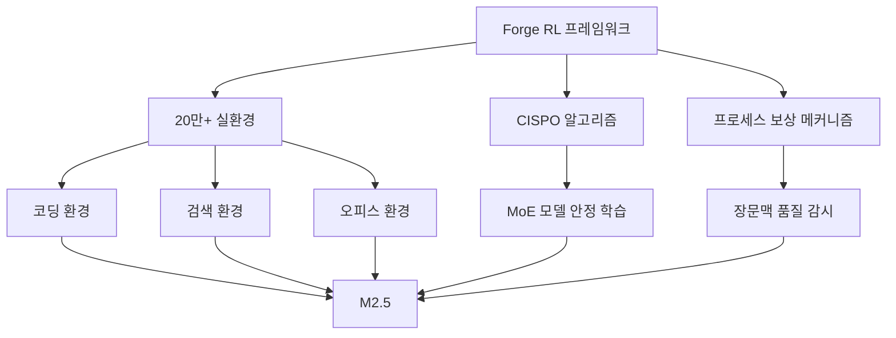
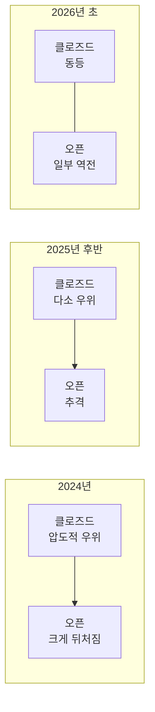

## 오픈 웨이트 모델의 역습이 시작됐다

2026년 2월, AI 업계에 충격적인 소식이 전해졌습니다. 중국 AI 스타트업 MiniMax가 공개한 <strong>MiniMax M2.5</strong>가 코딩, 에이전트 태스크, 검색 등 여러 벤치마크에서 <strong>프로프라이어터리 모델을 상회하는 점수</strong>를 기록한 것입니다.

Reddit r/LocalLLaMA에서 362포인트 이상의 주목을 받으며, "오픈 웨이트 모델이 마침내 클로즈드 모델을 따라잡았다"는 논의가 활발해지고 있습니다. 이 글에서는 M2.5의 구체적인 성능 데이터와 오픈 vs 클로즈드 모델의 구도 변화를 상세히 분석합니다.

## MiniMax M2.5 주요 스펙

MiniMax M2.5는 229B 파라미터의 오픈 웨이트 모델로, HuggingFace에서 자유롭게 다운로드할 수 있습니다.

- <strong>파라미터 수</strong>: 229B (MoE 아키텍처)
- <strong>학습 방식</strong>: 20만 개 이상의 실제 환경에서 강화학습(RL)
- <strong>추론 속도</strong>: 100 토큰/초 (Lightning 버전)
- <strong>지원 언어</strong>: Go, C, C++, TypeScript, Rust, Python, Java 등 10개 이상
- <strong>배포 지원</strong>: SGLang, vLLM, Transformers, KTransformers

## 벤치마크 비교: 클로즈드 모델과의 격차가 거의 제로로

### SWE-Bench Verified (코딩)

SWE-Bench Verified는 실제 GitHub 이슈를 해결하는 능력을 측정하는 벤치마크입니다.

| 모델 | 점수 | 유형 |
|------|------|------|
| <strong>MiniMax M2.5</strong> | <strong>80.2%</strong> | 오픈 웨이트 |
| Claude Opus 4.6 | — | 프로프라이어터리 |
| MiniMax M2.1 | — | 오픈 웨이트 |

다양한 에이전트 하네스에서의 테스트 결과도 주목할 만합니다:

- <strong>Droid 하네스</strong>: M2.5 (79.7%) > Opus 4.6 (78.9%)
- <strong>OpenCode 하네스</strong>: M2.5 (76.1%) > Opus 4.6 (75.9%)

어느 환경에서든 오픈 웨이트 모델이 프로프라이어터리 모델을 <strong>근소한 차이로 앞서는</strong> 역사적인 결과입니다.

### Multi-SWE-Bench (멀티 리포지토리)

여러 리포지토리에 걸치는 태스크에서 <strong>51.3%</strong>를 달성했습니다. 더 복잡한 실무 시나리오에서도 높은 성능을 보여주고 있습니다.

### BrowseComp (검색·도구 사용)

웹 검색과 도구 호출 능력을 측정하는 BrowseComp에서 <strong>76.3%</strong>(컨텍스트 관리 포함)를 기록하며 업계 최고 수준에 도달했습니다.

## 비용 혁명: 성능뿐 아니라 가격에서도 압도

M2.5의 충격은 성능만이 아닙니다. <strong>비용 대비 성능</strong>이 차원이 다릅니다.

| 항목 | M2.5 Lightning | M2.5 Standard |
|------|---------------|---------------|
| 입력 가격 | $0.3/100만 토큰 | $0.15/100만 토큰 |
| 출력 가격 | $2.4/100만 토큰 | $1.2/100만 토큰 |
| 추론 속도 | 100 TPS | 50 TPS |
| 1시간 연속 가동 비용 | $1.0 | $0.3 |

Claude Opus, Gemini 3 Pro, GPT-5와 비교하면 출력 토큰 단가 기준 <strong>10분의 1에서 20분의 1</strong> 수준의 비용입니다.

## M2.5가 이렇게 빠르게 진화할 수 있었던 이유

### 대규모 강화학습 (RL Scaling)

MiniMax는 자체 개발한 「<strong>Forge</strong>」라는 에이전트 네이티브 RL 프레임워크를 활용했습니다.

주요 기술적 포인트:

- <strong>비동기 스케줄링 최적화</strong>: 시스템 처리량과 샘플 오프폴리시 정도의 균형 최적화
- <strong>트리 구조 머지 전략</strong>: 학습 샘플 결합으로 약 <strong>40배 학습 속도 향상</strong>
- <strong>CISPO 알고리즘</strong>: MoE 모델의 대규모 학습 안정성 확보
- <strong>프로세스 보상</strong>: 에이전트 롤아웃의 긴 컨텍스트에서 크레딧 할당 문제 해결

### Spec-Writing 능력의 창발

M2.5의 특기할 점은 코드를 작성하기 전에 <strong>아키텍트처럼 설계·계획하는 능력</strong>이 학습 중 자연스럽게 나타난 것입니다. 프로젝트의 기능, 구조, UI 디자인을 사전에 분해·계획한 후 코딩에 들어가므로, 보다 실무에 가까운 개발이 가능합니다.

## 오픈 vs 클로즈드 구도 변화

### 역사적인 전환점

지금까지 AI 업계에서는 "최고 성능의 모델은 항상 프로프라이어터리"라는 암묵적 합의가 있었습니다. 하지만 M2.5의 등장으로 상황이 크게 바뀌고 있습니다.

### 기업에게 의미하는 것

1. <strong>벤더 록인 회피</strong>: 오픈 웨이트 모델로 프론티어 성능을 얻을 수 있다면 특정 API 벤더 의존을 줄일 수 있음
2. <strong>커스터마이즈 자유</strong>: 자사 데이터로 파인튜닝, 도메인 특화 가능
3. <strong>비용 최적화</strong>: 셀프 호스팅을 통한 비용 관리, M2.5 API 이용 시에도 1/10~1/20 비용
4. <strong>데이터 프라이버시</strong>: 기밀 데이터를 외부에 전송할 필요 없음

## M2 시리즈의 급속한 진화

불과 3.5개월(2025년 10월 말~2026년 2월) 만에 MiniMax는 M2, M2.1, M2.5 세 세대를 릴리스했습니다.

| 버전 | 릴리스 시기 | SWE-Bench 개선 | 특기 사항 |
|------|-----------|--------------|----------|
| M2 | 2025년 10월 말 | 베이스라인 | HuggingFace 450K 다운로드 |
| M2.1 | 2025년 12월 | 대폭 개선 | 86.7K 다운로드 |
| M2.5 | 2026년 2월 | 80.2% SOTA | 37% 고속화, 비용 1/10 |

## 사내 실전 도입

MiniMax는 자사에서도 M2.5를 적극 활용하고 있습니다:

- <strong>전사 태스크의 30%</strong>를 M2.5가 자율적으로 완료
- R&D, 프로덕트, 영업, HR, 재무 등 전 부서에 걸친 활용
- <strong>신규 커밋 코드의 80%</strong>가 M2.5 생성

## 마무리: 알아야 할 3가지 포인트

1. <strong>성능 격차 소멸</strong>: 오픈 웨이트 모델이 SWE-Bench에서 클로즈드 모델을 넘어섰다. 이는 일시적 현상이 아닌 구조적 변화의 시작

2. <strong>비용 혁명</strong>: M2.5는 Opus 대비 1/10~1/20 비용으로 동등 이상의 성능을 제공. "비용 걱정 없는 프론티어 모델"이 현실로

3. <strong>선택지 확대</strong>: 기업은 더 이상 프로프라이어터리 모델 일택이 아닙니다. 오픈 웨이트 모델을 통한 셀프 호스팅, 커스터마이즈, 비용 최적화가 실용적인 선택지로

## 참고 자료

- [MiniMax M2.5 - HuggingFace](https://huggingface.co/MiniMaxAI/MiniMax-M2.5)
- [MiniMax Agent](https://agent.minimax.io/)
- [MiniMax API Platform](https://platform.minimax.io/)
- [Reddit r/LocalLLaMA Discussion](https://www.reddit.com/r/LocalLLaMA/)
