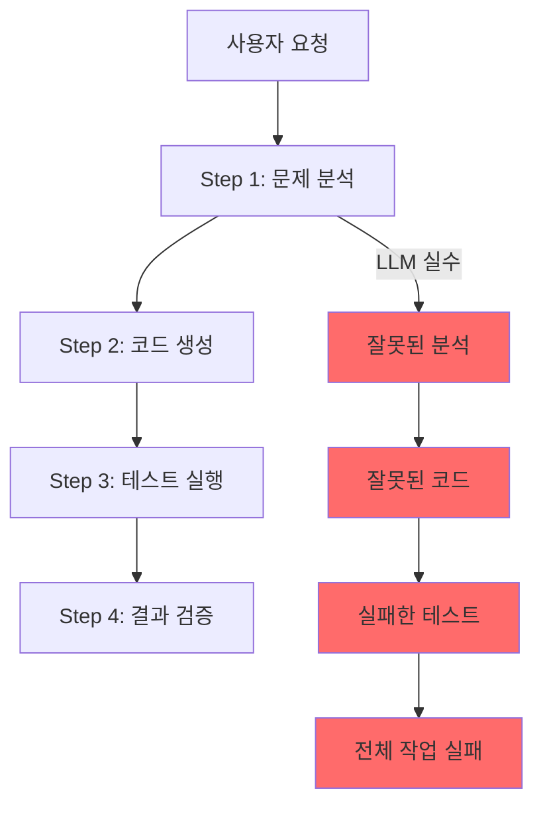
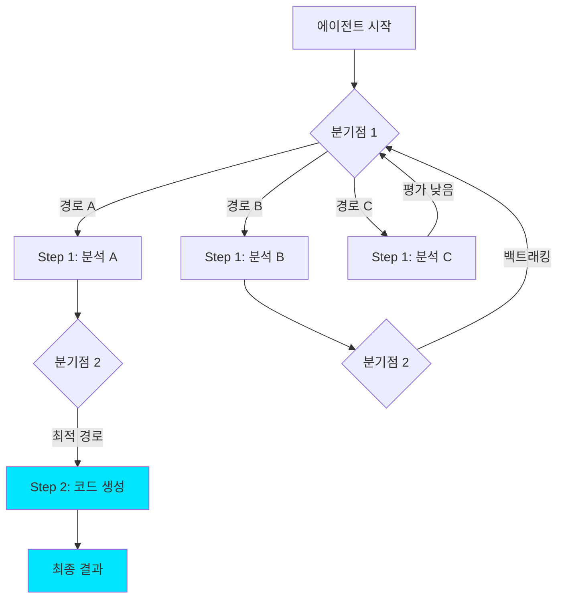
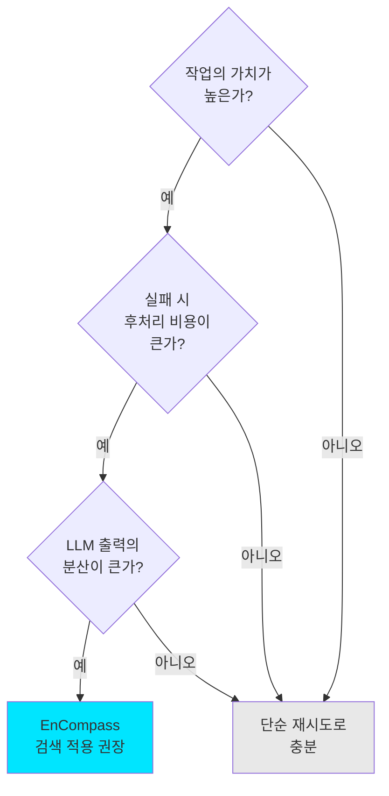

## 개요

2026년, AI 에이전트가 프로덕션 환경에서 점점 더 많은 역할을 맡고 있지만, <strong>신뢰성</strong>이라는 근본적인 과제는 여전히 해결되지 않고 있습니다. LLM 기반 에이전트는 본질적으로 확률적이기 때문에 같은 작업을 시켜도 매번 다른 결과를 내놓을 수 있고, 한 단계에서의 실수가 이후 모든 작업에 연쇄적으로 영향을 미칩니다.

MIT CSAIL과 Asari AI가 개발한 <strong>EnCompass</strong> 프레임워크는 이 문제에 대해 근본적으로 다른 접근법을 제시합니다. 에이전트 프로그램의 실행 경로에 <strong>검색 알고리즘</strong>(Beam Search, Monte Carlo Tree Search 등)을 접목하여, 에이전트가 실수했을 때 자동으로 백트래킹하고 더 나은 경로를 탐색하게 만드는 것입니다. 결과적으로 <strong>15〜40%의 정확도 향상</strong>을 달성했으며, 구현에 필요한 코드는 오히려 82% 줄었습니다.

이 글에서는 EnCompass의 핵심 개념, 동작 원리, 그리고 Engineering Manager 관점에서의 실무 적용 전략을 분석합니다.

## AI 에이전트 신뢰성 문제의 본질

### 왜 에이전트는 실패하는가

LLM 기반 AI 에이전트가 프로덕션에서 실패하는 핵심 원인은 <strong>오류의 연쇄 전파</strong>입니다.



전통적인 에이전트 시스템은 <strong>단일 실행 경로</strong>만 따릅니다. Step 1에서 LLM이 잘못된 판단을 하면, 이후 모든 단계가 그 잘못된 판단 위에 쌓이게 됩니다. 재시도(retry) 로직을 넣어도, 같은 컨텍스트에서 같은 실수를 반복하는 경우가 많습니다.

### 기존 접근법의 한계

현재 업계에서 사용하는 에이전트 신뢰성 전략들:

| 전략 | 장점 | 한계 |
|------|------|------|
| 단순 재시도 | 구현이 간단 | 같은 실수 반복 가능 |
| 체인 오브 쏘트 | 추론 품질 향상 | 잘못된 추론 체인 수정 불가 |
| 자가 검증 | 오류 탐지 가능 | 대안 경로 탐색 없음 |
| 멀티 에이전트 | 다양한 관점 | 조율 비용 높음 |

이 모든 접근법의 공통적인 한계는, <strong>이미 선택한 경로에서 벗어나지 못한다</strong>는 점입니다.

## EnCompass: 검색 기반 에이전트 실행

### 핵심 아이디어 — "Choose Your Own Adventure"

EnCompass의 핵심 아이디어는 놀라울 정도로 직관적입니다. 에이전트 프로그램의 실행을 <strong>"이야기"</strong>에 비유하면:

- <strong>기존 방식</strong>: 하나의 줄거리를 따라가는 소설
- <strong>EnCompass 방식</strong>: 분기점마다 선택지가 있는 "게임북(Choose Your Own Adventure)"

개발자는 에이전트 코드의 특정 지점에 <strong>"분기점(branchpoint)"</strong>이라는 어노테이션을 추가합니다. EnCompass는 이 분기점에서 여러 가능한 LLM 출력을 탐색하고, 가장 좋은 결과를 내는 경로를 자동으로 선택합니다.



### 동작 원리

EnCompass의 동작은 3단계로 이루어집니다.

<strong>1단계: 분기점 정의</strong>

개발자가 에이전트 코드에서 LLM 호출이 일어나는 지점을 분기점으로 표시합니다. 이것은 "여기서 LLM의 출력이 달라질 수 있고, 그 차이가 최종 결과에 영향을 준다"는 것을 선언하는 것입니다.

<strong>2단계: 평가 함수 정의</strong>

각 단계의 결과가 얼마나 좋은지 평가하는 함수를 정의합니다. 예를 들어 코딩 에이전트라면 "테스트 통과율"이 평가 함수가 될 수 있습니다.

<strong>3단계: 검색 전략 선택</strong>

EnCompass는 다양한 검색 전략을 지원합니다:

- <strong>Beam Search</strong>: 각 분기점에서 상위 N개 경로만 유지하며 진행
- <strong>Monte Carlo Tree Search (MCTS)</strong>: 무작위 탐색과 경험 기반 탐색을 결합
- <strong>사용자 정의 전략</strong>: 도메인에 맞는 커스텀 검색 전략 구현 가능

### 코드 수준의 구현 패턴

EnCompass를 사용한 에이전트 코드의 개념적 구조입니다:

```python
# 기존 에이전트 코드 (단일 경로)
def coding_agent(task):
    analysis = llm.analyze(task)       # LLM 호출 1
    code = llm.generate_code(analysis) # LLM 호출 2
    result = run_tests(code)           # 평가
    return result

# EnCompass 적용 코드 (검색 기반)
def coding_agent_with_search(task):
    @branchpoint                        # 분기점 어노테이션
    analysis = llm.analyze(task)

    @branchpoint
    code = llm.generate_code(analysis)

    @evaluate                           # 평가 함수
    score = run_tests(code)

    return code, score

# 검색 전략 적용
result = encompass.search(
    agent=coding_agent_with_search,
    strategy=BeamSearch(beam_width=4),
    budget=16  # 최대 16배 LLM 호출
)
```

핵심은 <strong>기존 에이전트 로직을 거의 수정하지 않고</strong> 어노테이션만 추가하면 된다는 점입니다. MIT 연구팀에 따르면, 수동으로 검색을 구현할 때 대비 <strong>348줄의 코드(약 82%)를 절약</strong>할 수 있었습니다.

## 성능 분석

### 정량적 결과

EnCompass 논문에서 보고한 핵심 성과:

| 메트릭 | 수치 |
|--------|------|
| 정확도 향상 | 15〜40% (5개 레포지토리 기준) |
| 코드 절감 | 82% (348줄 감소) |
| 검색 예산 | 기본 에이전트 대비 16배 LLM 호출 |
| 최적 전략 | 2-level Beam Search |

<strong>주목할 점</strong>은 "2-level Beam Search"가 최적 전략으로 밝혀졌다는 것입니다. 이는 단순히 무작위로 많이 시도하는 것보다, <strong>구조화된 검색 전략이 효과적</strong>이라는 것을 의미합니다.

### 비용 대비 효과 분석

검색 예산이 16배라는 것은 LLM API 호출 비용도 16배가 된다는 뜻입니다. 이것이 실무에서 합리적인지 판단해봅시다:

```
기본 에이전트 실행 비용: $0.50/작업 (예시)
EnCompass 적용 비용:     $8.00/작업 (16x)

기본 에이전트 성공률: 60%
EnCompass 성공률:     85% (+25%p)

성공당 실질 비용:
  기본: $0.50 / 0.60 = $0.83/성공
  EnCompass: $8.00 / 0.85 = $9.41/성공
```

단순 비용만 보면 EnCompass가 비싸지만, <strong>실패한 작업의 후처리 비용</strong>(인간의 수동 수정, 재작업, 품질 이슈)을 포함하면 이야기가 달라집니다. 특히 고가치 작업(코드 리뷰, 보안 분석 등)에서는 정확도 향상의 가치가 추가 비용을 충분히 상쇄합니다.

## 실무 적용 전략

### Engineering Manager 관점의 도입 가이드

EnCompass의 개념을 실무에 적용할 때 고려해야 할 사항들을 정리합니다.

<strong>1. 적용 대상 선별</strong>

모든 에이전트 작업에 검색을 적용할 필요는 없습니다. 다음 기준으로 선별하세요:



<strong>2. 점진적 도입 로드맵</strong>

| 단계 | 기간 | 목표 | 검색 예산 |
|------|------|------|-----------|
| PoC | 2주 | 단일 작업에 적용, 효과 측정 | 4x |
| 파일럿 | 1개월 | 팀 내 2〜3개 워크플로우 적용 | 8x |
| 확대 | 3개월 | 핵심 프로덕션 워크플로우 적용 | 16x |
| 최적화 | 지속 | 비용 최적화, 커스텀 전략 개발 | 동적 조절 |

<strong>3. 평가 함수 설계가 핵심</strong>

EnCompass의 효과는 <strong>평가 함수의 품질</strong>에 크게 좌우됩니다. 좋은 평가 함수의 조건:

- 자동화 가능해야 함 (인간 개입 없이 점수 산출)
- 빠르게 실행되어야 함 (검색 루프 내에서 수천 번 호출)
- 최종 품질과 상관관계가 높아야 함

예시:
- 코딩 에이전트: 테스트 통과율, 린트 경고 수
- 문서 생성 에이전트: 구조 완성도, 키워드 커버리지
- 데이터 분석 에이전트: 결과 일관성, 통계적 유의성

### 2026년 에이전트 신뢰성 생태계

EnCompass 외에도 에이전트 신뢰성을 높이기 위한 여러 움직임이 있습니다:

- <strong>Agent Definition Language (ADL)</strong>: Moca가 오픈소스로 공개한 에이전트 정의 표준. 에이전트의 권한, 도구, 보안 경계를 선언적으로 정의하여 거버넌스 확보
- <strong>OpenAI Open Responses</strong>: 에이전틱 AI 워크플로우를 표준화하여 모델 간 전환을 용이하게 하는 규격
- <strong>GitHub Agentic Workflows</strong>: 마크다운으로 자동화 목표를 기술하면 AI가 GitHub Actions 워크플로우를 생성

이러한 움직임들의 공통된 방향은 <strong>"에이전트를 더 예측 가능하고 제어 가능하게 만드는 것"</strong>입니다.

## 결론

MIT EnCompass는 AI 에이전트의 신뢰성 문제에 대해 <strong>근본적이면서도 실용적인 해결책</strong>을 제시합니다. 핵심 인사이트를 정리하면:

1. <strong>검색은 에이전트의 "안전망"</strong>: LLM이 실수해도 백트래킹과 대안 탐색으로 복구 가능
2. <strong>구조화된 검색이 무작위 재시도보다 효과적</strong>: 2-level Beam Search가 최적 전략
3. <strong>82% 코드 절감</strong>: 검색 로직을 직접 구현하는 것 대비 획기적으로 간편
4. <strong>비용 vs 가치 트레이드오프</strong>: 고가치 작업에서는 16배 비용도 합리적

Engineering Manager로서 가장 중요한 시사점은, <strong>"AI 에이전트의 성능은 모델 자체만의 문제가 아니라 하네스(harness)의 문제"</strong>라는 것입니다. 같은 LLM이라도 어떤 실행 전략을 채택하느냐에 따라 결과가 크게 달라집니다.

프로덕션 AI 에이전트를 운영하고 있다면, 단순히 더 좋은 모델을 기다리기보다 <strong>실행 전략 자체를 개선</strong>하는 것이 더 빠르고 확실한 성과를 낼 수 있습니다.

## 참고 자료

- [MIT CSAIL - Helping AI agents search to get the best results out of large language models](https://news.mit.edu/2026/helping-ai-agents-search-to-get-best-results-from-llms-0205)
- [EnCompass: Enhancing Agent Programming with Search Over Program Execution Paths (arXiv)](https://arxiv.org/pdf/2512.03571)
- [When agents backtrack, AI starts to scale](https://www.insights.onegiantleap.com/when-agents-backtrack-ai-starts-to-scale/)
- [Next Moca - Agent Definition Language (ADL)](https://www.nextmoca.com/blogs/agent-definition-language-adl-the-open-source-standard-for-defining-ai-agents)
- [GitHub Agentic Workflows (Technical Preview)](https://github.blog/changelog/2026-02-13-github-agentic-workflows-are-now-in-technical-preview/)
