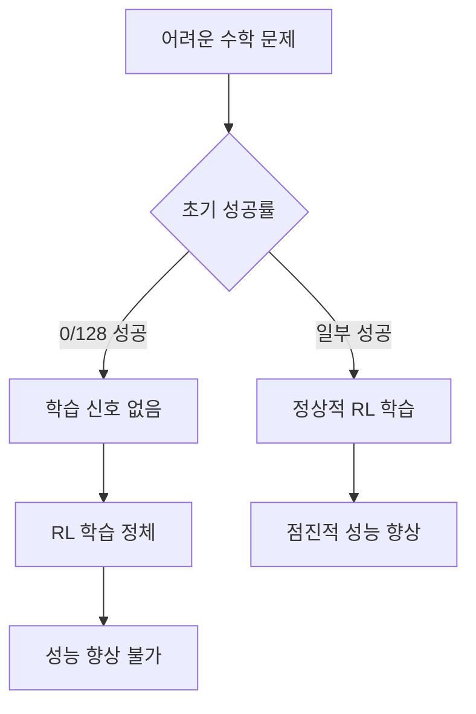
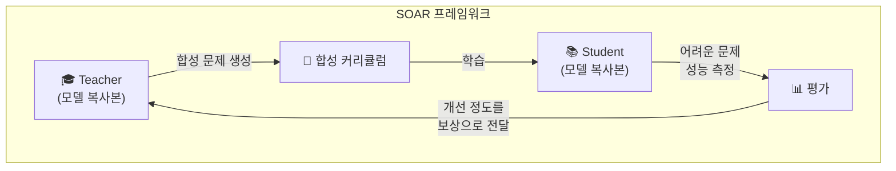
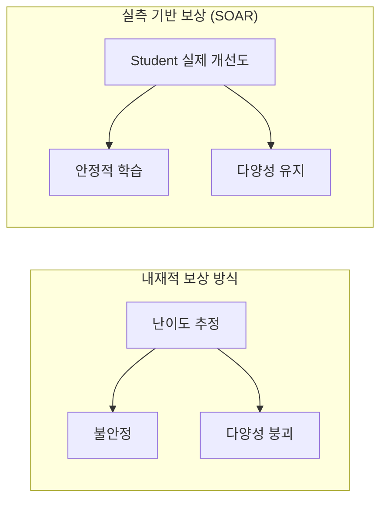

## 개요

대규모 언어 모델(LLM)의 추론 능력을 강화하기 위한 강화학습(RL) 미세조정은 최근 몇 년간 큰 주목을 받아왔습니다. 그러나 <strong>초기 성공률이 극히 낮은 어려운 문제</strong>에서는 학습 신호가 거의 없어 RL 학습이 정체(plateau)되는 근본적인 한계가 있었습니다.

MIT 연구팀(Shobhita Sundaram 외)이 발표한 논문 <strong>"Teaching Models to Teach Themselves: Reasoning at the Edge of Learnability"</strong>는 이 문제에 대한 혁신적인 해답을 제시합니다. 바로 <strong>SOAR(Self-improvement through Open-ended Automated Reasoning)</strong> — LLM이 스스로 학습용 커리큘럼을 생성하여 풀 수 없던 문제를 단계적으로 정복하는 프레임워크입니다.

## 핵심 문제: RL 학습의 정체 현상

기존 LLM 추론 강화학습의 가장 큰 문제는 다음과 같습니다:

수학 벤치마크의 가장 어려운 부분집합에서 128번 시도해도 단 한 번도 성공하지 못하면, 모델은 무엇이 옳고 그른지에 대한 피드백을 전혀 받지 못합니다. 이것이 <strong>학습 가능성의 경계(Edge of Learnability)</strong>에서 발생하는 근본적 문제입니다.

## SOAR 프레임워크의 핵심 구조

SOAR는 <strong>메타-RL(Meta-Reinforcement Learning)</strong> 기반의 자기 개선 프레임워크로, Teacher-Student 구조를 활용합니다.

### 1단계: Teacher가 합성 문제를 생성

Teacher 모델(원본 LLM의 복사본)은 Student가 현재 풀 수 없는 어려운 문제를 향한 <strong>디딤돌(stepping stones)</strong>이 되는 중간 난이도의 문제를 생성합니다.

### 2단계: Student가 합성 문제로 학습

Student 모델은 Teacher가 생성한 커리큘럼으로 RL 학습을 수행합니다. 이 과정에서 점진적으로 더 어려운 문제를 해결할 수 있는 능력을 키웁니다.

### 3단계: 실제 어려운 문제에서 평가

Student의 성능을 원래 풀 수 없었던 <strong>소규모 어려운 문제 집합</strong>에서 측정합니다.

### 4단계: 측정된 개선도로 Teacher에게 보상

핵심적인 차별점은 바로 이 부분입니다. Teacher는 <strong>Student의 실제 개선 정도</strong>를 보상(reward)으로 받습니다. 이는 기존의 내재적(intrinsic) 보상 방식과 근본적으로 다릅니다.

## 세 가지 핵심 발견

### 발견 1: 이중 수준 메타-RL의 실현 가능성

SOAR는 사전학습된 모델이 가진 <strong>잠재적 역량(latent capacity)</strong>을 활용하여, 희소한 이진 보상(sparse binary rewards) 환경에서도 유용한 디딤돌 문제를 생성할 수 있음을 보여줍니다. 모델이 어려운 문제를 직접 풀지 못하더라도, 그 문제를 향한 학습 경로를 설계하는 능력은 보유하고 있다는 것입니다.

### 발견 2: 실측 보상이 내재적 보상을 압도

기존 LLM 자기 대전(self-play) 연구에서 사용하던 <strong>내재적 보상(intrinsic rewards)</strong>은 불안정성과 다양성 붕괴(diversity collapse)를 자주 일으킵니다. 반면 SOAR의 <strong>실측 기반 보상(grounded rewards)</strong>은 Student의 실제 진전 정도를 측정하므로 이러한 문제를 안정적으로 회피합니다.

### 발견 3: 구조적 품질이 정답 정확도보다 중요

생성된 합성 문제를 분석한 결과, 학습 효과에 가장 큰 영향을 미치는 것은 <strong>문제의 구조적 품질과 적절한 형식(well-posedness)</strong>이었습니다. 놀랍게도 해답의 정확성보다 문제 자체의 구조가 더 중요했습니다.

이는 매우 직관적이면서도 중요한 시사점입니다: <strong>좋은 질문을 만드는 능력은 정답을 아는 능력과 별개</strong>라는 것입니다.

## 실전 의의와 향후 전망

### 추가 데이터 없이 추론 정체 탈출

SOAR의 가장 큰 의의는 <strong>별도의 큐레이팅된 데이터 없이</strong> 모델 스스로 학습 정체를 벗어날 수 있는 원리적 경로를 제시했다는 점입니다. 이는 데이터 수집과 라벨링에 드는 막대한 비용 문제를 해결할 수 있는 잠재력을 가집니다.

### 교육학적 관점에서의 AI 학습

SOAR는 인간 교육의 <strong>비계(scaffolding)</strong> 개념을 AI 학습에 성공적으로 적용한 사례입니다. 학습자가 현재 수준에서 약간 위의 문제(근접 발달 영역, ZPD)를 통해 성장하는 것처럼, LLM도 자체 생성된 단계적 문제를 통해 역량을 확장합니다.

### 자기 진화하는 AI 시스템의 가능성

이 연구는 외부 인간 감독 없이 AI가 자체적으로 학습 커리큘럼을 설계하고 실행하는 <strong>자율적 자기 개선(autonomous self-improvement)</strong>의 가능성을 열어놓습니다. 물론 안전성 관점에서 신중한 접근이 필요하지만, 기술적 가능성은 분명히 입증되었습니다.

## 결론

MIT의 SOAR 프레임워크는 LLM 추론 강화의 핵심 병목 — 어려운 문제에서의 학습 신호 부재 — 을 우아하게 해결합니다. Teacher-Student 구조와 실측 기반 보상의 조합은 기존 자기 대전 방식의 불안정성 문제를 극복하며, "좋은 질문을 만드는 능력"이 "정답을 아는 능력"과 별개임을 실험적으로 증명했습니다.

향후 이 접근법이 수학을 넘어 코딩, 과학적 추론 등 다른 도메인으로 확장된다면, <strong>스스로 가르치는 AI</strong>의 새로운 패러다임이 열릴 것입니다.

## 참고 자료

- [Teaching Models to Teach Themselves: Reasoning at the Edge of Learnability (arXiv, 2026)](https://arxiv.org/search/?query=%22Teaching+Models+to+Teach+Themselves%22&searchtype=all)
- [Chris Laub의 X 포스트 — SOAR 해설](https://x.com/ChrisLaubAI/status/2020789996622664023)
