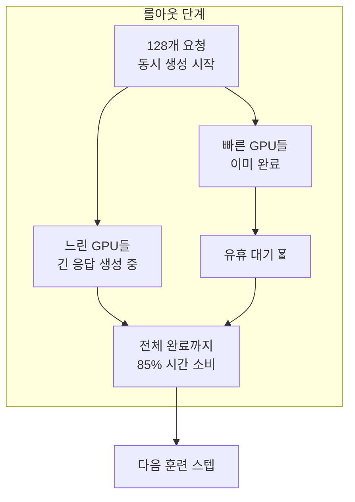
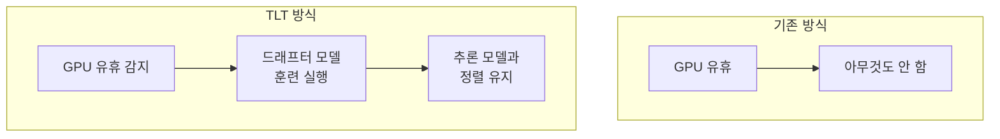
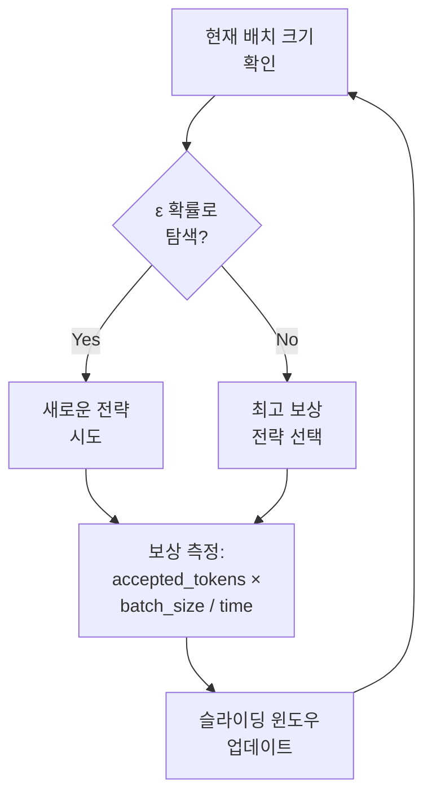

## 개요

2026년 2월 26일, MIT 연구팀이 추론(reasoning) LLM의 강화학습(RL) 훈련 효율을 <strong>70〜210% 향상</strong>시키는 새로운 방법론 <strong>"TLT(Taming the Long Tail)"</strong>를 발표했습니다. 이 연구는 3월 22〜26일 피츠버그에서 열리는 ASPLOS 2026에서 공식 발표될 예정입니다.

추론 LLM(예: DeepSeek-R1, o1 계열)은 복잡한 문제를 단계별로 사고하는 능력을 갖추기 위해 RL 훈련이 필수적인데, 이 과정에서 <strong>전체 실행 시간의 최대 85%</strong>가 롤아웃(rollout) 단계에 소비됩니다. TLT는 이 병목을 해결하여 동일한 하드웨어에서 훈련 속도를 사실상 2배로 끌어올립니다.

## 핵심 문제: 롤아웃의 긴 꼬리(Long Tail)

RL 훈련에서 롤아웃이란, 모델이 여러 개의 답변을 생성하고 보상 모델이 이를 평가하는 단계입니다. 여기서 핵심 비효율이 발생합니다:



여러 GPU가 동시에 답변을 생성하지만, <strong>응답 길이가 불균일</strong>하기 때문에 일부 GPU는 일찍 완료되고 나머지를 기다리며 유휴 상태에 놓입니다. 이것이 바로 "긴 꼬리" 문제이며, 추론 모델은 답변이 특히 길어질 수 있어 이 문제가 더욱 심각합니다.

## TLT의 두 가지 핵심 컴포넌트

### 1. 적응형 드래프터 트레이너 (Adaptive Drafter Trainer)

TLT의 첫 번째 혁신은 <strong>유휴 GPU 시간을 활용하여 소형 드래프터 모델을 훈련</strong>하는 것입니다.



<strong>드래프터 모델의 구조</strong>:

- 단일 트랜스포머 디코더 레이어로 구성
- 타겟 모델의 임베딩 레이어와 LM 헤드를 재사용(동결)
- 파라미터 수가 타겟 모델의 약 1/N (N=레이어 수)

<strong>Spot Trainer 메커니즘</strong>:

Worker Coordinator가 각 GPU의 상태를 세 가지로 관리합니다:

- <strong>BUSY</strong>: 롤아웃 생성 중
- <strong>IDLE</strong>: 롤아웃 완료, 대기 중
- <strong>TRAINING</strong>: 유휴 시간에 드래프터 훈련 실행 중

유휴 상태의 GPU에서 드래프터 훈련을 시작하고, 롤아웃 시작 시 자동으로 중단합니다. 비동기 체크포인팅으로 오버헤드를 <strong>9.2배 절감</strong>하고, 시퀀스 패킹으로 훈련 처리량을 <strong>2.2배 향상</strong>합니다.

### 2. 적응형 롤아웃 엔진 (Adaptive Rollout Engine)

두 번째 혁신은 <strong>추론적 디코딩(Speculative Decoding)을 RL 훈련의 롤아웃에 적용</strong>하는 것입니다.

추론적 디코딩은 원래 추론(inference) 단계에서 속도를 높이기 위한 기법인데, TLT는 이를 <strong>훈련 과정의 생성 단계</strong>에 적용했습니다. 소형 드래프터 모델이 빠르게 토큰을 예측하고, 대형 추론 모델이 이를 검증하는 방식입니다.

<strong>BEG-MAB 셀렉터</strong>:

TLT는 "Bucketed-Epsilon-Greedy" 멀티암드 밴딧(MAB) 알고리즘으로 최적의 추론적 디코딩 전략을 자동 선택합니다:



배치 크기에 따라 전략 그룹을 버킷으로 나누고, 각 버킷에서 ε-greedy 정책으로 탐색과 활용을 균형 있게 수행합니다.

## 성능 결과

MIT 연구팀은 4가지 규모의 모델에서 TLT를 검증했습니다:

| 모델 | 파라미터 | 노드 수 | VeRL 대비 속도 향상 |
|------|---------|---------|-------------------|
| Qwen2.5-7B | 7B | 1〜8 | 1.21〜1.76× |
| DeepSeek-R1-Distill-Qwen-7B | 7B | 1〜8 | 유사 수준 |
| Qwen2.5-32B | 32B | 4〜8 | 1.83〜2.12× |
| Llama-3.3-70B-Instruct | 70B | 8 | 최대 2.1× |

<strong>핵심 수치</strong>:

- 단일 배치 추론적 디코딩: <strong>3.46배</strong> 속도 향상
- 128개 요청 시나리오: <strong>2.44배</strong> 속도 향상
- CUDAGraph 메모리 최적화: 30.39GB → 10.69GB (<strong>2.8배 절감</strong>)
- <strong>정확도 손실 없음</strong>: 훈련 보상 곡선이 기존 VeRL과 거의 동일

## 엔지니어링 리더 관점에서의 시사점

### 1. 훈련 비용 즉시 절감

TLT는 <strong>추가 하드웨어 없이</strong> 기존 인프라에서 훈련 속도를 2배로 높입니다. 이는 곧 훈련 비용 50% 절감을 의미합니다. GPU 클러스터 비용이 시간당 수백 달러에 달하는 현실에서, 이 효율 개선은 직접적인 비용 절감으로 이어집니다.

### 2. 부산물로 얻는 경량 모델

TLT의 훈련 과정에서 생성되는 드래프터 모델은 <strong>그 자체로 경량 추론 모델로 활용</strong>할 수 있습니다. 즉, 훈련을 하면서 동시에 배포용 경량 모델을 "공짜로" 얻는 셈입니다.

### 3. 기존 인프라와의 호환성

NVIDIA H100과 A100 GPU 모두에서 검증되었으며, 기존 VeRL 등 RL 훈련 프레임워크 위에 적용할 수 있습니다. 대규모 인프라 교체 없이 점진적 도입이 가능합니다.

## MIT SOAR vs TLT: 보완적 관계

같은 MIT에서 나온 두 연구를 비교하면, 이들이 <strong>서로 다른 차원의 문제를 해결</strong>한다는 점이 명확합니다:

| 구분 | SOAR | TLT |
|------|------|-----|
| 핵심 질문 | "무엇을 학습할 것인가?" | "어떻게 빠르게 학습할 것인가?" |
| 접근 방식 | 자기 커리큘럼 생성 | 적응형 드래프터 + 추론적 디코딩 |
| 최적화 대상 | 학습 데이터 품질 | 훈련 하드웨어 활용률 |
| 조합 가능성 | SOAR로 선별한 데이터를 TLT로 빠르게 학습 |

두 기법을 조합하면, <strong>고품질 데이터로 2배 빠르게 훈련</strong>하는 시너지를 기대할 수 있습니다.

## 실전 적용 시나리오

### 시나리오 1: 사내 추론 모델 파인튜닝

```python
# TLT 적용 전: 8× H100에서 72시간 소요
# TLT 적용 후: 동일 하드웨어에서 ~35시간으로 단축

# 비용 절감 예시 (H100 8대 기준)
hourly_cost = 30  # USD per H100/hour
gpus = 8
original_hours = 72
tlt_hours = 35  # ~2x speedup

original_cost = hourly_cost * gpus * original_hours  # $17,280
tlt_cost = hourly_cost * gpus * tlt_hours             # $8,400
savings = original_cost - tlt_cost                     # $8,880 (51% 절감)
```

### 시나리오 2: 반복적 실험 가속화

RL 훈련은 하이퍼파라미터 탐색이 핵심인데, 각 실험이 2배 빨라지면 같은 시간에 <strong>2배 더 많은 실험</strong>을 수행할 수 있습니다.

## 결론

MIT TLT는 추론 LLM 훈련의 근본적인 병목인 "긴 꼬리" 문제를 우아하게 해결합니다. 유휴 GPU 자원을 활용하여 드래프터를 훈련하고, 이를 추론적 디코딩에 활용하는 순환 구조는 <strong>추가 비용 없이 훈련 속도를 2배로</strong> 높이는 실용적인 솔루션입니다.

특히 엔지니어링 리더의 관점에서, TLT는 "더 큰 클러스터를 사세요"가 아닌 <strong>"이미 가진 자원을 더 잘 활용하세요"</strong>라는 메시지를 전달합니다. 이것이 바로 엔지니어링 조직이 추구해야 할 효율화의 본질이 아닐까요.

## 참고 자료

- [MIT News: New method could increase LLM training efficiency](https://news.mit.edu/2026/new-method-could-increase-llm-training-efficiency-0226)
- [arXiv: Taming the Long-Tail: Efficient Reasoning RL Training with Adaptive Drafter](https://arxiv.org/html/2511.16665)
- [ASPLOS 2026 Conference](https://www.asplos-conference.org/asplos-2026/)
