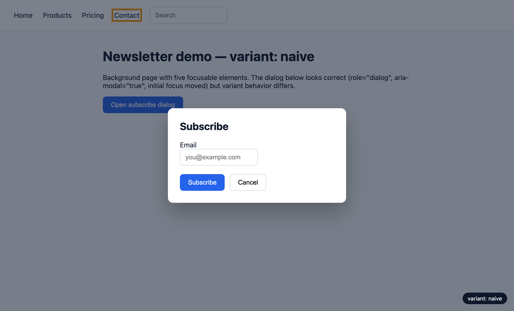

결제 모달을 닫으려고 Tab을 누르다가, 포커스가 어느 순간 화면 어디에도 안 보이게 된 경험이 있을 것이다. 마우스를 잡으면 그만이지만, 키보드만 쓰는 사용자에게는 거기서 페이지가 끝난다. 이 증상의 정체를 오늘 숫자로 잡았다.

같은 마크업의 모달을 세 가지 상태로 만들었다. 셋 다 `role="dialog"`와 `aria-modal="true"`가 붙어 있고, 열릴 때 첫 입력 필드로 포커스를 옮긴다. 겉보기에는 전부 "제대로 만든" 모달이다. 차이는 배경 처리 하나다. 아무것도 안 함, `aria-hidden="true"`, `inert`. 각 상태에서 실제 Tab 키를 눌러 포커스가 어디에 떨어지는지 기록하고, axe-core 4.12.1을 같이 돌렸다. 브라우저는 Chrome 150이다.

## 기초: 모달이 "모달"이려면 무엇이 막혀야 하나

모달(modal)이라는 말 자체가 요구사항이다. 대화상자가 떠 있는 동안 나머지 화면은 존재하지 않는 것처럼 동작해야 한다. W3C의 WAI-ARIA Authoring Practices Guide(APG)는 모달 다이얼로그 패턴에서 이렇게 못 박는다. "Windows under a modal dialog are inert. That is, users cannot interact with content outside an active dialog window." 키보드 동작도 명시되어 있다. Tab은 "다이얼로그 안의 다음 탭 가능한 요소로" 이동하고, 마지막 요소에서 누르면 "다이얼로그 안의 첫 요소로" 돌아와야 한다. 포커스가 오버레이 뒤로 나가는 순간, 그 대화상자는 명세가 정의하는 모달이 아니다.

여기서 많은 코드가 착각하는 지점이 있다. `aria-modal="true"`는 이 동작을 만들어주는 속성이 아니라, 이 동작이 이미 구현되어 있다고 보조기술에 <strong>선언</strong>하는 속성이다. APG도 조건을 단다. 애플리케이션 코드가 바깥 콘텐츠와의 상호작용을 실제로 전부 막고 있을 때, 그리고 시각적으로 바깥이 가려져 있을 때만 이 속성을 붙이라는 것이다. 선언과 구현이 어긋나면 어떻게 되는가. 그걸 이번에 측정했다.

키보드 포커스가 왜 이렇게까지 중요한가도 짚어두자. Tab으로 화면을 다니는 사용자는 생각보다 넓은 집단이다. 마우스를 쓸 수 없는 운동 장애 사용자, 스크린리더 사용자, 그리고 폼 입력이 많은 화면에서 손을 키보드에서 떼지 않는 파워 유저까지 전부 포함된다. WCAG 2.1.1(Keyboard)이 모든 기능의 키보드 접근을 Level A, 즉 최저 기준선으로 요구하는 이유다. 모달에서 포커스가 새면 이 사용자들에게는 "닫을 수 없는 창"이나 "보이지 않는 곳을 조작하는 상태"가 된다.

실험 페이지 구성은 단순하다. 배경에 포커스 가능한 요소 6개(내비게이션 링크 4개, 검색 입력, 열기 버튼), 모달 안에 3개(이메일 입력, Subscribe, Cancel). 오버레이는 반투명이라 배경의 포커스 링이 비쳐 보인다. 이게 나중에 증거 사진이 된다.

측정 방법에도 한 가지 원칙을 뒀다. JavaScript로 `dispatchEvent(new KeyboardEvent('keydown', {key: 'Tab'}))`을 쏘는 방식은 쓰지 않았다. 합성 키 이벤트는 신뢰할 수 없는(untrusted) 이벤트라 브라우저의 실제 포커스 이동을 일으키지 않기 때문이다. 대신 DevTools 프로토콜로 진짜 Tab 키 입력을 보내고, 문서에 `focusin` 리스너를 달아 포커스가 지나간 요소의 id를 순서대로 수집했다. 아래 로그의 한 줄 한 줄이 전부 실제 키 입력의 결과다.

```js
// 측정용 계측: 포커스가 지나간 자리를 순서대로 기록
window.__focusLog = [];
document.addEventListener('focusin',
  e => window.__focusLog.push(e.target.id || e.target.tagName), true);
```

## naive 판: Tab 세 번에 오버레이 뒤로

배경을 아무것도 처리하지 않은 첫 번째 판. 모달을 열면 이메일 입력에 포커스가 잡히고, 여기까지는 그럴듯하다. 이후의 Tab 기록이 이렇다.

```text
variant: naive  (role="dialog" + aria-modal="true", 배경 무처리)
open   → email          (초기 포커스 이동, 정상)
Tab 1  → subscribe-btn
Tab 2  → cancel-btn
Tab 3  → nav-home       ← 오버레이 뒤 내비게이션으로 이탈
Tab 4  → nav-products
Tab 5  → nav-pricing
Tab 6  → nav-contact
```

세 번째 Tab에서 포커스가 모달을 떠났다. 화면에는 대화상자가 떠 있는데, 실제 포커스는 반투명 오버레이 너머의 "Home" 링크에 가 있다. 그대로 Tab을 이어가면 배경 내비게이션을 끝까지 순회한다. 아래 스크린샷이 그 마지막 장면이다. 주황색 포커스 링이 오버레이 뒤 "Contact"에 걸려 있다.



이 상태에서 axe-core를 돌렸다. 결과는 위반 1건, `region`(landmark 누락, moderate)뿐이다. 포커스 이탈과 관련된 위반은 0건이다. axe가 부실해서가 아니다. "Tab을 눌렀을 때 포커스가 어디로 가는가"는 정적 DOM 검사로 판정할 수 없는 동적 속성이라서다. 자동 도구가 구조적으로 커버하지 못하는 영역이 있다는 건 [axe 자동 검사의 커버리지 실측](/ko/blog/ko/axe-automated-a11y-coverage-gap-2026/)에서 정리했는데, 이 포커스 이탈이 정확히 그 사각지대에 들어간다.

솔직히 말하면 이 조합, `aria-modal="true"`만 붙이고 배경은 방치한 모달을 나는 실무 코드 리뷰에서 여러 번 봤다. 마크업만 보면 흠잡을 데가 없으니 리뷰도 통과한다. 키보드로 세 번 Tab을 눌러본 사람만 안다.

## aria-hidden 판: 이탈에 침묵이 더해진다

두 번째 판은 모달이 열릴 때 배경 컨테이너에 `aria-hidden="true"`를 붙인다. 스크린리더에서 배경을 숨기는 고전적인 처리다. Tab 기록을 보자.

```text
variant: ariahidden  (배경에 aria-hidden="true")
open   → email
Tab 1  → subscribe-btn
Tab 2  → cancel-btn
Tab 3  → nav-home       ← 여전히 이탈한다
Tab 4  → nav-products
```

이 패턴이 널리 퍼진 데는 이유가 있다. `inert`가 브라우저에 자리 잡기 전까지, 모달 라이브러리들이 배경을 스크린리더에서 숨길 수단은 `aria-hidden`뿐이었다. 그 시절의 관행이 코드베이스와 스니펫으로 지금까지 복제되어 온 것이다. 문제는 이 속성의 사양 자체가 절반짜리라는 데 있다. `aria-hidden`은 접근성 트리에서만 요소를 제거한다. 키보드 탭 순서는 건드리지 않는다. 그래서 포커스는 naive 판과 똑같이 배경으로 나간다. 그런데 이번에는 더 나쁘다. 포커스가 도착한 nav-home은 접근성 트리에 없는 요소다. 스크린리더 사용자 입장에서는 Tab을 눌렀는데 아무것도 읽어주지 않는 상태, 포커스는 있는데 이름도 역할도 없는 블랙홀에 빠진다. 포커스된 요소를 보조기술이 뭐라고 읽는가는 [accessible name 실측](/ko/blog/ko/accessible-name-agents-2026/)에서 다룬 주제인데, 여기서는 읽을 이름 자체가 트리에서 지워져 있다.

흥미로운 건 axe의 반응이다. axe에는 이 상황을 겨냥한 `aria-hidden-focus` 규칙이 있다. 그런데 이번 실측에서 이 규칙은 위반(violation)이 아니라 <strong>incomplete</strong>로 나왔다. 노드 메시지가 이렇다.

```text
rule: aria-hidden-focus → incomplete (target: #app)
check: focusable-modal-open
message: "Check that focusable elements are not tabbable in the current state"
```

모달이 떠 있는 상태에서는 포커스 가능한 배경 요소가 실제로 탭 순서에 있는지 axe가 정적으로 판정할 수 없으니, 사람이 확인하라고 넘기는 것이다. 규칙 설계로는 옳은 판단이다. 문제는 대부분의 CI 파이프라인이 violations 배열만 게이트로 쓰고 incomplete는 버린다는 데 있다. 위반 0건이라는 보고서 뒤에서, 사람에게 넘겨진 확인 요청이 조용히 사라진다. 내가 방금 Tab 키로 한 일이 바로 axe가 사람에게 요청한 그 수동 확인이었다.

## inert 판: 배경 진입 0회

세 번째 판은 모달이 열릴 때 배경 컨테이너에 `inert`를 건다. 코드로는 한 줄이다.

```js
// 열 때
app.inert = true;
modal.querySelector('input').focus();

// 닫을 때
app.inert = false;
openBtn.focus();
```

같은 절차로 Tab을 여섯 번 눌렀다.

```text
variant: inert  (배경에 inert)
open   → email
Tab 1  → subscribe-btn
Tab 2  → cancel-btn
Tab 3  → (브라우저 UI: 주소창 영역)
Tab 4  → email          ← 문서로 돌아올 때 모달 첫 요소로
Tab 5  → subscribe-btn
Tab 6  → cancel-btn
```

배경 진입 0회. 포커스는 모달 안의 세 요소를 순환한다. 포커스 트랩 JavaScript를 한 줄도 쓰지 않았는데 그렇게 된다. `inert`가 하위 트리 전체를 탭 순서에서 빼고, 접근성 트리에서도 제거하고, 클릭과 페이지 내 검색까지 막기 때문이다(MDN 문서 기준). `aria-hidden`이 하던 일과 포커스 차단을 한 속성이 같이 처리한다.

측정하면서 잡힌 세부 사항 두 가지를 남겨둔다. 첫째, `inert`가 걸린 요소의 computed style에서 `pointer-events`는 여전히 `auto`다. 차단은 스타일이 아니라 유저 에이전트 내부에서 일어난다. 둘째, `inert` 상태에서도 JavaScript의 `el.click()`은 그대로 발화한다. `inert`가 막는 건 사용자 상호작용이지 프로그램 호출이 아니다. 테스트 코드가 `.click()`으로 통과한다고 실제 사용자가 클릭할 수 있다는 뜻이 아니라는 얘기다.

Tab 3에서 포커스가 브라우저 주소창으로 잠깐 나가는 것은 정상 동작이다. APG가 요구하는 순환은 문서 안의 탭 순서에 대한 것이고, 브라우저 UI는 원래 그 바깥에 있다. 문서로 돌아올 때 모달의 첫 요소로 들어오면 요건은 충족된다.

주의점도 있다. MDN이 명시적으로 경고하는 부분인데, `inert`가 걸렸다는 사실을 사용자에게 알려주는 기본 시각 표시가 전혀 없다. `disabled`처럼 회색으로 바뀌지도 않는다. 모달 시나리오에서는 오버레이가 그 역할을 하니 문제가 안 되지만, 페이지 일부만 inert로 잠그는 다른 용도(멀티 스텝 폼의 비활성 구간 등)로 가져갈 때는 시각적 구분을 직접 설계해야 한다. 그리고 개별 폼 컨트롤 하나를 잠글 때는 `inert`가 아니라 `disabled`가 맞다. 의미론도 스타일 훅도 그쪽이 제대로 붙는다.

## 무엇을 쓸 것인가: 사다리는 세 칸이다

이번 실측을 기준으로 내 선택 순서는 이렇다.

| 순위 | 방법 | 배경 차단 | 근거 |
|---|---|---|---|
| 1 | `<dialog>` + `showModal()` | 브라우저가 자동 처리 | MDN: `showModal()` 사용 시 다이얼로그 밖을 전부 inert 처리하는 "동작을 브라우저가 제공한다" |
| 2 | 커스텀 오버레이 + 배경 `inert` | 한 줄로 명시적 처리 | 이번 실측 — 배경 진입 0회 |
| 3 | JS 포커스 트랩 루프 | 코드가 keydown을 가로챔 | 구형 브라우저 지원이 꼭 필요할 때만 |

1순위가 네이티브 `<dialog>`인 이유는 명확하다. `showModal()`을 호출하면 다이얼로그 밖의 문서 전체가 inert 상태가 되고, top layer 배치와 `::backdrop`, Esc 닫기까지 플랫폼이 처리한다. 이번 글에서 손으로 만든 것들이 전부 공짜로 온다.

```html
<dialog id="subscribe-dialog">
  <h2>Subscribe</h2>
  <input type="email" placeholder="you@example.com">
  <button id="ok">Subscribe</button>
  <button id="close">Cancel</button>
</dialog>
<script>
  // showModal()이 배경 inert화 + top layer + Esc를 전부 맡는다
  openBtn.addEventListener('click',
    () => document.getElementById('subscribe-dialog').showModal());
</script>
```

디자인 시스템 제약 등으로 커스텀 오버레이를 유지해야 한다면 2순위, 배경 컨테이너에 `inert` 한 줄이다. `inert`는 Baseline 기준 2023년 4월부터 전 주요 브라우저에서 쓸 수 있다(Chrome 2022, Firefox·Safari 2023). keydown을 가로채 첫/마지막 요소를 수동 순환시키는 고전적 포커스 트랩은 이제 3순위다. 동작은 하지만, 탭 가능 요소 목록을 직접 계산하고 유지해야 해서 모달 안에 요소가 추가될 때마다 깨질 기회가 생긴다.

한 가지 판단을 분명히 해두면, 나는 `aria-hidden="true"`를 배경 차단 용도로 단독 사용하는 패턴은 이제 폐기해야 한다고 본다. 이번 실측이 보여줬듯 포커스는 그대로 새고, 새는 자리가 하필 스크린리더에게 침묵인 자리다. `inert`가 접근성 트리 제거까지 겸하므로, `inert`를 쓸 수 있는 환경에서 `aria-hidden` 병용은 이득이 없다.

## 정직한 한계

이번 측정이 말해주지 않는 것들이 있다. 첫째, 이 실험은 키보드 Tab 순서의 측정이지 스크린리더 동작의 측정이 아니다. VoiceOver나 NVDA의 탐색 커서는 탭 순서와 별개로 움직이므로, `aria-modal`과 `inert`가 스크린리더 탐색에서 어떻게 작동하는지는 별도의 실측이 필요하다. 이 글은 그걸 하지 않았다. 둘째, axe의 incomplete 처리를 결함처럼 읽지 않기를 바란다. 동적 상태를 정적 규칙으로 단정하지 않고 사람에게 넘기는 것은 규칙 설계로서 정직한 쪽이다. 문제는 그 인계를 받아줄 사람이 파이프라인에 없다는 운영의 공백이다. 셋째, 여기서 다룬 것은 WCAG 2.4.3(Focus Order) 계열의 한 증상이지, 이걸 고쳤다고 페이지의 접근성 적합성이 보장되는 건 아니다. [WCAG 2.2 타깃 크기 실측](/ko/blog/ko/wcag22-target-size-audit-2026/)에서도 같은 결론이었지만, 자동 점수와 적합성 사이의 거리는 생각보다 멀다. 넷째, 이번 측정은 Chrome 150 단일 브라우저에서 수행했다. `inert`는 Baseline 기준 전 주요 브라우저에서 동일하게 동작해야 하지만, Firefox와 Safari에서의 탭 순서 실측은 이번 범위에 넣지 않았다. 크로스 브라우저 회귀까지 잡으려면 같은 프로브를 Playwright 같은 도구로 세 엔진에 돌리는 게 다음 단계다.

## 배포 전 모달 점검 다섯 줄

- 모달을 열고 Tab을 요소 수 + 2회 누른다. 포커스가 오버레이 뒤 요소에 한 번이라도 걸리면 실패다.
- `aria-modal="true"`가 있다면, 그 선언을 뒷받침하는 실제 차단(`showModal()` 또는 `inert`)이 있는지 코드에서 확인한다.
- 배경 차단을 `aria-hidden`에만 의존하고 있다면 `inert`로 교체한다.
- axe/CI 리포트에서 violations만 보지 말고 incomplete 배열을 열어본다. `focusable-modal-open`이 있으면 위의 Tab 테스트가 그 답이다.
- 닫을 때 포커스가 모달을 연 트리거로 돌아오는지 확인한다(APG 요구사항).

키보드 포커스는 자동 도구가 끝까지 대신 눌러주지 않는다. Tab 몇 번이면 확인되는 것을 확인하지 않은 채 초록불 리포트만 쌓이는 사이트가 많다. 운영 중인 사이트의 모달·오버레이 키보드 동작 점검이나 a11y 감사를 CI 게이트까지 남기는 작업을 개인적으로 상담·구현 의뢰로 받고 있다. 필요하다면 [문의 페이지](/ko/contact/)로 연락 주면 된다.
