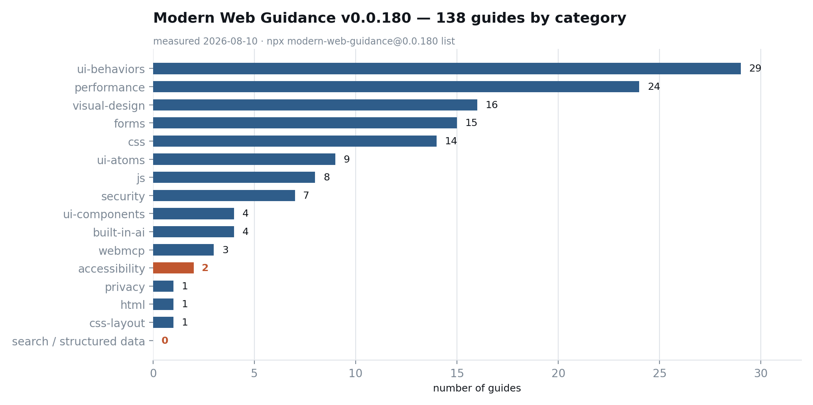
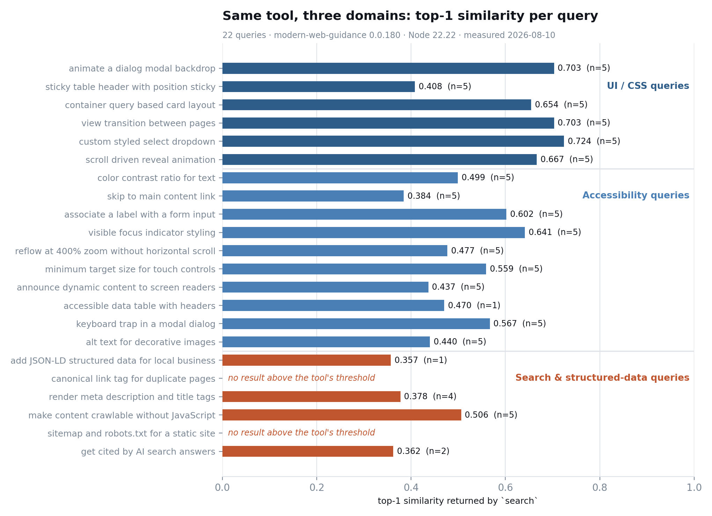

Chrome 팀이 I/O 2026에서 Modern Web Guidance를 공개했다. 코딩 에이전트에 웹 플랫폼 전문성을 심어주는 스킬 묶음이고, 소개 문장에는 "더 접근성 있고, 성능이 좋고, 안전한" 웹 경험을 만들게 해준다고 적혀 있다. 설치는 `npx` 한 줄이다.

그 한 줄을 돌린 다음 내가 제일 먼저 한 일은 `list`를 찍어서 가이드 개수를 세는 것이었다. 138개. 카테고리는 15개. 그중 accessibility 카테고리에 들어 있는 가이드는 2개였다. 구조화 데이터나 크롤러빌리티를 다루는 카테고리는 목록에 아예 없었다.

숫자 자체가 흠은 아니다. 다만 저 세 단어가 나란히 적힌 소개문을 읽고 설치한 개발자와, 실제 코퍼스의 무게중심 사이에는 간격이 있다. 오늘은 그 간격을 재고, 간격을 메우는 규칙을 어디에 적어야 하는지까지 적어둔다.



## 에이전트 스킬은 기능이 아니라 범위 선언이다

먼저 용어를 정리하고 간다. 에이전트 스킬은 코딩 에이전트가 특정 작업을 만났을 때 펼쳐보는 지침 묶음이다. 핵심은 `SKILL.md` 한 장인데, 여기에 "언제 이걸 펼쳐라"와 "펼치면 무엇을 해라"가 적힌다. 에이전트는 매 작업마다 이 트리거 설명을 읽고 발동 여부를 판단한다. 그래서 스킬을 설치한다는 것은 도구를 추가하는 일이라기보다, 에이전트의 판단에 범위를 하나 그어주는 일에 가깝다.

Baseline도 짚어둔다. Baseline은 어떤 웹 기능이 주요 브라우저에서 충분히 오래 안정적으로 쓸 수 있는 상태인지를 표시하는 web.dev의 분류다. 크게 두 단계로, 모든 주요 엔진에 막 들어온 상태가 Newly available이고, 그 뒤 충분한 기간이 지나 사실상 어디서나 안전한 상태가 Widely available이다. 프런트엔드에서 "이거 지금 써도 되나"라는 질문에 답하려면 결국 이 데이터를 봐야 한다.

Modern Web Guidance는 이 둘을 붙인 물건이다. [Chrome for Developers 문서](https://developer.chrome.com/docs/modern-web-guidance)의 정의를 원문 그대로 옮긴다.

> Modern Web Guidance is a set of skills that embed web platform expertise, best practices, and browser compatibility data directly into your coding agents.

Baseline 연동에 대한 설명은 [I/O 2026 발표 글](https://developer.chrome.com/blog/chrome-at-io26)에 있다. 이것도 원문이다.

> It integrates directly with Baseline, letting you focus on what you want to build while your tools automatically figure out the right features and fallbacks to use within your chosen Baseline target.

의도는 명확하고, 나는 이 방향이 옳다고 본다. 모델 가중치에 박혀 있는 2019년식 CSS 관용구를 매번 손으로 뜯어고치는 것보다, 최신 호환성 데이터를 작업 시점에 주입하는 쪽이 구조적으로 낫다. 문제는 주입되는 지식의 지도가 어떻게 생겼느냐다. 지도에 없는 땅에서 에이전트는 여전히 가중치에 기대 답한다. 그리고 그 사실을 사용자에게 알려주지 않는다.

## 설치하면 프로젝트에 무엇이 들어오는가

npm 레지스트리 기준으로 패키지는 2026년 4월 30일에 처음 올라왔고, 8월 3일까지 96개 버전이 나왔다. 사흘에 한 번꼴이다. 내가 잰 시점의 최신은 0.0.180이고 라이선스는 Apache-2.0, 압축 해제 크기는 36.6MB에 198개 파일이다. 초기 프리뷰 단계의 0.0.x 패키지라는 점은 감안하고 읽어야 한다.

빈 디렉터리에서 설치를 돌렸다.

```bash
npx modern-web-guidance@latest install
```

설치기는 대화형 화면을 띄우고 대상 에이전트를 잡아준다. 결과는 이렇다.

```
✓ ./.agents/skills/modern-web-guidance
  universal: Amp, Antigravity, Antigravity CLI, Codex, Cursor +12 more
  symlinked: Claude Code
```

`.agents/skills/modern-web-guidance/` 아래에 1.2MB, 140개 파일이 들어왔고 루트에 `skills-lock.json`이 생겼다. Claude Code는 심링크로 연결된다. 가이드는 전부 마크다운 원문이라 열어보면 그대로 읽힌다. 이 점은 마음에 든다. 에이전트가 무엇을 읽고 그렇게 답했는지 사람이 추적할 수 있다.

설치 마지막에 텔레메트리 고지가 뜬다. [저장소 README](https://github.com/GoogleChrome/modern-web-guidance)의 문장을 그대로 옮기면 이렇다.

> Google collects anonymous usage statistics (such as search queries, guide retrievals, and installation) to improve the reliability, relevance, and performance of the tool.

검색 질의가 수집 대상에 명시돼 있다는 점이 중요하다. 사내 저장소에서 도는 에이전트라면 질의 문자열에 프로젝트 맥락이 섞이기 쉽다. 끄는 방법은 환경변수 하나다.

```bash
export DISABLE_TELEMETRY=1
```

설치기 화면에 서드파티 보안 평가가 같이 표시되는 점도 적어둔다. 내 실행에서는 Socket이 0 alerts, Snyk이 Med Risk로 나왔다. 이건 서드파티 스캐너의 판정이지 Google의 공식 평가가 아니고, 나도 그 판정 근거까지 따라가 보지는 않았다. 참고값으로만 취급하는 게 맞다.

## 138개 가이드는 어디에 몰려 있나

`list` 명령은 전체 가이드를 JSON으로 뱉는다. 카테고리별로 세면 이렇게 갈린다.

| 카테고리 | 가이드 수 |
|---|---|
| ui-behaviors | 29 |
| performance | 24 |
| visual-design | 16 |
| forms | 15 |
| css | 14 |
| ui-atoms | 9 |
| js | 8 |
| security | 7 |
| built-in-ai | 4 |
| ui-components | 4 |
| webmcp | 3 |
| accessibility | 2 |
| css-layout | 1 |
| html | 1 |
| privacy | 1 |
| 검색·구조화 데이터 | 0 |

상위 다섯 카테고리가 98개로 전체의 71%다. 화면에 보이는 것을 만드는 일에 코퍼스가 몰려 있다.

여기서 한 가지는 공평하게 짚어야 한다. accessibility 2개라는 숫자는 접근성 내용의 총량이 아니다. 그 2개 중 하나인 우산 가이드 `accessibility`는 7,131토큰짜리로, 전체에서 세 번째로 큰 문서다. 목차는 내비게이션 구조, 시맨틱 HTML과 ARIA, 접근 가능한 이름, 문서 메타데이터와 언어, 키보드와 포커스 관리, 대체 텍스트와 미디어로 이어진다. 폼 가이드 15개에도 라벨과 자동완성 관련 접근성 내용이 섞여 있다. 그러니 "접근성이 2개뿐"이라는 문장은 카테고리 라벨의 이야기이지 내용의 이야기가 아니다.

그래도 구조의 차이는 남는다. UI 쪽은 "이 상황에 이 기능"이라는 좁은 단위 가이드가 스물아홉 개로 깔려 있고, 접근성은 두꺼운 개론 한 장에 세부가 압축돼 있다. 에이전트가 검색으로 좁은 답을 집어 올리는 구조에서 이 차이는 결과로 이어진다.

코퍼스가 덮고 있는 영역의 품질은 따로 평가해야 공정하다. 성능 카테고리의 `optimize-image-priority` 가이드를 열어봤다. 결론부터 말하면 좋다. 흔한 "LCP 이미지에 `fetchpriority="high"`를 붙이세요" 수준에서 멈추지 않는다.

```
4. **Optimize lazy loading**: Never use `loading="lazy"` on the LCP image.
   For standard below-the-fold images, `loading="lazy"` is sufficient...
   Avoid adding `fetchpriority="low"` to these images, as you want them to
   load at normal priority once the user scrolls to them.
```

접힌 선 아래 일반 이미지와, 접힌 선 위에 있지만 처음에 안 보이는 이미지(캐러셀 뒤쪽 슬라이드, 메가 메뉴)를 갈라서 다르게 처리하라고 지시한다. 이 구분은 실무에서 자주 틀리는 지점이고, 틀리면 LCP가 아니라 대역폭 경합으로 손해를 본다. 이 정도 해상도의 지침이 138장 중 상당수에 들어 있다면, 이 도구가 가중치보다 나은 답을 주는 영역은 실제로 존재한다. 문제는 그 영역의 경계가 어디냐는 것이다.

## 같은 도구에 세 종류 질문을 넣어봤다

그래서 찔러봤다. UI/CSS 6개, 접근성 10개, 검색·구조화 데이터 6개, 총 22개 질의를 `search`에 넣고 상위 결과의 유사도와 개수를 기록했다. 질의는 실제 작업 지시처럼 영어 평문으로 썼다. 도구가 영어 코퍼스이므로 영어로 묻는 것이 이 도구에 유리한 조건이다.

```bash
npx modern-web-guidance@0.0.180 search "add JSON-LD structured data for local business"
```

```json
[{"id":"language-model","description":"...","category":"built-in-ai",
  "tokenCount":1984,"similarity":0.357}]
```

한 건. 그것도 브라우저 내장 언어 모델 API 가이드다. 구조화 데이터와는 무관하다.



그룹별로 정리하면 이렇다.

| 질의 그룹 | 질의 수 | 상위 유사도 평균 | 무응답 |
|---|---|---|---|
| UI/CSS | 6 | 0.643 | 0 |
| 접근성 | 10 | 0.508 | 0 |
| 검색·구조화 데이터 | 6 | 0.267 | 2 |

UI 질의는 깔끔하게 맞는다. "custom styled select dropdown"은 0.724로 `custom-select-picker-layouts`를, "view transition between pages"는 0.703으로 `cross-document-transitions`를 집었다. 여섯 개 전부 제 카테고리 안에서 답이 나왔다.

접근성 질의는 결과가 항상 돌아오지만 조준이 흔들린다. 열 개 중 상위 5위 안에 accessibility 카테고리 가이드가 한 번이라도 들어온 것은 일곱 개였다. 나머지 셋이 문제다. "associate a label with a form input"의 상위 다섯 개는 전부 forms 카테고리의 자동완성 가이드였고, "minimum target size for touch controls"는 css 우산 가이드로, "reflow at 400% zoom without horizontal scroll"은 `defer-work-until-scroll-ends`라는 성능 가이드로 떨어졌다. 마지막 건은 특히 엉뚱하다. 400% 확대 리플로우는 스크롤 성능 문제가 아니라 뷰포트 크기 문제다. [400% 확대에서 실제로 무너지는 것은 높이였다는 걸 직접 재본 적이 있는데](/ko/blog/ko/reflow-1410-400-zoom-viewport-height-2026), 그 답은 이 코퍼스 어디에도 없다.

검색·구조화 데이터 질의는 아예 다른 그림이다. "canonical link tag for duplicate pages"와 "sitemap and robots.txt for a static site"는 결과가 0건이었다. 도구의 임계값 아래라 아무것도 반환되지 않았다는 뜻이다. "render meta description and title tags"는 접근성 가이드를 0.378로 물어왔고, "get cited by AI search answers"는 언어 감지 API 가이드를 0.362로 물어왔다.

이 측정의 한계는 분명히 해둔다. 22개는 프로브지 벤치마크가 아니다. 질의 문구를 바꾸면 유사도는 움직인다. 임계값과 컷오프는 도구가 정한 것이고 내가 조정하지 않았다. 무엇보다 상위 결과가 빗나갔다고 해서 에이전트가 반드시 나쁜 코드를 쓴다는 뜻은 아니다. 우산 가이드가 워낙 두꺼워서, 조준이 어긋나도 필요한 내용이 그 안에 들어 있는 경우가 있다. README에 실린 자체 평가(7월 6일, 129개 작업·1,071개 어서션)에서는 codex_cli가 57%에서 84%로 27포인트, claude_code가 52%에서 87%로 35포인트 올랐다고 적혀 있다. 이건 Google의 수치이고 나는 그 평가 스위트를 돌려보지 않았다.

내가 재고 말할 수 있는 것은 하나다. 이 코퍼스는 화면을 만드는 일에 강하고, 페이지가 발견되고 인용되는 일에는 관여하지 않는다.

## Baseline 타깃은 프로젝트 파일에 한 줄로 적는다

여기부터는 바로 쓸 수 있는 부분이다. 설치된 `SKILL.md`(패키지 원문, [GoogleChrome/modern-web-guidance](https://github.com/GoogleChrome/modern-web-guidance))에는 브라우저 지원 판정 규칙이 명시돼 있다. 기본값 문장을 그대로 옮긴다.

> All guides assume <strong>Baseline Widely available</strong> features are safe to use without fallbacks.

아무 설정도 하지 않으면 에이전트는 Widely available만 무조건 안전하다고 보고, 그 아래 단계 기능에는 폴백을 붙인다. 프로젝트가 그보다 공격적으로 가도 되는 상황이라면 정책을 적어야 한다. 형식은 정해져 있지 않고, `AGENTS.md`나 `CLAUDE.md`에 문장으로 쓰면 된다. 연도 타깃의 판정 규칙도 `SKILL.md`에 적혀 있다. Baseline YYYY 타깃에서는 기능의 "Baseline since" 날짜가 그 연도 이하일 때 충족으로 본다.

내가 쓰는 형태는 이렇다.

```markdown
## Browser Support

Baseline target: Baseline 2024.
Newly available 기능은 기능 감지를 붙이면 허용한다.
폴백 코드는 20줄 이하, 외부 의존성 추가 없이 끝나는 것만 받는다.
그 조건을 못 맞추면 폴백 대신 구현 방식을 바꾼다.
```

네 줄이면 에이전트가 매번 물어볼 일이 사라진다. 138개 가이드 중 74개가 Baseline 상태를 본문에 명시하고 있어서, 판정에 쓸 데이터는 이미 가이드 안에 들어와 있다. 예를 들어 이미지 우선순위 가이드에는 이런 줄이 박혀 있다.

```
Baseline status for Fetch priority: Newly available.
It's been Baseline since 2024-10-29.
```

호출 비용도 재봤다. 첫 실행은 패키지를 내려받느라 10.7초가 걸렸고, 캐시가 잡힌 뒤로는 세 번 연속 2.09초, 1.15초, 1.22초였다. `SKILL.md`가 "모든 HTML/CSS·클라이언트 JS 작업에서 먼저 실행"을 요구하므로 이 왕복은 작업마다 붙는다고 봐야 한다. 컨텍스트 쪽 비용이 더 크다. 검색 결과가 각 가이드의 `tokenCount`를 같이 돌려주는데, 좁은 가이드는 900〜3,000토큰이고 우산 가이드는 css 7,755, accessibility 7,131, performance 5,599이다. 우산 가이드 두 장이면 1만 5천 토큰이 컨텍스트에 들어온다. 나쁘다는 게 아니라, 예산을 알고 쓰라는 뜻이다.

## 코퍼스가 비운 자리에 두 번째 규칙층을 만든다

에이전트가 검색에서 아무것도 못 찾았을 때 취하는 태도가 핵심이다. `SKILL.md`는 결과가 빈약하면 `list`로 전체를 훑어보라고 안내한다. 하지만 목록에도 없는 주제라면, 에이전트에게 남는 결론은 "이 프로젝트에 관련 규칙이 없다"가 된다. 규칙 없음은 자유로 해석된다. 그리고 자유롭게 쓰인 JSON-LD는 대체로 클라이언트에서 붙고, canonical은 빠지고, 제목 태그는 컴포넌트 안 어딘가에서 조립된다.

그래서 나는 스킬을 깐 저장소에 두 번째 규칙층을 같이 넣는다. 코퍼스가 다루지 않는 축만 골라서 적는다.

```markdown
## Search & structured data (스킬 코퍼스 범위 밖 — 프로젝트 규칙)

- 구조화 데이터는 서버 렌더 HTML에 포함한다. 클라이언트에서 주입하지 않는다.
- 모든 페이지에 self-referencing canonical을 넣는다. 다국어는 hreflang 상호 참조까지.
- title과 meta description은 라우트 정의에서 값이 나와야 한다. 컴포넌트 내부에서 조립하지 않는다.
- 본문 텍스트는 JS 없이 응답 HTML에 존재해야 한다. 탭·아코디언 안의 내용도 마찬가지다.
- JSON-LD를 추가·수정하면 스키마 검증을 CI에서 돌린다.

## Accessibility acceptance (자동 검사로 안 잡히는 항목)

- 새 오버레이는 WCAG 2.4.11로 판정한다. Shift+Tab 역방향까지 확인한다.
- 인터랙티브 요소는 2.5.8의 24x24 CSS px을 폭과 높이 양쪽으로 만족해야 한다.
- 320x200 뷰포트에서 2차원 스크롤이 생기지 않아야 한다(1.4.10).
- 위 셋은 axe 통과 여부와 무관하게 별도로 확인한다.
```

두 번째 블록의 항목들은 임의로 고른 게 아니다. 내 22개 질의 중 조준이 빗나갔던 것들과 정확히 겹친다. 자동 검사 도구가 어느 성공기준을 실제로 판정하는지 [axe 규칙과 WCAG 성공기준을 맞춰서 목록으로 만들어본 적이 있는데](/ko/blog/ko/act-rules-axe-coverage-wcag-sc-2026), 그때 얻은 교훈이 여기서 그대로 쓰인다. 도구는 자기가 못 보는 영역을 알려주지 않는다. 그 목록은 사람이 만들어 붙여야 한다.

구조화 데이터 쪽 첫 줄도 그냥 취향이 아니다. [LocalBusiness 마크업을 서버사이드로 내보낼 때와 자바스크립트로 붙일 때가 실제로 어떻게 갈리는지 재본 글](/ko/blog/ko/localbusiness-structured-data-server-side-vs-js-2026)에서 나온 결론을 규칙 문장으로 압축한 것이다.

## 도입 전 30분 점검 순서

깔지 말라는 이야기가 아니다. 나는 깔았고 계속 쓸 생각이다. 다만 깔기 전에 다음 다섯 가지는 직접 확인하는 편이 좋다. 전부 합쳐 30분이면 끝난다.

1. `npx modern-web-guidance@latest list`를 돌려서 <strong>우리 팀이 실제로 하는 작업</strong>의 카테고리가 목록에 있는지 센다. 없으면 그 영역은 처음부터 기대에서 뺀다.
2. 최근 스프린트의 실제 작업 지시 다섯 개를 그대로 `search`에 넣는다. 유사도 0.5 아래가 절반을 넘으면 이 도구는 그 팀의 주력 영역에 아직 안 맞는 것이다.
3. `AGENTS.md`나 `CLAUDE.md`에 Baseline 타깃 문장을 넣는다. 안 넣으면 Widely available이 기본값이라는 사실을 팀이 알고 있어야 한다.
4. 코퍼스에 없는 축(검색·구조화 데이터, 자동 검사 밖 접근성)을 프로젝트 규칙으로 적는다. 위 블록을 복사해 프로젝트 사정에 맞게 줄이면 된다.
5. 조직 정책상 질의 문자열 외부 전송이 걸리면 `DISABLE_TELEMETRY=1`을 셸 프로파일에 넣고 팀에 공지한다.

한 가지는 아직 답을 못 내렸다. 이런 스킬이 늘어나면, 에이전트가 "검색해봤는데 없다"를 어떻게 다뤄야 하는가. 지금은 없으면 그냥 가중치로 돌아간다. 없다는 사실 자체를 사용자에게 보고하고 멈추는 편이 나은 작업도 분명히 있는데, 그 구분을 스킬 포맷이 표현할 방법은 아직 보이지 않는다.

에이전트에 무엇을 맡기고 무엇을 규칙으로 붙들지는 결국 코드보다 합의의 문제다. 그 합의 문서를 같이 써야 하는 상황이라면 [문의 페이지](/ko/contact/)에서 이야기를 시작하면 된다.

---

*출처: Chrome for Developers의 [Modern Web Guidance](https://developer.chrome.com/docs/modern-web-guidance), [Get started](https://developer.chrome.com/docs/modern-web-guidance/get-started), [15 updates from Google I/O 2026](https://developer.chrome.com/blog/chrome-at-io26), GoogleChrome/[modern-web-guidance](https://github.com/GoogleChrome/modern-web-guidance) 저장소 README, web.dev의 [Baseline](https://web.dev/baseline)(모두 공식). 본문의 영문 블록인용 세 건(정의 문장, Baseline 연동 문장, 폴백 기본값 문장)은 각각 위 문서와 설치된 `SKILL.md` 원문을 그 자리에서 대조해 옮겼고, 인용 곁에 출처를 두었다. 측정 환경: modern-web-guidance 0.0.180, Node 22.22, macOS, 임시 샌드박스 디렉터리, 2026년 8월 10일 측정. 가이드 목록 원자료는 `data/mwg-guide-list.json`, 22개 질의 결과는 `data/mwg-query-probe.json`, 질의 스크립트는 `scripts/probe-modern-web-guidance.mjs`, 그래프 생성은 `scripts/chart-modern-web-guidance.py`. 22개 질의는 프로브이지 벤치마크가 아니며 질의 문구에 따라 결과가 달라진다. README에 실린 27〜35포인트 향상 수치는 Google이 공개한 자체 평가값으로 내가 재현한 것이 아니다. 카테고리 개수는 도구가 붙인 라벨 기준이고, 접근성 내용이 다른 카테고리 가이드 안에 섞여 있는 분량은 세지 않았다.*
