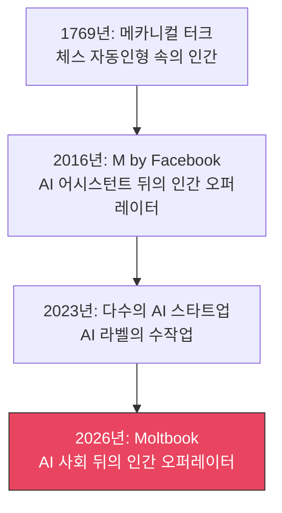
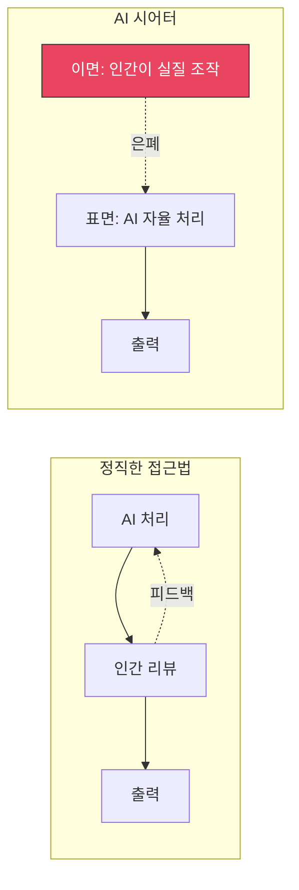

## Moltbook은 무엇이었나

2025년 하반기부터 급속히 주목받은 Moltbook. "AI 에이전트가 자율적으로 사회를 형성하고, 서로 거래하며, 커뮤니케이션한다"는 미래적인 비전으로 투자자와 미디어의 관심을 한 몸에 받았습니다.

SNS에서는 "드디어 AI가 독자적인 사회를 만들기 시작했다"며 화제가 되었고, 기술 컨퍼런스에서도 빈번하게 다뤄졌습니다. 하지만 그 이면에는 큰 문제가 숨겨져 있었습니다.

## Forbes 조사가 밝혀낸 실태

2026년 2월, Forbes의 조사 보도가 충격적인 사실을 밝혔습니다. Moltbook의 '자율적인 AI 사회'는 실제로 <strong>인간 오퍼레이터가 뒤에서 조작</strong>하고 있었다는 것입니다.

구체적으로는:

- AI 에이전트 간의 '자율적 대화'를 인간이 내용을 모니터링하고 수정하고 있었습니다
- '자발적 거래'의 상당수는 인간이 사전에 시나리오를 설계한 것이었습니다
- 외부에서 보이는 '창발적 사회 구조'는 인간이 의도적으로 디자인한 것이었습니다

이는 단순한 기술적 과장이 아니라 <strong>근본적인 허위 표시</strong>의 문제입니다.

## 'AI 시어터'라는 구조적 문제

이 현상은 'AI 시어터(AI Theater)'라고 불립니다. 무대 위에서는 AI가 자율적으로 연기하는 것처럼 보이지만, 실제로는 무대 뒤에서 인간이 실을 당기고 있습니다. 말 그대로 꼭두각시 극장입니다.

### 역사적으로 반복되는 패턴

18세기 '메카니컬 터크(Mechanical Turk)'로부터 250년 이상이 지났지만, 본질적으로 같은 구조가 반복되고 있습니다. 기술의 이름만 바뀌었을 뿐, <strong>'자동으로 보이게 만든 수동'</strong>이라는 구조는 변하지 않았습니다.

### AI 시어터가 발생하는 이유

1. <strong>기대와 현실의 갭</strong>: 투자자와 사용자가 AI에 기대하는 수준과 실제 기술의 성숙도 사이에 큰 차이가 있습니다
2. <strong>자금 조달 압박</strong>: '완전 자율 AI'를 내세우지 않으면 투자를 받기 어려운 시장 환경입니다
3. <strong>데모 중심 문화</strong>: 완벽한 데모를 보여주는 것이 전부라는 풍조가 있습니다
4. <strong>검증의 어려움</strong>: 외부에서 AI의 자율도를 정확하게 측정할 수단이 제한적입니다

## 진짜 자율성과 가짜를 구분하는 5가지 지표

엔지니어링 매니저로서 수많은 AI 시스템을 평가해 온 경험을 바탕으로 다음 지표를 제안합니다.

### 1. 장애 시 동작을 관찰합니다

진짜 자율 AI는 예상치 못한 상황에서도 어떤 형태로든 대응을 시도합니다. 반면 인간이 조작하는 시스템은 오퍼레이터가 부재한 시간대에 품질이 급격히 떨어집니다.

### 2. 응답 패턴의 일관성을 확인합니다

인간이 개입하는 경우 응답 시간에 편차가 나타납니다. 특히 심야 시간대와 주간 시간대에서 응답 품질에 차이가 있다면 주의가 필요합니다.

### 3. 엣지 케이스(Edge Case) 대응력을 테스트합니다

진정으로 자율적인 시스템은 학습 데이터에 없는 케이스에서도 일정 수준의 추론이 가능합니다. 대본대로의 케이스만 완벽하게 대응하는 시스템은 의심해 볼 필요가 있습니다.

### 4. 확장성(Scalability)을 검증합니다

인간이 뒤에서 조작하는 경우 동시 요청 수의 증가에 비례하여 품질이 저하됩니다. 진짜 AI 시스템은 하드웨어 제약 내에서 일관된 성능을 유지합니다.

### 5. 기술적 추적 가능성(Traceability)을 확인합니다

모델 버전, 추론 로그, 의사결정 과정을 공개할 수 있는지 여부가 중요합니다. 투명성이 없는 AI 시스템에는 항상 경계가 필요합니다.

## 엔지니어링 조직에 대한 시사점

### AI 도입 시 평가 프레임워크

AI 도구나 서비스를 도입할 때 다음 질문을 반드시 확인해야 합니다:

- <strong>"이 AI는 완전히 자율적인가요, 아니면 인간의 리뷰가 포함되어 있나요?"</strong>
- <strong>"추론 로그나 모델의 동작을 감사할 수 있나요?"</strong>
- <strong>"SLA는 AI 단독으로 보장되나요?"</strong>

'인간이 보조한다'는 것 자체가 나쁜 것은 아닙니다. 오히려 현 시점에서는 많은 AI 시스템에 인간의 감독이 필요합니다. 문제는 <strong>그 사실을 숨기고 '완전 자율'이라고 속이는 것</strong>입니다.

### Human-in-the-Loop의 올바른 위치

Human-in-the-Loop(HITL)은 부끄러운 것이 아니라 오히려 <strong>책임 있는 AI 운용의 증거</strong>입니다. Anthropic의 Constitutional AI도, Google의 검색 품질 평가도, 인간의 피드백을 명시적으로 포함하고 있습니다.

## 향후 전망

Moltbook 사건은 AI 업계 전체에 중요한 교훈을 남겼습니다.

1. <strong>규제 강화</strong>: EU의 AI Act에 이어 AI 제품의 '자율성 표시'에 관한 규제가 각국에서 논의되기 시작했습니다
2. <strong>제3자 감사 수요 증가</strong>: AI 시스템의 실태를 검증하는 독립적인 감사 기관의 필요성이 높아지고 있습니다
3. <strong>투명성의 경쟁 우위화</strong>: 기술적 투명성을 적극적으로 공개하는 기업이 장기적으로 신뢰를 획득하는 시대로 접어들고 있습니다

AI 기술은 확실히 발전하고 있습니다. 하지만 그 발전을 올바르게 전달하고 성실하게 운용하는 것이 업계 전체의 신뢰를 지키는 유일한 방법입니다. 극장의 막을 올려 무대 뒤를 보여주는 용기, 그것이야말로 앞으로의 AI 기업에 필요한 자세가 아닐까요.

## 참고 자료

- [Forbes: Moltbook Looked Like an Emerging AI Society, But Humans Were Pulling the Strings](https://www.forbes.com/sites/ronschmelzer/2026/02/10/moltbook-looked-like-an-emerging-ai-society-but-humans-were-pulling-the-strings/)
- [EU AI Act — European Commission](https://digital-strategy.ec.europa.eu/en/policies/regulatory-framework-ai)
