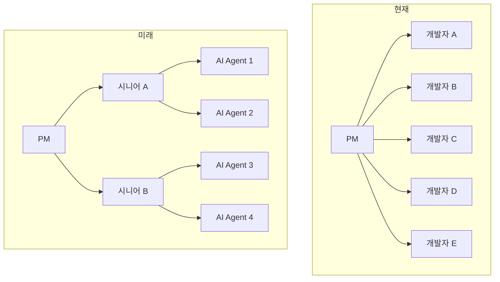
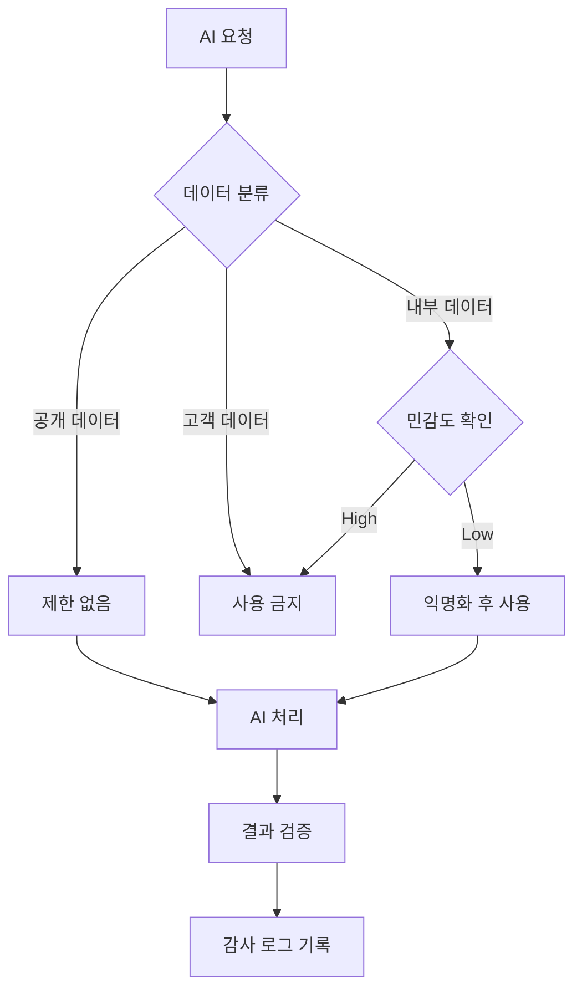
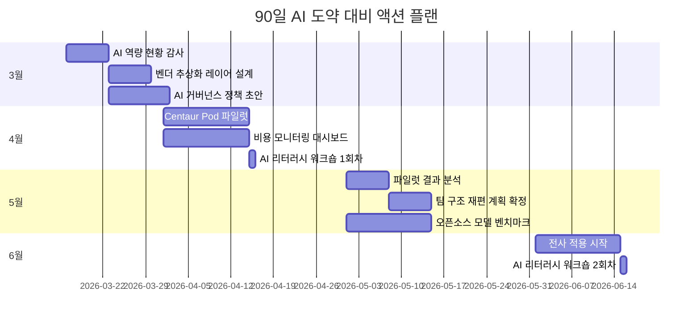

## Morgan Stanley의 경고: "세계는 준비되지 않았다"

2026년 3월 13일, Morgan Stanley는 한 리포트를 발표했습니다. 핵심 메시지는 단순합니다:

> "2026년 4〜6월 사이에 AI 능력의 <strong>비선형 도약(non-linear jump)</strong>이 일어날 것이며, 대부분의 조직은 이에 준비되지 않았다."

이것은 마케팅 버즈워드가 아닙니다. Morgan Stanley의 분석에 따르면 미국 최상위 AI 연구소들에 <strong>전례 없는 규모의 컴퓨트가 집중</strong>되고 있으며, 이 연산량의 10배 증가가 모델 "지능"을 2배로 끌어올리는 스케일링 법칙이 여전히 유효하다는 것입니다.

실제로 OpenAI의 최신 GPT-5.4 "Thinking" 모델은 GDPVal 벤치마크에서 <strong>83.0%</strong>를 기록하며 인간 전문가 수준에 도달했습니다. 이는 단순한 점진적 개선이 아니라, 경제적으로 가치 있는 작업에서 AI가 인간을 대체할 수 있는 임계점에 근접하고 있음을 의미합니다.

엔지니어링 리더로서 이 예측이 맞든 틀리든, <strong>준비하지 않는 것이 가장 큰 리스크</strong>입니다. 이 글에서는 CTO/VPoE/EM이 지금 당장 실행해야 할 5가지 준비 전략을 정리합니다.

## 1. AI 도입 로드맵을 분기 단위로 재설계하라

대부분의 조직은 연간 단위로 AI 도입 계획을 세웁니다. 하지만 모델 성능이 3〜6개월 만에 세대교체되는 환경에서 연간 계획은 의미가 없습니다.

### 실행 방안

- <strong>분기별 AI 역량 재평가</strong>: 매 분기 시작 시 최신 모델의 벤치마크를 확인하고, 현재 워크플로우에서 자동화 가능한 영역을 재식별합니다.
- <strong>"AI-Ready" 백로그 관리</strong>: 현재는 수동으로 하고 있지만 AI 성능이 향상되면 자동화할 수 있는 작업 목록을 별도로 관리합니다.
- <strong>벤더 락인 회피</strong>: 단일 AI 벤더에 종속되지 않도록 추상화 레이어를 설계합니다. MCP(Model Context Protocol)와 같은 표준, 그리고 [LangGraph, CrewAI, Dapr처럼 교체 가능한 프레임워크](/ko/blog/ko/ai-agent-framework-comparison-2026-langgraph-crewai-dapr-production)가 이를 돕습니다.

```typescript
// AI 벤더 추상화 레이어 예시
interface AIProvider {
  complete(prompt: string, options: CompletionOptions): Promise<Response>;
  embed(text: string): Promise<number[]>;
}

class AIService {
  private providers: Map<string, AIProvider> = new Map();

  // 분기별 벤더 교체가 용이한 구조
  switchProvider(name: string): void {
    this.activeProvider = this.providers.get(name);
  }
}
```

## 2. 팀 구조를 "AI 협업 단위"로 재편하라

Morgan Stanley 리포트가 예측하는 수준의 AI 도약이 실현되면, 현재의 팀 구조는 비효율적이 됩니다. 중요한 것은 <strong>AI를 도구로 쓰는 팀</strong>이 아니라 <strong>AI와 협업하는 팀</strong>으로의 전환입니다.

### 실행 방안

- <strong>Centaur Pod 모델 도입</strong>: 2〜3명의 시니어 엔지니어 + AI 에이전트 조합으로 기존 5〜6명 팀의 산출량을 달성합니다.
- <strong>AI 오케스트레이터 역할 신설</strong>: 팀 내에서 [AI 에이전트의 작업 흐름](/ko/blog/ko/claude-code-agentic-workflow-patterns-5-types)을 설계하고 품질을 관리하는 전문 역할을 만듭니다.
- <strong>코드 리뷰 프로세스 업데이트</strong>: AI가 생성한 코드에 대한 리뷰 기준과 프로세스를 별도로 정의합니다.



## 3. 인프라 비용 구조를 근본적으로 재검토하라

Morgan Stanley 리포트는 <strong>"15-15-15" 다이나믹</strong>을 언급합니다: 15년 데이터센터 리스, 15% 수익률, 와트당 $15의 순가치 창출. AI 컴퓨트에 대한 수요 폭발로 인프라 비용 구조가 근본적으로 바뀌고 있습니다.

### 실행 방안

- <strong>하이브리드 AI 인프라 전략</strong>: 모든 AI 워크로드를 클라우드에 올리지 마세요. 추론(inference)은 로컬/엣지에서, 학습(training)은 클라우드에서 하는 분리 전략을 검토합니다.
- <strong>비용 모니터링 대시보드 구축</strong>: [AI API 호출 비용](/ko/blog/ko/llm-api-pricing-comparison-2026-gpt5-claude-gemini-deepseek)을 실시간으로 추적하고, 모델별/기능별 ROI를 측정합니다.
- <strong>오픈소스 모델 활용 계획</strong>: Mistral 3, GLM-5 등 프로프라이어터리 모델의 92% 성능을 15% 비용으로 달성하는 오픈소스 대안을 항상 벤치마킹합니다.

| 전략 | 비용 절감 효과 | 적합한 워크로드 |
|------|--------------|----------------|
| 로컬 추론 (Ollama + llama.cpp) | 70〜90% | 반복적 코드 생성, 문서 요약 |
| 클라우드 API (GPT-5.x, Claude) | 기준선 | 복잡한 추론, 멀티모달 |
| 오픈소스 파인튜닝 | 50〜70% | 도메인 특화 작업 |
| 배치 처리 최적화 | 30〜50% | 야간 분석, 대량 처리 |

## 4. AI 거버넌스 프레임워크를 선제적으로 구축하라

AI 능력이 급격히 향상되면, 거버넌스 없는 AI 사용은 조직에 실질적인 리스크가 됩니다. 최근 Anthropic이 미 국방부의 대량 감시 및 자율 무기에 대한 AI 사용을 거부하여 "공급망 리스크"로 분류된 사건은, AI 거버넌스가 단순한 컴플라이언스가 아닌 <strong>비즈니스 연속성의 문제</strong>임을 보여줍니다.

### 실행 방안

- <strong>AI 사용 정책 수립</strong>: 어떤 데이터를 AI에 입력할 수 있는지, AI 출력물의 검증 기준은 무엇인지 명문화합니다.
- <strong>모델 의존성 관리</strong>: 특정 모델의 퇴역(GPT-4o 퇴역 사례처럼)에 대비한 마이그레이션 계획을 사전에 수립합니다.
- <strong>AI 감사 로그 체계 구축</strong>: AI가 내린 결정과 생성한 결과물에 대한 추적 가능성(traceability)을 확보합니다.



## 5. 엔지니어링 팀의 AI 리터러시를 체계적으로 높여라

Morgan Stanley가 "세계가 준비되지 않았다"고 경고한 핵심은 <strong>기술 자체가 아니라 기술을 활용하는 조직의 역량</strong>입니다. AI 도구를 사용할 줄 아는 것과 AI를 전략적으로 활용하는 것은 전혀 다른 차원입니다.

### 실행 방안

- <strong>프롬프트 엔지니어링 워크숍</strong>: 월 1회, 실제 업무 시나리오 기반으로 진행합니다. 단순히 "AI에게 질문하기"가 아니라 "AI와 함께 설계하기" 수준으로 끌어올립니다.
- <strong>AI 코드 리뷰 스킬</strong>: AI가 생성한 코드의 보안 취약점, 성능 이슈, 아키텍처 적합성을 평가하는 역량을 키웁니다.
- <strong>내부 AI 챔피언 프로그램</strong>: 각 팀에서 AI 활용 사례를 발굴하고 공유하는 "AI 챔피언"을 지정합니다.

### 단계별 AI 리터러시 성숙도 모델

| 레벨 | 이름 | 설명 | 대표 활동 |
|------|------|------|----------|
| L1 | 소비자 | AI 도구를 단순 사용 | ChatGPT로 질문하기 |
| L2 | 실무자 | 업무에 AI를 통합 | AI 코드 생성 + 리뷰 |
| L3 | 설계자 | AI 워크플로우 설계 | 에이전트 파이프라인 구축 |
| L4 | 전략가 | AI 기반 조직 전략 수립 | AI 도입 ROI 분석, 팀 재편 |

대부분의 엔지니어는 L1〜L2에 머물러 있습니다. Morgan Stanley의 예측이 현실화되는 시점에서 경쟁력을 유지하려면, 팀의 <strong>핵심 인력을 L3 이상으로 끌어올리는 것</strong>이 급선무입니다.

## 타임라인: 지금부터 6월까지의 액션 플랜

Morgan Stanley가 예측한 도약 시점인 4〜6월까지 남은 시간은 많지 않습니다. 다음은 현실적인 90일 액션 플랜입니다.



## 결론: 낙관도 비관도 아닌, 실용주의적 준비

Morgan Stanley의 예측이 정확히 맞을지는 아무도 모릅니다. 하지만 방향성은 분명합니다. AI 능력은 선형적으로 발전하지 않으며, 언젠가 반드시 비선형 도약이 일어납니다.

핵심은 다음 세 가지입니다:

1. <strong>유연한 아키텍처</strong>: 모델과 벤더를 빠르게 교체할 수 있는 구조
2. <strong>적응 가능한 팀</strong>: AI와 협업할 수 있는 역량을 갖춘 인력
3. <strong>체계적인 거버넌스</strong>: 빠른 도입과 안전한 사용 사이의 균형

이 세 가지가 갖춰져 있다면, 도약이 4월에 오든 12월에 오든, 여러분의 조직은 준비되어 있을 것입니다.

## 참고 자료

- [Morgan Stanley warns an AI breakthrough is coming in 2026](https://fortune.com/2026/03/13/elon-musk-morgan-stanley-ai-leap-2026/)
- [OpenAI GPT-5.4 "Thinking" Model Release](https://llm-stats.com/ai-news)
- [Anthropic Pentagon Supply Chain Risk Dispute](https://techcrunch.com/2026/03/09/openai-and-google-employees-rush-to-anthropics-defense-in-dod-lawsuit/)
- [MIT TLT Training Efficiency Method](https://news.mit.edu/2026/new-method-could-increase-llm-training-efficiency-0226)
- [Claude for Excel/PowerPoint Shared Context](https://claude.com/blog/claude-excel-powerpoint-updates)
