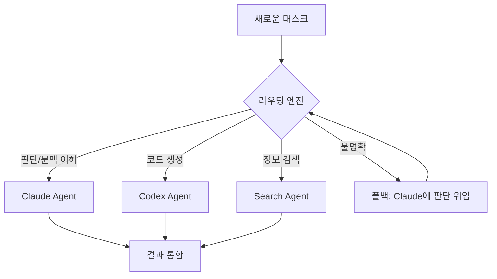
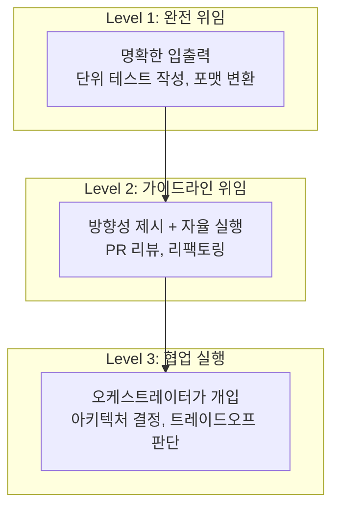
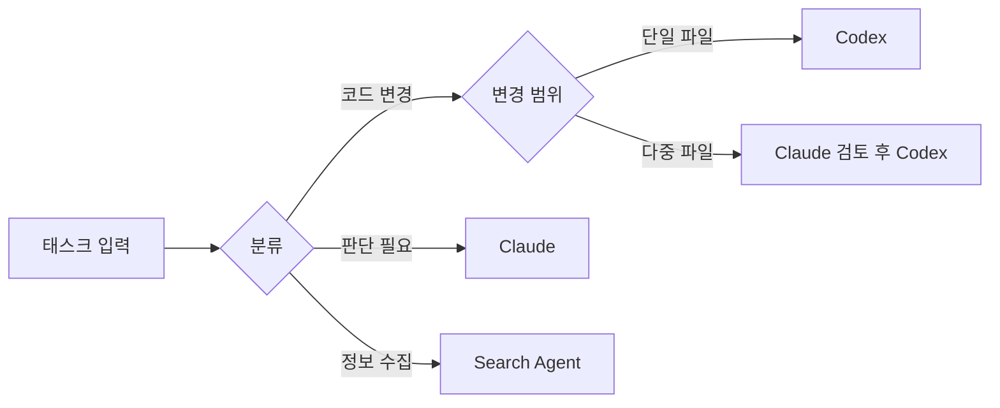

## 개요

AI 에이전트를 한 대가 아니라 여러 대 동시에 운용하는 시대가 왔습니다. Claude는 판단과 문맥 이해에, Codex는 치밀한 코드 생성에 강점을 가집니다. 하지만 가장 어려운 문제는 "이 태스크를 어느 에이전트에게 보낼 것인가?"라는 **라우팅(Routing)** 설계입니다.

이 글에서는 Engineering Manager(EM)의 시점에서, 멀티에이전트 라우팅이 왜 **부하 관리에서의 권한 위임**과 동일한 구조인지 논의합니다.

## 왜 라우팅이 최난관인가

### 단일 에이전트의 한계

한 에이전트에 모든 것을 맡기면 컨텍스트 윈도우 초과, 전문성 부족, 응답 지연 등의 문제가 발생합니다. 그래서 복수 에이전트를 전문 영역별로 분할하게 됩니다.

### 분할 후의 진짜 문제

에이전트를 분할하는 것 자체는 어렵지 않습니다. 진짜 문제는:

1. **태스크 분류의 모호성**: "이 PR 리뷰는 코드 품질인가, 아키텍처 판단인가?"
2. **컨텍스트 전달 비용**: 에이전트 간 문맥을 넘길 때 정보 손실
3. **실패 시 재라우팅**: 한 에이전트가 실패했을 때의 폴백 전략
4. **의존성 관리**: A의 출력이 B의 입력이 되는 파이프라인 설계



## EM의 권한 위임과 동일한 구조

### 매니저의 일상

Engineering Manager가 매일 하는 일을 생각해 보세요:

| EM의 판단 | 에이전트 라우팅 |
|-----------|---------------|
| "이 기능 구현은 A 씨에게" | "코드 생성은 Codex에게" |
| "아키텍처 검토는 B 씨에게" | "설계 판단은 Claude에게" |
| "간단한 버그 수정은 주니어에게" | "단순 태스크는 경량 모델에게" |
| "애매한 건 내가 직접" | "불명확한 건 오케스트레이터가 처리" |

### 권한 위임의 3계층

EM 경험에서 나온 권한 위임 프레임워크를 에이전트에 적용하면:



**Level 1 — 완전 위임**: 입출력이 명확한 태스크. 단위 테스트 작성, JSON 포맷 변환 등. 이건 Codex에 던지면 됩니다.

**Level 2 — 가이드라인 위임**: 방향성은 정하되 구체적 실행은 에이전트에 맡기는 태스크. PR 리뷰, 코드 리팩토링 등. Claude가 가이드라인을 작성하고 Codex가 실행합니다.

**Level 3 — 협업 실행**: 오케스트레이터 자체가 판단에 깊이 관여해야 하는 태스크. 아키텍처 결정, 기술 선택 등.

## 실전 사례에서 배우는 라우팅 설계

### okash1n의 Claude Code + Codex MCP 구성

[okash1n(super_bonochin)](https://x.com/okaboringcode)은 Claude Code에 Codex를 MCP로 연결하여 운용하는 구성을 공유했습니다. 이 구성의 핵심은:

- **Claude Code가 오케스트레이터** 역할을 하며 전체 흐름을 관리
- **Codex는 MCP 서버**로서 코드 생성 전문가 역할
- Claude가 "이건 코드 생성이다"라고 판단하면 Codex에 위임

이것은 곧 **EM(Claude)이 시니어 엔지니어(Codex)에게 구현을 위임**하는 구조입니다.

### NabbilKhan의 8체 에이전트 운용

NabbilKhan은 8개의 에이전트를 동시 운용하는 구성을 공개했습니다. 이때 부딪힌 가장 큰 문제가 바로 **라우팅**이었습니다:

- 8개 에이전트 중 "누가 이 태스크를 처리할 것인가"의 판단 비용
- 태스크가 여러 에이전트의 전문 영역에 걸쳐 있을 때의 분할 전략
- 에이전트 간 컨텍스트 동기화의 어려움

이것은 **8명의 엔지니어를 관리하는 EM**이 겪는 것과 완전히 같은 문제입니다.

## 라우팅 설계의 핵심 원칙

### 1. 명확한 역할 정의 (Role Boundary)

각 에이전트의 책임 범위를 명확하게 문서화합니다. Job Description을 작성하듯이.

```yaml
# agents/codex.yaml
name: Codex Agent
role: 코드 생성 전문
capabilities:
  - 함수/클래스 구현
  - 단위 테스트 작성
  - 리팩토링 실행
boundaries:
  - 아키텍처 결정 금지
  - 외부 API 설계 금지
escalation: Claude Agent에 에스컬레이션
```

### 2. 라우팅 기준의 명시적 설계



### 3. 실패 시 에스컬레이션 경로

부하가 막히면 매니저에게 올라오듯, 에이전트가 실패하면 오케스트레이터로 에스컬레이션합니다.

```python
async def route_task(task: Task) -> Result:
    agent = classify(task)
    result = await agent.execute(task)

    if result.confidence < 0.7:
        # 에스컬레이션: 오케스트레이터가 직접 처리
        return await orchestrator.handle(task, context=result)

    return result
```

### 4. 피드백 루프로 라우팅 개선

매니저가 위임 결과를 보고 다음 판단을 조정하듯, 에이전트 라우팅도 결과를 기반으로 개선해야 합니다:

- 에이전트별 성공/실패율 추적
- 재라우팅이 빈번한 패턴 식별
- 라우팅 규칙의 점진적 세분화

## 결론

멀티에이전트 오케스트레이션의 본질은 기술이 아니라 **설계 철학**입니다. EM이 팀원에게 일을 분배하듯, 에이전트에게 태스크를 분배합니다. 그 핵심은:

1. **역할 경계를 명확히** — Job Description처럼 에이전트의 책임을 정의
2. **위임 레벨을 구분** — 완전 위임 / 가이드라인 위임 / 협업 실행
3. **에스컬레이션 경로를 설계** — 실패 시의 폴백을 미리 준비
4. **피드백으로 지속 개선** — 라우팅 결과를 추적하고 규칙을 세분화

결국 좋은 매니저가 좋은 팀을 만들듯이, 좋은 오케스트레이터가 좋은 에이전트 시스템을 만듭니다.

## 참고 자료

- [okash1n(super_bonochin)의 Claude Code + Codex MCP 구성](https://x.com/okaboringcode)
- [NabbilKhan의 멀티에이전트 운용 사례](https://x.com/NabbilKhan)
- [Anthropic - Building effective agents](https://docs.anthropic.com/en/docs/build-with-claude/agent-patterns)
- [OpenAI - Codex](https://openai.com/index/codex/)
