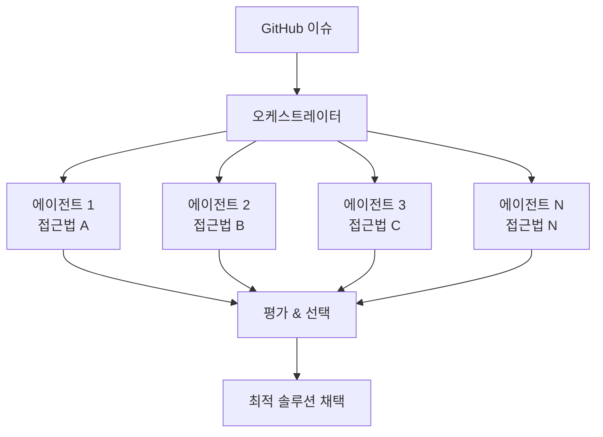

## 개요

2026년 2월, SWE-bench Verified 리더보드에 흥미로운 이름이 등장했습니다. <strong>Verdent AI</strong>가 <strong>76.1%</strong>의 해결률을 기록하며 상위권에 진입한 것입니다. 주목할 점은 이 성과가 단일 대형 모델이 아닌, <strong>복수 에이전트의 병렬 실행 아키텍처</strong>로 달성되었다는 사실입니다.

이는 소프트웨어 엔지니어링 자동화 분야에서 중요한 전환점을 시사합니다. "더 큰 모델"이 아닌 "더 나은 협업 구조"가 성과의 열쇠가 될 수 있다는 것을 보여주기 때문입니다.

## SWE-bench Verified란?

SWE-bench는 실제 GitHub 이슈를 기반으로 AI의 소프트웨어 엔지니어링 능력을 평가하는 벤치마크입니다. Verified 버전은 사람이 필터링한 500개의 인스턴스로 구성되어 있으며, OpenAI와 협력하여 만든 신뢰도 높은 데이터셋입니다.

평가 방식은 단순합니다. 실제 오픈소스 프로젝트의 이슈와 테스트 케이스가 주어지고, AI가 코드를 수정하여 테스트를 통과시키는 비율을 측정합니다.

## 기존 패러다임: 단일 대형 모델의 한계

지금까지 SWE-bench 상위권은 주로 단일 대형 모델들이 차지해 왔습니다.

| 순위 | 시스템 | 해결률 | 접근 방식 |
|------|--------|--------|----------|
| - | Claude Opus 4 계열 | ~70%+ | 단일 모델 + 도구 사용 |
| - | GPT-5 계열 | ~70%+ | 단일 모델 + 도구 사용 |
| - | <strong>Verdent AI</strong> | <strong>76.1%</strong> | <strong>멀티 에이전트 병렬 실행</strong> |

단일 모델 접근 방식은 모델의 크기와 능력에 의존합니다. 더 좋은 성능을 원하면 더 큰 모델, 더 많은 연산이 필요했습니다. 하지만 이 방식에는 근본적인 한계가 있습니다.

- <strong>단일 관점의 제약</strong>: 하나의 모델은 하나의 해석 경로를 따릅니다
- <strong>오류 복구의 어려움</strong>: 잘못된 방향으로 진행하면 되돌리기 어렵습니다
- <strong>컨텍스트 윈도우의 한계</strong>: 복잡한 코드베이스 전체를 파악하기 어렵습니다

## 새로운 패러다임: 멀티 에이전트 병렬 실행

Verdent AI의 접근 방식은 근본적으로 다릅니다.

### 핵심 메커니즘

1. <strong>병렬 분석</strong>: 여러 에이전트가 동시에 같은 문제를 분석합니다. 각 에이전트는 서로 다른 전략으로 접근할 수 있습니다.

2. <strong>다양한 해결 경로</strong>: 하나의 에이전트가 실패해도 다른 에이전트가 올바른 경로를 찾을 수 있습니다. 이는 단일 모델의 "한 번에 맞춰야 한다"는 압박에서 벗어나게 합니다.

3. <strong>최적 결과 선택</strong>: 여러 솔루션 중 테스트를 통과하는 최적의 결과를 채택합니다.

4. <strong>집합적 지능</strong>: 개별 에이전트의 능력 합보다 시스템 전체의 능력이 더 큽니다.

## 엔지니어링 매니저의 관점: 팀 vs 개인

이 결과는 소프트웨어 엔지니어링 현장에서도 익숙한 논의와 맞닿아 있습니다.

> <strong>뛰어난 개인 1명 vs 보통 실력의 팀 5명, 어느 쪽이 더 생산적인가?</strong>

AI 세계에서도 동일한 질문이 유효합니다.

| 관점 | 단일 대형 모델 (개인) | 멀티 에이전트 (팀) |
|------|---------------------|-------------------|
| 강점 | 일관된 맥락 유지 | 다양한 관점, 오류 보완 |
| 약점 | 단일 실패점 | 조율 비용, 일관성 관리 |
| 확장성 | 모델 크기에 의존 | 에이전트 수로 확장 가능 |
| 비용 효율 | 대형 모델 = 높은 비용 | 소형 모델 여러 개 = 유연한 비용 |

실제 소프트웨어 팀에서도 코드 리뷰, 페어 프로그래밍, 몹 프로그래밍 등의 협업 기법이 개인의 한계를 넘는 것처럼, AI 에이전트 세계에서도 <strong>협업 구조가 개별 능력을 초월하는 결과</strong>를 만들어내고 있습니다.

## 실무에 주는 시사점

### 1. AI 도구 선택 기준의 변화

지금까지 "어떤 모델을 쓸 것인가"가 핵심 질문이었다면, 앞으로는 <strong>"어떤 아키텍처로 에이전트를 조합할 것인가"</strong>가 더 중요한 질문이 됩니다.

### 2. 비용 대비 성능 최적화

반드시 가장 비싼 대형 모델을 사용할 필요가 없습니다. 중소형 모델 여러 개를 병렬로 실행하는 것이 비용 대비 더 나은 성과를 낼 수 있습니다.

### 3. 오류 허용 시스템 설계

멀티 에이전트 아키텍처는 본질적으로 <strong>장애 허용(fault-tolerant)</strong> 시스템입니다. 하나의 에이전트가 실패해도 전체 시스템은 여전히 정답을 찾을 수 있습니다.

## 앞으로의 전망

Verdent AI의 76.1% 달성은 시작에 불과합니다. 멀티 에이전트 아키텍처가 발전하면 다음과 같은 변화가 예상됩니다.

- <strong>전문화된 에이전트 생태계</strong>: 디버깅 전문, 리팩토링 전문, 테스트 작성 전문 등 역할별 에이전트
- <strong>동적 팀 구성</strong>: 문제의 성격에 따라 최적의 에이전트 조합을 자동으로 결정
- <strong>학습하는 오케스트레이터</strong>: 과거 성공/실패 패턴을 학습하여 점점 더 나은 에이전트 배치

## 결론

단일 모델의 크기 경쟁에서 멀티 에이전트의 아키텍처 경쟁으로, 소프트웨어 엔지니어링 자동화의 패러다임이 전환되고 있습니다. Verdent AI의 SWE-bench Verified 76.1% 달성은 이 전환의 구체적인 증거입니다.

개발자로서, 그리고 엔지니어링 리더로서 우리는 "어떤 AI 모델을 쓸 것인가"를 넘어 <strong>"어떤 AI 팀을 구성할 것인가"</strong>를 고민해야 할 시점에 와 있습니다.

## 참고 자료

- [SWE-bench 공식 리더보드](https://www.swebench.com/)
- [Verdent AI SWE-bench 결과 (X/Twitter)](https://x.com/hasantoxr/status/2020854332217049281)
- [SWE-bench Verified 소개 (OpenAI)](https://openai.com/index/introducing-swe-bench-verified/)
