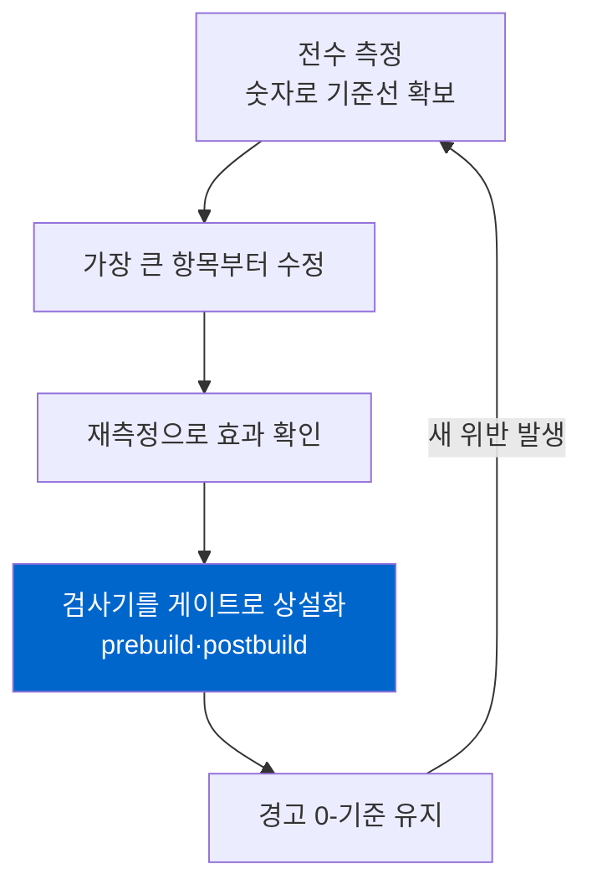

SEO 감사를 도구 리포트 한 장 뽑는 걸로 끝내는 경우가 많다. Lighthouse를 돌리고, Search Console 커버리지를 캡처하고, "개선 항목 12개" 스크린샷을 남긴다. 그런데 그렇게 끝낸 감사의 결과는 대부분 3개월 뒤에 원상복구된다. 누군가 새 글을 올리고, 컴포넌트를 리팩터링하고, 폰트를 바꾸는 순간 조용히 되돌아온다. 아무도 모른 채로.

지난 닷새 동안 내 4개 언어 블로그(ko/ja/en/zh, 언어당 글 298개)를 실제로 감사했다. 항목은 다섯 개였고 전부 고쳤다. 하지만 이 글에서 정작 하고 싶은 이야기는 "무엇을 고쳤나"가 아니다. 고친 다섯 개보다, 그것들이 다시는 되돌아오지 못하게 만든 <strong>빌드 게이트</strong>가 훨씬 중요했다는 쪽이다. 감사는 이벤트가 아니라 루프여야 한다.

## 리포트 한 장으로 끝나는 감사가 반드시 되돌아오는 이유

기술 SEO 이슈는 대부분 "코드가 틀렸다"가 아니라 "불변식이 어디에도 강제되지 않았다"에서 온다. 예를 들어 "공개 글은 draft 글을 내부 링크로 가리키면 안 된다"는 규칙은 명백하다. 그런데 이 규칙을 사람이 매번 기억해야 한다면, 추천 생성기가 초안 슬러그를 하나 물어오는 순간 404가 태어난다. 리포트는 그 404를 잡아서 보여주지만, 같은 실수를 막지는 못한다.

그래서 나는 감사를 세 단계 루프로 돌렸다. 측정한다. 가장 큰 항목부터 고친다. 그리고 그 항목을 <strong>검사기로 만들어 빌드에 못 박는다</strong>. 세 번째 단계가 빠지면 첫 두 단계는 반년마다 반복해야 하는 삽질이 된다. 게이트가 붙은 순간부터는, 같은 유형의 문제가 재발하면 `npm run build`가 실패한다. 사람의 기억력이 아니라 파이프라인이 규칙을 지킨다.

이 관점은 새 발명이 아니다. 테스트가 버그 회귀를 막는 것과 똑같은 논리를, 콘텐츠와 마크업 계층에 적용했을 뿐이다. 다만 SEO 영역에서는 이 습관이 의외로 드물다. 대부분의 팀이 "SEO 점검"을 분기별 수동 작업으로 남겨둔다.

이 글이 말하려는 루프를 그림 하나로 요약하면 이렇다.



## 닷새간 실제로 돌린 다섯 항목

먼저 측정 단계. 각 항목은 before/after를 숫자로 남겼다. 감으로 "좋아진 것 같다"가 아니라, 재현 가능한 수치로. (다섯 항목의 원본 기록은 [개선 이력 페이지](/ko/improvement-history)에도 남겨뒀다.)

| 날짜 | 항목 | Before | After | 게이트 |
|---|---|---|---|---|
| 07-02 | relatedPosts 무결성 | draft 참조 404 <strong>12개</strong> | 0개 | prebuild |
| 07-04 | hreflang 상호성 | 홈 클러스터 broken pair <strong>4쌍</strong> | 253페이지 파손 0 | postbuild |
| 07-05 | 성능 크리티컬 패스 | 렌더 블로킹 폰트 CSS <strong>405KB</strong> | 렌더 블로킹 0 | 수동 회귀 |
| 07-05 | 번역 구조 드리프트 | 불일치 슬러그 <strong>21/50</strong> | 1 (수용된 레거시) | prebuild |
| 07-06 | JSON-LD 엔티티 모델 | 글당 ld+json <strong>7블록</strong> | 1블록, 6노드 연결 | 컴포넌트 단일화 |

숫자만 보면 다섯 개의 독립된 수정처럼 보인다. 실제로는 하나의 관점을 공유한다. 전부 <strong>화면에 보이는 것이 아니라 크롤러가 읽는 마크업</strong>의 문제라는 점이다. hreflang도, JSON-LD도, draft 링크도 사용자 눈에는 안 보인다. 그래서 육안 QA로는 절대 안 잡히고, 자동 검사기로만 잡힌다.

before/after를 굳이 숫자로 못 박은 이유가 있다. "좋아진 것 같다"는 재현이 안 되고, 재현이 안 되면 게이트를 만들 수 없다. 게이트는 결국 "이 숫자가 임계값을 넘으면 실패"라는 판정이다. draft 참조 404가 12개라면, 게이트의 조건은 "0을 초과하면 빌드 에러"가 된다. 측정을 숫자로 남기는 순간, 그 측정이 그대로 회귀 테스트의 기준선이 된다. 이게 감사를 이벤트에서 루프로 바꾸는 첫 단추다. 참고로 발행 글 298개 중 인덱스 대상 55개, 나머지 972개(4언어 합산)는 draft로 피드에서 빠져 있다는 사실 자체도 측정으로 드러났다. 이 비율을 모르면 "왜 사이트맵에 글이 이것밖에 없나" 같은 헛다리를 짚는다.

다섯 항목 각각은 이미 별도 글로 깊게 다뤘다. 여기서는 반복하지 않는다. hreflang 상호성이 왜 양방향이어야 하는지는 [hreflang을 직접 감사해 홈페이지 버그를 찾은 기록](/ko/blog/ko/hreflang-reciprocity-audit-multilingual-2026)에, 스키마 조각을 하나의 `@graph`로 잇는 이유는 [JSON-LD @graph로 엔티티를 연결한 글](/ko/blog/ko/json-ld-graph-entity-linking-2026)에 정리했다. 이 글의 초점은 개별 기법이 아니라 다섯을 관통하는 루프 자체다.

## 가장 큰 항목부터, 그런데 측정값을 먼저 의심했다

우선순위는 단순했다. 영향 범위 × 재발 가능성이 가장 큰 항목부터. 그 기준으로 번역 구조 드리프트(21/50 슬러그)가 1번이었다.

여기서 배운 게 하나 있다. <strong>이상치는 작업 전에 측정 방법부터 검산해야 한다.</strong> "드리프트가 가장 큰 슬러그"를 열어보니, 실제로는 번역이 부실한 게 아니라 중첩 코드펜스가 깨져서 렌더링 자체가 망가진 경우였다. 한국어 파일에서 백틱 3개짜리 코드 블록 안에 또 백틱 3개짜리 블록을 넣는 바람에, 파서가 절반을 코드로, 절반을 본문으로 잘못 읽고 있었다. 측정기가 "구조 불일치"로 잡은 최대치는 번역 품질 문제가 아니라 파싱 오염이었다.

만약 측정값을 그대로 믿고 "번역을 다시 하자"로 갔다면, 엉뚱한 곳에 며칠을 썼을 것이다. 측정기가 무엇을 세는지 먼저 검산하니, 21건 중 최대 이상치는 코드펜스 문제였고 나머지는 번역에서 탈락한 섹션(약 40개)과 다이어그램(12개) 복원으로 정리됐다. 복원할 때는 언어마다 손으로 옮기지 않고 공통 템플릿에 문자열 파라미터만 바꿔 끼웠다. 그래야 2차 드리프트가 안 생긴다.

성능 항목에서도 비슷했다. 렌더 블로킹 폰트 CSS가 405KB였는데, 최적화의 첫 질문은 "어떻게 더 빨리 로드하나"가 아니었다. "이걸 로드할 필요가 있나"였다. 언어별로 안 쓰는 글리프까지 다 실어 나르고 있었다. Google Fonts를 언어별 서브셋으로 쪼개니 405KB가 언어에 따라 1〜137KB로 줄었고, 폰트 CSS를 비동기로 돌려 렌더 블로킹을 0으로 만들었다. 부수적으로 접근성 점수도 91에서 100으로 올랐다. 접근성을 숫자로 잡는 방법은 [Lighthouse 접근성 감사를 직접 돌려 고친 글](/ko/blog/ko/a11y-lighthouse-audit-fix-2026)에 따로 적었다.

## 고치는 게 아니라, 못 되돌아오게 만든다

루프의 세 번째 단계가 이 캠페인의 진짜 결과물이다. 고친 항목마다 검사기를 하나씩 붙였다.

relatedPosts 404를 예로 들면, 생성기 필터만 고치는 걸로 끝내지 않았다. 소비 직전 게이트에서 불변식을 강제했다. 빌드 전에 도는 `validate-publishing.mjs`가 이 규칙을 검사한다.

```javascript
// 인덱스 가능한 글끼리만 서로를 추천할 수 있다.
// draft/noindex/미래글/누락 슬러그를 가리키면 빌드 에러.
const indexableSlugsByLang = new Map(languages.map((lang) => [lang, new Set()]));
for (const post of posts.filter((item) => item.indexable)) {
  indexableSlugsByLang.get(post.lang).add(post.slug);
}

for (const post of posts.filter((item) => item.indexable)) {
  const related = Array.isArray(post.data.relatedPosts) ? post.data.relatedPosts : [];
  for (const rec of related) {
    if (!rec?.slug) continue;
    if (!indexableSlugsByLang.get(post.lang).has(rec.slug)) {
      errors.push(`${post.relPath}: relatedPosts references non-indexable post "${rec.slug}"`);
    }
  }
}
```

핵심은 <strong>생성 계층이 아니라 소비 직전 계층에서 막는다</strong>는 점이다. 추천을 만드는 코드가 100개여도, 최종적으로 발행되는 글이 초안을 가리키는 순간 딱 한 군데서 잡힌다. 이 게이트가 붙은 뒤로 draft 404는 산술적으로 0이 됐고, 앞으로도 0으로 유지된다.

hreflang은 소스만으로는 판정할 수 없다. 최종 HTML을 크롤링해서 페이지들이 실제로 서로를 가리키는지 봐야 한다. 그래서 이건 빌드 후(postbuild)에 돌린다. Google 공식 규칙은 명확하다. A가 B를 대체 버전으로 지목하면 B도 A를 지목해야 하고(리시프로시티), 각 페이지는 자기 자신도 가리켜야 한다(self-reference). 이 두 규칙을 그대로 코드로 옮겼다.

```javascript
for (const [url, targets] of annotations) {
  if (!targets.has(url)) missingSelf.push(url);        // self-reference 누락
  for (const target of targets) {
    if (target === url) continue;
    const back = annotations.get(target);
    if (back && !back.has(url)) {
      brokenPairs.push(`${url} -> ${target} (return link 없음)`);  // 상호성 파손
    }
  }
}
```

빌드를 돌리면 두 검사기가 실제로 이렇게 통과한다. 아래는 방금 이 글을 쓰면서 돌린 로그다.

```text
[publishing-check] posts by language: {"ko":{"total":298,"published":55,"indexable":55}, ...}
[publishing-check] past draft/noindex posts kept out of feeds: 972
[publishing-check] OK
...
[hreflang-check] annotated pages: 257
[hreflang-check] self-reference missing: 0
[hreflang-check] broken return-link pairs: 0
[orphan-check] pages: 260, orphans (allowlist 제외): 0
[hreflang-check] OK
```

`orphan-check`도 같은 postbuild에 얹었다. 어떤 페이지로도 내부 링크가 닿지 않는 고아 페이지는 크롤러가 발견하기 어렵고, 발견해도 고립된 신호로 읽는다. 감사 도중 고아였던 페이지 하나를 Footer 링크로 이어준 뒤, 재발을 막으려고 이 검사를 상설화했다. 발행된 글은 298개인데 인덱스 대상은 55개뿐이라는 점도 보인다. 나머지는 draft로 피드와 사이트맵에서 빠져 있다. AI 크롤러를 어떻게 차등 제어하는지는 [robots.txt와 llms.txt로 크롤러를 통제한 글](/ko/blog/ko/ai-crawler-control-robots-txt-llms-txt-2026)에서 따로 다뤘다.

## Google이 보장하지 않는 것

여기서 정직하게 선을 그어야 한다. 이 캠페인은 순위를 올리는 작업이 <strong>아니다</strong>. Google Search Central 공식 문서는 구조화 데이터가 리치 결과 <strong>자격</strong>을 부여할 뿐 게재나 순위를 보장하지 않는다고 못 박는다. hreflang도 순위 신호가 아니라 "사용자를 맞는 언어·지역 버전으로 안내하는" 라우팅 장치라고 설명한다. 잘못 넣은 hreflang이 없던 순위를 만들어주지 않고, 리시프로시티가 깨지면 그 주석은 그냥 무시된다.

그러니 이 다섯 항목의 정확한 효용은 이렇게 말하는 게 맞다. 크롤러가 내 사이트를 <strong>오해할 여지를 줄이는 위생 작업</strong>이다. 404 링크는 크롤 예산을 낭비시키고, 파손된 hreflang은 언어 타깃팅을 무효화하고, 조각난 JSON-LD는 "이 조직·이 저자·이 글"의 연결을 끊는다. 이걸 고치면 크롤러가 의도대로 읽을 확률이 올라간다. 그게 순위 상승으로 이어지는지는 콘텐츠 품질과 수많은 다른 변수에 달려 있고, 나는 웹 개발자이지 검색 알고리즘 내부를 아는 사람이 아니다. 그 부분은 단정하지 않는다.

한계를 인정하는 것도 루프의 일부다. 번역 드리프트는 21건에서 1건으로 줄였는데, 그 1건은 일부러 남겼다. 아주 오래된 레거시 글 하나가 언어 간 구조가 다른데, 지금 와서 억지로 맞추면 이미 색인된 URL 구조를 건드려야 하고 그 리스크가 얻는 것보다 컸다. 그래서 검사기의 allowlist에 그 슬러그 하나를 명시적으로 등록했다. "0이 아니면 무조건 실패"가 아니라, "수용하기로 결정한 예외는 코드에 근거를 남기고 통과시킨다"는 쪽이 현실적이다. 모든 항목을 0으로 만드는 게 목표가 아니라, 의도치 않은 재발을 막는 게 목표다.

성능 쪽에서도 한계를 봤다. 랩(Lighthouse 시뮬레이션) 수치와 실관측(observed LCP 2.4초)은 달랐다. 랩 점수만 보고 과최적화로 달리면, 정작 실사용자 환경에서는 체감이 없는데 코드만 복잡해진다. 랩과 필드의 괴리를 아는 게 오히려 멈출 지점을 알려준다.

## 바로 쓰는 체크리스트

내 블로그에 적용한 걸 일반화하면, 어떤 사이트든 이 루프를 이렇게 시작할 수 있다.

- <strong>측정 먼저, 그다음 의심.</strong> 이상치를 발견하면 고치기 전에 "측정기가 정확히 뭘 세는가"를 검산한다. 내 최대 드리프트는 번역 문제가 아니라 코드펜스 파싱 오염이었다.
- <strong>영향 × 재발 가능성으로 우선순위.</strong> 눈에 띄는 것보다, 조용히 계속 재발할 것부터.
- <strong>소비 직전 계층에서 막는다.</strong> 생성 코드가 여러 개면 그 각각을 고치지 말고, 발행 직전 한 곳에서 불변식을 강제한다.
- <strong>소스로 판정 가능하면 prebuild, 렌더 결과를 봐야 하면 postbuild.</strong> frontmatter·링크 참조는 prebuild, hreflang 상호성·고아 페이지는 최종 HTML을 크롤링하는 postbuild.
- <strong>고친 항목은 반드시 검사기로.</strong> 검사기 없이 끝낸 수정은 회귀 예약이다. 30줄짜리 검사기 하나가 분기별 수동 감사보다 낫다.
- <strong>순위를 약속하지 않는다.</strong> 이건 위생이지 마법이 아니다. 크롤러의 오해를 줄이는 것까지가 개발자의 몫이다.

닷새를 돌아보면, 가장 값진 산출물은 고친 다섯 개가 아니라 저장소에 남은 세 개의 검사기다. 다섯 개는 언젠가 잊히지만, 검사기는 내가 실수할 때마다 나 대신 기억한다. 감사를 이벤트가 아니라 루프로 만든다는 건 결국 이 뜻이다.

구조화 데이터를 서버사이드로 확실히 내보내거나, 다국어 사이트의 hreflang·JSON-LD·성능을 실측으로 점검하고 회귀 게이트까지 붙이고 싶다면 개인적으로 상담·구현 의뢰를 받는다. 서버가 크롤러에게 무엇을 보내는지를 코드로 통제하는 일이 내 전문 영역이다. 사이트를 서버가 내보내는 마크업 관점에서 다시 보고 싶다면 [LocalBusiness 구조화 데이터를 서버사이드로 내보낸 글](/ko/blog/ko/localbusiness-structured-data-server-side-vs-js-2026)도 같은 결의 이야기다.

---

이 글과 같은 AI 인용·GEO 실측은 일본어 note 연재 [「AIに引用されるブログの作り方」](https://note.com/jw_effloow/n/n91d7682a8aff)에서도 다룬다. 검색 노출 56만 회·AI 인용 19.6만 회라는 이 블로그의 원데이터에서 출발하는 시리즈다(일부 유료).
