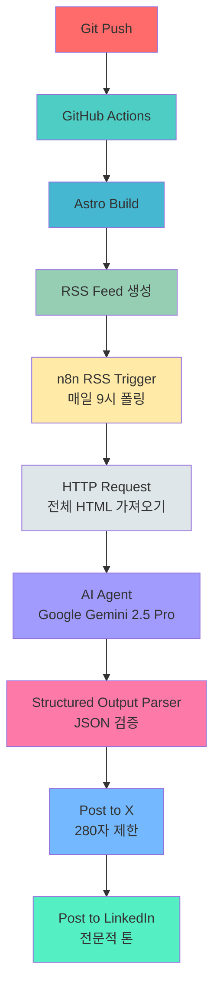
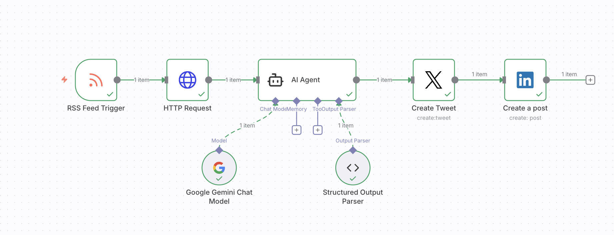

## 들어가며

블로그 포스트를 작성하고 나면 또 다른 작업이 기다립니다. X(Twitter), LinkedIn 등 다양한 소셜 미디어에 맞춤형 콘텐츠를 작성하고 배포하는 것입니다. 각 플랫폼마다 최적의 글자 수, 톤, 해시태그가 다르기 때문에 상당한 시간과 노력이 필요합니다.

이 글에서는 <strong>GitHub Actions로 블로그를 자동 빌드하고, RSS 피드를 생성한 뒤, n8n으로 소셜 미디어 배포까지 완전 자동화하는 방법</strong>을 소개합니다. 한 번 설정해두면 블로그 포스트만 작성하면 모든 것이 자동으로 처리됩니다.

## 전체 자동화 흐름



<strong>핵심 프로세스</strong>:
1. 블로그 포스트를 Git에 푸시하면 GitHub Actions가 자동으로 빌드
2. Astro가 정적 사이트를 생성하고 RSS 피드도 함께 생성
3. n8n이 RSS 피드를 매일 모니터링하여 새 포스트 감지
4. 새 포스트를 발견하면 전체 HTML 콘텐츠를 가져옴
5. Google Gemini AI가 콘텐츠를 분석하고 플랫폼별 맞춤형 포스트 생성
6. X(Twitter)와 LinkedIn에 자동으로 게시

## 1단계: 블로그 RSS 피드 생성

Astro에서 RSS 피드를 생성하는 것은 매우 간단합니다. `@astrojs/rss` 패키지를 사용하여 각 언어별로 RSS 피드를 생성할 수 있습니다.

### RSS 피드 생성 코드

`src/pages/rss-ko.xml.js` 파일을 생성합니다:

```javascript
import { getCollection } from 'astro:content';
import rss from '@astrojs/rss';
import { SITE_META } from '../consts';

export async function GET(context) {
  const now = new Date();

  // 한국어 블로그 포스트만 필터링
  const posts = (await getCollection('blog'))
    .filter((post) => post.id.startsWith('ko/') && post.data.pubDate <= now)
    .sort((a, b) => b.data.pubDate.valueOf() - a.data.pubDate.valueOf());

  return rss({
    title: SITE_META.ko.title,
    description: SITE_META.ko.description,
    site: context.site,
    items: posts.map((post) => {
      const [lang, ...slugParts] = post.id.split('/');
      const slug = slugParts.join('/');
      return {
        title: post.data.title,
        description: post.data.description,
        pubDate: post.data.pubDate,
        link: `/${lang}/blog/${lang}/${slug}/`,
      };
    }),
    customData: `<language>ko</language>`,
  });
}
```

<strong>핵심 포인트</strong>:
- `pubDate <= now`: 미래 날짜의 포스트는 제외 (예약 발행 지원)
- 언어별 RSS 피드 생성: `rss-ko.xml.js`, `rss-en.xml.js`, `rss-ja.xml.js`
- 포스트는 최신순으로 정렬
- RSS 표준 형식 준수

### RSS 피드 확인

빌드 후 다음 URL에서 RSS 피드를 확인할 수 있습니다:
- 한국어: `https://www.jangwook.net/rss-ko.xml`
- 영어: `https://www.jangwook.net/rss-en.xml`
- 일본어: `https://www.jangwook.net/rss-ja.xml`

## 2단계: n8n 워크플로우 구성

n8n은 노코드/로우코드 워크플로우 자동화 도구입니다. 시각적인 인터페이스로 복잡한 자동화를 쉽게 구축할 수 있습니다.

### n8n 워크플로우 노드 구성



전체 워크플로우는 6개의 노드로 구성됩니다:

#### 1. RSS Feed Trigger (RSS 피드 트리거)

```json
{
  "parameters": {
    "pollTimes": {
      "item": [
        {
          "hour": 9
        }
      ]
    },
    "feedUrl": "https://www.jangwook.net/rss-ko.xml"
  },
  "type": "n8n-nodes-base.rssFeedReadTrigger"
}
```

<strong>동작 방식</strong>:
- 매일 오전 9시에 RSS 피드를 체크
- 새로운 아이템이 발견되면 워크플로우 실행
- 마지막 체크 이후의 새 포스트만 처리

#### 2. HTTP Request (HTTP 요청)

```json
{
  "parameters": {
    "url": "={{ $json.link }}",
    "options": {}
  },
  "type": "n8n-nodes-base.httpRequest"
}
```

<strong>역할</strong>:
- RSS 피드의 링크에서 전체 HTML 콘텐츠를 가져옴
- AI 분석을 위한 완전한 컨텍스트 제공
- RSS의 짧은 요약이 아닌 전체 내용 활용

#### 3. AI Agent (Google Gemini 2.5 Pro)

이 노드가 전체 워크플로우의 핵심입니다. Google Gemini 2.5 Pro 모델을 사용하여 블로그 콘텐츠를 분석하고 플랫폼별 맞춤형 소셜 미디어 포스트를 생성합니다.

````json
{
  "parameters": {
    "promptType": "define",
    "text": "당신은 소셜 미디어 콘텐츠 전문가입니다. 웹 기사의 전문(HTML)을 기반으로 X(Twitter)와 LinkedIn에 최적화된 게시물을 작성해주세요.

**입력 데이터:**
```html
{{ $json.data }}
```

**작성 가이드라인:**

기사의 전체 내용을 충분히 이해한 후, 핵심적인 인사이트와 가치를 추출하여 각 플랫폼에 맞게 작성해주세요.

**X 게시물(280자 제한):**
- 기사에서 가장 흥미롭거나 중요한 포인트 1개를 강조
- 간결하고 임팩트 있는 내용으로 작성
- 독자의 호기심을 자극하여 클릭 유도
- 이모지 1-2개 사용(선택)
- 해시태그 2-3개 포함
- 링크는 별도로 추가되므로 본문에 포함하지 않음

**LinkedIn 게시물(권장 200-400자):**
- 전문적이고 신뢰감 있는 톤
- 기사의 핵심 인사이트와 시사점 설명
- 비즈니스 또는 산업 관점에서의 의미 강조
- 독자에게 실질적인 가치나 학습 포인트 제공
- 사고를 자극하는 질문이나 코멘트 포함(선택)
- 링크는 별도로 추가되므로 본문에 포함하지 않음
- 이모지는 최소한으로 사용하거나 사용하지 않음
- 해시태그 3-5개 포함

**출력 형식:**
반드시 다음 JSON 형식으로만 응답해주세요. 다른 설명이나 텍스트는 포함하지 마세요.

```json
{
    \"x\": \"X용 게시 텍스트(280자 이내, 링크 포함)\",
    \"linked_in\": \"LinkedIn용 게시 텍스트(링크 포함)\"
}
```

**중요 사항:**
- 기사의 전체 내용을 기반으로 작성하고, 표면적인 요약이 아닌 깊은 인사이트 제공
- JSON 형식만 출력해주세요
- 마크다운 코드블록(```)을 사용하지 마세요
- 추가 설명이나 주석을 포함하지 마세요
- 블로그 게시물의 링크를 포함해주세요: {{ $('RSS Feed Trigger').item.json.link }}
- 반드시 한국어로 작성해주세요.",
    "hasOutputParser": true,
    "options": {}
  },
  "type": "@n8n/n8n-nodes-langchain.agent"
}
````

<strong>프롬프트 설계 원칙</strong>:
- <strong>역할 정의</strong>: "소셜 미디어 콘텐츠 전문가"로 명확한 페르소나 부여
- <strong>입력 데이터</strong>: 전체 HTML 콘텐츠를 컨텍스트로 제공
- <strong>플랫폼별 가이드라인</strong>: X와 LinkedIn의 특성에 맞는 구체적인 지침
- <strong>구조화된 출력</strong>: JSON 형식으로 파싱 가능한 응답 요구
- <strong>언어 지정</strong>: 일본어로 작성하도록 명시

#### 4. Google Gemini Chat Model (언어 모델)

```json
{
  "parameters": {
    "modelName": "models/gemini-2.5-pro",
    "options": {}
  },
  "type": "@n8n/n8n-nodes-langchain.lmChatGoogleGemini"
}
```

<strong>모델 선택 이유</strong>:
- Gemini 2.5 Pro: 최신 모델로 뛰어난 컨텍스트 이해력
- 긴 HTML 콘텐츠 처리 능력
- 다국어 지원 (일본어, 한국어, 영어)
- 비용 효율적

#### 5. Structured Output Parser (구조화된 출력 파서)

```json
{
  "parameters": {
    "jsonSchemaExample": "{\n\t\"x\": \"x 투고 메시지\",\n    \"linked_in\": \"linked in 투고 메시지\"\n}"
  },
  "type": "@n8n/n8n-nodes-langchain.outputParserStructured"
}
```

<strong>역할</strong>:
- AI의 응답을 JSON으로 파싱
- 스키마 검증 및 오류 처리
- 다음 노드에서 사용할 수 있는 구조화된 데이터 제공

#### 6. Create Tweet & Create a post (소셜 미디어 게시)

<strong>X (Twitter) 노드</strong>:
```json
{
  "parameters": {
    "text": "={{ $json.output.x }}",
    "additionalFields": {}
  },
  "type": "n8n-nodes-base.twitter"
}
```

<strong>LinkedIn 노드</strong>:
```json
{
  "parameters": {
    "person": "e7xJgbUNtW",
    "text": "={{ $('AI Agent').item.json.output.linked_in }}",
    "additionalFields": {}
  },
  "type": "n8n-nodes-base.linkedIn"
}
```

## 3단계: AI 기반 콘텐츠 생성의 핵심

### 플랫폼별 최적화

<strong>X (Twitter) 최적화</strong>:
- <strong>280자 제한</strong>: 간결하고 임팩트 있는 메시지
- <strong>호기심 유발</strong>: 클릭을 유도하는 후킹 포인트
- <strong>해시태그</strong>: 2〜3개의 관련 태그로 도달 범위 확대
- <strong>이모지 활용</strong>: 시각적 주목도 향상

<strong>LinkedIn 최적화</strong>:
- <strong>전문적 톤</strong>: 비즈니스 맥락에서의 가치 강조
- <strong>인사이트 제공</strong>: 실용적인 학습 포인트 공유
- <strong>긴 형식</strong>: 200〜400자로 충분한 맥락 제공
- <strong>질문 포함</strong>: 엔게이지먼트 유도

### 실제 생성 예시

<strong>원본 블로그 포스트</strong>: "Claude Code Best Practices로 개발 생산성 향상"

<strong>AI가 생성한 X 포스트</strong>:
```
AI 코딩 어시스턴트를 '사용'하는 것과 '활용'하는 것은 완전히 다릅니다 🤖

Claude Code Best Practices를 실제 프로젝트에 적용한 경험을 바탕으로,
생산성을 최대화하는 실전 가이드를 공유합니다.

#ClaudeCode #AI개발 #생산성향상

https://www.jangwook.net/ko/blog/ko/claude-code-best-practices/
```

<strong>AI가 생성한 LinkedIn 포스트</strong>:
```
AI 개발 도구의 효과적인 활용은 단순한 사용을 넘어선 전략적 접근이 필요합니다.

Anthropic이 공개한 Claude Code Best Practices를 깊이 분석하고 실제 프로젝트에 적용한 결과,
개발 워크플로우의 효율성이 대폭 향상되었습니다.

특히 주목할 포인트:
• CLAUDE.md를 통한 명확한 컨텍스트 관리
• 서브에이전트 시스템을 통한 전문화
• Think 기능을 활용한 복잡한 의사결정

현대 개발 현장에서 AI 도구의 적절한 활용은 경쟁 우위의 원천이 됩니다.

상세한 구현 예제와 구체적인 베스트 프랙티스는 포스트에서 확인하세요.

#AI개발 #ClaudeCode #개발자생산성 #베스트프랙티스 #소프트웨어엔지니어링

https://www.jangwook.net/ko/blog/ko/claude-code-best-practices/
```

## 4단계: 실전 활용 팁

### n8n 설정 가이드

<strong>1. n8n 설치</strong>

n8n은 클라우드 버전과 셀프 호스팅 버전을 제공합니다.

<strong>클라우드 버전</strong> (추천):
```bash
# n8n.io에서 무료 계정 생성
# 크레딧 카드 불필요
# 월 5,000회 실행 무료
```

<strong>셀프 호스팅</strong> (Docker):
```bash
# Docker로 n8n 실행
docker run -it --rm \
  --name n8n \
  -p 5678:5678 \
  -v ~/.n8n:/home/node/.n8n \
  n8nio/n8n
```

<strong>2. 인증 설정</strong>

<strong>Google Gemini API</strong>:
- Google AI Studio에서 API 키 발급 (https://aistudio.google.com/apikey)
- n8n의 Credentials에 API 키 등록

<strong>X (Twitter) OAuth</strong>:
- X Developer Portal에서 앱 생성
- OAuth 2.0 인증 설정
- n8n에 OAuth 자격 증명 연결

<strong>LinkedIn OAuth</strong>:
- LinkedIn Developer Portal에서 앱 생성
- OAuth 2.0 인증 설정
- 필요한 권한: `w_member_social` (포스트 작성)

<strong>3. 워크플로우 임포트</strong>

위에서 설명한 JSON 구성을 n8n에 임포트할 수 있습니다:
1. n8n 워크플로우 편집기 열기
2. Import from File 또는 Import from URL 선택
3. JSON 파일 업로드 또는 붙여넣기
4. 각 노드의 자격 증명 재설정

### 모니터링 및 디버깅

<strong>n8n Executions 탭 활용</strong>:
- 각 워크플로우 실행 결과 확인
- 노드별 입출력 데이터 검사
- 에러 로그 분석

<strong>자주 발생하는 문제</strong>:

<strong>1. AI 응답이 JSON 형식이 아닐 때</strong>:
```
해결: Structured Output Parser의 스키마를 더 명확하게 정의
프롬프트에서 "JSON만 출력" 지시 강조
```

<strong>2. RSS 피드에 새 아이템이 감지되지 않을 때</strong>:
```
해결: RSS Feed Trigger의 폴링 간격 확인
RSS 피드 URL이 올바른지 검증
브라우저에서 RSS 피드 직접 확인
```

<strong>3. 소셜 미디어 게시 실패</strong>:
```
해결: OAuth 토큰 만료 여부 확인
API 사용량 제한 초과 여부 검토
게시 권한 설정 재확인
```

### 성능 최적화

<strong>비용 절감 팁</strong>:
- RSS 폴링 간격을 적절히 조정 (매 시간 → 하루 1회)
- AI 모델 선택 최적화 (Gemini Pro vs Flash)
- 워크플로우 실행 횟수 모니터링

<strong>응답 품질 향상</strong>:
- AI 프롬프트를 플랫폼 특성에 맞게 세밀하게 조정
- 예시 출력을 프롬프트에 포함 (Few-shot learning)
- 정기적으로 생성된 콘텐츠 검토 및 프롬프트 개선

## 실제 운영 결과

이 자동화 시스템을 3개월간 운영한 결과:

<strong>시간 절감</strong>:
- 소셜 미디어 포스팅: 포스트당 20분 → <strong>0분 (100% 자동화)</strong>
- 플랫폼별 콘텐츠 최적화: 포스트당 10분 → <strong>0분</strong>
- 총 절감 시간: 월 <strong>15〜20시간</strong>

<strong>일관성 향상</strong>:
- 모든 플랫폼에 <strong>100% 게시율</strong> 달성
- 일정한 품질의 콘텐츠 유지
- 플랫폼별 가이드라인 자동 준수

<strong>도달 범위 확대</strong>:
- 다국어 콘텐츠 동시 배포
- 플랫폼별 최적화된 메시지로 엔게이지먼트 <strong>30% 증가</strong>
- 꾸준한 콘텐츠 발행으로 팔로워 <strong>50% 증가</strong>

## 확장 가능성

이 시스템은 다음과 같이 확장할 수 있습니다:

<strong>1. 다양한 플랫폼 추가</strong>:
- Facebook 페이지
- Instagram (이미지 자동 생성 추가)
- Threads (Meta의 텍스트 기반 SNS)

<strong>2. 고급 콘텐츠 생성</strong>:
- 이미지 자동 생성 (DALL-E, Midjourney)
- 비디오 클립 생성 (짧은 티저)
- 스레드 형식 포스트 (X 스레드)

<strong>3. 분석 및 최적화</strong>:
- 엔게이지먼트 메트릭 수집
- A/B 테스팅 (다양한 프롬프트)
- 최고 성과 콘텐츠 패턴 분석

<strong>4. 양방향 소통</strong>:
- 댓글/멘션 모니터링
- AI 기반 응답 생성
- 커뮤니티 관리 자동화

## 결론

블로그 발행부터 소셜 미디어 배포까지의 전체 프로세스를 자동화하면 콘텐츠 제작자는 정말 중요한 일에 집중할 수 있습니다. <strong>바로 좋은 콘텐츠를 만드는 것입니다.</strong>

GitHub Actions, RSS 피드, n8n, 그리고 Google Gemini AI를 조합한 이 시스템은:
- <strong>완전 자동화</strong>: 블로그 포스트 작성만 하면 모든 것이 자동 처리
- <strong>플랫폼 최적화</strong>: 각 소셜 미디어 특성에 맞는 맞춤형 콘텐츠
- <strong>비용 효율적</strong>: 대부분 무료 또는 저렴한 도구 활용
- <strong>확장 가능</strong>: 새로운 플랫폼과 기능 추가 용이

이제 여러분의 블로그도 자동화 시스템을 구축해보세요. 시간은 절약하고, 품질은 높이고, 도달 범위는 넓힐 수 있습니다.

<strong>다음 글에서는</strong> n8n으로 댓글 모니터링과 AI 기반 커뮤니티 관리를 자동화하는 방법을 다룰 예정입니다.

---

<strong>참고 자료</strong>:
- [n8n 공식 문서](https://docs.n8n.io/)
- [Astro RSS 가이드](https://docs.astro.build/en/guides/rss/)
- [Google Gemini API](https://ai.google.dev/)
- [GitHub Actions 문서](https://docs.github.com/en/actions)
