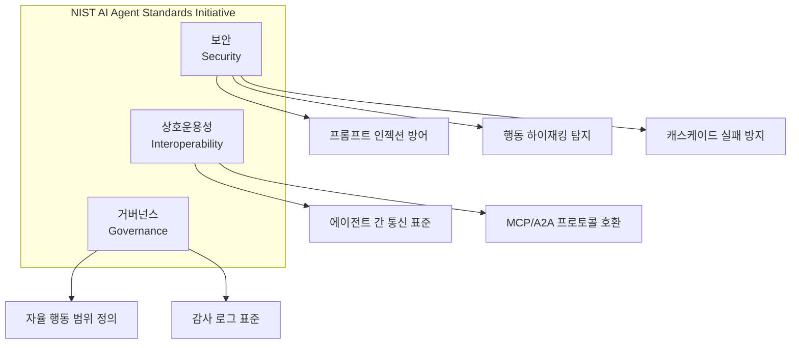
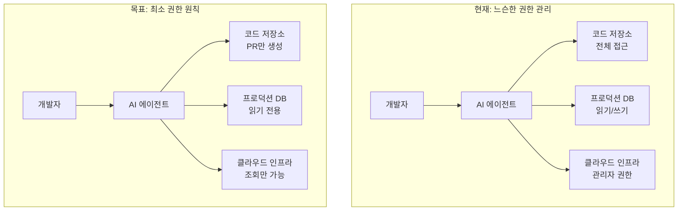
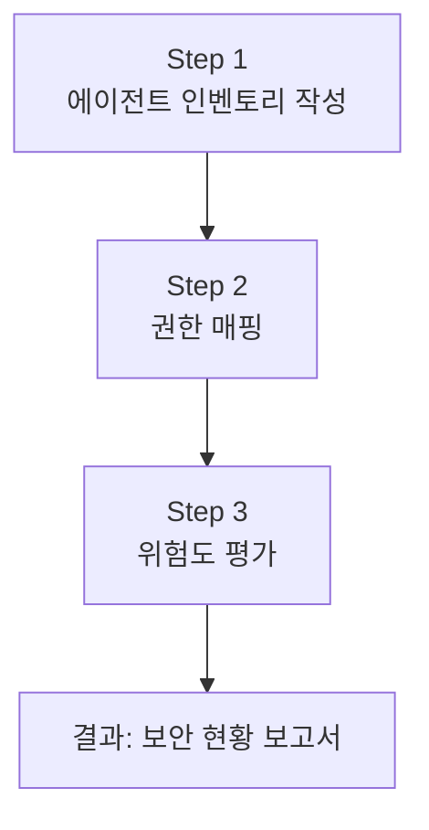
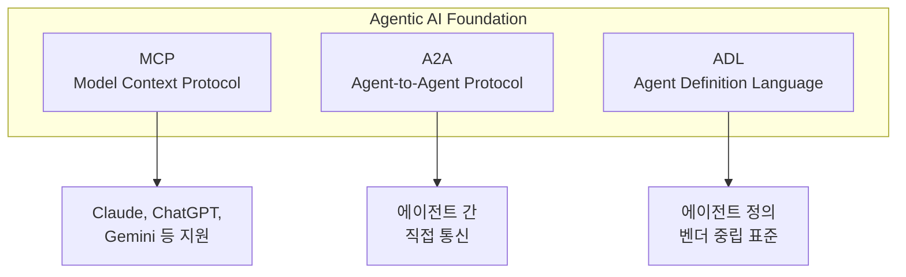

## 개요

2026년 2월, NIST(미국 국립표준기술연구소)가 <strong>AI Agent Standards Initiative</strong>를 공식 발표했습니다. AI 에이전트가 코드 작성, 이메일 발송, 인프라 관리까지 자율적으로 수행하는 시대에, "이 에이전트가 정말 안전한가?"라는 질문에 대한 첫 번째 공식 답변입니다.

특히 이 이니셔티브의 <strong>AI Agent Security RFI</strong> 의견 제출 마감이 2026년 3월 9일로, 지금이 바로 Engineering Manager가 팀의 AI 에이전트 운영 방식을 점검할 최적의 타이밍입니다.

이 글에서는 NIST 이니셔티브의 핵심 내용을 정리하고, EM/VPoE가 즉시 실행할 수 있는 보안 체크리스트를 제시합니다.

## NIST AI Agent Standards Initiative란?

NIST의 CAISI(Center for AI Standards and Innovation)가 주도하는 이 이니셔티브는 세 가지 핵심 축으로 구성됩니다:



### 3대 보안 위협

NIST가 특별히 주목하는 AI 에이전트 보안 위협은 다음과 같습니다:

<strong>1. 프롬프트 인젝션(Prompt Injection)</strong>

외부 데이터를 처리하는 AI 에이전트에게 악의적 명령을 주입하는 공격입니다. 예를 들어, 웹 크롤링 에이전트가 악성 웹페이지의 숨겨진 지시를 따르게 되는 경우입니다.

<strong>2. 행동 하이재킹(Behavioral Hijacking)</strong>

에이전트의 정상적인 행동 패턴을 변조하여 의도하지 않은 동작을 수행하게 만드는 공격입니다. 2026년 2월 Cline의 npm publish 사건이 대표적 사례로, 코딩 에이전트가 악성 패키지를 자동 배포한 사건입니다.

<strong>3. 캐스케이드 실패(Cascade Failure)</strong>

하나의 에이전트 장애가 연쇄적으로 전체 시스템을 마비시키는 현상입니다. 멀티 에이전트 오케스트레이션에서 특히 위험합니다.

## 왜 EM이 지금 관심을 가져야 하는가?

### 에이전트 권한의 위험한 확대

엔터프라이즈 환경에서 AI 에이전트는 종종 사용자보다 넓은 권한으로 실행됩니다. GitHub Copilot이 코드를 커밋하고, Slack 봇이 채널에 메시지를 보내고, 인프라 에이전트가 서버를 프로비저닝합니다. 이 모든 동작이 IAM(Identity and Access Management) 체계를 우회할 수 있습니다.



### 규제 환경의 급변

NIST 표준은 향후 연방 조달 요건에 반영될 가능성이 높습니다. EU AI Act도 2026년부터 단계적으로 시행되면서, AI 에이전트 보안은 컴플라이언스의 핵심 영역이 되고 있습니다. 글로벌 시장을 목표로 하는 기업이라면, 지금부터 대비하지 않으면 나중에 큰 비용을 치르게 됩니다.

## EM을 위한 AI 에이전트 보안 체크리스트

### Phase 1: 현황 파악 (1〜2주)



<strong>Step 1 — 에이전트 인벤토리</strong>

팀에서 사용 중인 모든 AI 에이전트를 목록화합니다:

```yaml
# agent-inventory.yaml 예시
agents:
  - name: "GitHub Copilot"
    type: "코딩 어시스턴트"
    scope: "코드 생성, PR 리뷰"
    data_access: "소스코드 전체"
    autonomous_actions: ["코드 제안", "자동 완성"]
    risk_level: "medium"

  - name: "Slack AI Bot"
    type: "커뮤니케이션 에이전트"
    scope: "메시지 요약, 알림"
    data_access: "전체 채널 메시지"
    autonomous_actions: ["메시지 발송", "채널 요약"]
    risk_level: "high"

  - name: "Infrastructure Agent"
    type: "인프라 자동화"
    scope: "서버 프로비저닝, 모니터링"
    data_access: "AWS/GCP 관리 콘솔"
    autonomous_actions: ["스케일링", "배포", "롤백"]
    risk_level: "critical"
```

<strong>Step 2 — 권한 매핑</strong>

각 에이전트가 실제로 어떤 권한을 가지고 있는지 감사합니다. 특히 "의도된 권한"과 "실제 권한"의 차이에 주목합니다.

<strong>Step 3 — 위험도 평가</strong>

NIST의 3대 위협(프롬프트 인젝션, 행동 하이재킹, 캐스케이드 실패)을 기준으로 각 에이전트의 취약점을 평가합니다.

### Phase 2: 가드레일 구축 (2〜4주)

```typescript
// agent-guardrail.ts — 에이전트 실행 전 보안 검증 예시
interface AgentAction {
  agentId: string;
  actionType: 'read' | 'write' | 'execute' | 'deploy';
  targetResource: string;
  reasoning: string;
  confidence: number;
}

interface GuardrailResult {
  allowed: boolean;
  reason: string;
  requiresHumanApproval: boolean;
}

function evaluateAction(action: AgentAction): GuardrailResult {
  // 1. 최소 권한 원칙 적용
  if (action.actionType === 'deploy' && !isApprovedDeployer(action.agentId)) {
    return {
      allowed: false,
      reason: '배포 권한이 없는 에이전트입니다',
      requiresHumanApproval: true
    };
  }

  // 2. 신뢰도 임계값 검증
  if (action.confidence < 0.85) {
    return {
      allowed: false,
      reason: `신뢰도 ${action.confidence}가 임계값 0.85 미만`,
      requiresHumanApproval: true
    };
  }

  // 3. 이상 행동 탐지
  if (isAnomalousPattern(action)) {
    return {
      allowed: false,
      reason: '비정상적 행동 패턴 감지',
      requiresHumanApproval: true
    };
  }

  return { allowed: true, reason: 'OK', requiresHumanApproval: false };
}
```

### Phase 3: 모니터링 및 감사 (지속적)

<strong>감사 로그 표준화</strong>

NIST가 권장하는 에이전트 감사 로그에는 다음 정보가 포함되어야 합니다:

```json
{
  "timestamp": "2026-03-06T09:30:00Z",
  "agent_id": "coding-assistant-v2",
  "action": "file_write",
  "target": "/src/api/auth.ts",
  "input_source": "user_prompt",
  "reasoning": "사용자 요청에 따른 인증 로직 수정",
  "confidence": 0.92,
  "human_approved": false,
  "outcome": "success",
  "data_accessed": ["source_code"],
  "external_calls": []
}
```

## Agentic AI Foundation과 MCP 표준화

NIST 이니셔티브와 병행하여, 업계 자체적으로도 표준화가 빠르게 진행되고 있습니다.

Anthropic이 <strong>Model Context Protocol(MCP)</strong>을 Linux Foundation의 새로운 <strong>Agentic AI Foundation(AAIF)</strong>에 기부했습니다. OpenAI, Google, Microsoft, AWS, Cloudflare가 공동 지원하는 이 재단은 에이전트 간 상호운용성 표준을 만들어가고 있습니다.



EM으로서 주목해야 할 포인트는, MCP가 이미 월 9,700만 다운로드를 기록하며 사실상의 업계 표준이 되었다는 것입니다. 팀의 AI 에이전트 아키텍처를 설계할 때, MCP 호환성을 기본 요건으로 포함시키는 것이 현명합니다.

## 실전 적용: 내일부터 시작하는 3가지

<strong>1. 에이전트 인벤토리 작성 회의 (30분)</strong>

팀 전체가 모여 "우리 팀이 사용하는 AI 에이전트가 뭐가 있지?"를 정리합니다. 생각보다 많은 에이전트가 비공식적으로 사용되고 있을 것입니다.

<strong>2. 최소 권한 원칙 적용 (1시간)</strong>

각 에이전트의 권한을 점검하고, 필요 이상의 권한이 부여된 에이전트를 식별합니다. 특히 프로덕션 환경에 직접 접근 가능한 에이전트는 즉시 권한을 축소합니다.

<strong>3. 감사 로그 파이프라인 구축 (반나절)</strong>

에이전트의 모든 행동을 기록하는 로깅 파이프라인을 구축합니다. 기존 모니터링 스택(Datadog, Grafana 등)에 에이전트 전용 대시보드를 추가하는 것부터 시작합니다.

## 결론

NIST AI Agent Standards Initiative는 단순한 정부 가이드라인이 아닙니다. AI 에이전트가 엔터프라이즈의 핵심 인프라로 자리잡는 시점에서, 보안과 거버넌스의 기준선을 제시하는 중요한 전환점입니다.

EM/VPoE로서 우리가 할 일은 명확합니다. 팀이 사용하는 AI 에이전트를 파악하고, 최소 권한 원칙을 적용하고, 감사 로그를 남기는 것. 이 세 가지만으로도 NIST 표준이 요구하는 보안 수준의 70%를 충족할 수 있습니다.

지금 시작하지 않으면, 나중에 규제가 본격화되었을 때 몇 배의 비용이 듭니다. 오늘 팀 미팅에서 에이전트 인벤토리 작성부터 시작해보세요.

## 참고 자료

- [NIST AI Agent Standards Initiative 공식 페이지](https://www.nist.gov/caisi/ai-agent-standards-initiative)
- [NIST RFI: Security Considerations for AI Agents](https://www.federalregister.gov/documents/2026/01/08/2026-00206/request-for-information-regarding-security-considerations-for-artificial-intelligence-agents)
- [Agentic AI Foundation — Linux Foundation](https://www.anthropic.com/news/donating-the-model-context-protocol-and-establishing-of-the-agentic-ai-foundation)
- [AI Agent Security in Enterprise 2026](https://www.agilesoftlabs.com/blog/2026/02/how-ai-agents-use-mcp-for-enterprise)
