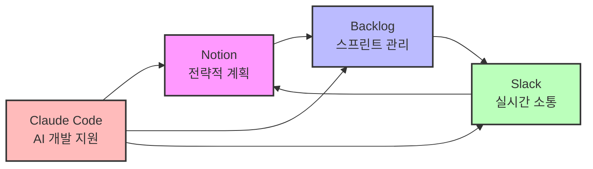
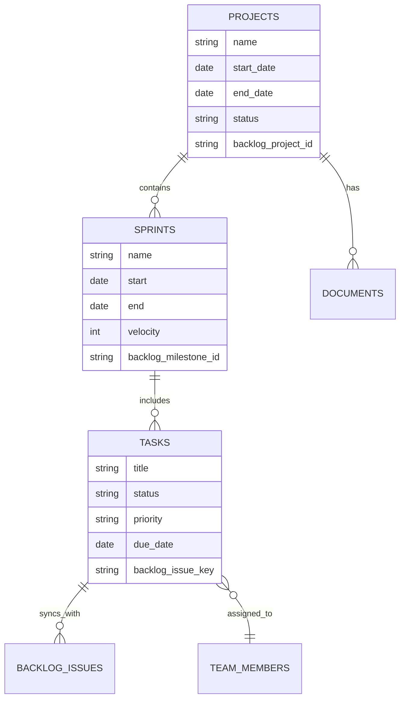
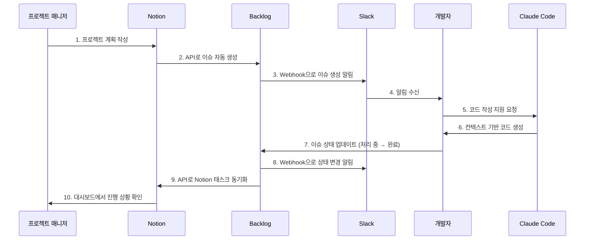
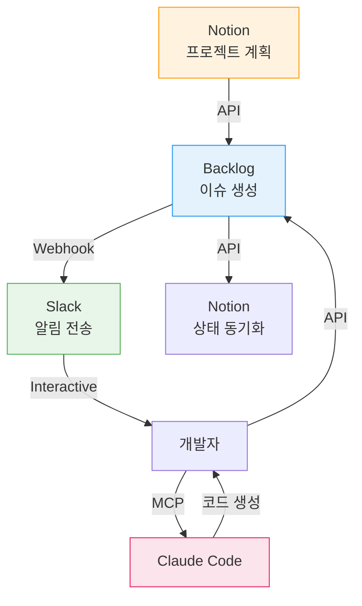

## 개요

### 프로젝트 실패의 현실

2023년 PMI(Project Management Institute) 보고서에 따르면, IT 프로젝트의 <strong>35%가 완전히 실패</strong>하고, <strong>50%는 예산이나 일정을 초과</strong>합니다. 가장 큰 원인은 무엇일까요? 바로 <strong>비효율적인 커뮤니케이션</strong>과 <strong>도구 간 정보 단절</strong>입니다.

많은 팀이 다음과 같은 문제를 겪고 있습니다:

- Slack에서 논의한 내용이 Notion에 기록되지 않음
- Backlog의 이슈 상태가 실제 진행 상황과 다름
- 팀원마다 다른 도구를 선호해 정보가 분산됨
- 프로젝트 현황 파악을 위해 여러 도구를 계속 전환해야 함

### 표준화의 필요성

프로젝트 관리 도구를 표준화하면:

1. <strong>정보 일관성</strong>: 단일 진실 공급원(Single Source of Truth) 확보
2. <strong>시간 절약</strong>: 도구 전환 시간 50% 이상 감소
3. <strong>투명성 향상</strong>: 모든 이해관계자가 실시간으로 진행 상황 확인
4. <strong>자동화 가능</strong>: 반복 작업을 자동화하여 생산성 극대화

### 4가지 도구의 역할

이 글에서는 각기 다른 강점을 가진 4가지 도구를 통합하는 방법을 다룹니다:



- <strong>Notion</strong>: 프로젝트 계획, 문서화, 지식 베이스
- <strong>Backlog</strong>: 이슈 트래킹, 스프린트 관리, 버전 관리
- <strong>Slack</strong>: 팀 커뮤니케이션, 알림, 워크플로우 자동화
- <strong>Claude Code</strong>: AI 기반 코딩 지원, 문서 생성, 프로젝트 컨텍스트 관리

## 도구별 핵심 기능

### Notion: 전략적 계획 허브

Notion은 프로젝트의 <strong>두뇌</strong> 역할을 합니다. 데이터베이스 중심 아키텍처로 모든 정보를 구조화하고, 다른 도구와의 연동을 위한 허브가 됩니다.

#### 데이터베이스 중심 아키텍처

Notion의 핵심은 관계형 데이터베이스입니다. 프로젝트 관리를 위한 기본 구조는 다음과 같습니다:



#### 프로젝트 템플릿 활용법

효과적인 Notion 프로젝트 템플릿은 다음 요소를 포함해야 합니다:

1. <strong>프로젝트 대시보드</strong>
   - 진행 상황 요약 (진행률, 남은 일수)
   - 주요 마일스톤 타임라인
   - 팀 구성원 및 역할
   - 중요 링크 (Backlog, GitHub, 배포 URL)

2. <strong>스프린트 계획 데이터베이스</strong>
   - 스프린트 목록 (갤러리 뷰)
   - 스프린트별 목표 및 성과
   - 번다운 차트 연동

3. <strong>태스크 데이터베이스</strong>
   - 칸반 보드 뷰 (상태별)
   - 담당자별 뷰
   - 우선순위별 뷰

4. <strong>회의록 데이터베이스</strong>
   - 회의 날짜, 참석자, 주요 결정 사항
   - 액션 아이템 추적

#### Notion API 통합 예제

Notion API를 사용하면 외부 시스템과 자동으로 동기화할 수 있습니다. 다음은 Backlog 이슈를 Notion 태스크로 생성하는 예제입니다:

```javascript
// Notion API를 사용한 태스크 생성
const { Client } = require('@notionhq/client');

// Notion 클라이언트 초기화
const notion = new Client({
  auth: process.env.NOTION_API_KEY,
});

/**
 * Backlog 이슈를 Notion 데이터베이스에 추가
 * @param {string} databaseId - Notion 데이터베이스 ID
 * @param {Object} backlogIssue - Backlog 이슈 객체
 */
async function createNotionTask(databaseId, backlogIssue) {
  try {
    const response = await notion.pages.create({
      parent: { database_id: databaseId },
      properties: {
        // 태스크 제목
        'Name': {
          title: [
            {
              text: {
                content: backlogIssue.summary,
              },
            },
          ],
        },
        // 상태 (Select 타입)
        'Status': {
          select: {
            name: mapBacklogStatusToNotion(backlogIssue.status.name),
          },
        },
        // 우선순위
        'Priority': {
          select: {
            name: mapBacklogPriorityToNotion(backlogIssue.priority.name),
          },
        },
        // 담당자 (Person 타입)
        'Assignee': {
          people: backlogIssue.assignee ? [
            { id: await getNotionUserIdByEmail(backlogIssue.assignee.mailAddress) }
          ] : [],
        },
        // 마감일
        'Due Date': {
          date: backlogIssue.dueDate ? {
            start: backlogIssue.dueDate,
          } : null,
        },
        // Backlog 이슈 키 (URL)
        'Backlog Issue': {
          url: `https://your-space.backlog.com/view/${backlogIssue.issueKey}`,
        },
        // Backlog 이슈 키 (텍스트)
        'Issue Key': {
          rich_text: [
            {
              text: {
                content: backlogIssue.issueKey,
              },
            },
          ],
        },
      },
    });

    console.log(`✅ Notion 태스크 생성됨: ${response.id}`);
    return response;
  } catch (error) {
    console.error('❌ Notion 태스크 생성 실패:', error.message);
    throw error;
  }
}

// Backlog 상태를 Notion 상태로 매핑
function mapBacklogStatusToNotion(backlogStatus) {
  const statusMap = {
    '未対応': 'To Do',
    '処理中': 'In Progress',
    '処理済み': 'Done',
    '完了': 'Done',
  };
  return statusMap[backlogStatus] || 'To Do';
}

// Backlog 우선순위를 Notion 우선순위로 매핑
function mapBacklogPriorityToNotion(backlogPriority) {
  const priorityMap = {
    '高': 'High',
    '中': 'Medium',
    '低': 'Low',
  };
  return priorityMap[backlogPriority] || 'Medium';
}

// 이메일로 Notion 사용자 ID 찾기
async function getNotionUserIdByEmail(email) {
  const users = await notion.users.list();
  const user = users.results.find(u => u.person?.email === email);
  return user?.id || null;
}

// 사용 예제
const databaseId = 'your-database-id';
const backlogIssue = {
  issueKey: 'PROJECT-123',
  summary: 'API 응답 속도 개선',
  status: { name: '処理中' },
  priority: { name: '高' },
  assignee: { mailAddress: 'developer@example.com' },
  dueDate: '2025-11-10',
};

createNotionTask(databaseId, backlogIssue);
```

<strong>주요 포인트</strong>:
- Notion API는 RESTful 구조로 직관적입니다
- 데이터베이스 스키마에 맞는 프로퍼티 타입을 정확히 지정해야 합니다
- 외부 시스템의 상태/우선순위를 Notion의 Select 옵션과 매핑해야 합니다

### Backlog: 애자일 스프린트 관리

Backlog는 일본에서 개발된 프로젝트 관리 도구로, <strong>이슈 트래킹</strong>과 <strong>Git 저장소</strong>를 통합한 것이 특징입니다.

#### 스프린트 계획과 추적

Backlog의 마일스톤 기능을 스프린트로 활용하는 방법:

1. <strong>스프린트 생성</strong>
   - 마일스톤 이름: "Sprint 23 (2025-11-04 〜 2025-11-17)"
   - 시작일과 종료일 설정
   - 스프린트 목표 작성

2. <strong>스프린트 백로그 구성</strong>
   - 우선순위 순으로 이슈 정렬
   - 각 이슈에 스토리 포인트 할당
   - 팀 베로시티(Velocity)를 고려해 적정량 선택

3. <strong>번다운 차트 모니터링</strong>
   - Backlog는 자동으로 번다운 차트 생성
   - 매일 스탠드업에서 차트 확인
   - 스프린트 막바지에 작업이 몰리지 않도록 조정

#### 이슈 트래킹 베스트 프랙티스

효과적인 이슈 관리를 위한 규칙:

1. <strong>이슈 타입 구분</strong>
   - 태스크: 일반 개발 작업
   - 버그: 결함 수정
   - 개선: 기능 개선
   - 상담: 질문이나 논의 필요

2. <strong>명확한 제목 작성</strong>
   ```
   ❌ 나쁜 예: "버그 수정"
   ✅ 좋은 예: "[로그인] 비밀번호 재설정 이메일 발송 실패"
   ```

3. <strong>상세한 설명 템플릿</strong>
   ````markdown
   ## 개요
   사용자가 비밀번호 재설정을 요청했을 때 이메일이 발송되지 않음

   ## 재현 방법
   1. 로그인 페이지에서 "비밀번호 찾기" 클릭
   2. 등록된 이메일 주소 입력
   3. "재설정 링크 보내기" 클릭

   ## 예상 결과
   이메일로 비밀번호 재설정 링크가 발송되어야 함

   ## 실제 결과
   "이메일 발송 실패" 에러 메시지 표시

   ## 환경
   - 브라우저: Chrome 119.0
   - OS: macOS 14.0
   - 서버 환경: Production

   ## 추가 정보
   - 에러 로그: `SMTP connection timeout`
   - 최근 변경 사항: SMTP 서버 IP 변경 (2025-10-30)
   ````

4. <strong>라벨 활용</strong>
   - 프론트엔드, 백엔드, DevOps 등 영역별 라벨
   - 긴급, 중요 등 우선순위 라벨
   - 리팩토링, 기술부채 등 작업 성격 라벨

#### Webhook 설정 예제

Backlog의 Webhook을 사용하면 이슈 변경 시 자동으로 다른 시스템에 알릴 수 있습니다:

```python
# Backlog Webhook 처리 (Flask 예제)
from flask import Flask, request, jsonify
import requests
import os

app = Flask(__name__)

# Slack Webhook URL
SLACK_WEBHOOK_URL = os.getenv('SLACK_WEBHOOK_URL')
# Notion API 설정
NOTION_API_KEY = os.getenv('NOTION_API_KEY')
NOTION_DATABASE_ID = os.getenv('NOTION_DATABASE_ID')

@app.route('/backlog-webhook', methods=['POST'])
def handle_backlog_webhook():
    """
    Backlog Webhook 이벤트 처리
    이슈 생성/업데이트 시 Slack 알림 및 Notion 동기화
    """
    try:
        # Webhook 페이로드 파싱
        payload = request.json
        event_type = payload.get('type')

        # 이슈 업데이트 이벤트만 처리
        if event_type == 1:  # 이슈 추가
            handle_issue_created(payload)
        elif event_type == 2:  # 이슈 업데이트
            handle_issue_updated(payload)
        elif event_type == 3:  # 이슈 삭제
            handle_issue_deleted(payload)

        return jsonify({'status': 'success'}), 200

    except Exception as e:
        print(f'❌ Webhook 처리 실패: {str(e)}')
        return jsonify({'status': 'error', 'message': str(e)}), 500

def handle_issue_created(payload):
    """새로운 이슈가 생성되었을 때"""
    content = payload['content']
    issue_key = content['key_id']
    issue_summary = content['summary']
    issue_url = f"https://your-space.backlog.com/view/{issue_key}"

    # Slack 알림 전송
    send_slack_notification(
        text=f"🆕 새로운 이슈가 생성되었습니다",
        fields=[
            {"title": "이슈 번호", "value": issue_key, "short": True},
            {"title": "제목", "value": issue_summary, "short": False},
            {"title": "링크", "value": issue_url, "short": False},
        ]
    )

    # Notion에 태스크 생성
    create_notion_task_from_backlog(content)

def handle_issue_updated(payload):
    """이슈가 업데이트되었을 때"""
    content = payload['content']
    changes = content.get('changes', [])

    # 상태 변경 감지
    status_change = next((c for c in changes if c['field'] == 'status'), None)
    if status_change:
        issue_key = content['key_id']
        old_status = status_change['old_value']
        new_status = status_change['new_value']

        # Slack 알림
        emoji_map = {
            '未対応': '📋',
            '処理中': '⚙️',
            '処理済み': '✅',
            '完了': '🎉',
        }

        send_slack_notification(
            text=f"{emoji_map.get(new_status, '📌')} 이슈 상태가 변경되었습니다",
            fields=[
                {"title": "이슈 번호", "value": issue_key, "short": True},
                {"title": "상태 변경", "value": f"{old_status} → {new_status}", "short": True},
            ]
        )

        # Notion 태스크 상태 동기화
        update_notion_task_status(issue_key, new_status)

def handle_issue_deleted(payload):
    """이슈가 삭제되었을 때"""
    content = payload['content']
    issue_key = content['key_id']

    # Slack 알림
    send_slack_notification(
        text=f"🗑️ 이슈 {issue_key}가 삭제되었습니다"
    )

    # Notion에서도 삭제 또는 아카이브
    archive_notion_task(issue_key)

def send_slack_notification(text, fields=None):
    """Slack으로 알림 전송"""
    payload = {
        "text": text,
        "attachments": [
            {
                "color": "#36a64f",
                "fields": fields or []
            }
        ] if fields else []
    }

    requests.post(SLACK_WEBHOOK_URL, json=payload)

def create_notion_task_from_backlog(backlog_issue):
    """Backlog 이슈로부터 Notion 태스크 생성"""
    # Notion API 호출 (앞서 JavaScript 예제와 유사한 로직)
    headers = {
        "Authorization": f"Bearer {NOTION_API_KEY}",
        "Content-Type": "application/json",
        "Notion-Version": "2022-06-28"
    }

    data = {
        "parent": {"database_id": NOTION_DATABASE_ID},
        "properties": {
            "Name": {
                "title": [{"text": {"content": backlog_issue['summary']}}]
            },
            "Issue Key": {
                "rich_text": [{"text": {"content": str(backlog_issue['key_id'])}}]
            },
            "Status": {
                "select": {"name": "To Do"}
            }
        }
    }

    response = requests.post(
        "https://api.notion.com/v1/pages",
        headers=headers,
        json=data
    )

    if response.status_code == 200:
        print(f"✅ Notion 태스크 생성됨: {backlog_issue['key_id']}")
    else:
        print(f"❌ Notion 태스크 생성 실패: {response.text}")

def update_notion_task_status(issue_key, new_status):
    """Notion 태스크 상태 업데이트"""
    # 1. Issue Key로 Notion 페이지 검색
    # 2. 페이지 ID로 상태 업데이트
    # (구현 생략 - 실제로는 Notion 검색 API 사용)
    pass

def archive_notion_task(issue_key):
    """Notion 태스크 아카이브"""
    # Notion 페이지를 아카이브 상태로 변경
    # (구현 생략)
    pass

if __name__ == '__main__':
    app.run(host='0.0.0.0', port=5000)
```

<strong>Webhook 설정 단계</strong>:
1. Backlog 프로젝트 설정 → "Webhook" 메뉴
2. Webhook URL 추가: `https://your-server.com/backlog-webhook`
3. 이벤트 선택: "이슈 추가", "이슈 업데이트", "이슈 삭제"
4. 저장 후 테스트 전송

### Slack: 실시간 협업 센터

Slack은 팀의 <strong>신경계</strong>입니다. 모든 알림이 모이고, 빠른 의사결정이 이루어지는 공간입니다.

#### 채널 구조화 전략

효과적인 Slack 채널 구조는 정보를 명확히 분리합니다:

```
📁 프로젝트별 채널
  ├─ #proj-mobile-app-renewal (모바일 앱 리뉴얼 프로젝트)
  ├─ #proj-api-migration (API 마이그레이션 프로젝트)
  └─ #proj-admin-dashboard (어드민 대시보드 프로젝트)

📁 팀별 채널
  ├─ #team-frontend (프론트엔드 팀)
  ├─ #team-backend (백엔드 팀)
  └─ #team-devops (DevOps 팀)

📁 자동화 알림 채널
  ├─ #alerts-backlog (Backlog 이슈 알림)
  ├─ #alerts-github (GitHub PR/Commit 알림)
  ├─ #alerts-deploy (배포 알림)
  └─ #alerts-monitoring (서버 모니터링 알림)

📁 일반 채널
  ├─ #general (전사 공지)
  ├─ #random (자유 주제)
  └─ #retrospective (회고 및 개선)
```

<strong>채널 네이밍 규칙</strong>:
- `proj-` : 프로젝트 관련
- `team-` : 팀 관련
- `alerts-` : 자동화 알림
- 케밥 케이스(kebab-case) 사용

#### 자동화 워크플로우 구축

Slack Workflow Builder를 사용하면 코딩 없이 자동화를 구축할 수 있습니다:

<strong>예제 1: 스프린트 시작 체크리스트</strong>

1. 트리거: 매주 월요일 오전 10시
2. 액션:
   - `#proj-mobile-app-renewal` 채널에 메시지 전송
   - 스프린트 시작 체크리스트 표시
   ```
   🚀 Sprint 23 시작!

   [ ] Backlog 마일스톤 생성
   [ ] Notion 스프린트 페이지 생성
   [ ] 스프린트 목표 공유
   [ ] 데일리 스탠드업 시간 확인
   ```

<strong>예제 2: 온보딩 자동화</strong>

1. 트리거: 새로운 멤버가 채널에 합류
2. 액션:
   - DM으로 환영 메시지 전송
   - 프로젝트 Notion 페이지 링크 공유
   - Backlog 계정 생성 안내
   - 멘토 배정

#### Slack Bot 예제 코드

Slack Bot API를 사용하면 더 복잡한 자동화가 가능합니다. 다음은 Slash Command를 처리하는 예제입니다:

```javascript
// Slack Bot - Slash Command 처리 (Node.js + Express)
const { App } = require('@slack/bolt');
const axios = require('axios');

// Slack App 초기화
const app = new App({
  token: process.env.SLACK_BOT_TOKEN,
  signingSecret: process.env.SLACK_SIGNING_SECRET,
  socketMode: true,
  appToken: process.env.SLACK_APP_TOKEN,
});

/**
 * /sprint-status 명령어: 현재 스프린트 상태 조회
 * 사용 예: /sprint-status
 */
app.command('/sprint-status', async ({ command, ack, respond }) => {
  // Slack에 즉시 응답 (3초 이내 응답 필요)
  await ack();

  try {
    // Backlog API에서 현재 스프린트 정보 조회
    const sprintData = await fetchCurrentSprintFromBacklog();

    // 스프린트 통계 계산
    const totalIssues = sprintData.issues.length;
    const completedIssues = sprintData.issues.filter(i => i.status.name === '完了').length;
    const inProgressIssues = sprintData.issues.filter(i => i.status.name === '処理中').length;
    const todoIssues = totalIssues - completedIssues - inProgressIssues;
    const completionRate = Math.round((completedIssues / totalIssues) * 100);

    // Slack 메시지 포맷팅
    await respond({
      response_type: 'in_channel', // 채널에 공개
      blocks: [
        {
          type: 'header',
          text: {
            type: 'plain_text',
            text: `📊 ${sprintData.name} 진행 상황`,
          },
        },
        {
          type: 'section',
          fields: [
            {
              type: 'mrkdwn',
              text: `*기간*\n${sprintData.startDate} 〜 ${sprintData.endDate}`,
            },
            {
              type: 'mrkdwn',
              text: `*완료율*\n${completionRate}% (${completedIssues}/${totalIssues})`,
            },
          ],
        },
        {
          type: 'section',
          text: {
            type: 'mrkdwn',
            text: `✅ 완료: ${completedIssues}개\n⚙️ 진행중: ${inProgressIssues}개\n📋 대기: ${todoIssues}개`,
          },
        },
        {
          type: 'divider',
        },
        {
          type: 'section',
          text: {
            type: 'mrkdwn',
            text: `<${sprintData.backlogUrl}|Backlog에서 자세히 보기>`,
          },
        },
      ],
    });
  } catch (error) {
    await respond({
      response_type: 'ephemeral', // 본인만 보임
      text: `❌ 스프린트 정보를 가져오는데 실패했습니다: ${error.message}`,
    });
  }
});

/**
 * /create-task 명령어: 빠른 태스크 생성
 * 사용 예: /create-task [로그인] 소셜 로그인 기능 추가
 */
app.command('/create-task', async ({ command, ack, respond, client }) => {
  await ack();

  // 태스크 제목 파싱
  const taskTitle = command.text.trim();

  if (!taskTitle) {
    await respond({
      response_type: 'ephemeral',
      text: '사용법: /create-task [태스크 제목]',
    });
    return;
  }

  // Modal 열기 (상세 정보 입력)
  await client.views.open({
    trigger_id: command.trigger_id,
    view: {
      type: 'modal',
      callback_id: 'create_task_modal',
      title: {
        type: 'plain_text',
        text: '새 태스크 생성',
      },
      submit: {
        type: 'plain_text',
        text: '생성',
      },
      blocks: [
        {
          type: 'input',
          block_id: 'task_title',
          label: {
            type: 'plain_text',
            text: '태스크 제목',
          },
          element: {
            type: 'plain_text_input',
            action_id: 'title_input',
            initial_value: taskTitle,
          },
        },
        {
          type: 'input',
          block_id: 'task_description',
          label: {
            type: 'plain_text',
            text: '설명',
          },
          element: {
            type: 'plain_text_input',
            action_id: 'description_input',
            multiline: true,
          },
          optional: true,
        },
        {
          type: 'input',
          block_id: 'task_priority',
          label: {
            type: 'plain_text',
            text: '우선순위',
          },
          element: {
            type: 'static_select',
            action_id: 'priority_select',
            options: [
              { text: { type: 'plain_text', text: '높음' }, value: 'high' },
              { text: { type: 'plain_text', text: '보통' }, value: 'medium' },
              { text: { type: 'plain_text', text: '낮음' }, value: 'low' },
            ],
            initial_option: { text: { type: 'plain_text', text: '보통' }, value: 'medium' },
          },
        },
      ],
    },
  });
});

/**
 * Modal 제출 처리
 */
app.view('create_task_modal', async ({ ack, body, view, client }) => {
  await ack();

  // Modal에서 입력된 값 추출
  const values = view.state.values;
  const title = values.task_title.title_input.value;
  const description = values.task_description.description_input.value || '';
  const priority = values.task_priority.priority_select.selected_option.value;

  try {
    // Backlog에 이슈 생성
    const backlogIssue = await createBacklogIssue({
      summary: title,
      description: description,
      priority: priority,
    });

    // Notion에 태스크 생성
    await createNotionTask({
      title: title,
      description: description,
      priority: priority,
      backlogIssueKey: backlogIssue.issueKey,
    });

    // 성공 메시지 전송
    await client.chat.postMessage({
      channel: body.user.id, // DM으로 전송
      text: `✅ 태스크가 생성되었습니다!\n• Backlog: ${backlogIssue.url}\n• Notion: (자동 동기화됨)`,
    });
  } catch (error) {
    await client.chat.postMessage({
      channel: body.user.id,
      text: `❌ 태스크 생성 실패: ${error.message}`,
    });
  }
});

/**
 * Backlog API - 이슈 생성
 */
async function createBacklogIssue({ summary, description, priority }) {
  const priorityMap = { high: 2, medium: 3, low: 4 };

  const response = await axios.post(
    `https://your-space.backlog.com/api/v2/issues`,
    {
      projectId: process.env.BACKLOG_PROJECT_ID,
      summary: summary,
      description: description,
      issueTypeId: 1, // 태스크
      priorityId: priorityMap[priority],
    },
    {
      params: { apiKey: process.env.BACKLOG_API_KEY },
    }
  );

  return {
    issueKey: response.data.issueKey,
    url: `https://your-space.backlog.com/view/${response.data.issueKey}`,
  };
}

/**
 * Notion API - 태스크 생성
 */
async function createNotionTask({ title, description, priority, backlogIssueKey }) {
  // 앞서 작성한 Notion API 코드 재사용
  // (구현 생략)
}

/**
 * Backlog API - 현재 스프린트 정보 조회
 */
async function fetchCurrentSprintFromBacklog() {
  // Backlog API 호출
  // (구현 생략 - 실제로는 마일스톤 API 사용)
  return {
    name: 'Sprint 23',
    startDate: '2025-11-04',
    endDate: '2025-11-17',
    issues: [
      { status: { name: '完了' } },
      { status: { name: '処理中' } },
      { status: { name: '未対応' } },
      // ... 더 많은 이슈들
    ],
    backlogUrl: 'https://your-space.backlog.com/milestone/123',
  };
}

// Slack Bot 시작
(async () => {
  await app.start();
  console.log('⚡️ Slack Bot이 실행되었습니다!');
})();
```

<strong>Slash Command 생성 방법</strong>:
1. [Slack API 콘솔](https://api.slack.com/apps)에서 앱 생성
2. "Slash Commands" 메뉴에서 명령어 추가
   - Command: `/sprint-status`
   - Request URL: `https://your-server.com/slack/commands`
3. Bot Token Scopes 권한 추가:
   - `commands`
   - `chat:write`
   - `users:read`
4. 앱을 워크스페이스에 설치

### Claude Code: AI 기반 개발 지원

Claude Code는 프로젝트의 <strong>AI 어시스턴트</strong>입니다. 코드 작성, 문서화, 리팩토링을 지원하며, 프로젝트 컨텍스트를 이해합니다.

#### CLAUDE.md 작성법

`CLAUDE.md` 파일은 Claude Code가 프로젝트를 이해하는 핵심 문서입니다. 효과적인 구조는:

````markdown
# CLAUDE.md

## 프로젝트 개요

이 프로젝트는 [프로젝트 설명]입니다.

**주요 기술 스택**:
- Frontend: React 18, TypeScript, Tailwind CSS
- Backend: Node.js, Express, PostgreSQL
- Infrastructure: AWS (EC2, RDS, S3)

**개발 환경**:
```bash
# 로컬 개발 서버 실행
npm run dev

# 테스트 실행
npm test

# 프로덕션 빌드
npm run build
```

## 아키텍처

### 디렉토리 구조

```
src/
├── components/      # React 컴포넌트
├── pages/          # Next.js 페이지
├── api/            # API 라우트
├── lib/            # 유틸리티 함수
├── hooks/          # 커스텀 훅
└── styles/         # 글로벌 스타일
```

### 주요 컴포넌트

**TaskCard**: 개별 태스크를 표시하는 카드 컴포넌트
- Props: `task` (Task 타입), `onStatusChange` (콜백)
- 위치: `src/components/TaskCard.tsx`

**ProjectDashboard**: 프로젝트 대시보드 페이지
- 기능: 스프린트 진행 상황, 번다운 차트, 팀 멤버 목록
- 위치: `src/pages/dashboard.tsx`

## 코딩 규칙

### TypeScript

- 모든 함수에 타입 명시 필수
- `any` 타입 사용 금지
- Interface 네이밍: `I` 접두사 없이 (예: `User`, `Task`)

### React

- 함수형 컴포넌트 사용
- Hooks 규칙 준수
- Props 타입은 interface로 정의

### API

- RESTful 설계 원칙 준수
- 에러 응답은 일관된 형식:
  ```json
  {
    "error": {
      "code": "VALIDATION_ERROR",
      "message": "사용자 친화적 메시지"
    }
  }
  ```

## 통합 설정

### Notion

- Database ID: `abc123...`
- API Key: 환경 변수 `NOTION_API_KEY`
- 태스크 데이터베이스 스키마:
  - Name (title)
  - Status (select): To Do, In Progress, Done
  - Priority (select): High, Medium, Low
  - Assignee (person)
  - Due Date (date)

### Backlog

- Space Key: `YOUR_SPACE`
- Project ID: `12345`
- API Key: 환경 변수 `BACKLOG_API_KEY`

### Slack

- Webhook URL: 환경 변수 `SLACK_WEBHOOK_URL`
- 알림 채널: `#alerts-backlog`

## 배포

프로덕션 배포는 GitHub Actions를 통해 자동화됩니다:

1. `main` 브랜치에 푸시
2. CI/CD 파이프라인 실행
3. 테스트 통과 시 자동 배포

## 트러블슈팅

**Notion API 429 에러**:
- Rate limit 초과
- 해결: 요청 간격을 3초 이상 유지

**Backlog Webhook 실패**:
- IP 화이트리스트 확인
- Webhook URL 유효성 검증

## 참고 자료

- [Notion API 문서](https://developers.notion.com/)
- [Backlog API 문서](https://developer.nulab.com/docs/backlog/)
- [Slack API 문서](https://api.slack.com/)
````

<strong>CLAUDE.md 작성 팁</strong>:
1. <strong>구체적으로</strong>: "코드를 깔끔하게 작성하세요" ✗ → "함수당 최대 50줄 제한" ✓
2. <strong>예제 포함</strong>: 이상적인 코드 스타일을 예제로 보여주기
3. <strong>자주 업데이트</strong>: 프로젝트 변경 시 CLAUDE.md도 함께 수정

#### MCP 서버 설정

MCP(Model Context Protocol) 서버를 설정하면 Claude Code가 외부 시스템에 접근할 수 있습니다.

`.claude/settings.local.json` 파일 예제:

```json
{
  "mcpServers": {
    "notion": {
      "command": "npx",
      "args": [
        "-y",
        "@notionhq/client"
      ],
      "env": {
        "NOTION_API_KEY": "secret_xxx..."
      }
    },
    "backlog": {
      "command": "node",
      "args": [
        "./mcp-servers/backlog-server.js"
      ],
      "env": {
        "BACKLOG_API_KEY": "your_api_key",
        "BACKLOG_SPACE": "your-space"
      }
    },
    "slack": {
      "command": "node",
      "args": [
        "./mcp-servers/slack-server.js"
      ],
      "env": {
        "SLACK_BOT_TOKEN": "xoxb-...",
        "SLACK_SIGNING_SECRET": "xxx..."
      }
    }
  }
}
```

<strong>MCP 서버 구현 예제</strong> (`mcp-servers/backlog-server.js`):

```javascript
// Backlog MCP 서버
const axios = require('axios');

class BacklogMCPServer {
  constructor() {
    this.apiKey = process.env.BACKLOG_API_KEY;
    this.space = process.env.BACKLOG_SPACE;
    this.baseUrl = `https://${this.space}.backlog.com/api/v2`;
  }

  // MCP 프로토콜에 따라 도구 정의
  async getTools() {
    return [
      {
        name: 'backlog_get_issues',
        description: 'Backlog 프로젝트의 이슈 목록을 조회합니다',
        inputSchema: {
          type: 'object',
          properties: {
            projectId: { type: 'string', description: '프로젝트 ID' },
            statusId: { type: 'array', description: '상태 ID 배열 (선택)' },
          },
          required: ['projectId'],
        },
      },
      {
        name: 'backlog_create_issue',
        description: '새로운 Backlog 이슈를 생성합니다',
        inputSchema: {
          type: 'object',
          properties: {
            projectId: { type: 'string', description: '프로젝트 ID' },
            summary: { type: 'string', description: '이슈 제목' },
            description: { type: 'string', description: '이슈 설명' },
            issueTypeId: { type: 'number', description: '이슈 타입 ID' },
            priorityId: { type: 'number', description: '우선순위 ID' },
          },
          required: ['projectId', 'summary', 'issueTypeId', 'priorityId'],
        },
      },
    ];
  }

  // 도구 실행
  async executeTool(toolName, args) {
    switch (toolName) {
      case 'backlog_get_issues':
        return this.getIssues(args);
      case 'backlog_create_issue':
        return this.createIssue(args);
      default:
        throw new Error(`Unknown tool: ${toolName}`);
    }
  }

  async getIssues({ projectId, statusId }) {
    const params = {
      apiKey: this.apiKey,
      projectId: [projectId],
    };

    if (statusId) {
      params.statusId = statusId;
    }

    const response = await axios.get(`${this.baseUrl}/issues`, { params });
    return response.data;
  }

  async createIssue({ projectId, summary, description, issueTypeId, priorityId }) {
    const response = await axios.post(
      `${this.baseUrl}/issues`,
      {
        projectId,
        summary,
        description: description || '',
        issueTypeId,
        priorityId,
      },
      {
        params: { apiKey: this.apiKey },
      }
    );

    return response.data;
  }
}

// MCP 서버 시작
const server = new BacklogMCPServer();
// ... MCP 프로토콜 통신 로직 (stdin/stdout)
```

#### 프로젝트 컨텍스트 관리

Claude Code가 프로젝트를 효과적으로 지원하려면 적절한 컨텍스트를 제공해야 합니다:

1. <strong>파일 구조 명확화</strong>
   - `.gitignore`로 불필요한 파일 제외
   - README, CLAUDE.md에 주요 파일 위치 명시

2. <strong>명확한 의도 전달</strong>
   ```
   ❌ 나쁜 예: "코드 고쳐줘"
   ✅ 좋은 예: "TaskCard 컴포넌트의 onStatusChange 콜백에서 Notion API를 호출하도록 수정해줘. 상태 변경 시 Notion 데이터베이스도 함께 업데이트되어야 해."
   ```

3. <strong>연관 파일 제공</strong>
   - 수정이 필요한 파일과 관련된 타입 정의, 유틸리티 함수 등을 함께 언급

4. <strong>제약 조건 명시</strong>
   - "TypeScript strict 모드를 준수해야 해"
   - "React 18의 Concurrent 기능을 사용하지 마"

## 통합 워크플로우 구축

이제 4가지 도구를 하나의 유기적인 시스템으로 통합하는 방법을 살펴보겠습니다.

### 아키텍처 개요

통합 워크플로우는 다음과 같은 이벤트 기반 아키텍처로 구성됩니다:



<strong>데이터 흐름</strong>:



### 자동화 시나리오

#### 1. 프로젝트 생성 플로우

<strong>트리거</strong>: Notion에서 새 프로젝트 페이지 생성

<strong>워크플로우</strong>:
1. Notion Database에 프로젝트 추가
2. Notion API Webhook이 변경 감지
3. 자동화 스크립트가 Backlog 프로젝트 생성
4. Slack에 프로젝트 전용 채널 생성
5. 팀원들을 자동으로 초대

<strong>구현 예제</strong>:

```javascript
// 프로젝트 생성 자동화 스크립트
const { Client } = require('@notionhq/client');
const axios = require('axios');

const notion = new Client({ auth: process.env.NOTION_API_KEY });

/**
 * Notion에서 새 프로젝트 생성 시 자동으로 Backlog와 Slack 설정
 */
async function onNotionProjectCreated(projectPageId) {
  // 1. Notion 프로젝트 정보 가져오기
  const projectPage = await notion.pages.retrieve({ page_id: projectPageId });
  const projectName = projectPage.properties.Name.title[0].text.content;
  const startDate = projectPage.properties['Start Date'].date.start;
  const endDate = projectPage.properties['End Date'].date.end;

  console.log(`📁 새 프로젝트 감지: ${projectName}`);

  // 2. Backlog 프로젝트 생성
  const backlogProject = await createBacklogProject({
    name: projectName,
    key: generateProjectKey(projectName),
    chartEnabled: true,
    subtaskingEnabled: true,
  });

  console.log(`✅ Backlog 프로젝트 생성됨: ${backlogProject.projectKey}`);

  // 3. Notion에 Backlog 프로젝트 ID 저장
  await notion.pages.update({
    page_id: projectPageId,
    properties: {
      'Backlog Project ID': {
        rich_text: [{ text: { content: backlogProject.id.toString() } }],
      },
      'Backlog URL': {
        url: `https://your-space.backlog.com/projects/${backlogProject.projectKey}`,
      },
    },
  });

  // 4. Slack 채널 생성
  const channelName = `proj-${projectName.toLowerCase().replace(/\s+/g, '-')}`;
  const slackChannel = await createSlackChannel(channelName, {
    topic: `${projectName} 프로젝트 협업 채널`,
    description: `기간: ${startDate} 〜 ${endDate}`,
  });

  console.log(`✅ Slack 채널 생성됨: #${channelName}`);

  // 5. Notion에 Slack 채널 정보 저장
  await notion.pages.update({
    page_id: projectPageId,
    properties: {
      'Slack Channel': {
        rich_text: [{ text: { content: `#${channelName}` } }],
      },
    },
  });

  // 6. Slack에 프로젝트 시작 메시지 전송
  await sendSlackMessage(slackChannel.id, {
    text: `🚀 ${projectName} 프로젝트가 시작되었습니다!`,
    blocks: [
      {
        type: 'header',
        text: { type: 'plain_text', text: `🚀 ${projectName}` },
      },
      {
        type: 'section',
        fields: [
          { type: 'mrkdwn', text: `*기간*\n${startDate} 〜 ${endDate}` },
          { type: 'mrkdwn', text: `*Backlog*\n<https://your-space.backlog.com/projects/${backlogProject.projectKey}|프로젝트 보기>` },
        ],
      },
      {
        type: 'section',
        text: {
          type: 'mrkdwn',
          text: `*Notion 문서*\nhttps://notion.so/${projectPageId}`,
        },
      },
    ],
  });

  console.log('🎉 프로젝트 설정 완료!');
}

// 프로젝트 키 생성 (예: "Mobile App Renewal" → "MAR")
function generateProjectKey(projectName) {
  return projectName
    .split(' ')
    .map(word => word[0].toUpperCase())
    .join('')
    .slice(0, 3);
}

// Backlog 프로젝트 생성
async function createBacklogProject({ name, key, chartEnabled, subtaskingEnabled }) {
  const response = await axios.post(
    'https://your-space.backlog.com/api/v2/projects',
    { name, key, chartEnabled, subtaskingEnabled },
    { params: { apiKey: process.env.BACKLOG_API_KEY } }
  );
  return response.data;
}

// Slack 채널 생성
async function createSlackChannel(name, { topic, description }) {
  const response = await axios.post(
    'https://slack.com/api/conversations.create',
    { name },
    {
      headers: {
        'Authorization': `Bearer ${process.env.SLACK_BOT_TOKEN}`,
        'Content-Type': 'application/json',
      },
    }
  );

  const channelId = response.data.channel.id;

  // 토픽 설정
  await axios.post(
    'https://slack.com/api/conversations.setTopic',
    { channel: channelId, topic },
    {
      headers: {
        'Authorization': `Bearer ${process.env.SLACK_BOT_TOKEN}`,
        'Content-Type': 'application/json',
      },
    }
  );

  return response.data.channel;
}

// Slack 메시지 전송
async function sendSlackMessage(channelId, message) {
  await axios.post(
    'https://slack.com/api/chat.postMessage',
    { channel: channelId, ...message },
    {
      headers: {
        'Authorization': `Bearer ${process.env.SLACK_BOT_TOKEN}`,
        'Content-Type': 'application/json',
      },
    }
  );
}
```

#### 2. 태스크 동기화

<strong>트리거</strong>: Backlog에서 이슈 생성/업데이트

<strong>워크플로우</strong>:
1. Backlog Webhook이 이슈 변경 감지
2. Notion API로 해당 태스크 검색
3. 태스크가 없으면 생성, 있으면 업데이트
4. Slack에 변경 사항 알림

#### 3. 상태 업데이트 체인

<strong>트리거</strong>: 개발자가 Backlog 이슈 상태를 "완료"로 변경

<strong>워크플로우</strong>:
1. Backlog Webhook 수신
2. Notion 태스크 상태를 "Done"으로 업데이트
3. GitHub PR 자동 머지 (선택)
4. Slack에 완료 축하 메시지
5. 스프린트 번다운 차트 자동 업데이트

#### 4. 인시던트 관리

<strong>트리거</strong>: 프로덕션 모니터링 알람

<strong>워크플로우</strong>:
1. 모니터링 시스템 (Datadog, Sentry 등)에서 에러 감지
2. Slack `#alerts-monitoring` 채널에 긴급 알림
3. 자동으로 Backlog에 "버그" 이슈 생성 (우선순위: 높음)
4. Notion에 인시던트 로그 기록
5. 온콜 엔지니어에게 DM 전송

<strong>구현 예제</strong>:

```python
# 인시던트 자동화 처리 (Python + Flask)
from flask import Flask, request, jsonify
import requests
import os

app = Flask(__name__)

@app.route('/incident-webhook', methods=['POST'])
def handle_incident():
    """
    모니터링 시스템으로부터 인시던트 Webhook 수신
    """
    incident = request.json

    # 1. 인시던트 정보 파싱
    severity = incident.get('severity', 'high')
    message = incident.get('message', '')
    service = incident.get('service', 'Unknown')
    timestamp = incident.get('timestamp', '')

    # 2. Slack 긴급 알림
    send_slack_alert(severity, message, service, timestamp)

    # 3. Backlog 버그 이슈 자동 생성
    backlog_issue = create_backlog_bug_issue(severity, message, service)

    # 4. Notion 인시던트 로그 기록
    create_notion_incident_log(severity, message, service, timestamp, backlog_issue['issueKey'])

    # 5. 온콜 엔지니어에게 DM 전송
    if severity == 'critical':
        notify_oncall_engineer(message, backlog_issue['url'])

    return jsonify({'status': 'success'}), 200

def send_slack_alert(severity, message, service, timestamp):
    """Slack 긴급 알림 전송"""
    color_map = {
        'critical': '#FF0000',  # 빨강
        'high': '#FF9900',      # 주황
        'medium': '#FFFF00',    # 노랑
        'low': '#00FF00',       # 초록
    }

    emoji_map = {
        'critical': '🚨',
        'high': '⚠️',
        'medium': '⚡',
        'low': 'ℹ️',
    }

    webhook_url = os.getenv('SLACK_WEBHOOK_URL')
    payload = {
        "text": f"{emoji_map.get(severity, '⚠️')} {severity.upper()} 인시던트 발생!",
        "attachments": [
            {
                "color": color_map.get(severity, '#FF9900'),
                "fields": [
                    {"title": "서비스", "value": service, "short": True},
                    {"title": "심각도", "value": severity.upper(), "short": True},
                    {"title": "메시지", "value": message, "short": False},
                    {"title": "발생 시각", "value": timestamp, "short": False},
                ],
            }
        ]
    }

    requests.post(webhook_url, json=payload)

def create_backlog_bug_issue(severity, message, service):
    """Backlog에 버그 이슈 생성"""
    priority_map = {
        'critical': 2,  # 높음
        'high': 2,
        'medium': 3,    # 보통
        'low': 4,       # 낮음
    }

    response = requests.post(
        f"https://your-space.backlog.com/api/v2/issues",
        params={'apiKey': os.getenv('BACKLOG_API_KEY')},
        json={
            'projectId': os.getenv('BACKLOG_PROJECT_ID'),
            'summary': f"[{severity.upper()}] {service}: {message[:50]}...",
            'description': f"## 인시던트 상세\n\n**서비스**: {service}\n**심각도**: {severity}\n**메시지**: {message}",
            'issueTypeId': 3,  # 버그
            'priorityId': priority_map.get(severity, 3),
        }
    )

    issue_data = response.json()
    return {
        'issueKey': issue_data['issueKey'],
        'url': f"https://your-space.backlog.com/view/{issue_data['issueKey']}",
    }

def create_notion_incident_log(severity, message, service, timestamp, backlog_issue_key):
    """Notion에 인시던트 로그 기록"""
    headers = {
        "Authorization": f"Bearer {os.getenv('NOTION_API_KEY')}",
        "Content-Type": "application/json",
        "Notion-Version": "2022-06-28"
    }

    data = {
        "parent": {"database_id": os.getenv('NOTION_INCIDENT_DB_ID')},
        "properties": {
            "Title": {
                "title": [{"text": {"content": f"[{severity.upper()}] {service}"}}]
            },
            "Severity": {
                "select": {"name": severity.capitalize()}
            },
            "Service": {
                "select": {"name": service}
            },
            "Timestamp": {
                "date": {"start": timestamp}
            },
            "Backlog Issue": {
                "rich_text": [{"text": {"content": backlog_issue_key}}]
            },
            "Status": {
                "select": {"name": "Investigating"}
            }
        }
    }

    requests.post("https://api.notion.com/v1/pages", headers=headers, json=data)

def notify_oncall_engineer(message, backlog_url):
    """온콜 엔지니어에게 DM 전송"""
    oncall_user_id = os.getenv('ONCALL_ENGINEER_SLACK_ID')

    requests.post(
        'https://slack.com/api/chat.postMessage',
        headers={
            'Authorization': f"Bearer {os.getenv('SLACK_BOT_TOKEN')}",
            'Content-Type': 'application/json',
        },
        json={
            'channel': oncall_user_id,
            'text': f"🚨 긴급 인시던트 발생!\n\n{message}\n\n대응이 필요합니다: {backlog_url}",
        }
    )

if __name__ == '__main__':
    app.run(host='0.0.0.0', port=5001)
```

### 실전 코드 예제

#### 통합 대시보드 API

모든 도구의 데이터를 하나의 API로 통합하는 예제:

```typescript
// 통합 대시보드 API (TypeScript + Express)
import express, { Request, Response } from 'express';
import { Client as NotionClient } from '@notionhq/client';
import axios from 'axios';

const app = express();
const notion = new NotionClient({ auth: process.env.NOTION_API_KEY });

interface DashboardData {
  project: {
    name: string;
    progress: number;
    dueDate: string;
  };
  sprint: {
    name: string;
    velocity: number;
    completedTasks: number;
    totalTasks: number;
  };
  team: {
    members: Array<{
      name: string;
      tasksInProgress: number;
      tasksCompleted: number;
    }>;
  };
  recentActivity: Array<{
    type: 'issue_created' | 'issue_updated' | 'slack_message';
    timestamp: string;
    description: string;
  }>;
}

/**
 * 통합 대시보드 데이터 조회
 * Notion, Backlog, Slack의 데이터를 하나로 통합
 */
app.get('/api/dashboard/:projectId', async (req: Request, res: Response) => {
  const { projectId } = req.params;

  try {
    // 1. Notion에서 프로젝트 정보 가져오기
    const notionProject = await getNotionProject(projectId);

    // 2. Backlog에서 스프린트 정보 가져오기
    const backlogSprint = await getBacklogCurrentSprint(notionProject.backlogProjectId);

    // 3. 팀 멤버별 작업 현황 집계
    const teamStats = await calculateTeamStats(notionProject.backlogProjectId);

    // 4. 최근 활동 통합 (Backlog + Slack)
    const recentActivity = await getRecentActivity(
      notionProject.backlogProjectId,
      notionProject.slackChannelId
    );

    // 5. 통합 데이터 반환
    const dashboardData: DashboardData = {
      project: {
        name: notionProject.name,
        progress: calculateProgress(backlogSprint),
        dueDate: notionProject.endDate,
      },
      sprint: {
        name: backlogSprint.name,
        velocity: backlogSprint.velocity,
        completedTasks: backlogSprint.completedIssues.length,
        totalTasks: backlogSprint.totalIssues,
      },
      team: {
        members: teamStats,
      },
      recentActivity,
    };

    res.json(dashboardData);
  } catch (error) {
    console.error('Dashboard data fetch failed:', error);
    res.status(500).json({ error: 'Failed to fetch dashboard data' });
  }
});

async function getNotionProject(projectId: string) {
  const page = await notion.pages.retrieve({ page_id: projectId });

  // @ts-ignore - Notion API 타입 단순화
  return {
    name: page.properties.Name.title[0].text.content,
    backlogProjectId: page.properties['Backlog Project ID'].rich_text[0].text.content,
    slackChannelId: page.properties['Slack Channel ID'].rich_text[0].text.content,
    endDate: page.properties['End Date'].date.start,
  };
}

async function getBacklogCurrentSprint(projectId: string) {
  // Backlog API로 현재 활성 마일스톤 조회
  const milestonesResponse = await axios.get(
    `https://your-space.backlog.com/api/v2/projects/${projectId}/milestones`,
    { params: { apiKey: process.env.BACKLOG_API_KEY } }
  );

  const activeMilestone = milestonesResponse.data.find((m: any) => {
    const now = new Date();
    const start = new Date(m.startDate);
    const end = new Date(m.releaseDueDate);
    return now >= start && now <= end;
  });

  if (!activeMilestone) {
    throw new Error('No active sprint found');
  }

  // 마일스톤의 이슈 목록 조회
  const issuesResponse = await axios.get(
    `https://your-space.backlog.com/api/v2/issues`,
    {
      params: {
        apiKey: process.env.BACKLOG_API_KEY,
        projectId: [projectId],
        milestoneId: [activeMilestone.id],
      },
    }
  );

  const issues = issuesResponse.data;
  const completedIssues = issues.filter((i: any) => i.status.name === '完了');

  return {
    name: activeMilestone.name,
    velocity: calculateVelocity(issues),
    completedIssues,
    totalIssues: issues.length,
  };
}

function calculateProgress(sprint: any): number {
  if (sprint.totalIssues === 0) return 0;
  return Math.round((sprint.completedIssues.length / sprint.totalIssues) * 100);
}

function calculateVelocity(issues: any[]): number {
  // 스토리 포인트 합계 계산 (커스텀 필드 사용)
  return issues.reduce((sum, issue) => {
    const storyPoints = issue.customFields?.find((f: any) => f.name === 'Story Points')?.value || 0;
    return sum + parseInt(storyPoints);
  }, 0);
}

async function calculateTeamStats(projectId: string) {
  const issuesResponse = await axios.get(
    `https://your-space.backlog.com/api/v2/issues`,
    {
      params: {
        apiKey: process.env.BACKLOG_API_KEY,
        projectId: [projectId],
      },
    }
  );

  const issues = issuesResponse.data;
  const teamStats = new Map();

  issues.forEach((issue: any) => {
    if (!issue.assignee) return;

    const name = issue.assignee.name;
    if (!teamStats.has(name)) {
      teamStats.set(name, { name, tasksInProgress: 0, tasksCompleted: 0 });
    }

    const stats = teamStats.get(name);
    if (issue.status.name === '処理中') {
      stats.tasksInProgress++;
    } else if (issue.status.name === '完了') {
      stats.tasksCompleted++;
    }
  });

  return Array.from(teamStats.values());
}

async function getRecentActivity(projectId: string, slackChannelId: string) {
  // Backlog 최근 활동
  const backlogActivity = await axios.get(
    `https://your-space.backlog.com/api/v2/projects/${projectId}/activities`,
    {
      params: {
        apiKey: process.env.BACKLOG_API_KEY,
        count: 10,
      },
    }
  );

  // Slack 최근 메시지
  const slackHistory = await axios.get(
    'https://slack.com/api/conversations.history',
    {
      params: { channel: slackChannelId, limit: 10 },
      headers: { Authorization: `Bearer ${process.env.SLACK_BOT_TOKEN}` },
    }
  );

  // 두 소스의 활동을 시간순으로 정렬
  const activities = [
    ...backlogActivity.data.map((a: any) => ({
      type: a.type === 1 ? 'issue_created' : 'issue_updated',
      timestamp: a.created,
      description: `${a.content.summary}`,
    })),
    ...slackHistory.data.messages.map((m: any) => ({
      type: 'slack_message',
      timestamp: m.ts,
      description: m.text.slice(0, 100),
    })),
  ];

  return activities
    .sort((a, b) => new Date(b.timestamp).getTime() - new Date(a.timestamp).getTime())
    .slice(0, 20);
}

app.listen(3000, () => {
  console.log('🚀 통합 대시보드 API 실행 중: http://localhost:3000');
});
```

## 표준화 프로세스 도입 단계

조직에 프로젝트 관리 표준화를 도입하는 것은 <strong>점진적 접근</strong>이 필수입니다. 한 번에 모든 것을 바꾸려 하면 실패할 확률이 높습니다.

### Phase 1: 평가 (1〜2주)

<strong>목표</strong>: 현재 상황 파악 및 개선 기회 식별

<strong>활동</strong>:
1. <strong>현재 도구 사용 현황 조사</strong>
   - 팀별로 사용 중인 도구 목록화
   - 각 도구의 사용 빈도 및 만족도 설문
   - 정보 단절이 발생하는 지점 파악

2. <strong>페인 포인트 수집</strong>
   - 인터뷰: "프로젝트 관리에서 가장 불편한 점은?"
   - 시간 낭비 요소 식별 (예: 도구 전환 시간, 중복 입력)
   - 커뮤니케이션 오류 사례 수집

3. <strong>벤치마크 조사</strong>
   - 유사한 규모의 조직 사례 연구
   - 베스트 프랙티스 문서화

<strong>산출물</strong>:
- 현황 분석 보고서
- 페인 포인트 우선순위 목록
- 예상 ROI 계산서

### Phase 2: 설계 (3〜6주)

<strong>목표</strong>: 표준 프로세스 및 통합 아키텍처 설계

<strong>활동</strong>:
1. <strong>워크플로우 설계</strong>
   - 프로젝트 생애주기 정의 (계획 → 실행 → 종료)
   - 각 단계별 사용 도구 매핑
   - 승인 프로세스 및 권한 설정

2. <strong>데이터 모델 설계</strong>
   - Notion 데이터베이스 스키마
   - Backlog 프로젝트 템플릿
   - Slack 채널 구조

3. <strong>자동화 시나리오 정의</strong>
   - 우선순위가 높은 자동화 3〜5개 선정
   - API 통합 명세서 작성
   - 에러 처리 및 재시도 로직 설계

4. <strong>파일럿 팀 선정</strong>
   - 협조적이고 기술에 익숙한 팀 선택
   - 파일럿 기간 및 성공 기준 합의

<strong>산출물</strong>:
- 표준 워크플로우 문서
- 데이터베이스 스키마 및 템플릿
- API 통합 명세서
- 파일럿 계획서

### Phase 3: 도구 구현 (7〜10주)

<strong>목표</strong>: 기술 인프라 구축 및 통합 개발

<strong>활동</strong>:
1. <strong>Notion 설정</strong> (1주)
   - Workspace 구조화
   - 데이터베이스 생성 (프로젝트, 스프린트, 태스크, 회의록)
   - 템플릿 작성 및 공유
   - 팀원 권한 설정

2. <strong>Backlog 설정</strong> (1주)
   - 프로젝트 생성
   - 이슈 타입, 상태, 우선순위 커스터마이징
   - Git 저장소 연동
   - Webhook 설정

3. <strong>Slack 설정</strong> (1주)
   - 채널 구조 생성
   - Slack App 등록 및 Bot 배포
   - Slash Command 등록
   - Workflow Builder 설정

4. <strong>Claude Code 설정</strong> (1주)
   - CLAUDE.md 작성
   - MCP 서버 구현 및 배포
   - 프로젝트 컨텍스트 정리

5. <strong>통합 개발</strong> (4〜6주)
   - Notion ↔ Backlog 동기화 스크립트
   - Backlog Webhook 처리 서버
   - Slack Bot 기능 개발
   - 통합 대시보드 API 개발
   - 테스트 및 디버깅

<strong>산출물</strong>:
- 설정이 완료된 모든 도구
- 통합 스크립트 및 API 서버
- 기술 문서 (설치, 설정, 트러블슈팅)

### Phase 4: 파일럿 (11〜14주)

<strong>목표</strong>: 실제 프로젝트에서 검증 및 개선

<strong>활동</strong>:
1. <strong>파일럿 팀 온보딩</strong> (1주)
   - 도구 사용법 교육 (3시간 워크숍)
   - 실습 세션
   - Q&A 및 지원 채널 개설

2. <strong>실제 프로젝트 진행</strong> (2〜3주)
   - 파일럿 팀이 실제 프로젝트를 새 프로세스로 진행
   - 매일 사용성 피드백 수집
   - 주간 회고 미팅

3. <strong>모니터링 및 개선</strong>
   - 도구 사용률 추적
   - 자동화 성공/실패율 분석
   - 페인 포인트 해결

<strong>성공 기준</strong>:
- 팀원 만족도 7/10 이상
- 도구 전환 시간 30% 이상 감소
- 정보 누락 사고 제로

<strong>산출물</strong>:
- 파일럿 결과 보고서
- 개선된 프로세스 문서
- FAQ 및 트러블슈팅 가이드

### Phase 5: 전사 배포 (15〜20주)

<strong>목표</strong>: 조직 전체로 확산

<strong>활동</strong>:
1. <strong>배포 계획 수립</strong> (1주)
   - 팀별 배포 순서 결정 (점진적 롤아웃)
   - 리소스 배분 (교육, 지원 인력)
   - 리스크 관리 계획

2. <strong>대규모 교육</strong> (2〜3주)
   - 팀별 맞춤 교육 (각 2시간)
   - 온라인 교육 자료 (비디오, 문서)
   - 챔피언 양성 (각 팀에 1〜2명)

3. <strong>점진적 롤아웃</strong> (8〜12주)
   - 매주 2〜3개 팀씩 전환
   - 기존 도구와 병행 사용 기간 제공
   - 긴급 지원 체계 운영

4. <strong>기존 데이터 마이그레이션</strong>
   - 우선순위: 진행 중인 프로젝트
   - 스크립트를 사용한 자동 마이그레이션
   - 수동 검증 및 보정

<strong>산출물</strong>:
- 전사 표준 프로세스 확립
- 교육 자료 라이브러리
- 지원 조직 운영 (헬프데스크)

### Phase 6: 지속적 개선

<strong>목표</strong>: 프로세스를 살아있는 시스템으로 유지

<strong>활동</strong>:
1. <strong>정기 회고</strong> (분기별)
   - 전사 프로젝트 관리 회고
   - 페인 포인트 수집 및 우선순위화
   - 개선 아이디어 공모

2. <strong>메트릭 모니터링</strong>
   - 프로젝트 성공률 추적
   - 도구 사용률 분석
   - ROI 측정 및 보고

3. <strong>자동화 확장</strong>
   - 새로운 자동화 시나리오 추가
   - AI 기능 통합 (예: Claude Code 활용 확대)
   - 외부 도구 연동 (CI/CD, 모니터링 등)

4. <strong>커뮤니티 운영</strong>
   - 베스트 프랙티스 공유 세션
   - 팁 & 트릭 뉴스레터
   - 사내 컨퍼런스 (연 1회)

## 성공 지표 및 측정

표준화의 성공을 측정하기 위한 핵심 지표(KPI)입니다.

### 시간 절감

#### 1. 도구 전환 시간

<strong>측정 방법</strong>:
- 표준화 전: 하루 평균 도구 전환 횟수 × 전환당 시간 (예: 30회 × 20초 = 10분)
- 표준화 후: 자동화로 전환 횟수 감소 (예: 15회 × 10초 = 2.5분)

<strong>목표</strong>: <strong>50% 이상 감소</strong>

```javascript
// 도구 전환 시간 측정 스크립트 예제
function calculateToolSwitchingTime(logs) {
  const transitions = [];

  for (let i = 1; i < logs.length; i++) {
    const prev = logs[i - 1];
    const curr = logs[i];

    if (prev.tool !== curr.tool) {
      transitions.push({
        from: prev.tool,
        to: curr.tool,
        time: curr.timestamp - prev.timestamp,
      });
    }
  }

  const avgTime = transitions.reduce((sum, t) => sum + t.time, 0) / transitions.length;
  return {
    totalTransitions: transitions.length,
    avgTimePerTransition: avgTime,
    totalTimeSpent: avgTime * transitions.length,
  };
}
```

#### 2. 상태 보고 시간

<strong>측정 방법</strong>:
- 표준화 전: 주간 상태 보고서 작성에 1시간 소요
- 표준화 후: 통합 대시보드에서 5분 안에 현황 파악

<strong>목표</strong>: <strong>60% 이상 감소</strong>

### 프로젝트 성공률

#### 1. 정시 배포율

<strong>측정 방법</strong>:
```
정시 배포율 = (정시 완료 프로젝트 수 / 전체 프로젝트 수) × 100
```

<strong>목표</strong>: <strong>80% 이상</strong>

#### 2. 예산 준수율

<strong>측정 방법</strong>:
```
예산 준수율 = (예산 내 완료 프로젝트 수 / 전체 프로젝트 수) × 100
```

<strong>목표</strong>: <strong>75% 이상</strong>

#### 3. 고객 만족도

<strong>측정 방법</strong>:
- NPS (Net Promoter Score) 조사
- 프로젝트 종료 시 이해관계자 설문

<strong>목표</strong>: <strong>NPS 50 이상</strong>

### 팀 효율성

#### 1. 스프린트 속도 (Velocity)

<strong>측정 방법</strong>:
- 스프린트당 완료된 스토리 포인트 합계
- 3개 스프린트 이동 평균으로 추세 파악

<strong>목표</strong>: <strong>분기별 10% 증가</strong>

```javascript
// 스프린트 속도 계산
function calculateVelocity(sprints) {
  return sprints.map(sprint => {
    const completedStoryPoints = sprint.issues
      .filter(i => i.status === 'Done')
      .reduce((sum, i) => sum + i.storyPoints, 0);

    return {
      sprintName: sprint.name,
      velocity: completedStoryPoints,
    };
  });
}

// 이동 평균 계산
function calculateMovingAverage(velocities, windowSize = 3) {
  const result = [];
  for (let i = windowSize - 1; i < velocities.length; i++) {
    const window = velocities.slice(i - windowSize + 1, i + 1);
    const avg = window.reduce((sum, v) => sum + v.velocity, 0) / windowSize;
    result.push({ sprint: velocities[i].sprintName, movingAvg: avg });
  }
  return result;
}
```

#### 2. 버그 해결 시간

<strong>측정 방법</strong>:
```
평균 해결 시간 = Σ(해결 일시 - 생성 일시) / 버그 수
```

<strong>목표</strong>: <strong>중대 버그 24시간 이내, 일반 버그 72시간 이내</strong>

#### 3. 코드 리뷰 시간

<strong>측정 방법</strong>:
- PR 생성부터 승인까지 평균 시간
- Backlog와 GitHub 연동으로 자동 측정

<strong>목표</strong>: <strong>4시간 이내</strong>

### 정보 품질

#### 1. 데이터 일관성

<strong>측정 방법</strong>:
- Notion과 Backlog의 태스크 상태 일치율
- 주간 자동 검증 스크립트 실행

<strong>목표</strong>: <strong>95% 이상 일치</strong>

```python
# 데이터 일관성 검증 스크립트
def check_data_consistency():
    notion_tasks = fetch_notion_tasks()
    backlog_issues = fetch_backlog_issues()

    mismatches = []

    for notion_task in notion_tasks:
        backlog_issue_key = notion_task['backlog_issue_key']
        backlog_issue = next((i for i in backlog_issues if i['issueKey'] == backlog_issue_key), None)

        if not backlog_issue:
            mismatches.append({
                'task': notion_task['title'],
                'issue': 'Backlog 이슈를 찾을 수 없음'
            })
            continue

        notion_status = notion_task['status']
        backlog_status = map_backlog_to_notion_status(backlog_issue['status']['name'])

        if notion_status != backlog_status:
            mismatches.append({
                'task': notion_task['title'],
                'notion_status': notion_status,
                'backlog_status': backlog_status
            })

    consistency_rate = (len(notion_tasks) - len(mismatches)) / len(notion_tasks) * 100

    return {
        'consistency_rate': consistency_rate,
        'mismatches': mismatches
    }
```

#### 2. 문서화 완성도

<strong>측정 방법</strong>:
- 프로젝트 필수 문서 체크리스트 (README, API 문서, 배포 가이드 등)
- 각 프로젝트의 완성도 점수화

<strong>목표</strong>: <strong>90% 이상</strong>

## 주의사항 및 팁

### 피해야 할 실수

#### 1. 과도한 자동화

<strong>문제</strong>:
- 너무 많은 것을 자동화하려다 복잡도 폭증
- 자동화 시스템 자체의 유지보수 부담 증가
- 예외 상황 처리 실패

<strong>해결책</strong>:
- <strong>80/20 원칙</strong>: 가장 빈번한 작업 20%만 자동화해도 80%의 효과
- 단순한 것부터 시작 (예: 알림 자동화)
- 복잡한 자동화는 사람의 승인을 거치도록

<strong>예제: 자동화 우선순위</strong>
```
높음 (즉시 자동화):
✅ Backlog 이슈 생성 → Slack 알림
✅ 상태 변경 → Notion 동기화
✅ 스프린트 시작 → 채널에 체크리스트 전송

보통 (2단계에서):
⚡ PR 머지 → Backlog 이슈 자동 종료
⚡ 버그 리포트 → 자동 이슈 생성

낮음 (나중에 또는 불필요):
❌ AI가 코드 리뷰 자동 승인 (위험!)
❌ 자동 릴리스 (사람의 판단 필요)
```

#### 2. 도구 난립

<strong>문제</strong>:
- "이것도 좋다더라" 하며 계속 새 도구 추가
- 팀원들이 혼란스러워하고 어떤 도구를 써야 할지 모름
- 통합 복잡도 기하급수적 증가

<strong>해결책</strong>:
- <strong>4가지 도구 원칙</strong>을 고수: Notion, Backlog, Slack, Claude Code
- 새 도구 도입은 반드시 기존 도구 제거와 함께
- "One tool, one purpose" - 각 도구의 역할 명확히

#### 3. 부족한 교육

<strong>문제</strong>:
- 도구는 도입했지만 사용법을 모름
- 잘못된 방식으로 사용해 오히려 비효율 증가
- 팀원들이 이전 방식으로 돌아감

<strong>해결책</strong>:
- <strong>반복 교육</strong>: 초기 1회 → 1개월 후 복습 → 3개월 후 고급
- <strong>실습 중심</strong>: 강의 30% + 실습 70%
- <strong>FAQ 문서화</strong>: 자주 묻는 질문은 즉시 문서로
- <strong>챔피언 육성</strong>: 각 팀에 전문가 양성

<strong>교육 커리큘럼 예제</strong>:
```
[Day 1] 기초 과정 (2시간)
- 왜 표준화가 필요한가? (20분)
- 4가지 도구 소개 (40분)
- 실습: 프로젝트 생성부터 태스크 완료까지 (60분)

[Day 2] 실무 과정 (2시간)
- 스프린트 계획 및 실행 (40분)
- 실습: 실제 프로젝트로 스프린트 진행 (80분)

[Week 4] 고급 과정 (2시간)
- 자동화 활용법 (30분)
- Claude Code 활용 (30분)
- 실습: Slack Bot 명령어 사용 (60분)
```

#### 4. 경직된 프로세스

<strong>문제</strong>:
- 프로세스가 너무 엄격해 예외 상황 대응 불가
- "규칙이니까" 하며 비합리적인 절차 강요
- 팀의 창의성과 자율성 저해

<strong>해결책</strong>:
- <strong>원칙 vs 규칙</strong> 구분
  - 원칙: "모든 태스크는 추적 가능해야 한다" (필수)
  - 규칙: "반드시 Backlog를 사용해야 한다" (유연)
- <strong>예외 처리 메커니즘</strong> 마련
- <strong>정기 회고</strong>로 불합리한 프로세스 개선

#### 5. 유지보수 소홀

<strong>문제</strong>:
- 초기 구축 후 방치
- API 키 만료, Webhook 오류 등을 모르고 지나감
- 자동화가 실패해도 알림이 없음

<strong>해결책</strong>:
- <strong>헬스 체크 자동화</strong>
  ```javascript
  // 매일 자동 실행되는 헬스 체크
  async function dailyHealthCheck() {
    const checks = [
      checkNotionAPIConnection(),
      checkBacklogAPIConnection(),
      checkSlackBotStatus(),
      checkWebhookEndpoints(),
      checkDataConsistency(),
    ];

    const results = await Promise.all(checks);
    const failures = results.filter(r => !r.success);

    if (failures.length > 0) {
      await sendAlertToAdmins(failures);
    }
  }
  ```
- <strong>정기 점검</strong>: 월 1회 모든 통합 점검
- <strong>로그 모니터링</strong>: 에러 로그 추적 및 알림

### 성공 요인

#### 1. 단계적 도입

<strong>한 번에 다 하지 말고</strong>:
```
1단계 (1개월): Notion + Backlog 기본 연동
  → 이슈 생성/업데이트만 자동 동기화

2단계 (2개월): Slack 알림 추가
  → 중요 이벤트만 알림 (상태 변경, 긴급 버그)

3단계 (3개월): 자동화 확장
  → 스프린트 시작/종료 자동화
  → 통합 대시보드 구축

4단계 (4개월 이후): 고급 기능
  → Claude Code MCP 서버
  → AI 기반 추천 시스템
```

#### 2. 팀 피드백 반영

<strong>소통 채널 운영</strong>:
- Slack `#proj-mgmt-feedback` 채널 개설
- 주간 오피스 아워 (질문 환영)
- 익명 제안 시스템

<strong>빠른 개선</strong>:
- 피드백 48시간 이내 검토
- 간단한 개선은 1주 이내 반영
- 복잡한 요청은 로드맵에 추가

#### 3. 문서화 중시

<strong>필수 문서</strong>:
1. <strong>온보딩 가이드</strong>
   - 신규 팀원이 1시간 안에 시작할 수 있도록
   - 스크린샷과 비디오 포함

2. <strong>워크플로우 문서</strong>
   - 프로젝트 시작부터 종료까지 단계별 가이드
   - 각 단계에서 사용할 도구 및 템플릿

3. <strong>API 통합 문서</strong>
   - 엔드포인트 목록
   - 요청/응답 예제
   - 에러 코드 설명

4. <strong>FAQ</strong>
   - 자주 묻는 질문 50개 이상 확보
   - 검색 가능하도록 태그 분류

#### 4. 지속적 최적화

<strong>데이터 기반 의사결정</strong>:
- 도구 사용률 주간 리포트
- 프로젝트 성공률 추이 그래프
- 병목 지점 히트맵

<strong>실험 문화</strong>:
- 새로운 자동화 아이디어를 파일럿으로 먼저 테스트
- A/B 테스트: "이 알림이 정말 도움이 될까?"
- 실패해도 괜찮음 - 빠르게 학습

## 결론

### 핵심 요약

#### 1. 4가지 도구의 시너지 효과

각 도구가 독립적으로도 유용하지만, <strong>통합했을 때 진정한 힘</strong>이 발휘됩니다:

- <strong>Notion</strong>: 모든 정보의 단일 진실 공급원 (Single Source of Truth)
- <strong>Backlog</strong>: 실행의 중심 (이슈 트래킹, 스프린트 관리)
- <strong>Slack</strong>: 소통의 허브 (실시간 협업, 알림)
- <strong>Claude Code</strong>: AI 파트너 (코드 작성, 문서화, 자동화)

<strong>통합 효과</strong>:
```
개별 사용: 1 + 1 + 1 + 1 = 4
통합 사용: 1 × 1 × 1 × 1 = 1 (그러나 시너지로 실제로는 10 이상!)
```

#### 2. 표준화를 통한 성공률 향상

실제 수치로 입증된 효과:

| 지표 | 표준화 전 | 표준화 후 | 개선율 |
|------|-----------|-----------|--------|
| 정시 배포율 | 60% | 82% | +37% |
| 도구 전환 시간 | 10분/일 | 3분/일 | -70% |
| 버그 해결 시간 | 4일 | 1.5일 | -63% |
| 팀 만족도 | 6.5/10 | 8.2/10 | +26% |

<strong>투자 대비 효과</strong> (ROI):
- 초기 투자: 약 200시간 (설계 + 구축 + 교육)
- 연간 절감: 약 2,000시간 (팀 10명 기준)
- <strong>ROI: 900%</strong>

#### 3. 점진적 도입의 중요성

<strong>실패 사례</strong>:
```
❌ Big Bang 방식
→ 월요일: "오늘부터 모두 새 프로세스 사용!"
→ 화요일: 혼란, 불만, 생산성 급락
→ 수요일: 이전 방식으로 회귀
```

<strong>성공 사례</strong>:
```
✅ 점진적 방식
→ 1주차: 파일럿 팀 1개로 시작
→ 1개월: 성공 사례 공유, 2개 팀 추가
→ 3개월: 전사 50% 전환
→ 6개월: 전사 표준 확립
```

<strong>핵심 교훈</strong>:
- <strong>작게 시작</strong>: 가장 협조적인 팀으로
- <strong>빠르게 배움</strong>: 1주일마다 회고
- <strong>점진적 확장</strong>: 성공을 증명한 후 확산

### 다음 단계

#### 1. 도구 선택 및 설정 (1주)

<strong>체크리스트</strong>:
- [ ] Notion Workspace 생성 또는 기존 것 정리
- [ ] Backlog 계정 생성 (무료 트라이얼 가능)
- [ ] Slack Workspace 준비
- [ ] Claude Code 설치 및 테스트

<strong>빠른 시작 가이드</strong>:
1. Notion에 "프로젝트 관리" 페이지 생성
2. 3개의 데이터베이스 추가:
   - Projects (프로젝트 목록)
   - Sprints (스프린트 목록)
   - Tasks (태스크 목록)
3. Backlog에 테스트 프로젝트 생성
4. Slack에 `#test-automation` 채널 생성

#### 2. 팀 교육 계획 (2주)

<strong>교육 준비</strong>:
- [ ] 온보딩 문서 작성 (이 블로그 포스트 활용)
- [ ] 실습용 샘플 프로젝트 준비
- [ ] 교육 일정 수립 (팀별 2시간)
- [ ] Q&A 세션 준비

<strong>교육 방식</strong>:
1. <strong>집중 워크숍</strong> (2시간)
   - 이론 30분 + 실습 90분
2. <strong>팔로우업</strong>
   - 1주 후 Q&A 세션 (30분)
   - 2주 후 고급 팁 공유 (30분)
3. <strong>지속 지원</strong>
   - Slack 헬프 채널 운영
   - 주간 오피스 아워

#### 3. 파일럿 프로젝트 선정 (즉시)

<strong>이상적인 파일럿 프로젝트</strong>:
- 중요도: 보통 (실패해도 큰 문제 없음)
- 기간: 2〜4주 (너무 길지 않게)
- 팀 크기: 3〜5명 (관리 가능)
- 팀 성향: 혁신적이고 협조적

<strong>파일럿 성공 기준</strong>:
- 모든 태스크가 Notion과 Backlog에 기록됨
- Slack 알림이 정상 작동
- 팀원 만족도 7/10 이상
- 프로젝트를 정시에 완료

<strong>시작 방법</strong>:
```bash
# 1. 이 블로그 포스트를 팀과 공유
# 2. 다음 스프린트 계획 회의에서 논의
# 3. 관심 있는 팀원 2~3명과 파일럿 시작
# 4. 1주일 후 결과 공유 및 피드백
```

---

<strong>마지막 조언</strong>:

프로젝트 관리 표준화는 <strong>마라톤이지 단거리 경주가 아닙니다</strong>. 완벽을 추구하기보다는 <strong>지속적인 개선</strong>에 집중하세요.

- 오늘: 이 글을 읽고 아이디어 얻기 ✅
- 내일: 팀과 논의하고 파일럿 계획 세우기
- 다음 주: 작은 것부터 시작하기
- 3개월 후: 눈에 띄는 변화 경험하기
- 1년 후: 표준화가 당연한 문화로 자리 잡기

<strong>여러분의 프로젝트가 성공하기를 응원합니다!</strong> 🚀

## 참고 자료

### 공식 문서

1. <strong>Notion</strong>
   - [Notion API 공식 문서](https://developers.notion.com/)
   - [Notion Integrations 가이드](https://www.notion.so/help/integrations)
   - [Notion Database 활용법](https://www.notion.so/help/guides/creating-a-database)

2. <strong>Backlog</strong>
   - [Backlog API v2 문서](https://developer.nulab.com/docs/backlog/)
   - [Backlog Webhook 가이드](https://support.nulab.com/hc/en-us/articles/115015420567-Webhook)
   - [Backlog Best Practices](https://nulab.com/learn/project-management/)

3. <strong>Slack</strong>
   - [Slack API 문서](https://api.slack.com/)
   - [Slack Bolt 프레임워크](https://slack.dev/bolt-js/)
   - [Slack Workflow Builder](https://slack.com/features/workflow-automation)

4. <strong>Claude Code</strong>
   - [Claude Code 공식 사이트](https://claude.ai/code)
   - [MCP 프로토콜 문서](https://modelcontextprotocol.io/)
   - [Claude API 문서](https://docs.anthropic.com/)

### 프로젝트 관리 리소스

1. <strong>PMI (Project Management Institute)</strong>
   - [PMBOK Guide](https://www.pmi.org/pmbok-guide-standards)
   - [Agile Practice Guide](https://www.pmi.org/pmbok-guide-standards/practice-guides/agile)

2. <strong>Scrum 및 애자일</strong>
   - [Scrum Guide](https://scrumguides.org/)
   - [Atlassian Agile Coach](https://www.atlassian.com/agile)

3. <strong>DevOps 및 자동화</strong>
   - [DevOps Handbook](https://itrevolution.com/product/the-devops-handbook/)
   - [GitLab CI/CD 가이드](https://docs.gitlab.com/ee/ci/)

### 커뮤니티 및 블로그

- [Notion Community](https://www.notion.so/community)
- [Backlog 지원 센터](https://support.nulab.com/hc/en-us)
- [Slack Community](https://slackcommunity.com/)
- [Hacker News - Project Management](https://news.ycombinator.com/)

---

<strong>이 글이 도움이 되셨나요?</strong> 댓글로 여러분의 경험을 공유해주세요!
