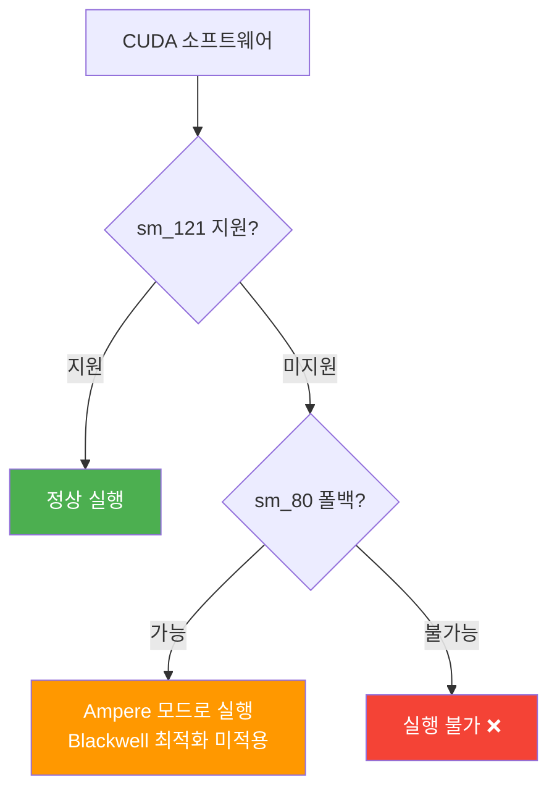

## 개요

NVIDIA DGX Spark는 "$3,000 개인용 AI 슈퍼컴퓨터"라는 타이틀로 2025년 CES에서 발표되었습니다. 128GB 통합 메모리와 Blackwell 아키텍처를 탑재한 데스크톱급 AI 워크스테이션이라는 포지셔닝이었습니다. 하지만 실제 사용자들의 리포트는 마케팅과 상당히 다른 현실을 보여주고 있습니다.

Reddit의 r/LocalLLaMA 커뮤니티에서 한 사용자가 DGX Spark를 1주일간 사용한 후 반품을 결정했다는 글이 큰 반향을 일으켰습니다. 핵심 문제는 <strong>CUDA 소프트웨어 호환성</strong>이었습니다.

## sm121: 데이터센터도 아니고 게이밍도 아닌 특수 아키텍처

DGX Spark의 가장 큰 문제점은 GPU 아키텍처에 있습니다.

| 구분 | 아키텍처 | SM 버전 | 특징 |
|------|----------|---------|------|
| 데이터센터 Blackwell | GB200/B200 | sm_100 | tcgen05 텐서코어, 풀 Blackwell |
| 게이밍 Blackwell | RTX 5090 등 | sm_120 | 게이밍 최적화 |
| <strong>DGX Spark</strong> | <strong>GB10</strong> | <strong>sm_121</strong> | <strong>독자 아키텍처, RT코어 포함</strong> |
| Ampere | A100 등 | sm_80 | 6년 전 아키텍처 |

DGX Spark는 데이터센터용 Blackwell(sm_100)도, 게이밍용 Blackwell(sm_120)도 아닌 <strong>sm_121이라는 독자적인 아키텍처</strong>를 사용합니다. 이로 인해 많은 CUDA 소프트웨어가 동작하지 않거나, sm_80(Ampere) 폴백 코드패스로 실행됩니다.

## 핸드헬드 게이밍 칩 유용 의혹

NVIDIA 공식 포럼에서 담당자가 남긴 답변이 의혹을 더욱 키웠습니다:

> sm80-class kernels can execute on DGX Spark because Tensor Core behavior is very similar, particularly for GEMM/MMAs (closer to the GeForce Ampere-style MMA model). DGX Spark not has tcgen05 like jetson Thor or GB200, due die space with RT Cores and DLSS algorithm

이 답변에서 드러난 핵심 사실들을 정리하면:

1. <strong>텐서코어가 Blackwell급이 아님</strong>: tcgen05(Blackwell의 5세대 텐서코어)가 없고, Ampere 스타일 MMA 모델에 가까움
2. <strong>RT코어와 DLSS 알고리즘이 다이 공간을 차지</strong>: AI 개발 키트에 게이밍 기능이 왜 필요한지 의문
3. <strong>Jetson Thor나 GB200과는 다른 설계</strong>: 같은 Blackwell이라는 이름을 쓰지만 내부는 완전히 다름

이 사실들은 DGX Spark의 GPU가 원래 <strong>게이밍 핸드헬드 디바이스용으로 설계된 칩</strong>을 AI 워크스테이션으로 전용했을 가능성을 시사합니다. 통합 메모리를 지원하는 게이밍 GPU라는 점이 이 가설을 뒷받침합니다.

## CUDA 소프트웨어 호환성의 실태

실제로 보고된 호환성 문제들:

- <strong>Triton</strong>: sm_80 코드패스로 폴백하는 패치가 적용됨 ([GitHub Issue #8335](https://github.com/triton-lang/triton/issues/8335))
- <strong>다수의 CUDA 라이브러리</strong>: sm_121을 인식하지 못해 빌드 실패 또는 런타임 에러 발생
- <strong>Blackwell 최적화 기능</strong>: FP4/FP6 양자화 등 Blackwell 전용 기능 사용 불가

더욱 문제가 되는 것은 NVIDIA 포럼 담당자가 <strong>존재하지 않는 소프트웨어 버전과 릴리스</strong>를 언급하며 문제가 해결되었다고 답변한 점입니다. 이는 LLM 할루시네이션으로 의심되며, NVIDIA의 고객 지원 품질에 대한 우려도 제기되고 있습니다.

## 하드웨어 품질 문제

소프트웨어 호환성 외에도 기본적인 하드웨어 문제가 보고되고 있습니다:

- <strong>HDMI 디스플레이 출력 불량</strong>: 1080p 144Hz 모니터에서 출력이 안 되는 사례 다수
- <strong>ServeTheHome 등 전문 리뷰어</strong>도 동일한 디스플레이 문제 확인
- "out of the box" 경험을 표방하면서 기본 디스플레이 연결에 문제가 있는 것은 심각한 품질 이슈

## 소비자를 위한 교훈

DGX Spark 사례에서 얻을 수 있는 교훈은 명확합니다:

1. <strong>마케팅 명칭에 속지 말 것</strong>: "Blackwell"이라는 이름이 붙어 있어도 데이터센터 Blackwell과는 완전히 다른 제품
2. <strong>SM 버전을 확인할 것</strong>: GPU의 실제 컴퓨트 능력은 SM 아키텍처 버전으로 결정됨
3. <strong>소프트웨어 에코시스템 확인 필수</strong>: 하드웨어 스펙보다 실제로 원하는 소프트웨어가 동작하는지가 더 중요
4. <strong>초기 사용자 리뷰를 기다릴 것</strong>: 특히 새로운 카테고리의 제품은 실사용 리뷰를 확인한 후 구매 결정

## Apple Silicon과의 비교

같은 통합 메모리 아키텍처를 사용하는 Apple Silicon(M4 Ultra 등)과의 비교도 의미있습니다:

| 항목 | DGX Spark | Mac Studio (M4 Ultra) |
|------|-----------|----------------------|
| 메모리 | 128GB 통합 | 최대 512GB 통합 |
| 메모리 대역폭 | ~273GB/s | ~819GB/s |
| CUDA 지원 | sm_121 (제한적) | 미지원 (Metal 사용) |
| 소프트웨어 호환성 | 부분적 | MLX 에코시스템 성숙 |
| 가격 | ~$3,000 | ~$4,000~ |

Apple Silicon은 CUDA를 지원하지 않지만, MLX 프레임워크의 에코시스템이 빠르게 성숙하고 있어 로컬 LLM 추론에서는 오히려 안정적인 경험을 제공합니다.

## 결론

DGX Spark는 "CUDA 에코시스템의 힘을 개인 데스크톱에서"라는 매력적인 약속을 했지만, 현실은 <strong>6년 전 Ampere 수준의 CUDA 호환성</strong>과 <strong>게이밍 칩 기반의 제한된 AI 성능</strong>이라는 gap이 존재합니다.

소비자용 AI 하드웨어 시장은 아직 초기 단계입니다. NVIDIA가 sm_121에 대한 완전한 소프트웨어 지원을 제공하기 전까지, DGX Spark 구매는 신중하게 판단해야 합니다. "AI 워크스테이션"이라는 라벨에 프리미엄을 지불하기 전에, 실제로 어떤 워크로드를 실행할 수 있는지 반드시 확인하세요.

## 참고 자료

- [Reddit r/LocalLLaMA - PSA: NVIDIA DGX Spark has terrible CUDA software](https://www.reddit.com/r/LocalLLaMA/comments/1r569eb/psa_nvidia_dgx_spark_has_terrible_cuda_software/)
- [Triton Issue #8335 - sm_121 호환성 패치](https://github.com/triton-lang/triton/issues/8335)
- [NVIDIA Developer Forum - DGX Spark sm121 Support Discussion](https://forums.developer.nvidia.com/t/dgx-spark-sm121-software-support-is-severely-lacking-official-roadmap-needed/357663)
