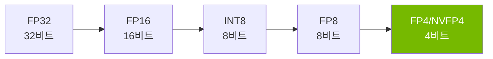
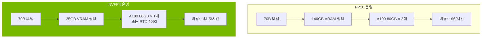
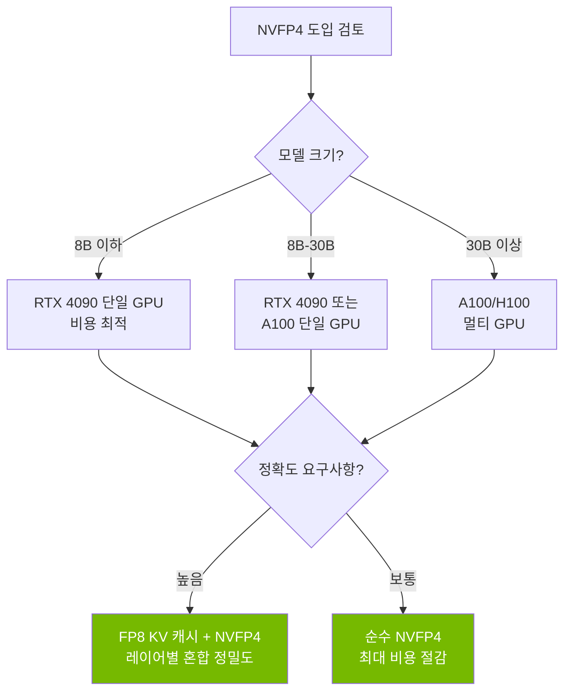

## 개요

LLM 추론 비용이 기업 AI 도입의 가장 큰 병목이 되고 있습니다. GPU 메모리 사용량, 전력 소비, 그리고 하드웨어 투자 비용까지 — 모델이 커질수록 비용은 기하급수적으로 증가합니다. NVIDIA가 발표한 <strong>NVFP4(4비트 부동소수점)</strong> 양자화 포맷은 이 구조를 근본적으로 바꿀 수 있는 기술입니다.

FP32(32비트)에서 FP4(4비트)로의 전환은 단순 계산으로도 <strong>8배의 메모리 절감</strong>을 의미하며, 실제 벤치마크에서도 정확도 손실을 최소화하면서 이 수치에 근접하는 결과가 나오고 있습니다.

이 글에서는 NVFP4의 기술적 원리, 실제 성능 데이터, 그리고 이것이 LLM 운영 비용 구조에 미치는 영향을 분석합니다.

## FP4 양자화란 무엇인가

### 비트 수 축소의 역사

LLM 양자화의 흐름을 시간순으로 정리하면 다음과 같습니다:



각 단계에서 모델 가중치를 표현하는 비트 수가 줄어들면서 메모리 사용량과 연산 비용이 감소합니다. 핵심은 <strong>정확도를 얼마나 유지하느냐</strong>입니다.

### NVFP4의 구조

NVFP4는 NVIDIA가 Blackwell 아키텍처부터 하드웨어 레벨에서 지원하는 4비트 부동소수점 포맷입니다. 일반적인 INT4와 달리 <strong>부동소수점 표현</strong>을 사용하여 동적 범위(dynamic range)를 더 넓게 유지합니다.

| 포맷 | 비트 수 | 메모리 대비 FP32 | 동적 범위 | 하드웨어 지원 |
|------|---------|-----------------|----------|-------------|
| FP32 | 32 | 1x | 매우 넓음 | 전체 |
| FP16 | 16 | 2x | 넓음 | 대부분 |
| FP8 | 8 | 4x | 보통 | Ada/Blackwell |
| NVFP4 | 4 | 8x | 보통 | Blackwell/Ada* |

*Ada Lovelace(RTX 4090 등)에서는 커뮤니티 프로젝트를 통해 지원

### Microscaling(MX) 포맷

NVFP4의 핵심 혁신 중 하나는 <strong>Microscaling</strong> 기술입니다. 이는 가중치를 작은 블록 단위로 나누고 각 블록마다 별도의 스케일링 팩터를 적용하는 방식입니다.

```
블록 크기: 32개 요소
각 블록 = [4비트 가중치 × 32] + [8비트 스케일 팩터 × 1]

유효 비트 = 4 + (8/32) = 4.25비트/요소
```

이 방식으로 극단적인 비트 축소에서도 각 블록의 값 분포를 정밀하게 보정할 수 있어, INT4 대비 훨씬 나은 정확도를 달성합니다.

## 실전 벤치마크: AdaLLM 프로젝트

Reddit r/LocalLLaMA 커뮤니티에서 화제가 된 <strong>AdaLLM</strong> 프로젝트는 NVFP4를 RTX 4090(Ada Lovelace)에서 실제로 구동한 결과를 공개했습니다.

### Qwen3-8B NVFP4 성능

| 배치 크기 | 총 토큰 | 소요 시간(초) | 처리량(tok/s) | VRAM(GB) |
|----------|---------|-------------|-------------|----------|
| 1 | 128 | 3.39 | 37.79 | 7.55 |
| 4 | 512 | 3.44 | 148.87 | 7.55 |
| 8 | 1024 | 3.45 | 297.16 | 7.56 |
| 16 | 2048 | 4.36 | 469.34 | 7.56 |

### Gemma3-27B NVFP4 성능

| 배치 크기 | 총 토큰 | 소요 시간(초) | 처리량(tok/s) | VRAM(GB) |
|----------|---------|-------------|-------------|----------|
| 1 | 128 | 9.40 | 13.62 | 19.83 |
| 4 | 512 | 9.53 | 53.70 | 19.84 |

<strong>핵심 결과</strong>:
- Qwen3-8B: FP16 대비 VRAM 2.4배 절감, 처리량 손실 약 20-25%
- Gemma3-27B(27B 파라미터): RTX 4090 단일 GPU에 탑재 가능
- 메모리가 아닌 <strong>연산 효율</strong>에서의 처리량 손실이므로, 배치 크기가 커질수록 비용 효율은 개선

## 비용 구조 변화 분석

### GPU 메모리 절감 효과

FP4 양자화가 실제 운영 비용에 미치는 영향을 시나리오별로 분석합니다.



### 비용 비교 시뮬레이션

70B 파라미터 모델 기준 월간 운영 비용을 추정하면:

| 항목 | FP16 | NVFP4 | 절감율 |
|------|------|-------|-------|
| GPU 수 | 2× A100 | 1× A100 | 50% |
| 시간당 비용 | ~$6.00 | ~$1.50 | 75% |
| 월간 비용(24/7) | ~$4,320 | ~$1,080 | 75% |
| 전력 소비 | ~600W | ~300W | 50% |

실제로 FP32 기준과 비교하면 메모리 측면에서 8배 절감이 가능하며, FP16 기준으로도 4배에 가까운 비용 절감을 달성합니다.

## 정확도 유지의 비결

### MXFP4 vs 기존 INT4

"Bridging the Gap Between Promise and Performance for Microscaling FP4 Quantization" 논문(2025)에서는 MXFP4/NVFP4 포맷의 정확도 유지 메커니즘을 상세히 분석했습니다.

핵심 기법들:

1. <strong>Microscaling 보정</strong>: 32개 요소마다 독립적인 스케일 팩터를 적용하여 값 분포의 왜곡을 최소화
2. <strong>FP8 KV 캐시</strong>: Key-Value 캐시에는 FP8을 사용하여 어텐션 계산의 정확도 유지
3. <strong>레이어별 적응적 양자화</strong>: 민감한 레이어는 높은 정밀도를 유지하고, 덜 민감한 레이어에 더 공격적인 양자화 적용
4. <strong>캘리브레이션 데이터 기반 최적화</strong>: 실제 입력 데이터 분포를 반영하여 양자화 파라미터 조정

### 품질 검증 결과

커뮤니티 벤치마크에서 NVFP4 모델은 다음과 같은 성능을 보여주고 있습니다:

- <strong>Perplexity 증가</strong>: FP16 대비 1-3% 이내
- <strong>다운스트림 태스크</strong>: MMLU, HellaSwag 등에서 1-2% 이내 성능 차이
- <strong>코딩 벤치마크</strong>: HumanEval에서 실용적 수준의 성능 유지

## 실전 적용 가이드

### AdaLLM으로 NVFP4 모델 실행하기

```bash
# 설치
pip install git+https://github.com/BenChaliah/NVFP4-on-4090-vLLM.git

# Qwen3-8B NVFP4 모델 서빙
adallm serve nvidia/Qwen3-8B-NVFP4

# FP8 GEMM 경로 활성화 (선택사항)
export NVFP4_FP8=1
adallm serve nvidia/Qwen3-8B-NVFP4
```

### 지원 모델

현재 AdaLLM에서 지원하는 NVFP4 모델:

- <strong>nvidia/Qwen3-8B-NVFP4</strong>: 8B 파라미터, RTX 4090에서 7.5GB VRAM
- <strong>Gemma3-27B-it-NVFP4</strong>: 27B 파라미터, RTX 4090에서 19.8GB VRAM
- <strong>Qwen3 MoE 변형</strong>: 지원은 되지만 최적화가 아직 진행 중

### 프로덕션 도입 시 고려사항



## 향후 전망

### Blackwell 아키텍처의 네이티브 FP4 지원

NVIDIA의 Blackwell GPU(B100, B200)는 FP4를 <strong>하드웨어 레벨에서 네이티브 지원</strong>합니다. 현재 Ada Lovelace에서의 소프트웨어 기반 구현과 달리, Blackwell에서는:

- 전용 FP4 텐서 코어에 의한 추가 성능 향상
- 처리량 손실 없는 FP4 연산
- 더 큰 모델의 단일 GPU 탑재 가능

### 산업적 임팩트

FP4 양자화의 보편화는 다음과 같은 변화를 가져올 것입니다:

1. <strong>LLM 서비스 가격 하락</strong>: API 기반 LLM 서비스의 가격이 현재의 1/4~1/8 수준으로 하락 가능
2. <strong>엣지 디바이스 배포</strong>: 70B 모델이 소비자 GPU에서 구동 가능해지면서 온프레미스 LLM 도입 가속
3. <strong>스타트업 진입 장벽 하락</strong>: 고성능 LLM 운영에 필요한 초기 투자 비용이 대폭 감소
4. <strong>환경적 영향</strong>: GPU 전력 소비 감소로 AI 산업의 탄소 발자국 축소

## 결론

NVIDIA의 NVFP4 양자화 기술은 LLM 추론 비용 구조를 근본적으로 변화시킬 수 있는 기술입니다. FP32 대비 8배, FP16 대비 4배의 메모리 절감을 달성하면서도 실용적 수준의 정확도를 유지한다는 점에서, 이는 단순한 최적화가 아닌 <strong>패러다임 전환</strong>입니다.

특히 AdaLLM과 같은 커뮤니티 프로젝트가 RTX 4090에서도 NVFP4를 실용적으로 구동할 수 있음을 증명한 것은, 이 기술이 데이터센터뿐 아니라 개인 개발자와 소규모 팀에게도 실질적인 가치를 제공할 수 있음을 보여줍니다.

2026년 이후 Blackwell 아키텍처의 보급과 함께, FP4 양자화는 LLM 운영의 새로운 표준이 될 가능성이 높습니다.

## 참고 자료

- [AdaLLM: NVFP4-first inference on RTX 4090](https://github.com/BenChaliah/NVFP4-on-4090-vLLM) — GitHub
- [Bridging the Gap Between Promise and Performance for Microscaling FP4 Quantization](https://arxiv.org/abs/2509.17880) — arXiv
- [Reddit r/LocalLLaMA 커뮤니티 토론](https://www.reddit.com/r/LocalLLaMA/) — 벤치마크 및 사용자 피드백
- [NVIDIA Blackwell Architecture](https://www.nvidia.com/en-us/data-center/technologies/blackwell-architecture/) — 공식 문서
