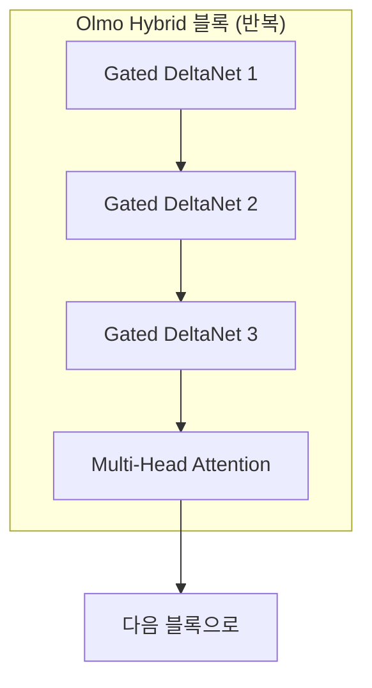

## 왜 하이브리드 아키텍처인가

2026년 3월, AI2(Allen Institute for AI)가 <strong>Olmo Hybrid</strong>를 공개했습니다. 7B 파라미터 규모의 이 모델은 Transformer의 Attention 레이어와 Linear RNN(Gated DeltaNet) 레이어를 결합한 하이브리드 아키텍처를 채택합니다.

핵심 성과는 명확합니다: <strong>MMLU에서 Olmo 3과 동일한 정확도를 49% 적은 토큰으로 달성</strong>. 이는 사실상 2배의 데이터 효율을 의미합니다. 모델 학습에 드는 비용과 시간이 절반으로 줄어들 수 있다는 뜻입니다.

이 글에서는 Olmo Hybrid의 아키텍처 설계, 벤치마크 결과, 이론적 배경, 그리고 EM/CTO 관점에서의 실무 시사점을 분석합니다.

## 아키텍처: 3:1 DeltaNet-Attention 패턴

Olmo Hybrid의 핵심은 <strong>3:1 패턴</strong>입니다. 네트워크 전체에서 3개의 Gated DeltaNet 서브레이어 뒤에 1개의 Multi-Head Attention 서브레이어가 반복됩니다.

이 설계의 의도는 각 컴포넌트의 강점을 조합하는 것입니다:

- <strong>Gated DeltaNet (75%)</strong>: 상태 추적(state tracking)에 특화. 시퀀스를 처리하면서 내부 상태를 효율적으로 업데이트합니다. 연산 비용이 시퀀스 길이에 비례하는 선형 복잡도를 가집니다.
- <strong>Multi-Head Attention (25%)</strong>: 정밀한 정보 회수(precise recall)에 특화. 긴 문맥에서 특정 위치의 토큰을 정확하게 참조할 수 있습니다.

Attention 레이어의 75%를 DeltaNet으로 대체하면서도 성능을 유지하는 이유는, 대부분의 연산이 "문맥의 전반적인 흐름을 파악"하는 작업이기 때문입니다. 정밀한 위치 참조가 필요한 경우는 전체의 25% 정도면 충분합니다.

## 벤치마크: 숫자로 보는 효율성

### 데이터 효율

| 벤치마크 | Olmo 3 대비 토큰 절감률 | 의미 |
|---------|----------------------|------|
| MMLU | 49% 절감 | 약 2배 데이터 효율 |
| Common Crawl 평가 | 35% 절감 | 일반 텍스트에서도 효율적 |

### 긴 문맥 처리

| 평가 | Olmo Hybrid (DRoPE) | Olmo 3 |
|------|---------------------|--------|
| RULER 64K 토큰 | <strong>85.0</strong> | 70.9 |

64K 토큰의 긴 문맥에서 Olmo Hybrid는 14.1점의 차이로 Olmo 3을 압도합니다. 이는 DeltaNet의 상태 추적 능력이 긴 시퀀스에서 특히 강력하다는 것을 보여줍니다.

### 훈련 처리량

중요한 점은 <strong>훈련 속도에서 손해가 없다</strong>는 것입니다. Olmo Hybrid와 Olmo 3은 동일한 파라미터 수에서 비슷한 훈련 처리량을 보여줍니다. 효율 향상은 속도를 포기한 대가가 아니라 아키텍처 자체에서 나옵니다.

## 훈련 인프라와 규모

Olmo Hybrid의 훈련 환경도 주목할 만합니다:

- <strong>7B 파라미터</strong>, 6조(6 trillion) 토큰으로 사전학습
- <strong>512 GPU</strong> 사용 (NVIDIA H100에서 시작 → HGX B200으로 마이그레이션)
- Lambda 인프라를 활용한 <strong>B200 기반 학습의 최초 사례 중 하나</strong>
- Olmo 3 32B의 데이터 믹스를 개선하여 사용

H100에서 B200으로의 마이그레이션은 차세대 GPU 인프라의 실전 적용 사례로서도 의미가 있습니다.

## 이론적 배경: 하이브리드가 더 강한 이유

AI2의 연구팀은 단순히 경험적 결과만 제시한 것이 아니라, 하이브리드 모델이 왜 더 효율적인지에 대한 이론적 근거도 함께 제공합니다.

### 표현력(Expressivity) 분석

- 하이브리드 모델은 <strong>Transformer 단독보다 더 표현력이 풍부</strong>합니다
- Linear RNN 단독으로도 불가능한 연산을 하이브리드는 수행할 수 있습니다
- 두 아키텍처가 각각 잘하는 영역이 다르기 때문에, 결합하면 그 합보다 더 강해집니다

### 스케일링 법칙

가장 흥미로운 발견은 <strong>규모가 커질수록 효율 이득이 더 커진다</strong>는 점입니다:

| 파라미터 규모 | 토큰 절감 배율 |
|-------------|-------------|
| 1B | ~1.3배 |
| 7B (현재) | ~1.5배 |
| 70B (예측) | ~1.9배 |

70B 규모에서는 동일한 성능을 달성하는 데 거의 절반의 토큰만 필요하다는 예측입니다. 대규모 모델일수록 하이브리드 아키텍처의 가치가 증가합니다.

## 완전 오픈 릴리스

Olmo Hybrid는 <strong>완전 오픈(Fully Open)</strong>으로 공개되었습니다:

- Base, SFT(Supervised Fine-Tuning), DPO(Direct Preference Optimization) 단계별 모델
- 모든 가중치와 중간 체크포인트
- 전체 학습 코드
- 스케일링 분석과 어블레이션 연구를 포함한 기술 보고서

이 수준의 투명성은 연구 커뮤니티와 기업 모두에게 가치가 있습니다. 내부 연구팀이 하이브리드 아키텍처를 자체적으로 검증하고 커스터마이징할 수 있는 기반을 제공합니다.

## EM/CTO 관점에서의 시사점

### 1. 모델 선택 전략의 변화

하이브리드 아키텍처가 주류가 되면, <strong>동일 예산으로 더 높은 성능의 모델을 학습</strong>할 수 있게 됩니다. 자체 모델을 학습하는 기업이라면 아키텍처 선택이 비용에 직접적인 영향을 미칩니다.

### 2. 긴 문맥 활용의 확대

64K 토큰에서의 성능 개선은 실무적으로 큰 의미가 있습니다. 코드 리뷰, 문서 분석, 멀티턴 대화 등 긴 문맥이 필요한 유스케이스에서 더 안정적인 성능을 기대할 수 있습니다.

### 3. 학습 인프라 투자 효율

2배의 데이터 효율은 곧 <strong>학습 비용 50% 절감</strong>의 가능성을 의미합니다. GPU 클러스터 비용이 AI 프로젝트의 가장 큰 비용 항목인 현실에서, 아키텍처 혁신을 통한 비용 절감은 ROI에 직접 영향을 미칩니다.

### 4. 오픈소스 생태계의 성숙

AI2의 완전 오픈 접근 방식은 기업이 검증된 아키텍처를 빠르게 도입할 수 있게 합니다. 파인튜닝, 양자화, 특화 학습 등의 후속 작업에 대한 진입 장벽이 낮아집니다.

## 앞으로의 전망

Olmo Hybrid는 LLM 아키텍처의 방향을 보여주는 중요한 이정표입니다:

1. <strong>Pure Transformer의 시대는 끝나가고 있습니다</strong>. 하이브리드 접근이 효율과 성능 모두에서 우위를 점하고 있습니다.
2. <strong>스케일링 법칙이 하이브리드에 유리합니다</strong>. 모델이 커질수록 효율 이득이 증가하는 구조적 장점이 있습니다.
3. <strong>오픈소스 모델의 경쟁력이 강화됩니다</strong>. 아키텍처 혁신과 완전 공개의 조합은 프로프라이어터리 모델과의 격차를 줄이고 있습니다.

AI 팀을 이끄는 리더라면, 하이브리드 아키텍처의 발전을 주시하면서 자체 모델 학습 파이프라인에 이를 어떻게 통합할 수 있을지 검토해볼 시점입니다.

## 참고 자료

- [AI2 공식 블로그: Introducing Olmo Hybrid](https://allenai.org/blog/olmohybrid)
- [Olmo Hybrid 기술 보고서 (arXiv)](https://allenai.org/papers/olmo-hybrid)
- [Hugging Face: Olmo Hybrid 모델](https://huggingface.co/allenai/Olmo-Hybrid-7B)
- [Lambda × AI2 공동 학습 사례](https://lambda.ai/blog/open-model-open-metrics-how-lambda-and-the-olmo-team-trained-olmo-hybrid)
