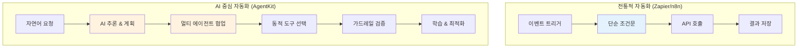
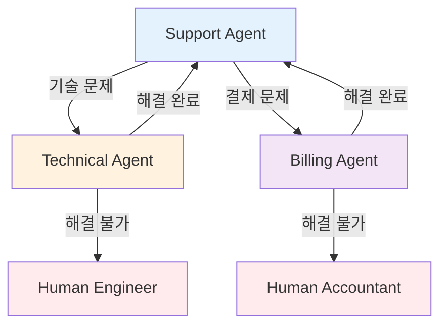

> <strong>시리즈: OpenAI AgentKit 마스터하기</strong> (1/2)
>
> 1. <strong>OpenAI AgentKit 완벽 가이드 1부: 핵심 개념과 시작하기</strong> ← 현재 글
> 2. [OpenAI AgentKit 완벽 가이드 2부: 실전 적용과 고급 패턴](/ko/blog/ko/openai-agentkit-tutorial-part2)

# OpenAI AgentKit 완벽 가이드 1부: 핵심 개념과 시작하기

2025년 10월 6일, 샌프란시스코에서 열린 OpenAI DevDay에서 Sam Altman은 개발자 생태계를 완전히 바꿀 발표를 했습니다. 바로 <strong>AgentKit</strong>입니다.

"프로토타입에서 프로덕션까지, 훨씬 적은 마찰로 에이전트를 구축, 배포, 최적화할 수 있는 모든 것"이라는 샘 알트먼의 말처럼, AgentKit은 단순한 API 업데이트가 아닙니다. 이는 <strong>AI가 워크플로우의 중심에 서는 새로운 패러다임</strong>입니다.

이 글에서는 AgentKit의 핵심 개념을 이해하고, 첫 번째 AI 에이전트를 직접 만들어보는 완벽한 튜토리얼을 제공합니다.

## 핵심 요약 (TL;DR)

- 🎯 <strong>AgentKit = AI 워크플로우 플랫폼</strong>: Zapier/n8n과 경쟁하지만, AI 추론이 핵심
- 🧩 <strong>4개 핵심 컴포넌트</strong>: Agent Builder (비주얼), ChatKit (UI), Connector Registry (도구), Evals (성능)
- 🐍 <strong>Python SDK 제공</strong>: `openai-agents` 패키지로 코드 우선 개발 가능
- 🔌 <strong>MCP 네이티브 지원</strong>: "AI 앱을 위한 USB-C"로 도구 통합 표준화
- 📊 <strong>베타 단계</strong>: Agent Builder는 현재 베타, 2025년 11월 1일부터 과금 시작
- 💡 <strong>언제 사용?</strong>: AI 중심 워크플로우, 멀티 에이전트 협업, 복잡한 의사결정 자동화

## AgentKit이란 무엇인가?

### OpenAI의 전략적 전환

OpenAI는 이제 더 이상 "API 제공자"가 아닙니다. AgentKit을 통해 <strong>플랫폼 기업</strong>으로 진화하고 있습니다.

기존의 워크플로우 자동화 도구들(Zapier, n8n, Make)이 <strong>"API를 연결하는 것"</strong>에 집중했다면, AgentKit은 <strong>"AI가 추론하며 조율하는 워크플로우"</strong>를 만듭니다.



<strong>핵심 차이</strong>:

- 전통적 도구: 미리 정의된 <strong>규칙 기반 흐름</strong>
- AgentKit: AI가 <strong>상황을 이해하고 결정</strong>하는 에이전틱 흐름

### 4개의 핵심 컴포넌트

AgentKit은 4개의 통합 시스템으로 구성됩니다:

#### 1️⃣ Agent Builder (베타)

<strong>"AI 워크플로우의 Figma"</strong>

- 드래그 앤 드롭 비주얼 캔버스
- 노코드/로우코드 멀티 에이전트 시스템 설계
- 인라인 프리뷰 및 테스트
- 버전 관리 내장
- 스티키 노트로 팀 협업 지원

<strong>언제 사용?</strong>:

- 비개발자와 협업할 때
- 복잡한 워크플로우를 시각화할 때
- 빠른 프로토타이핑이 필요할 때

#### 2️⃣ ChatKit

<strong>"임베더블 ChatGPT UI"</strong>

- 앱에 바로 넣을 수 있는 채팅 인터페이스
- 파일 업로드 지원 (월 1GB 무료)
- Agent Builder 워크플로우와 통합
- 화이트 라벨 커스터마이징

<strong>언제 사용?</strong>:

- SaaS에 AI 채팅 기능 추가
- 고객 지원 봇 구축
- 내부 도구에 AI 인터페이스 추가

#### 3️⃣ Connector Registry

<strong>"에이전트를 위한 도구 상자"</strong>

- 중앙 집중식 도구 및 데이터 관리
- MCP(Model Context Protocol) 서버 지원
- 관리자 권한 제어
- 보안 도구 통합

<strong>언제 사용?</strong>:

- 엔터프라이즈 환경에서 도구 접근 제어
- MCP 서버로 커스텀 도구 추가
- 외부 API를 안전하게 연결

#### 4️⃣ Evals (평가 시스템)

<strong>"에이전트 성능 계기판"</strong>

- 트레이스 그레이딩 (실행 로그 평가)
- 데이터셋 관리
- 자동 프롬프트 최적화
- 실시간 디버깅

<strong>언제 사용?</strong>:

- 에이전트 성능 측정
- 프롬프트 A/B 테스트
- 프로덕션 모니터링
- 비용 최적화

## 핵심 개념: Agents, Handoffs, Guardrails

AgentKit의 철학을 이해하려면 3가지 핵심 원칙을 알아야 합니다:

### 1. Agents (에이전트)

<strong>정의</strong>: 특정 역할과 도구를 가진 LLM

```python
from agents import Agent

agent = Agent(
    name="Customer Support Agent",
    instructions="""
    You are a customer support specialist for a SaaS company.
    Your role:
    - Answer product questions
    - Troubleshoot technical issues
    - Escalate to human if needed
    """,
    tools=[search_knowledge_base, create_ticket]
)
```

<strong>핵심</strong>: 에이전트는 단순한 프롬프트가 아닙니다. 이들은 <strong>역할, 도구, 제약</strong>을 가진 자율적 행위자입니다.

### 2. Handoffs (핸드오프)

<strong>정의</strong>: 에이전트 간 작업 위임

```python
from agents import Agent

support_agent = Agent(
    name="Support Agent",
    instructions="Handle basic inquiries",
    handoffs=["Technical Agent", "Billing Agent"]
)

technical_agent = Agent(
    name="Technical Agent",
    instructions="Resolve technical issues",
    handoffs=["Support Agent"]  # 다시 돌아갈 수 있음
)
```

<strong>사용 패턴</strong>:

- <strong>계층적 위임</strong>: 매니저 → 전문가
- <strong>피어 협업</strong>: 에이전트끼리 협력
- <strong>에스컬레이션</strong>: AI → 인간



### 3. Guardrails (가드레일)

<strong>정의</strong>: 입출력 검증 및 안전 장치

```python
from agents import Agent, guardrails

agent = Agent(
    name="Content Generator",
    instructions="Generate marketing content",
    input_guardrails=[
        guardrails.no_pii,           # 개인정보 차단
        guardrails.content_filter    # 유해 콘텐츠 필터
    ],
    output_guardrails=[
        guardrails.brand_voice_check, # 브랜드 톤 검증
        guardrails.factual_accuracy   # 사실 확인
    ]
)
```

<strong>왜 중요한가?</strong>:

- 프로덕션 환경에서 <strong>안전성 보장</strong>
- <strong>비용 폭주 방지</strong> (무한 루프, 불필요한 API 호출)
- <strong>브랜드 보호</strong> (부적절한 응답 차단)
- <strong>컴플라이언스</strong> (규정 준수)

## 첫 번째 에이전트 만들기: 단계별 튜토리얼

### 사전 준비

#### 1. OpenAI 계정 및 API 키

```bash
# 1. https://platform.openai.com 에서 회가입
# 2. API Keys 메뉴에서 키 생성
# 3. 환경 변수로 설정
export OPENAI_API_KEY=sk-proj-...
```

#### 2. Python SDK 설치

```bash
# Python 3.8 이상 필요
pip install openai-agents
```

#### 3. 설치 확인

```python
from agents import Agent, Runner

print("✓ OpenAI Agents SDK 설치 완료")
```

### 튜토리얼 1: 간단한 날씨 에이전트

<strong>목표</strong>: 도시명을 받아 날씨 정보를 제공하는 에이전트

#### Step 1: 도구 정의

```python
from agents.tools import function_tool

@function_tool
def get_weather(location: str) -> str:
    """
    Get current weather information for a location.

    Args:
        location: City name (e.g., "Seoul", "Tokyo")

    Returns:
        Weather description with temperature
    """
    # 실제로는 API 호출 (예: OpenWeatherMap)
    # 여기서는 시뮬레이션
    weather_data = {
        "Seoul": "맑음, 22°C",
        "Tokyo": "흐림, 18°C",
        "New York": "비, 15°C"
    }

    return weather_data.get(
        location,
        f"{location}의 날씨 정보를 찾을 수 없습니다"
    )
```

<strong>핵심</strong>: `@function_tool` 데코레이터가 함수를 에이전트가 사용할 수 있는 도구로 변환합니다. Docstring이 에이전트에게 도구 사용법을 알려줍니다.

#### Step 2: 에이전트 생성

```python
from agents import Agent

weather_agent = Agent(
    name="Weather Assistant",
    instructions="""
    You are a helpful weather assistant.
    When users ask about weather, use the get_weather tool.
    Provide friendly, conversational responses.
    If a city isn't found, suggest nearby alternatives.
    """,
    tools=[get_weather]
)
```

#### Step 3: 에이전트 실행

```python
from agents import Runner

# 동기 실행
result = Runner.run_sync(
    weather_agent,
    "서울 날씨 어때?"
)

print(result.final_output)
# 출력: "서울의 현재 날씨는 맑음이며, 기온은 22°C입니다!"
```

<strong>비동기 실행</strong> (프로덕션 환경):

```python
import asyncio

async def main():
    result = await Runner.run(
        weather_agent,
        "What's the weather in Tokyo?"
    )
    print(result.final_output)

asyncio.run(main())
```

### 튜토리얼 2: 멀티 에이전트 고객 지원 시스템

<strong>목표</strong>: 질문을 분류하고 적절한 전문 에이전트에게 라우팅

#### Step 1: 전문 에이전트들 정의

```python
from agents import Agent

# 기술 지원 에이전트
technical_agent = Agent(
    name="Technical Support",
    instructions="""
    You are a technical support specialist.
    Help users with:
    - Login issues
    - API errors
    - Performance problems

    If the issue is urgent, handoff to Human Engineer.
    """,
    handoffs=["Triage Agent"]  # 다시 돌아갈 수 있음
)

# 결제 지원 에이전트
billing_agent = Agent(
    name="Billing Support",
    instructions="""
    You are a billing specialist.
    Help users with:
    - Payment issues
    - Subscription changes
    - Refund requests

    Always verify user identity before discussing billing.
    """,
    handoffs=["Triage Agent"]
)

# 제품 정보 에이전트
product_agent = Agent(
    name="Product Expert",
    instructions="""
    You are a product expert.
    Answer questions about:
    - Features and capabilities
    - Best practices
    - Use cases and examples

    Provide detailed, educational responses.
    """,
    handoffs=["Triage Agent"]
)
```

#### Step 2: 트리아지(분류) 에이전트

```python
triage_agent = Agent(
    name="Triage Agent",
    instructions="""
    You are the first point of contact for customer support.

    Your job:
    1. Greet the user warmly
    2. Understand their issue
    3. Route to the appropriate specialist:
       - Technical Support: login, errors, bugs
       - Billing Support: payments, subscriptions
       - Product Expert: features, how-to questions

    If unsure, ask clarifying questions.
    """,
    handoffs=["Technical Support", "Billing Support", "Product Expert"]
)
```

#### Step 3: 실행 및 테스트

```python
# 테스트 1: 기술 문제
result = Runner.run_sync(
    triage_agent,
    "I'm getting a 401 error when calling the API"
)
print(result.final_output)
# → Technical Support 에이전트로 핸드오프

# 테스트 2: 결제 문제
result = Runner.run_sync(
    triage_agent,
    "I was charged twice this month"
)
print(result.final_output)
# → Billing Support 에이전트로 핸드오프

# 테스트 3: 제품 질문
result = Runner.run_sync(
    triage_agent,
    "How do I integrate webhooks?"
)
print(result.final_output)
# → Product Expert 에이전트로 핸드오프
```

#### Step 4: 세션으로 대화 이력 관리

```python
from agents import Runner, Session

# 새 세션 시작
session = Session()

# 여러 턴 대화
turns = [
    "I need help with my account",
    "I can't log in",
    "It says invalid password",
    "Yes, I tried resetting it"
]

for user_message in turns:
    result = Runner.run_sync(
        triage_agent,
        user_message,
        session=session  # 세션 전달로 이력 유지
    )
    print(f"User: {user_message}")
    print(f"Agent: {result.final_output}\n")
```

<strong>세션의 중요성</strong>:

- 대화 맥락 유지 (이전 질문 기억)
- 핸드오프 후에도 이력 보존
- 프로덕션에서는 데이터베이스에 세션 저장

## Agent Builder: 비주얼 개발

코드가 부담스럽다면? Agent Builder의 비주얼 캔버스를 사용하세요.

### Agent Builder 접근

1. https://platform.openai.com/agent-builder 방문
2. OpenAI 계정으로 로그인
3. "New Agent" 클릭

### 캔버스 UI 구성

```
┌────────────────────────────────────────────────┐
│  [New] [Save] [Deploy] [Preview]               │  ← 툴바
├────────────────────────────────────────────────┤
│                                                │
│   ┌─────┐      ┌─────┐      ┌─────┐          │
│   │Agent│─────▶│Tool │─────▶│Agent│          │  ← 노드 기반 워크플로우
│   │  A  │      │  X  │      │  B  │          │
│   └─────┘      └─────┘      └─────┘          │
│      │                          │             │
│      └──────┬──────────────────┘             │
│             ▼                                 │
│         ┌─────┐                               │
│         │Guard│                               │  ← 가드레일
│         │rail │                               │
│         └─────┘                               │
│                                                │
│  [Properties Panel] ─────────────────────────▶│  ← 설정 패널
│  Name: Agent A                                │
│  Instructions: [텍스트 입력]                   │
│  Tools: [선택]                                 │
│  Handoffs: [선택]                              │
└────────────────────────────────────────────────┘
```

### 비주얼로 멀티 에이전트 만들기

<strong>시나리오</strong>: 콘텐츠 생성 워크플로우

1. <strong>Drag "Agent" node</strong> → "Content Planner"

   - Instructions: "Create content outlines based on topics"

2. <strong>Drag "Agent" node</strong> → "Content Writer"

   - Instructions: "Write blog posts from outlines"
   - Connect: Planner → Writer

3. <strong>Drag "Agent" node</strong> → "SEO Optimizer"

   - Instructions: "Optimize content for SEO"
   - Connect: Writer → SEO Optimizer

4. <strong>Drag "Guardrail" node</strong> → "Quality Check"

   - Type: Output Validation
   - Rules: Minimum 500 words, no plagiarism
   - Connect: SEO Optimizer → Quality Check

5. <strong>Click "Preview"</strong> → 테스트 실행

6. <strong>Click "Deploy"</strong> → 프로덕션 배포

### 비주얼 vs 코드: 언제 무엇을 사용?

| 기준               | Agent Builder (비주얼)          | Python SDK (코드)         |
| ------------------ | ------------------------------- | ------------------------- |
| <strong>학습 곡선</strong>      | 낮음 (직관적)                   | 중간 (프로그래밍 필요)    |
| <strong>유연성</strong>         | 제한적                          | 무제한                    |
| <strong>협업</strong>           | 우수 (비개발자 포함)            | 보통 (개발자 중심)        |
| <strong>버전 관리</strong>      | 내장 UI                         | Git 통합                  |
| <strong>디버깅</strong>         | 비주얼 트레이스                 | 코드 레벨 디버그          |
| <strong>프로덕션 배포</strong>  | 원클릭                          | CI/CD 파이프라인          |
| <strong>추천 사용 사례</strong> | 프로토타입, 비즈니스 워크플로우 | 엔터프라이즈, 복잡한 로직 |

<strong>베스트 프랙티스</strong>: 비주얼로 프로토타입 → 코드로 프로덕션화

## Model Context Protocol (MCP) 통합

### MCP란?

<strong>"AI 앱을 위한 USB-C"</strong> - 도구와 데이터 소스를 표준화된 방식으로 연결

전통적 방식:

```
에이전트 ─┬─ Custom API 1 (커스텀 코드)
          ├─ Custom API 2 (또 다른 커스텀 코드)
          └─ Custom API 3 (또 또 다른...)
```

MCP 방식:

```
에이전트 ─── MCP Protocol ─┬─ MCP Server 1 (표준화)
                            ├─ MCP Server 2 (표준화)
                            └─ MCP Server 3 (표준화)
```

### AgentKit에서 MCP 사용하기

#### 1. MCP 서버 추가

```python
from agents import Agent
from agents.mcp import MCPServer

# MCP 서버 연결
notion_server = MCPServer(
    url="http://localhost:3000/mcp/notion",
    capabilities=["read_database", "create_page"]
)

# 에이전트에 MCP 서버 연결
agent = Agent(
    name="Notion Assistant",
    instructions="Help users manage Notion databases",
    mcp_servers=[notion_server]
)
```

#### 2. Connector Registry에서 관리

```python
from agents import ConnectorRegistry

# 조직의 MCP 서버 등록
registry = ConnectorRegistry()

registry.add_server(
    name="Company Notion",
    mcp_url="http://internal.mcp/notion",
    permissions=["read", "write"],
    allowed_teams=["marketing", "product"]
)

# 에이전트에서 레지스트리 사용
agent = Agent(
    name="Marketing Agent",
    connector_registry=registry
)
```

<strong>이점</strong>:

- 도구 재사용 (여러 에이전트에서 같은 MCP 서버 사용)
- 중앙 집중식 권한 관리
- 표준화된 에러 핸들링

### MCP 에코시스템

<strong>주요 MCP 서버</strong>:

- Notion MCP
- Google Drive MCP
- Slack MCP
- GitHub MCP
- PostgreSQL MCP

<strong>직접 만들기</strong>: https://modelcontextprotocol.io/docs

## 가드레일 깊이 있게 다루기

### 왜 가드레일이 필수인가?

<strong>실제 프로덕션 사고 사례</strong>:

- 챗봇이 고객 개인정보를 노출
- 무한 루프로 $10,000 API 청구
- 브랜드 가이드 위반 콘텐츠 생성
- 유해 콘텐츠 생성

<strong>가드레일의 역할</strong>: 이런 사고를 사전에 차단

### 입력 가드레일 (Input Guardrails)

<strong>사용자 입력을 검증</strong>

```python
from agents import Agent, guardrails

agent = Agent(
    name="Customer Support",
    instructions="...",
    input_guardrails=[
        guardrails.no_pii(          # 개인정보 차단
            block_email=True,
            block_ssn=True,
            block_credit_card=True
        ),
        guardrails.content_filter(  # 유해 콘텐츠 필터
            hate_speech=True,
            harassment=True,
            self_harm=True
        ),
        guardrails.language_check(  # 지원 언어 확인
            allowed_languages=["ko", "en", "ja"]
        )
    ]
)
```

<strong>동작</strong>:

1. 사용자 입력 도착
2. 가드레일 순차 실행
3. 차단 시 → 에이전트에 도달하지 않음
4. 통과 시 → 에이전트 처리

### 출력 가드레일 (Output Guardrails)

<strong>에이전트 응답을 검증</strong>

```python
agent = Agent(
    name="Content Generator",
    instructions="...",
    output_guardrails=[
        guardrails.brand_voice(        # 브랜드 톤 검증
            tone="professional",
            avoid_words=["cheap", "worst", "scam"]
        ),
        guardrails.fact_check(          # 사실 확인
            verify_statistics=True,
            verify_quotes=True
        ),
        guardrails.length_limit(        # 길이 제한
            min_words=100,
            max_words=500
        ),
        guardrails.no_hallucination(    # 환각 방지
            require_citations=True
        )
    ]
)
```

<strong>동작</strong>:

1. 에이전트 응답 생성
2. 가드레일 순차 검증
3. 실패 시 → 재생성 또는 에러 반환
4. 통과 시 → 사용자에게 전달

### 커스텀 가드레일 만들기

```python
from agents.guardrails import Guardrail

class CustomProfanityFilter(Guardrail):
    def __init__(self, banned_words: list[str]):
        self.banned_words = banned_words

    def validate(self, text: str) -> tuple[bool, str]:
        """
        Returns (is_valid, error_message)
        """
        for word in self.banned_words:
            if word.lower() in text.lower():
                return False, f"Contains banned word: {word}"
        return True, ""

# 사용
agent = Agent(
    name="Family-Friendly Bot",
    output_guardrails=[
        CustomProfanityFilter(
            banned_words=["욕설1", "욕설2", "금지어"]
        )
    ]
)
```

### 가드레일 베스트 프랙티스

1. <strong>입력과 출력 모두 보호</strong>: 양방향 방어
2. <strong>계층적 가드레일</strong>: 빠른 체크 먼저, 비싼 체크 나중에
3. <strong>명확한 에러 메시지</strong>: 사용자에게 왜 차단되었는지 알림
4. <strong>로깅</strong>: 가드레일 차단 이력 추적으로 개선
5. <strong>테스트</strong>: 악의적 입력으로 가드레일 테스트

## 세션과 대화 이력 관리

### 세션의 중요성

에이전트와 <strong>여러 턴 대화</strong>를 할 때, 이전 맥락을 기억해야 합니다.

```python
# 세션 없이 (맥락 없음)
result1 = Runner.run_sync(agent, "My name is John")
result2 = Runner.run_sync(agent, "What's my name?")
# 답변: "I don't know your name"  ← 이전 대화 기억 못함

# 세션 사용 (맥락 유지)
session = Session()
result1 = Runner.run_sync(agent, "My name is John", session=session)
result2 = Runner.run_sync(agent, "What's my name?", session=session)
# 답변: "Your name is John"  ← 이전 대화 기억
```

### 세션 영속성 (Persistence)

```python
from agents import Session
import json

# 세션 생성 및 사용
session = Session(user_id="user_123")
result = Runner.run_sync(agent, "Hello!", session=session)

# 세션을 JSON으로 저장
session_data = session.to_dict()
with open("session_user_123.json", "w") as f:
    json.dump(session_data, f)

# 나중에 세션 복원
with open("session_user_123.json", "r") as f:
    session_data = json.load(f)

restored_session = Session.from_dict(session_data)
result = Runner.run_sync(agent, "What did we talk about?", session=restored_session)
```

<strong>프로덕션 환경</strong>: Redis나 PostgreSQL에 세션 저장

```python
import redis

redis_client = redis.Redis(host='localhost', port=6379)

# 세션 저장
redis_client.set(
    f"session:{user_id}",
    json.dumps(session.to_dict()),
    ex=3600  # 1시간 후 만료
)

# 세션 로드
session_data = redis_client.get(f"session:{user_id}")
session = Session.from_dict(json.loads(session_data))
```

## 비용 최적화 전략

AgentKit은 강력하지만, 잘못 사용하면 비용이 급증할 수 있습니다.

### 1. 적절한 모델 선택

```python
# ❌ 비효율: 모든 작업에 GPT-5 Pro 사용
expensive_agent = Agent(
    name="Simple Bot",
    model="gpt-5-pro",  # 매우 비쌈
    instructions="Answer yes or no"
)

# ✅ 효율: 작업에 맞는 모델 선택
cheap_agent = Agent(
    name="Simple Bot",
    model="gpt-realtime-mini",  # 저렴하고 빠름
    instructions="Answer yes or no"
)
```

<strong>모델 선택 가이드</strong>:

- 단순 분류/라우팅: `gpt-realtime-mini`
- 일반 작업: `gpt-4o`
- 복잡한 추론: `gpt-5-pro`

### 2. 프롬프트 최적화

```python
# ❌ 비효율: 긴 프롬프트
agent = Agent(
    instructions="""
    You are an extremely helpful, friendly, and knowledgeable assistant
    who loves to help users with all their questions and concerns.
    You always provide detailed, comprehensive answers that cover
    every possible angle and consideration...
    [500 words of unnecessary instructions]
    """
)

# ✅ 효율: 간결한 프롬프트
agent = Agent(
    instructions="Answer user questions clearly and concisely."
)
```

<strong>토큰 = 비용</strong>: 프롬프트가 짧을수록 저렴

### 3. 가드레일로 무한 루프 방지

```python
from agents import guardrails

agent = Agent(
    name="Research Agent",
    instructions="...",
    output_guardrails=[
        guardrails.max_iterations(5),      # 최대 5회 반복
        guardrails.max_tool_calls(10),     # 최대 10회 도구 호출
        guardrails.timeout_seconds(30)     # 30초 제한
    ]
)
```

### 4. 캐싱 활용

```python
from agents import Agent, caching

agent = Agent(
    name="Product Expert",
    instructions="...",
    enable_caching=True  # 반복 질문 캐싱
)

# 첫 번째 호출: 전체 비용
result1 = Runner.run_sync(agent, "What is AgentKit?")

# 두 번째 호출: 캐시에서 반환 (무료)
result2 = Runner.run_sync(agent, "What is AgentKit?")
```

### 5. Evals로 모니터링

```python
from agents import Evals

evals = Evals()

# 비용 알림 설정
evals.set_alert(
    metric="cost_per_day",
    threshold=100.00,  # 하루 $100 초과 시 알림
    action="email"
)

# 비정상 패턴 감지
evals.monitor(
    agent_name="Customer Support",
    anomaly_detection=True  # 갑작스런 비용 증가 감지
)
```

## 프로덕션 배포 체크리스트

### 배포 전 확인 사항

#### ✅ 기능 테스트

- [ ] 모든 핸드오프 경로 테스트
- [ ] 엣지 케이스 처리 확인
- [ ] 에러 핸들링 검증
- [ ] 타임아웃 시나리오 테스트

#### ✅ 안전성

- [ ] 입력 가드레일 설정
- [ ] 출력 가드레일 설정
- [ ] PII 보호 확인
- [ ] 컴플라이언스 검토 (GDPR, CCPA 등)

#### ✅ 성능

- [ ] 응답 시간 측정 (<3초 목표)
- [ ] 비용 추정 (예상 트래픽 기반)
- [ ] 동시 요청 부하 테스트
- [ ] 캐싱 전략 수립

#### ✅ 모니터링

- [ ] Evals 대시보드 설정
- [ ] 알림 규칙 정의
- [ ] 로깅 인프라 구축
- [ ] 에러 추적 (Sentry 등)

#### ✅ 문서화

- [ ] 에이전트 동작 방식 문서화
- [ ] 팀원 온보딩 가이드 작성
- [ ] API 문서 (ChatKit 사용 시)
- [ ] 장애 대응 플레이북

### 배포 방법

#### Agent Builder에서 배포

1. Agent Builder에서 "Deploy" 클릭
2. 배포 환경 선택 (Staging / Production)
3. 버전 태그 입력 (예: `v1.0.0`)
4. "Confirm Deploy" 클릭
5. Webhook URL 받기 (ChatKit 통합 시)

#### Python SDK 배포

```python
# deploy.py
from agents import Agent, deploy

agent = Agent(
    name="Production Agent",
    instructions="..."
)

# OpenAI 플랫폼에 배포
deployment = deploy(
    agent=agent,
    environment="production",
    version="1.0.0"
)

print(f"Deployed at: {deployment.url}")
```

<strong>CI/CD 통합</strong>:

```yaml
# .github/workflows/deploy.yml
name: Deploy Agent
on:
  push:
    branches: [main]

jobs:
  deploy:
    runs-on: ubuntu-latest
    steps:
      - uses: actions/checkout@v2
      - name: Deploy to OpenAI
        run: |
          pip install openai-agents
          python deploy.py
        env:
          OPENAI_API_KEY: ${{ secrets.OPENAI_API_KEY }}
```

## 실전 사용 사례

### 사례 1: 고객 지원 자동화 (Clay)

<strong>결과</strong>: 10배 성장

<strong>구현</strong>:

```python
support_system = Agent(
    name="Support Triage",
    instructions="Classify and route customer inquiries",
    handoffs=[
        "Tier 1 Support",   # 일반 질문
        "Tier 2 Support",   # 기술 문제
        "Sales Team",       # 영업 문의
        "Human Agent"       # 복잡한 케이스
    ]
)
```

<strong>성과</strong>:

- 80% 자동 해결율
- 평균 응답 시간 5분 → 30초
- 고객 만족도 15% 증가

### 사례 2: 콘텐츠 생성 파이프라인

<strong>구현</strong>:

```python
content_planner = Agent(
    name="Content Planner",
    instructions="Create SEO-optimized content outlines"
)

content_writer = Agent(
    name="Writer",
    instructions="Write engaging blog posts from outlines"
)

seo_optimizer = Agent(
    name="SEO Optimizer",
    instructions="Optimize for search engines"
)

# 워크플로우
result = Runner.run_sync(
    content_planner,
    "Create content about AgentKit tutorial",
    handoff_chain=[content_writer, seo_optimizer]
)
```

<strong>성과</strong>:

- 콘텐츠 생산 속도 5배
- SEO 점수 평균 85+ 유지
- 작가 번아웃 감소

### 사례 3: 연구 보조 시스템

<strong>구현</strong>:

```python
@function_tool
def search_papers(query: str) -> list:
    """Search academic papers"""
    # arXiv, PubMed API 호출
    pass

@function_tool
def extract_key_findings(paper_url: str) -> str:
    """Extract key findings from a paper"""
    pass

research_agent = Agent(
    name="Research Assistant",
    instructions="""
    Help researchers by:
    1. Finding relevant papers
    2. Extracting key findings
    3. Synthesizing information
    4. Suggesting future research directions
    """,
    tools=[search_papers, extract_key_findings]
)
```

<strong>성과</strong>:

- 문헌 조사 시간 70% 단축
- 더 광범위한 연구 커버리지
- 놓친 중요 논문 발견

## 다음 단계

이제 AgentKit의 핵심 개념을 이해하고 첫 에이전트를 만들어봤습니다.

<strong>다음 글 예고</strong>: [OpenAI AgentKit 완벽 가이드 2부: 실전 적용과 고급 패턴](/ko/blog/ko/openai-agentkit-tutorial-part2)에서는:

- 🏗️ <strong>실전 아키텍처 패턴</strong>: 엔터프라이즈급 멀티 에이전트 시스템 설계
- 🔧 <strong>고급 도구 통합</strong>: MCP 서버 직접 만들기, 외부 API 연동
- 📊 <strong>성능 최적화</strong>: Evals를 활용한 A/B 테스트 및 프롬프트 최적화
- 🛡️ <strong>보안과 컴플라이언스</strong>: 프로덕션 환경의 안전 장치
- 💼 <strong>실제 케이스 스터디</strong>: 3가지 산업별 완전한 구현 예제

## 추가 자료

### 공식 문서

- OpenAI AgentKit 공식 페이지: https://openai.com/agent-platform/
- Agents SDK 문서: https://openai.github.io/openai-agents-python/
- MCP 프로토콜: https://modelcontextprotocol.io/

### 커뮤니티

- OpenAI Developer Forum: https://community.openai.com/
- AgentKit GitHub: https://github.com/openai/openai-agents-python
- Reddit: r/OpenAI

### 튜토리얼 비디오

- OpenAI DevDay 2025 Keynote (YouTube)
- AgentKit Deep Dive (공식 채널)

---

<strong>다음 글에서 만나요!</strong> 실전 사례로 함께 AgentKit을 마스터해봅시다.

_질문이나 피드백이 있다면 댓글로 남겨주세요. 모든 의견에 답변드리겠습니다!_
