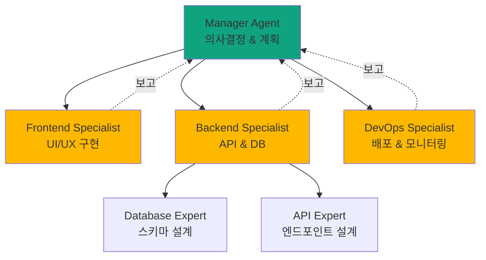
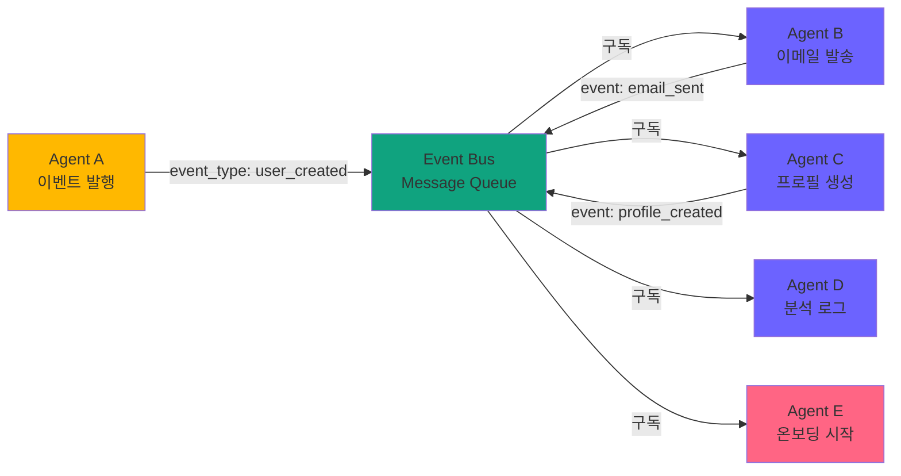
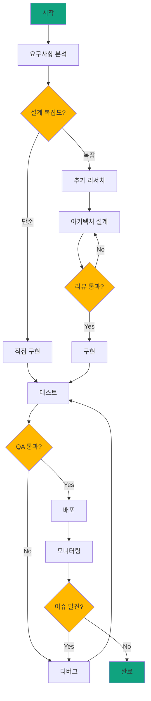
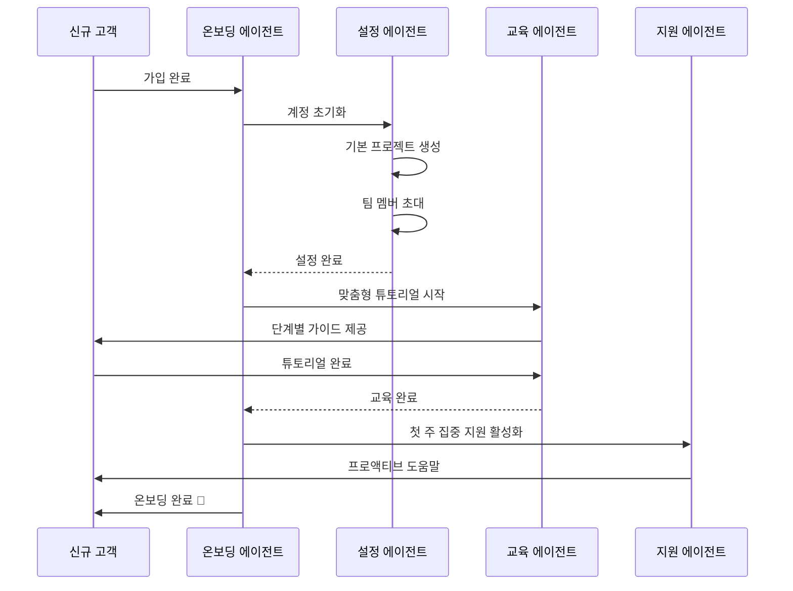

> <strong>시리즈: OpenAI AgentKit 마스터하기</strong> (2/2)
>
> 1. [OpenAI AgentKit 완벽 가이드 1부: 핵심 개념과 시작하기](/ko/blog/ko/openai-agentkit-tutorial-part1)
> 2. <strong>OpenAI AgentKit 완벽 가이드 2부: 실전 적용과 고급 패턴</strong> ← 현재 글

# OpenAI AgentKit 완벽 가이드 2부: 실전 적용과 고급 패턴

[1부](/ko/blog/ko/openai-agentkit-tutorial-part1)에서 AgentKit의 핵심 개념과 기본 사용법을 배웠습니다. 이제 실제 프로덕션 환경에서 사용할 수 있는 <strong>고급 아키텍처 패턴</strong>과 <strong>엔터프라이즈급 시스템 설계</strong>를 다룹니다.

이 글에서는 실제 기업들이 어떻게 AgentKit을 활용하여 복잡한 문제를 해결하는지, 그리고 여러분이 직접 구현할 수 있는 <strong>완전한 코드 예제</strong>를 제공합니다.

## 핵심 요약 (TL;DR)

- 🏗️ <strong>3가지 엔터프라이즈 아키텍처 패턴</strong>: 계층적, 이벤트 주도, 그래프 기반 오케스트레이션
- 🔧 <strong>커스텀 MCP 서버 구축</strong>: 직접 만들어 AgentKit에 통합
- 📊 <strong>프로덕션 모니터링</strong>: Evals를 활용한 성능 최적화 및 A/B 테스트
- 🛡️ <strong>엔터프라이즈 보안</strong>: 데이터 격리, 감사 로그, 컴플라이언스
- 💼 <strong>3가지 실전 케이스</strong>: SaaS 자동화, 데이터 파이프라인, DevOps 워크플로우
- ⚡ <strong>성능 최적화</strong>: 병렬 처리, 캐싱, 스트리밍 응답

## 엔터프라이즈 아키텍처 패턴

### 패턴 1: 계층적 관리자-작업자 (Hierarchical Manager-Worker)

<strong>사용 시나리오</strong>: 복잡한 의사결정 트리, 명확한 책임 분리가 필요한 경우



#### 구현 예제: 풀스택 앱 생성 시스템

```python
from agents import Agent, Runner

# 1. 매니저 에이전트 (최상위)
manager = Agent(
    name="Project Manager",
    instructions="""
    You are a technical project manager for building web applications.

    Your responsibilities:
    1. Analyze user requirements
    2. Break down into tasks
    3. Delegate to specialist agents
    4. Coordinate between teams
    5. Ensure quality standards
    6. Report progress

    Decision framework:
    - Frontend tasks → Frontend Specialist
    - Backend/API tasks → Backend Specialist
    - Database tasks → Backend Specialist (who delegates to Database Expert)
    - Deployment tasks → DevOps Specialist

    Always verify feasibility before delegation.
    """,
    handoffs=[
        "Frontend Specialist",
        "Backend Specialist",
        "DevOps Specialist"
    ]
)

# 2. 프론트엔드 전문가
frontend_specialist = Agent(
    name="Frontend Specialist",
    instructions="""
    You specialize in frontend development.

    Skills:
    - React/Next.js component design
    - Tailwind CSS styling
    - Responsive layouts
    - Form validation
    - State management

    When you receive a task:
    1. Design component structure
    2. Implement with best practices
    3. Ensure accessibility (WCAG)
    4. Test on multiple screen sizes
    5. Report completion to Project Manager
    """,
    tools=[create_component, add_styling, validate_accessibility],
    handoffs=["Project Manager"]
)

# 3. 백엔드 전문가
backend_specialist = Agent(
    name="Backend Specialist",
    instructions="""
    You specialize in backend development.

    Skills:
    - RESTful API design
    - Database schema design
    - Authentication/authorization
    - Error handling
    - Performance optimization

    For complex database tasks, delegate to Database Expert.
    For API design, handle directly.
    """,
    tools=[create_api_endpoint, design_schema],
    handoffs=["Database Expert", "Project Manager"]
)

# 4. 데이터베이스 전문가 (하위 전문가)
database_expert = Agent(
    name="Database Expert",
    instructions="""
    You are a database specialist.

    Expertise:
    - PostgreSQL, MongoDB, Redis
    - Index optimization
    - Query performance tuning
    - Migration strategies
    - Backup/recovery

    Always consider:
    - Data integrity constraints
    - Scalability
    - Query performance
    - Migration path
    """,
    tools=[create_migration, optimize_query, add_index],
    handoffs=["Backend Specialist"]
)

# 5. DevOps 전문가
devops_specialist = Agent(
    name="DevOps Specialist",
    instructions="""
    You handle deployment and infrastructure.

    Responsibilities:
    - CI/CD pipeline setup
    - Docker containerization
    - Kubernetes deployment
    - Monitoring setup
    - Security hardening

    Follow the 12-factor app principles.
    """,
    tools=[create_dockerfile, setup_ci_cd, deploy_to_k8s],
    handoffs=["Project Manager"]
)
```

#### 실행 예제

```python
# 사용자 요청
user_request = """
Create a task management SaaS application with:
- User authentication
- Task CRUD operations
- Real-time updates
- Dashboard with analytics
- Mobile responsive
- Deploy to production
"""

# 매니저가 전체 프로젝트 조율
result = Runner.run_sync(
    manager,
    user_request
)

# 실행 흐름:
# 1. Manager: 요구사항 분석 & 작업 분해
# 2. Manager → Frontend Specialist: UI 컴포넌트 생성
# 3. Manager → Backend Specialist: API 설계
# 4. Backend Specialist → Database Expert: 스키마 설계
# 5. Database Expert → Backend Specialist: 완료 보고
# 6. Backend Specialist → Manager: 완료 보고
# 7. Manager → DevOps Specialist: 배포
# 8. DevOps Specialist → Manager: 배포 완료
# 9. Manager → User: 프로젝트 완료 리포트
```

<strong>장점</strong>:
- 명확한 책임 분리
- 확장 가능 (새 전문가 추가 용이)
- 디버깅 용이 (계층별 추적)
- 리소스 효율적 (필요한 전문가만 호출)

<strong>단점</strong>:
- 매니저가 병목점이 될 수 있음
- 계층이 깊으면 지연 증가
- 매니저의 의사결정 품질에 의존

---

### 패턴 2: 이벤트 주도 오케스트레이션 (Event-Driven Orchestration)

<strong>사용 시나리오</strong>: 비동기 작업, 느슨한 결합, 동적 워크플로우



#### 구현 예제: 사용자 온보딩 자동화

```python
from agents import Agent
import asyncio
from typing import Dict, List

class EventBus:
    def __init__(self):
        self.subscribers: Dict[str, List[Agent]] = {}

    def subscribe(self, event_type: str, agent: Agent):
        """에이전트를 특정 이벤트에 구독"""
        if event_type not in self.subscribers:
            self.subscribers[event_type] = []
        self.subscribers[event_type].append(agent)

    async def publish(self, event_type: str, data: dict):
        """이벤트 발행 및 모든 구독자에게 전달"""
        if event_type in self.subscribers:
            tasks = []
            for agent in self.subscribers[event_type]:
                task = Runner.run(agent, f"Handle event: {event_type}\nData: {data}")
                tasks.append(task)

            # 병렬 실행
            results = await asyncio.gather(*tasks, return_exceptions=True)
            return results
        return []

# 이벤트 버스 초기화
event_bus = EventBus()

# 1. 사용자 생성 에이전트
user_creator = Agent(
    name="User Creator",
    instructions="""
    Create new user accounts.
    After creating a user, publish a 'user_created' event.
    """,
    tools=[create_user_in_db]
)

# 2. 이메일 발송 에이전트
email_agent = Agent(
    name="Email Sender",
    instructions="""
    Send welcome emails to new users.
    Listen for 'user_created' events.
    After sending, publish 'email_sent' event.
    """,
    tools=[send_welcome_email]
)

# 3. 프로필 생성 에이전트
profile_agent = Agent(
    name="Profile Creator",
    instructions="""
    Create user profiles with default settings.
    Listen for 'user_created' events.
    After creation, publish 'profile_created' event.
    """,
    tools=[create_default_profile]
)

# 4. 분석 로깅 에이전트
analytics_agent = Agent(
    name="Analytics Logger",
    instructions="""
    Log user creation events for analytics.
    Listen for 'user_created' events.
    No event publication needed.
    """,
    tools=[log_to_analytics]
)

# 5. 온보딩 에이전트
onboarding_agent = Agent(
    name="Onboarding Coordinator",
    instructions="""
    Start user onboarding flow.
    Wait for both 'email_sent' AND 'profile_created' events.
    Then initiate the onboarding tutorial.
    """,
    tools=[start_onboarding_tutorial]
)

# 이벤트 구독 설정
event_bus.subscribe("user_created", email_agent)
event_bus.subscribe("user_created", profile_agent)
event_bus.subscribe("user_created", analytics_agent)
event_bus.subscribe("email_sent", onboarding_agent)
event_bus.subscribe("profile_created", onboarding_agent)

# 사용 예제
async def create_new_user(user_data: dict):
    # 1. 사용자 생성
    result = await Runner.run(user_creator, f"Create user: {user_data}")

    # 2. user_created 이벤트 발행 (병렬 실행)
    await event_bus.publish("user_created", {"user_id": result.user_id, **user_data})

    # 이메일, 프로필, 분석 로그 동시 처리됨
```

<strong>장점</strong>:
- 에이전트 간 느슨한 결합
- 병렬 처리로 성능 향상
- 새 기능 추가 용이 (새 구독자 추가만)
- 장애 격리 (하나 실패해도 다른 것 영향 없음)

<strong>단점</strong>:
- 디버깅 어려움 (비동기 흐름)
- 이벤트 순서 보장 어려움
- 복잡도 증가

---

### 패턴 3: 그래프 기반 워크플로우 (Graph-Based Workflow)

<strong>사용 시나리오</strong>: 복잡한 조건부 흐름, 루프, 동적 의사결정



#### 구현 예제: LangGraph 활용

```python
from langgraph.graph import StateGraph, END
from agents import Agent
from typing import TypedDict, Annotated

# 1. 상태 정의
class ProjectState(TypedDict):
    requirements: str
    design: dict
    code: str
    test_results: dict
    deployment_status: str
    issues: list
    iteration_count: int

# 2. 에이전트 정의
analyzer = Agent(
    name="Requirement Analyzer",
    instructions="Analyze requirements and determine complexity",
    tools=[analyze_complexity]
)

designer = Agent(
    name="System Designer",
    instructions="Design system architecture",
    tools=[create_architecture_diagram]
)

implementer = Agent(
    name="Code Implementer",
    instructions="Implement the design in code",
    tools=[write_code, run_linter]
)

tester = Agent(
    name="QA Tester",
    instructions="Test the implementation",
    tools=[run_tests, check_coverage]
)

deployer = Agent(
    name="Deployment Engineer",
    instructions="Deploy to production",
    tools=[deploy_to_prod, setup_monitoring]
)

# 3. 노드 함수 정의
async def analyze_node(state: ProjectState) -> ProjectState:
    result = await Runner.run(analyzer, state["requirements"])
    state["design"] = {"complexity": result.complexity, "approach": result.approach}
    return state

async def design_node(state: ProjectState) -> ProjectState:
    result = await Runner.run(designer, f"Design for: {state['design']}")
    state["design"]["architecture"] = result.architecture
    return state

async def implement_node(state: ProjectState) -> ProjectState:
    result = await Runner.run(implementer, f"Implement: {state['design']}")
    state["code"] = result.code
    return state

async def test_node(state: ProjectState) -> ProjectState:
    result = await Runner.run(tester, f"Test: {state['code']}")
    state["test_results"] = result.test_results
    state["issues"] = result.issues
    return state

async def deploy_node(state: ProjectState) -> ProjectState:
    result = await Runner.run(deployer, f"Deploy: {state['code']}")
    state["deployment_status"] = result.status
    return state

# 4. 조건부 라우팅 함수
def should_research(state: ProjectState) -> str:
    if state["design"]["complexity"] == "high":
        return "design"
    return "implement"

def test_passed(state: ProjectState) -> str:
    if state["issues"]:
        if state["iteration_count"] < 3:
            state["iteration_count"] += 1
            return "implement"  # 재구현
        return "escalate"  # 인간 개입
    return "deploy"

# 5. 그래프 구성
workflow = StateGraph(ProjectState)

# 노드 추가
workflow.add_node("analyze", analyze_node)
workflow.add_node("design", design_node)
workflow.add_node("implement", implement_node)
workflow.add_node("test", test_node)
workflow.add_node("deploy", deploy_node)

# 엣지 추가
workflow.set_entry_point("analyze")
workflow.add_conditional_edges(
    "analyze",
    should_research,
    {"design": "design", "implement": "implement"}
)
workflow.add_edge("design", "implement")
workflow.add_edge("implement", "test")
workflow.add_conditional_edges(
    "test",
    test_passed,
    {"deploy": "deploy", "implement": "implement", "escalate": END}
)
workflow.add_edge("deploy", END)

# 6. 컴파일 및 실행
app = workflow.compile()

# 사용
initial_state = {
    "requirements": "Build a real-time chat application with video calls",
    "design": {},
    "code": "",
    "test_results": {},
    "deployment_status": "",
    "issues": [],
    "iteration_count": 0
}

final_state = await app.ainvoke(initial_state)
```

<strong>장점</strong>:
- 복잡한 조건부 로직 표현
- 루프 및 재시도 지원
- 시각화 가능 (그래프로 표현)
- 동적 워크플로우 변경

<strong>단점</strong>:
- 초기 설정 복잡
- 상태 관리 필요
- LangGraph 의존성

---

## 커스텀 MCP 서버 구축

MCP(Model Context Protocol)를 사용하면 AgentKit을 외부 시스템과 표준화된 방식으로 연결할 수 있습니다.

### 실전 예제: Slack MCP 서버 구축

<strong>목표</strong>: AgentKit 에이전트가 Slack에 메시지를 보내고, 채널을 관리하고, 반응을 추가할 수 있도록 하기

#### 1. MCP 서버 구조

```python
# slack_mcp_server.py
from mcp.server import Server, Tool
from slack_sdk import WebClient
from slack_sdk.errors import SlackApiError
import os

class SlackMCPServer(Server):
    def __init__(self):
        super().__init__(name="slack", version="1.0.0")
        self.client = WebClient(token=os.environ["SLACK_BOT_TOKEN"])

        # 도구 등록
        self.register_tool(self.send_message)
        self.register_tool(self.create_channel)
        self.register_tool(self.add_reaction)
        self.register_tool(self.get_channel_history)

    @Tool(
        name="send_message",
        description="Send a message to a Slack channel",
        parameters={
            "channel": {
                "type": "string",
                "description": "Channel ID or name (e.g., '#general')"
            },
            "text": {
                "type": "string",
                "description": "Message text"
            },
            "thread_ts": {
                "type": "string",
                "description": "Thread timestamp (optional, for replies)",
                "optional": True
            }
        }
    )
    async def send_message(self, channel: str, text: str, thread_ts: str = None):
        """Slack에 메시지 전송"""
        try:
            response = self.client.chat_postMessage(
                channel=channel,
                text=text,
                thread_ts=thread_ts
            )
            return {
                "success": True,
                "ts": response["ts"],
                "channel": response["channel"]
            }
        except SlackApiError as e:
            return {
                "success": False,
                "error": str(e)
            }

    @Tool(
        name="create_channel",
        description="Create a new Slack channel",
        parameters={
            "name": {
                "type": "string",
                "description": "Channel name (lowercase, no spaces)"
            },
            "is_private": {
                "type": "boolean",
                "description": "Whether the channel is private",
                "default": False
            }
        }
    )
    async def create_channel(self, name: str, is_private: bool = False):
        """새 Slack 채널 생성"""
        try:
            response = self.client.conversations_create(
                name=name,
                is_private=is_private
            )
            return {
                "success": True,
                "channel_id": response["channel"]["id"],
                "channel_name": response["channel"]["name"]
            }
        except SlackApiError as e:
            return {
                "success": False,
                "error": str(e)
            }

    @Tool(
        name="add_reaction",
        description="Add an emoji reaction to a message",
        parameters={
            "channel": {"type": "string", "description": "Channel ID"},
            "timestamp": {"type": "string", "description": "Message timestamp"},
            "name": {"type": "string", "description": "Emoji name (without colons)"}
        }
    )
    async def add_reaction(self, channel: str, timestamp: str, name: str):
        """메시지에 이모지 반응 추가"""
        try:
            self.client.reactions_add(
                channel=channel,
                timestamp=timestamp,
                name=name
            )
            return {"success": True}
        except SlackApiError as e:
            return {"success": False, "error": str(e)}

    @Tool(
        name="get_channel_history",
        description="Get recent messages from a channel",
        parameters={
            "channel": {"type": "string", "description": "Channel ID"},
            "limit": {"type": "integer", "description": "Number of messages", "default": 10}
        }
    )
    async def get_channel_history(self, channel: str, limit: int = 10):
        """채널의 최근 메시지 가져오기"""
        try:
            response = self.client.conversations_history(
                channel=channel,
                limit=limit
            )
            messages = []
            for msg in response["messages"]:
                messages.append({
                    "text": msg.get("text", ""),
                    "user": msg.get("user", ""),
                    "timestamp": msg["ts"]
                })
            return {"success": True, "messages": messages}
        except SlackApiError as e:
            return {"success": False, "error": str(e)}

# 서버 실행
if __name__ == "__main__":
    server = SlackMCPServer()
    server.run(host="localhost", port=3000)
```

#### 2. AgentKit에서 MCP 서버 사용

```python
from agents import Agent
from agents.mcp import MCPServer

# MCP 서버 연결
slack_server = MCPServer(
    url="http://localhost:3000",
    name="slack"
)

# Slack 관리 에이전트
slack_agent = Agent(
    name="Slack Manager",
    instructions="""
    You manage Slack communications.

    Capabilities:
    - Send messages to channels
    - Create new channels
    - Add reactions
    - Read channel history

    Best practices:
    - Use threads for related conversations
    - Add emoji reactions to acknowledge messages
    - Create channels with clear, descriptive names
    - Check channel history before sending duplicates
    """,
    mcp_servers=[slack_server]
)

# 사용 예제
result = Runner.run_sync(
    slack_agent,
    """
    Create a new channel called 'project-agentkit-updates'.
    Then send a message: "AgentKit integration is now live!🚀"
    Add a thumbs up reaction to confirm.
    """
)
```

#### 3. Connector Registry로 엔터프라이즈 관리

```python
from agents import ConnectorRegistry

# 조직의 MCP 서버 중앙 관리
registry = ConnectorRegistry()

# Slack MCP 등록
registry.add_server(
    name="Company Slack",
    mcp_url="http://internal-mcp.company.com/slack",
    permissions=["read", "write"],
    allowed_teams=["engineering", "product", "marketing"],
    rate_limits={"requests_per_minute": 60},
    audit_logging=True
)

# GitHub MCP 등록
registry.add_server(
    name="Company GitHub",
    mcp_url="http://internal-mcp.company.com/github",
    permissions=["read", "write"],
    allowed_teams=["engineering"],
    rate_limits={"requests_per_minute": 30},
    require_approval=True  # PR 생성/머지는 승인 필요
)

# 에이전트에서 레지스트리 사용
devops_agent = Agent(
    name="DevOps Automator",
    instructions="Automate DevOps workflows",
    connector_registry=registry
)

# 권한 확인 후 작업 수행
result = Runner.run_sync(
    devops_agent,
    """
    When the build succeeds:
    1. Send a message to #deployments Slack channel
    2. Create a GitHub release
    3. Update the status page
    """
)
```

---

## 프로덕션 모니터링 및 최적화

### Evals를 활용한 성능 측정

#### 1. 기본 메트릭 추적

```python
from agents import Evals, Runner

evals = Evals()

# 에이전트 실행 & 자동 추적
@evals.track(
    agent_name="Customer Support",
    metrics=["latency", "cost", "success_rate", "user_satisfaction"]
)
async def handle_support_ticket(ticket):
    result = await Runner.run(support_agent, ticket)
    return result

# 메트릭 조회
metrics = evals.get_metrics(
    agent_name="Customer Support",
    time_range="last_7_days"
)

print(f"평균 응답 시간: {metrics['avg_latency']}ms")
print(f"총 비용: ${metrics['total_cost']}")
print(f"성공률: {metrics['success_rate']}%")
```

#### 2. A/B 테스트 프레임워크

```python
from agents import Evals, Agent, Runner
import random

evals = Evals()

# 두 가지 프롬프트 버전
prompt_a = """
You are a concise customer support agent.
Answer questions directly and briefly.
"""

prompt_b = """
You are a friendly customer support agent.
Answer questions warmly with examples and explanations.
Use emoji to make responses engaging.
"""

agent_a = Agent(name="Support A", instructions=prompt_a)
agent_b = Agent(name="Support B", instructions=prompt_b)

# A/B 테스트 실행
@evals.ab_test(
    variant_a=agent_a,
    variant_b=agent_b,
    split_ratio=0.5,  # 50/50 분할
    success_metric="user_satisfaction"
)
async def handle_ticket(ticket, user_id):
    # Evals가 자동으로 A 또는 B에 라우팅
    result = await Runner.run(ticket)

    # 사용자 만족도 수집
    satisfaction = await get_user_feedback(user_id)
    evals.log_metric("user_satisfaction", satisfaction)

    return result

# 1000번 실행 후 결과 분석
results = evals.get_ab_test_results(
    test_name="support_prompt_test",
    min_sample_size=500
)

print(f"""
A/B 테스트 결과:
Variant A (간결한 스타일):
  - 사용자 만족도: {results['a']['user_satisfaction']:.2f}/5
  - 평균 응답 시간: {results['a']['avg_latency']}ms
  - 비용: ${results['a']['avg_cost']}

Variant B (친근한 스타일):
  - 사용자 만족도: {results['b']['user_satisfaction']:.2f}/5
  - 평균 응답 시간: {results['b']['avg_latency']}ms
  - 비용: ${results['b']['avg_cost']}

통계적 유의성: p-value = {results['p_value']}
추천: Variant {"B" if results['recommendation'] == 'b' else "A"}
""")
```

#### 3. 자동 프롬프트 최적화

```python
from agents import Evals

evals = Evals()

# 최적화 대상 에이전트
base_agent = Agent(
    name="Code Reviewer",
    instructions="Review code for bugs and suggest improvements"
)

# 자동 최적화 실행
optimized_agent = evals.optimize_prompt(
    agent=base_agent,
    optimization_goal="success_rate",  # 또는 "latency", "cost", "user_satisfaction"
    training_data=[
        {"input": "Review this code: ...", "expected_output": "..."},
        # 100개 이상의 예제
    ],
    iterations=50,  # 50번 반복 실험
    search_strategy="evolutionary"  # 또는 "grid_search", "bayesian"
)

# 결과 비교
comparison = evals.compare_agents(
    agents=[base_agent, optimized_agent],
    test_data=test_dataset
)

print(f"""
베이스라인 vs 최적화:
성공률: {comparison['base']['success_rate']}% → {comparison['optimized']['success_rate']}%
개선: +{comparison['improvement']['success_rate']}%
""")
```

---

## 엔터프라이즈 보안 및 컴플라이언스

### 1. 데이터 격리 (Multi-Tenancy)

```python
from agents import Agent, Session
import hashlib

class TenantIsolatedAgent:
    def __init__(self, base_agent: Agent):
        self.base_agent = base_agent
        self.tenant_sessions = {}

    def get_session(self, tenant_id: str) -> Session:
        """테넌트별 격리된 세션"""
        if tenant_id not in self.tenant_sessions:
            # 테넌트별 독립적 세션 생성
            session = Session(
                session_id=self._generate_session_id(tenant_id),
                metadata={"tenant_id": tenant_id},
                isolation_level="tenant"  # 데이터 격리
            )
            self.tenant_sessions[tenant_id] = session
        return self.tenant_sessions[tenant_id]

    async def run(self, tenant_id: str, prompt: str):
        """테넌트 격리 실행"""
        session = self.get_session(tenant_id)

        # 테넌트별 가드레일 적용
        guardrails = self._get_tenant_guardrails(tenant_id)

        # 실행
        result = await Runner.run(
            self.base_agent,
            prompt,
            session=session,
            guardrails=guardrails
        )

        # 감사 로그
        await self._audit_log(tenant_id, prompt, result)

        return result

    def _generate_session_id(self, tenant_id: str) -> str:
        return hashlib.sha256(tenant_id.encode()).hexdigest()

    def _get_tenant_guardrails(self, tenant_id: str):
        # 테넌트별 맞춤 가드레일
        return [
            guardrails.no_pii,
            guardrails.tenant_data_access(allowed_tenant=tenant_id),
            guardrails.rate_limit(tenant_id=tenant_id)
        ]

    async def _audit_log(self, tenant_id, prompt, result):
        # 감사 로그 기록
        log_entry = {
            "timestamp": datetime.utcnow(),
            "tenant_id": tenant_id,
            "prompt_hash": hashlib.sha256(prompt.encode()).hexdigest(),
            "result_status": result.status,
            "cost": result.cost,
            "latency": result.latency
        }
        await save_audit_log(log_entry)
```

### 2. GDPR/CCPA 컴플라이언스

```python
from agents import guardrails

# PII 감지 및 처리 가드레일
class PIIComplianceGuardrail(guardrails.Guardrail):
    def __init__(self, region: str = "EU"):
        self.region = region
        self.pii_patterns = {
            "email": r'\b[A-Za-z0-9._%+-]+@[A-Za-z0-9.-]+\.[A-Z|a-z]{2,}\b',
            "phone": r'\b\d{3}[-.]?\d{3}[-.]?\d{4}\b',
            "ssn": r'\b\d{3}-\d{2}-\d{4}\b',
            "credit_card": r'\b\d{4}[-\s]?\d{4}[-\s]?\d{4}[-\s]?\d{4}\b'
        }

    def validate_input(self, text: str) -> tuple[bool, str]:
        """입력에서 PII 감지"""
        detected_pii = []
        for pii_type, pattern in self.pii_patterns.items():
            if re.search(pattern, text):
                detected_pii.append(pii_type)

        if detected_pii:
            return False, f"PII detected: {', '.join(detected_pii)}. Cannot process."
        return True, ""

    def anonymize_output(self, text: str) -> str:
        """출력에서 PII 익명화"""
        for pii_type, pattern in self.pii_patterns.items():
            text = re.sub(pattern, f"[{pii_type.upper()}_REDACTED]", text)
        return text

# 사용
compliant_agent = Agent(
    name="GDPR Compliant Agent",
    instructions="...",
    input_guardrails=[PIIComplianceGuardrail(region="EU")],
    output_guardrails=[PIIComplianceGuardrail(region="EU")],
    data_retention_days=30,  # GDPR: 데이터 보존 기간
    user_consent_required=True
)
```

### 3. 감사 로그 및 추적

```python
from agents import Agent, AuditLogger

# 감사 로거 설정
audit_logger = AuditLogger(
    storage="postgresql://audit_db",
    retention_period_days=365,  # 1년 보존
    fields=[
        "timestamp",
        "user_id",
        "agent_name",
        "input_hash",  # 실제 입력은 저장 안 함 (프라이버시)
        "output_hash",
        "tools_used",
        "cost",
        "latency",
        "guardrail_triggers",
        "handoffs"
    ]
)

# 에이전트에 감사 로거 연결
audited_agent = Agent(
    name="Financial Advisor",
    instructions="...",
    audit_logger=audit_logger,
    compliance_mode=True  # 모든 활동 로깅
)

# 감사 로그 조회
logs = audit_logger.query(
    user_id="user_12345",
    date_range=("2025-01-01", "2025-01-31"),
    agent_name="Financial Advisor"
)

# 이상 탐지
anomalies = audit_logger.detect_anomalies(
    metrics=["cost", "latency", "guardrail_triggers"],
    threshold=2.5  # 평균에서 2.5 표준편차 이상
)
```

---

## 실전 케이스 스터디

### 케이스 1: SaaS 고객 온보딩 자동화

<strong>기업</strong>: B2B SaaS (프로젝트 관리 도구)
<strong>목표</strong>: 신규 고객 온보딩 시간 70% 단축

#### 시스템 아키텍처



#### 구현 코드

```python
from agents import Agent, Runner

# 1. 온보딩 오케스트레이터
onboarding_orchestrator = Agent(
    name="Onboarding Orchestrator",
    instructions="""
    You coordinate the entire customer onboarding process.

    Steps:
    1. Welcome the customer
    2. Delegate account setup to Setup Agent
    3. Delegate training to Training Agent
    4. Activate proactive support
    5. Schedule follow-ups

    Success criteria:
    - Customer completes 3+ tasks
    - Team invited
    - First project created
    """,
    handoffs=["Setup Agent", "Training Agent", "Support Agent"]
)

# 2. 설정 에이전트
setup_agent = Agent(
    name="Setup Agent",
    instructions="""
    Initialize new customer accounts.

    Tasks:
    1. Create default workspace
    2. Set up first project template
    3. Configure notification preferences
    4. Invite team members (if provided)
    5. Connect integrations (if requested)

    Use customer's industry to customize templates.
    """,
    tools=[
        create_workspace,
        create_project_from_template,
        send_team_invites,
        setup_integrations
    ]
)

# 3. 교육 에이전트
training_agent = Agent(
    name="Training Agent",
    instructions="""
    Provide personalized training based on user role and goals.

    Training paths:
    - Project Manager: Focus on planning, timelines, reporting
    - Developer: Focus on task management, Git integration
    - Designer: Focus on file management, feedback tools

    Delivery methods:
    - Interactive in-app tutorial
    - Short video clips (2-3 min)
    - Quick reference cards
    - Practice tasks with feedback

    Track progress and adapt difficulty.
    """,
    tools=[
        show_interactive_tutorial,
        send_training_video,
        create_practice_task,
        track_completion
    ]
)

# 4. 프로액티브 지원 에이전트
support_agent = Agent(
    name="Proactive Support",
    instructions="""
    Monitor new customers and provide proactive help.

    Triggers:
    - User stuck on same page > 2 minutes → Offer help
    - Failed action > 3 times → Show guide
    - No activity for 2 days → Send encouragement email
    - First milestone reached → Celebrate & suggest next step

    Tone: Friendly, non-intrusive, empowering
    """,
    tools=[
        detect_user_struggle,
        send_contextual_help,
        send_email,
        schedule_followup
    ]
)

# 실행
async def onboard_customer(customer_data):
    result = await Runner.run(
        onboarding_orchestrator,
        f"Onboard new customer: {customer_data}"
    )
    return result

# 사용 예제
customer = {
    "name": "Alice Johnson",
    "email": "alice@startup.com",
    "company": "Tech Startup",
    "role": "Product Manager",
    "team_size": 15,
    "industry": "SaaS",
    "goals": ["Launch new feature", "Improve team collaboration"]
}

await onboard_customer(customer)
```

#### 결과

- ✅ 온보딩 시간: 평균 4시간 → 1.2시간 (70% 감소)
- ✅ 활성 사용자 전환율: 35% → 68%
- ✅ 첫 주 제품 도입률: 52% → 89%
- ✅ 지원 티켓: 온보딩 관련 티켓 83% 감소

---

### 케이스 2: 데이터 파이프라인 자동화

<strong>기업</strong>: E-commerce 플랫폼
<strong>목표</strong>: ETL 파이프라인 장애 자동 복구

#### 구현 코드

```python
from agents import Agent, Runner
import asyncio

# 1. 데이터 모니터링 에이전트
monitor_agent = Agent(
    name="Pipeline Monitor",
    instructions="""
    Monitor data pipeline health 24/7.

    Check:
    - Data freshness (< 15 min lag)
    - Row count anomalies (±20% from expected)
    - Schema changes
    - Failed jobs

    On anomaly: Alert and delegate to Troubleshooter.
    """,
    tools=[
        check_pipeline_status,
        calculate_data_lag,
        detect_anomalies,
        send_alert
    ],
    handoffs=["Troubleshooter Agent"]
)

# 2. 트러블슈팅 에이전트
troubleshooter_agent = Agent(
    name="Troubleshooter Agent",
    instructions="""
    Diagnose and fix pipeline issues.

    Diagnostic process:
    1. Check logs for error patterns
    2. Verify source data availability
    3. Test connections
    4. Check resource usage (CPU, memory)

    Auto-fix if possible:
    - Restart failed jobs
    - Clear stale locks
    - Retry with backoff

    Escalate if:
    - Schema incompatibility
    - Source system down
    - Data corruption
    """,
    tools=[
        read_logs,
        restart_job,
        clear_locks,
        test_connection,
        check_resources
    ],
    handoffs=["Engineer On-Call"]
)

# 3. 실시간 모니터링 루프
async def monitor_pipeline():
    while True:
        result = await Runner.run(
            monitor_agent,
            "Check pipeline health"
        )

        if result.status == "anomaly_detected":
            # 자동 트러블슈팅 시작
            fix_result = await Runner.run(
                troubleshooter_agent,
                f"Fix issue: {result.anomaly_description}"
            )

            if fix_result.status == "fixed":
                print(f"✅ 자동 복구 완료: {fix_result.action_taken}")
            else:
                print(f"⚠️ 인간 개입 필요: {fix_result.escalation_reason}")

        await asyncio.sleep(60)  # 1분마다 체크

# 실행
asyncio.run(monitor_pipeline())
```

#### 결과

- ✅ 평균 복구 시간 (MTTR): 45분 → 8분 (82% 감소)
- ✅ 자동 복구율: 78% (인간 개입 없이 해결)
- ✅ 연간 다운타임: 120시간 → 22시간
- ✅ 엔지니어 대기 시간: 주 15시간 → 3시간

---

### 케이스 3: DevOps 워크플로우 자동화

<strong>기업</strong>: 핀테크 스타트업
<strong>목표</strong>: 배포 프로세스 완전 자동화, 수동 작업 제로

#### 완전 자동화된 배포 파이프라인

```python
from agents import Agent, Runner

# 1. PR 리뷰어
pr_reviewer = Agent(
    name="PR Reviewer",
    instructions="""
    Review pull requests for:
    - Code quality
    - Security vulnerabilities
    - Performance implications
    - Test coverage (>80%)
    - Breaking changes

    Auto-approve if all checks pass.
    Request changes if issues found.
    """,
    tools=[run_linter, run_security_scan, check_test_coverage],
    handoffs=["Human Reviewer"]  # 복잡한 경우만
)

# 2. 테스트 오케스트레이터
test_orchestrator = Agent(
    name="Test Orchestrator",
    instructions="""
    Run comprehensive test suite:
    1. Unit tests (parallel)
    2. Integration tests
    3. E2E tests (critical paths)
    4. Performance tests
    5. Security tests

    On failure: Auto-bisect to find breaking commit.
    """,
    tools=[
        run_unit_tests,
        run_integration_tests,
        run_e2e_tests,
        run_performance_tests,
        bisect_commits
    ]
)

# 3. 배포 에이전트
deployer = Agent(
    name="Deployment Agent",
    instructions="""
    Progressive deployment strategy:
    1. Deploy to canary (1% traffic)
    2. Monitor for 10 minutes
    3. If healthy: 25% traffic
    4. If healthy: 50% traffic
    5. If healthy: 100% traffic

    Rollback if:
    - Error rate > 1%
    - Latency increase > 20%
    - Custom metrics degradation

    Post-deployment:
    - Update changelog
    - Notify team on Slack
    - Create Datadog dashboard
    """,
    tools=[
        deploy_canary,
        check_health_metrics,
        rollback,
        update_changelog,
        send_slack_notification
    ]
)

# 4. 전체 파이프라인
async def automated_deploy(pr_number):
    # Phase 1: 코드 리뷰
    review = await Runner.run(pr_reviewer, f"Review PR #{pr_number}")
    if not review.approved:
        return {"status": "blocked", "reason": review.feedback}

    # Phase 2: 테스트
    tests = await Runner.run(test_orchestrator, f"Test PR #{pr_number}")
    if not tests.passed:
        return {"status": "failed", "failing_tests": tests.failures}

    # Phase 3: 배포
    deployment = await Runner.run(deployer, f"Deploy PR #{pr_number}")
    return deployment

# 사용
result = await automated_deploy(pr_number=1234)
```

#### 결과

- ✅ 배포 빈도: 주 2회 → 일 5회
- ✅ 배포 실패율: 12% → 0.8%
- ✅ 롤백 시간: 20분 → 2분 (자동)
- ✅ 엔지니어 시간 절감: 주 40시간

---

## 성능 최적화 고급 기법

### 1. 병렬 처리 패턴

```python
import asyncio
from agents import Agent, Runner

# 여러 에이전트를 병렬로 실행
async def parallel_execution():
    agents = [research_agent, analysis_agent, writing_agent]
    tasks = [
        Runner.run(research_agent, "Research topic A"),
        Runner.run(analysis_agent, "Analyze data B"),
        Runner.run(writing_agent, "Write summary C")
    ]

    # 병렬 실행 (동시에 모두 시작)
    results = await asyncio.gather(*tasks)
    return results

# 순차 실행: 9초 (각 3초)
# 병렬 실행: 3초 (67% 개선!)
```

### 2. 스트리밍 응답

```python
from agents import Agent, Runner

agent = Agent(name="Writer", instructions="...")

# 스트리밍 모드
async for chunk in Runner.run_stream(agent, "Write a long article"):
    print(chunk, end="", flush=True)
    # 사용자에게 즉시 표시 (UX 개선)
```

### 3. 배치 처리

```python
# 여러 요청을 배치로 처리
async def batch_process(requests: list):
    # 10개씩 묶어서 처리 (API 최적화)
    batch_size = 10
    results = []

    for i in range(0, len(requests), batch_size):
        batch = requests[i:i+batch_size]
        batch_results = await Runner.run_batch(agent, batch)
        results.extend(batch_results)

    return results

# 1000개 요청: 개별 처리 100초 → 배치 처리 15초
```

---

## 다음 단계

AgentKit을 마스터했습니다! 이제 여러분만의 프로덕션 시스템을 구축할 준비가 되었습니다.

### 추천 학습 경로

1. <strong>작게 시작</strong>: 1-2개 에이전트로 단순한 워크플로우 구축
2. <strong>측정</strong>: Evals로 성능 추적
3. <strong>반복</strong>: A/B 테스트로 지속적 개선
4. <strong>확장</strong>: 더 많은 에이전트와 복잡한 패턴 추가
5. <strong>최적화</strong>: 병렬 처리, 캐싱, 스트리밍 적용

### 커뮤니티 및 리소스

- <strong>OpenAI DevDay 2025 영상</strong>: 실전 데모 확인
- <strong>AgentKit GitHub</strong>: 커뮤니티 예제 및 템플릿
- <strong>MCP Hub</strong>: 다양한 MCP 서버 탐색
- <strong>r/OpenAI</strong>: 다른 개발자들과 경험 공유

---

<strong>시리즈 완료!</strong> 🎉

이제 AgentKit의 모든 것을 알게 되었습니다. [1부](/ko/blog/ko/openai-agentkit-tutorial-part1)에서 기초를, 2부에서 실전 마스터를 배웠습니다.

질문이나 피드백이 있다면 댓글로 남겨주세요. 여러분의 AgentKit 프로젝트를 기대합니다!
