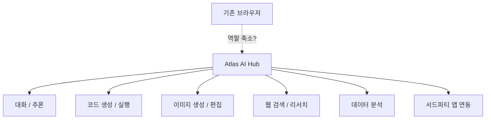
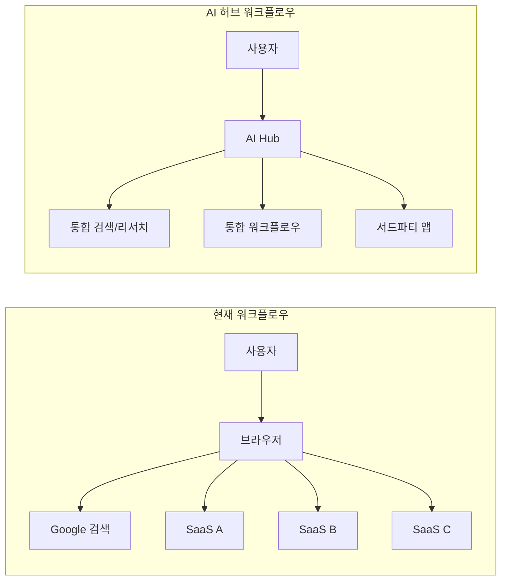

## 개요

OpenAI가 <strong>Atlas</strong>라는 코드명의 통합 AI 앱 허브를 개발 중이라는 소식이 전해지면서, 기술 업계에서 뜨거운 논의가 이어지고 있습니다. Dan Shipper를 비롯한 AI 분석가들이 주목하는 핵심 질문은 하나입니다 — <strong>AI 네이티브 플랫폼이 웹 브라우저의 역할을 근본적으로 바꿀 것인가?</strong>

이 글에서는 Atlas의 컨셉, AI 앱 허브가 등장하는 배경, 그리고 브라우저가 맞이할 수 있는 변화를 분석합니다.

## Atlas란 무엇인가?

OpenAI의 Atlas는 단순한 ChatGPT의 확장이 아닙니다. 기존에 분산되어 있던 AI 기능들 — 대화, 코드 생성, 이미지 생성, 데이터 분석, 웹 검색 — 을 <strong>하나의 통합 플랫폼</strong>으로 묶는 것이 핵심입니다.

핵심 특징을 정리하면:

- <strong>멀티모달 통합</strong>: 텍스트, 이미지, 코드, 데이터를 하나의 인터페이스에서 처리
- <strong>앱 생태계</strong>: GPTs와 플러그인을 넘어선 본격적인 앱 스토어 형태
- <strong>컨텍스트 연속성</strong>: 작업 간 문맥이 유지되는 통합 워크플로우
- <strong>에이전트 기반</strong>: 사용자 의도를 파악하고 자동으로 적절한 도구를 호출

## 왜 지금 AI 앱 허브인가?

### 1. 브라우저의 한계가 드러나고 있다

웹 브라우저는 1990년대에 설계된 <strong>문서 뷰어</strong>에서 출발했습니다. 탭, 북마크, 확장 프로그램을 추가하며 진화했지만, 근본적인 패러다임은 변하지 않았습니다.

| 측면 | 브라우저 패러다임 | AI 허브 패러다임 |
|------|-------------------|------------------|
| 상호작용 | URL 입력 → 페이지 렌더링 | 의도 표현 → 결과 생성 |
| 탐색 방식 | 수동 네비게이션 | 자동 정보 수집 및 종합 |
| 앱 연동 | 탭 간 수동 전환 | 통합 워크플로우 |
| 데이터 활용 | 사이트별 격리 | 크로스앱 컨텍스트 공유 |

### 2. AI 에이전트 시대의 도래

2025-2026년은 AI 에이전트가 본격적으로 실용화되는 시기입니다. Claude의 Computer Use, OpenAI의 Operator, Google의 Mariner 등 <strong>AI가 직접 컴퓨터를 조작</strong>하는 기술이 등장했습니다.

이런 환경에서 사용자가 브라우저를 열고 직접 검색하고 여러 사이트를 오가는 행위는 점점 비효율적으로 느껴지게 됩니다.

### 3. 슈퍼앱 트렌드의 AI 버전

아시아에서는 WeChat, Line, KakaoTalk 같은 <strong>슈퍼앱</strong>이 이미 브라우저의 역할을 일부 대체하고 있습니다. Atlas는 이 슈퍼앱 모델을 AI 네이티브로 재해석한 것으로 볼 수 있습니다.

## 브라우저는 정말 강등되는가?

결론부터 말하면, <strong>완전한 대체는 아니지만 역할의 변화는 불가피</strong>합니다.

### 브라우저가 여전히 강한 영역

- <strong>오픈 웹</strong>: 검열 없는 자유로운 정보 접근
- <strong>표준 기반 생태계</strong>: HTML/CSS/JS라는 보편적 표준
- <strong>개발자 도구</strong>: 웹 개발과 디버깅의 핵심 도구
- <strong>프라이버시</strong>: AI 허브에 모든 데이터를 맡기는 것에 대한 저항

### AI 허브가 잠식할 영역

- <strong>정보 검색</strong>: 이미 Google 검색 트래픽이 AI 답변으로 감소 중
- <strong>콘텐츠 소비</strong>: 요약, 번역, 분석이 결합된 새로운 소비 방식
- <strong>업무 자동화</strong>: 여러 SaaS를 오가며 하던 작업의 통합
- <strong>앱 발견</strong>: 앱 스토어처럼 AI 기반 도구를 발견하고 사용

## 개발자에게 주는 시사점

### 1. 플랫폼 전략의 재고

웹 기반 SaaS를 만드는 개발자라면, AI 허브 플랫폼에도 대응하는 전략이 필요합니다. MCP(Model Context Protocol) 같은 표준이 이미 AI 도구 연동의 인터페이스로 자리잡고 있습니다.

### 2. AI 네이티브 UX 설계

URL과 페이지 기반이 아닌, <strong>의도와 결과 기반</strong>의 UX를 고민해야 합니다. 사용자가 "이 데이터를 분석해줘"라고 하면 알아서 적절한 도구를 선택하고 결과를 제시하는 경험이 표준이 될 것입니다.

### 3. 데이터 포터빌리티

AI 허브 간의 경쟁이 심화되면, 사용자의 데이터와 워크플로우를 이동할 수 있는 <strong>포터빌리티(Portability)</strong>가 중요한 차별 요소가 됩니다.

## 경쟁 구도

Atlas는 OpenAI만의 전략이 아닙니다. 주요 플레이어의 움직임을 보면:

| 회사 | 제품/전략 | 특징 |
|------|-----------|------|
| OpenAI | Atlas | ChatGPT 기반 통합 허브 |
| Google | Gemini + Workspace | 기존 생산성 도구와의 깊은 통합 |
| Anthropic | Claude + MCP | 개방형 프로토콜 기반 도구 연동 |
| Apple | Apple Intelligence | 디바이스 네이티브 AI 통합 |
| Microsoft | Copilot | Windows + Office 생태계 통합 |

## 결론

OpenAI Atlas로 대표되는 AI 앱 허브의 등장은 <strong>브라우저의 종말</strong>이 아니라, <strong>컴퓨팅 인터페이스의 진화</strong>입니다.

마치 스마트폰이 PC를 대체하지 않았지만 주요 컴퓨팅 디바이스의 지위를 가져간 것처럼, AI 허브는 브라우저를 대체하지 않으면서도 <strong>일상적인 디지털 작업의 시작점</strong>이 될 가능성이 높습니다.

개발자로서 우리는 이 변화에 두 가지 관점을 가져야 합니다:

1. <strong>기회</strong>: AI 허브 생태계에서 새로운 앱과 서비스를 만들 수 있는 기회
2. <strong>경계</strong>: 특정 플랫폼에 종속되지 않도록 오픈 웹과 표준의 가치를 지키는 것

브라우저는 강등되는 것이 아니라, <strong>역할이 재정의</strong>되는 것입니다.

## 참고 자료

- [Dan Shipper on X — OpenAI Atlas 분석](https://x.com/danshipper/status/2021615258540879936)
- [OpenAI 공식 블로그](https://openai.com/blog)
- [MCP (Model Context Protocol) 사양](https://modelcontextprotocol.io)
