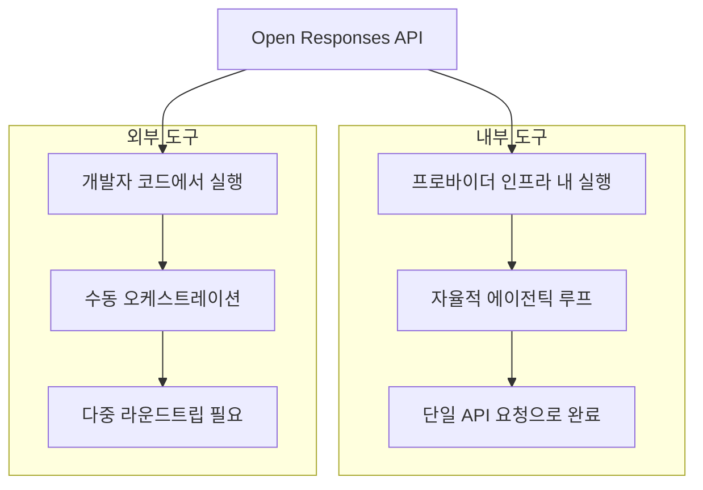
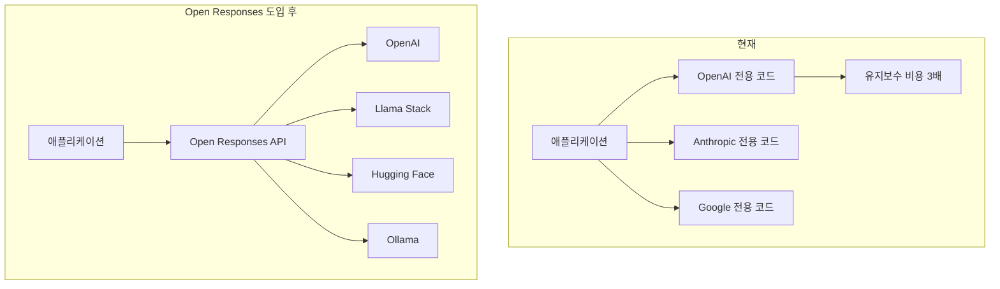

## 왜 지금 에이전틱 AI에 "표준"이 필요한가

2026년 3월 현재, 에이전틱 AI 생태계는 폭발적으로 성장하고 있습니다. Anthropic의 Claude Agent SDK([Anthropic Agent Skills 표준: AI 에이전트 역량 확장](/ko/blog/ko/anthropic-agent-skills-standard) 참고), OpenAI의 AgentKit, Google의 Agent Development Kit, LangChain, CrewAI 등 수많은 프레임워크가 경쟁하면서 개발 팀에게 선택의 자유를 주었지만, 동시에 심각한 파편화 문제를 만들었습니다.

각 프레임워크마다 도구 호출 방식, 응답 형식, 에이전트 루프 처리 방법이 제각각이다 보니, 모델을 교체하거나 여러 모델을 병행 운용하려면 통합 코드를 처음부터 다시 작성해야 하는 상황이 반복되었습니다. 한 개발자의 표현을 빌리면, <strong>"래퍼를 위한 래퍼를 또 작성하는"</strong> 악순환이었습니다.

OpenAI가 2026년 2월에 공개한 <strong>Open Responses</strong> 스펙은 이 문제에 정면으로 도전합니다. 벤더 중립적인 오픈 사양으로, 에이전틱 AI 워크플로우를 표준화하여 프로바이더 간 전환 비용을 획기적으로 줄이겠다는 것입니다.

## Open Responses 핵심 개념 3가지

Open Responses 스펙은 세 가지 핵심 개념을 정의합니다.

### 1. Items — 에이전트 상호작용의 원자 단위

Items는 모델 입력, 출력, 도구 호출, 추론 상태를 표현하는 원자 단위입니다. 기존 Chat Completions API의 `messages` 배열이 단순히 텍스트 교환만 표현했다면, Items는 에이전틱 워크플로우의 모든 단계를 타입 안전하게 표현합니다.

```typescript
// Items 타입 예시
type Item =
  | { type: "message"; role: "user" | "assistant"; content: string }
  | { type: "function_call"; name: string; arguments: string; call_id: string }
  | { type: "function_call_output"; call_id: string; output: string }
  | { type: "reasoning"; content: string };  // 추론 과정 공개
```

<strong>핵심 차이점</strong>: `function_call`, `function_call_output`, `reasoning` 타입이 추가되어 에이전트의 도구 사용과 사고 과정을 구조적으로 추적할 수 있습니다.

### 2. Reasoning Visibility — 모델 사고 과정의 가시화

Open Responses는 모델의 추론 과정을 프로바이더가 제어하는 방식으로 공개합니다. 이전에는 각 프로바이더가 독자적인 방식(OpenAI의 `reasoning_content`, Anthropic의 `thinking` 블록 등)으로 추론 과정을 노출했지만, Open Responses는 이를 통일된 `reasoning` Item 타입으로 표준화합니다.

```json
{
  "type": "reasoning",
  "content": "사용자가 재고 데이터를 요청했으므로, 먼저 inventory API를 호출하고 결과를 분석한 후 요약을 제공하겠습니다.",
  "provider_metadata": {
    "visibility": "full"
  }
}
```

이는 프로덕션 환경에서 에이전트의 의사결정 과정을 디버깅하고 감사(audit)하는 데 핵심적입니다.

### 3. Tool Execution Models — 내부 vs 외부 도구 실행

Open Responses는 도구 실행을 두 가지 모델로 명확히 구분합니다.



<strong>내부 도구(Internal Tools)</strong>: 프로바이더 인프라 내에서 실행됩니다. 모델이 자율적으로 추론→도구 호출→결과 반영→재추론 사이클을 반복하며, 최종 결과만 하나의 API 응답으로 반환합니다. 여러 번의 라운드트립 없이 복잡한 에이전틱 워크플로우를 처리할 수 있습니다.

<strong>외부 도구(External Tools)</strong>: 개발자의 애플리케이션 코드에서 실행됩니다. 모델이 도구 호출을 요청하면 개발자 측에서 직접 실행하고 결과를 다시 전달하는 방식입니다. 보안이 중요한 작업이나 프로바이더에 위임할 수 없는 작업에 적합합니다.

## 지원 생태계: 이미 움직이고 있다

Open Responses의 가장 큰 강점은 출시와 동시에 확보한 광범위한 생태계 지원입니다.

| 파트너 | 유형 | 의미 |
|--------|------|------|
| Hugging Face | 오픈소스 허브 | 수천 개 모델에 대한 표준 API 접근 |
| OpenRouter | 모델 라우터 | 다중 프로바이더 간 원활한 전환 |
| [Vercel](/ko/blog/ko/vercel-ai-sdk-claude-streaming-agent-2026) | 프론트엔드 플랫폼 | AI SDK 통합으로 프론트엔드 개발 표준화 |
| LM Studio | 로컬 추론 | 로컬 모델에서도 동일한 API 사용 |
| Ollama | 로컬 추론 | 자체 호스팅 환경에서의 표준화 |
| vLLM | 추론 엔진 | 고성능 추론 서버와의 호환 |
| Red Hat / Llama Stack | 엔터프라이즈 | Llama 모델 기반 엔터프라이즈 에이전트 구축 |

<strong>주목할 점</strong>: 이 목록에는 OpenAI의 직접 경쟁자(Hugging Face, Ollama, vLLM)가 포함되어 있습니다. 이는 Open Responses가 OpenAI 전용 스펙이 아니라 진정한 업계 표준을 지향한다는 강력한 신호입니다.

## 실전 구현 패턴

### 기본 API 호출

기존 Chat Completions에서 Responses API로의 전환은 직관적입니다.

```python
# 기존: Chat Completions API
response = client.chat.completions.create(
    model="gpt-4o",
    messages=[
        {"role": "user", "content": "재고 현황을 분석해주세요"}
    ],
    tools=[inventory_tool],
)

# 신규: Open Responses API
response = client.responses.create(
    model="gpt-4o",
    input="재고 현황을 분석해주세요",
    tools=[inventory_tool],
)
# response.output_text에 최종 결과 (도구 호출 + 분석 완료 후)
```

<strong>핵심 차이</strong>: Chat Completions에서는 도구 호출이 발생하면 개발자가 직접 도구를 실행하고 결과를 다시 보내는 루프를 구현해야 했지만, Responses API는 내부 도구의 경우 이 전체 사이클을 자동으로 처리합니다.

### 도구 접근 제어 패턴

Red Hat의 Llama Stack 구현에서 보여준 도구 접근 제어 패턴은 프로덕션에서 특히 유용합니다.

```python
# 상태별 도구 접근 제어
tool_config = {
    "skip_all_tools": False,        # 모든 도구 비활성화
    "skip_mcp_servers_only": False,  # MCP 서버만 비활성화
    "allowed_tools": ["search", "calculator"],  # 특정 도구만 허용
}

response = client.responses.create(
    model=model,
    input=messages,
    tools=tools_to_use,
    **tool_config,
)
```

### 보안: 요청별 헤더 격리

```python
# MCP 서버에 사용자별 인증 정보를 전달하되,
# 에이전트 자체에는 사용자 정보를 노출하지 않음
mcp_config = {
    "server_url": "https://api.internal/mcp",
    "headers": {
        "AUTHORITATIVE_USER_ID": current_user.id,
        "Authorization": f"Bearer {user_token}",
    }
}
```

이 패턴은 에이전트가 오작동하더라도 다른 사용자의 데이터에 접근할 수 없도록 보장합니다.

## EM/CTO 관점: 왜 이것이 중요한가

### 1. 벤더 락인 탈출 — 멀티모델 전략의 현실화

현재 많은 엔지니어링 팀이 "GPT-4o로 시작했다가 Claude로 바꾸고 싶은데, 통합 코드를 전부 재작성해야 한다"는 문제를 겪고 있습니다. Open Responses는 이 문제를 근본적으로 해결합니다.



<strong>비용 절감 효과</strong>: 프로바이더별 통합 코드를 하나의 표준 인터페이스로 통합하면, 통합 레이어의 유지보수 비용을 60〜80% 줄일 수 있습니다.

### 2. 점진적 마이그레이션 전략

Open Responses 도입은 빅뱅 전환이 아닌 점진적 마이그레이션이 가능합니다.

<strong>Phase 1 (1〜2주)</strong>: 신규 기능에만 Responses API 적용
- 기존 Chat Completions 코드는 그대로 유지
- 새로운 에이전틱 기능만 Responses API로 개발

<strong>Phase 2 (1〜2개월)</strong>: 핵심 워크플로우 전환
- 도구 호출이 빈번한 워크플로우부터 순차적으로 전환
- 성능 벤치마크 비교 (라운드트립 횟수, 응답 시간)

<strong>Phase 3 (분기)</strong>: 멀티 프로바이더 활성화
- OpenRouter나 자체 프록시를 통해 프로바이더 자동 전환 로직 구현
- 비용, 성능, 가용성 기반의 동적 라우팅

### 3. 옵저버빌리티와 거버넌스

Reasoning Visibility는 단순한 디버깅 도구가 아니라 <strong>AI 거버넌스의 핵심 인프라</strong>입니다.

- <strong>감사 추적</strong>: 에이전트가 왜 특정 결정을 내렸는지 구조적으로 기록
- <strong>규정 준수</strong>: 금융, 의료 등 규제 산업에서 AI 의사결정 과정의 투명성 확보
- <strong>품질 보증</strong>: 추론 과정을 분석하여 에이전트의 판단 품질을 정량적으로 평가

## Chat Completions vs Responses API 비교

| 항목 | Chat Completions | Responses API |
|------|------------------|---------------|
| 도구 호출 처리 | 개발자가 루프 구현 | 내부 도구는 자동 처리 |
| 추론 가시성 | 프로바이더별 상이 | 표준화된 `reasoning` 타입 |
| 멀티모달 | 별도 설정 필요 | 네이티브 지원 |
| 스트리밍 | 텍스트 기반 | 이벤트 기반 스트리밍 |
| 프로바이더 전환 | 코드 재작성 필요 | 엔드포인트만 변경 |
| 에이전틱 루프 | 수동 구현 | 프레임워크 내장 |

<strong>OpenAI의 공식 입장</strong>: Chat Completions API는 계속 지원되지만, 모든 신규 프로젝트에는 Responses API를 권장합니다.

## 남은 과제와 현실적 고려사항

### Anthropic과 Google은?

현재 Open Responses 스펙에 Anthropic과 Google은 공식 파트너로 참여하지 않았습니다. OpenRouter의 오픈소스 모델 지배 흐름과 멀티 프로바이더 전략에 대해서는 [OpenRouter 주간 TOP5 중 4개가 오픈소스 — 프로프라 모델 시대의 종말](/ko/blog/ko/openrouter-oss-dominance)을 참고하세요. 이 두 회사가 각각의 에이전트 프레임워크(Claude Agent SDK, Google ADK)를 보유하고 있어, Open Responses를 수용할지 독자 표준을 밀고 갈지는 아직 불확실합니다.

다만, OpenAI와 Anthropic 직원 30명 이상이 최근 공동으로 국방부 소송에서 협력한 사례에서 보듯, AI 업계의 협력 관계는 경쟁 관계와 공존하고 있습니다. 표준화에 대한 업계의 필요성이 커지면 합류할 가능성은 충분합니다.

### 프로덕션 준비 수준

Open Responses는 아직 초기 단계입니다. 스펙 문서, 스키마, 적합성 테스트 도구가 [openresponses.org](https://openresponses.org)에 공개되어 있지만, 프로덕션 환경에서의 대규모 검증 사례는 아직 제한적입니다. 얼리 어답터 팀은 신규 프로젝트에 먼저 적용하면서 안정성을 검증하는 것이 현실적입니다.

## 결론: 엔지니어링 리더를 위한 액션 아이템

Open Responses 스펙의 등장은 에이전틱 AI 생태계가 "프레임워크 난립기"에서 "표준화기"로 전환하고 있음을 보여줍니다. 이는 HTTP가 웹을 통일한 것처럼, 에이전틱 AI 워크플로우에 공통 언어를 제공하려는 시도입니다.

엔지니어링 리더로서 지금 해야 할 것:

1. <strong>스펙 검토</strong>: [openresponses.org](https://openresponses.org)에서 스펙 문서를 확인하고, 현재 팀의 에이전틱 워크플로우와의 호환성을 평가
2. <strong>파일럿 프로젝트</strong>: 신규 에이전틱 기능 하나를 Responses API로 구현해보고, 기존 Chat Completions 기반과 개발 생산성 비교
3. <strong>멀티 프로바이더 전략 수립</strong>: OpenRouter, Llama Stack 등을 활용하여 프로바이더 전환 비용을 최소화하는 아키텍처 검토
4. <strong>팀 역량 강화</strong>: 에이전틱 AI 개발이 단순 API 호출에서 워크플로우 설계로 진화하고 있으므로, 팀의 에이전트 설계 역량 강화에 투자

에이전틱 AI의 표준화는 이제 시작일 뿐입니다. 이 흐름에 일찍 올라타는 팀이 경쟁 우위를 확보할 것입니다.

## 참고 자료

- [Open Responses Specification — openresponses.org](https://openresponses.org)
- [InfoQ: Open Responses Specification Enables Unified Agentic LLM Workflows](https://www.infoq.com/news/2026/02/openai-open-responses/)
- [Red Hat: Automate AI agents with the Responses API in Llama Stack](https://developers.redhat.com/articles/2026/03/09/automate-ai-agents-responses-api-llama-stack)
- [OpenAI: Migrate to the Responses API](https://developers.openai.com/api/docs/guides/migrate-to-responses/)
- [OpenAI: New tools for building agents](https://openai.com/index/new-tools-for-building-agents/)
