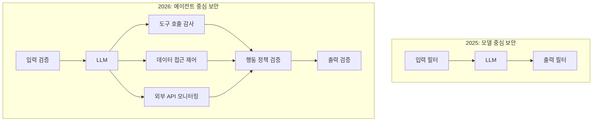
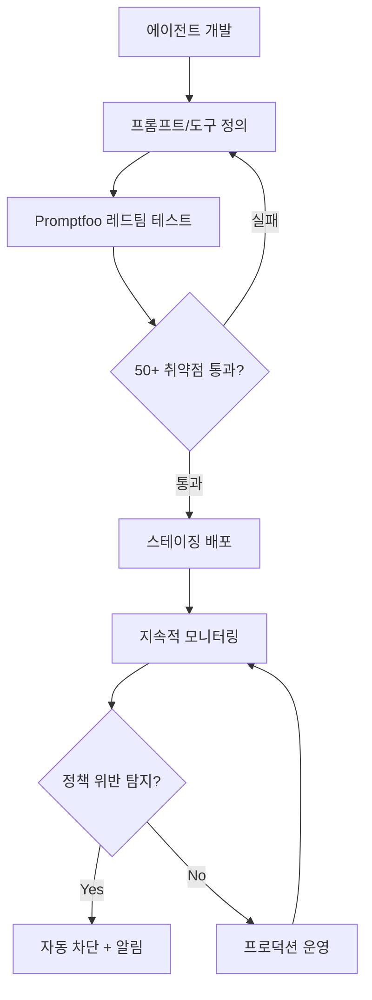
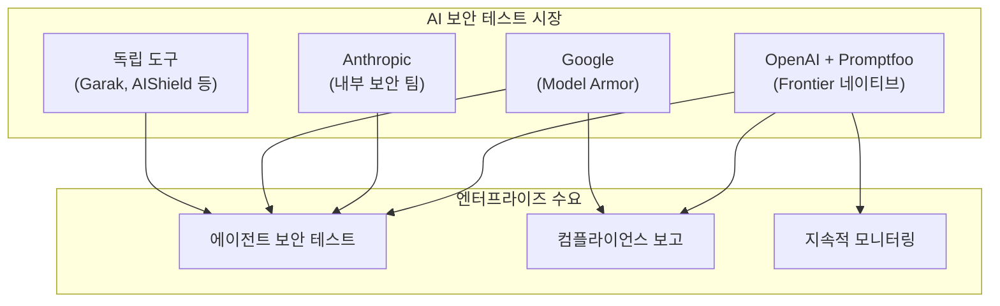

2026년 3월 9일, OpenAI가 AI 보안 테스트 플랫폼 Promptfoo의 인수를 발표했다. Fortune 500 기업의 25% 이상이 사용하고, 35만 명의 개발자 커뮤니티를 보유한 이 오픈소스 도구가 OpenAI의 엔터프라이즈 플랫폼 Frontier에 통합된다. 이 인수는 단순한 기업 인수를 넘어 <strong>"AI 에이전트에도 보안 파이프라인이 필수"</strong>라는 업계의 합의가 형성되었음을 보여준다.

## Promptfoo는 무엇인가

Promptfoo는 Ian Webster와 Michael D'Angelo가 2024년에 설립한 AI 보안 플랫폼이다. 처음에는 단순한 프롬프트 평가 도구로 시작했지만, 현재는 AI 시스템 전반의 레드팀 테스트와 취약점 스캐닝을 수행하는 종합 보안 프레임워크로 진화했다.

### 핵심 기능

```yaml
# Promptfoo의 주요 기능 영역
Red Teaming:
  - 50+ 취약점 유형 자동 테스트
  - 동적 공격 생성 (정적 탈옥 시도가 아닌 ML 기반)
  - 비즈니스 로직 이해 기반 맞춤형 테스트

Vulnerability Scanning:
  - 프롬프트 인젝션
  - 가드레일 우회
  - 데이터 유출
  - SSRF 공격
  - 민감 정보 노출
  - BOLA 취약점

Enterprise:
  - CI/CD 파이프라인 통합
  - SSO / 감사 로그
  - 프로덕션 지속 모니터링
  - 온프레미스 배포 지원
  - NIST AI 위험 관리 프레임워크 지원
```

특히 주목할 점은 Promptfoo의 레드팀 접근 방식이다. 기존의 정적 탈옥(jailbreak) 목록을 돌려쓰는 것이 아니라, <strong>최신 ML 기법으로 훈련된 에이전트가 대상 애플리케이션에 맞춤화된 동적 공격을 생성</strong>한다. 이는 실제 공격자의 행동을 훨씬 더 정확하게 시뮬레이션한다.

## 왜 이 인수가 중요한가

### 1. AI 에이전트 보안의 패러다임 전환

2025년까지 AI 보안은 대부분 "모델 안전성"에 초점을 맞췄다. RLHF로 모델을 정렬하고, 출력 필터를 달고, 가드레일을 설정하는 방식이었다. 하지만 2026년의 AI 에이전트는 <strong>도구를 호출하고, 데이터에 접근하고, 외부 시스템과 상호작용</strong>한다. [공격 표면](/ko/blog/ko/ai-coding-secrets-sprawl-mcp-config-security)이 완전히 달라졌다.



### 2. Fortune 500의 25%가 이미 사용 중

Promptfoo를 단순한 스타트업 인수로 보기 어려운 이유는 이미 <strong>Fortune 500의 25%(약 127개 기업)</strong>가 AI 개발 라이프사이클에서 이 도구를 사용하고 있기 때문이다. 이는 OpenAI가 엔터프라이즈 시장에서의 입지를 강화하는 전략적 움직임이다.

### 3. Frontier 플랫폼과의 통합

OpenAI의 엔터프라이즈 플랫폼 Frontier는 기업이 AI 코워커(coworker)를 구축하고 운영하는 데 사용된다. Promptfoo의 보안 테스트 기능이 Frontier에 네이티브로 통합되면:

- <strong>개발 → 보안 테스트 → 배포</strong>가 하나의 파이프라인에서 완성
- 에이전트 배포 전 자동 레드팀 테스트
- 프로덕션 환경의 지속적 보안 모니터링
- 정책 위반 행동 실시간 탐지

## AI 에이전트 DevSecOps 파이프라인

이 인수를 계기로, AI 에이전트 개발에도 전통적 소프트웨어의 DevSecOps와 유사한 파이프라인이 확립되고 있다.



### 기존 DevSecOps와의 비교

| 영역 | 전통 DevSecOps | AI 에이전트 DevSecOps |
|------|-------------|-------------------|
| 코드 스캔 | SAST/DAST | 프롬프트 인젝션 스캔 |
| 취약점 테스트 | 펜테스트 | AI 레드팀 테스트 |
| 접근 제어 | RBAC/ABAC | 도구 호출 권한 정책 |
| 지속적 모니터링 | WAF/IDS | 행동 정책 모니터링 |
| 컴플라이언스 | SOC2/ISO27001 | NIST AI RMF |
| 사고 대응 | SIEM 알림 | 에이전트 자동 차단 |

## EM/CTO가 지금 준비해야 할 것

### 1. AI 보안 테스트를 CI/CD에 포함하라

Promptfoo는 이미 CI/CD 통합을 지원한다. AI 에이전트를 배포하는 팀이라면 지금 당장 도입할 수 있다.

```yaml
# .github/workflows/ai-security-test.yml
name: AI Agent Security Test
on:
  pull_request:
    paths:
      - 'agents/**'
      - 'prompts/**'

jobs:
  security-test:
    runs-on: ubuntu-latest
    steps:
      - uses: actions/checkout@v4

      - name: Install Promptfoo
        run: npm install -g promptfoo

      - name: Run Red Team Tests
        run: |
          promptfoo redteam run \
            --config agents/config.yaml \
            --output results/security-report.json

      - name: Check Results
        run: |
          promptfoo redteam report \
            --input results/security-report.json \
            --fail-on-vulnerability
```

### 2. 에이전트 행동 정책을 문서화하라

에이전트가 어떤 도구를 호출할 수 있는지, 어떤 데이터에 접근할 수 있는지, 어떤 행동이 금지되는지를 명시적으로 정의해야 한다.

```yaml
# agent-policy.yaml
agent: customer-support-bot
version: "1.0"

allowed_tools:
  - knowledge_base_search
  - ticket_create
  - ticket_update

forbidden_actions:
  - 고객 개인정보 외부 전송
  - 환불 금액 $500 초과 승인
  - 내부 시스템 관리자 권한 사용

data_access:
  allowed:
    - customer_tickets
    - product_catalog
  denied:
    - employee_records
    - financial_reports

escalation_triggers:
  - 법적 분쟁 관련 요청
  - 개인정보 삭제 요청
  - 보안 사고 보고
```

### 3. 보안 테스트 기준을 수립하라

[NIST AI 위험 관리 프레임워크](/ko/blog/ko/nist-ai-agent-security-standards)를 기반으로, 팀에 맞는 보안 테스트 기준을 수립한다.

| 테스트 카테고리 | 최소 기준 | 권장 기준 |
|-------------|---------|---------|
| 프롬프트 인젝션 | 90% 차단율 | 99% 차단율 |
| 가드레일 우회 | 95% 차단율 | 99.5% 차단율 |
| 데이터 유출 방지 | 100% 차단 | 100% 차단 |
| 도구 남용 탐지 | 85% 탐지율 | 95% 탐지율 |
| 정책 위반 탐지 | 90% 탐지율 | 98% 탐지율 |

## 오픈소스 생태계에 미치는 영향

OpenAI는 Promptfoo의 오픈소스 프로젝트를 계속 유지하겠다고 밝혔다. 현재 13만 명의 월간 활성 사용자와 35만 명의 개발자가 멀티 프로바이더(GPT, Claude, Gemini, Llama 등)에서 Promptfoo를 사용하고 있다.

이는 두 가지 의미를 가진다:

1. <strong>보안 테스트의 민주화</strong>: 대기업뿐 아니라 스타트업과 개인 개발자도 AI 에이전트 보안 테스트를 수행할 수 있다
2. <strong>벤더 중립성 유지 여부</strong>: OpenAI 소유가 된 후에도 Claude, Gemini 등 경쟁 모델에 대한 지원이 계속될지 지켜봐야 한다

실제로 OpenAI가 인수한 오픈소스 프로젝트의 장기적 운명은 주목할 필요가 있다. 커뮤니티의 신뢰를 유지하면서 Frontier와의 차별화된 엔터프라이즈 기능을 제공하는 균형이 관건이다.

## 경쟁 구도 분석



이 인수로 OpenAI는 에이전트 보안 테스트 분야에서 가장 강력한 포지션을 확보했다. 다른 플레이어들이 어떻게 대응할지가 2026년 하반기 AI 보안 시장의 핵심 관전 포인트가 될 것이다.

## 결론: 에이전트 시대의 필수 인프라

이 인수는 명확한 메시지를 전달한다: <strong>AI 에이전트를 프로덕션에 배포하려면 보안 테스트는 선택이 아니라 필수</strong>다.

Engineering Manager나 CTO라면 다음 세 가지를 지금 시작하라:

1. <strong>현재 AI 에이전트의 공격 표면을 파악</strong>하라. 에이전트가 어떤 도구를 호출하고, 어떤 데이터에 접근하는지 인벤토리를 만들어라.
2. <strong>Promptfoo CLI를 팀에 도입</strong>하라. 오픈소스이므로 비용 없이 시작할 수 있다. `npx promptfoo@latest redteam init`으로 5분 만에 첫 레드팀 테스트를 실행할 수 있다.
3. <strong>에이전트 행동 정책을 코드로 관리</strong>하라. 사람이 읽을 수 있는 YAML 정책 파일을 작성하고, 이를 CI/CD에서 자동으로 검증하라.

AI 에이전트의 능력이 커질수록, 그 에이전트를 안전하게 운영하기 위한 인프라의 중요성도 함께 커진다. Promptfoo 인수는 이 인프라가 이제 업계 표준으로 자리잡고 있음을 보여주는 이정표다.

## 참고 자료

- [OpenAI Promptfoo 인수 공식 발표](https://openai.com/index/openai-to-acquire-promptfoo/)
- [TechCrunch: OpenAI acquires Promptfoo to secure its AI agents](https://techcrunch.com/2026/03/09/openai-acquires-promptfoo-to-secure-its-ai-agents/)
- [Promptfoo 공식 사이트](https://www.promptfoo.dev/)
- [Promptfoo GitHub 레포지토리](https://github.com/promptfoo/promptfoo)
- [NIST AI Risk Management Framework](https://www.nist.gov/artificial-intelligence/risk-management-framework)
