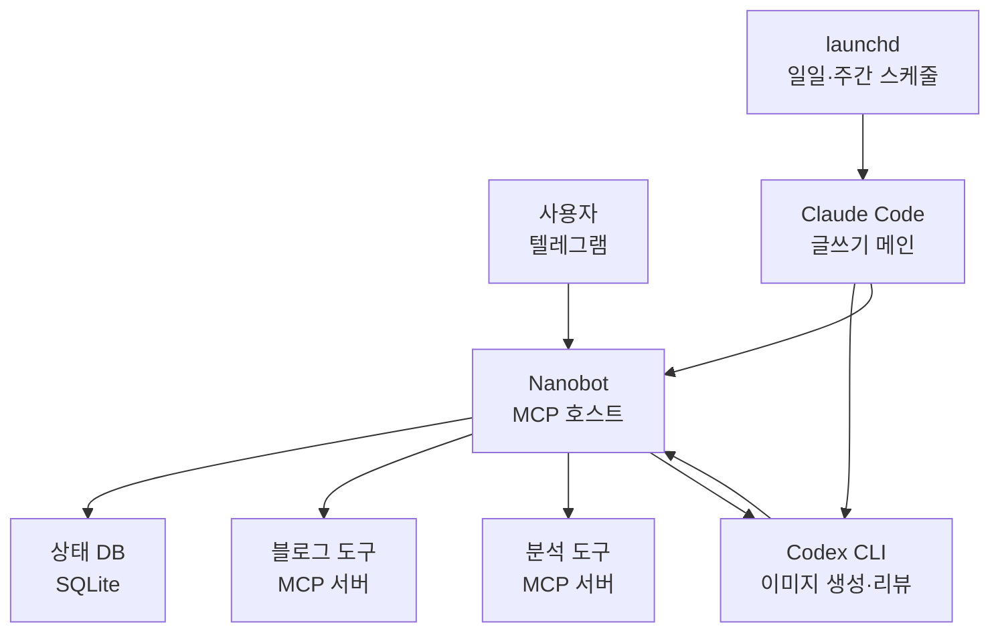

4월 4일 아침에 Anthropic 이메일을 받았다. Claude Pro 구독으로는 더 이상 OpenClaw 같은 서드파티 도구를 쓸 수 없다는 통보였다. 정확히는 "구독으로 발급된 OAuth 토큰을 외부 도구에서 쓰는 것을 금지한다"는 정책이었는데, OpenClaw 사용자 입장에선 사실상 같은 말이다([VentureBeat 보도](https://venturebeat.com/technology/anthropic-cuts-off-the-ability-to-use-claude-subscriptions-with-openclaw-and)).

2월에 OpenClaw용 Codex 마이그레이션 가이드까지 썼던 입장에서 좀 멍했다. 그 글은 "Claude/Gemini 약관이 흔들리니 Codex를 백업으로 깔아두자"는 톤이었는데, 두 달 만에 그 백업이 메인이 된 셈이다. 그리고 4월 24일에 GPT-5.5가 풀려나오면서([OpenAI 발표](https://openai.com/index/introducing-gpt-5-5/)) 판이 한 번 더 흔들렸다.

지금 내 자동화 스택은 이렇게 생겼다 — Claude + launchd가 메인 엔진, Codex가 무거운 작업(이미지 생성, 리뷰), Nanobot + Telegram이 상태 관리와 잡일. OpenClaw는 깨끗하게 빠졌다. 한 달간 세 번의 갈아타기를 거치면서 배운 것들을 정리해 두려고 한다.

## 첫 번째 도망 — launchd로 일단 살아남기

OAuth 차단 공지를 받고 가장 먼저 한 건 OpenClaw를 끄는 일이었다. 깔끔하게 끈 게 아니라, 거기 박혀 있던 cron 작업들을 어디로 옮길지 결정하는 게 더 큰 문제였다.

내 OpenClaw 설정에는 일일 블로그 발행, 일일 마감 점검, 주간 전략 리뷰까지 세 개의 스케줄러가 박혀 있었다. cron이 아니고 OpenClaw 자체 스케줄러였는데, 도구를 쓰지 못하니 이 스케줄도 같이 죽었다. 일주일 정도는 수동으로 돌렸다. 손이 너무 많이 가더라.

그래서 macOS launchd로 옮겼다. 이 선택은 두 가지 이유가 있었다 — 첫째, 별도 데몬이 없다. cron보다 더 OS-native한 게 launchd다. 둘째, OpenClaw 같은 외부 도구에 또 묶이고 싶지 않았다. 한 번 갈아탄 게 아쉬워서, 이번엔 가장 얇은 레이어를 골랐다.

```xml
<!-- ~/Library/LaunchAgents/net.jangwook.daily-post.plist -->
<plist version="1.0">
  <dict>
    <key>Label</key>
    <string>net.jangwook.daily-post</string>
    <key>ProgramArguments</key>
    <array>
      <string>/bin/zsh</string>
      <string>-lc</string>
      <string>cd /path/to/blog && claude code --command "/write-post-auto"</string>
    </array>
    <key>StartCalendarInterval</key>
    <dict>
      <key>Hour</key><integer>15</integer>
      <key>Minute</key><integer>23</integer>
    </dict>
  </dict>
</plist>
```

`launchctl load`로 등록하고, `launchctl list | grep jangwook`으로 살아 있는지 확인. 끝이다. 한 시간 만에 OpenClaw 스케줄러를 전부 launchd로 옮겼다. 의외로 잘 돌아갔다. 그리고 지금 이 글을 쓰는 시점까지 계속 돌고 있다 — 이게 이번 이사에서 유일하게 안 건드린 레이어다.

OpenClaw 같은 묶음 도구의 함정이 여기 있다. 멀티에이전트, 채널, 스케줄러를 다 한 통에 넣어주니까 처음엔 편하다. 그런데 그 통이 깨지면 안에 있던 멀쩡한 것들까지 같이 빠진다. 스케줄링은 launchd로도 충분했고, 어차피 충분했다면 처음부터 launchd로 했어야 했다는 생각을 그제야 했다.

처음에 launchd가 cron보다 까다롭다고 들어서 미뤘었는데, 막상 옮겨 보니 plist 한 파일이면 끝이라 별 거 아니었다. macOS 재부팅 후에도 자동으로 살아나는 점, 시스템 로그에 잘 잡히는 점은 cron보다 낫다. 한 가지 짜증나는 건 plist 갱신 후 `launchctl unload && load` 두 번 쳐야 한다는 거다. 그것 빼면 OpenClaw 스케줄러보다 디버깅하기 쉽다 — 적어도 어디 로그가 쌓이는지는 알 수 있으니까.

## Channels는 임시방편이었다, 그리고 그 임시방편은 너무 길어졌다

3월에 Anthropic이 Claude Code Channels를 발표했다. 텔레그램에서 메시지를 보내면 로컬 터미널의 Claude가 응답하는 기능인데, 마침 OpenClaw의 텔레그램 채널과 거의 같은 UX를 제공했다. 나는 이걸 임시 다리로 썼다 — "OpenClaw 없이도 텔레그램에서 Claude를 부를 수 있다면, OAuth 차단의 즉각적인 통증은 줄어든다"는 계산이었다.

실제로 잘 돌았다. 이동 중에 텔레그램으로 "오늘 분석 리포트 돌려줘"라고 보내면 집의 맥미니가 받아서 처리하고 결과를 텔레그램으로 다시 보낸다. 한 달 가까이 이렇게 썼다. [Channels 사용기](/ko/blog/ko/claude-code-channels-telegram-bridge)에 적어둔 그대로다.

문제는 Channels가 "메시지-응답" 모델이라는 점이다. 상태가 없다. "어제 밤에 시작한 백필 잡 어디까지 갔어?"라고 물으면, Channels는 그 백필 잡의 존재를 모른다. 매번 새 세션으로 들어가서 처음부터 묻는 셈이다. OpenClaw는 채널마다 컨텍스트를 유지해 줬는데 Channels는 그렇지 않다.

이게 한 달 동안 누적되니까 짜증이 쌓였다. 구체적으로 어떤 짜증이었냐면 — 새벽 2시에 백필 잡 진행률 보려고 텔레그램 보냈는데, Channels가 "어떤 백필 잡 말씀하시는 건가요?"라고 답하는 식이다. 다섯 번째 그 답을 받았을 때 노트북을 던질 뻔했다.

"텔레그램이라는 채널은 그대로 쓰되, 그 뒤에 상태 관리 레이어가 있어야 한다"는 결론이 명확해졌다. 상태가 없는 채널은 사람용 메신저지 자동화 인터페이스가 아니다. 이때 GPT-5.5 발표가 떴고, 그 김에 Codex를 별도로 계약했다.

## Codex 위에서 OpenClaw를 다시 깔아본 30분

GPT-5.5가 4월 24일에 풀렸을 때([OpenAI 발표](https://openai.com/index/introducing-gpt-5-5/)) 솔직히 좀 흥분했다. 내 OpenClaw 마이그레이션 가이드에서 적었던 "Codex 백업"이 진짜 메인이 되는 시나리오였다. 가격이 두 배로 올랐다는 건([apidog 분석](https://apidog.com/blog/gpt-5-5-pricing/) 입력 $5/M, 출력 $30/M) 좀 거슬렸지만, 토큰 효율이 올라갔다는 부분에서 어느 정도 상쇄됐다.

Codex 별도 계약을 끝내고, 가장 먼저 한 게 — 부끄럽게도 — OpenClaw를 다시 깔아보는 거였다. "어차피 Codex는 ToS 문제가 없으니까, OpenClaw에 Codex만 꽂아주면 옛날 워크플로 그대로 돌릴 수 있지 않을까?" 30분 만에 후회했다. 정확히 말하면, OpenClaw 자체는 잘 깔렸고 Codex 어댑터도 무리 없이 붙었다. 문제는 그 다음이었다.

OpenClaw가 무거운 이유는 모델 의존성이 아니다. 50개가 넘는 통합을 한 번에 들고 있다는 점, 자체 스케줄러, 자체 채널 매니저, 자체 노드 그래프 — 이걸 다 받쳐주는 런타임이 늘 깔려 있어야 한다. Codex만 호출하면 되는 일에 이 런타임을 다 켜놓는 게 너무 과했다. 맥미니에서 메모리 점유율 보면서 한숨 쉬다가 그날 밤에 다 지웠다.

이건 OpenClaw의 잘못이라기보다, 내가 OpenClaw를 잘못 쓰던 거였다. OpenClaw는 [채널 연동과 멀티에이전트 라우팅](https://docs.openclaw.ai/concepts/multi-agent)을 한 곳에서 오케스트레이션하는 도구다. 내가 거기서 실제로 쓰던 건 "Claude로 글 쓰기 + 텔레그램으로 결과 받기" 정도였다. 95%의 기능을 안 쓰면서 100%의 무게를 짊어지고 있었던 거다.

이걸 OpenClaw가 잘 만들어진 도구다, 라는 걸 부정하는 의미로 받아들이지 말아 줬으면 한다. 나는 여전히 [OpenClaw 설치 가이드](/ko/blog/ko/openclaw-installation-tutorial)에 적은 그 좋은 점들 — 멀티 모델, 채널 시스템, 노드 그래프 — 을 인정한다. 다만 그 좋은 점들이 내 작업에 필요 없었던 거다.

## Nanobot으로 갈아탄 후

Nanobot은 우연히 마주쳤다. Obot AI가 만든 [오픈소스 MCP 호스트](https://github.com/nanobot-ai/nanobot)인데 ([공식 소개](https://obot.ai/blog/introducing-nanobot-a-new-framework-for-turning-mcp-servers-into-ai-agents/)) Go로 짜여 있고, 알파 단계고, 코드가 작다. 정말 작다. README 따라 받아 보면 바이너리 하나에 YAML 한 장이 거의 전부다.

설정 파일은 이런 모양이다.

```yaml
# nanobot.yaml
agents:
  blog-ops:
    model: gpt-5.5
    instructions: |
      너는 jangwook.net 블로그 운영 비서다.
      텔레그램으로 들어오는 요청을 받아 적절한 MCP 도구를 호출한다.
    tools:
      - blog-publisher
      - analytics-reader
      - codex-handoff

mcpServers:
  blog-publisher:
    command: node
    args: [./scripts/mcp-blog-publisher.js]
  analytics-reader:
    command: python3
    args: [./scripts/mcp-ga.py]
  codex-handoff:
    command: bash
    args: [./scripts/codex-bridge.sh]
```

설치하고 한 시간 안에 텔레그램 봇과 연동했다. 정확히는 — 텔레그램에서 메시지가 오면 Nanobot이 받아서, MCP 도구 호출(블로그 발행 스크립트, 분석 스크립트 등)로 라우팅하고, 결과를 텔레그램에 다시 던지는 구조다. OpenClaw에서 하던 것과 결과적으로 같다. 다만 무게가 다르다.

Nanobot에서 내가 좋아하는 두 가지:

<strong>코드를 읽을 수 있다는 점</strong>이 첫째다. OpenClaw는 어느 시점부턴가 내가 따라가지 못할 만큼 커졌다. 어디서 뭐가 막혔는지 추적하려면 디스코드를 뒤지거나 GitHub Issue를 검색해야 했다. Nanobot은 main 브랜치 코드 전체를 30분 안에 훑을 수 있다. 이게 알파 단계 도구를 프로덕션에 쓸 때 의외로 중요한 안전망이 된다 — "안 되면 내가 직접 패치한다"는 옵션이 살아 있는 것과, 없는 것은 차이가 크다.

<strong>가볍다</strong>는 게 둘째다. 맥미니에서 백그라운드로 돌고 있어도 메모리를 거의 안 먹는다. Go 바이너리 하나라서 그런 것 같다. OpenClaw가 켜져 있으면 fan이 돌던 작업이, Nanobot에선 조용하다. 노트북 들고 카페 가도 배터리 걱정이 없다.

## 텔레그램은 상태창이고, Codex는 일꾼이다

지금 구조를 그림으로 그리면 이렇게 된다.



가운데서 두 세계를 잇는 게 Nanobot이다. 한쪽엔 launchd가 돌리는 정시 작업(Claude가 메인으로 글을 쓰고, Codex가 이미지·리뷰를 받음), 다른 한쪽엔 텔레그램으로 들어오는 즉석 요청. Nanobot은 둘 다 받아서 상태를 SQLite에 적고, 진행 상황을 텔레그램으로 다시 던진다.

여기서 텔레그램의 역할이 바뀌었다. Channels 시기엔 "명령창"이었다. 명령을 던지면 답이 오는 곳. 지금은 "상태창"이다. 어제 밤에 시작한 발행 잡이 어디까지 갔는지, 다음 스케줄까지 몇 시간 남았는지, 마지막 빌드가 성공했는지를 텔레그램에서 즉시 확인할 수 있다. 명령은 사실 거의 안 보낸다 — 정시 잡이 알아서 돌고, 나는 결과만 본다.

Codex의 역할도 명확해졌다. Claude가 글을 쓰고, 글이 끝나면 Codex가 두 가지 일을 받는다 — 히어로 이미지 생성과 코드 리뷰. GPT-5.5의 토큰 효율이 좋아졌다는 게 여기서 체감된다. 같은 리뷰 작업을 4.5에서 돌렸을 때보다 응답 속도가 눈에 띄게 빠르다. 정확한 벤치마크는 없다, 내 주관적인 체감이다.

가격 얘기는 좀 짚고 가야 한다. GPT-5.5는 입력 $5/M, 출력 $30/M으로 5.4 대비 정확히 두 배가 됐다. 이거 보고 처음엔 화가 좀 났다. 그런데 한 주 돌려보고 청구서를 까보니 5.4 시절과 거의 같았다. OpenAI가 "토큰을 적게 쓰면서 결과가 같다"고 한 게 마케팅 멘트만은 아니더라. 같은 코드 리뷰 작업에서 5.4가 평균 12k 토큰 정도 쓰던 게 5.5에선 6〜7k 수준으로 떨어졌다. 가격이 2배 올랐는데 토큰이 절반이 됐으니 실질 청구액은 비슷하다. 비싸진 건 맞지만 망한 가격은 아니다.

다만 이건 내 워크플로 기준이다. 만약 Codex를 IDE 안에서 코드 자동완성 용도로 쓴다면 토큰 사용량이 다르게 나올 거다. 코드 리뷰는 짧은 입력에 짧은 출력이라 토큰 효율 개선이 잘 먹히는 케이스다.

## Nanobot의 한계 — 솔직히

여기까지 읽으면 "Nanobot 짱"으로 들리겠지만 그렇지 않다. 한 달 가까이 쓰면서 명확해진 한계가 둘 있다.

<strong>첫째, 멀티에이전트가 없다</strong>. Nanobot은 본질적으로 MCP 호스트다 — LLM 한 개가 도구들을 호출하는 구조. "여러 에이전트가 서로 대화하면서 일을 분담"하는 패턴은 못 한다. OpenClaw는 이걸 노드 그래프로 잘 풀어냈다. 내 워크플로 중 90%는 "한 에이전트가 도구 여러 개"라서 Nanobot으로 충분하지만, 나머지 10%는 가끔 아쉽다.

<strong>둘째, UI가 없다시피 하다</strong>. localhost:8080에 채팅 UI가 뜨긴 하는데, OpenClaw의 통합 대시보드 같은 건 기대할 수 없다. 알파 단계라 그렇다. 텔레그램이 사실상 내 대시보드다. 이게 좋은 게 아니라, 다른 옵션이 없어서다. 누가 옆에서 "내 상태 좀 봐줘"라고 했을 때 보여줄 화면이 없다.

세 번째 한계는 좀 미묘한데 — <strong>Nanobot이 알파 단계라서 언제든 깨질 수 있다</strong>. GitHub의 [릴리즈 페이지](https://github.com/nanobot-ai/nanobot/releases)를 봐도 자주 변경된다. 한 번 0.x 버전 올렸다가 MCP 핸드셰이크 호환성이 깨져서 한 시간 디버깅한 적이 있다. 이건 알파 도구를 쓸 때 감수해야 할 부분이다, Nanobot의 잘못은 아니다.

## 그래서 OpenClaw는 끝났는가 — 아니다, 그냥 내가 안 맞았던 거다

이 글의 결론은 "Nanobot이 OpenClaw보다 낫다"가 아니다. 도구의 무게는 작업의 복잡도에 맞아야 한다는 얘기다. 내 작업이 Nanobot 사이즈였는데 OpenClaw를 쓰고 있었던 거고, 알아채는 데 두 달이 걸렸을 뿐이다.

OpenClaw가 적절한 경우는 분명히 있다. 내가 생각하는 기준은 이렇다 — 에이전트 간에 메시지를 주고받아야 하는 워크플로가 있고, 그 메시지의 형식이 자유 텍스트여야 하고, 그게 일회성이 아니라 반복적으로 돌아야 한다면 OpenClaw 같은 무거운 오케스트레이터가 답이다. 노드 그래프, 채널, 멀티에이전트 컨텍스트 — 이걸 직접 짜는 건 정말 큰 일이다.

내가 안 했던 건 "내 워크플로가 그 정도로 복잡한가?"라는 질문이었다. 답은 "아니오"였다. Claude가 글을 쓰고, Codex가 이미지를 그리고, 둘 다 결과를 SQLite에 적고, 텔레그램이 그걸 보여준다. 에이전트 간 대화 같은 건 없다. 메시지를 주고받을 일도 없다. 이런 워크플로엔 OpenClaw 런타임이 통째로 과잉이다.

그리고 한 가지 더 — Codex가 좋아진 게 이 결정에 큰 비중을 차지했다. GPT-5.4 시절이었다면 Nanobot처럼 "한 LLM에 도구 여러 개" 구조가 약했을 거다. 모델이 도구 선택을 자주 틀렸으니까. 5.5는 그 부분이 눈에 띄게 좋아졌다. 도구 호출 정확도가 올라가니까 멀티에이전트로 분리할 이유가 줄었다. 한 명이 똑똑하면 여러 명이 회의할 일이 줄어드는 거랑 같다.

한 가지 더 솔직하게 말하면 — 이 모든 이사가 OAuth 차단 한 방으로 시작된 거다. Anthropic이 그 정책을 안 발표했으면 나는 아직도 OpenClaw에 매여 있었을 거다. "잘 돌고 있는데 왜 바꾸지?"의 관성을 이기는 건 거의 외부 충격뿐이다. 이번 충격 덕에 내 자동화 스택이 더 가볍고 더 명확해졌다는 건 좀 아이러니하다. Anthropic 입장에선 보조금 회수가 목적이었지 사용자 워크플로 정리가 목적이 아니었을 텐데, 결과적으론 내게 도움이 됐다.

다음 달엔 Nanobot 코드를 한 번 깊게 읽어볼 생각이다. MCP 호스트가 어떻게 도구 호출 결과를 컨텍스트에 다시 끼우는지, 상태 관리는 어떻게 하는지. 알파 도구라서 더 흥미롭다 — 익으면 더 이상 들여다볼 필요가 없어지니까. 만약 내가 직접 패치를 보내야 할 일이 생기면 그 자체로 또 글감이 될 것 같다.
