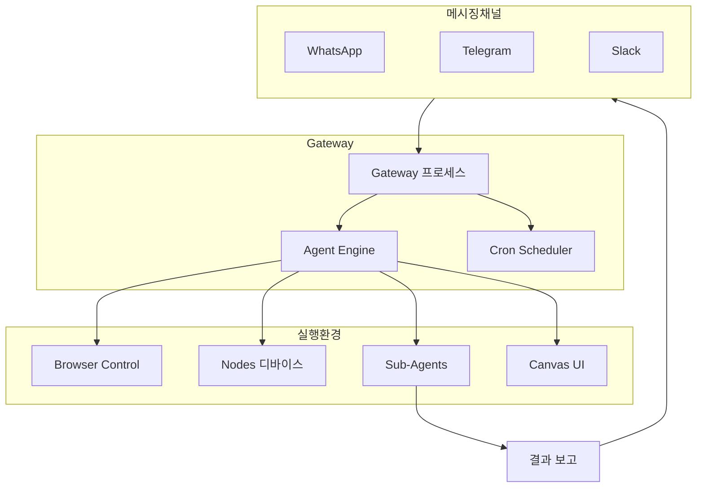
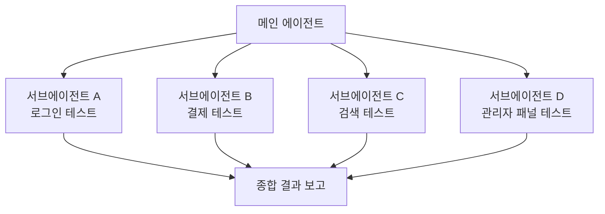
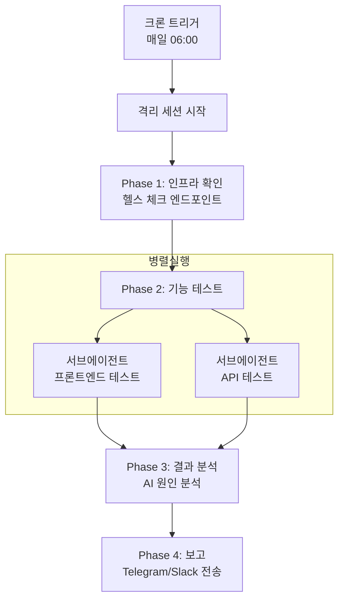

## 개요

Selenium, Cypress, Playwright 같은 전통적인 E2E 테스트 도구는 CSS 셀렉터와 명령형 코드로 테스트를 작성합니다. UI가 변경되면 셀렉터가 깨지고, 수십 개의 테스트 파일을 수정해야 합니다.

<strong>OpenClaw</strong>는 이 문제를 근본적으로 다른 방식으로 해결합니다. AI 에이전트가 접근성 트리(Accessibility Tree) 기반으로 웹 페이지를 이해하고, 자연어로 작성된 테스트 시나리오를 해석하여 실행합니다. 브라우저 자동화, 디바이스 관리, 크론 스케줄링, 멀티 에이전트 오케스트레이션을 하나의 플랫폼에서 통합 운용할 수 있습니다.

이 글에서는 OpenClaw의 핵심 기능을 E2E 테스트 관점에서 분석하고, 실제로 테스트 자동화 시스템을 구축하는 방법을 다룹니다.

## OpenClaw 아키텍처 이해

OpenClaw는 <strong>Gateway 중심 구조</strong>를 채택합니다. Gateway는 모든 메시징 채널과 WebSocket 제어 평면을 관리하는 단일 장기 실행 프로세스입니다.



E2E 테스트 관점에서 각 구성 요소의 역할은 다음과 같습니다:

| 구성 요소 | 역할 | 테스트에서의 용도 |
|----------|------|------------------|
| <strong>Gateway</strong> | 통합 제어 평면 | 테스트 인프라의 중앙 허브 |
| <strong>Browser</strong> | Chromium 기반 웹 자동화 | 웹 앱 기능·UI 테스트 |
| <strong>Nodes</strong> | 디바이스 제어 (macOS/iOS/Android) | 크로스 플랫폼 테스트 |
| <strong>Cron</strong> | 스케줄링 엔진 | 정기 테스트 실행 트리거 |
| <strong>Sub-agents</strong> | 병렬 에이전트 실행 | 테스트 스위트 병렬화 |
| <strong>Canvas</strong> | 시각적 작업 공간 | UI 회귀 테스트·결과 대시보드 |

## 브라우저 자동화: 접근성 트리 기반 테스트

### 스냅샷과 Ref 시스템

OpenClaw 브라우저 자동화의 핵심은 <strong>스냅샷 기반 상호작용</strong>입니다. CSS 셀렉터 대신 접근성 트리를 사용하므로, UI 구조가 변경되어도 의미적으로 동일한 요소를 찾아낼 수 있습니다.

```bash
# AI 스냅샷 생성 — 페이지 요소에 숫자 ref 할당
openclaw browser snapshot

# ref 기반 상호작용
openclaw browser click 12          # ref=12 요소 클릭
openclaw browser type 23 "hello"   # ref=23에 텍스트 입력

# 상호작용 가능 요소만 필터링
openclaw browser snapshot --interactive
openclaw browser click e12         # 역할 ref 기반 클릭
```

이 접근법의 장점은 <strong>셀프 힐링(Self-healing)</strong>입니다. 버튼의 클래스명이 `btn-primary`에서 `button-main`으로 바뀌더라도, 접근성 트리에서 "Submit" 역할의 버튼은 여전히 동일하게 식별됩니다.

### 로그인 플로우 테스트 예시

에이전트에게 자연어로 테스트 시나리오를 전달합니다:

```bash
openclaw agent --message "다음 순서로 로그인 플로우를 테스트하세요:
  1. https://myapp.com/login에 접속
  2. 이메일 필드에 test@example.com 입력
  3. 비밀번호 필드에 password123 입력
  4. 로그인 버튼 클릭
  5. 대시보드 URL로 리다이렉트되는지 확인
  6. 대시보드에 환영 메시지가 표시되는지 확인
  결과를 스크린샷과 함께 보고하세요."
```

에이전트는 내부적으로 다음과 같은 도구 호출을 실행합니다:

```bash
browser open https://myapp.com/login
browser snapshot --interactive
browser type <email-ref> "test@example.com"
browser type <password-ref> "password123"
browser click <submit-ref>
browser wait --url "**/dashboard" --timeout-ms 10000
browser snapshot
# → AI가 스냅샷을 분석하여 대시보드 요소 확인
```

### 상태 관리와 환경 설정

E2E 테스트에서 환경 설정은 필수입니다. OpenClaw는 풍부한 상태 관리 API를 제공합니다:

```bash
# 쿠키로 인증 세션 설정
openclaw browser cookies set session abc123 --url "https://myapp.com"

# 디바이스 에뮬레이션
openclaw browser set device "iPhone 14"

# 네트워크 상태 테스트
openclaw browser set offline on              # 오프라인 모드
openclaw browser set headers --json '{"X-Debug":"1"}'  # 커스텀 헤더

# 지역화 테스트
openclaw browser set geo 37.7749 -122.4194   # 샌프란시스코
openclaw browser set locale en-US
openclaw browser set timezone America/New_York
```

### 대기(Wait) 기능

비동기 UI 변화를 기다리는 다양한 전략을 지원합니다:

```bash
# 복합 조건 대기
openclaw browser wait "#main" \
  --url "**/dashboard" \
  --load networkidle \
  --fn "window.ready===true" \
  --timeout-ms 15000
```

텍스트, URL 패턴(glob), 네트워크 유휴 상태, JavaScript 조건, CSS 셀렉터를 조합하여 정교한 대기 로직을 구성할 수 있습니다.

### 리모트 브라우저 통합

CI/CD 환경에서는 Browserless 같은 리모트 브라우저를 연결할 수 있습니다:

```json5
{
  browser: {
    enabled: true,
    defaultProfile: "browserless",
    profiles: {
      browserless: {
        cdpUrl: "https://production-sfo.browserless.io?token=<API_KEY>",
      },
    },
  },
}
```

## 노드(Nodes): 크로스 플랫폼 디바이스 테스트

### 노드 유형과 기능

노드는 Gateway에 WebSocket으로 연결되는 컴패니언 디바이스입니다.

| 노드 유형 | 지원 기능 |
|----------|----------|
| <strong>macOS 앱</strong> | Canvas, Camera, Screen Recording, System Run |
| <strong>iOS 앱</strong> | Canvas, Camera, Location |
| <strong>Android 앱</strong> | Canvas, Camera, Chat, Location, SMS, Screen Recording |
| <strong>Headless</strong> | System Run, System Which |

### 멀티 노드 테스트 파이프라인

```bash
# 노드 A (서버): 테스트 환경 시작
openclaw nodes run --node "Server" -- docker compose up -d

# 노드 B (데스크톱): 브라우저 테스트 실행
openclaw browser open https://server-node:3000
openclaw browser snapshot

# 노드 C (모바일): 실제 디바이스 UI 캡처
openclaw nodes camera snap --node "iPhone" --facing front

# 노드 D (빌드 서버): 유닛 테스트 실행
openclaw nodes run --node "Build Node" -- npm test
```

### 물리적 디바이스 검증

카메라 기능을 활용하면 IoT 디바이스의 LED 상태 확인이나 물리적 UI 변화 검증 같은 작업도 가능합니다:

```bash
# 카메라로 실물 상태 캡처
openclaw nodes camera snap --node "IoT-Monitor" --facing back

# 화면 녹화로 UI 흐름 기록
openclaw nodes screen record --node "Android-Test" --duration 10s --fps 10
```

## 크론(Cron): 정기 테스트 스케줄링

### 스케줄 유형

| 유형 | 설명 | 예시 |
|------|------|------|
| `at` | 일회성 실행 | 배포 5분 후 스모크 테스트 |
| `every` | 고정 간격 | 매 30분 헬스 체크 |
| `cron` | 5필드 표현식 + 타임존 | 매일 07시 전체 테스트 |

### 패턴 1: 매일 아침 전체 E2E 테스트

```bash
openclaw cron add \
  --name "Daily E2E Suite" \
  --cron "0 6 * * *" \
  --tz "Asia/Tokyo" \
  --session isolated \
  --message "전체 E2E 테스트를 실행하세요:
    1. https://myapp.com 접속하여 로드 시간 확인
    2. 로그인 플로우 검증
    3. 핵심 비즈니스 로직 테스트
    4. API 응답 확인
    5. 결과를 스크린샷과 함께 요약 보고" \
  --model "anthropic/claude-sonnet-4-5" \
  --deliver \
  --channel telegram \
  --to "DevTeam"
```

핵심은 `--session isolated`입니다. 격리 세션에서 실행되므로 메인 에이전트의 컨텍스트를 오염시키지 않습니다.

### 패턴 2: 배포 후 스모크 테스트

```bash
openclaw cron add \
  --name "Post-Deploy Smoke" \
  --at "5m" \
  --session isolated \
  --message "배포 후 스모크 테스트:
    1. 헬스 체크 엔드포인트 응답 확인
    2. 메인 페이지 정상 로드 확인
    3. 로그인 가능 여부 확인" \
  --deliver \
  --channel slack \
  --to "channel:C_DEPLOYMENTS" \
  --delete-after-run
```

`--delete-after-run` 플래그로 일회성 실행 후 크론 작업이 자동 삭제됩니다.

### 패턴 3: 주간 심층 분석

```bash
openclaw cron add \
  --name "Weekly Deep Test" \
  --cron "0 2 * * 0" \
  --tz "Asia/Tokyo" \
  --session isolated \
  --message "주간 심층 E2E 테스트:
    1. 전체 사용자 플로우 검증
    2. 성능 메트릭 수집
    3. 접근성 검사
    4. 크로스 브라우저 호환성 확인
    5. 지난주 대비 변경사항 분석" \
  --model "anthropic/claude-opus-4-5" \
  --thinking high \
  --deliver
```

심층 분석에는 `claude-opus-4-5`와 `--thinking high` 옵션을 사용하여 더 깊은 추론을 수행합니다.

### 크론 vs 하트비트

| 기준 | 하트비트 | 크론 |
|------|---------|------|
| 정확한 타이밍 | △ (~30분 간격) | ○ (정확한 시간) |
| 세션 격리 | × (메인 세션) | ○ (isolated) |
| 모델 오버라이드 | × | ○ |
| 비용 효율 | ○ (배치 처리) | △ (작업당 비용) |

<strong>권장</strong>: 정기 E2E 테스트는 크론(isolated), 가벼운 상태 모니터링은 하트비트를 사용합니다.

## 서브에이전트를 활용한 테스트 오케스트레이션

### 병렬 테스트 실행

서브에이전트는 백그라운드에서 독립적으로 실행되는 에이전트입니다. 여러 테스트를 동시에 실행하고, 완료 시 결과를 자동으로 보고합니다.



동시성 제어 설정:

```json5
{
  agents: {
    defaults: {
      subagents: {
        maxConcurrent: 8,  // 최대 동시 실행 수
      },
    },
  },
}
```

### 단계별 검증 파이프라인

실전에서는 단순 병렬이 아니라 <strong>단계별 파이프라인</strong>이 필요합니다:



### 멀티 에이전트 환경 구성

에이전트별로 다른 환경을 타겟팅할 수 있습니다:

```json5
{
  agents: {
    list: [
      {
        id: "staging-tester",
        name: "Staging Tester",
        workspace: "~/.openclaw/workspace-staging",
        model: "anthropic/claude-sonnet-4-5",
      },
      {
        id: "prod-tester",
        name: "Production Tester",
        workspace: "~/.openclaw/workspace-prod",
        model: "anthropic/claude-opus-4-5",
      },
    ],
  },
  bindings: [
    { agentId: "staging-tester", match: { channel: "slack", peer: { kind: "channel", id: "C_STAGING" } } },
    { agentId: "prod-tester", match: { channel: "telegram" } },
  ],
}
```

## 캔버스(Canvas): UI 검증과 결과 대시보드

### 시각적 회귀 테스트

캔버스는 macOS 앱에 내장된 에이전트 제어 시각적 작업 공간입니다:

```bash
# 테스트 대상 URL 로드
openclaw nodes canvas present --node <id> --target https://myapp.com

# 현재 상태 캡처
openclaw nodes canvas snapshot --node <id> --format png --max-width 1200

# JavaScript로 DOM 검증
openclaw nodes canvas eval --node <id> --js "document.querySelectorAll('.error').length"
```

AI 에이전트가 캡처된 스냅샷을 분석하여 레이아웃 변경, 시각적 요소 누락, 색상 일관성 등을 검증합니다.

### 테스트 결과 대시보드

A2UI(Agent-to-UI) 프로토콜을 통해 실시간 테스트 대시보드를 구성할 수 있습니다:

```bash
cat > /tmp/test-dashboard.jsonl <<'EOF'
{"surfaceUpdate":{"surfaceId":"dashboard","components":[
  {"id":"root","component":{"Column":{"children":{"explicitList":["header","results"]}}}},
  {"id":"header","component":{"Text":{"text":{"literalString":"E2E Test Dashboard"},"usageHint":"h1"}}},
  {"id":"results","component":{"Text":{"text":{"literalString":"✅ 45 passed | ❌ 2 failed | ⏭ 3 skipped"},"usageHint":"body"}}}
]}}
{"beginRendering":{"surfaceId":"dashboard","root":"root"}}
EOF

openclaw nodes canvas a2ui push --jsonl /tmp/test-dashboard.jsonl --node <id>
```

캔버스에서 에이전트 실행을 트리거하여 대시보드에서 직접 테스트를 재실행하는 것도 가능합니다.

## 실전 활용 패턴

### SaaS 제품 매일 상태 검증

```bash
openclaw cron add \
  --name "SaaS Health Check" \
  --cron "0 7 * * *" \
  --tz "Asia/Tokyo" \
  --session isolated \
  --message "SaaS 상태 점검:
    1. 브라우저로 접속하여 로드 시간 확인
    2. 테스트 계정으로 로그인
    3. 대시보드 핵심 위젯 로드 확인
    4. API 헬스 체크 응답 확인
    5. 문제 발견 시 즉시 보고, 정상이면 간단한 요약
    결과는 스크린샷과 함께 보고하세요." \
  --deliver \
  --channel telegram
```

### 크로스 디바이스 테스트

```bash
# 에뮬레이션 기반 테스트
openclaw browser set device "iPhone 14"
openclaw browser open https://myapp.com
openclaw browser screenshot --full-page

openclaw browser set device "iPad Pro"
openclaw browser open https://myapp.com
openclaw browser screenshot --full-page

# 실제 iOS 디바이스 (노드)
openclaw nodes canvas present --node "iPhone" --target https://myapp.com
openclaw nodes canvas snapshot --node "iPhone" --format png
```

### 접근성 테스트

```bash
# 접근성 트리 스냅샷
openclaw browser snapshot --format aria

# AI 에이전트에게 접근성 분석 요청
openclaw agent --message "ARIA 스냅샷을 분석하여:
  1. WCAG 2.1 AA 기준 위반 사항 찾기
  2. 키보드 네비게이션 가능 여부 확인
  3. 스크린 리더 호환성 확인
  4. 개선 권장사항 제시"
```

### 성능 모니터링

```bash
openclaw cron add \
  --name "Performance Monitor" \
  --cron "*/15 * * * *" \
  --session isolated \
  --message "성능 측정:
    1. 브라우저 접속 후 로드 시간 측정
    2. 콘솔 에러 확인
    3. 네트워크 요청 지연 확인
    4. Core Web Vitals 관련 JS 평가 실행
    문제가 발견된 경우에만 보고하세요." \
  --model "anthropic/claude-sonnet-4-5"
```

## 한계점과 고려사항

### 기술적 한계

| 한계 | 설명 | 대안 |
|------|------|------|
| CSS 셀렉터 미지원 | 액션에서 직접 CSS 셀렉터 사용 불가 | 스냅샷 ref 기반 접근 |
| ref 불안정 | 페이지 네비게이션 시 ref 무효화 | 액션 전 스냅샷 재실행 |
| AI 비결정성 | 동일 테스트의 결과가 다를 수 있음 | 핵심 검증 포인트 명확히 지정 |
| 노드 포그라운드 요구 | camera/canvas는 앱이 포그라운드여야 함 | headless 노드 활용 |

### 비용 최적화

- 일상 테스트에는 `claude-sonnet-4-5` (저렴한 모델) 사용
- 심층 분석에만 `claude-opus-4-5` 사용
- 하트비트로 가벼운 체크를 배치 처리
- 서브에이전트 병렬 실행 시 `maxConcurrent` 적절히 설정

### 보안 고려사항

- 브라우저 프로파일에 로그인 세션이 포함될 수 있으므로 민감 정보로 취급
- `evaluate` 함수는 페이지 컨텍스트에서 임의 JS를 실행하므로 프롬프트 인젝션에 주의
- 원격 CDP 엔드포인트는 터널링으로 보호
- exec 도구의 보안 모드(`deny`/`allowlist`/`full`)를 적절히 설정

## 시작 가이드

```bash
# 1. Gateway 설치 및 설정
openclaw onboard --install-daemon

# 2. 브라우저 활성화
openclaw config set browser.enabled true

# 3. 첫 번째 스모크 테스트 크론 등록
openclaw cron add \
  --name "Smoke Test" \
  --cron "0 7 * * *" \
  --tz "Asia/Tokyo" \
  --session isolated \
  --message "https://myapp.com에 접속하여 메인 페이지가 정상 로드되는지 확인하세요." \
  --deliver

# 4. 노드 페어링 (디바이스 테스트가 필요한 경우)
openclaw nodes status
openclaw devices approve <requestId>

# 5. 테스트 스위트가 커지면 서브에이전트 병렬화
# 6. Telegram/Slack으로 보고 채널 설정
```

## 결론

OpenClaw를 E2E 테스트에 활용하는 핵심 장점은 다음과 같습니다:

1. <strong>자연어 기반 테스트 정의</strong> — 테스트 코드를 작성할 필요 없이 시나리오를 자연어로 기술
2. <strong>셀프 힐링</strong> — 접근성 트리 기반으로 UI 변경에 강한 내성
3. <strong>크로스 플랫폼</strong> — 웹, iOS, Android, 서버를 하나의 시스템으로 테스트
4. <strong>지능적 보고</strong> — AI가 결과를 분석하고 원인을 추론하여 보고
5. <strong>유연한 스케줄링</strong> — 크론 + 하트비트로 다양한 테스트 주기 지원

전통적인 테스트 도구를 완전히 대체하기보다는, <strong>스모크 테스트, 비주얼 회귀 테스트, 크로스 디바이스 검증</strong> 같은 시나리오에서 강점을 발휘합니다. 대량 반복 테스트나 복잡한 비즈니스 로직 검증에는 기존 도구와의 상호 보완이 적절합니다.

## 참고 자료

- [OpenClaw 공식 문서](https://docs.openclaw.ai)
- [Browser Tool 문서](https://docs.openclaw.ai/tools/browser)
- [Nodes 문서](https://docs.openclaw.ai/nodes)
- [Cron Jobs 문서](https://docs.openclaw.ai/automation/cron-jobs)
- [Sub-Agents 문서](https://docs.openclaw.ai/tools/subagents)
- [Canvas (macOS)](https://docs.openclaw.ai/platforms/mac/canvas)
