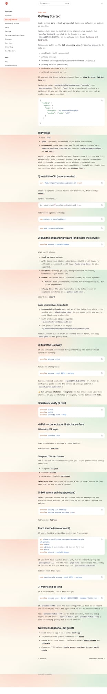
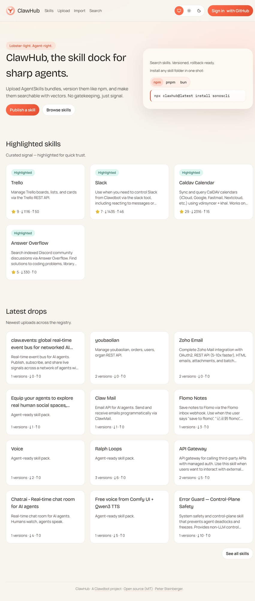

> **시리즈: OpenClaw 완전 정복** (2/3)
> 1. [소개편](/ko/blog/openclaw-introduction-guide/)
> 2. **튜토리얼편** ← 현재 글
> 3. [활용법편](/ko/blog/openclaw-advanced-usage/)

지난 글에서 OpenClaw이 무엇인지 살펴봤습니다. 이번에는 **직접 설치하고, 첫 대화를 나누는 것**까지 한 번에 해보겠습니다. 터미널을 열고 따라오세요! 🚀

---

## 1. 사전 준비

OpenClaw은 Node.js 런타임 위에서 동작합니다.

| 항목 | 요구사항 |
|------|----------|
| **Node.js** | v22 이상 (`node -v`로 확인) |
| **OS** | Windows · macOS · Linux 모두 지원 |

- **macOS / Linux** — 별도 준비 없이 바로 시작할 수 있습니다.
- **Windows** — 네이티브 환경에서도 동작합니다. WSL2도 지원되지만 필수는 아닙니다.

Node.js가 없다면 [공식 사이트](https://nodejs.org/)에서 LTS 버전(22+)을 받거나, 버전 관리자를 사용하세요:

```bash
# Volta (추천 — 프로젝트별 버전 관리)
curl https://get.volta.sh | bash
volta install node@22

# nvm
nvm install 22
nvm use 22

# fnm
fnm install 22
fnm use 22
```

### 선택 사항 (하지만 추천!)

- **Brave Search API 키** — 웹 검색 기능 사용 시 필요. [Brave Search API](https://brave.com/search/api/)에서 무료 발급
- **AI 모델 API 키** — Anthropic, OpenAI, Google 중 하나 이상. `ANTHROPIC_API_KEY` 또는 `OPENAI_API_KEY` 환경변수로 설정
- **Git** — 소스 빌드 시 필요

---

## 2. 설치 — 3가지 방법

취향에 맞는 방법을 하나 골라주세요.

### 방법 1: npm 글로벌 설치 (가장 추천) ⭐

```bash
npm install -g openclaw@latest
# 또는
pnpm add -g openclaw@latest
```

설치 확인:
```bash
openclaw --version
```

### 방법 2: 원클릭 스크립트 (빠르고 간편)

```bash
# macOS / Linux
curl -fsSL https://openclaw.ai/install.sh | bash
```

```powershell
# Windows (PowerShell)
iwr -useb https://openclaw.ai/install.ps1 | iex
```

스크립트가 의존성 확인부터 PATH 등록까지 전부 처리해 줍니다.

### 방법 3: 소스 빌드 (기여하고 싶은 개발자용)

```bash
git clone https://github.com/openclaw/openclaw.git
cd openclaw
pnpm install
pnpm ui:build    # 첫 실행 시 UI 의존성 자동 설치
pnpm build
openclaw onboard --install-daemon
```

> **Tip:** 소스 빌드는 기여(contribution)를 생각하고 있거나, 최신 기능을 미리 써보고 싶을 때 추천합니다. npm과 소스 빌드를 나중에 전환하는 것도 쉽습니다 — `openclaw doctor`가 Gateway 서비스 엔트리포인트를 자동 업데이트합니다.

---

## 3. 온보딩 마법사 — 핵심 설정 한번에

설치 후 첫 실행 시 온보딩 마법사가 핵심 설정을 안내합니다.

```bash
openclaw onboard --install-daemon
```



대화형 프롬프트를 따라가며 아래 항목들을 설정합니다:

| 설정 항목 | 설명 |
|---|---|
| **Gateway** | AI 에이전트가 상주하는 상시 실행 데몬 |
| **인증** | AI 모델 API 키 (Anthropic, OpenAI 등) |
| **채널** | Telegram, Discord 등 메시지 플랫폼 |
| **워크스페이스** | 에이전트의 파일 작업 공간 경로 |
| **Gateway 토큰** | 마법사가 기본으로 생성 (loopback에서도) |

`--install-daemon` 플래그를 붙이면 Gateway가 OS 서비스로 등록됩니다:
- **macOS**: launchd
- **Linux**: systemd 사용자 서비스
- **Windows**: Windows 서비스

재부팅 후에도 자동 실행되니 걱정하지 마세요.

### 마법사 없이 수동으로 설정하기

마법사 대신 직접 `~/.openclaw/openclaw.json`을 편집할 수도 있습니다:

```json5
{
  // AI 모델 설정
  "agents": {
    "defaults": {
      "workspace": "~/.openclaw/workspace",
      "models": {
        "default": "anthropic/claude-sonnet-4-20250514"
      }
    }
  },
  
  // 채널 설정
  "channels": {
    "telegram": {
      "botToken": "<BotFather 토큰>",
      "dmPolicy": "pairing"
    }
  },
  
  // 자동화 설정
  "cron": { "enabled": true },
  "hooks": {
    "enabled": true,
    "token": "<웹훅용_시크릿>"
  }
}
```

---

## 4. Telegram 봇 연동 — 가장 쉬운 채널

여러 채널 중 진입 장벽이 가장 낮은 **Telegram**으로 시작해 보겠습니다.


### 4-1. 봇 생성

1. Telegram에서 [@BotFather](https://t.me/BotFather)에게 `/newbot` 명령을 보냅니다.
2. 봇 이름과 username을 정하면 **API 토큰**이 발급됩니다.
3. 이 토큰을 복사해 두세요.

### 4-2. 설정 파일에 토큰 등록

온보딩 마법사에서 이미 등록했다면 건너뛰세요. 수동 설정:

```json5
{
  "channels": {
    "telegram": {
      "botToken": "7123456789:AAHx...",
      "dmPolicy": "pairing"
    }
  }
}
```

**`dmPolicy` 옵션 설명:**

| 정책 | 동작 |
|---|---|
| `pairing` | 페어링 승인 필요 (보안상 **강력 추천** ⭐) |
| `open` | 아무나 DM 가능 (테스트 용도) |
| `deny` | DM 차단 |

### 4-3. 페어링 승인

봇에게 처음 DM을 보내면 **페어링 요청**이 발생합니다. 터미널에서 승인:

```bash
# 대기 중인 페어링 목록 확인
openclaw pairing list

# 페어링 승인
openclaw pairing approve <요청ID>
```

또는 대시보드(`http://127.0.0.1:18789/`)에서 시각적으로 승인할 수도 있습니다.

### 4-4. Telegram 그룹에서도 사용하기

그룹에 봇을 초대하면 **멘션 기반**으로 동작합니다:

```json5
{
  "channels": {
    "telegram": {
      "botToken": "7123456789:AAHx...",
      "groups": {
        "*": { "requireMention": true }
      }
    }
  }
}
```

- `@봇이름 이 코드 뭐가 잘못된 거야?` → AI가 답변
- 일반 대화 → AI는 조용히 관찰

### 4-5. Telegram 고급 설정

```json5
{
  "channels": {
    "telegram": {
      "botToken": "7123456789:AAHx...",
      "dmPolicy": "pairing",
      "streaming": {
        "enabled": true,          // 실시간 응답 스트리밍
        "draftMode": true         // 타이핑 중 표시
      },
      "reactions": {
        "mode": "minimal"         // 이모지 반응 최소화
      },
      "topics": true              // 포럼 토픽 지원
    }
  }
}
```

---

## 5. Gateway 실행 및 확인

온보딩에서 데몬을 설치했다면 이미 실행 중일 수 있습니다.

### 서비스 관리

```bash
# 상태 확인
openclaw gateway status

# 시작/중지/재시작
openclaw gateway start
openclaw gateway stop
openclaw gateway restart
```

### 수동 실행 (디버깅용)

```bash
openclaw gateway --port 18789 --verbose
```

`--verbose` 플래그는 요청·응답 로그를 실시간으로 출력합니다.

### 원격 접속 (Tailscale)

집 밖에서도 Gateway에 접근하려면:

```bash
openclaw gateway --bind tailnet --token <토큰>
```

토큰은 비-로컬 바인딩 시 **필수**입니다.

### 상태 확인

```bash
# 전체 상태
openclaw status

# 환경 진단
openclaw doctor

# 헬스체크
openclaw health
```

브라우저에서 **http://127.0.0.1:18789/** 에 접속하면 대시보드를 통해 실행 상태, 채널 연결, 최근 대화 등을 시각적으로 확인할 수 있습니다.

---

## 6. 첫 대화 테스트 🎉

모든 준비가 끝났습니다. 이제 실제로 대화를 나눠 봅시다.

### Telegram에서 직접 대화

페어링이 완료된 계정으로 봇에게 아무 메시지나 보내 보세요. AI 에이전트가 응답하면 성공입니다! 🎊

### CLI로 테스트

```bash
# 텔레그램 특정 채팅으로 메시지 보내기
openclaw message send --target telegram:<채팅ID> --message "안녕, OpenClaw!"

# 대시보드에서도 테스트 가능
# http://127.0.0.1:18789/ 에서 WebChat 사용
```

### 슬래시 명령어

Telegram 채팅에서 바로 사용할 수 있는 기본 명령어들:

| 명령어 | 설명 |
|---|---|
| `/status` | Gateway 상태 확인 |
| `/model <모델>` | AI 모델 변경 |
| `/thinking <level>` | 사고 레벨 조정 (off/low/medium/high) |
| `/stop` | 현재 실행 중인 작업 중지 |
| `/subagents list` | 서브 에이전트 목록 조회 |
| `/activation always\|mention` | 그룹에서의 응답 방식 변경 |

---

## 7. 워크스페이스 설정 — 에이전트의 뇌 구성하기

동작하는 것을 확인했으니, 이제 **나에게 맞는 에이전트**로 다듬어 봅시다.

### 워크스페이스 파일 구조

```
~/.openclaw/workspace/
├── AGENTS.md        # 에이전트의 행동 규칙과 워크플로우
├── SOUL.md          # 페르소나, 성격, 말투 정의
├── USER.md          # 사용자(나)에 대한 정보
├── MEMORY.md        # 장기 기억 — 세션을 넘어 기억할 내용
├── HEARTBEAT.md     # 하트비트 때 자동 체크할 항목
├── TOOLS.md         # 도구 관련 로컬 노트 (카메라 이름, SSH 정보 등)
├── memory/          # 일별 메모리 로그
│   ├── 2025-07-12.md
│   └── 2025-07-13.md
└── skills/          # 커스텀 스킬 폴더
    └── my-skill/
        └── SKILL.md
```

### SOUL.md — 에이전트의 인격 정의

이 파일에 에이전트의 성격을 정의합니다:

```markdown
# SOUL.md

## 성격
- 친근하지만 프로페셔널한 톤
- 한국어로 대화 (기술 용어는 영어 그대로)
- 이모지 적당히 사용 😊
- 유머 감각 있게, 하지만 TMI는 피하기

## 이름
나는 "클로디" — OpenClaw 기반 개인 AI 비서

## 원칙
- 정확한 정보만 제공, 모르면 모른다고 솔직하게
- 코드는 항상 실행 가능한 완전한 형태로 제공
- 개인 정보는 철저히 보호
```

### USER.md — 사용자 정보

```markdown
# USER.md

## 기본 정보
- 이름: 김재현
- 직업: 소프트웨어 엔지니어
- 관심사: AI, 자동화, 개발 생산성
- 타임존: Asia/Tokyo (UTC+9)

## 선호 사항
- 응답은 간결하게
- 코드는 TypeScript 선호
- 일정 관리는 Google Calendar 사용
```

### HEARTBEAT.md — 자동 체크리스트

에이전트가 주기적으로 자동 확인할 항목을 정의합니다:

```markdown
# HEARTBEAT.md

## 정기 체크 (하트비트마다)
- [ ] 읽지 않은 이메일 중 긴급한 것 있으면 알려주기
- [ ] 2시간 내 캘린더 일정 있으면 미리 알림
- [ ] 날씨가 비 예보면 우산 챙기라고 알려주기
- [ ] GitHub 리포에 새 이슈/PR 있으면 요약

## 야간 (23:00-08:00)
- 긴급한 것만 알려주기, 나머지는 HEARTBEAT_OK
```

### 모델 변경

```bash
# CLI에서 기본 모델 변경
openclaw config set agents.defaults.models.default "anthropic/claude-opus-4-20250514"

# 또는 Telegram에서 슬래시 명령
/model opus
/model sonnet
/model gpt-4o
```

---

## 8. Skills 설치하기

ClawHub에서 커뮤니티 스킬을 설치해 보세요:



```bash
# CalDAV 캘린더 연동 스킬 설치
npx clawhub@latest install caldav-calendar

# Trello 보드 관리 스킬
npx clawhub@latest install trello

# 설치된 스킬 목록 확인
ls ~/.openclaw/workspace/skills/
```

설치된 스킬은 자동으로 인식됩니다. Gateway 재시작 없이 **핫 리로드**됩니다.

---

## 9. 트러블슈팅 — 문제 해결 가이드

### 자동 진단

```bash
# 환경 전체를 자동 진단
openclaw doctor

# 모든 컴포넌트 상태를 상세 출력
openclaw status --all
```

`openclaw doctor`는 Node.js 버전, 설정 파일 유효성, 채널 연결, API 키 상태 등을 한 번에 점검합니다.

### 자주 겪는 문제와 해결법

| 증상 | 원인 | 해결 |
|---|---|---|
| Gateway 시작 안 됨 | 포트 충돌 | `netstat -ano \| findstr 18789` (Windows) / `lsof -i :18789` (macOS/Linux) |
| Telegram 봇 무응답 | 토큰 오류 또는 페어링 미완 | `openclaw doctor`로 확인, `openclaw pairing list`로 승인 상태 체크 |
| API 키 오류 | 키 만료 또는 잔액 부족 | `openclaw doctor`로 키 상태 점검, 모델 제공자 대시보드에서 확인 |
| "Node version" 에러 | Node.js 22 미만 | `node -v` 확인 후 업그레이드 |
| 스킬 미인식 | 핫 리로드 딜레이 | `SKILL.md` 저장 후 잠시 대기, 또는 Gateway 재시작 |

### 로그 확인

```bash
# Gateway 로그 실시간 확인 (macOS/Linux)
tail -f ~/.openclaw/logs/gateway.log

# Windows PowerShell
Get-Content ~/.openclaw/logs/gateway.log -Wait -Tail 50
```

---

## 10. 다음 단계 — 더 깊이 들어가기

설치와 첫 대화까지 완료했습니다! 🎉

기본 설정이 끝났으니, 이제 진짜 재미있는 것들을 해볼 차례입니다:

### 바로 해볼 만한 것들

1. **SOUL.md 편집하기** — 에이전트에게 나만의 성격 부여
2. **HEARTBEAT.md 만들기** — 자동 체크리스트 설정
3. **ClawHub에서 스킬 탐색** — [clawhub.com](https://clawhub.com)
4. **크론 작업 하나 등록** — 매일 아침 브리핑

### 3편에서 다룰 내용

**[3편 (활용법편)](/ko/blog/openclaw-advanced-usage/)** 에서는 실제로 OpenClaw을 **강력한 자동화 도구**로 활용하는 고급 사례를 다룹니다:

- n8n/Make 연동 웹훅 워크플로우
- MCP 서버 연동
- 크론으로 일일 리포트 자동화 (config JSON 포함)
- 멀티 에이전트 시스템 구축
- 브라우저 자동화 데이터 수집
- Node 시스템으로 보안 카메라 모니터링
- 커스텀 스킬 개발 완전 가이드

> 🦞 설치한 OpenClaw을 이것저것 만져보면서 기다려 주세요. 곧 찾아오겠습니다! 🐾

---

*질문이나 피드백은 [GitHub Issues](https://github.com/openclaw/openclaw/issues)나 [Discord](https://discord.gg/clawd)에서 환영합니다.*
