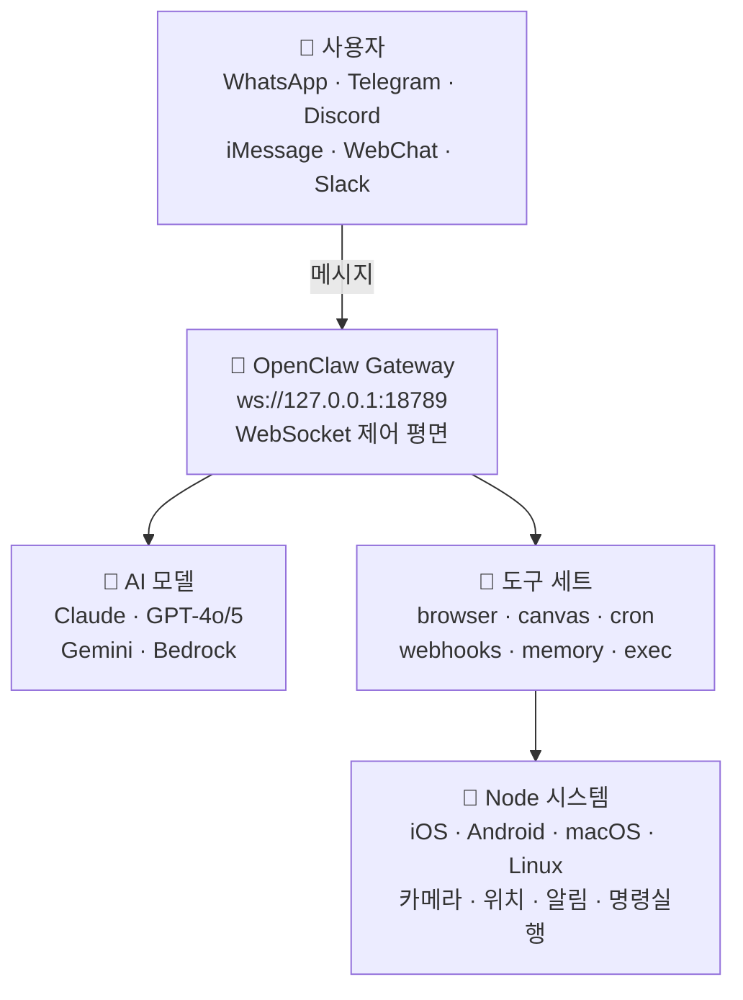

> 📚 <strong>시리즈: OpenClaw 완전 정복</strong>
> - <strong>1편: 소개편 (현재 글)</strong> — OpenClaw이 뭔지, 왜 특별한지
> - [2편: 튜토리얼편](/ko/blog/ko/openclaw-installation-tutorial/) — 설치부터 첫 대화까지
> - [3편: 실전 활용편](/ko/blog/ko/openclaw-practical-usage/) — 스킬, 자동화, 고급 워크플로우

---

## 🤖 AI 비서 시대, 왜 OpenClaw인가?

ChatGPT, Claude, Gemini… 요즘 AI 챗봇 안 써본 사람이 없을 겁니다. 그런데 한 번이라도 이런 생각 해보신 적 없으세요?

> "이 AI를 <strong>내 텔레그램</strong>에서 바로 쓸 수 없을까?"  
> "<strong>내 폰 카메라</strong>를 AI가 제어할 수 있다면?"  
> "데이터가 남의 서버에 쌓이는 게 좀 찝찝한데…"  
> "여러 AI 모델을 자유롭게 바꿔가며 쓸 수 없을까?"

바로 이런 고민을 해결하기 위해 등장한 프로젝트가 있습니다. <strong>OpenClaw</strong> 🦞입니다.

오늘은 OpenClaw이 뭔지, 뭐가 특별한지, 그리고 어떤 사람에게 딱 맞는 도구인지 낱낱이 소개해 드리겠습니다!

---

## 🦞 OpenClaw이란?

<strong>OpenClaw</strong>은 오픈소스 <strong>개인 AI 비서 플랫폼</strong>입니다.

쉽게 말하면, 여러분이 이미 매일 쓰고 있는 메신저(텔레그램, WhatsApp, Discord 등)에 <strong>나만의 AI 비서를 붙일 수 있는 시스템</strong>이에요. AI 모델을 직접 골라 연결하고, 다양한 도구와 스킬을 추가해서 나만의 워크플로우를 만들 수 있죠.

| 항목 | 내용 |
|---|---|
| <strong>라이선스</strong> | MIT (완전 자유 사용) |
| <strong>GitHub</strong> | [github.com/openclaw/openclaw](https://github.com/openclaw/openclaw) |
| <strong>공식 문서</strong> | [docs.openclaw.ai](https://docs.openclaw.ai) |
| <strong>제작자</strong> | Peter Steinberger([@steipete](https://twitter.com/steipete)), Mario Zechner(Pi 제작자) |
| <strong>스킬 마켓</strong> | [ClawHub](https://clawhub.com) |
| <strong>커뮤니티</strong> | Discord — [discord.gg/clawd](https://discord.gg/clawd) |

MIT 라이선스이기 때문에 개인이든 회사든 마음껏 사용하고 수정할 수 있습니다. 커뮤니티도 활발하게 운영 중이니 궁금한 게 있으면 Discord에 들어가 보세요! 💬

### GitHub 저장소 둘러보기

아래는 OpenClaw의 GitHub 저장소 메인 페이지입니다. README에서 프로젝트의 전체적인 구조와 빠른 시작 가이드를 확인할 수 있습니다.


---

## ✨ 주요 특징

### 📱 멀티 채널 — 어디서든 AI와 대화

OpenClaw의 가장 큰 매력 중 하나는 <strong>채널의 다양성</strong>입니다.

- <strong>WhatsApp</strong> — Baileys를 통한 WhatsApp Web 프로토콜 연동
- <strong>Telegram</strong> — grammY 기반 Bot API (DM + 그룹)
- <strong>Discord</strong> — discord.js 기반 Bot API (DM + 서버 채널)
- <strong>iMessage</strong> — macOS의 imsg CLI 통합
- <strong>Mattermost</strong> — 플러그인을 통한 Bot 연동
- <strong>Slack, Signal, MS Teams</strong> — 추가 플러그인
- <strong>WebChat</strong> — 브라우저에서 직접 접속하는 로컬 채팅 UI

별도의 앱을 설치할 필요 없이, <strong>이미 쓰고 있는 메신저에서 바로</strong> AI 비서를 사용할 수 있습니다. 텔레그램에서 메시지 보내듯이 AI에게 말 걸면 끝이에요.

### 💻 멀티 플랫폼

- <strong>macOS</strong> — 네이티브 앱 + 메뉴바 컴패니언
- <strong>iOS</strong> — 노드 앱으로 페어링 + Canvas 서피스
- <strong>Android</strong> — 노드 앱으로 Canvas + Chat + Camera
- <strong>Windows</strong> — 네이티브 지원 (WSL2도 가능)
- <strong>Linux</strong> — 네이티브 + 서버 배포

사실상 모든 주요 플랫폼을 지원합니다.

### 🏗️ Gateway 아키텍처

OpenClaw의 심장은 <strong>Gateway</strong>입니다. 단일 제어 평면(Control Plane)으로 동작하며, `ws://127.0.0.1:18789`를 통해 모든 채널과 도구를 하나로 연결합니다.

Gateway의 핵심 역할은:
- <strong>채널 연결 관리</strong> — 모든 메신저 채널의 WebSocket 연결을 소유
- <strong>에이전트 브릿지</strong> — Pi 코딩 에이전트와 RPC 통신
- <strong>도구 라우팅</strong> — 브라우저, 파일 시스템, 크론 등 도구 호출 중계
- <strong>세션 관리</strong> — DM은 공유 `main` 세션으로, 그룹은 격리된 세션으로 자동 라우팅
- <strong>Canvas 호스트</strong> — `http://<gateway>:18793`에서 노드 WebView용 UI 제공
- <strong>대시보드</strong> — `http://127.0.0.1:18789/`에서 브라우저 Control UI로 설정 관리

### 🧠 다양한 AI 모델 지원

- <strong>Anthropic Claude</strong> (Opus, Sonnet, Haiku)
- <strong>OpenAI</strong> (GPT-4o, GPT-5, o1 등)
- <strong>Google Gemini</strong>
- <strong>Amazon Bedrock</strong>을 통한 모델 접근
- <strong>Subscription Auth</strong> — Claude Pro/Max, ChatGPT/Codex OAuth 연동

하나의 모델에 종속되지 않고, 용도에 따라 <strong>자유롭게 모델을 교체</strong>할 수 있습니다. 크론 작업에는 저렴한 모델을, 중요한 분석에는 고성능 모델을 배정하는 식의 <strong>모델 라우팅</strong>도 가능합니다.

### 🔧 강력한 도구(Tools) 세트

OpenClaw에 내장된 도구들은 단순 플러그인이 아니라, <strong>에이전트가 실제로 세상과 상호작용하는 수단</strong>입니다.

| 도구 | 설명 |
|---|---|
| 🌐 `browser` | AI가 웹 페이지를 직접 탐색·조작 (Chrome 확장 릴레이 포함) |
| 🎨 `canvas` | 에이전트가 제어하는 시각적 작업 공간 — 노드 WebView에 UI 표시 |
| ⏰ `cron` | 일회성 리마인더부터 반복 작업까지 Gateway 내장 스케줄러 |
| 🔗 `webhooks` | 외부 서비스(GitHub, Gmail 등)와 실시간 연동 |
| 🧠 `memory_search` | 과거 대화와 저장된 정보를 자연어로 검색 |
| 💬 `message` | 채널 간 메시지 전송, 편집, 반응 |
| 📱 `nodes` | iOS/Android/macOS 디바이스 원격 제어 |
| 🖥️ `exec` | 셸 명령 실행 (PTY 지원, 보안 승인 시스템) |
| 📝 `read`/`write`/`edit` | 파일 시스템 직접 조작 |
| 🔍 `web_search`/`web_fetch` | 웹 검색 및 페이지 콘텐츠 추출 |
| 🎤 `tts` | 텍스트를 음성으로 변환 |

### 🛒 Skills 시스템 & ClawHub

<strong>AgentSkills 포맷</strong>과 호환되는 스킬 시스템을 갖추고 있어, <strong>ClawHub 마켓플레이스</strong>에서 다른 사용자가 만든 스킬을 설치하거나 자신의 스킬을 공유할 수 있습니다.


스킬은 세 곳에서 로드됩니다 (우선순위 순서):
1. <strong>워크스페이스 스킬</strong> (`<workspace>/skills/`) — 가장 높은 우선순위
2. <strong>관리형 스킬</strong> (`~/.openclaw/skills/`) — 모든 에이전트 공유
3. <strong>번들 스킬</strong> — OpenClaw 패키지에 포함된 기본 스킬

스킬 설치는 한 줄이면 됩니다:
```bash
npx clawhub@latest install <스킬이름>
```

### 📲 노드 시스템

iOS, Android, macOS 디바이스를 <strong>노드</strong>로 연결하면 AI가 물리적 세계와 상호작용할 수 있습니다:

| 기능 | 설명 |
|---|---|
| 📷 카메라 스냅 | 전면/후면 카메라 촬영 |
| 🎬 카메라 클립 | 짧은 영상 녹화 |
| 🖥️ 화면 녹화 | 현재 화면 캡처 |
| 🔔 푸시 알림 | 시스템/오버레이/자동 알림 전송 |
| 📍 위치 확인 | GPS 위치 조회 (coarse/balanced/precise) |
| 📱 SMS | Android 노드에서 SMS 전송 |
| ⌨️ 명령 실행 | 노드 호스트에서 셸 명령 실행 (Exec 승인 필요) |

노드는 Gateway WebSocket에 연결되며, <strong>페어링 승인</strong>을 거쳐야 활성화됩니다. 내 폰이 AI의 눈과 귀가 되는 셈이죠!

### 🤖 멀티 에이전트 시스템

OpenClaw은 하나의 Gateway에서 <strong>여러 에이전트를 동시에 운영</strong>할 수 있습니다.

- <strong>에이전트별 워크스페이스</strong> — 각자 독립된 작업 공간
- <strong>에이전트별 샌드박스</strong> — Docker 기반 격리 실행 환경
- <strong>에이전트별 도구 제한</strong> — 특정 에이전트에게는 `exec`를 막고 `read`만 허용하는 식
- <strong>바인딩 규칙</strong> — WhatsApp 그룹 A → 업무 에이전트, Telegram DM → 개인 에이전트
- <strong>서브 에이전트</strong> — 메인 에이전트가 백그라운드 작업을 서브 에이전트에게 위임

### 🎙️ Voice Wake + Talk Mode

키보드 없이 <strong>음성으로 AI와 대화</strong>할 수 있습니다. macOS 앱의 Wake word 기능으로 호출하고, Talk Mode로 자연스러운 대화를 이어가세요.

---

## 🏛️ 아키텍처 한눈에 보기



핵심 원칙:
- <strong>Loopback-first</strong>: Gateway WS는 기본적으로 로컬호스트만 바인딩
- <strong>하나의 Gateway, 하나의 호스트</strong>: WhatsApp Web 세션 소유권 충돌 방지
- <strong>토큰 기반 인증</strong>: 비-로컬 바인딩 시 토큰 필수
- <strong>Tailscale/VPN</strong>: 원격 접속은 SSH 터널이나 Tailnet 사용 권장

---

## 🆚 다른 AI 비서와 뭐가 다를까?

| 비교 항목 | ChatGPT / Claude 앱 | <strong>OpenClaw</strong> |
|---|---|---|
| 호스팅 | 클라우드 (타사 서버) | <strong>자체 호스팅</strong> (내 컴퓨터) |
| 데이터 프라이버시 | 서버에 저장됨 | <strong>내 로컬에만 저장</strong> 🔒 |
| 사용 채널 | 전용 앱/웹만 | <strong>텔레그램, 디스코드 등 기존 메신저</strong> |
| AI 모델 | 해당 회사 모델만 | <strong>Claude, GPT, Gemini 자유 선택</strong> |
| 확장성 | 제한적 (플러그인 스토어) | <strong>스킬, 웹훅, 크론, MCP, 커스텀 도구</strong> |
| 디바이스 제어 | ❌ 불가 | ✅ <strong>카메라, 화면, 위치, 명령 실행</strong> |
| 자동화 | ❌ 불가 | ✅ <strong>크론, 하트비트, 웹훅</strong> |
| 멀티 에이전트 | ❌ 불가 | ✅ <strong>에이전트별 라우팅, 샌드박스</strong> |
| 오픈소스 | ❌ | ✅ <strong>MIT 라이선스</strong> |

핵심 차이를 한 줄로 요약하면:

> <strong>"남의 서비스를 빌려 쓰는 게 아니라, 내 인프라 위에 내 규칙으로 돌아가는 AI 비서."</strong>

---

## 🎯 이런 분에게 추천합니다!

- 🔐 <strong>프라이버시를 중요하게 생각하는 분</strong> — 모든 데이터가 내 컴퓨터에만 남습니다
- 🛠️ <strong>자동화를 좋아하는 개발자</strong> — 크론, 웹훅, 스킬, MCP로 무한 확장
- 📱 <strong>여러 메신저를 쓰는 분</strong> — 텔레그램이든 디스코드든 어디서나 같은 AI 비서
- 🤓 <strong>AI 기술을 직접 만져보고 싶은 분</strong> — 오픈소스니까 코드 레벨에서 이해 가능
- 🏠 <strong>홈 오토메이션에 관심 있는 분</strong> — Node 시스템으로 IoT스러운 활용 가능
- 👨‍💼 <strong>팀에 AI를 도입하고 싶은 분</strong> — 멀티 에이전트로 역할별 AI 운영 가능
- 🔧 <strong>기존 워크플로우에 AI를 통합하고 싶은 분</strong> — 웹훅, n8n, Make 등과 손쉬운 연동

반대로, "그냥 ChatGPT 웹에서 가끔 질문하는 정도"로 만족하시는 분이라면 굳이 OpenClaw까지 갈 필요는 없을 수 있어요. OpenClaw은 <strong>"AI를 내 삶에 깊이 통합하고 싶은 사람"</strong>을 위한 도구입니다.

---

## 🌍 프로젝트 생태계

OpenClaw은 단독 프로젝트가 아니라, 여러 컴포넌트로 이루어진 <strong>생태계</strong>입니다:

| 컴포넌트 | 역할 |
|---|---|
| <strong>OpenClaw Gateway</strong> | 핵심 런타임 — 채널, 도구, 에이전트 관리 |
| <strong>Pi</strong> | 코딩 에이전트 엔진 — RPC 모드로 Gateway와 통신 |
| <strong>ClawHub</strong> | 스킬 레지스트리 — 검색, 설치, 업데이트, 공유 |
| <strong>OpenClaw.app</strong> | macOS 데스크톱 앱 — 메뉴바 + Voice Wake |
| <strong>OpenClaw iOS</strong> | iPhone/iPad 노드 앱 — Canvas + 카메라 |
| <strong>OpenClaw Android</strong> | Android 노드 앱 — Canvas + Chat + Camera |
| <strong>공식 문서</strong> | docs.openclaw.ai — 종합 가이드 |

---

## 📢 다음 편 예고

이번 글에서는 OpenClaw이 무엇이고, 왜 특별한지 알아봤습니다.

<strong>[2편: 튜토리얼편](/ko/blog/ko/openclaw-installation-tutorial/)</strong>에서는 실제로 OpenClaw을 <strong>설치하고 설정하는 과정</strong>을 단계별로 함께 해볼 예정이에요!

- Node.js 설치 & Gateway 온보딩
- Telegram 채널 연결 및 페어링
- 첫 번째 AI 대화 시작하기
- 워크스페이스 파일 구조 이해

> 🦞 <strong>"백문이 불여일Run"</strong> — 다음 편에서 직접 돌려보시죠!

---

*이 글이 도움이 되셨다면 공유 부탁드려요! 질문은 [Discord 커뮤니티](https://discord.gg/clawd)에서 환영합니다.* 🙌
