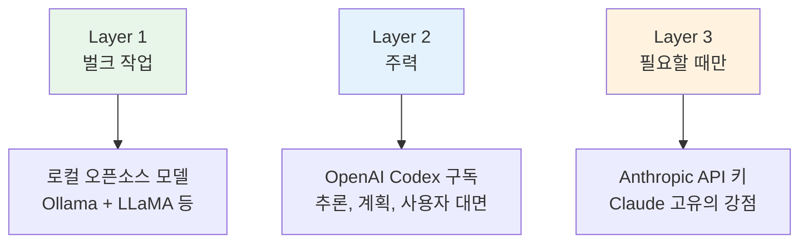

## 발단: Claude와 Gemini의 ToS 변경

2026년 초, Anthropic(Claude)과 Google(Gemini)이 이용약관을 업데이트했습니다. 문제의 핵심은 <strong>구독 플랜(Pro/Max 등)의 OAuth 인증을 서드파티 도구에서 쓸 수 있는가</strong>였습니다.

그동안 많은 OpenClaw 사용자가 Claude Pro나 Gemini Advanced 구독을 OAuth로 연결해 에이전트를 운용해 왔습니다. ToS 변경 이후 "이대로 써도 괜찮은 건가?"라는 불안이 퍼졌고, 커뮤니티에서 대안 찾기가 시작되었습니다.

결론부터 말하면, <strong>OpenAI의 ChatGPT Plus/Pro 구독에 포함된 Codex OAuth는 서드파티 연동을 명시적으로 허용</strong>합니다. 이 글에서는 실제 전환 절차와 주의할 점을 정리합니다.

## 전환 전에 확인할 것

바로 옮기기 전에 세 가지를 점검하세요.

- <strong>프롬프트 호환성</strong>: Claude와 GPT-5.x-Codex는 같은 프롬프트에 다르게 반응합니다. `SOUL.md`, `AGENTS.md`를 며칠간 손봐야 안정됩니다
- <strong>모델별 강점 차이</strong>: Codex는 코드와 도구 호출(Tool Use)에 강합니다. 반면 에세이나 SNS 포스트처럼 자연스러운 문장이 필요한 작업에서는 Claude 쪽 평가가 높습니다
- <strong>API 키 방식이라는 선택지</strong>: Claude를 계속 쓰고 싶다면 구독 OAuth 대신 API 키 방식(`console.anthropic.com`)을 쓸 수 있습니다. 단, Opus 에이전트 루프를 돌릴 경우 월 $100 이상 나오는 사례가 많습니다

## 전환 절차 (4단계)

커뮤니티에서 검증된 순서입니다. 소요 시간은 약 15분입니다.

### 1단계: 백업

가장 먼저 현재 설정을 통째로 백업합니다.

```bash
cd ~
tar -czf openclaw-backup.tgz .openclaw
```

채널 설정, 메모리, 크론잡, 인증 정보가 모두 이 안에 들어갑니다.

### 2단계: 온보딩 위저드 실행

```bash
openclaw onboard --auth-choice openai-codex
```

위저드가 시작되면 몇 가지 질문이 나옵니다. 아래 표대로 선택하면 됩니다.

| 화면 | 선택 | 이유 |
|------|------|------|
| "This is risky" 경고 | <strong>그대로 진행</strong> | 프로바이더 변경에 따른 동작 차이 안내일 뿐입니다 |
| Setup mode | <strong>Quickstart</strong> | 기본값으로 빠르게 설정합니다 |
| 기존 값 처리 | <strong>⚠️ 반드시 "Use existing values"</strong> | "Reset"을 선택하면 채널·메모리·크론 설정이 전부 삭제됩니다 |

브라우저가 열리면 ChatGPT 계정으로 로그인하고 권한을 승인합니다.

<strong>🔴 주의</strong>: 승인이 끝나면 <strong>터미널의 위저드를 바로 닫으세요.</strong> 이미 기존 설정이 있는 상태에서 위저드를 끝까지 돌리면 설정이 덮어씌워질 수 있습니다.

### 3단계: 기본 모델 변경

```bash
openclaw models set openai-codex/gpt-5.3-codex
```

### 4단계: 확인

```bash
openclaw models status --plain
```

`primary`에 `openai-codex/gpt-5.3-codex`가 표시되면 성공입니다.

## Anthropic 인증 완전 제거 (선택)

기존 인증을 깔끔하게 정리하고 싶다면 아래 명령을 실행합니다.

```bash
# 폴백 모델 제거
openclaw models fallbacks list
openclaw models fallbacks remove anthropic/claude-sonnet-4-5
openclaw models fallbacks remove anthropic/claude-opus-4-6
# 또는 한 번에 정리
openclaw models fallbacks clear

# 인증 순서 제거
openclaw models auth order clear --provider anthropic

# 환경변수 정리 (~/.openclaw/.env)
# ANTHROPIC_API_KEY=... 행을 삭제합니다

# 게이트웨이 재시작 및 상태 확인
openclaw gateway restart
openclaw doctor
```

## 에이전트별 모델 설정 — 빠뜨리기 쉬운 부분

전환 후 가장 흔한 실수가 여기서 발생합니다. <strong>`openclaw models set`은 글로벌 기본값만 변경합니다.</strong> 에이전트에 모델이 개별 지정되어 있으면 그 에이전트는 이전 모델을 그대로 씁니다.

`openclaw.json`의 `agents.list`를 확인해 보세요.

```json
{
  "agents": {
    "defaults": {
      "model": {
        "primary": "openai-codex/gpt-5.3-codex"  // ← 글로벌 기본값 (변경 완료)
      }
    },
    "list": [
      {
        "id": "branding",
        "model": {
          "primary": "anthropic/claude-opus-4-6"  // ← 여전히 Claude
        }
      },
      {
        "id": "writer",
        "model": {
          "primary": "anthropic/claude-opus-4-6"  // ← 여전히 Claude
        }
      }
    ]
  }
}
```

에이전트별로 모델을 바꾸는 방법은 두 가지입니다.

```bash
# 방법 1: 크론잡 단위로 모델 지정
openclaw cron edit <cron-id> --model "openai-codex/gpt-5.3-codex"

# 방법 2: 에이전트별 model 블록 자체를 삭제 → 글로벌 기본값을 따름
```

전체를 일괄 전환하려면 에이전트별 `model` 블록을 삭제하는 편이 간단합니다.

## 레이어 전략 — 커뮤니티 추천 아키텍처

하나의 프로바이더에 올인하는 대신, 용도별로 모델을 나누는 <strong>레이어 전략</strong>이 커뮤니티에서 자리 잡고 있습니다.



| Layer | 용도 | 모델 | 과금 |
|-------|------|------|------|
| <strong>Layer 1</strong> | 파일 처리, 탐색 작업 | 로컬 오픈소스 (Ollama + LLaMA 등) | 무료 (전기세만) |
| <strong>Layer 2</strong> | 추론, 계획, 사용자 대면 | OpenAI Codex 구독 | 월정액 |
| <strong>Layer 3</strong> | Claude만의 강점이 필요할 때 | Anthropic API 키 | 토큰당 과금 |

이 구조에서는 프로바이더가 정책을 바꾸더라도 <strong>설정 파일 한 줄만 수정</strong>하면 됩니다.

## 전환 후 체감

실제로 전환한 사용자들의 공통된 의견입니다.

- <strong>프롬프트 튜닝은 필수</strong>: `SOUL.md`, `AGENTS.md`를 며칠 동안 조정해야 이전과 같은 수준으로 안정됩니다
- <strong>코드·도구 호출은 확실히 강합니다</strong>: 코드 생성과 Tool Use에서 체감할 수 있는 차이가 있습니다
- <strong>자연스러운 글쓰기는 아쉽습니다</strong>: 에세이나 SNS 포스트에서는 Claude가 더 자연스럽다는 평가가 많습니다
- <strong>안정성은 높습니다</strong>: OAuth 인증이 안정적이고, 토큰 소진 걱정 없이 에이전트를 돌릴 수 있습니다

## Claude를 유지하고 싶다면

API 키 방식은 ToS와 무관하게 사용할 수 있습니다.

```bash
openclaw onboard --auth-choice anthropic
```

`console.anthropic.com`에서 API 키를 발급받고, 토큰당 과금으로 운용합니다. Opus 에이전트 루프의 경우 월 비용이 $100을 넘기 쉬우므로, 비용 모니터링이 중요합니다.

## 한눈에 비교

| 항목 | Claude 구독 OAuth | Codex 구독 OAuth | Claude API 키 |
|------|-------------------|------------------|---------------|
| ToS 리스크 | ⚠️ 불확실 | ✅ 명시적 허용 | ✅ 합법 |
| 월 비용 | 구독료 | 구독료 | 사용량 비례 |
| 글쓰기 품질 | ⭐⭐⭐ | ⭐⭐ | ⭐⭐⭐ |
| 코드/도구 | ⭐⭐ | ⭐⭐⭐ | ⭐⭐ |
| 전환 난이도 | — | 쉬움 (15분) | 쉬움 |

가장 중요한 건 <strong>특정 프로바이더에 종속되지 않는 구조</strong>를 만들어 두는 것입니다. OpenClaw의 설정 기반 아키텍처를 활용하면, 어떤 프로바이더가 정책을 바꾸더라도 유연하게 대응할 수 있습니다.

## 참고 자료

- [OpenClaw 공식 문서 — 프로바이더 설정](https://docs.openclaw.ai/providers/openai)
- [OpenClaw Discord 커뮤니티](https://discord.com/invite/clawd)
- [OpenAI Codex 인증 가이드](https://docs.openclaw.ai/cli/index)
