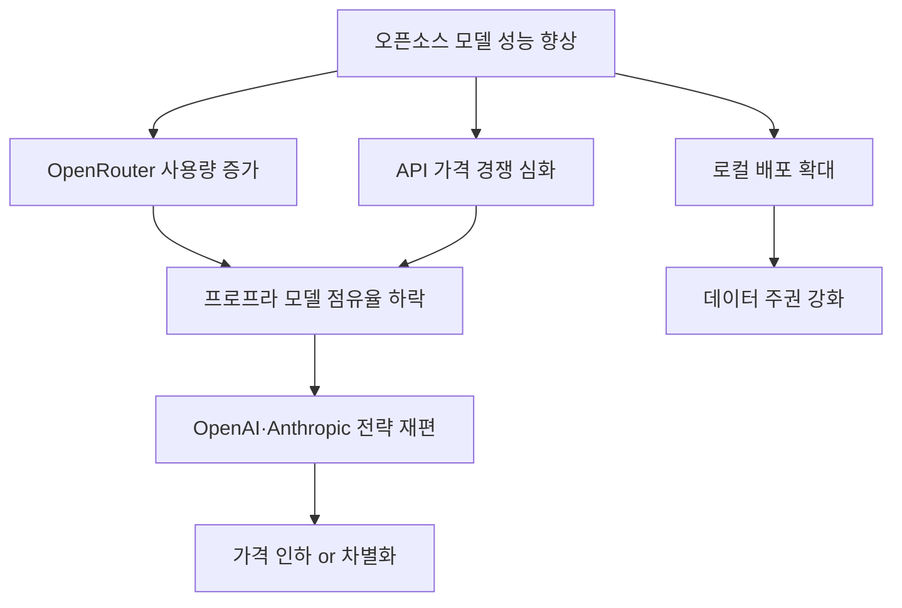

## 개요

AI 모델 라우팅 플랫폼 <strong>OpenRouter</strong>의 주간 이용 랭킹에서 놀라운 변화가 관측되었습니다. TOP5 모델 중 <strong>4개가 오픈소스 모델</strong>이 차지한 것입니다. Qwen3-Coder, DeepSeek R2, MiniMax M2.5 등이 상위권을 점령하며, 그동안 당연시되던 프로프라이어터리(독점) 모델의 우위가 무너지고 있음을 보여주고 있습니다.

이 글에서는 OpenRouter 랭킹 데이터를 바탕으로, 오픈소스 모델이 실제 사용량 기준으로 프로프라 모델을 앞서게 된 구조적 이유를 분석합니다.

## OpenRouter 주간 랭킹: 무엇이 달라졌나

### TOP5 구성

Reddit의 r/LocalLLaMA 커뮤니티에서 공유된 데이터에 따르면, OpenRouter 주간 이용량 TOP5는 다음과 같이 구성되었습니다:

| 순위 | 모델 | 유형 | 특징 |
|------|------|------|------|
| 1 | Qwen3-Coder | 🟢 오픈소스 | Alibaba의 코딩 특화 모델 |
| 2 | DeepSeek R2 | 🟢 오픈소스 | 추론 특화 대형 모델 |
| 3 | MiniMax M2.5 | 🟢 오픈소스 | 비용 효율 높은 범용 모델 |
| 4 | GPT-4.1 | 🔵 프로프라 | OpenAI의 플래그십 |
| 5 | Llama 4 Maverick | 🟢 오픈소스 | Meta의 오픈소스 대형 모델 |

5개 중 4개가 오픈소스라는 사실은 단순한 수치 이상의 의미를 가집니다. <strong>실제 개발자들이 비용을 지불하면서 선택한 결과</strong>이기 때문입니다.

### OpenRouter가 중요한 이유

OpenRouter는 다양한 AI 모델을 단일 API로 접근할 수 있게 해주는 플랫폼입니다. 사용자가 직접 모델을 선택하고, 실제 토큰 사용량에 따라 비용을 지불합니다. 따라서 이 랭킹은 <strong>마케팅이나 벤치마크가 아닌 실사용 선호도</strong>를 반영합니다.

## 오픈소스 모델이 선택받는 5가지 이유

### 1. 비용 효율성의 압도적 우위

오픈소스 모델은 API 제공자 간 경쟁이 활발하여 동일 성능 대비 비용이 크게 낮습니다. Qwen3-Coder의 경우 GPT-4.1 대비 <strong>약 1/10 수준의 가격</strong>으로 유사한 코딩 성능을 제공합니다.

```
비용 비교 (1M 토큰 기준, 추정):
┌─────────────────┬──────────┬──────────┐
│ 모델            │ 입력     │ 출력     │
├─────────────────┼──────────┼──────────┤
│ GPT-4.1         │ $2.00    │ $8.00    │
│ Qwen3-Coder     │ $0.20    │ $0.60    │
│ DeepSeek R2     │ $0.30    │ $1.20    │
│ MiniMax M2.5    │ $0.15    │ $0.60    │
└─────────────────┴──────────┴──────────┘
```

### 2. 성능 격차의 소멸

2024년까지는 GPT-4가 압도적인 성능 우위를 보였지만, 2025~2026년에 걸쳐 오픈소스 모델의 성능이 급격히 향상되었습니다. 특히:

- <strong>Qwen3-Coder</strong>: 코딩 벤치마크에서 GPT-4.1과 동등 이상의 성능
- <strong>DeepSeek R2</strong>: 수학·추론에서 최상위 성능, Chain-of-Thought 추론에 강점
- <strong>MiniMax M2.5</strong>: 범용 태스크에서 비용 대비 최고 효율

### 3. 투명성과 커스터마이징 가능성

오픈소스 모델은 가중치가 공개되어 있어 다음이 가능합니다:

- <strong>파인튜닝</strong>: 특정 도메인에 맞춤 최적화
- <strong>로컬 배포</strong>: 데이터 프라이버시 확보
- <strong>아키텍처 이해</strong>: 모델 동작 원리 검증 가능
- <strong>셀프 호스팅</strong>: 벤더 종속 없는 인프라 구축

### 4. 중국 AI 기업의 공격적 오픈소스 전략

Alibaba(Qwen), DeepSeek, MiniMax 등 중국 AI 기업들은 최고 성능 모델을 오픈소스로 공개하는 전략을 취하고 있습니다. 이는:

- <strong>에코시스템 선점</strong>: 개발자 커뮤니티 확보
- <strong>API 수익 모델</strong>: 오픈소스로 사용자를 유치하고, 클라우드 API로 수익화
- <strong>글로벌 영향력 확대</strong>: 서양 프로프라 모델 대비 차별화

### 5. 커뮤니티 주도 최적화

오픈소스 모델은 출시 후 커뮤니티에 의해 빠르게 최적화됩니다:

- <strong>양자화(Quantization)</strong>: GGUF, GPTQ, AWQ 등으로 추론 비용 절감
- <strong>추론 최적화</strong>: vLLM, TensorRT-LLM 등 고성능 추론 엔진 적용
- <strong>어댑터 공유</strong>: LoRA 어댑터를 통한 도메인 특화

## 프로프라이어터리 모델의 남은 강점

오픈소스의 약진에도 불구하고, 프로프라 모델이 여전히 우위를 보이는 영역이 있습니다:

- <strong>멀티모달 통합</strong>: GPT-4o, Gemini 등의 비전·음성 통합 능력
- <strong>엔터프라이즈 지원</strong>: SLA, 컴플라이언스, 기술 지원
- <strong>안전성 필터링</strong>: 기업용 안전 가드레일
- <strong>최첨단 연구</strong>: 새로운 아키텍처 혁신은 여전히 대형 랩에서 시작

그러나 이러한 강점도 시간이 지남에 따라 오픈소스 커뮤니티가 빠르게 따라잡고 있는 추세입니다.

## 업계에 미치는 영향



### 개발자에게 주는 시사점

1. <strong>멀티 모델 전략 채택</strong>: 단일 벤더 종속을 피하고 OpenRouter 같은 라우터 활용
2. <strong>비용 최적화</strong>: 태스크별 최적 모델 선택 (코딩 → Qwen3-Coder, 추론 → DeepSeek R2)
3. <strong>로컬 배포 검토</strong>: 민감한 데이터 처리 시 오픈소스 모델 셀프 호스팅
4. <strong>커뮤니티 참여</strong>: 오픈소스 모델의 양자화·파인튜닝 결과 공유 및 활용

## 결론

OpenRouter 주간 랭킹에서 오픈소스 모델 4개가 TOP5를 차지한 것은 단순한 순간의 변화가 아닙니다. 비용 효율성, 성능 격차 해소, 커스터마이징 가능성, 중국 기업의 공격적 전략, 커뮤니티 최적화라는 5가지 구조적 요인이 만들어낸 <strong>패러다임 전환</strong>입니다.

프로프라이어터리 모델이 사라지는 것은 아니지만, "최고 성능 = 독점 모델"이라는 공식은 이미 깨졌습니다. 앞으로의 AI 생태계는 오픈소스와 프로프라의 공존 속에서, <strong>실용성과 비용 효율이 선택의 핵심 기준</strong>이 되는 시대로 접어들고 있습니다.

## 참고 자료

- [Reddit r/LocalLLaMA — 4 of the top 5 most used models on OpenRouter this week are Open Source](https://www.reddit.com/r/LocalLLaMA/comments/1r6g14s/4_of_the_top_5_most_used_models_on_openrouter/)
- [OpenRouter Rankings](https://openrouter.ai/rankings)
- [Qwen3-Coder 공식 페이지](https://huggingface.co/Qwen)
- [DeepSeek 공식 사이트](https://www.deepseek.com/)
