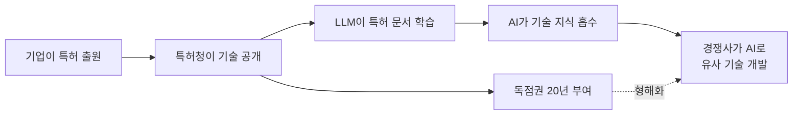
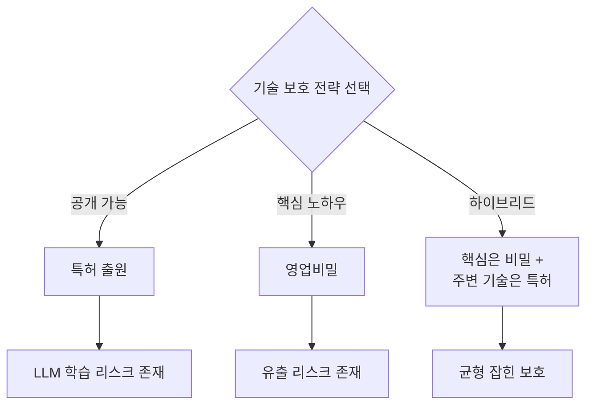

## 개요

Mark Cuban이 X(구 Twitter)에서 흥미로운 지적을 했습니다. **"특허를 공개하면 LLM의 학습 소재가 된다"**는 것입니다. 특허 제도는 본래 "기술 공개의 대가로 독점권을 부여한다"는 사회적 계약 위에 성립합니다. 그런데 LLM이 공개된 특허 문서를 대량으로 학습하면서, 이 전제가 근본적으로 흔들리고 있습니다.

이 글에서는 Cuban의 지적을 출발점으로, LLM 시대에 특허 전략이 어떻게 변화해야 하는지 분석합니다.

## Mark Cuban의 핵심 지적

Cuban의 주장을 정리하면 다음과 같습니다:

1. **특허는 공개 문서다**: 특허청에 출원하면 기술 내용이 상세히 공개됨
2. **LLM은 공개 데이터를 학습한다**: 특허 문서도 학습 데이터에 포함됨
3. **결과적으로 AI가 특허 기술을 "알게" 된다**: 독점권은 있지만, 기술 지식 자체는 AI에 흡수됨

이는 단순한 특허 침해 문제를 넘어서, **특허 제도의 근본적 가치 교환이 무너지는 상황**을 의미합니다.

## 특허 제도의 전제가 흔들리는 이유

### 전통적 특허의 사회적 계약

특허 제도는 200년 이상 다음과 같은 전제로 작동해 왔습니다:

| 발명자 측 | 사회 측 |
|-----------|---------|
| 기술을 상세히 공개 | 20년간 독점권 부여 |
| 실시 가능한 수준으로 기재 | 특허 만료 후 자유 실시 |
| 기술 진보에 기여 | 후속 발명의 기반 제공 |

### LLM이 바꾸는 게임 규칙

LLM 시대에는 이 계약의 균형이 크게 기울어집니다:

- **학습 속도**: 인간 엔지니어가 수년 걸려 읽을 특허를 AI는 수초 만에 학습
- **추상화 능력**: 특허의 핵심 아이디어를 추출하여 변형된 형태로 활용 가능
- **규모의 문제**: 수백만 건의 특허를 동시에 학습하여 기술 간 연결점 발견
- **법적 회색지대**: AI가 학습한 지식을 바탕으로 한 개발이 특허 침해인지 불분명

### 실제로 벌어지고 있는 일

이미 여러 사례에서 이 문제가 현실화되고 있습니다:

1. **코드 생성 AI**: GitHub Copilot 등이 특허된 알고리즘과 유사한 코드를 생성하는 사례
2. **신약 개발 AI**: 공개된 의약 특허를 학습한 AI가 유사 화합물을 설계하는 사례
3. **하드웨어 설계**: 반도체 특허를 학습한 AI가 회로 설계를 보조하는 사례

## 기업의 특허 전략은 어떻게 변해야 하는가

### 1. 영업비밀(Trade Secret) 전략의 부활

특허 대신 영업비밀로 보호하는 전략이 재조명되고 있습니다.

**장점**:
- LLM이 학습할 수 없음 (비공개이므로)
- 기간 제한 없음 (20년 vs 영구)
- 출원 비용 불필요

**단점**:
- 역설계(리버스 엔지니어링)에 취약
- 독립 발명자에게 대항 불가
- 직원 이직 시 유출 리스크

### 2. 방어적 특허 전략의 강화

특허를 공격적 무기가 아닌 **방어 수단**으로 활용하는 전략입니다:

- **특허 풀(Patent Pool)**: 업계 전체가 특허를 공유하여 상호 견제
- **방어적 공개(Defensive Publication)**: 특허 출원 대신 기술을 선행기술로 공개하여 경쟁사의 특허화를 방지
- **크로스 라이선싱**: 상호 라이선스를 통한 기술 교환

### 3. AI 시대 맞춤형 특허 작성

특허 문서 자체를 LLM이 쉽게 학습하지 못하도록 작성하는 접근입니다:

- **핵심 노하우 분리**: 특허에는 최소한의 정보만 기재, 실시를 위한 상세 노하우는 영업비밀로 보호
- **추상화 수준 조절**: 청구항은 넓게, 명세서는 전략적으로 작성
- **다층 보호 전략**: 하나의 기술을 여러 특허와 영업비밀의 조합으로 보호

### 4. AI 학습 제한을 위한 법적 대응

법적·정책적 차원에서의 대응도 필요합니다:

- **특허 데이터의 AI 학습 제한 법안**: 일부 국가에서 논의 중
- **robots.txt 방식의 특허 보호**: 특허 데이터베이스에 학습 제한 메타데이터 추가
- **AI 생성 발명의 특허성 논의**: AI가 발명한 것에 특허를 부여할 수 있는지의 문제

## 업계별 영향 분석

| 업계 | 영향도 | 주요 리스크 | 권장 전략 |
|------|--------|------------|-----------|
| 제약/바이오 | 매우 높음 | 화합물 특허가 AI 신약 개발에 활용 | 영업비밀 + 특허 하이브리드 |
| 반도체 | 높음 | 회로 설계 특허가 AI 설계 보조에 활용 | 핵심 공정은 영업비밀화 |
| 소프트웨어 | 중간 | 알고리즘 특허가 코드 생성에 영향 | 오픈소스 + 서비스 모델 전환 |
| 기계/제조 | 중간 | 구조 특허가 CAD 자동설계에 활용 | 제조 노하우 비밀 유지 |

## 결론

Mark Cuban의 지적은 단순한 우려가 아닌, **특허 제도의 근본적 재검토**를 요구하는 문제 제기입니다. LLM이 모든 공개 지식을 흡수하는 시대에, "기술 공개 = 독점권"이라는 200년 된 사회적 계약은 더 이상 원래의 기능을 수행하지 못할 수 있습니다.

기업은 다음 세 가지를 즉시 검토해야 합니다:

1. **현재 특허 포트폴리오의 LLM 노출도 평가**
2. **영업비밀과 특허의 최적 조합 재설계**
3. **AI 시대에 맞는 지재권 전략 로드맵 수립**

특허 전략의 패러다임이 변하고 있습니다. 빠르게 적응하는 기업만이 기술적 우위를 유지할 수 있을 것입니다.

## 참고 자료

- [Mark Cuban의 X 포스트](https://x.com/mcuban/status/2020857921928581592) — 특허 공개와 LLM 학습에 대한 원문
- [WIPO — AI와 지적재산권](https://www.wipo.int/about-ip/en/artificial_intelligence/) — 세계지적재산권기구의 AI 관련 정책 논의
- [USPTO — AI 관련 특허 가이드라인](https://www.uspto.gov/initiatives/artificial-intelligence) — 미국 특허청의 AI 발명 관련 지침
