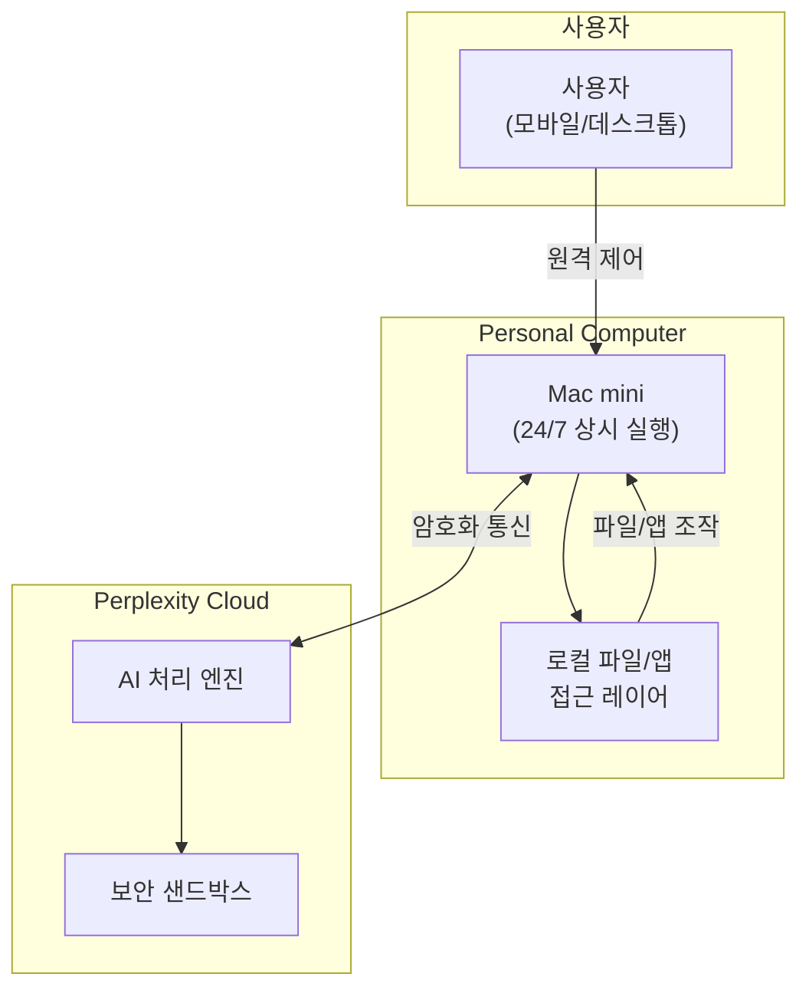
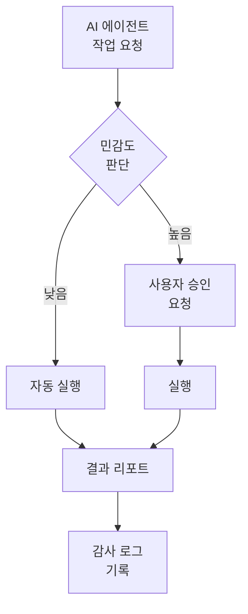

## 'Everything is Computer' — AI가 곧 컴퓨터다

2026년 3월 11일, Perplexity는 <strong>'Everything is Computer'</strong> 비전을 발표하며 세 가지 제품을 동시에 공개했다. Computer, Personal Computer, Computer for Enterprise. 이 발표의 핵심은 단순하다 — AI가 더 이상 '도구'가 아니라 '나를 대신하는 컴퓨터'라는 것이다.

이 글에서는 EM(Engineering Manager) 관점에서 Perplexity Computer가 개발팀과 조직에 미칠 영향을 분석한다.

## Perplexity Computer 제품군 분석

### 1. Computer — 클라우드 AI 에이전트

기본 제품인 Computer는 Perplexity의 클라우드에서 작동하는 AI 에이전트다. 웹 브라우징, 코드 실행, 데이터 분석 등의 작업을 사용자 대신 수행한다.

### 2. Personal Computer — 24/7 상시 AI 프록시

<strong>가장 주목할 만한 제품</strong>은 Personal Computer다. 전용 Mac mini에서 항상 켜져 있으며, 사용자의 파일과 앱에 접근하여 24시간 업무를 처리하는 디지털 프록시로 작동한다.

핵심 특징:

- <strong>항상 켜짐</strong>: Mac mini에서 24/7 실행, 사용자가 잠든 사이에도 작업 진행
- <strong>로컬 접근</strong>: Mac의 파일 시스템과 앱에 직접 접근 가능
- <strong>원격 제어</strong>: 어디서든 어떤 디바이스로든 제어 가능
- <strong>보안 모델</strong>: 민감한 작업은 사용자 승인 필요, 모든 행동 로그 기록, 킬 스위치 내장
- <strong>가격</strong>: 월 $200 구독제

### 3. Computer for Enterprise — 조직 단위 AI 에이전트

Enterprise 버전은 개인이 아닌 <strong>팀과 조직</strong>을 위해 설계되었다. Snowflake, Salesforce, HubSpot 등 비즈니스 소프트웨어와 직접 연동되며, Slack DM이나 채널에서 협업할 수 있다.

<strong>핵심 성과</strong>: 16,000건 이상의 쿼리를 대상으로 한 내부 테스트에서, McKinsey, Harvard, MIT, BCG 등이 사용하는 기관 벤치마크 기준으로 <strong>4주 만에 3.25년치 업무를 완료</strong>하고 약 160만 달러의 인건비를 절감했다.

보안 인프라:

- SOC 2 Type II 인증
- SAML SSO
- 감사 로그(Audit logs)
- 관리자 제어
- 격리된 클라우드 환경에서 작업 실행

## 4주 = 3.25년, 이 수치가 의미하는 것

Perplexity의 Enterprise 테스트 결과를 분해해 보자.

| 항목 | 수치 |
|---|---|
| 처리 쿼리 수 | 16,000건+ |
| 등가 업무 시간 | 3.25년 (약 6,760시간) |
| 실제 소요 시간 | 4주 (약 672시간) |
| 생산성 배수 | <strong>약 10배</strong> |
| 절감 인건비 | $1.6M (약 21억원) |

EM 관점에서 이 수치는 두 가지를 시사한다.

<strong>첫째, 반복적 분석 업무의 자동화</strong>. 재무 데이터 조회, 시장 분석, 리포트 생성 같은 업무는 AI 에이전트가 처리할 수 있다. 팀원들은 이런 반복 업무에서 해방되어 더 높은 가치의 의사결정에 집중할 수 있다.

<strong>둘째, 'AI 인원' 개념의 등장</strong>. 월 $200이면 24시간 일하는 주니어 분석가를 한 명 고용한 것과 비슷하다. 10명 팀에 AI 에이전트 2대를 추가하면 12명 규모의 아웃풋을 낼 수 있다는 계산이 가능해진다.

## EM이 주목해야 할 3가지 포인트

### 1. 거버넌스 모델 — 신뢰와 통제의 균형

Perplexity Computer는 흥미로운 거버넌스 모델을 제시한다.

핵심은 <strong>단계적 권한(Graduated Authority)</strong>이다. 낮은 위험도 작업은 자동으로, 민감한 작업은 승인을 받아 수행한다. 모든 행동은 로그로 기록되며, 킬 스위치로 즉시 중단할 수 있다.

이 패턴은 Galileo의 Agent Control(3월 13일 출시된 AI 에이전트 오픈소스 거버넌스 플랫폼)이 제시하는 원칙과도 일치한다. 엔터프라이즈 AI 에이전트 운영에서 <strong>중앙 집중식 정책 관리</strong>와 <strong>런타임 완화</strong>가 업계 표준이 되어가고 있다.

### 2. '상시 AI'가 바꾸는 업무 패턴

AI 에이전트가 24시간 작동한다는 것은 <strong>비동기 업무의 극대화</strong>를 의미한다.

- <strong>AS-IS</strong>: 업무 → 퇴근 → 다음 날 이어서 작업
- <strong>TO-BE</strong>: 업무 지시 → 퇴근 → AI가 밤새 작업 → 출근 시 결과 리뷰

이 패턴이 가능해지면 팀의 처리량(throughput)은 비약적으로 증가한다. 단, EM은 새로운 관리 역량이 필요해진다.

- <strong>작업 분해 능력</strong>: AI에게 위임할 수 있는 작업과 인간이 해야 할 작업을 구분하는 능력
- <strong>결과 리뷰 역량</strong>: AI 산출물의 품질을 빠르게 검증하는 스킬
- <strong>비동기 오케스트레이션</strong>: AI 에이전트의 작업 대기열을 관리하고 우선순위를 조정하는 역할

### 3. 비용 대비 효과 계산

| 비교 항목 | 주니어 개발자 | Perplexity Personal Computer |
|---|---|---|
| 월 비용 | $4,000〜$6,000 | $200 |
| 가용 시간 | 8시간/일 | 24시간/일 |
| 작업 범위 | 광범위 | 분석/조사/자동화 특화 |
| 판단력 | 높음 | 제한적 (감독 필요) |
| 성장 가능성 | 무한 | 모델 업데이트 의존 |

AI 에이전트는 주니어 개발자를 <strong>대체</strong>하는 것이 아니라, 팀의 <strong>증강(augmentation)</strong>을 위한 도구다. 주니어 개발자에게 반복 업무를 시키는 대신 AI 에이전트가 처리하게 하고, 주니어 개발자는 더 높은 수준의 문제를 해결하도록 유도하는 것이 올바른 활용법이다.

## 경쟁 구도와 시장 전망

Perplexity Computer는 단독으로 존재하지 않는다. 현재 '상시 AI 에이전트' 시장은 빠르게 형성되고 있다.

| 제품 | 특징 | 접근 방식 |
|---|---|---|
| Perplexity Personal Computer | Mac mini 기반 24/7 에이전트 | 전용 하드웨어 + 클라우드 AI |
| OpenClaw | 오픈소스 AI 어시스턴트 (21만 스타) | 자체 하드웨어에서 실행 |
| Anthropic Claude | MCP 기반 툴 연동 에이전트 | API + 프로토콜 표준화 |
| OpenAI Codex | 코딩 특화 에이전트 | 클라우드 전용 |

Gartner는 <strong>2026년 말까지 엔터프라이즈 앱의 40%에 AI 에이전트가 탑재</strong>될 것으로 전망한다(2025년 5% 미만에서 급증). 상시 AI 에이전트는 이 흐름의 가장 앞단에 있다.

## 도입 시 고려사항

지금 당장 Perplexity Computer를 도입할 필요는 없다. 하지만 다음 사항은 준비해야 한다.

1. <strong>AI 위임 가능 업무 목록 작성</strong>: 팀 내에서 반복적으로 수행되는 조사, 분석, 리포트 생성 업무를 리스트업하라.
2. <strong>거버넌스 프레임워크 설계</strong>: AI 에이전트가 어떤 수준의 권한을 가질지, 어떤 작업에 인간 승인이 필요한지 정의하라.
3. <strong>비동기 워크플로우 설계</strong>: AI 에이전트에게 작업을 위임하고, 결과를 리뷰하는 프로세스를 설계하라.
4. <strong>보안 정책 검토</strong>: 로컬 파일 접근, 클라우드 데이터 전송, 감사 로그 관리에 대한 보안 정책을 점검하라.

## 결론

Perplexity Computer의 등장은 AI 에이전트가 '대화 도구'에서 '상시 업무 처리자'로 진화하는 분수령이다. 월 $200에 24시간 일하는 디지털 프록시, 4주에 3.25년치 업무를 처리하는 엔터프라이즈 에이전트 — 이런 수치는 더 이상 SF가 아니다.

EM과 CTO에게 중요한 것은 이 기술 자체가 아니라, <strong>이 기술을 팀에 어떻게 통합할 것인가</strong>에 대한 전략이다. 거버넌스 모델을 설계하고, 비동기 워크플로우를 구축하고, AI와 인간의 역할을 명확히 구분하는 조직이 앞서나갈 것이다.

## 참고 자료

- [Perplexity: Everything is Computer](https://www.perplexity.ai/hub/blog/everything-is-computer)
- [Computer for Enterprise](https://www.perplexity.ai/hub/blog/computer-for-enterprise)
- [Perplexity Personal Computer — 9to5Mac](https://9to5mac.com/2026/03/11/perplexitys-personal-computer-is-a-cloud-based-ai-agent-running-on-mac-mini/)
- [Enterprise 3.25 Years in 4 Weeks — PYMNTS](https://www.pymnts.com/news/artificial-intelligence/2026/perplexity-computer-enterprise-completed-3-years-work-4-weeks/)
- [Gartner AI Agent Prediction](https://www.gartner.com/en/newsroom/press-releases/2025-08-26-gartner-predicts-40-percent-of-enterprise-apps-will-feature-task-specific-ai-agents-by-2026-up-from-less-than-5-percent-in-2025)
