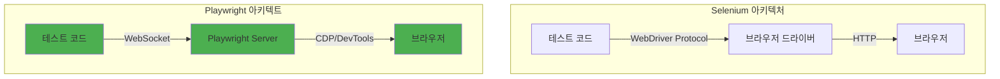

## 개요

현대 웹 애플리케이션 개발에서 E2E(End-to-End) 테스트는 필수불가결한 요소입니다. 하지만 테스트 코드 작성은 시간이 많이 걸리고, 유지보수가 어려우며, 복잡한 사용자 시나리오를 재현하기 까다롭습니다. <strong>Playwright와 AI 기술의 결합</strong> 은 이러한 문제를 혁신적으로 해결합니다.

### 왜 Playwright + AI인가?

전통적인 E2E 테스트의 문제점:

- <strong>시간 소모</strong>: 수동으로 모든 테스트 케이스를 작성해야 함
- <strong>유지보수 부담</strong>: UI 변경 시 테스트 코드 전체 수정 필요
- <strong>전문 지식 필요</strong>: Selector 작성, 비동기 처리, 대기 시간 조정 등

<strong>Playwright + AI 솔루션</strong>:

- ✅ <strong>AI Codegen</strong>: 브라우저 조작을 자동으로 코드로 변환
- ✅ <strong>MCP 통합</strong>: Claude와 Playwright를 연결하여 자연어로 테스트 생성
- ✅ <strong>자동 대기</strong>: Smart Auto-waiting으로 안정적인 테스트
- ✅ <strong>멀티 브라우저</strong>: Chromium, Firefox, WebKit 동시 지원

이 가이드에서는 <strong>Playwright MCP</strong>, <strong>AI Codegen</strong>, <strong>GitHub Actions 통합</strong>, <strong>시각적 회귀 테스트</strong>까지 실무에서 바로 적용할 수 있는 완벽한 자동화 테스트 시스템을 구축합니다.

---

## Playwright 핵심 개념

### 1. Playwright란?

Microsoft에서 개발한 <strong>크로스 브라우저 E2E 테스트 프레임워크</strong>입니다. Puppeteer의 후속작으로, 더 강력하고 안정적인 기능을 제공합니다.

<strong>핵심 특징</strong>:

```typescript
// 멀티 브라우저 지원
import { chromium, firefox, webkit } from "playwright";

// Chromium (Chrome, Edge)
const browser1 = await chromium.launch();

// Firefox
const browser2 = await firefox.launch();

// WebKit (Safari)
const browser3 = await webkit.launch();
```

### 2. Auto-waiting 메커니즘

Playwright의 가장 강력한 기능은 <strong>자동 대기(Auto-waiting)</strong>입니다. 수동으로 `sleep()`이나 `waitFor()`를 작성할 필요가 없습니다.

```typescript
// ❌ 전통적인 방식 (Selenium)
await driver.sleep(5000); // 무조건 5초 대기
const button = await driver.findElement(By.id("submit"));
await button.click();

// ✅ Playwright 방식
await page.click("#submit"); // 요소가 준비될 때까지 자동 대기
```

<strong>자동 대기 조건</strong>:

- 요소가 DOM에 존재
- 요소가 화면에 표시됨
- 요소가 활성화 상태 (disabled 아님)
- 요소가 다른 요소에 가려지지 않음

### 3. 강력한 Selector 엔진

Playwright는 다양한 Selector 전략을 제공합니다:

```typescript
// CSS Selector
await page.click("button.submit");

// Text Content
await page.click("text=로그인");

// ARIA Role (접근성 기반)
await page.click('role=button[name="제출"]');

// XPath
await page.click('xpath=//button[contains(text(), "확인")]');

// 조합 가능
await page.click('article:has-text("뉴스") >> button');
```

### 4. 아키텍처 비교



<strong>Playwright의 우수성</strong>:

- <strong>WebSocket 기반</strong>: HTTP보다 빠르고 안정적
- <strong>CDP(Chrome DevTools Protocol)</strong>: 브라우저 내부 API 직접 접근
- <strong>단일 프로세스</strong>: 드라이버 없이 직접 제어

---

## AI 기반 테스트 생성

### 1. Playwright Codegen

Playwright에 내장된 <strong>코드 생성기</strong>로, 브라우저 조작을 자동으로 TypeScript 코드로 변환합니다.

#### 기본 사용법

```bash
# Codegen 실행
npx playwright codegen https://example.com

# 특정 브라우저 지정
npx playwright codegen --browser=firefox https://example.com

# 모바일 디바이스 에뮬레이션
npx playwright codegen --device="iPhone 13" https://example.com

# 다크 모드
npx playwright codegen --color-scheme=dark https://example.com
```

#### Codegen 실습: 로그인 테스트

1. <strong>Codegen 시작</strong>:

```bash
npx playwright codegen https://github.com/login
```

2. <strong>브라우저에서 작업</strong>:

   - Username 입력
   - Password 입력
   - "Sign in" 버튼 클릭

3. <strong>자동 생성된 코드</strong>:

```typescript
import { test, expect } from "@playwright/test";

test("GitHub 로그인 테스트", async ({ page }) => {
  await page.goto("https://github.com/login");

  // Codegen이 자동 생성한 코드
  await page.getByLabel("Username or email address").fill("myusername");
  await page.getByLabel("Password").fill("mypassword");
  await page.getByRole("button", { name: "Sign in" }).click();

  // 로그인 성공 확인
  await expect(page).toHaveURL(/.*github\.com$/);
});
```

### 2. Playwright MCP (Model Context Protocol)

<strong>Claude와 Playwright를 연결</strong>하여 자연어로 테스트를 생성하는 혁신적인 방법입니다.

#### MCP 설치 및 설정

```bash
# 1. MCP 서버 설치
npm install -g @automatalabs/mcp-server-playwright

# 2. Claude 설정 파일 수정 (~/.claude/config.json)
{
  "mcpServers": {
    "playwright": {
      "command": "mcp-server-playwright"
    }
  }
}
```

#### MCP 실습: 자연어로 테스트 작성

<strong>자연어 명령</strong>:

```
"GitHub 저장소 페이지로 이동해서 Star 버튼을 클릭하는 테스트를 작성해줘"
```

<strong>Claude가 생성한 코드</strong>:

```typescript
import { test, expect } from "@playwright/test";

test("GitHub 저장소 Star 테스트", async ({ page }) => {
  // 1. 저장소 페이지 이동
  await page.goto("https://github.com/microsoft/playwright");

  // 2. Star 버튼 찾기 및 클릭
  const starButton = page.getByRole("button", { name: /star/i });
  await starButton.click();

  // 3. Star 성공 확인
  await expect(starButton).toHaveAttribute("aria-pressed", "true");

  // 4. Star 개수 증가 확인
  const starCount = page.locator(".Counter");
  await expect(starCount).toBeVisible();
});
```

### 3. MCP 고급 기능

#### 스냅샷 기반 테스트

```typescript
test("페이지 접근성 스냅샷", async ({ page }) => {
  await page.goto("https://example.com");

  // MCP의 browser_snapshot 기능 활용
  const snapshot = await page.accessibility.snapshot();

  // 스냅샷 검증
  expect(snapshot).toMatchSnapshot("homepage-a11y.json");
});
```

#### 멀티 페이지 조작

```typescript
test("새 탭에서 작업", async ({ context }) => {
  // 첫 번째 페이지
  const page1 = await context.newPage();
  await page1.goto("https://example.com");

  // 링크 클릭 시 새 탭 열기
  const [page2] = await Promise.all([
    context.waitForEvent("page"),
    page1.click('a[target="_blank"]'),
  ]);

  // 두 번째 페이지에서 작업
  await page2.waitForLoadState();
  await expect(page2).toHaveTitle(/새 페이지/);
});
```

---

## 실전 구현 가이드

### Step 1: 프로젝트 초기화

```bash
# 1. Playwright 프로젝트 생성
npm init playwright@latest

# 설정 선택
# ✓ TypeScript 선택
# ✓ tests 폴더 사용
# ✓ GitHub Actions workflow 추가
# ✓ Playwright 브라우저 설치

# 2. 프로젝트 구조 확인
playwright-demo/
├── tests/
│   └── example.spec.ts
├── playwright.config.ts
├── package.json
└── .github/
    └── workflows/
        └── playwright.yml
```

### Step 2: 설정 파일 최적화

```typescript
// playwright.config.ts
import { defineConfig, devices } from "@playwright/test";

export default defineConfig({
  // 테스트 파일 위치
  testDir: "./tests",

  // 병렬 실행
  fullyParallel: true,

  // CI 환경 설정
  forbidOnly: !!process.env.CI,
  retries: process.env.CI ? 2 : 0,
  workers: process.env.CI ? 1 : undefined,

  // 리포터 설정
  reporter: [
    ["html"], // HTML 리포트
    ["json", { outputFile: "test-results.json" }],
    ["junit", { outputFile: "junit.xml" }],
  ],

  // 전역 설정
  use: {
    // 기본 URL
    baseURL: "http://localhost:3000",

    // 트레이스 수집 (실패 시)
    trace: "on-first-retry",

    // 스크린샷 (실패 시)
    screenshot: "only-on-failure",

    // 비디오 녹화
    video: "retain-on-failure",
  },

  // 브라우저 설정
  projects: [
    {
      name: "chromium",
      use: { ...devices["Desktop Chrome"] },
    },
    {
      name: "firefox",
      use: { ...devices["Desktop Firefox"] },
    },
    {
      name: "webkit",
      use: { ...devices["Desktop Safari"] },
    },
    // 모바일 테스트
    {
      name: "Mobile Chrome",
      use: { ...devices["Pixel 5"] },
    },
    {
      name: "Mobile Safari",
      use: { ...devices["iPhone 13"] },
    },
  ],

  // 개발 서버 자동 실행
  webServer: {
    command: "npm run dev",
    url: "http://localhost:3000",
    reuseExistingServer: !process.env.CI,
  },
});
```

### Step 3: 첫 번째 테스트 작성

```typescript
// tests/login.spec.ts
import { test, expect } from "@playwright/test";

test.describe("로그인 기능", () => {
  // 테스트 전 실행
  test.beforeEach(async ({ page }) => {
    await page.goto("/login");
  });

  test("정상 로그인", async ({ page }) => {
    // 1. 로그인 폼 입력
    await page.fill('[name="email"]', "user@example.com");
    await page.fill('[name="password"]', "SecurePassword123!");

    // 2. 로그인 버튼 클릭
    await page.click('button[type="submit"]');

    // 3. 대시보드로 리다이렉트 확인
    await expect(page).toHaveURL("/dashboard");

    // 4. 환영 메시지 확인
    await expect(page.locator("h1")).toContainText("환영합니다");
  });

  test("잘못된 비밀번호", async ({ page }) => {
    await page.fill('[name="email"]', "user@example.com");
    await page.fill('[name="password"]', "WrongPassword");
    await page.click('button[type="submit"]');

    // 에러 메시지 확인
    const errorMsg = page.locator('[role="alert"]');
    await expect(errorMsg).toBeVisible();
    await expect(errorMsg).toContainText("비밀번호가 올바르지 않습니다");
  });

  test("이메일 형식 검증", async ({ page }) => {
    await page.fill('[name="email"]', "invalid-email");
    await page.fill('[name="password"]', "password123");

    // Submit 버튼이 비활성화되어야 함
    await expect(page.locator('button[type="submit"]')).toBeDisabled();
  });
});
```

### Step 4: Page Object Model (POM) 패턴

```typescript
// pages/LoginPage.ts
import { Page, Locator } from "@playwright/test";

export class LoginPage {
  readonly page: Page;
  readonly emailInput: Locator;
  readonly passwordInput: Locator;
  readonly submitButton: Locator;
  readonly errorMessage: Locator;

  constructor(page: Page) {
    this.page = page;
    this.emailInput = page.locator('[name="email"]');
    this.passwordInput = page.locator('[name="password"]');
    this.submitButton = page.locator('button[type="submit"]');
    this.errorMessage = page.locator('[role="alert"]');
  }

  async goto() {
    await this.page.goto("/login");
  }

  async login(email: string, password: string) {
    await this.emailInput.fill(email);
    await this.passwordInput.fill(password);
    await this.submitButton.click();
  }

  async getErrorMessage() {
    return this.errorMessage.textContent();
  }
}

// 테스트에서 사용
test("POM 패턴 로그인 테스트", async ({ page }) => {
  const loginPage = new LoginPage(page);

  await loginPage.goto();
  await loginPage.login("user@example.com", "password123");

  await expect(page).toHaveURL("/dashboard");
});
```

### Step 5: API Mocking

```typescript
// tests/api-mocking.spec.ts
import { test, expect } from "@playwright/test";

test("API 응답 모킹", async ({ page }) => {
  // API 요청 가로채기
  await page.route("**/api/user", async (route) => {
    await route.fulfill({
      status: 200,
      contentType: "application/json",
      body: JSON.stringify({
        id: 1,
        name: "Test User",
        email: "test@example.com",
      }),
    });
  });

  await page.goto("/profile");

  // 모킹된 데이터 확인
  await expect(page.locator(".user-name")).toHaveText("Test User");
  await expect(page.locator(".user-email")).toHaveText("test@example.com");
});

test("네트워크 오류 시뮬레이션", async ({ page }) => {
  // 네트워크 오류 발생
  await page.route("**/api/data", (route) => route.abort("failed"));

  await page.goto("/data-page");

  // 에러 상태 확인
  await expect(page.locator(".error-message")).toBeVisible();
});
```

---

## 고급 코드 예제

### 1. 파일 업로드 테스트

```typescript
test("파일 업로드", async ({ page }) => {
  await page.goto("/upload");

  // 파일 선택
  const fileInput = page.locator('input[type="file"]');
  await fileInput.setInputFiles("path/to/test-file.pdf");

  // 업로드 버튼 클릭
  await page.click('button:has-text("업로드")');

  // 업로드 성공 확인
  await expect(page.locator(".upload-success")).toBeVisible();

  // 여러 파일 업로드
  await fileInput.setInputFiles(["file1.pdf", "file2.jpg", "file3.png"]);
});
```

### 2. 드래그 앤 드롭

```typescript
test("드래그 앤 드롭", async ({ page }) => {
  await page.goto("/kanban-board");

  // 소스와 타겟 요소
  const task = page.locator(".task").first();
  const column = page.locator('.column[data-status="done"]');

  // 드래그 앤 드롭 실행
  await task.dragTo(column);

  // 이동 확인
  await expect(column.locator(".task")).toHaveCount(1);
});
```

### 3. 무한 스크롤 테스트

```typescript
test("무한 스크롤 로딩", async ({ page }) => {
  await page.goto("/infinite-scroll");

  // 초기 아이템 개수
  let itemCount = await page.locator(".item").count();
  expect(itemCount).toBe(20);

  // 스크롤하여 추가 로딩
  for (let i = 0; i < 3; i++) {
    // 페이지 끝까지 스크롤
    await page.evaluate(() => window.scrollTo(0, document.body.scrollHeight));

    // 새 아이템 로딩 대기
    await page.waitForFunction(
      (prevCount) => document.querySelectorAll(".item").length > prevCount,
      itemCount
    );

    itemCount = await page.locator(".item").count();
  }

  // 총 80개 아이템 로드됨
  expect(itemCount).toBe(80);
});
```

### 4. 웹소켓 테스트

```typescript
test("실시간 채팅 (WebSocket)", async ({ page }) => {
  await page.goto("/chat");

  // WebSocket 연결 대기
  await page.waitForEvent("websocket");

  // 메시지 전송
  await page.fill("#message-input", "Hello WebSocket!");
  await page.click("#send-button");

  // 메시지 수신 확인
  const lastMessage = page.locator(".message").last();
  await expect(lastMessage).toHaveText("Hello WebSocket!");

  // WebSocket 이벤트 모니터링
  page.on("websocket", (ws) => {
    ws.on("framesent", (event) => console.log("Sent:", event.payload));
    ws.on("framereceived", (event) => console.log("Received:", event.payload));
  });
});
```

### 5. 인증 상태 재사용

```typescript
// auth.setup.ts (한 번만 로그인)
import { test as setup } from "@playwright/test";

const authFile = "playwright/.auth/user.json";

setup("인증", async ({ page }) => {
  await page.goto("/login");
  await page.fill('[name="email"]', "user@example.com");
  await page.fill('[name="password"]', "password123");
  await page.click('button[type="submit"]');

  // 쿠키 저장
  await page.context().storageState({ path: authFile });
});

// playwright.config.ts
export default defineConfig({
  projects: [
    { name: "setup", testMatch: /.*\.setup\.ts/ },
    {
      name: "chromium",
      use: {
        ...devices["Desktop Chrome"],
        storageState: authFile, // 인증 상태 재사용
      },
      dependencies: ["setup"],
    },
  ],
});

// 이제 모든 테스트는 로그인된 상태로 시작
test("대시보드 접근", async ({ page }) => {
  await page.goto("/dashboard"); // 로그인 불필요
  await expect(page).toHaveURL("/dashboard");
});
```

---

## GitHub Actions CI/CD 통합

### 1. 기본 워크플로우

```yaml
# .github/workflows/playwright.yml
name: Playwright Tests

on:
  push:
    branches: [main, develop]
  pull_request:
    branches: [main, develop]

jobs:
  test:
    timeout-minutes: 60
    runs-on: ubuntu-latest

    steps:
      - uses: actions/checkout@v4

      - uses: actions/setup-node@v4
        with:
          node-version: 20

      - name: 의존성 설치
        run: npm ci

      - name: Playwright 브라우저 설치
        run: npx playwright install --with-deps

      - name: 테스트 실행
        run: npx playwright test

      - name: 테스트 리포트 업로드
        uses: actions/upload-artifact@v4
        if: always()
        with:
          name: playwright-report
          path: playwright-report/
          retention-days: 30
```

### 2. 멀티 브라우저 매트릭스

```yaml
jobs:
  test:
    strategy:
      matrix:
        browser: [chromium, firefox, webkit]
        os: [ubuntu-latest, windows-latest, macos-latest]

    runs-on: ${{ matrix.os }}

    steps:
      - uses: actions/checkout@v4
      - uses: actions/setup-node@v4
        with:
          node-version: 20

      - run: npm ci
      - run: npx playwright install --with-deps ${{ matrix.browser }}
      - run: npx playwright test --project=${{ matrix.browser }}
```

### 3. 시각적 회귀 테스트 통합

```yaml
jobs:
  visual-regression:
    runs-on: ubuntu-latest

    steps:
      - uses: actions/checkout@v4
      - uses: actions/setup-node@v4

      - run: npm ci
      - run: npx playwright install --with-deps

      # 스크린샷 비교
      - name: 시각적 회귀 테스트
        run: npx playwright test --update-snapshots
        if: github.event_name == 'push'

      # 차이점 리포트
      - name: 스냅샷 차이 업로드
        uses: actions/upload-artifact@v4
        if: failure()
        with:
          name: snapshot-diff
          path: test-results/**/*-diff.png
```

### 4. Slack 알림 통합

```yaml
- name: Slack 알림
  if: failure()
  uses: slackapi/slack-github-action@v1
  with:
    payload: |
      {
        "text": "❌ Playwright 테스트 실패!",
        "blocks": [
          {
            "type": "section",
            "text": {
              "type": "mrkdwn",
              "text": "*Repository:* ${{ github.repository }}\n*Branch:* ${{ github.ref }}\n*Author:* ${{ github.actor }}"
            }
          },
          {
            "type": "actions",
            "elements": [
              {
                "type": "button",
                "text": {
                  "type": "plain_text",
                  "text": "View Logs"
                },
                "url": "${{ github.server_url }}/${{ github.repository }}/actions/runs/${{ github.run_id }}"
              }
            ]
          }
        ]
      }
  env:
    SLACK_WEBHOOK_URL: ${{ secrets.SLACK_WEBHOOK_URL }}
```

---

## 시각적 회귀 테스트

### 1. 스크린샷 비교

```typescript
// tests/visual.spec.ts
import { test, expect } from "@playwright/test";

test("홈페이지 시각적 검증", async ({ page }) => {
  await page.goto("/");

  // 전체 페이지 스크린샷
  await expect(page).toHaveScreenshot("homepage.png");

  // 특정 요소만
  const header = page.locator("header");
  await expect(header).toHaveScreenshot("header.png");

  // 임계값 설정 (픽셀 차이 허용)
  await expect(page).toHaveScreenshot("homepage-flexible.png", {
    maxDiffPixels: 100,
  });
});
```

### 2. 반응형 디자인 테스트

```typescript
const viewports = [
  { width: 375, height: 667, name: "mobile" },
  { width: 768, height: 1024, name: "tablet" },
  { width: 1920, height: 1080, name: "desktop" },
];

for (const viewport of viewports) {
  test(`${viewport.name} 뷰포트 테스트`, async ({ page }) => {
    await page.setViewportSize(viewport);
    await page.goto("/");

    await expect(page).toHaveScreenshot(`${viewport.name}-homepage.png`);
  });
}
```

### 3. 다크 모드 비교

```typescript
test("라이트/다크 모드 비교", async ({ page }) => {
  await page.goto("/");

  // 라이트 모드
  await expect(page).toHaveScreenshot("light-mode.png");

  // 다크 모드 전환
  await page.emulateMedia({ colorScheme: "dark" });
  await expect(page).toHaveScreenshot("dark-mode.png");
});
```

### 4. 애니메이션 비활성화

```typescript
test("애니메이션 없이 스크린샷", async ({ page }) => {
  await page.goto("/");

  // CSS 애니메이션 비활성화
  await page.addStyleTag({
    content: `
      *, *::before, *::after {
        animation-duration: 0s !important;
        transition-duration: 0s !important;
      }
    `,
  });

  await expect(page).toHaveScreenshot("no-animation.png");
});
```

---

## 베스트 프랙티스

### 1. Selector 작성 원칙

```typescript
// ❌ 나쁜 예: 취약한 Selector
await page.click(".btn-primary.submit-form");
await page.click("div > div > button:nth-child(3)");

// ✅ 좋은 예: 의미 있는 Selector
await page.click('[data-testid="submit-button"]');
await page.getByRole("button", { name: "제출" });
await page.getByLabel("이메일 주소");

// HTML에 test-id 추가
<button data-testid="submit-button">제출</button>;
```

### 2. 대기 전략

```typescript
// ❌ 하드 코딩된 대기 (안티패턴)
await page.waitForTimeout(5000);

// ✅ 조건 기반 대기
await page.waitForSelector(".loading-spinner", { state: "hidden" });
await page.waitForLoadState("networkidle");
await page.waitForResponse((resp) => resp.url().includes("/api/data"));

// ✅ Auto-waiting 활용
await page.click("button"); // 자동으로 클릭 가능할 때까지 대기
```

### 3. 테스트 격리

```typescript
// ✅ 각 테스트마다 독립적인 컨텍스트
test.describe("사용자 관리", () => {
  test.beforeEach(async ({ page }) => {
    // 매 테스트마다 초기화
    await page.goto("/users");
  });

  test("사용자 추가", async ({ page }) => {
    // 독립적인 테스트
  });

  test("사용자 삭제", async ({ page }) => {
    // 이전 테스트에 영향받지 않음
  });
});
```

### 4. 에러 핸들링

```typescript
test("네트워크 오류 처리", async ({ page }) => {
  // 콘솔 에러 캡처
  const errors: string[] = [];
  page.on("console", (msg) => {
    if (msg.type() === "error") {
      errors.push(msg.text());
    }
  });

  await page.goto("/");

  // 에러 없음 확인
  expect(errors).toHaveLength(0);
});

test("404 페이지 처리", async ({ page }) => {
  const response = await page.goto("/non-existent-page");
  expect(response?.status()).toBe(404);

  await expect(page.locator("h1")).toHaveText("페이지를 찾을 수 없습니다");
});
```

### 5. 테스트 데이터 관리

```typescript
// fixtures/testData.ts
export const testUsers = {
  admin: {
    email: "admin@example.com",
    password: "AdminPass123!",
  },
  user: {
    email: "user@example.com",
    password: "UserPass123!",
  },
};

// 테스트에서 사용
import { testUsers } from "./fixtures/testData";

test("관리자 로그인", async ({ page }) => {
  await loginPage.login(testUsers.admin.email, testUsers.admin.password);
});
```

### 6. 병렬 실행 최적화

```typescript
// playwright.config.ts
export default defineConfig({
  // CPU 코어 수에 따라 자동 조정
  workers: process.env.CI ? 2 : undefined,

  // 테스트 간 완전 격리
  fullyParallel: true,

  // 실패 시 재시도
  retries: 2,

  // 타임아웃 설정
  timeout: 30000,
  expect: {
    timeout: 5000,
  },
});
```

---

## 실무 활용 시나리오

### 1. E-commerce 체크아웃 플로우

```typescript
test("전체 구매 프로세스", async ({ page }) => {
  // 1. 상품 검색
  await page.goto("/");
  await page.fill('[name="search"]', "Laptop");
  await page.press('[name="search"]', "Enter");

  // 2. 상품 선택
  await page.click('.product-card:has-text("MacBook Pro")');
  await expect(page).toHaveURL(/\/product\/\d+/);

  // 3. 장바구니 추가
  await page.click('button:has-text("장바구니 담기")');
  await expect(page.locator(".cart-badge")).toHaveText("1");

  // 4. 장바구니 확인
  await page.click('[aria-label="장바구니"]');
  await expect(page.locator(".cart-item")).toHaveCount(1);

  // 5. 결제 진행
  await page.click('button:has-text("결제하기")');

  // 6. 배송지 입력
  await page.fill('[name="address"]', "서울시 강남구");
  await page.fill('[name="phone"]', "010-1234-5678");

  // 7. 결제 방법 선택
  await page.click('[value="credit-card"]');

  // 8. 주문 완료
  await page.click('button:has-text("주문하기")');

  // 9. 완료 페이지 확인
  await expect(page).toHaveURL("/order/success");
  await expect(page.locator("h1")).toContainText("주문이 완료되었습니다");
});
```

### 2. 폼 검증 테스트

```typescript
test.describe("회원가입 폼 검증", () => {
  test("이메일 중복 체크", async ({ page }) => {
    await page.goto("/signup");
    await page.fill('[name="email"]', "existing@example.com");

    // 실시간 검증
    await page.waitForResponse((resp) =>
      resp.url().includes("/api/check-email")
    );

    const errorMsg = page.locator(".email-error");
    await expect(errorMsg).toHaveText("이미 사용 중인 이메일입니다");
  });

  test("비밀번호 강도 검사", async ({ page }) => {
    await page.goto("/signup");

    const passwordInput = page.locator('[name="password"]');
    const strengthIndicator = page.locator(".password-strength");

    // 약한 비밀번호
    await passwordInput.fill("123");
    await expect(strengthIndicator).toHaveClass(/weak/);

    // 강한 비밀번호
    await passwordInput.fill("MySecure@Pass123");
    await expect(strengthIndicator).toHaveClass(/strong/);
  });
});
```

### 3. 성능 모니터링

```typescript
test("페이지 로딩 성능", async ({ page }) => {
  // Performance API 사용
  await page.goto("/");

  const metrics = await page.evaluate(() => {
    const navigation = performance.getEntriesByType(
      "navigation"
    )[0] as PerformanceNavigationTiming;
    return {
      domContentLoaded:
        navigation.domContentLoadedEventEnd - navigation.fetchStart,
      loadComplete: navigation.loadEventEnd - navigation.fetchStart,
      firstPaint: performance.getEntriesByType("paint")[0]?.startTime,
    };
  });

  // 성능 기준 검증
  expect(metrics.domContentLoaded).toBeLessThan(2000); // 2초 이내
  expect(metrics.loadComplete).toBeLessThan(5000); // 5초 이내

  console.log("성능 지표:", metrics);
});
```

---

## 주의사항 및 트러블슈팅

### 1. 일반적인 문제

#### Timeout 오류

```typescript
// ❌ 문제: 기본 30초 타임아웃 초과
test("느린 API 테스트", async ({ page }) => {
  await page.goto("/slow-page"); // TimeoutError!
});

// ✅ 해결: 타임아웃 증가
test("느린 API 테스트", async ({ page }) => {
  test.setTimeout(60000); // 60초로 증가
  await page.goto("/slow-page", { timeout: 60000 });
});
```

#### Flaky 테스트

```typescript
// ❌ 불안정한 테스트
test("flaky 테스트", async ({ page }) => {
  await page.click("button"); // 가끔 실패
  await expect(page.locator(".result")).toBeVisible();
});

// ✅ 안정적인 테스트
test("stable 테스트", async ({ page }) => {
  await page.click("button");
  // 네트워크 요청 대기
  await page.waitForResponse((resp) => resp.url().includes("/api"));
  await expect(page.locator(".result")).toBeVisible();
});
```

### 2. 디버깅 팁

```bash
# UI 모드로 테스트 실행 (시각적 디버깅)
npx playwright test --ui

# 헤드풀 모드 (브라우저 보이기)
npx playwright test --headed

# 특정 테스트만 실행
npx playwright test login.spec.ts

# 디버그 모드
npx playwright test --debug

# 트레이스 뷰어
npx playwright show-trace trace.zip
```

### 3. CI 환경 최적화

```typescript
// playwright.config.ts
export default defineConfig({
  use: {
    // CI에서는 트레이스 항상 수집
    trace: process.env.CI ? "on" : "on-first-retry",

    // CI에서는 비디오 녹화 비활성화 (디스크 공간)
    video: process.env.CI ? "retain-on-failure" : "on",

    // CI에서 더 긴 타임아웃
    actionTimeout: process.env.CI ? 10000 : 5000,
  },
});
```

---

## 결론

<strong>Playwright + AI</strong>는 E2E 테스트 자동화의 패러다임을 바꿨습니다. 이 가이드에서 다룬 내용을 정리하면:

### 핵심 요약

1. <strong>AI 기반 코드 생성</strong>: Codegen과 MCP로 테스트 코드 작성 시간 80% 단축
2. <strong>안정적인 테스트</strong>: Auto-waiting과 스마트 Selector로 flaky 테스트 제거
3. <strong>CI/CD 통합</strong>: GitHub Actions로 모든 커밋마다 자동 테스트
4. <strong>시각적 회귀 테스트</strong>: 스크린샷 비교로 UI 버그 사전 방지
5. <strong>크로스 브라우저</strong>: Chromium, Firefox, WebKit 동시 테스트

### 즉시 시작하기

```bash
# 1. 프로젝트 초기화
npm init playwright@latest

# 2. 첫 테스트 실행
npx playwright test

# 3. HTML 리포트 확인
npx playwright show-report

# 4. AI로 테스트 생성
npx playwright codegen https://your-app.com
```

### 다음 단계

- <strong>고급 패턴</strong>: Custom Fixtures, Global Setup, Test Sharding
- <strong>성능 테스트</strong>: Lighthouse CI 통합
- <strong>접근성 테스트</strong>: axe-core 통합
- <strong>모바일 테스트</strong>: 실제 디바이스 클라우드 연동

<strong>Playwright + AI</strong>는 단순한 테스트 도구를 넘어, <strong>개발 생산성을 혁신하는 필수 도구</strong>입니다. 지금 바로 시작하세요!

---

## 참고 자료

### 공식 문서

- [Playwright 공식 문서](https://playwright.dev/)
- [Playwright MCP GitHub](https://github.com/automatalabs/playwright-mcp)
- [Microsoft Playwright Blog](https://devblogs.microsoft.com/playwright/)

### 튜토리얼 및 가이드

- [Playwright Test Best Practices](https://playwright.dev/docs/best-practices)
- [Visual Regression Testing Guide](https://playwright.dev/docs/test-snapshots)
- [GitHub Actions Integration](https://playwright.dev/docs/ci)

### 커뮤니티 및 도구

- [Playwright Discord](https://discord.gg/playwright)
- [Awesome Playwright](https://github.com/mxschmitt/awesome-playwright)
- [Playwright Solutions](https://playwright.solutions/)

### 관련 기술

- [Testing Library](https://testing-library.com/)
- [Cypress](https://www.cypress.io/)
- [Puppeteer](https://pptr.dev/)

---

<strong>작성일</strong>: 2025년 10월 25일
<strong>카테고리</strong>: E2E Testing, Automation, TypeScript
<strong>난이도</strong>: 중급〜고급
