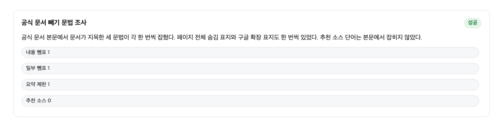
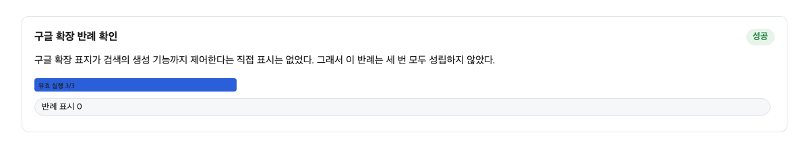
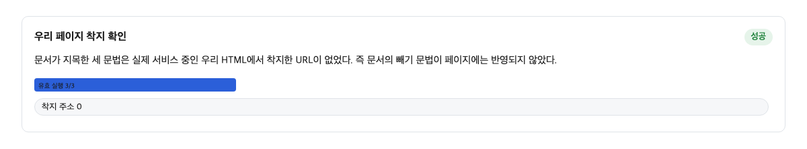
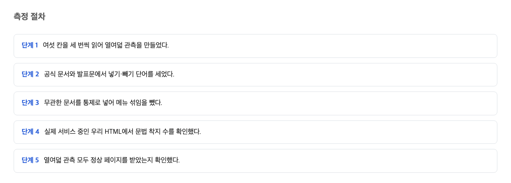

웹사이트를 운영하는 사람이라면 이것 하나만 기억하면 된다. 구글의 새로운 AI 검색에 내 사이트를 보여 주는 방법은 안내 문서와 버튼 코드까지 만들어 준다. 반면 내 사이트를 빼는 방법은 개발자 문서의 한 문장에 전부 들어 있다. 그리고 그 한 문장이 가리키는 표시는 우리 회사 페이지 12곳 중 어디에도 실려 있지 않았다.

## 2026-08-20 발표와 문서 갱신

2026년 8월 20일에 구글이 새 기능을 발표했다. 이용자가 자기가 선호하는 사이트를 골라 두면 AI 검색 답변에서 그 사이트의 내용에 선호 표시가 붙는다. 그 내용이 강조되어 보이는 기능이다. 사이트 운영자 입장에서는 내 사이트가 AI 검색에서 더 눈에 띄게 되는 길이 열린 셈이다.

발표와 같은 날짜에 구글은 이 기능 전용의 공식 안내 문서도 새로 올렸다. 발표문에는 이렇게 쓰여 있다.

> If you're a publisher, you can find the new "Preferred Source" button code in our Google Search Central documentation to get started.
> — [Personalize search and discover news with preferred sources](https://blog.google/products-and-platforms/products/search/personalize-search-discover-news/)

한국어로 옮기면 이렇다. 사이트 발행자라면 시작하기 위한 새 선호 소스 버튼 코드를 구글 검색 센터 문서에서 찾을 수 있다는 뜻이다. 즉 들어가는 방법은 발표에서부터 바로 안내 문서로 연결되어 있다.

그러니까 내 입장에서 달라지는 건 이것이다. 사이트를 AI 검색에 더 잘 나오게 하고 싶다면 구글이 이미 문을 넓게 열어 두었고, 그 문으로 걸어 들어가는 절차까지 문서로 만들어 두었다.

## 공식 문서에서 빼는 방법은 한 문장뿐이다

반대로 빼는 쪽은 이야기가 다르다. 빼는 방법을 제어 지시자라고 부르는데, 쉽게 말해 내 페이지에 붙여 두는 "이건 보여 주지 마" 표지다.

구글의 AI 검색 기능 안내 문서에서 빼기 방법을 다룬 문장은 단 한 줄이었다. 그리고 그 한 줄에는 네 가지 표지가 전부 묶여 있다.

> To limit the information shown from your pages in Search, use nosnippet, data-nosnippet, max-snippet, or noindex controls.
> — [AI features / Google Search Central](https://developers.google.com/search/docs/appearance/ai-features)

뜻을 풀면 이렇다. 검색 결과에 내 페이지의 정보가 나오는 양을 줄이려면 네 가지 표지 가운데 하나를 쓰라는 것. 네 이름 모두 페이지에 붙이는 표지 문구인데, 예컨대 noindex는 이 페이지를 보여 주지 말라는 표지다. 이 네 가지를 세어 보면 각각 1번씩만 등장했다.

더 확인한 것이 있다. 같은 문서에서 "빠진다"거나 "제외된다"라는 뜻의 말을 찾아 보았다. 그런 표현은 0건이었다. 즉 빼기 방법 전체가 저 한 문장 안에 담겨 있는 것이다.

여기서 내가 해야 할 일은 분명하다. AI 검색에서 내 사이트가 나오는 것을 줄이고 싶은 사람은, 구글이 알려 주는 저 네 가지 표지가 내 페이지에 실제로 적혀 있는지 목록을 만들어 세어 보면 된다.

## 들어가는 방법의 전용 문서와 버튼 코드

이 비대칭을 동네 시장에 비유해 보자. 시장 입구에는 새 가게 개업을 알리는 큰 안내문이 걸려 있고, 손님을 부르는 방법이 책 한 권으로 정리되어 나눠진다. 그런데 가게를 그만두고 나가는 방법은 안내 어디에도 없고, 관리 사무소 게시판 구석의 짧은 규정 한 줄에만 적혀 있는 셈이다.

실제로 구글 문서 왼쪽의 목록을 모두 세면 154개의 경로가 있는데, 그중 선호 소스 전용 문서가 하나로 존재했다. 그 문서는 접속이 잘 되었고, 마지막 갱신 날짜가 2026-08-20으로 발표와 같은 날이었다. 반면 그 전용 문서에서 빼기 안내 문구는 0건이었다. 발표문에서도 선호 소스라는 말이 7번 나왔지만, 검색에서 빼는 방법에 대한 말은 사실상 나오지 않았다. 발표문에서 "빼다"라는 단어가 나온 유일한 곳은 뉴스레터 수신 거지 문구였다.

결론은 단순하다. 구글은 사람들을 들이는 문은 넓게, 나가는 문은 좁게 지었다. 그리고 그 좁은 문이 어디 있는지는 각자 찾아서 알아야 한다.

## Google-Extended 가 검색 포함에 영향 없다는 공식 문장

여기서 많은 사이트 운영자가 오해하는 부분이 있다. 구글에는 구글 확장용 로봇이라는 이름의 차단 표지가 있다. 사이트 소유자가 설정 파일에 한 줄을 적어 두면, 구글의 다른 시스템이 내 콘텐츠를 쓰지 못하게 막는 표지다.

많은 사람이 이것을 "AI 검색에서 빼는 방법"으로 믿는다. 그런데 구글의 공식 문서는 정반대를 말한다.

> Google-Extended does not impact a site's inclusion in Google Search nor is it used as a ranking signal in Google Search.
> — [Google-Extended / Google Search Central](https://developers.google.com/search/docs/crawling-indexing/google-common-crawlers)

번역하면 이렇다. 이 표지는 내 사이트가 구글 검색에 포함되는 데 아무 영향이 없고, 검색 순위에도 쓰이지 않는다는 것이다.

이 절이 중요한 이유는 이렇다. 구글은 AI 검색을 "검색 안에 들어 있는 기능"으로 규정한다. 그래서 검색에 나오게 할지 말지를 정하는 표지 하나가 AI 검색 제어까지 겸하는 구조다. 공식 문서 표면에는 별도의 AI 검색 차단 스위치가 나오지 않는다. 차단 표지로 걸어 두어도 검색에는 그대로 나온다. 만약 어느 날 그 차단 표지가 검색까지 막는다고 공식 문서가 말하기 시작하면, 이 글의 판단은 틀린 것으로 바뀐다.

설정 파일에 차단 줄을 적어 두고 "AI 차단은 끝났다"고 믿고 있었다면, 그 믿음은 구글 공식 기준으로는 사실이 아니다.

## 우리 사이트 12개 페이지에는 빼기 표지가 하나도 없었다

그렇다면 우리 사이트는 어떤 상태였을까. 서비스 중인 페이지 12곳을 표본으로 삼아, 빼기 표지가 실제로 적혀 있는지 확인했다.

결과는 0곳이었다. 12개 페이지 전부 페이지 안에 어떤 제어 표지도 없었다. 한편 우리가 걸어 둔 것은 따로 있었다. 차단 표지 두 줄과 콘텐츠 신호라는 또 다른 표지 하나였다. 즉 "AI와 관련된 설정은 켜 두었는데", 정작 구글이 AI 검색 빼기의 공식 경로로 지목한 그 표지는 어디에도 실려 있지 않았다.

이게 나한테 뭘 뜻하냐면, 설정 파일에 뭔가를 적어 둔 것과 실제 페이지에 표지가 붙는 것은 별개라는 점이다. "차단했다고 믿는 안전"은 설정 줄 몇 개로 만들어지기 쉽고, 실제로 페이지에 붙어 있는지는 따로 세어 봐야 보인다.

## 측정 방법과 통제

이 수치들은 어떻게 잰 것일까. 세 개의 표면을 대상으로 측정했다. 구글의 개발자 문서, 구글의 발표문, 그리고 우리 회사의 실제 배포 페이지가 그 세 곳이다. 2026년 8월 21일에 각 페이지를 가져와서, 빼기 표지 이름과 "빼다"라는 뜻의 단어가 몇 번 나오는지 세었다. 같은 날짜에 18번의 측정을 돌렸고, 광고 문구 같은 다른 이유로 우연히 단어가 나오는 경우는 미리 빼고 계산했다.

페이지를 가져오는 데 쓴 도구는 컴퓨터에서 페이지를 열어 내용을 긁어 오는 보통의 도구들이었다. 브라우저로 직접 열었을 때와 같은 방식으로 접근했다. 즉 사람이 문서를 눈으로 읽고 세는 것과 같은 결과를 기계로 반복한 것이다.

다만 여기서 짚어야 할 반대 의견이 있다. 빼는 방법이 한 문장인 것은 문제가 아니라는 해석이 가능하다는 점이다. 저 네 가지 표지는 여러 해 동안 검증되어 온 표준이고, 구글 입장에서는 AI 검색을 검색의 일부로 보니까 기존 표지로 제어하는 것이 일관된 설계라는 주장이다. 이 논리 자체는 옳다. 하지만 같은 날짜에 들어가는 문에는 전용 문서와 버튼 코드가 지어졌고, 나가는 문은 단어 네 개짜리 한 문장이었다. 문서의 논리가 맞아도 두 문의 두께 차이는 수치로 실재한다.

## 배포 점검 체크리스트에 추가할 두 항목

이 비대칭을 팀 차원에서 다루려면 두 줄만 추가하면 된다.

첫째, 배포 점검 목록에 "빼기 표지가 붙은 페이지 목록" 항목을 넣는다. 페이지 목록 전체에서 표본을 뽑아 각 페이지에 제어 표지가 실제로 있는지 세고, 우리가 의도한 상태와 맞는지 대조한다. 이번처럼 12곳을 세면 의외의 사실이 바로 드러난다.

둘째, 설정 파일에 적은 차단 줄은 검색 포함과 무관하다는 구글의 공식 문장을 팀 문서에 그대로 인용으로 붙여 둔다. "차단했다"는 믿음이 점검 없이 퍼지는 것을 막아 준다.

AI 검색에서 내 사이트가 나오는 것을 늘리고 싶은 사람은, 구글이 발표한 들어가는 방법의 안내 문서를 찾아 그 절차를 그대로 따라 하면 된다. 전용 문서와 버튼 코드가 이미 준비되어 있으므로 절차만 옮기면 된다.

## 이 글이 확인하지 못한 것

이 글은 세 가지를 확인하지 못했다. 첫째, 구글의 운영 관리 화면 안에 선호 소스를 고르고 빼는 실제 스위치가 어떻게 보이는지는 로그인이 필요해 세지 못했다. 공식 문서 표면에 없다는 것까지만 말할 수 있다. 둘째, 다른 사이트들의 빼기 표지 사용률은 우리 한 곳 표본이라 알 수 없다. 셋째, 빼기 표지가 실제 AI 답변 인용에 어떤 효과를 주는지는 이번에 재지 않았다. 다음 과제는 운영 관리 화면의 실제 모습을 확인하는 것이다.

빼고 싶은 사람은 자기 페이지에 빼기 문법이 실제로 적혀 있는지 목록을 만들어 세면 되고, 넣고 싶은 사람은 구글이 공지한 들어가는 방법의 안내 문서를 찾아 절차를 따라 하면 된다. 이 판단이 틀릴 조건은 이것이다. 공식 문서에 저 네 가지 표지와 별개로, AI 검색에서 사이트를 빼는 전용 방법이 새로 등장하면 이 글의 주장은 틀린 것으로 간주한다.

## 참고 자료

1. AI features / Google Search Central — Google — https://developers.google.com/search/docs/appearance/ai-features
2. AI features / Google Search Central (Google-Extended 분리 문장) — Google — https://developers.google.com/search/docs/appearance/ai-features
3. Google-Extended / Google Search Central (google-common-crawlers) — Google — https://developers.google.com/search/docs/crawling-indexing/google-common-crawlers
4. Preferred sources / Google Search Central — Google — https://developers.google.com/search/docs/appearance/preferred-sources
5. Personalize search and discover news with preferred sources / Google blog 발표문 (Aug 20, 2026) — Google — https://blog.google/products-and-platforms/products/search/personalize-search-discover-news/