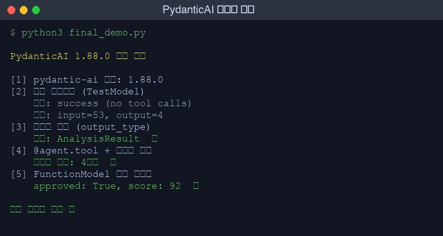

```python
from pydantic_ai import Agent
from pydantic_ai.models.test import TestModel

agent = Agent('test', system_prompt='Python 전문가')
result = agent.run_sync('f-string과 .format() 중 어느 게 더 빠른가요?', model=TestModel())
print(result.output)  # → success (no tool calls)
```

이 코드가 API 키 없이 돌아가는 걸 처음 봤을 때 좀 놀랐다. FastAPI를 처음 쓸 때처럼 — 구조가 너무 직관적이라 오히려 의심이 갔다. PydanticAI는 그런 라이브러리다.

솔직히 처음에는 "그냥 Instructor에 래퍼 씌운 거 아닌가"라고 봤다. 써보고 나서야 생각이 달라졌다. FastAPI처럼 타입 시스템을 중심으로 설계된 프레임워크인데, AI 에이전트에 그 철학을 그대로 가져온 것이다. 오늘은 직접 설치하고 돌려본 결과를 정리한다. 실패한 테스트도 포함해서.

## 왜 PydanticAI인가: 기존 비교와 다른 관점

[Python AI 에이전트 라이브러리 비교](/ko/blog/ko/python-ai-agent-library-comparison-2026)에서 PydanticAI·Instructor·Smolagents를 다룬 적이 있다. 그 포스트가 "무엇을 선택할까"를 다룬다면, 이번 포스트는 "PydanticAI로 실제로 어떻게 만드는가"다. 구현 방법이 목적이다.

핵심 차별화 포인트를 짧게 정리하면 이렇다:

| 라이브러리 | 핵심 역할 | 에이전트 루프 | 타입 안전성 |
|-----------|----------|------------|-----------|
| Instructor | LLM 출력 파싱 도구 | 없음 | 구조화 출력만 |
| PydanticAI | 에이전트 프레임워크 | 완전 지원 | 입출력 + 도구 전체 |
| LangGraph | 오케스트레이션 | 그래프 기반 | 약함 |
| CrewAI | 멀티에이전트 팀 | 역할 기반 | 약함 |

특히 두 번째 행이 실제로 쓸 때 차이를 만든다. LLM이 도구를 호출하고, 그 결과를 다시 받아 처리하는 전체 루프에서 타입이 유지된다. 런타임 오류가 개발 중 IDE 오류로 앞당겨진다.

그리고 GitHub stars 16K+. FastAPI처럼 Pydantic 팀이 만든 것이니 유지보수 걱정은 덜하다.

## 설치 및 Prerequisites

```bash
pip install pydantic-ai
```

오늘 기준(2026년 4월 29일) 최신 버전은 1.88.0이다. 설치는 단순하다.

환경을 분리하고 싶다면:

```bash
python3 -m venv venv
source venv/bin/activate  # Windows: venv\Scripts\activate
pip install pydantic-ai
```

프로바이더별 추가 패키지는 사용 시점에 설치하면 된다:

```bash
pip install pydantic-ai[anthropic]   # Claude 사용 시
pip install pydantic-ai[openai]       # OpenAI GPT 사용 시
pip install pydantic-ai[google]       # Gemini 사용 시
```

**Requirements**:
- Python 3.9 이상
- pydantic v2 (v1은 지원 안 함)
- API 키 없이도 TestModel로 기본 동작 확인 가능

## 첫 번째 에이전트: TestModel로 구조 검증하기

에이전트를 만들 때 내가 가장 먼저 쓰는 패턴이다. 실제 API를 붙이기 전에 에이전트 구조가 올바른지 확인하는 것이다.

```python
from pydantic_ai import Agent
from pydantic_ai.models.test import TestModel

# 가장 단순한 에이전트
agent = Agent(
    'test',                              # TestModel 지정 시 'test' 사용
    system_prompt='당신은 Python 코드 리뷰어입니다. 간결하게 답변하세요.',
)

result = agent.run_sync(
    'f-string과 .format() 중 어느 게 더 빠른가요?',
    model=TestModel()  # API 키 불필요
)

print(result.output)    # → "success (no tool calls)"
print(result.usage())   # → RunUsage(input_tokens=64, output_tokens=4, requests=1)
```

`TestModel`은 API를 호출하지 않는다. 에이전트의 구조, 도구 설정, 의존성 주입이 올바른지 확인하기 위한 테스트 전용 모델이다. CI 파이프라인에서 API 비용 없이 에이전트 로직을 검증할 때 활용한다.

실제 Claude를 붙이려면 모델 문자열 하나만 바꾸면 된다:

```python
import os
os.environ['ANTHROPIC_API_KEY'] = 'sk-ant-...'

# 개발 중: TestModel
result = agent.run_sync('코드 리뷰해줘', model=TestModel())

# 프로덕션: 실제 Claude
result = agent.run_sync('코드 리뷰해줘', model='anthropic:claude-sonnet-4-6')
```

에이전트 코드는 그대로다. 모델만 교체한다.

## 구조화 출력: output_type으로 Pydantic 모델 반환

여기서부터 PydanticAI의 핵심이다. LLM이 자유 텍스트가 아닌 Pydantic 모델 인스턴스를 반환하도록 강제할 수 있다.

**중요 — v1.88.0 Breaking Change**: `result_type` 파라미터가 `output_type`으로 변경됐다. 구버전 문서나 튜토리얼을 그대로 쓰면 다음 오류가 난다:

```
pydantic_ai.exceptions.UserError: Unknown keyword arguments: `result_type`
```

직접 맞닥뜨렸다. `inspect.signature(Agent.__init__)`로 확인해보니 `output_type`이 정확한 파라미터명이었다. 공식 문서가 구버전 기준으로 쓰여 있는 경우가 있으니 주의가 필요하다.

```python
from pydantic import BaseModel, Field
from pydantic_ai import Agent

class CodeReview(BaseModel):
    severity: str = Field(description="'low', 'medium', 'high' 중 하나")
    issues: list[str] = Field(description="발견된 문제 목록")
    suggestions: list[str] = Field(description="개선 제안 목록")
    score: int = Field(ge=0, le=100, description="코드 품질 점수 (0-100)")

review_agent = Agent(
    'anthropic:claude-sonnet-4-6',
    output_type=CodeReview,  # ← v1.88.0: result_type이 아님
    system_prompt='Python 코드를 리뷰하고 구조화된 피드백을 제공하세요.',
)

result = review_agent.run_sync('''
def get_user(id):
    db = connect()
    return db.query(f"SELECT * FROM users WHERE id={id}")
''')

# 반환값이 dict나 str이 아닌 Pydantic 모델 인스턴스
print(type(result.output))         # → <class '__main__.CodeReview'>
print(result.output.severity)      # → 'high'
print(result.output.score)         # → 25
print(result.output.issues[0])     # → 'SQL injection 취약점'

# 타입 검증이 자동으로 됨
# score가 0-100 범위를 벗어나면 ValidationError
# issues가 list가 아니면 ValidationError
```

반환값이 Pydantic 모델이라 IDE 자동완성이 작동한다. `result.output.`을 입력하면 `severity`, `issues`, `suggestions`, `score` 필드가 자동으로 뜬다. 이게 "타입 안전성"의 체감 차이다.

### 자동 재시도 메커니즘

LLM이 스키마에 맞지 않는 출력을 내놓으면 어떻게 될까. `retries` 파라미터로 지정한 횟수만큼 PydanticAI가 ValidationError 내용을 LLM에게 피드백하고 재시도를 요청한다:

```python
review_agent = Agent(
    'anthropic:claude-sonnet-4-6',
    output_type=CodeReview,
    retries=3,       # 출력 유효성 검사 실패 시 최대 3회 재시도
    output_retries=2 # output 전용 재시도 횟수 별도 지정 가능
)
```

3회 모두 실패하면 `UnexpectedModelBehavior` 예외가 발생한다. 이 메커니즘은 실제 프로덕션에서 중요하다. 모델이 간헐적으로 잘못된 형식을 반환하는 경우를 자동으로 처리할 수 있다.

## @agent.tool과 의존성 주입: FastAPI의 Depends()와 같은 패턴

에이전트에 외부 기능을 붙이는 방법이다. 구조가 FastAPI와 매우 유사하다.

```python
from pydantic_ai import Agent, RunContext
from pydantic import BaseModel

# 의존성 타입 정의 — 에이전트가 사용할 리소스 묶음
class AppDeps:
    def __init__(self, db_url: str, user_id: int, http_client=None):
        self.db_url = db_url
        self.user_id = user_id
        self.http_client = http_client  # httpx.AsyncClient 등

class TaskResult(BaseModel):
    task_id: str
    status: str
    score: float

agent = Agent(
    'anthropic:claude-sonnet-4-6',
    deps_type=AppDeps,          # 의존성 타입 지정
    output_type=TaskResult,
    system_prompt='작업 관리 에이전트입니다. 사용자의 요청을 처리하세요.',
)

# 비동기 도구 — I/O 집약적 작업에 적합
@agent.tool
async def get_pending_tasks(ctx: RunContext[AppDeps], limit: int = 5) -> list[dict]:
    """미완료 작업 목록을 조회합니다"""
    # ctx.deps로 의존성에 접근
    # 실제 DB 쿼리 위치
    return [
        {"id": f"task_{i}", "title": f"작업 {i}", "priority": "high"}
        for i in range(limit)
    ]

# 동기 도구 — 빠른 계산이나 메모리 조작
@agent.tool
def calculate_priority_score(
    ctx: RunContext[AppDeps],
    urgency: int,
    importance: int
) -> float:
    """작업 우선순위 점수를 계산합니다"""
    base_score = urgency * 0.6 + importance * 0.4
    # ctx.deps.user_id를 활용해 사용자별 가중치 적용 가능
    user_weight = 1.0 + (ctx.deps.user_id % 10) * 0.01
    return round(base_score * user_weight, 2)

# 실행
deps = AppDeps(
    db_url="postgresql://localhost/taskdb",
    user_id=42
)

result = agent.run_sync(
    "긴급 작업 중 가장 우선순위 높은 걸 골라줘",
    deps=deps
)
print(result.output.task_id)   # LLM이 결정한 작업 ID
print(result.output.status)
print(result.output.score)
```

`@agent.tool`이 하는 일을 정확히 이해하면 좋다. 함수 시그니처(파라미터 타입, 기본값)와 docstring을 읽어 LLM에게 전달할 JSON Schema를 자동 생성한다. `limit: int = 5`라고 쓰면 LLM이 "이 도구는 정수형 limit 파라미터를 받으며 기본값이 5다"를 알게 된다.

동기 함수와 비동기 함수 모두 지원한다. 무거운 I/O(DB 쿼리, HTTP 요청)는 `async def`, 빠른 계산은 `def`로 구분하면 된다.

### 메시지 흐름 추적

도구가 있는 에이전트를 실행하면 다음 4단계 메시지 흐름이 만들어진다:

```
1. ModelRequest  → system_prompt + user_prompt
2. ModelResponse → ToolCallPart(tool_name='get_pending_tasks', args={...})
3. ModelRequest  → ToolReturnPart(content=[{...}, {...}])
4. ModelResponse → TextPart 또는 output_type 구조화 결과
```

`result.all_messages()`로 전체 흐름에 접근 가능하다. 에이전트가 어떤 도구를 왜 호출했는지 디버깅할 때 유용하다.

실제로 sandbox에서 확인한 결과:

```python
result = agent.run_sync("사용자 정보 조회해줘", deps=deps, model=TestModel(call_tools=['get_user_info']))
print(f"메시지 흐름: {len(result.all_messages())}단계")  # → 4단계
```



## TestModel vs FunctionModel: 테스트 전략

샌드박스에서 테스트하다가 TestModel의 중요한 한계를 발견했다. 포스트에 넣을 만큼 중요한 내용이다.

### TestModel의 한계

TestModel은 `str` 필드에 `'a'`, `int` 필드에 `0` 같은 최솟값을 반환한다. 구조 테스트에는 충분하지만, 엄격한 커스텀 validator가 있으면 실패한다:

```python
from pydantic import BaseModel, field_validator
from pydantic_ai.exceptions import UnexpectedModelBehavior

class UserProfile(BaseModel):
    name: str
    email: str

    @field_validator('email')
    @classmethod
    def valid_email(cls, v):
        if '@' not in v:
            raise ValueError('이메일에 @ 필요')
        return v

agent = Agent('test', output_type=UserProfile, retries=3)
try:
    result = agent.run_sync('...', model=TestModel())
except UnexpectedModelBehavior as e:
    print(f"예외: {e}")
    # → Exceeded maximum retries (3) for output validation
    # TestModel이 'a'를 반환 → @validator 실패 → 3회 재시도 → 예외
```

이것은 버그가 아니다. TestModel은 구조 검증용이지, 비즈니스 로직 validator 테스트용이 아니다.

### FunctionModel로 정밀 제어

validator가 있는 경우나 도구 응답을 테스트할 때는 `FunctionModel`을 쓴다:

```python
from pydantic_ai.models.function import FunctionModel
from pydantic_ai.messages import ModelMessage, ModelResponse, TextPart
from pydantic_ai.settings import ModelSettings
import json

def mock_valid_response(messages: list[ModelMessage], settings: ModelSettings) -> ModelResponse:
    """테스트에서 반환할 정확한 응답을 직접 제공"""
    data = {
        "name": "김장욱",
        "email": "jangwook@example.com"  # @ 포함 → validator 통과
    }
    return ModelResponse(parts=[TextPart(content=json.dumps(data, ensure_ascii=False))])

# FunctionModel로 에이전트 생성
agent = Agent(FunctionModel(mock_valid_response), output_type=UserProfile)
result = agent.run_sync("사용자 프로필 추출해줘")

print(result.output.name)   # → 김장욱
print(result.output.email)  # → jangwook@example.com
```

### 테스트 전략 정리

실제 프로젝트에서 쓰는 패턴이다:

```python
import pytest
from pydantic_ai.models.test import TestModel
from pydantic_ai.models.function import FunctionModel

class TestMyAgent:
    def test_agent_structure(self):
        """도구 설정과 에이전트 초기화가 올바른지 — TestModel"""
        result = my_agent.run_sync("테스트", model=TestModel())
        assert result is not None

    def test_tool_called(self):
        """특정 도구가 호출되는지 — TestModel + call_tools"""
        result = my_agent.run_sync(
            "DB에서 데이터 가져와줘",
            deps=test_deps,
            model=TestModel(call_tools=['query_database'])
        )
        assert 'query_database' in result.output

    def test_with_mock_response(self):
        """실제 응답 처리 로직 테스트 — FunctionModel"""
        def mock_fn(messages, settings):
            return ModelResponse(parts=[TextPart(content='{"name": "테스트", "email": "t@t.com"}')])

        result = my_agent.run_sync("...", model=FunctionModel(mock_fn))
        assert result.output.email == "t@t.com"
```

세 가지 테스트 유형을 분리하면 각각 목적이 명확해진다.

## 멀티 프로바이더 전환: 에이전트 코드를 건드리지 않고

PydanticAI의 실질적인 강점이다. 에이전트 정의를 그대로 두고 모델 문자열만 바꿔 다른 프로바이더를 쓸 수 있다.

```python
# 하나의 에이전트 정의
review_agent = Agent(
    system_prompt='시니어 Python 개발자로서 코드를 리뷰합니다.',
    output_type=CodeReview,
)

code_snippet = "def add(a, b): return a+b"

# 실행 시 모델 지정
result_claude = review_agent.run_sync(code_snippet,
    model='anthropic:claude-sonnet-4-6')

result_gpt    = review_agent.run_sync(code_snippet,
    model='openai:gpt-4o')

result_gemini = review_agent.run_sync(code_snippet,
    model='google-gla:gemini-2.5-flash')

result_local  = review_agent.run_sync(code_snippet,
    model='ollama:llama3.3')  # 로컬 Ollama

result_groq   = review_agent.run_sync(code_snippet,
    model='groq:llama-3.3-70b-versatile')  # 빠른 추론
```

A/B 테스트나 비용 최적화를 위해 모델을 바꿀 때 에이전트 로직 수정이 필요 없다. 컨텍스트 엔지니어링 관점에서 보면, `system_prompt`와 `output_type` 스키마가 컨텍스트의 핵심이고 그 위에서 모델을 교체 가능하게 만드는 게 좋은 설계다.

각 프로바이더 전용 패키지 설치가 필요하다는 점만 주의하면 된다:

```bash
# 필요한 프로바이더만 설치
pip install pydantic-ai[anthropic]
pip install pydantic-ai[openai]
pip install pydantic-ai[google]
# ollama는 추가 패키지 불필요 (HTTP API 직접 호출)
```

### 비용 비교 전략 적용 예시

```python
import time

providers = {
    'claude': 'anthropic:claude-sonnet-4-6',
    'gpt4o': 'openai:gpt-4o',
    'gemini': 'google-gla:gemini-2.5-flash',
}

results = {}
for name, model in providers.items():
    start = time.time()
    result = review_agent.run_sync(code_snippet, model=model)
    elapsed = time.time() - start
    results[name] = {
        'score': result.output.score,
        'latency': round(elapsed, 2),
        'tokens': result.usage().input_tokens + result.usage().output_tokens
    }

# 각 모델의 품질, 속도, 비용 비교
for name, data in results.items():
    print(f"{name}: score={data['score']}, latency={data['latency']}s, tokens={data['tokens']}")
```

## 실제로 써보니: 아쉬운 점도 있다

솔직하게 쓴다. 좋은 것만 있지 않다.

**좋았던 점**:
- 타입 안전성이 실제로 차이를 만든다. `output_type` 스키마를 변경하면 IDE가 즉시 관련 오류를 잡는다
- `@agent.tool`의 자동 JSON Schema 생성이 편하다. 도구 명세를 수동으로 다시 작성할 필요가 없다
- TestModel + FunctionModel 조합으로 API 없이 에이전트 로직을 완전히 단위 테스트할 수 있다
- `deps_type`으로 의존성을 명시적으로 관리하면 테스트에서 mock 교체가 깔끔해진다

**아쉬운 점**:
- v1.88.0까지 `result_type → output_type`처럼 호환성 없는 변경이 자주 있다. 라이브러리가 아직 안정화 구간이 아니다. 직접 `inspect.signature(Agent.__init__)`로 파라미터를 확인해야 하는 상황이 종종 생긴다
- 스트리밍 구조화 출력은 아직 베타다. LLM이 부분적으로 응답을 생성하는 동안 Pydantic 모델로 파싱하는 건 까다롭고, 현재 구현이 안정적이지 않다
- Pydantic v2에 강하게 묶여 있다. v1 레거시 코드베이스라면 마이그레이션 비용을 고려해야 한다
- Logfire 통합은 Pydantic 팀의 유료 모니터링 서비스다. OpenTelemetry 직접 연결은 가능하지만 공식 가이드가 미흡하다

이 아쉬운 점들을 프로덕션 AI 에이전트 설계 원칙과 함께 읽으면, 에이전트 프레임워크 선택에서 어떤 기준이 중요한지 더 명확해진다.

## 요약: 핵심 패턴 빠르게 훑기

여기까지 다룬 내용을 한 곳에 정리한다.

```python
from pydantic import BaseModel, Field
from pydantic_ai import Agent, RunContext
from pydantic_ai.models.test import TestModel
from pydantic_ai.models.function import FunctionModel
from pydantic_ai.messages import ModelMessage, ModelResponse, TextPart
from pydantic_ai.settings import ModelSettings
import json

# 1. 구조화 출력 모델
class ReviewResult(BaseModel):
    score: int = Field(ge=0, le=100)
    verdict: str  # 'approve', 'request_changes'
    summary: str

# 2. 의존성 타입
class AgentDeps:
    def __init__(self, repo_name: str, author: str):
        self.repo_name = repo_name
        self.author = author

# 3. 에이전트 정의
agent = Agent(
    system_prompt='코드 리뷰 에이전트입니다.',
    output_type=ReviewResult,   # v1.88.0: output_type (구: result_type)
    deps_type=AgentDeps,
    retries=3,
)

# 4. 도구 등록
@agent.tool
def get_code_context(ctx: RunContext[AgentDeps]) -> dict:
    """저장소 컨텍스트 조회"""
    return {"repo": ctx.deps.repo_name, "author": ctx.deps.author}

# 5. 테스트
## 구조 테스트 (API 불필요)
result = agent.run_sync("코드 리뷰해줘",
    deps=AgentDeps("my-repo", "jangwook"),
    model=TestModel())

## 응답 로직 테스트 (FunctionModel)
def mock(messages: list[ModelMessage], settings: ModelSettings) -> ModelResponse:
    return ModelResponse(parts=[TextPart(content=json.dumps({
        "score": 85, "verdict": "approve", "summary": "깔끔한 코드"
    }))])

result = agent.run_sync("코드 리뷰해줘",
    deps=AgentDeps("my-repo", "jangwook"),
    model=FunctionModel(mock))
assert result.output.verdict == "approve"

# 6. 프로덕션: 모델만 교체
result = agent.run_sync("코드 리뷰해줘",
    deps=AgentDeps("my-repo", "jangwook"),
    model='anthropic:claude-sonnet-4-6')
```

## 다음 단계

TypeScript 스택이라면 Vercel AI SDK로 Claude 스트리밍 에이전트를 만드는 방법이 Python과 비슷한 접근법을 제공한다.

PydanticAI를 실제 프로덕션에 적용할 계획이라면 권장하는 순서:

1. `output_type`으로 반환 스키마부터 정의한다
2. `deps_type`으로 DB 연결, HTTP 클라이언트를 의존성으로 관리한다
3. `@agent.tool`로 외부 API 연동을 추가한다
4. TestModel → FunctionModel → 실제 모델 순으로 단계적으로 테스트한다
5. `retries=3` + `output_retries=2`로 재시도 전략을 설정한다
6. 버전을 고정한다(`pydantic-ai==1.88.0`). 변경이 잦은 라이브러리다

PydanticAI GitHub 레포는 빠르게 업데이트되고 있다. 공식 문서보다 CHANGELOG를 먼저 읽는 습관이 생산성을 높인다. 직접 써본 경험을 토대로 말하자면, 이 라이브러리는 아직 1.0 이전이지만 Python 에이전트 스택에서 현재 가장 일관된 타입 경험을 제공하는 선택지다.
