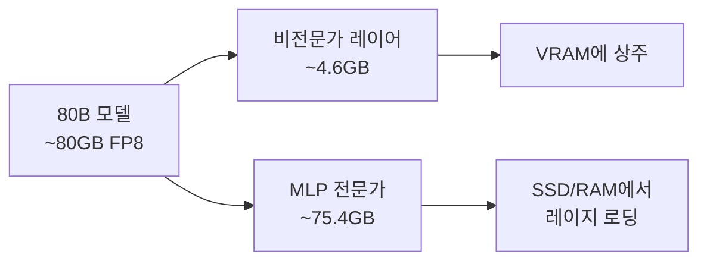

## 개요

80B 파라미터의 코딩 특화 모델을 8GB VRAM 노트북 GPU에서 실행할 수 있다면 어떨까요? Reddit의 r/LocalLLaMA 커뮤니티에서 <strong>nalexand</strong>라는 개발자가 이를 실현한 프로젝트를 공개했습니다. Qwen3-Coder-Next 80B를 RTX 3070Ti(8GB VRAM)에서 <strong>1.2 tokens/s</strong>로 동작시키는 데 성공한 것입니다.

이 글에서는 해당 프로젝트의 핵심 기술인 FP8 양자화, 전문가 레이지 로딩, 캐시 최적화 전략을 분석하고, 소비자 GPU에서의 대형 LLM 실행이 갖는 실용적 의미와 한계를 살펴봅니다.

## 핵심 과제: 80B 모델을 8GB에 우겨넣기

### 왜 불가능해 보이는가

Qwen3-Coder-Next는 80B 파라미터 모델입니다. FP8 양자화 상태에서도 모델 크기는 약 <strong>80GB</strong>에 달합니다. 8GB VRAM + 32GB RAM 환경에서는 전체 모델을 메모리에 올리는 것 자체가 불가능합니다.

### 첫 번째 시도: 디스크 오프로딩

개발자는 먼저 Hugging Face의 <strong>accelerate</strong> 라이브러리에서 `device="auto"`를 사용한 디스크 오프로딩을 시도했습니다. 결과는 참담했습니다.

- 속도: <strong>1 token / 255초</strong>
- 사실상 사용 불가능한 수준

이는 디스크 I/O 병목이 추론 속도를 극단적으로 저하시킨 전형적인 사례입니다.

## 해결책: 전문가 레이지 로딩 + 캐시 최적화

### MoE 아키텍처의 특성 활용

핵심 인사이트는 모델 구조 분석에서 나왔습니다. 80B 모델의 대부분의 대형 텐서는 <strong>MLP 전문가(expert)</strong>에 집중되어 있으며, 나머지 구성 요소는 약 <strong>4.6GB</strong>로 VRAM에 충분히 들어갑니다.



### 커스텀 레이지 로딩 시스템

개발자는 MLP 전문가를 위한 <strong>커스텀 레이지 로딩</strong> 시스템을 구축했습니다.

- <strong>2계층 캐시</strong>: VRAM 캐시 + Pinned RAM 캐시
- <strong>캐시 적중률</strong>: 최대 85%
- <strong>속도 향상</strong>: 255초/토큰 → 1.2 tokens/s (<strong>약 300배 속도 개선</strong>)

### 캐시 파라미터 튜닝

```python
# VRAM 캐시 크기 (각 18 단위 ≈ 약 3GB)
self.max_gpu_cache = 18

# RAM 캐시 크기 (Pinnable 메모리 기반)
self.max_ram_cache = 100
```

| GPU | 권장 max_gpu_cache | 예상 캐시 적중률 |
|-----|-------------------|----------------|
| RTX 3070Ti (8GB) | 18 | ~85% |
| RTX 5090 (32GB) | 120 | >85% |

## 기술 스택 및 설치 방법

### 필요 환경

- <strong>모델</strong>: `Qwen/Qwen3-Coder-Next-FP8` (Hugging Face에서 다운로드)
- <strong>GPU</strong>: 8GB+ VRAM
- <strong>RAM</strong>: 32GB+ (Pinnable 메모리는 보통 RAM의 1/2)
- <strong>스토리지</strong>: 빠른 NVMe SSD 권장 (PCIe 5.0 RAID 0 최대 30GB/s)

### 설치 단계

```bash
# 1. 모델 다운로드
hf-download Qwen/Qwen3-Coder-Next-FP8

# 2. transformers 라이브러리의 모델링 파일 교체
# transformers/models/qwen3_next/modeling_qwen3_next.py 교체

# 3. MLP 전문가 추출
python extract_mlp.py

# 4. 챗봇 실행
python coder_80b_next_chat.py
```

## 실제 성능 벤치마크

개발자가 공개한 캐시 워밍업 테스트 결과입니다.

| 프롬프트 | 토큰 수 | 시간 | 속도 |
|---------|---------|------|------|
| 첫 번째 "hi" | 11 | 21.25s | 0.52 t/s |
| 두 번째 "hi" | 26 | 25.36s | 1.03 t/s |
| "all good" | 50 | 41.70s | 1.20 t/s |
| 긴 응답 (807 토큰) | 807 | 668.81s | 1.21 t/s |

캐시가 워밍업된 후에는 안정적으로 <strong>~1.2 t/s</strong>를 유지합니다. 첫 번째 요청은 캐시 미스로 인해 느리지만, 이후 요청부터는 캐시 적중률이 높아지면서 속도가 향상됩니다.

## 실용성과 한계

### 장점

- <strong>비용</strong>: 클라우드 API 없이 로컬에서 80B 코딩 모델 실행 가능
- <strong>프라이버시</strong>: 코드가 외부 서버로 전송되지 않음
- <strong>오프라인</strong>: 인터넷 연결 없이 사용 가능

### 한계

- <strong>속도</strong>: 1.2 t/s는 실시간 코딩 보조에는 부족 (Claude나 GPT API는 30-80 t/s)
- <strong>초기 지연</strong>: 캐시 워밍업에 시간 필요
- <strong>설치 복잡성</strong>: transformers 라이브러리 파일을 직접 수정해야 함
- <strong>메모리 요구</strong>: 32GB RAM은 여전히 필요

### 향후 전망

| GPU | VRAM | 예상 속도 |
|-----|------|----------|
| RTX 3070Ti | 8GB | ~1.2 t/s (확인됨) |
| RTX 4090 | 24GB | 5-10 t/s (추정) |
| RTX 5090 | 32GB | 20+ t/s (개발자 예상) |

RTX 5090의 32GB VRAM과 높은 메모리 대역폭으로 `max_gpu_cache=120` 설정 시 20 t/s 이상이 기대됩니다.

## 로컬 LLM 코딩의 최전선

이 프로젝트는 로컬 LLM 커뮤니티의 "불가능을 가능으로" 만드는 정신을 잘 보여줍니다. <strong>nalexand</strong> 개발자는 이전에도 LTX-2, Wan2.2, HeartMula, ACE-Step 1.5 등 다양한 대형 모델을 저사양 GPU에서 최적화한 경력이 있습니다.

핵심 교훈은 다음과 같습니다.

1. <strong>모델 구조 분석이 최적화의 시작점</strong>: MoE 모델의 전문가 분포를 파악하면 선택적 로딩이 가능
2. <strong>다계층 캐시가 핵심</strong>: VRAM → Pinned RAM → SSD 순서의 캐시 전략이 300배 속도 향상을 실현
3. <strong>하드웨어 발전이 격차를 좁힌다</strong>: 차세대 GPU에서는 실용적 속도에 도달할 가능성

## 결론

Qwen3-Coder-Next 80B를 8GB VRAM에서 실행하는 것은 기술적으로 인상적인 성과입니다. 현재 1.2 t/s의 속도는 실시간 코딩 보조에는 부족하지만, 차세대 GPU와 최적화 기법의 발전으로 소비자 하드웨어에서의 대형 코딩 모델 실행이 점점 현실에 가까워지고 있습니다.

로컬 LLM에 관심 있는 개발자라면 [nalexand의 GitHub 저장소](https://github.com/nalexand/Qwen3-Coder-OPTIMIZED)를 확인하고, 자신의 하드웨어에서 직접 실험해보는 것을 추천합니다.

## 참고 자료

- [Qwen3-Coder-OPTIMIZED GitHub](https://github.com/nalexand/Qwen3-Coder-OPTIMIZED)
- [Reddit r/LocalLLaMA 원본 게시글](https://www.reddit.com/r/LocalLLaMA/comments/1r5m4vl/how_to_run_qwen3codernext_80b_parameters_model_on/)
- [Qwen3-Coder-Next-FP8 모델 (Hugging Face)](https://huggingface.co/Qwen/Qwen3-Coder-Next-FP8)
