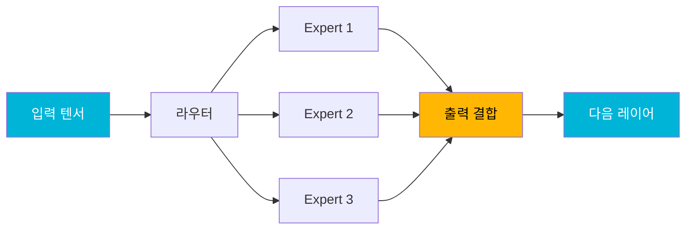

## 개요

llama.cpp의 핵심 개발자 <strong>ggerganov</strong>가 Qwen3 Coder Next 모델의 컴퓨트 그래프를 최적화하는 [PR #19375](https://github.com/ggml-org/llama.cpp/pull/19375)를 공개했습니다. 불필요한 텐서 복사(copy) 연산을 제거하고 그래프 수준에서 추론 경로를 재구성함으로써, <strong>M2 Ultra에서 최대 38%</strong>, <strong>DGX Spark에서 최대 38%</strong>의 속도 향상을 달성했습니다. Reddit r/LocalLLaMA에서 177포인트 이상의 큰 관심을 받은 이 최적화의 핵심을 살펴보겠습니다.

## 핵심 아이디어: 그래프 레벨 최적화

이번 최적화의 핵심은 단순합니다. ggml 컴퓨트 그래프에서 <strong>불필요한 텐서 복사 연산을 제거</strong>하는 것입니다.

MoE(Mixture of Experts) 아키텍처인 Qwen3 Coder Next는 라우터가 활성화할 전문가를 선택하고, 각 전문가의 출력을 결합하는 과정에서 많은 중간 텐서 복사가 발생합니다. 기존 구현에서는 이러한 복사가 안전성을 위해 과도하게 삽입되어 있었는데, ggerganov는 실제로 필요한 복사만 남기고 나머지를 제거했습니다.

## 벤치마크 결과

### M2 Ultra 성능 비교

Qwen3 Coder Next 80B.A3B 모델을 다양한 양자화 수준에서 테스트한 결과입니다.

#### Q4_0 양자화

| 테스트 | 기존 (t/s) | 최적화 (t/s) | 속도 향상 |
|--------|-----------|-------------|----------|
| pp1 (단일 토큰) | 37.92 | 51.99 | <strong>1.37x</strong> |
| pp8 (8토큰 배치) | 137.75 | 176.36 | <strong>1.28x</strong> |
| pp512 (프롬프트) | 930.70 | 1125.73 | <strong>1.21x</strong> |
| pp2048 (긴 프롬프트) | 1049.91 | 1352.31 | <strong>1.29x</strong> |
| tg32 (생성) | 38.02 | 50.39 | <strong>1.33x</strong> |

#### Q4_K_M 양자화

| 테스트 | 기존 (t/s) | 최적화 (t/s) | 속도 향상 |
|--------|-----------|-------------|----------|
| pp1 | 34.00 | 46.47 | <strong>1.37x</strong> |
| pp2048 | 977.30 | 1232.47 | <strong>1.26x</strong> |
| tg32 | 34.63 | 46.43 | <strong>1.34x</strong> |

#### Q8_0 양자화

| 테스트 | 기존 (t/s) | 최적화 (t/s) | 속도 향상 |
|--------|-----------|-------------|----------|
| pp1 | 34.38 | 43.98 | <strong>1.28x</strong> |
| pp2048 | 1047.39 | 1338.82 | <strong>1.28x</strong> |
| tg32 | 33.75 | 43.78 | <strong>1.30x</strong> |

### DGX Spark 성능 비교

NVIDIA DGX Spark에서도 유의미한 성능 향상이 확인됩니다.

| 양자화 | 테스트 | 기존 (t/s) | 최적화 (t/s) | 속도 향상 |
|--------|--------|-----------|-------------|----------|
| Q4_0 | pp512 | 1055.58 | 1161.67 | <strong>1.10x</strong> |
| Q4_0 | pp2048 | 1059.00 | 1324.66 | <strong>1.25x</strong> |
| Q4_0 | tg32 | 43.11 | 59.58 | <strong>1.38x</strong> |
| Q8_0 | pp2048 | 1009.43 | 1246.61 | <strong>1.23x</strong> |
| Q8_0 | tg32 | 31.13 | 39.68 | <strong>1.27x</strong> |

주목할 점은 DGX Spark에서 tg32(토큰 생성) 시 Q4_0 기준 <strong>38% 속도 향상</strong>을 달성했다는 것입니다.

## 기술적 배경: 관련 백엔드 최적화

이 PR은 단독으로 존재하지 않습니다. 그래프 최적화가 효과를 발휘하려면 각 백엔드(Metal, CUDA, Vulkan)에서 비연속(non-contiguous) 텐서를 직접 처리할 수 있어야 합니다. 관련된 주요 PR들을 살펴보겠습니다.

### Metal (Apple Silicon)

- <strong>적응형 CPU/GPU 인터리브</strong> ([#19369](https://github.com/ggml-org/llama.cpp/pull/19369)): 노드 수에 따라 CPU와 GPU 작업을 동적으로 분배
- <strong>바이너리 커널 통합</strong> ([#19390](https://github.com/ggml-org/llama.cpp/pull/19390)): 중복 커널 코드 제거
- <strong>유니터리 연산 통합</strong> ([#19490](https://github.com/ggml-org/llama.cpp/pull/19490)): 단항 연산 처리 개선
- <strong>비연속 텐서 L2 정규화 지원</strong> ([#19502](https://github.com/ggml-org/llama.cpp/pull/19502))
- <strong>동시성 개선</strong> ([#19555](https://github.com/ggml-org/llama.cpp/pull/19555))

### CUDA (NVIDIA GPU)

- <strong>비연속 텐서 PAD 연산 확장</strong> ([#19429](https://github.com/ggml-org/llama.cpp/pull/19429))
- <strong>CUDA 그래프 활성화</strong> ([#19521](https://github.com/ggml-org/llama.cpp/pull/19521)): Qwen3 Next 스타일 아키텍처용
- <strong>융합 ADD 그래프 뮤테이션 방지</strong> ([#19566](https://github.com/ggml-org/llama.cpp/pull/19566))

### Vulkan

- <strong>L2_NORM 연속 행 지원</strong> ([#19604](https://github.com/ggml-org/llama.cpp/pull/19604))
- <strong>GGML_OP_SET 지원</strong> ([#19584](https://github.com/ggml-org/llama.cpp/pull/19584))

## 주의사항: BF16 텐서 문제

일부 GGUF 파일에서 1차원 BF16 텐서가 잘못 포함되어 있을 수 있습니다. 이는 Metal 등의 백엔드에서 성능 저하를 유발합니다. [#19606](https://github.com/ggml-org/llama.cpp/pull/19606)에서 `ffn_gate_inp_shexp` 텐서를 F32로 저장하도록 수정하여 이 문제를 해결했습니다.

## 향후 계획

ggerganov는 이후 추가 최적화도 예고하고 있습니다.

1. <strong>Qwen3 패밀리 코드 중복 제거</strong> ([#19597](https://github.com/ggml-org/llama.cpp/pull/19597)): delta-net 그래프 공유
2. <strong>`ggml_build_forward_select()` 활용</strong>: 그래프를 상수화하여 추가 최적화 여지 확보
3. <strong>전용 delta net ggml 연산 도입</strong> ([#19504](https://github.com/ggml-org/llama.cpp/pull/19504)): 더 효율적인 커널 실행

## 로컬 LLM 사용자에게 미치는 영향

이번 최적화가 의미하는 바를 정리하면 다음과 같습니다.

- <strong>Apple Silicon 사용자</strong>: M2 Ultra 기준으로 80B MoE 모델을 tg32에서 약 50 t/s로 실행 가능. 실시간 대화가 충분히 가능한 속도입니다.
- <strong>NVIDIA GPU 사용자</strong>: DGX Spark에서도 20~38%의 속도 향상. CUDA 그래프 지원으로 추가 최적화가 기대됩니다.
- <strong>양자화 선택</strong>: Q4_0이 가장 큰 속도 향상을 보이지만, Q4_K_M과 Q8_0에서도 일관된 20~37%의 개선이 확인됩니다.
- <strong>코드 변경 불필요</strong>: llama.cpp를 최신 버전으로 업데이트하기만 하면 자동으로 적용됩니다.

## 결론

ggerganov의 이번 그래프 레벨 최적화는 llama.cpp의 MoE 모델 추론 성능을 크게 향상시켰습니다. 단순히 커널을 최적화하는 것이 아니라 <strong>컴퓨트 그래프 자체를 재구성</strong>하는 접근법이 인상적입니다. 특히 여러 백엔드(Metal, CUDA, Vulkan)에서 비연속 텐서 지원을 확대하는 병렬 작업과 결합되어, 로컬 LLM 추론의 성능 한계를 한 단계 끌어올리고 있습니다.

Qwen3 Coder Next와 같은 MoE 모델을 로컬에서 실행하는 사용자라면, llama.cpp를 최신 버전으로 업데이트하여 이 성능 향상을 즉시 체감해보시기 바랍니다.

## 참고 자료

- [PR #19375: models : optimizing qwen3next graph](https://github.com/ggml-org/llama.cpp/pull/19375)
- [Reddit r/LocalLLaMA 논의](https://www.reddit.com/r/LocalLLaMA/)
- [llama.cpp GitHub 리포지토리](https://github.com/ggml-org/llama.cpp)
