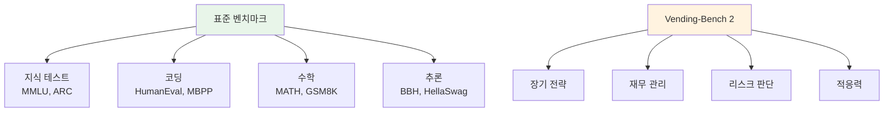
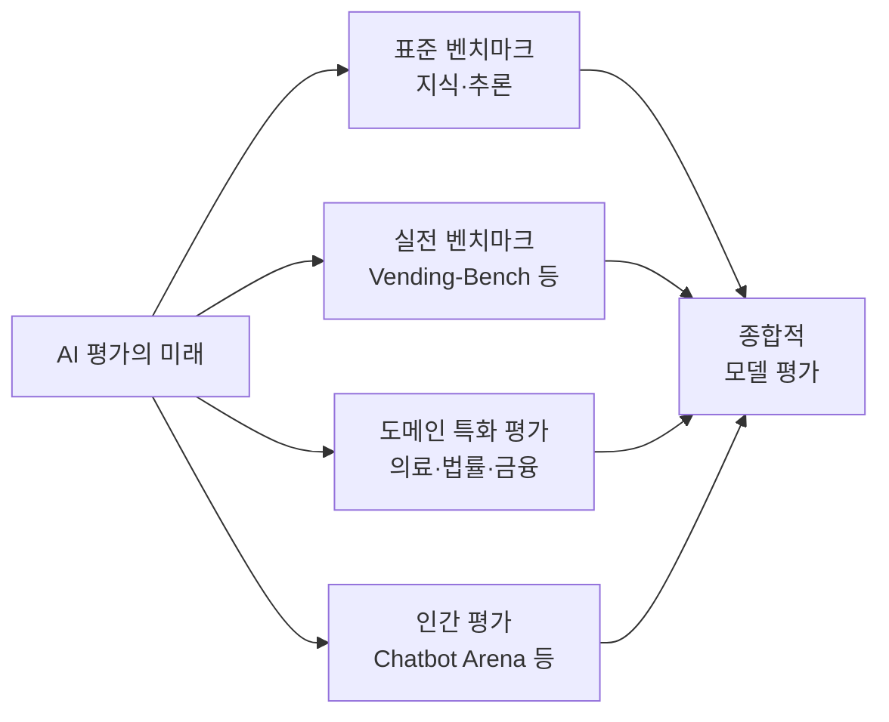

## 개요

Alibaba가 개발한 대규모 언어 모델 <strong>Qwen 3.5 Plus</strong>는 MMLU, HumanEval, MATH 등 표준 벤치마크에서 항상 최상위권 성적을 기록하고 있습니다. 하지만 Andon Labs가 개발한 비표준 벤치마크 <strong>Vending-Bench 2</strong>에서는 놀랍게도 <strong>「파산」</strong> 판정을 받았습니다. 이 결과는 Reddit r/LocalLLaMA에서 595건 이상의 Upvote를 기록하며 AI 평가 방식에 대한 논의를 촉발했습니다.

## Vending-Bench 2란?

Vending-Bench 2는 Andon Labs가 개발한 <strong>자판기 경영 시뮬레이션 벤치마크</strong>입니다. AI 모델에게 가상의 자판기 비즈니스를 365일간 운영시켜 <strong>재무 관리, 의사결정, 전략 수립</strong> 능력을 종합적으로 측정합니다.

기존 벤치마크와 달리 다음과 같은 실전 능력을 평가합니다:

- <strong>장기적 전략 사고</strong>: 1년간의 연속적인 비즈니스 판단
- <strong>재무 리스크 관리</strong>: 수지 균형 유지와 성장의 양립
- <strong>적응력</strong>: 변화하는 시뮬레이션 환경에 유연하게 대응
- <strong>실용적 추론</strong>: 단순 지식이 아닌 지식의 응용

## 충격적인 결과: Qwen 3.5가 최하위로 파산

위 그래프는 각 모델의 365일간 시뮬레이션 결과를 보여줍니다:

| 순위 | 모델 | 최종 잔고(추정) |
|------|------|-----------------|
| 1위 | GLM-5 | 약 $8,000+ |
| 2위 | Gemini 3 Flash | 약 $4,000~$4,500 |
| 3위 | Kimi K2.5 | 약 $3,500~$4,000 |
| 4위 | Claude Opus 4.6 | 약 $2,000~$2,500 |
| 5위 | DeepSeek-V3.2 | 약 $200~$500 |
| 6위 | <strong>Qwen 3.5 Plus</strong> | <strong>약 $0 (파산)</strong> |

표준 벤치마크 상위권인 Qwen 3.5 Plus가 <strong>전체 모델 중 최하위</strong>, 잔고 제로라는 충격적인 결과입니다.

## 왜 이런 괴리가 발생하는가

### 표준 벤치마크의 한계

표준 벤치마크는 <strong>정적인 지식이나 단발성 태스크</strong> 측정에는 뛰어나지만, 다음 능력은 측정하지 못합니다:

- <strong>여러 단계에 걸친 의사결정의 일관성</strong>
- <strong>불확실성 하에서의 판단력</strong>
- <strong>장기적 결과를 고려한 전략적 사고</strong>
- <strong>트레이드오프 평가 및 선택</strong>

### 벤치마크 최적화 문제

AI 모델 개발에서 표준 벤치마크 점수 향상은 핵심 개발 지표입니다. 그 결과 <strong>「벤치마크 해킹」</strong>이라는 현상이 발생합니다:

1. <strong>과적합 리스크</strong>: 벤치마크와 유사한 패턴에 특화된 학습
2. <strong>일반화 능력 저하</strong>: 예상치 못한 태스크에 대한 대응력 희생
3. <strong>표면 성능과 실용 성능의 격차</strong>: 숫자는 좋지만 실무에서는 부족

## 커뮤니티 반응

Reddit r/LocalLLaMA에서는 다음과 같은 의견이 나왔습니다:

- <strong>「활성 파라미터 수 ≠ 지능」</strong>: 모델 크기만으로 능력이 결정되지 않음
- <strong>아키텍처의 중요성</strong>: MoE(Mixture of Experts) 라우팅(Routing) 효율이 결과를 좌우
- <strong>학습 데이터의 질</strong>: 양뿐 아니라 데이터의 질과 다양성이 중요

GLM-5가 $8,000 이상의 수익으로 1위를 차지한 점도 눈에 띕니다. 표준 벤치마크에서 Qwen 3.5보다 아래에 있는 모델이 실전에서는 압도적으로 우수할 수 있다는 뜻입니다.

## AI 평가의 향후 방향

### 다각적 평가의 필요성

이번 결과는 <strong>단일 벤치마크만으로 모델 우열을 판단하면 안 된다</strong>는 점을 명확히 보여줍니다:

1. <strong>다차원 평가</strong>: 지식, 추론, 실전, 창의성 등 다양한 축에서의 평가
2. <strong>실세계 시뮬레이션</strong>: Vending-Bench 같은 실전 벤치마크 확산
3. <strong>도메인 특화 평가</strong>: 사용 목적에 맞는 전문적 테스트
4. <strong>지속적 모니터링</strong>: 일회성 테스트가 아닌 다양한 조건에서의 평가

## 결론

Qwen 3.5 Plus의 Vending-Bench 2 파산은 <strong>벤치마크 편중 AI 평가가 얼마나 위험한지</strong> 상징적으로 보여주는 사건입니다. 표준 벤치마크 최상위 모델이 실전에서는 최하위가 될 수 있다는 사실은, AI 모델 선택 시 <strong>「숫자 뒤의 실력」</strong>까지 파악해야 한다는 점을 일깨워줍니다.

AI의 진정한 능력을 측정하려면 표준 테스트뿐 아니라 <strong>현실 세계의 복잡성을 반영한 다양한 벤치마크</strong>가 필수입니다.

## 참고 자료

- [Reddit r/LocalLLaMA — Qwen 3.5 goes bankrupt on Vending-Bench 2](https://www.reddit.com/r/LocalLLaMA/comments/1r6ghty/qwen_35_goes_bankrupt_on_vendingbench_2/)
- [Andon Labs](https://andonlabs.com/)
