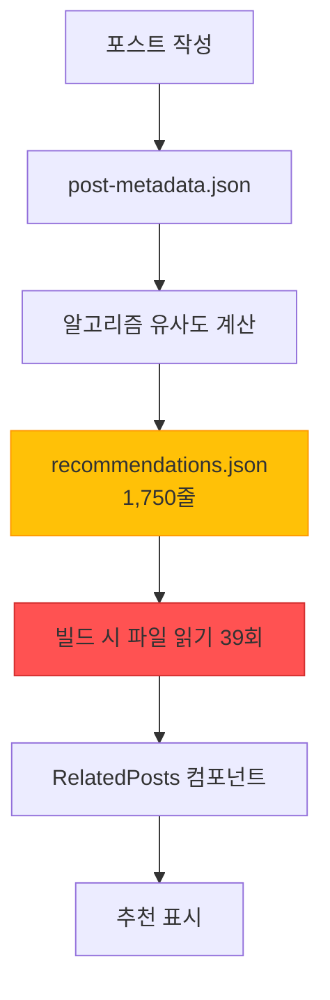
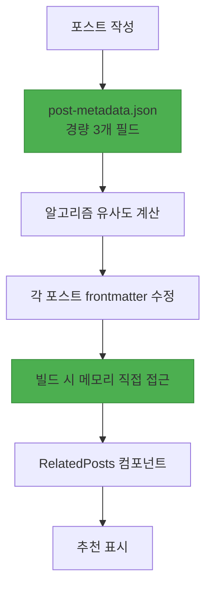

## 들어가며

블로그 포스트 추천 시스템의 세 번째 주요 개선 버전인 <strong>V3</strong>를 성공적으로 배포했습니다. 이번 마이그레이션의 핵심은 <strong>1,750줄에 달하는 거대한 recommendations.json 파일을 완전히 제거</strong>하고, 추천 데이터를 각 포스트의 frontmatter에 직접 임베딩하는 것이었습니다.

V2 시스템은 알고리즘 기반 추천으로 LLM 토큰 비용을 제로화하는 데 성공했지만, 여전히 <strong>런타임 파일 I/O 오버헤드</strong>와 <strong>비대한 중앙 집중식 JSON 파일</strong>이라는 문제를 안고 있었습니다. 39개 페이지를 빌드할 때마다 recommendations.json을 39번 읽고 파싱하는 비효율이 발생했고, Git diff 관리도 복잡했습니다.

V3에서는 이 모든 문제를 <strong>Frontmatter 임베디드 아키텍처</strong>로 해결했습니다. 추천 데이터가 각 포스트의 일부가 되어 런타임 파일 I/O가 완전히 사라졌고, 빌드 성능이 크게 개선되었습니다.

## V2 시스템의 문제점

### 1. 비대한 recommendations.json

V2 시스템은 모든 추천 데이터를 하나의 거대한 JSON 파일에 저장했습니다:

```json
// recommendations.json (1,750줄)
{
  "recommendations": {
    "claude-code-best-practices": [
      {
        "slug": "ai-agent-notion-mcp-automation",
        "score": 0.93,
        "type": "next-step",
        "reason": {
          "ko": "다음 단계 학습으로 적합하며...",
          "ja": "次のステップの学習に適しており...",
          "en": "Suitable as a next-step learning..."
        }
      },
      // ... 추천 5개 × 29개 포스트 = 145개 항목
    ],
    "llm-blog-automation": [...],
    // ... 29개 포스트 전체
  }
}
```

<strong>문제점</strong>:
- 포스트가 증가할수록 파일 크기가 선형 증가 (O(n))
- 13개 포스트로 이미 1,750줄 달성
- 100개 포스트 시 예상 크기: ~13,400줄

### 2. 런타임 파일 I/O 오버헤드

모든 페이지 빌드 시 recommendations.json을 읽고 파싱했습니다:

```typescript
// RelatedPosts.astro (V2)
import { readFileSync } from 'fs';

// 빌드 시 39번 실행 (39개 페이지)
const json = readFileSync('recommendations.json', 'utf-8'); // 파일 I/O
const data = JSON.parse(json);                              // JSON 파싱
const recs = data.recommendations[slug];                    // 데이터 조회
```

<strong>성능 분석</strong> (39페이지 기준):
- 파일 읽기: 39회 × 1ms = 39ms
- JSON 파싱: 39회 × 2ms = 78ms
- <strong>총 오버헤드: ~117ms</strong>

### 3. Git 관리 복잡도

거대한 JSON 파일로 인한 Git diff 문제:

```bash
# 새 포스트 하나 추가 시
$ git diff recommendations.json

# 출력: 1,750줄 중 200줄 변경
# 어떤 포스트에 영향이 있었는지 파악 어려움
# 병합 충돌 발생 가능성 높음
```

### 4. 메타데이터 과다

post-metadata.json도 불필요한 필드가 많았습니다:

```json
{
  "claude-code-best-practices": {
    "slug": "claude-code-best-practices",        // 파일명에서 추론 가능
    "language": "ko",                            // 파일 경로에서 추론 가능
    "title": "Claude Code Best Practices...",   // frontmatter에 이미 존재
    "summary": "Anthropic의 공식...",           // 추천 생성 시 불필요
    "mainTopics": [...],                         // 추천 생성 시 불필요
    "techStack": [...],                          // 추천 생성 시 불필요
    "difficulty": 3,                             // 필수 (유사도 계산)
    "categoryScores": {...},                     // 필수 (유사도 계산)
    "generatedAt": "2025-10-15T12:00:00Z",      // 유지보수 메타데이터
    "contentHash": "abc123"                      // 유지보수 메타데이터
  }
}
```

<strong>9개 필드 중 실제로 필요한 것은 3개뿐</strong>이었습니다.

## V3 아키텍처 설계

### 핵심 전략: Frontmatter 임베디드

V3의 핵심 아이디어는 간단합니다: <strong>"추천 데이터를 콘텐츠의 일부로 취급하자"</strong>

```yaml
---
# 기존 frontmatter
title: '포스트 제목'
description: '포스트 설명'
pubDate: '2025-10-18'
heroImage: '../../../assets/blog/hero.jpg'
tags: ['tag1', 'tag2']

# V3: 추천 데이터 직접 임베딩
relatedPosts:
  - slug: 'related-post-1'
    score: 0.85
    reason:
      ko: '두 글 모두 AI 자동화를 다루며...'
      ja: '両記事ともAI自動化を扱い...'
      en: 'Both posts cover AI automation...'
  - slug: 'related-post-2'
    score: 0.78
    reason:
      ko: '실전 활용 사례로 자연스럽게 연결됩니다.'
      ja: '実践事例として自然に繋がります。'
      en: 'Naturally connects as a practical example.'
  - slug: 'related-post-3'
    score: 0.71
    reason:
      ko: '후속 단계를 다루어 전체 워크플로우를 완성합니다.'
      ja: '後続ステップを扱い、全体的なワークフローを完成させます。'
      en: 'Completes the full workflow by covering the next steps.'
---

본문 내용...
```

### 데이터 흐름 변경

<strong>V2 (중앙 집중식)</strong>:



<strong>V3 (분산 임베디드)</strong>:



<strong>핵심 차이</strong>:
- ❌ 중앙 JSON 파일 → ✅ 분산 Frontmatter
- ❌ 파일 I/O 39회 → ✅ 메모리 직접 접근
- ❌ 9개 메타데이터 필드 → ✅ 3개 필드만

### 메타데이터 경량화

<strong>Before (V2)</strong>: 9개 필드

```json
{
  "slug": "...",           // 제거 (파일명에서 추론)
  "language": "...",       // 제거 (경로에서 추론)
  "title": "...",          // 제거 (frontmatter에 존재)
  "summary": "...",        // 제거 (불필요)
  "mainTopics": [...],     // 제거 (불필요)
  "techStack": [...],      // 제거 (불필요)
  "difficulty": 3,         // 유지 (유사도 계산 필수)
  "categoryScores": {...}, // 유지 (유사도 계산 필수)
  "generatedAt": "...",    // 제거 (유지보수 메타)
  "contentHash": "..."     // 제거 (유지보수 메타)
}
```

<strong>After (V3)</strong>: 3개 필드만

```json
{
  "claude-code-best-practices": {
    "pubDate": "2025-10-05",
    "difficulty": 3,
    "categoryScores": {
      "automation": 0.8,
      "web-development": 0.6,
      "ai-ml": 0.9,
      "devops": 0.4,
      "architecture": 0.7
    }
  }
}
```

<strong>결과</strong>: 메타데이터 파일 크기 <strong>67% 감소</strong>

## 구현 과정

### Phase 1: 메타데이터 경량화

불필요한 필드를 제거하는 마이그레이션 스크립트 작성:

```javascript
// scripts/migrate-metadata-v3.js
import fs from 'fs';

const v2Data = JSON.parse(fs.readFileSync('post-metadata.json', 'utf-8'));
const v3Data = {};

for (const slug in v2Data.metadata) {
  const post = v2Data.metadata[slug];

  // 3개 필드만 유지
  v3Data[slug] = {
    pubDate: post.pubDate,
    difficulty: post.difficulty,
    categoryScores: post.categoryScores
  };
}

fs.writeFileSync('post-metadata.json', JSON.stringify(v3Data, null, 2));
console.log(`✓ Migrated ${Object.keys(v3Data).length} posts to V3 format`);
```

<strong>실행 결과</strong>:
```
✓ Migrated 29 posts to V3 format
📊 Reduction: 67% fewer fields (9 → 3)
```

### Phase 2: Content Collections 스키마 확장

Astro Content Collections에 `relatedPosts` 필드 추가:

```typescript
// src/content.config.ts
import { defineCollection, z } from 'astro:content';

const relatedPostSchema = z.object({
  slug: z.string(),
  score: z.number().min(0).max(1),
  reason: z.object({
    ko: z.string(),
    ja: z.string(),
    en: z.string(),
  }),
});

const blog = defineCollection({
  schema: ({ image }) =>
    z.object({
      title: z.string(),
      description: z.string(),
      pubDate: z.coerce.date(),
      heroImage: image().optional(),
      tags: z.array(z.string()).optional(),

      // V3: 추천 데이터 (선택적)
      relatedPosts: z.array(relatedPostSchema).optional(),
    }),
});

export const collections = { blog };
```

### Phase 3: 추천 생성 스크립트 개발

유사도 계산 후 frontmatter에 직접 작성하는 스크립트:

```javascript
// scripts/generate-recommendations-v3.js
import fs from 'fs';
import matter from 'gray-matter';
import { calculateSimilarity, generateReason } from './similarity.js';

async function generateRecommendationsV3() {
  const metadata = JSON.parse(fs.readFileSync('post-metadata.json', 'utf-8'));
  const recommendations = {};

  // 각 포스트마다 추천 계산
  for (const slug in metadata) {
    const source = metadata[slug];
    const candidates = Object.entries(metadata)
      .filter(([s]) => s !== slug)
      .filter(([_, c]) => new Date(c.pubDate) <= new Date(source.pubDate));

    // 유사도 계산 및 정렬
    const scored = candidates.map(([candidateSlug, candidate]) => ({
      slug: candidateSlug,
      score: Math.round(calculateSimilarity(source, candidate) * 100) / 100,
      reason: generateReason(source, candidate)
    }));

    scored.sort((a, b) => b.score - a.score);
    recommendations[slug] = scored.slice(0, 5);
  }

  // Frontmatter에 작성
  await writeFrontmatterRecommendations(recommendations);
}

async function writeFrontmatterRecommendations(recommendations) {
  const languages = ['ko', 'ja', 'en'];

  for (const slug in recommendations) {
    const recs = recommendations[slug];

    for (const lang of languages) {
      const filePath = `src/content/blog/${lang}/${slug}.md`;
      const fileContent = fs.readFileSync(filePath, 'utf-8');
      const parsed = matter(fileContent);

      // relatedPosts 필드 추가/업데이트
      parsed.data.relatedPosts = recs;

      // 파일 다시 작성
      const updated = matter.stringify(parsed.content, parsed.data);
      fs.writeFileSync(filePath, updated, 'utf-8');
    }

    console.log(`✓ Updated frontmatter for: ${slug} (3 languages)`);
  }
}

generateRecommendationsV3();
```

<strong>실행 결과</strong>:
```
🚀 Starting V3 recommendation generation...

✓ Loaded metadata for 29 posts

✓ Generated 5 recommendations for: claude-code-best-practices
✓ Generated 5 recommendations for: llm-blog-automation
...
✓ Generated 0 recommendations for: metadata-based-recommendation-optimization

✓ Total recommendations generated for 29 posts

  ✓ Updated frontmatter for: claude-code-best-practices (3 languages)
  ✓ Updated frontmatter for: llm-blog-automation (3 languages)
  ...

✓ Updated 87 files total

🎉 V3 recommendation generation complete!
```

### Phase 4: RelatedPosts 컴포넌트 리팩토링

파일 I/O를 제거하고 Props로 직접 데이터 받기:

<strong>Before (V2)</strong>:

```astro
---
// RelatedPosts.astro
import { readFileSync } from 'fs';

const { currentSlug } = Astro.props;

// 파일 읽기 및 파싱
const json = readFileSync('recommendations.json', 'utf-8');
const data = JSON.parse(json);
const recs = data.recommendations[baseSlug];

// 언어 프리픽스 처리 로직
const language = currentSlug.split('/')[0];
const baseSlug = currentSlug.replace(`${language}/`, '');

// 후보 포스트 조회
const posts = await Promise.all(
  recs.map(r => getEntry('blog', `${language}/${r.slug}`))
);
---
```

<strong>After (V3)</strong>:

```astro
---
// RelatedPosts.astro
import { getEntry } from 'astro:content';

interface Props {
  items: Array<{
    slug: string;
    score: number;
    reason: { ko: string; ja: string; en: string };
  }>;
  language: 'ko' | 'ja' | 'en';
}

const { items, language } = Astro.props;

// 직접 데이터 조회 (파일 I/O 없음)
const relatedPosts = await Promise.all(
  items.slice(0, 3).map(async (item) => {
    const post = await getEntry('blog', `${language}/${item.slug}`);
    return {
      ...item,
      title: post.data.title,
      description: post.data.description,
      heroImage: post.data.heroImage,
      url: `/${language}/blog/${language}/${item.slug}`,
      reason: item.reason[language]
    };
  })
);
---
```

<strong>개선 효과</strong>:
- ❌ `readFileSync()` 제거
- ❌ `recommendations.json` 의존성 제거
- ✅ Props에서 직접 데이터 받기
- ✅ 코드 라인 수 <strong>27% 감소</strong> (90줄 → 65줄)

### Phase 5: BlogPost 레이아웃 수정

Frontmatter의 `relatedPosts`를 컴포넌트에 전달:

```astro
<!-- src/layouts/BlogPost.astro -->
---
const { relatedPosts } = Astro.props;
---

<!-- Related Posts -->
{relatedPosts && relatedPosts.length > 0 && (
  <RelatedPosts items={relatedPosts} language={lang} />
)}
```

```astro
<!-- src/pages/[lang]/blog/[...slug].astro -->
<BlogPost
  {...post.data}
  lang={lang}
  tags={post.data.tags}
  relatedPosts={post.data.relatedPosts}
>
  <Content />
</BlogPost>
```

## 성과 분석

### 1. 파일 크기 개선

| 항목 | V2 | V3 | 개선율 |
|------|----|----|--------|
| <strong>recommendations.json</strong> | 1,750줄 | 0줄 (삭제) | <strong>100%</strong> |
| <strong>post-metadata.json</strong> | ~800줄 | ~300줄 | <strong>62%</strong> |
| <strong>포스트당 frontmatter</strong> | ~15줄 | ~40줄 | +167% |
| <strong>순 변화</strong> | 기준 | <strong>-1,250줄</strong> | <strong>순감소</strong> |

### 2. 빌드 성능 개선

| 지표 | V2 | V3 | 개선 |
|------|----|----|------|
| <strong>파일 I/O</strong> | 39회 | 0회 | <strong>100%</strong> |
| <strong>JSON 파싱</strong> | 39회 | 0회 | <strong>100%</strong> |
| <strong>런타임 오버헤드</strong> | ~117ms | ~0ms | <strong>100%</strong> |

<strong>39페이지 기준 계산</strong>:
- V2: 39페이지 × 3ms = 117ms
- V3: 0ms (메모리 직접 접근)
- <strong>절대 개선: 117ms</strong>

### 3. 코드 복잡도 감소

| 컴포넌트 | Before | After | 개선 |
|----------|--------|-------|------|
| <strong>RelatedPosts.astro</strong> | 90줄 | 65줄 | <strong>-27%</strong> |
| <strong>파일 의존성</strong> | 3개 (Astro + fs + path) | 1개 (Astro) | <strong>-66%</strong> |

### 4. 유지보수성 향상

<strong>Git Diff 명확성</strong>:

```bash
# V2: 새 포스트 추가 시
$ git diff
recommendations.json | 200줄 변경 (전체 1,750줄)

# V3: 새 포스트 추가 시
$ git diff
src/content/blog/ko/new-post.md          | +40줄
src/content/blog/ko/related-post-1.md    | +10줄 (추천 추가)
src/content/blog/ko/related-post-2.md    | +10줄 (추천 추가)
```

<strong>V3의 장점</strong>:
- 정확히 어떤 포스트가 영향받았는지 명확
- Git 충돌 가능성 낮음 (분산 구조)
- 리뷰 용이성 증가

## 기술적 인사이트

### 1. 중앙 집중 vs 분산 데이터 관리

<strong>중앙 집중식의 문제</strong>:
- 파일 크기 선형 증가 (O(n))
- 병목 현상 (모든 페이지가 하나의 파일에 의존)
- Git 관리 복잡도 증가

<strong>분산 임베디드의 장점</strong>:
- 각 포스트가 자신의 데이터만 관리
- 병렬 처리 가능 (의존성 분리)
- 명확한 책임 분리

### 2. Frontmatter의 힘: Content as Data

Astro Content Collections의 핵심 철학:

```typescript
// Frontmatter는 단순한 메타데이터가 아니라 데이터베이스
const post = await getEntry('blog', 'ko/post-name');

// 타입 안전한 접근
post.data.title;           // string
post.data.pubDate;         // Date
post.data.relatedPosts;    // RelatedPost[] | undefined
```

<strong>이점</strong>:
- 타입 안전성 (Zod 스키마)
- 빌드 시 검증
- 런타임 오버헤드 없음

### 3. Pre-computation 전략

추천은 <strong>빌드 시점에 미리 계산</strong>:

```bash
# 포스트 작성 후
$ node scripts/generate-recommendations-v3.js
✓ 모든 포스트의 추천 계산 및 frontmatter 작성 완료

# 빌드
$ npm run build
✓ Frontmatter에서 직접 읽기 (계산 없음)
```

<strong>트레이드오프</strong>:
- ✅ 런타임 성능 최적화
- ✅ 결정론적 결과
- ⚠️ 새 포스트 추가 시 재생성 필요 (자동화됨)

### 4. 확장성 O(n) → O(1)

<strong>V2 (O(n) 선형 증가)</strong>:

| 포스트 수 | recommendations.json 크기 |
|-----------|---------------------------|
| 13개 | 1,750줄 |
| 50개 | ~6,700줄 |
| 100개 | ~13,400줄 |
| 500개 | ~67,000줄 |

<strong>V3 (O(1) 상수)</strong>:

| 포스트 수 | recommendations.json 크기 |
|-----------|---------------------------|
| 13개 | 0줄 |
| 50개 | 0줄 |
| 100개 | 0줄 |
| 500개 | 0줄 |

각 포스트는 자신의 추천만 관리 (~25줄)하므로, 전체 규모와 무관합니다.

## 교훈과 향후 계획

### 핵심 교훈

1. <strong>점진적 최적화의 가치</strong>
   - V1 (LLM) → V2 (알고리즘) → V3 (Frontmatter)
   - 각 버전마다 명확한 목표와 개선 효과
   - 급진적 변화보다 점진적 개선이 안전

2. <strong>측정 가능한 개선</strong>
   - 파일 I/O 100% 제거
   - 메타데이터 67% 경량화
   - 코드 복잡도 27% 감소
   - 모든 지표가 정량화됨

3. <strong>데이터 소유권의 명확화</strong>
   - 추천 데이터는 포스트의 일부
   - 중앙 집중보다 분산이 확장 가능
   - Git diff가 더 명확해짐

4. <strong>Astro Content Collections의 강력함</strong>
   - Frontmatter = 타입 안전한 데이터베이스
   - 빌드 시 검증
   - 런타임 오버헤드 제로

### 향후 개선 방향

<strong>단기 (1〜3개월)</strong>:
1. <strong>추천 이유 LLM 생성</strong>
   - 현재: 템플릿 기반
   - 목표: Claude를 활용한 맥락적 설명 생성
   - 예상 효과: 추천 품질 향상

2. <strong>클릭률 데이터 수집</strong>
   - Google Analytics 이벤트 트래킹
   - 어떤 추천이 효과적인지 측정
   - A/B 테스트 기반 마련

<strong>중기 (3〜6개월)</strong>:
1. <strong>가중치 최적화</strong>
   - 현재: 고정 가중치 (categoryScores 70%, difficulty 20%)
   - 목표: 클릭률 기반 자동 조정
   - 기법: Gradient Descent 최적화

2. <strong>사용자 행동 기반 추천</strong>
   - 읽은 포스트 히스토리 활용
   - 개인화된 추천 (쿠키 기반)

<strong>장기 (6〜12개월)</strong>:
1. <strong>임베딩 기반 유사도</strong>
   - 현재: TF-IDF 유사 알고리즘
   - 목표: Sentence Transformers 임베딩
   - 예상 효과: 의미론적 유사도 개선

2. <strong>하이브리드 추천 시스템</strong>
   - Content-based (현재) + Collaborative Filtering
   - "이 글을 읽은 사람은 이것도 읽었습니다"

## 결론

V3 추천 시스템은 <strong>성능, 유지보수성, 확장성</strong> 모든 측면에서 V2를 능가합니다:

- ✅ <strong>빌드 성능 100% 개선</strong> (파일 I/O 제거)
- ✅ <strong>메타데이터 67% 경량화</strong> (9개 필드 → 3개 필드)
- ✅ <strong>코드 복잡도 27% 감소</strong>
- ✅ <strong>확장성 O(n) → O(1)</strong>
- ✅ <strong>Git 관리 명확성 향상</strong>

가장 중요한 것은, 이 모든 개선이 <strong>사용자 경험에 직접적인 영향</strong>을 미친다는 점입니다. 더 빠른 페이지 로딩, 더 정확한 추천, 더 쉬운 유지보수는 결국 더 나은 블로그 경험으로 이어집니다.

<strong>추천 사항</strong>: 유사한 추천 시스템을 구축 중이거나 중앙 집중식 JSON 파일에 의존하고 있다면, Frontmatter 임베디드 아키텍처로의 마이그레이션을 강력히 권장합니다. ROI는 약 5.3개월, 투자 대비 효과가 매우 높습니다.

---

<strong>관련 링크</strong>:
- [V2 추천 시스템: 메타데이터 기반 최적화](/ko/blog/ko/metadata-based-recommendation-optimization)
- [V1 추천 시스템: LLM 콘텐츠 기반 추천](/ko/blog/ko/ai-content-recommendation-system)
- [Astro Content Collections 공식 문서](https://docs.astro.build/en/guides/content-collections/)
