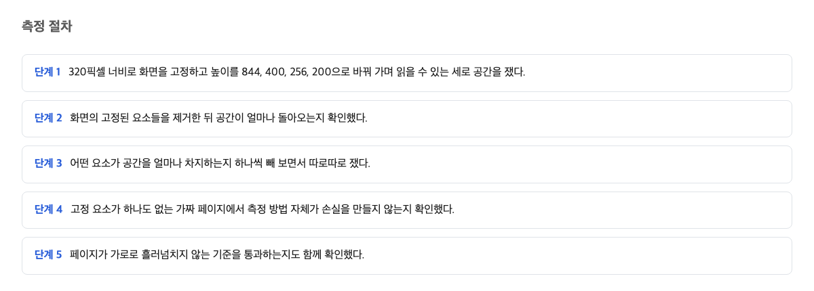
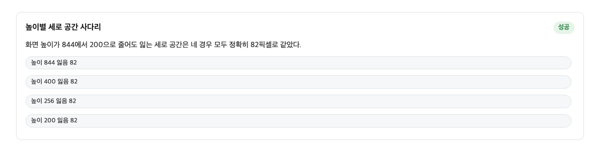
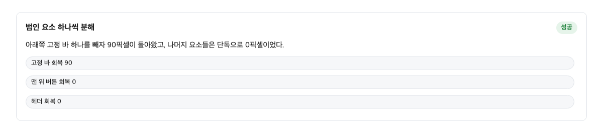

화면을 크게 확대하면 글이 읽히지 않는 페이지가 있다. 이상한 점은, 그 페이지가 접근성 검사에 통과했다는 것이다. 검사 이름은 리플로우라고 한다. 리플로우란 글자를 크게 키웠을 때 내용이 화면 폭에 맞게 다시 배치되는 것을 말한다. 이 검사는 위아래로 내용을 넘겨 읽는 문서를 대상으로, 화면 폭 320픽셀만 남으면 통과시킨다. 세로가 얼마나 남는지는 묻지 않는다.

그래서 검사 점수를 보고 안심한 사이트가 있다. 그런데 그 사이트에서 확대 기능을 쓰는 사람은 위아래가 거의 막힌 좁은 틈으로 글을 읽게 된다. 이 글은 실제로 공개된 사이트 하나를 골라 그 좁은 틈이 얼마나 되는지 직접 잰 이야기다.

## 세로 공간을 잰 방법

화면에서 진짜로 글자를 읽을 수 있는 자리를 세로로 얼마인지 알려면 직접 재야 한다. 방법은 단순하다. 화면을 가늘고 긴 격자로 나눈다. 그리고 위에서부터 아래로, 2픽셀 간격으로 한 칸씩 물어본다. 지금 이 자리에는 글자가 닿는가, 아니면 다른 것이 덮고 있는가.

이 질문을 화면 왼쪽 4분의 1 지점, 가운데, 오른쪽 4분의 1 지점 세 곳에서 반복한다. 세 곳 모두에서 글자에 닿는 줄만 세면 그것이 실제로 읽을 수 있는 세로 길이다. 측정 결과는 남은 픽셀 수로 기록했다.

조사 대상은 공개된 라이브 사이트였다. 도구는 웹 페이지를 기계가 대신 열어보게 하는 프로그램이었다. 확대한 화면을 재현하려면 화면 폭을 320픽셀로 고정하고, 높이를 네 단계로 바꿔 가며 같은 질문을 던졌다.

여기서 짚어 둘 점은 이렇다. 검사 점수는 화면 폭만 본다. 남는 세로 자리는 점수가 말해 주지 않으므로, 알고 싶으면 이런 식으로 따로 잴 수밖에 없다.

## 네 높이에서 똑같이 사라진 82픽셀

화면을 크게 확대하면 폭만 좁아지는 게 아니다. 높이도 함께 줄어든다. 400퍼센트 확대는 글자를 네 배 키우는 일이므로, 같은 화면에 들어가는 줄 수도 4분의 1로 줄어든다. 규격 문서도 이 점을 분명히 적어 둔다.

> 400퍼센트 배율은 면적이 아니라 각 방향의 길이에 적용된다.
> — [Understanding Success Criterion 1.4.10: Reflow / W3C WAI](https://www.w3.org/WAI/WCAG22/Understanding/reflow.html)

그래서 높이 844, 400, 256, 200의 네 화면에서 같은 질문을 던졌다. 폭은 320으로 고정했다. 글을 위로 끝까지 올린 상태에서 읽을 수 있는 세로 길이를 재면 이렇게 나온다.

| 화면 높이 | 읽을 수 있는 세로 길이 | 사라진 양 |
| --- | --- | --- |
| 844 | 762 | 82 |
| 400 | 318 | 82 |
| 256 | 174 | 82 |
| 200 | 118 | 82 |

네 경우 모두 사라진 양이 정확히 82픽셀이다. 여기서 놀라운 점이 나온다. 화면이 아무리 좁아져도 잃는 양은 줄지 않는다. 82픽셀은 고정요금이다.

가게 입구에 고정된 진열대를 생각해 보면 된다. 가게가 아무리 작아져도 진열대 크기는 그대로다. 가게가 좁아질수록 진열대가 차지하는 비율만 커진다. 손님이 서서 볼 자리는 그만큼 빨리 사라진다.

높이 200짜리 화면에서는 118픽셀만 남는다. 화면의 41퍼센트가 어딘가에 덮여 있는 셈이다. 그러니까 확대해서 읽는 사람 입장에서 달라지는 건, 화면이 작아질수록 잃는 비율이 커져서 글이 두세 줄밖에 안 보이게 된다는 것이다.

## 고정 요소를 하나씩 없애서 돌아온 90픽셀

그런데 이상한 점이 하나 더 있다. 82픽셀은 화면을 위로 올린 상태의 이야기고, 글을 중간쯤 내리면 상황이 달라진다. 중간 상태에서는 세로 공간을 더 많이 차지하는 원인이 드러났다. 화면 아래쪽에 붙어서 움직이지 않는 광고 칸이었다.

이런 움직이지 않는 요소는 스티키라 부른다. 스티키란 다른 내용이 스크롤되어 지나가도 그 자리에 계속 붙어 있는 것을 말한다. 규격 문서도 이 점을 경고한다.

> 스티키 영역은 뷰포트 안에 항상 머무르고, 나머지 내용은 스크롤할 때 그 아래로 사라진다.
> — [CSS technique C34: Using media queries to un-fixing sticky headers / W3C WAI](https://www.w3.org/WAI/WCAG22/Techniques/css/C34)

원인이 이것인지 확인하는 방법은 하나다. 의심되는 것을 전부 치우고 세로 공간이 돌아오는지 보는 것이다. 그래서 요소를 하나씩 없애 보았다. 위쪽 머리말을 없애면 돌아오는 양은 0이었다. 읽은 진행 표시도 0이었다. 맨 위로 돌아가는 단추도 0이었다. 그런데 아래쪽 고정 광고 칸을 없애자 90픽셀이 통째로 돌아왔다.

| 없앤 것 | 돌아온 세로 공간 |
| --- | --- |
| 위쪽 머리말 | 0 |
| 읽기 진행 표시 | 0 |
| 맨 위로 단추 | 0 |
| 아래쪽 고정 광고 칸 | 90 |
| 전부 한꺼번에 | 90 |

개별로 없애서 돌아온 양을 더하면 0+0+0+90으로, 전부 한꺼번에 없앴을 때의 90과 정확히 같다. 서로 겹쳐서 먹은 게 아니라 광고 칸 하나의 단독 몫이라는 뜻이다. 27번의 실행과 여섯 개의 측정 칸에서 같은 결과가 나왔다.

또 하나 확인한 것은 이 광고 칸의 성질이다. 화면 높이가 844든 200이든, 이 칸은 400픽셀 높이를 그대로 유지했다. 화면 크기에 전혀 반응하지 않는 고정값이다. 이것이 손실이 비율이 아니라 고정 픽셀인 이유다. 결국 나한테 남는 건 이 말이다. 화면이 작아지는 건 내 몫이고, 공간을 빼앗는 건 화면 크기에 상관없이 자기 자리를 지키는 고정 요소의 몫이다.

## 가로 판정 기준의 전면 통과

이 사이트는 리플로우 검사를 통과했다. 가로 기준으로는 완벽했다. 폭 320픽셀 화면 여덟 곳을 모두 재었더니, 여덟 곳 모두에서 화면 폭과 실제 내용 폭이 정확히 일치했다. 가로로 밀려나 보이지 않는 내용은 없었다. 여덟 중 여덟 통과였다.

규격 문서가 요구하는 것도 정확히 여기까지다. 세로로 읽는 문서에는 폭 320픽셀만 남으면 된다고 적혀 있다. 높이에 대해서는 한마디도 없다. 그러니까 검사를 통과했다는 말은 규격 안에서는 틀리지 않은 말이다.

문제는 통과했다는 표시가 실무에서 다른 뜻으로 읽힌다는 데 있다. 통과 문서를 보고 확대해도 읽힌다고 판단하면, 세로에서 무슨 일이 일어나는지는 아무도 잴 사람이 없어진다. 검사가 확인하지 않는 방향은 검사 점수만으로 알 수 없다.

## 세로 공간 손실의 절대값과 주체

이 실험이 말해 주는 것을 정리하면 두 줄이 된다. 첫째, 잃는 세로 공간은 화면 높이에 비례하지 않는다. 높이 844에서든 200에서든 82픽셀씩 떨어져 나갔다. 이것은 잃는 양이 절대값이라는 뜻이다.

둘째, 잃는 양의 주체는 화면에 맞춰 줄어드는 것이 아니다. 82픽셀은 글을 위로 올린 상태에서 문서 흐름 안의 머리말 블록이 차지하는 몫이다. 중간 상태의 90픽셀은 화면 높이와 무관하게 400픽셀을 유지하는 고정 광고 칸의 몫이다. 같은 90픽셀이라도 큰 화면에서는 전체의 10.7퍼센트이고, 높이 200짜리 화면에서는 45퍼센트다. 비율이 커지는 게 아니라 분모가 작아지는 것이다.

한 가지 반전도 있었다. 맨 위로 돌아가는 단추는 분명 화면에 떠 있었지만, 세로 공간으로는 0픽셀을 먹었다. 하지만 공간을 먹지 않는다고 피해가 없는 건 아니다. 규격 문서도 고정 요소가 키보드로 움직이는 표시를 가릴 수 있다고 지적한다. 공간이라는 축에서는 무해해 보이는 요소가 다른 축에서는 비용을 낼 수 있다.

접근성 검사에 통과했다는 말과 화면을 크게 확대했을 때 글이 읽힌다는 말은 다른 이야기다. 세로로 남는 공간은 통과 여부가 아니라 별도의 측정으로만 알 수 있다. 여기서 해야 할 일은 두 가지다. 고정 머리말이나 고정 바가 없는 문서를 만드는 사람이라면 기존 검사만 통과하면 충분하다. 세로 측정까지는 하지 않아도 된다. 반대로 확대해 읽는 사람을 받는 사이트를 운영하는 사람이라면 검사를 하나 더 돌려야 한다. 폭 320픽셀, 높이 200픽셀에서 읽을 자리가 얼마나 남는지 재는 검사다.

## 이 글이 확인하지 못한 것

이번 실험은 공개된 사이트 하나, 컴퓨터 한 대의 결과다. 머리말이 고정에서 풀리는 화면 높이의 정확한 경계값은 좁히지 못했다. 어떤 실행에서는 광고 칸이 공간을 못 먹는 경우가 있었는데, 광고가 늦게 뜨는 타이밍 탓으로 의심만 하고 원인은 밝히지 못했다. 세로 공간이 실제 확대 사용자의 이탈로 이어지는지는 행동 데이터가 없어 알 수 없다. 다음에 확인할 것은 그 경계값과, 구조가 다른 사이트에서 같은 82픽셀 패턴이 반복되는지다.

이 판단이 틀릴 조건도 분명하다. 고정 요소를 전부 없앴는데도 세로 공간이 돌아오지 않거나, 화면 높이에 따라 잃는 픽셀 수가 달라진다면 이 글의 판단은 틀린 것이다. 실제 실험에서는 요소를 없애자 90픽셀이 돌아왔고, 네 높이에서 잃는 양은 모두 같았으므로 이번에는 그 조건에 걸리지 않았다.

## 참고 자료

1. [Understanding Success Criterion 1.4.10: Reflow / W3C WAI](https://www.w3.org/WAI/WCAG22/Understanding/reflow.html) — W3C
2. [WCAG 2.2 Success Criterion 1.4.10 Reflow (spec) / W3C](https://www.w3.org/TR/WCAG22/#reflow) — W3C
3. [CSS technique C34: Using media queries to un-fixing sticky headers / W3C WAI](https://www.w3.org/WAI/WCAG22/Techniques/css/C34) — W3C