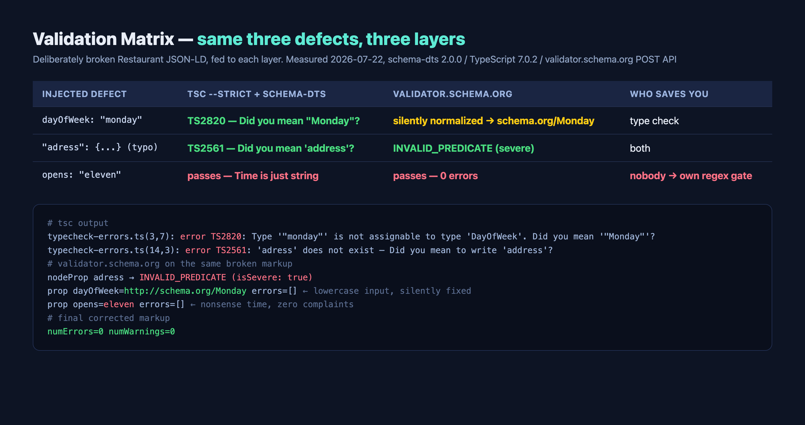

로그 한 줄부터 보자. 고의로 망가뜨린 Restaurant JSON-LD를 validator.schema.org에 넣었더니 이렇게 돌아왔다.

```text
prop opens=eleven errors=[]   ← 엉터리 시각, 불평 없음
nodeProp adress → INVALID_PREDICATE (isSevere: true)
prop dayOfWeek=http://schema.org/Monday errors=[]  ← 소문자로 넣었는데 조용히 고쳐짐
```

`opens`에 시각이 아니라 영어 단어 "eleven"을 넣었는데 오류 0건이다. 속성명 오타(`adress`)는 severe 오류로 잡으면서, 영업시간 값이 아예 시각이 아닌 것은 그냥 통과시킨다. 소문자 `"monday"`는 오류도 아니고 통과도 아니고, 검증기가 말없이 `schema.org/Monday`로 바꿔서 보여준다. 이 비대칭이 오늘 글의 주제다. 구조화 데이터 검증은 한 겹으로 끝나지 않는다.

## 시작점: 내 서비스에 JSON-LD가 0개였다

나는 일본의 음식점을 외국인 관광객에게 추천하는 PWA를 사이드 프로젝트로 만들어 운영하고 있다. SvelteKit 기반이고, 지도와 다국어 점포 정보가 핵심이다. 이번에 구조화 데이터를 점검하려고 `grep`으로 `ld+json`을 찾았는데, 결과가 0건이었다. 음식점 정보 서비스인데 Restaurant 마크업이 한 줄도 없었다. 솔직히 부끄러운 발견이다. 남의 사이트 구조화 데이터를 실측해 글을 쓰면서 정작 내 서비스는 비어 있었다.

그래서 이번 글은 남의 사례가 아니라 내 데이터 모델을 가지고 처음부터 설계했다. 서비스 내부에서 영업시간은 이렇게 저장돼 있다.

```json
{"monday":"11:00-22:00","tuesday":"11:00-22:00","wednesday":"11:00-22:00",
 "thursday":"11:00-22:00","friday":"11:00-23:00","saturday":"11:00-23:00",
 "sunday":"11:00-21:00"}
```

요일 키에 평문 시간 문자열. 화면에 표시하기엔 충분하다. 하지만 이 형식은 구조화 데이터가 아니라 <strong>표시용 문자열</strong>이다. 검색엔진이 "지금 영업 중인가"를 계산하려면 opens와 closes가 분리된 기계 판독 형식이 필요하고, schema.org는 그 어휘를 이미 정해뒀다. 문제는 이 변환이 생각보다 함정이 많다는 것. 직접 변환기를 만들고, 결과물을 세 가지 검증 계층에 통과시키면서 어느 계층이 무엇을 잡는지 하나씩 쟀다.

비슷한 상황의 사이트가 적지 않을 것이다. 점포 정보를 다루는 서비스 대부분이 영업시간을 사람이 읽을 문자열로 시작한다. 처음엔 그걸로 충분해서다. 구조화 데이터가 필요해지는 시점에 이 문자열을 다시 기계 판독 형식으로 되돌리는 비용을 치르게 되는데, 그 비용이 얼마인지, 어디서 막히는지를 이번에 내 데이터로 정확히 확인했다.

## 기초 다지기: openingHoursSpecification이라는 어휘

변환 코드로 들어가기 전에 토대를 깔아두겠다. Google 검색은 LocalBusiness 구조화 데이터를 읽어 지식 패널과 검색 결과에 영업시간·위치 정보를 표시할 수 있다. [Google Search Central의 LocalBusiness 문서](https://developers.google.com/search/docs/appearance/structured-data/local-business)가 1차 출처다. 요점만 추리면 이렇다.

| 구분 | 속성 | 비고 |
|---|---|---|
| 필수 | `name`, `address` | 이 둘이 없으면 대상 외 |
| 권장 | `geo` | 좌표 정밀도 <strong>소수점 5자리 이상</strong> |
| 권장 | `openingHoursSpecification` | 영업시간의 기계 판독 형식 |
| 권장 | `priceRange` | 100자 이상이면 표시 안 됨 |
| 권장 | `servesCuisine`, `url`, `telephone`, `menu` | 음식점이면 사실상 다 채울 것 |

타입은 `LocalBusiness`가 아니라 가능한 한 구체적인 하위 타입을 쓰라는 것이 공식 지침이다. 문서 원문이 예시로 드는 것이 바로 `Restaurant`다. 영업시간은 `OpeningHoursSpecification` 객체로 표현하는데, 같은 시간대의 요일은 `dayOfWeek` 배열로 묶고, 요일마다 다르면 객체를 나눈다. 심야 영업(토요일 18:00에 열어 새벽 03:00에 닫는 가게)은 하나의 객체에 `opens: "18:00", closes: "03:00"`으로 쓰고, 종일 영업은 00:00〜23:59, 휴무일은 opens와 closes를 둘 다 "00:00"으로 둔다. 연말연시 같은 기간 한정 변경은 `validFrom`/`validThrough`를 붙인 별도 스펙으로 얹는다. 이 패턴들은 전부 공식 문서에 예제가 있다. 외울 필요는 없지만, "내 내부 데이터가 이 어휘로 변환 가능한 형태인가"는 설계 단계에서 따져봐야 한다.

한 가지 미리 말해두면, 이 마크업을 넣는다고 지도 순위가 오르는 것은 아니다. 그 이야기는 한계 섹션에서 공식 문서를 인용해 정리한다.

## 평문 문자열을 스키마로 옮기는 변환기

변환기는 TypeScript로 짰고, 타입은 Google이 공개한 [schema-dts](https://github.com/google/schema-dts) 2.0.0을 썼다. schema.org 전체 어휘가 TypeScript 타입으로 제공되는 패키지다. 핵심 로직은 30줄 정도다.

```typescript
import type { OpeningHoursSpecification, DayOfWeek } from "schema-dts";

const DAY_MAP: Record<string, DayOfWeek> = {
  monday: "Monday", tuesday: "Tuesday", wednesday: "Wednesday",
  thursday: "Thursday", friday: "Friday", saturday: "Saturday", sunday: "Sunday",
};
const TIME_RE = /^([01]\d|2[0-3]):[0-5]\d$/;

export function toOpeningHours(raw: string): OpeningHoursSpecification[] {
  const parsed: Record<string, string> = JSON.parse(raw);
  const groups = new Map<string, DayOfWeek[]>();
  for (const [day, hours] of Object.entries(parsed)) {
    const dow = DAY_MAP[day.toLowerCase()];
    if (!dow) throw new Error(`unknown day key: ${day}`);
    // "11:00-14:00,17:00-22:00" 같은 분할 영업도 콤마로 나눠 각각 스펙으로
    const ranges = hours.trim().toLowerCase() === "closed"
      ? ["00:00-00:00"] : hours.split(",");
    for (const range of ranges) {
      const key = range.trim();
      (groups.get(key) ?? groups.set(key, []).get(key)!).push(dow);
    }
  }
  return [...groups.entries()].map(([hours, days]) => {
    const [opens, closes] = hours.split("-").map(s => s.trim());
    if (!TIME_RE.test(opens) || !TIME_RE.test(closes))
      throw new Error(`unparseable hours "${hours}"`);
    return { "@type": "OpeningHoursSpecification" as const,
      dayOfWeek: days.length === 1 ? days[0] : days, opens, closes };
  });
}
```

실제 저장 데이터를 넣었더니 7개 요일이 3개 객체로 묶여 나왔다. 월〜목 11:00-22:00, 금·토 11:00-23:00, 일 11:00-21:00. Google 문서의 예제와 같은 묶음 방식이다. 이것을 name·address·geo와 합친 최종 마크업이 이렇다.

```json
{
  "@context": "https://schema.org",
  "@type": "Restaurant",
  "name": "新宿ラーメン通り",
  "alternateName": "Shinjuku Ramen Street",
  "address": { "@type": "PostalAddress", "streetAddress": "東京都新宿区西新宿1-1-1",
               "addressLocality": "新宿区", "addressRegion": "東京都", "addressCountry": "JP" },
  "geo": { "@type": "GeoCoordinates", "latitude": 35.6919, "longitude": 139.7038 },
  "servesCuisine": "Ramen",
  "priceRange": "$$",
  "url": "https://example.com/restaurants/mock-1",
  "openingHoursSpecification": [
    { "@type": "OpeningHoursSpecification",
      "dayOfWeek": ["Monday","Tuesday","Wednesday","Thursday"], "opens": "11:00", "closes": "22:00" },
    { "@type": "OpeningHoursSpecification",
      "dayOfWeek": ["Friday","Saturday"], "opens": "11:00", "closes": "23:00" },
    { "@type": "OpeningHoursSpecification", "dayOfWeek": "Sunday", "opens": "11:00", "closes": "21:00" }
  ]
}
```

다국어 서비스라 점포명 처리도 하나 정해야 했다. 현지 표기(일본어 점포명)를 `name`으로, 로마자 표기를 `alternateName`으로 실었다. 지도와 현지 검색에서 실제로 대조되는 것은 현지 표기이기 때문이다. 이 마크업 전체를 validator.schema.org에 넣은 결과는 오류 0건, 경고 0건이었다.

내보내는 위치도 정해뒀다. SvelteKit이라면 점포 상세 페이지의 서버 로드에서 변환기를 돌리고, 페이지 컴포넌트의 head에 직렬화해 넣는다.

```svelte
<svelte:head>
  {@html `<script type="application/ld+json">${
    JSON.stringify(toJsonLd(data.restaurant)).replace(/</g, '\\u003c')
  }</script>`}
</svelte:head>
```

`<` 이스케이프는 점포명이나 설명에 섞인 문자가 script 태그를 깨는 것을 막는 최소한의 방어다. 클라이언트 사이드에서 주입하지 않고 서버 렌더링 출력에 포함시키는 이유는 이전 실측에서 확인한 그대로다. 원시 HTML에 없는 구조화 데이터는 렌더링을 건너뛰는 수집기에게 존재하지 않는 것과 같다.

여기까지는 순조롭다. 진짜 배운 것은 변환기가 아니라, 변환 과정에서 드러난 <strong>내부 모델의 표현력 부족</strong>과, 그 뒤에 이어진 검증 계층 실험이다.

## 모델이 표현 못 하는 것: 브레이크타임, 라스트오더, 좌표 정밀도

첫 버전 변환기는 `"11:00-14:00,17:00-22:00"` 같은 브레이크타임 입력에서 그대로 죽었다. 처음엔 스키마의 한계라고 생각했는데, 아니었다. schema.org는 <strong>같은 요일에 OpeningHoursSpecification을 두 개</strong> 두는 것으로 분할 영업을 깔끔하게 표현한다. 월요일 11:00-14:00 객체 하나, 월요일 17:00-22:00 객체 하나. 표현 못 하는 쪽은 스키마가 아니라 "요일당 문자열 하나"로 굳혀둔 내 내부 모델이었다. 변환기 v2에서 콤마 분할을 넣어 해결했다.

반면 정말로 스키마에 없는 것도 있다. 일본 음식점 정보에서 흔한 <strong>라스트오더(L.O. 21:30)</strong>다. schema.org의 영업시간 어휘에는 라스트오더에 해당하는 속성이 없고, Google 문서도 다루지 않는다. `"11:00-22:00 (L.O. 21:30)"`처럼 문자열에 붙여둔 정보는 변환 시점에 버려지거나, 마크업 대상 밖의 표시 전용 정보로 남겨야 한다. 나는 후자를 택했다. 구조화 데이터에는 22:00 폐점만 싣고, 라스트오더는 화면 표시와 `description`에만 남긴다. 억지로 폐점 시각을 21:30으로 당겨 적는 것은 사실과 다른 마크업이라 하지 않았다.

기간 한정 변경은 반대로 스키마 쪽 지원이 충실한데 내부 모델에 자리가 없는 경우다. 연말연시 휴업을 공식 문서의 패턴대로 쓰면 이렇게 된다.

```json
{ "@type": "OpeningHoursSpecification",
  "opens": "00:00", "closes": "00:00",
  "validFrom": "2026-12-30", "validThrough": "2027-01-03" }
```

평상시 스펙은 그대로 두고 이 객체를 얹기만 하면 되는 구조라, 오히려 "요일당 문자열 하나" 모델보다 유연하다. 내부 모델에 임시 휴업 테이블을 추가하고 변환기가 이 스펙을 생성하도록 하는 것을 다음 작업으로 잡았다.

좌표에서도 하나 걸렸다. Google 문서는 `geo`의 정밀도를 소수점 5자리 이상으로 권장하는데, 내 데이터의 위경도는 전부 4자리였다. 4자리는 약 11m, 5자리는 약 1.1m 단위다. 도쿄의 골목 상가에서 11m면 옆 건물이다. 변환기에 자릿수 검사를 넣어 4자리 좌표를 전부 플래그하게 했다. 데이터 수집 단계에서 5자리를 강제하지 않으면 마크업 단계에서 고칠 방법이 없다는 것도 이번에 확인했다. 좌표는 지오코딩 시점에 정밀도가 결정되기 때문이다.

## 세 계층에 같은 결함을 넣어봤다

여기서부터가 이 글의 핵심 실측이다. 검증 수단이 세 가지 있다. schema-dts를 이용한 컴파일 타임 타입체크, validator.schema.org, 그리고 변환기 안의 런타임 정규식 게이트. 참고로 validator.schema.org는 브라우저 UI 없이도 쓸 수 있다. 페이지 HTML을 그대로 POST하면 JSON으로 결과가 돌아와서 CI에 넣기 좋다.

```bash
curl -s -X POST "https://validator.schema.org/validate" \
  --data-urlencode "html@dist/restaurants/mock-1/index.html"
# 응답 앞의 )]}'  프리픽스를 떼면 tripleGroups[].nodes[]에
# 속성별 errors와 numErrors/numWarnings가 들어 있다
```

이 세 계층에 같은 결함 세 개를 만들어 차례로 넣었다.



결과를 표로 정리하면 이렇다.

| 심은 결함 | tsc --strict + schema-dts | validator.schema.org | 잡아주는 곳 |
|---|---|---|---|
| `dayOfWeek: "monday"` (소문자) | <strong>TS2820</strong>: Did you mean "Monday"? | 오류 없음, `schema.org/Monday`로 조용히 정규화 | 타입체크 |
| `"adress"` (속성 오타) | <strong>TS2561</strong>: Did you mean 'address'? | <strong>INVALID_PREDICATE</strong> (severe) | 양쪽 다 |
| `opens: "eleven"` | 통과(Time 타입은 결국 string) | 통과(오류 0건) | <strong>아무도 없음</strong> |

세 줄이지만 각각 시사점이 다르다.

첫째, 소문자 요일. 내부 데이터는 `"monday"`로 저장돼 있으니 매핑을 빼먹으면 그대로 새어 나가는 실수인데, 이걸 컴파일 타임에 잡는 것은 schema-dts뿐이었다. 검증기는 오류로 치지 않고 알아서 고쳐서 보여준다. 편해 보이지만 나는 이 동작을 신뢰하지 않는 쪽을 택했다. 검증기의 정규화는 검증기의 구현일 뿐, Google의 실제 인제스트 파이프라인이 같은 관용을 베푼다는 문서상 근거를 찾지 못했다. 공식 문서 표기인 `"Monday"`로 내보내는 것이 안전하다.

둘째, 속성명 오타는 양쪽 다 잡는다. 이건 예상대로였고, 두 계층 모두 "address 말한 거냐"고 제안까지 해줘서 수정 비용도 낮다.

셋째가 문제다. `opens: "eleven"`. 시각이 아닌 값이 들어갔는데 <strong>어느 계층도 잡지 않는다</strong>. schema-dts에서 `Time`은 결국 string의 별칭이라 타입체크가 무력하고, validator.schema.org는 값의 형식을 검사하지 않는다. 영업시간 마크업에서 가장 치명적인 결함(시각이 시각이 아님)이 가장 잘 뚫린다. 그래서 변환기의 `TIME_RE` 정규식이 장식이 아니라 <strong>유일한 방어선</strong>이 된다. 이 게이트가 없으면 "eleven"은 컴파일을 통과하고, 검증기를 통과하고, 프로덕션 HTML까지 도달한다.

이 구도는 [axe-core를 jsdom과 실브라우저에서 비교했을 때](/ko/blog/ko/axe-core-ci-a11y-jsdom-vs-browser-2026/)와 똑같다. 도구는 저마다 다른 결함을 잡고, 어느 도구가 무엇을 놓치는지는 문서가 아니라 실측으로만 알 수 있다. 그리고 놓치는 지점에는 직접 게이트를 만들어 CI에 상설화하는 수밖에 없다.

## 정직한 한계: 이 마크업은 지도 순위를 움직이지 않는다

기대치를 깎고 가자. 첫째, Google은 구조화 데이터를 넣어도 리치 결과 표시를 보장하지 않는다. 문서 원문은 "Google does not guarantee that features that consume structured data will show up in search results"라고 못 박는다. 둘째, 이른바 MEO, 즉 지도 검색·로컬 팩 순위에 대해서라면 더 냉정해야 한다. [Google Business Profile의 로컬 순위 공식 문서](https://support.google.com/business/answer/7091)가 제시하는 요인은 관련성·거리·인지도 세 가지이고, 이 페이지에는 <strong>구조화 데이터라는 단어 자체가 등장하지 않는다</strong>. 로컬 팩에서 순위를 다투는 주전장은 비즈니스 프로필의 완성도와 리뷰이지, 웹사이트의 JSON-LD가 아니다.

그럼 왜 넣는가. 내 판단은 이렇다. Restaurant 마크업이 하는 일은 순위 부양이 아니라 <strong>웹페이지 쪽 정보의 기계 판독 가능성</strong>을 확보하는 것이다. 검색 결과의 지식 패널·영업시간 표시 같은 리치 결과의 재료가 되고, 페이지를 읽는 것이 크롤러만이 아니게 된 지금은 AI 검색·생성엔진이 점포 정보를 정확히 집어가게 하는 토대이기도 하다. "이 가게 일요일에 하나요"라는 질문에 AI가 답할 때, 근거가 되는 페이지에 opens/closes가 기계 판독 형식으로 있는 것과 표시용 문자열만 있는 것의 차이는 작지 않다고 본다. 다만 이것 역시 실측하지 않은 추정이므로, AI 답변 인용에 미치는 효과는 별도의 측정 주제로 남겨둔다. 마크업을 어떤 경로로 내보낼지(서버사이드 렌더링이 왜 확실한지)는 [이전 실측 글](/ko/blog/ko/localbusiness-structured-data-server-side-vs-js-2026/)에서 다뤘으니, 이 글과 합치면 전달과 내용이 한 세트가 된다.

마지막 한계도 적어둔다. 이번 검증은 validator.schema.org의 POST API와 schema-dts 타입체크까지다. Google의 리치 결과 테스트는 브라우저 UI가 필요해 이번 파이프라인에는 넣지 못했다. 배포 전 최종 확인은 여전히 [리치 결과 테스트](https://search.google.com/test/rich-results)로 하는 것이 공식 권장 경로다.

## 정리: 영업시간 마크업 배포 전 게이트

이번 실측에서 굳어진 체크리스트다. 음식점이든 다른 점포형 비즈니스든 그대로 쓸 수 있다.

- [ ] 타입은 `LocalBusiness`가 아니라 최대한 구체적으로 (`Restaurant` 등). 공식 지침이다
- [ ] 내부 영업시간 데이터를 표시용 문자열이 아니라 opens/closes 분리 구조로 관리
- [ ] 같은 시간대 요일은 `dayOfWeek` 배열로 묶기, 브레이크타임은 같은 요일에 스펙 2개
- [ ] 휴무일은 opens=closes="00:00", 심야 영업은 한 객체에서 자정 넘기기, 기간 한정은 `validFrom`/`validThrough`
- [ ] 라스트오더처럼 스키마에 없는 정보는 폐점 시각을 왜곡하지 말고 마크업 밖에 두기
- [ ] `geo`는 소수점 5자리 이상. 수집 시점에 강제해야 나중에 못 고치는 항목이다
- [ ] schema-dts로 타입체크(요일·속성명 오타), 시각 형식은 <strong>직접 정규식 게이트</strong>로. 어느 기성 계층도 안 잡아준다
- [ ] validator.schema.org POST API를 CI에 걸어 구조 오류 감시, 최종 확인은 리치 결과 테스트

구조화 데이터는 넣는 것보다 틀린 채 방치되는 것이 더 나쁘다. 잘못된 영업시간이 검색 결과에 그대로 뜨면 헛걸음한 손님의 불신은 가게가 아니라 그 정보를 실은 페이지로 돌아온다. 검증 계층이 무엇을 놓치는지 알고, 놓치는 자리에 게이트를 세우는 것까지가 구현이다.

---

점포·지역 비즈니스 사이트의 구조화 데이터 설계나 기존 마크업의 검증 체계 점검이 필요하다면, 이런 실측 기반의 진단과 구현을 개인적으로 상담·의뢰받고 있다. [문의는 여기로](/ko/contact/).
