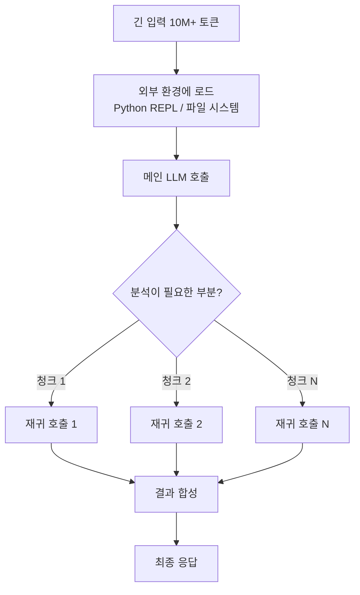
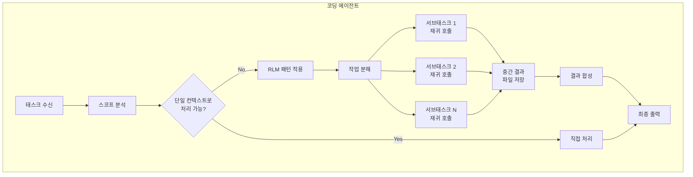
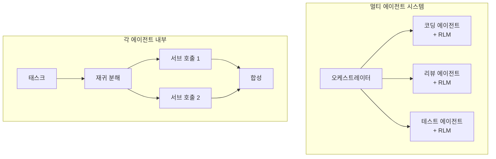

## 개요

LLM을 활용한 코딩 에이전트를 운영하다 보면 반드시 부딪히는 벽이 있습니다. <strong>컨텍스트 윈도우의 한계</strong>입니다. 128K 토큰이든 200K 토큰이든, 대규모 코드베이스를 다루다 보면 모델이 중요한 정보를 놓치기 시작합니다. 이른바 "Context Rot" — 컨텍스트가 길어질수록 성능이 급격히 떨어지는 현상입니다.

MIT에서 발표한 <strong>Recursive Language Models(RLM)</strong> 논문(arXiv:2512.24601)은 이 문제에 대한 근본적인 해법을 제시합니다. 그리고 최근 Tenobrus라는 개발자가 이 아이디어를 Claude Code에 직접 구현해서 화제가 되었습니다. 코딩 에이전트 안에서 RLM을 "스킬"로 구현한 것입니다.

AI로 시스템을 만드는 입장에서 이 접근법이 왜 중요한지, 그리고 실무에서 어떻게 활용할 수 있는지 분석합니다.

## RLM이란 무엇인가

### 핵심 아이디어

RLM의 핵심은 단순합니다. <strong>LLM이 자기 자신을 재귀적으로 호출</strong>할 수 있게 하는 것입니다.

기존 방식에서는 긴 프롬프트를 그대로 모델에 넣었습니다. 당연히 컨텍스트 윈도우를 넘으면 잘리고, 넘지 않더라도 중간 정보를 놓치는 Context Rot이 발생합니다.

RLM은 다른 접근을 취합니다:

1. <strong>외부 환경에 프롬프트를 로드</strong>: Python REPL 같은 실행 환경에 긴 입력을 저장
2. <strong>프로그래밍적 탐색</strong>: LLM이 코드를 작성해서 필요한 부분만 peek
3. <strong>재귀적 자기 호출</strong>: 하위 작업을 자기 자신의 새로운 인스턴스에 위임
4. <strong>결과 합성</strong>: 각 재귀 호출의 결과를 프로그래밍적으로 결합



### 논문의 핵심 성과

MIT 논문의 결과는 인상적입니다:

- <strong>10M+ 토큰 처리 가능</strong>: 기본 컨텍스트 윈도우의 100배 이상
- <strong>91.3% 성능 향상</strong>: BrowseComp+ 벤치마크에서 베이스라인 대비
- <strong>Context Rot 해결</strong>: 입력 길이가 늘어나도 성능 저하 거의 없음
- <strong>비용 효율적</strong>: 기본 모델 직접 호출과 비슷하거나 더 저렴

특히 주목할 점은 <strong>RLM-Qwen3-8B</strong>라는 네이티브 재귀 모델을 학습시킨 결과, 기본 Qwen3-8B 대비 평균 28.3% 향상되었고, 일부 태스크에서는 바닐라 GPT-5에 근접하는 성능을 보였다는 것입니다.

## 코딩 에이전트에서의 RLM 구현

### Tenobrus의 실험

Tenobrus는 Claude Code 안에서 RLM을 "스킬"로 구현했습니다. 핵심 아이디어는:

- <strong>Bash를 실행 환경으로 사용</strong>: Python REPL 대신 Bash 셸
- <strong>파일을 변수로 활용</strong>: 중간 결과를 파일 시스템에 저장
- <strong>코딩 에이전트 내부에서 구현</strong>: 별도 인프라 없이 에이전트 자체의 기능으로

이것은 사실상 "코딩 에이전트 안에서 코딩 에이전트가 자기 자신을 재귀적으로 호출하는" 구조입니다.

### 왜 코딩 에이전트에 RLM이 필요한가

실무에서 코딩 에이전트를 운영하면 다음과 같은 상황이 빈번합니다:

1. <strong>대규모 리팩토링</strong>: 수십 개 파일에 걸친 변경이 필요할 때
2. <strong>코드 리뷰</strong>: PR에 포함된 수백 개 파일의 변경사항을 분석할 때
3. <strong>디버깅</strong>: 에러의 원인이 여러 모듈에 걸쳐 있을 때
4. <strong>아키텍처 분석</strong>: 전체 코드베이스의 구조를 이해해야 할 때

단일 컨텍스트 윈도우로는 이런 작업을 제대로 수행하기 어렵습니다. RLM 패턴을 적용하면 에이전트가 스스로 작업을 분할하고, 각 부분을 재귀적으로 처리한 뒤, 결과를 합성할 수 있습니다.

### 구현 아키텍처

코딩 에이전트에서 RLM을 구현하는 기본 구조는 다음과 같습니다:



핵심 포인트는 세 가지입니다:

1. <strong>자동 분해</strong>: LLM이 스스로 작업을 적절한 크기로 분할
2. <strong>외부 저장소 활용</strong>: 파일 시스템을 "메모리"로 사용하여 컨텍스트 윈도우 제한 우회
3. <strong>프로그래밍적 합성</strong>: 단순 concatenation이 아닌, 코드를 통한 지능적 결과 병합

## 단일 모델의 한계와 RLM의 위치

### 멀티 에이전트 vs RLM

최근 AI 업계에서는 단일 모델의 한계를 극복하기 위해 <strong>멀티 에이전트 시스템</strong>이 주목받고 있습니다. 여러 모델이 협업하는 방식입니다.

RLM은 이와 다른 접근입니다. <strong>같은 모델이 자기 자신을 재귀적으로 호출</strong>하는 것이기 때문에, 모델 간 커뮤니케이션 오버헤드가 없고, 일관된 "사고 방식"을 유지할 수 있습니다.

| 비교 항목 | 멀티 에이전트 | RLM |
|-----------|-------------|-----|
| 모델 다양성 | 여러 모델 조합 가능 | 단일 모델 |
| 통신 오버헤드 | 높음 | 낮음 |
| 일관성 | 모델 간 차이 발생 | 동일 모델이므로 일관 |
| 컨텍스트 확장 | 분산 처리 | 재귀적 분할 |
| 구현 복잡도 | 높음 | 상대적으로 낮음 |

### 실무에서의 하이브리드 접근

EM으로서 팀을 운영하는 관점에서 보면, RLM과 멀티 에이전트는 <strong>양자택일이 아니라 상호보완적</strong>입니다.

- <strong>RLM</strong>: 단일 에이전트 내부에서 대규모 컨텍스트를 효율적으로 처리
- <strong>멀티 에이전트</strong>: 서로 다른 전문성을 가진 에이전트 간의 협업

실제로 가장 효과적인 아키텍처는 <strong>멀티 에이전트 시스템의 각 에이전트가 내부적으로 RLM 패턴을 사용</strong>하는 것입니다.



## 실전 활용: 지금 시도할 수 있는 것

### 1. Claude Code에서의 RLM 스킬

Tenobrus의 접근법을 참고하면, 다음과 같은 패턴으로 RLM을 구현할 수 있습니다:

```bash
# 대규모 코드베이스 분석 예시
# 1단계: 파일 목록을 외부 환경에 저장
find src/ -name "*.ts" > /tmp/rlm_files.txt

# 2단계: 각 파일을 재귀적으로 분석
while read file; do
  # 각 파일에 대해 서브 태스크 실행
  analysis=$(claude --task "이 파일의 핵심 인터페이스와 의존성을 요약해줘" < "$file")
  echo "$analysis" >> /tmp/rlm_summaries.txt
done < /tmp/rlm_files.txt

# 3단계: 요약을 합성하여 전체 구조 파악
claude --task "다음 요약들을 기반으로 전체 아키텍처를 분석해줘" < /tmp/rlm_summaries.txt
```

### 2. 단계적 도입 전략

조직에서 RLM 패턴을 도입할 때는 다음과 같은 단계를 권장합니다:

1. <strong>Phase 1</strong>: 코드 리뷰 자동화에 먼저 적용 (위험이 낮음)
2. <strong>Phase 2</strong>: 대규모 리팩토링 보조에 확장
3. <strong>Phase 3</strong>: 디버깅 워크플로우에 통합
4. <strong>Phase 4</strong>: 전체 개발 파이프라인에 적용

## 논문의 시사점: 향후 전망

RLM 논문이 시사하는 바는 명확합니다:

1. <strong>현재의 LLM은 과소평가되고 있다</strong>: 적절한 소프트웨어 인프라를 갖추면 성능이 극적으로 향상됨
2. <strong>컨텍스트 윈도우 확장 경쟁은 우회될 수 있다</strong>: 하드웨어적 확장보다 소프트웨어적 재귀가 더 효율적
3. <strong>네이티브 RLM 학습이 다음 단계</strong>: RLM-Qwen3-8B처럼 재귀를 네이티브로 학습시키면 더 큰 효과
4. <strong>코딩 에이전트가 가장 먼저 혜택을 받을 분야</strong>: 파일 시스템이라는 자연스러운 외부 환경이 이미 존재

## 결론

RLM은 단순히 학술적 아이디어가 아닙니다. Tenobrus의 실험이 보여주듯, <strong>지금 당장 코딩 에이전트에 구현할 수 있는 실용적인 패턴</strong>입니다.

단일 모델의 한계를 느끼고 있다면, 멀티 에이전트 시스템을 구축하기 전에 먼저 RLM 패턴을 시도해 보십시오. 같은 모델로 훨씬 더 많은 것을 할 수 있다는 사실에 놀라게 될 것입니다.

AI로 시스템을 만드는 입장에서, RLM은 "모델을 바꾸지 않고 아키텍처로 성능을 끌어올리는" 엔지니어링의 본질을 보여주는 사례입니다. 더 큰 모델을 기다리는 것이 아니라, 지금 있는 모델로 더 영리한 구조를 만드는 것 — 이것이 엔지니어링 매니저가 주목해야 할 방향입니다.

## 참고 자료

- [Recursive Language Models — MIT (arXiv:2512.24601)](https://arxiv.org/abs/2512.24601)
- [Tenobrus의 Claude Code RLM 구현 실험](https://x.com/tenobrus/status/2020770310958768449)
- [RLM GitHub 리포지토리](https://github.com/alexzhang13/rlm)
