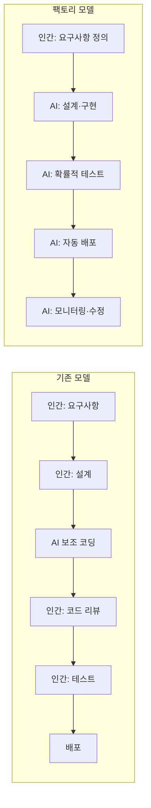
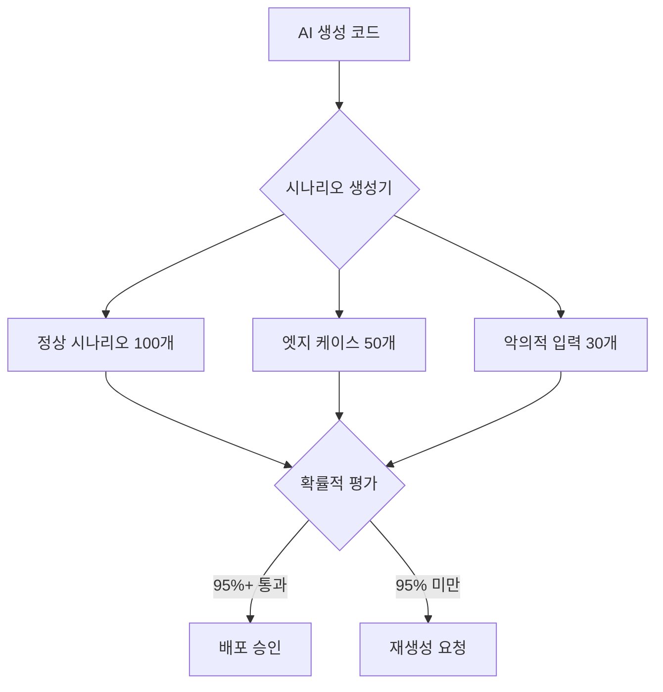
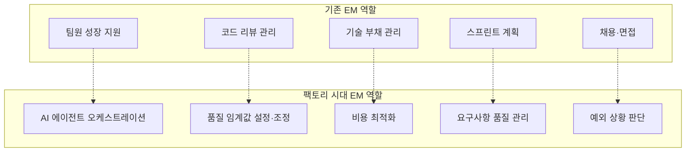

## 개요

"인간이 코드를 한 줄도 쓰지 않는다." 불과 1년 전만 해도 과장된 미래 예측에 불과했던 이 문장이, 2026년 현재 실제 운영 모델로 등장하고 있습니다.

iwashi86의 '[Software Factories And The Agentic Moment](https://iwashi.co/2025/02/01/Software-Factories-And-The-Agentic-Moment)'에서 제시된 <strong>Software Factory</strong> 모델은 단순한 AI 코딩 도구 활용을 넘어, 소프트웨어 개발의 전 과정을 근본적으로 재설계합니다. 인간 개발자가 코드를 작성하거나 리뷰하는 단계 자체를 제거하고, AI 에이전트가 요구사항에서 배포까지의 파이프라인을 자율적으로 운영하는 구조입니다.

이 글에서는 이 팩토리 모델의 핵심 요소인 <strong>코드 제로 프로세스</strong>, <strong>시나리오 기반 확률적 테스트</strong>, <strong>하루 1000달러 컴퓨팅 비용 구조</strong>, 그리고 <strong>EM(Engineering Manager) 역할의 근본적 변화</strong>를 분석합니다.

## 코드 제로의 개발 프로세스

### 기존 모델 vs 팩토리 모델

기존의 AI 지원 개발은 인간 개발자가 중심이었습니다. GitHub Copilot이 코드를 제안하고, 인간이 검토·수정하는 방식이죠. 하지만 Software Factory 모델은 이 전제 자체를 뒤집습니다.



팩토리 모델에서 인간의 역할은 <strong>"무엇을 만들 것인가"를 정의하는 것</strong>에 집중됩니다. "어떻게 만들 것인가"는 전적으로 AI 에이전트의 영역입니다.

### 코드 리뷰가 사라지는 이유

인간이 코드를 리뷰하지 않는다는 것은 품질을 포기한다는 의미가 아닙니다. 오히려 <strong>인간 리뷰의 한계</strong>를 인정하는 것입니다.

- 인간 리뷰어는 하루에 처리할 수 있는 PR 수에 물리적 한계가 있습니다
- AI 에이전트가 하루에 수백 개의 PR을 생성하는 환경에서 인간 리뷰는 병목이 됩니다
- 대신 <strong>시나리오 기반 확률적 테스트</strong>가 품질 게이트 역할을 대체합니다

## 시나리오 기반 확률적 테스트

### 결정론적 테스트의 한계

전통적인 소프트웨어 테스트는 결정론적입니다. "입력 A를 넣으면 출력 B가 나와야 한다"라는 단정적 검증이죠. 하지만 AI가 생성한 코드에는 다른 접근이 필요합니다.



### 확률적 테스트의 원리

확률적 테스트는 100% 통과를 요구하지 않습니다. 대신 <strong>통계적으로 유의미한 수준의 정확도</strong>를 검증합니다.

1. <strong>시나리오 자동 생성</strong>: AI가 다양한 사용 시나리오를 자동으로 생성합니다
2. <strong>대량 실행</strong>: 수백~수천 개의 시나리오를 병렬로 실행합니다
3. <strong>통계적 평가</strong>: 전체 통과율, 성능 분포, 에러 패턴을 분석합니다
4. <strong>임계값 기반 판단</strong>: 미리 정의된 통과율(예: 95%)을 넘으면 배포를 승인합니다

이 방식은 마치 제조업의 <strong>통계적 품질 관리(SQC)</strong>와 유사합니다. 모든 제품을 하나하나 검사하는 대신, 통계적 샘플링으로 전체 품질을 보증하는 것입니다.

### 테스트 비용과 코드 생성 비용의 역전

흥미로운 점은 <strong>테스트 비용이 코드 생성 비용보다 커지는</strong> 현상입니다. 코드 생성은 한 번이면 되지만, 그 코드의 품질을 검증하기 위해 수백 개의 시나리오를 실행해야 하기 때문입니다. 이것이 하루 1000달러라는 컴퓨팅 비용의 주요 원인입니다.

## 하루 1000달러의 컴퓨팅 비용

### 비용 구조 분석

Software Factory를 운영하는 데 하루 약 1000달러의 컴퓨팅 비용이 필요하다는 추정은, 다음과 같은 구성으로 설명됩니다.

| 항목 | 비중 | 일일 비용 (추정) |
|------|------|-----------------|
| AI 에이전트 추론 (코드 생성) | 30% | ~$300 |
| 시나리오 기반 테스트 실행 | 40% | ~$400 |
| CI/CD 파이프라인 | 15% | ~$150 |
| 모니터링·롤백 시스템 | 15% | ~$150 |

### 개발자 인건비와의 비교

시니어 개발자 한 명의 일일 인건비를 $500~$800으로 산정하면, 하루 $1000의 컴퓨팅 비용은 <strong>개발자 1.5~2명분에 해당</strong>합니다. 하지만 AI 팩토리가 처리하는 작업량은 인간 팀의 수십 배에 달합니다.

```
팩토리 모델의 경제성:
- 일일 비용: ~$1,000 (컴퓨팅)
- 일일 산출물: PR 200~500개 처리
- 인간 팀 동일 산출물: 개발자 20~50명 필요
- 인간 팀 일일 비용: $10,000~$40,000
```

이 10배 이상의 비용 효율성이 Software Factory 모델의 경제적 근거입니다. 물론 이는 <strong>반복적·정형화된 작업</strong>에서의 비교이며, 완전히 새로운 아키텍처 설계 같은 창의적 작업에는 아직 인간의 개입이 필요합니다.

## EM(Engineering Manager)의 역할 변화

### 기존 EM의 역할

전통적인 EM은 다음과 같은 역할을 수행했습니다:

- 팀원의 기술적 성장 지원
- 코드 리뷰 프로세스 관리
- 스프린트 계획 및 작업 분배
- 기술 부채 관리
- 채용 및 면접

### 팩토리 시대의 EM

Software Factory 모델에서 EM의 역할은 근본적으로 변화합니다.



구체적으로 살펴보면:

1. <strong>AI 에이전트 오케스트레이션</strong>: 어떤 에이전트를 어떤 조합으로 운용할지, 에이전트 간 협업 패턴을 설계합니다
2. <strong>품질 임계값 설정</strong>: 확률적 테스트의 통과 기준을 비즈니스 요구에 맞게 조정합니다. 결제 시스템은 99.9%, 관리 화면은 95% 등
3. <strong>비용 최적화</strong>: 하루 $1000의 컴퓨팅 예산을 어떤 태스크에 얼마만큼 배분할지 결정합니다
4. <strong>요구사항 품질 관리</strong>: AI가 올바른 코드를 생성하려면 요구사항이 명확해야 합니다. 모호한 요구사항은 모호한 결과물을 만듭니다
5. <strong>예외 상황 판단</strong>: AI가 처리하지 못하는 엣지 케이스에 대한 최종 판단을 내립니다

### EM에서 "팩토리 매니저"로

이 변화의 핵심은, EM이 <strong>사람을 관리하는 역할</strong>에서 <strong>시스템을 관리하는 역할</strong>로 전환된다는 것입니다. 인간 팀원의 역량을 키우는 대신, AI 에이전트 파이프라인의 효율을 최적화하는 역할이 중심이 됩니다.

이는 제조업에서 현장 감독이 자동화 라인의 도입으로 "공장 관리자"로 역할이 바뀐 것과 유사한 패턴입니다.

## 현실적 과제와 한계

### 팩토리 모델이 적합한 영역

- CRUD 중심의 비즈니스 로직
- 정형화된 API 개발
- 반복적인 UI 컴포넌트 구현
- 마이그레이션·리팩토링 작업

### 아직 인간이 필요한 영역

- 시스템 아키텍처의 근본적 설계
- 비즈니스 도메인의 깊은 이해가 필요한 판단
- 규제 대응 및 컴플라이언스
- 사용자 경험의 감성적 평가

### 조직적 과제

- <strong>신뢰의 문제</strong>: AI가 생성한 코드를 인간이 검토 없이 프로덕션에 배포하는 것에 대한 조직의 신뢰 구축
- <strong>책임의 문제</strong>: AI가 만든 버그의 책임 소재
- <strong>성장의 문제</strong>: 주니어 개발자가 코드를 작성하지 않는 환경에서 어떻게 성장하는가

## 결론

Software Factory 모델은 소프트웨어 개발의 <strong>산업혁명</strong>이라 부를 만합니다. 수공업에서 공장 생산으로 전환되었듯, 소프트웨어 개발도 장인의 수작업에서 자동화된 팩토리 라인으로 전환되고 있습니다.

중요한 것은 이 변화가 개발자를 불필요하게 만드는 것이 아니라, <strong>개발자의 역할을 재정의</strong>한다는 것입니다. 코드를 쓰는 사람에서, 시스템을 설계하고 감독하는 사람으로. EM은 팀을 관리하는 사람에서, 팩토리 라인을 최적화하는 사람으로.

하루 $1000의 컴퓨팅 비용은 이 전환의 입장료입니다. 그리고 이 비용은 계속 낮아질 것입니다. 진짜 질문은 "이 모델이 가능한가?"가 아니라 <strong>"우리 조직은 이 전환에 준비되어 있는가?"</strong>입니다.

## 참고 자료

- [Software Factories And The Agentic Moment — iwashi86](https://iwashi.co/2025/02/01/Software-Factories-And-The-Agentic-Moment)
- [Anthropic Claude의 에이전틱 코딩 패턴](https://docs.anthropic.com/en/docs/agents)
- [Statistical Quality Control in Manufacturing — ASQ](https://asq.org/quality-resources/statistical-quality-control)
