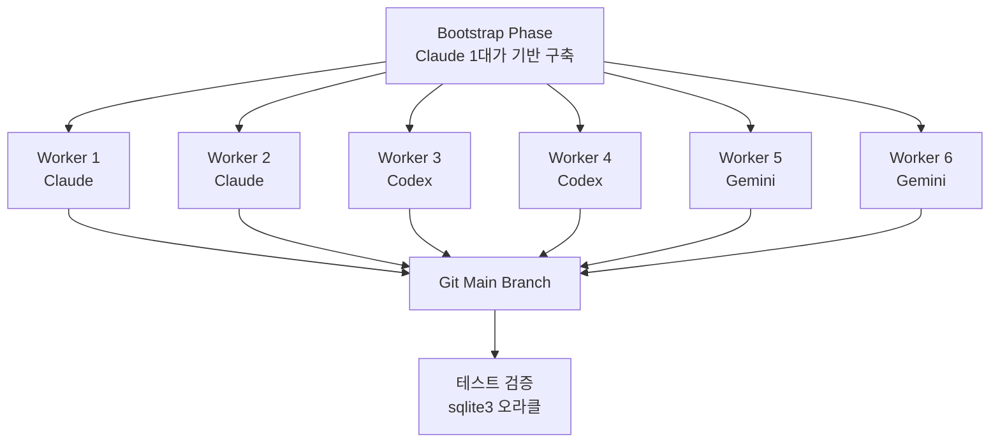
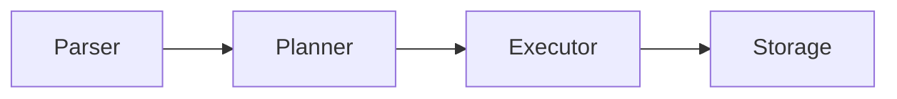

## 개요

6대의 AI 에이전트(Claude 2대, Codex 2대, Gemini 2대)가 <strong>병렬로 협업</strong>하여 Rust로 SQLite 호환 데이터베이스 엔진을 구축한 실험이 공개되었습니다. 결과물은 약 19,000줄의 코드, 282개의 유닛 테스트를 통과하는 완성도 높은 시스템입니다.

이 실험은 [Kian Kyars의 블로그 포스트](https://kiankyars.github.io/machine_learning/2026/02/12/sqlite.html)에서 상세히 다루어졌으며, Hacker News에서 63포인트를 기록하며 주목받았습니다.

## 아키텍처: 분산 시스템으로서의 소프트웨어 개발

이 프로젝트의 핵심 아이디어는 간단합니다. <strong>소프트웨어 엔지니어링을 분산 시스템처럼 취급</strong>하는 것입니다. 조정 수단은 git, 락 파일, 테스트, 머지 규율입니다.

### 워크플로우



### 에이전트 루프

각 에이전트는 다음 루프를 무한 반복합니다:

1. 최신 main 브랜치 풀
2. 스코프가 정해진 태스크 하나를 클레임 (락 파일)
3. 구현 + sqlite3를 오라클로 한 테스트
4. 공유 진행 문서/노트 업데이트
5. 푸시

## 구현된 기능

이 스웜이 구축한 SQLite 클론의 완성도는 놀랍습니다:

| 레이어 | 구현 항목 |
|--------|-----------|
| <strong>파서</strong> | SQL 파서 |
| <strong>플래너</strong> | 통계 기반 쿼리 플래닝 |
| <strong>실행기</strong> | Volcano 모델 실행기 |
| <strong>스토리지</strong> | 페이저, B+트리 |
| <strong>트랜잭션</strong> | WAL, 리커버리, 트랜잭션 시맨틱스 |
| <strong>기능</strong> | JOIN, 집계, 인덱싱, 그룹 집계 |

총 <strong>154 커밋</strong>, 개발 기간 2일(2026-02-10 ~ 02-12).

## 조정 비용의 현실

가장 흥미로운 발견은 <strong>조정 비용(coordination tax)</strong>입니다.

```
전체 커밋: 154
조정 관련 커밋: 84 (54.5%)
├── 락 클레임
├── 락 해제
├── 스테일 락 정리
└── 태스크 조정
```

<strong>전체 커밋의 54.5%가 순수한 조정 오버헤드</strong>였습니다. 이는 멀티 에이전트 시스템의 병렬 처리량이 락 위생과 스테일 락 정리 규율에 크게 의존함을 보여줍니다.

## 성공 요인 분석

### 1. 오라클 기반 검증 + 높은 테스트 빈도

sqlite3를 정답(oracle)으로 사용하여 각 에이전트의 출력을 검증했습니다. `cargo test`와 `./test.sh`를 통한 빠른 피드백 루프가 결정적이었습니다.

### 2. 강한 모듈 경계



파서 → 플래너 → 실행기 → 스토리지로 이어지는 명확한 모듈 경계 덕분에 에이전트들이 <strong>직교적인 슬라이스</strong>에서 작업할 수 있었고, 머지 충돌이 최소화되었습니다.

### 3. 공유 상태 문서는 "문서"가 아닌 "런타임"

PROGRESS.md와 디자인 노트는 단순한 문서가 아니라 <strong>시스템의 런타임 상태</strong>로 기능했습니다. 이는 멀티 에이전트 협업에서 공유 상태 관리의 중요성을 보여줍니다.

## 한계와 교훈

### 코얼레서(Coalescer)의 부재

중복과 드리프트를 정리하기 위한 코얼레서 에이전트가 구현되었지만, 프로젝트 종료 시점에 한 번만 실행되었습니다. Gemini는 전체 중복 제거를 완료하지 못하고 중간에 중단되었습니다. <strong>코얼레서는 다른 에이전트만큼 자주 실행되어야</strong> 합니다.

### 토큰 사용량 추적 불가

각 플랫폼이 서로 다른 형식을 사용하기 때문에 어느 에이전트가 가장 많은 기여를 했는지 파악할 수 없었습니다.

### 문서 폭발

PROGRESS.md가 490줄까지 늘어나고 notes 디렉토리에 방대한 양의 문서가 쌓였습니다. 이는 에이전트 간 통신의 비용을 보여줍니다.

## 이전 연구와의 비교

이 실험은 [Verdent AI의 멀티 에이전트 SWE-bench 결과](/ko/blog/multi-agent-swe-bench-verdent)와 같은 맥락에 있습니다. Verdent가 벤치마크에서의 병렬 실행 효과를 보여주었다면, 이 SQLite 프로젝트는 <strong>실제 시스템 구축에서의 멀티 에이전트 분업</strong>을 실증합니다.

핵심 공통점:

- 에이전트에게 <strong>좁은 인터페이스</strong>, <strong>공통 진실 소스</strong>, <strong>빠른 피드백</strong>을 주면 실제 시스템 코드에서 복합적인 처리량을 얻을 수 있다
- 테스트는 <strong>안티 엔트로피 힘</strong>이다

## 핵심 요약

| 항목 | 수치 |
|------|------|
| 에이전트 수 | 6대 (Claude 2 + Codex 2 + Gemini 2) |
| 코드 라인 | ~19,000줄 (Rust) |
| 커밋 수 | 154 |
| 조정 오버헤드 | 54.5% |
| 테스트 | 282개 통과 |
| 개발 기간 | 2일 |

## 결론

이 실험은 멀티 에이전트 개발의 가능성과 한계를 동시에 보여줍니다. 6대의 에이전트가 2일 만에 19,000줄의 작동하는 데이터베이스 엔진을 만들었다는 것은 인상적이지만, 커밋의 절반 이상이 조정 오버헤드였다는 사실은 간과할 수 없습니다.

<strong>병렬성은 강력하지만, 엄격한 태스크 경계가 있어야만 효과적</strong>입니다. 그리고 테스트는 단순한 품질 보증이 아니라 에이전트 시스템의 엔트로피에 대항하는 핵심 메커니즘입니다.

## 참고 자료

- [Building SQLite With a Small Swarm — Kian Kyars](https://kiankyars.github.io/machine_learning/2026/02/12/sqlite.html)
- [GitHub: kiankyars/sqlite](https://github.com/kiankyars/sqlite)
- [GitHub: kiankyars/parallel-ralph](https://github.com/kiankyars/parallel-ralph)
- [Anthropic: Building a C Compiler](https://www.anthropic.com/engineering/building-c-compiler)
- [Cursor: Scaling Agents](https://cursor.com/blog/scaling-agents)
