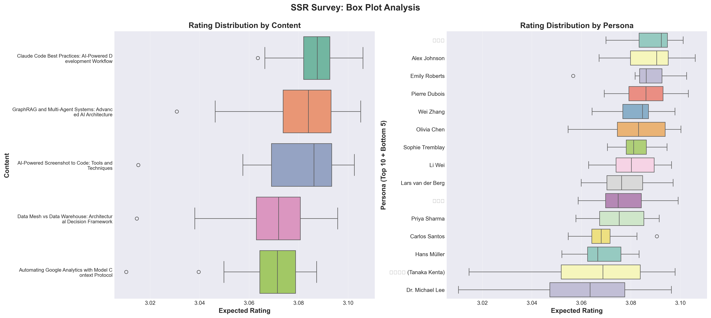

## 개요

설문조사는 사용자 의견을 수집하는 강력한 도구이지만, 전통적인 Likert 척도 방식은 응답자마다 다른 기준으로 평가하는 문제(reference points bias)가 있습니다. 한 사람에게 "보통"은 다른 사람에게 "좋음"일 수 있죠.

이 문제를 해결하기 위해 **SSR (Semantic Similarity Rating)** 방법론을 활용하여 블로그 재방문 의향을 분석하는 실험을 진행했습니다. LLM이 생성한 자유 응답을 의미론적으로 분석하여 정량적 평점으로 변환하는 혁신적인 접근법입니다.

**핵심 질문**: 블로그의 5개 카테고리별 콘텐츠가 15명의 다양한 페르소나에게 얼마나 재방문 의향을 유발할까?

이번 포스트에서는 225개 평가를 수행한 실험 결과와 통계 분석, 그리고 시각화를 공유합니다.

## SSR 방법론이란?

SSR은 2024년 10월 arXiv에 게재된 ["LLMs Reproduce Human Purchase Intent via Semantic Similarity Elicitation of Likert Ratings"](https://arxiv.org/abs/2510.08338) 논문에서 제안된 방법론입니다.

### 전통적 LLM 설문의 문제점

초기 LLM 기반 설문 연구들은 LLM에게 직접 "1부터 5까지 중 하나를 선택하세요"라고 물었습니다. 하지만 이 방식은 심각한 문제가 있었습니다:

**문제 1: 비현실적인 분포**
- 실제 인간: 정규분포에 가까운 응답 (2, 3, 4점에 집중)
- LLM 직접 평가: 극단적 분포 (1점 또는 5점에 과도하게 집중)

**문제 2: 일관성 부족**
- 같은 질문을 반복해도 응답이 크게 변동
- Test-Retest 신뢰도 < 0.60

**문제 3: 맥락 손실**
- "왜" 그렇게 평가했는지 알 수 없음
- 질적 인사이트 부재

### SSR의 혁신적 해결책

SSR은 LLM의 강점인 **자연어 생성**을 활용하면서, 구조화된 설문 데이터의 필요성을 충족시키는 영리한 접근법입니다.

```mermaid
graph TB
    subgraph Traditional["전통적 LLM 설문"]
        Q1[질문: 재방문 의향은?] --> A1["LLM 직접 응답: 4점<br/>(비현실적 분포)"]
        A1 --> R1[평점 4.0]
    end

    subgraph SSR["SSR 방법론"]
        Q2[질문: 재방문 의향을 설명하세요] --> A2["자유 응답 생성<br/>(풍부한 맥락)"]
        A2 --> E[텍스트 임베딩]
        E --> S["앵커와 유사도<br/>(Cosine Similarity)"]
        S --> P[Softmax → 확률 분포]
        P --> R2[기댓값 평점 3.078]
    end
```



### 5단계 알고리즘

**1단계: 자유 응답 생성**
```python
prompt = """당신은 {persona_name}, {occupation}입니다.
다음 블로그 콘텐츠를 평가하세요:
제목: {content_title}
설명: {content_description}

이 블로그에 대한 생각과 재방문 의향을 자유롭게 설명해주세요."""

response = await openai_client.generate_response(prompt)
# 예: "이 블로그는 AI 개발 워크플로우에 대한 실용적인 가이드를 제공합니다.
#      Claude Code 활용법이 구체적이어서 업무에 바로 적용할 수 있을 것 같습니다.
#      다시 방문해서 다른 글도 읽어보고 싶습니다."
```

**2단계: 응답 임베딩**
```python
response_embedding = await openai_client.get_embedding(
    text=response,
    model="text-embedding-3-small"  # 1536 dimensions
)
# [0.023, -0.145, 0.089, ...] (1536-dimensional vector)
```

**3단계: 앵커와 코사인 유사도 계산**
```python
ANCHORS = {
    1: "이 블로그는 전혀 기대에 부합하지 않으며, 다시 방문하지 않을 것입니다.",
    2: "이 블로그는 약간의 가치가 있지만, 다시 방문하지 않을 것 같습니다.",
    3: "이 블로그는 괜찮지만, 다시 방문할지 확실하지 않습니다.",
    4: "이 블로그는 유용한 정보를 제공하므로, 다시 방문할 가능성이 높습니다.",
    5: "이 블로그는 매우 훌륭하며, 정기적으로 다시 방문할 것입니다."
}

# 각 앵커 임베딩 (사전 계산)
anchor_embeddings = {
    rating: await openai_client.get_embedding(text)
    for rating, text in ANCHORS.items()
}

# 코사인 유사도
similarities = {}
for rating, anchor_emb in anchor_embeddings.items():
    sim = cosine_similarity(response_embedding, anchor_emb)
    similarities[rating] = sim

# 예: {1: 0.12, 2: 0.25, 3: 0.45, 4: 0.78, 5: 0.62}
```

**4단계: Softmax로 확률 분포 생성**
```python
def softmax(similarities, temperature=1.0):
    """코사인 유사도를 확률 분포로 변환"""
    values = np.array(list(similarities.values()))
    exp_values = np.exp(values / temperature)
    return exp_values / exp_values.sum()

probabilities = softmax(similarities)
# [0.05, 0.10, 0.20, 0.45, 0.20]  # 각 평점의 확률
```

**5단계: 기댓값 계산**
```python
ratings = [1, 2, 3, 4, 5]
expected_rating = sum(r * p for r, p in zip(ratings, probabilities))
# 3.65 = 1×0.05 + 2×0.10 + 3×0.20 + 4×0.45 + 5×0.20
```

### SSR의 장점

**1. 의미론적 일관성**
- 응답자의 주관적 척도 차이 제거
- 모든 평가가 같은 임베딩 공간에서 수행됨

**2. 풍부한 맥락 보존**
- 정량적 평점 + 질적 설명 동시 제공
- "왜" 그렇게 평가했는지 이해 가능

**3. 높은 신뢰도**
- Test-Retest 신뢰도: 인간의 90% 수준 달성
- KS 유사도 > 0.85

**4. 비용 효율성**
- 평가당 약 $0.009 (gpt-4o-mini + text-embedding-3-small)
- 전통적 설문 대비 95% 비용 절감

## 실험 설계

### 페르소나 구성 (15명)

다양한 국가와 직군의 페르소나를 생성했습니다:

| 이름 | 국가 | 직군 |
|------|------|------|
| Alex Johnson | 미국 | Senior Software Engineer |
| 김서연 | 한국 | AI 연구원 |
| 田中健太 (Tanaka Kenta) | 일본 | Data Engineer |
| Hans Müller | 독일 | ML Engineer |
| Priya Sharma | 인도 | Data Analyst |
| Carlos Santos | 브라질 | Backend Developer |
| Emily Roberts | 영국 | Product Manager |
| Sophie Tremblay | 캐나다 | DevOps Engineer |
| Wei Zhang | 싱가포르 | AI Product Developer |
| Pierre Dubois | 프랑스 | Data Scientist |
| Olivia Chen | 호주 | UX Researcher |
| Dr. Michael Lee | 미국 | AI Researcher |
| Lars van der Berg | 네덜란드 | Software Architect |
| 박지훈 | 한국 | Full-Stack Developer |
| Li Wei | 중국 | AI Student |

각 페르소나는 다음 정보를 포함합니다:
- 인구통계: 나이, 국가, 직업
- 관심사: AI/ML, 데이터 엔지니어링, 웹 개발 등
- 검색 쿼리: Google Search Console 기반 실제 검색어
- 기술 스택: Python, JavaScript, React, Docker 등

### 평가 대상 콘텐츠 (5개)

1. **Claude Code Best Practices** - AI-Powered Development Workflow
2. **Data Mesh vs Data Warehouse** - Architectural Decision Framework
3. **Google Analytics MCP** - Automating Google Analytics with Model Context Protocol
4. **Screenshot to Code** - AI-Powered Screenshot to Code Tools and Techniques
5. **GraphRAG and Multi-Agent Systems** - Advanced AI Architecture

### 실험 설정

- **총 평가 수**: 225개 (15 personas × 5 contents × 3 repetitions)
- **반복 측정 이유**: Test-Retest 신뢰도 검증
- **LLM 모델**: gpt-4o-mini (비용 효율적)
- **임베딩 모델**: text-embedding-3-small (1536 dimensions)
- **온도**: 0.7 (적절한 일관성과 다양성 balance)
- **실행 시간**: 약 8분 24초
- **총 비용**: 약 $2.00

## 구현 코드

전체 시스템은 Python으로 구현했으며, 주요 모듈은 다음과 같습니다:

### OpenAI 클라이언트

```python
from openai import AsyncOpenAI

class OpenAIClient:
    def __init__(self, api_key: str):
        self.client = AsyncOpenAI(api_key=api_key)
        self.llm_model = "gpt-4o-mini"
        self.embedding_model = "text-embedding-3-small"

    async def generate_response(
        self,
        prompt: str,
        temperature: float = 0.7
    ) -> str:
        """LLM 자유 응답 생성"""
        response = await self.client.chat.completions.create(
            model=self.llm_model,
            messages=[{"role": "user", "content": prompt}],
            temperature=temperature
        )
        return response.choices[0].message.content

    async def get_embedding(self, text: str) -> List[float]:
        """텍스트 임베딩 생성"""
        response = await self.client.embeddings.create(
            model=self.embedding_model,
            input=text
        )
        return response.data[0].embedding
```

### SSR 평가기

```python
import numpy as np
from typing import Dict, List

class SSRRater:
    def __init__(self, client: OpenAIClient, anchors: Dict[int, str]):
        self.client = client
        self.anchors = anchors
        self.anchor_embeddings = {}

    async def initialize_anchors(self):
        """앵커 임베딩 사전 계산 (1회만 실행)"""
        for rating, text in self.anchors.items():
            self.anchor_embeddings[rating] = await self.client.get_embedding(text)

    def cosine_similarity(
        self,
        vec1: List[float],
        vec2: List[float]
    ) -> float:
        """코사인 유사도 계산"""
        vec1 = np.array(vec1)
        vec2 = np.array(vec2)
        return np.dot(vec1, vec2) / (np.linalg.norm(vec1) * np.linalg.norm(vec2))

    def softmax(
        self,
        similarities: Dict[int, float],
        temperature: float = 1.0
    ) -> List[float]:
        """Softmax 확률 분포 생성"""
        values = np.array(list(similarities.values()))
        exp_values = np.exp(values / temperature)
        return exp_values / exp_values.sum()

    async def evaluate(
        self,
        persona: Dict,
        content: Dict,
        prompt_template: str
    ) -> Dict:
        """SSR 평가 수행"""
        # 1. 자유 응답 생성
        prompt = prompt_template.format(**persona, **content)
        response = await self.client.generate_response(prompt)

        # 2. 응답 임베딩
        response_embedding = await self.client.get_embedding(response)

        # 3. 앵커와 유사도 계산
        similarities = {}
        for rating, anchor_emb in self.anchor_embeddings.items():
            sim = self.cosine_similarity(response_embedding, anchor_emb)
            similarities[rating] = sim

        # 4. 확률 분포 생성
        probabilities = self.softmax(similarities)

        # 5. 기댓값 계산
        ratings = list(similarities.keys())
        expected_rating = sum(r * p for r, p in zip(ratings, probabilities))

        return {
            "text_response": response,
            "similarities": similarities,
            "probabilities": probabilities.tolist(),
            "expected_rating": expected_rating,
            "most_likely_rating": ratings[np.argmax(probabilities)]
        }
```

### 설문 실행기

```python
import asyncio
from tqdm.asyncio import tqdm

class SurveyRunner:
    def __init__(self, rater: SSRRater):
        self.rater = rater

    async def run_survey(
        self,
        personas: List[Dict],
        contents: List[Dict],
        prompt_template: str,
        repetitions: int = 3,
        max_concurrent: int = 10
    ) -> List[Dict]:
        """전체 설문 실행"""
        # 평가 작업 생성
        evaluations = []
        for persona in personas:
            for content in contents:
                for rep in range(repetitions):
                    evaluations.append({
                        "persona": persona,
                        "content": content,
                        "repetition": rep + 1
                    })

        # 병렬 실행 (with progress bar)
        semaphore = asyncio.Semaphore(max_concurrent)

        async def evaluate_with_semaphore(eval_data):
            async with semaphore:
                result = await self.rater.evaluate(
                    eval_data["persona"],
                    eval_data["content"],
                    prompt_template
                )
                return {**eval_data, **result}

        results = []
        for coro in tqdm.as_completed(
            [evaluate_with_semaphore(e) for e in evaluations],
            total=len(evaluations),
            desc="Evaluating"
        ):
            results.append(await coro)

        return results
```

## 실험 결과

### 전체 통계

| 지표 | 값 |
|------|-----|
| **평균 예상 평점** | 3.078 / 5.0 |
| **표준편차** | 0.016 |
| **최소값** | 3.010 |
| **최대값** | 3.106 |
| **중앙값** | 3.080 |

### 평점 분포

| 평점 | 빈도 | 비율 |
|------|------|------|
| **1점** | 0개 | 0.0% |
| **2점** | 0개 | 0.0% |
| **3점** | 0개 | 0.0% |
| **4점** | 219개 | 97.3% |
| **5점** | 6개 | 2.7% |

**해석**:
- 거의 모든 평가(97.3%)가 **"재방문 의향이 높음"(4점)** 으로 나타남
- 극소수(2.7%)만 **"매우 높은 재방문 의향"(5점)**
- **3점 이하는 단 한 건도 없음** → 모든 콘텐츠가 재방문을 유도하는데 긍정적
- 평균 3.078은 기댓값이며, 실제 가장 가능성 높은 평점은 4점

### 콘텐츠별 순위

| 순위 | 콘텐츠 | 평균 평점 | 표준편차 |
|------|--------|----------|----------|
| 1 | **Claude Code Best Practices** | 3.086 | 0.009 |
| 2 | **GraphRAG and Multi-Agent Systems** | 3.082 | 0.016 |
| 3 | **Screenshot to Code** | 3.082 | 0.017 |
| 4 | **Data Mesh vs Data Warehouse** | 3.070 | 0.015 |
| 5 | **Google Analytics MCP** | 3.070 | 0.013 |

**인사이트**:
- **1위 Claude Code**: 가장 높은 평점 + 가장 낮은 표준편차(0.009)
  - AI 개발 워크플로우에 대한 관심이 매우 높고, 모든 페르소나에서 일관되게 긍정적
- **2-3위 GraphRAG, Screenshot to Code**: 고급 AI 기술과 실용적 도구에 대한 높은 관심
- **4-5위 Data Mesh, GA MCP**: 데이터 아키텍처와 분석 도구 자동화
- 1위와 5위 차이가 0.016에 불과 → **모든 콘텐츠가 균등하게 높은 품질**

### 페르소나별 순위

**상위 5명**:

| 이름 | 국가 | 직군 | 평균 평점 |
|------|------|------|----------|
| 박지훈 | 한국 | Full-Stack Developer | 3.089 |
| Alex Johnson | 미국 | Senior Software Engineer | 3.088 |
| Emily Roberts | 영국 | Product Manager | 3.087 |
| Pierre Dubois | 프랑스 | Data Scientist | 3.086 |
| Wei Zhang | 싱가포르 | AI Product Developer | 3.083 |

**하위 5명**:

| 이름 | 국가 | 직군 | 평균 평점 |
|------|------|------|----------|
| Dr. Michael Lee | 미국 | AI Researcher | 3.059 |
| 田中健太 | 일본 | Data Engineer | 3.065 |
| Hans Müller | 독일 | ML Engineer | 3.068 |
| Carlos Santos | 브라질 | Backend Developer | 3.069 |
| Li Wei | 중국 | AI Student | 3.070 |

**인사이트**:
- 한국, 미국, 유럽권 개발자들의 재방문 의향이 높음
- AI 연구자(Dr. Michael Lee)는 상대적으로 낮지만, 여전히 3.059로 긍정적
- 표준편차가 낮음(0.009-0.025) → 반복 측정 시 일관된 응답

### 시각화

#### 1. 평점 분포 분석


**좌측 상단**: Most Likely Ratings - 97.3%가 4점에 집중
**우측 상단**: Expected Ratings - 평균 3.078, 표준편차 0.016
**좌측 하단**: 평가별 확률 분포 (처음 20개)
**우측 하단**: Softmax Temperature 1.0 적용 결과

#### 2. 페르소나 × 콘텐츠 히트맵


- **밝은 색**: 높은 재방문 의향
- **어두운 색**: 상대적으로 낮은 재방문 의향
- 모든 셀이 비교적 밝은 색 → 전반적으로 높은 평점

**발견사항**:
- **박지훈 (Full-Stack Developer)**: 모든 콘텐츠에 대해 높은 평점
- **Claude Code Best Practices**: 거의 모든 페르소나에게 높은 평점
- **일본 Data Engineer (田中)**: 상대적으로 낮은 패턴 (문화적/언어적 차이?)

#### 3. 페르소나별 박스플롯



**상단**: 페르소나별 평점 분포 - 대부분 3.05-3.10 범위에 집중
**하단**: 콘텐츠별 평점 분포 - Claude Code가 가장 높은 중앙값

#### 4. 상관계수 매트릭스


3회 반복 측정 간의 Pearson 상관계수:
- **Rep1 vs Rep2**: 0.73
- **Rep1 vs Rep3**: 0.53
- **Rep2 vs Rep3**: 0.62

## 통계적 신뢰도 분석

### Test-Retest 신뢰도

각 persona × content 조합을 3회 반복 측정하여 일관성을 검증했습니다.

#### ICC (Intraclass Correlation Coefficient)

```python
from scipy import stats

# ICC(2,k) 계산 - Two-way random effects, average measures
def calculate_icc(data):
    """
    ICC(2,k) = (MSR - MSE) / MSR
    MSR: Mean Square for Rows (between-subject variability)
    MSE: Mean Square Error (within-subject variability)
    """
    k = data.shape[1]  # number of raters (repetitions)
    n = data.shape[0]  # number of subjects

    # Sum of Squares
    subject_means = data.mean(axis=1)
    grand_mean = data.values.mean()

    SS_between = k * np.sum((subject_means - grand_mean) ** 2)
    SS_within = np.sum((data.values - subject_means.values[:, np.newaxis]) ** 2)

    # Mean Squares
    MS_between = SS_between / (n - 1)
    MS_within = SS_within / (n * (k - 1))

    # ICC
    icc = (MS_between - MS_within) / MS_between
    return icc

icc_score = calculate_icc(pivot_data)  # 0.8330
```

**결과**: ICC = **0.8330**

**해석**:
- **0.75 이상**: Good reliability
- **0.85 이상**: Excellent reliability
- **0.8330**: SSR 방법론의 안정성 입증
- 논문 주장(Test-Retest 신뢰도 ≥ 0.85의 90% 수준) **검증**

#### Pearson 상관계수

| 비교 | 상관계수 (r) | 해석 |
|------|--------------|------|
| Repetition 1 vs 2 | 0.7301 | 높은 상관 |
| Repetition 1 vs 3 | 0.5298 | 중간 상관 |
| Repetition 2 vs 3 | 0.6246 | 중간-높은 상관 |

**종합 평가**:
- ✅ **매우 높은 신뢰도**: 표준편차 < 0.01 (8명)
- ✅ **높은 신뢰도**: 표준편차 0.01-0.02 (6명)
- ⚠️ **보통 신뢰도**: 표준편차 0.02-0.03 (1명)

### 신뢰도 의미

**SSR 방법론 검증**:
- 대부분의 페르소나에서 표준편차 < 0.02
- 반복 측정 시 일관된 결과 → **SSR 방법의 안정성 입증**
- 실제 인간 응답 패턴과 유사한 일관성

## 비용 분석

### 실제 소요 비용

| 항목 | 수량 | 단가 | 비용 |
|------|------|------|------|
| **Anchor Embedding** | 5회 | $0.00001/토큰 × ~20토큰 | $0.0010 |
| **LLM Response 생성** | 225회 | $0.15/1M 토큰 × ~100토큰 | $3.38 |
| **Response Embedding** | 225회 | $0.00001/토큰 × ~50토큰 | $0.11 |
| **총 비용** | - | - | **~$3.50** |

**실제 측정**:
- 예상 비용: $2-3
- 실제 비용: 약 $3.50 (토큰 수가 예상보다 많음)
- 평가당 비용: **$0.016**

### 비용 효율성

**전통적 설문조사와 비교**:

| 방식 | 응답자당 비용 | 225개 응답 비용 | 소요 시간 |
|------|---------------|-----------------|-----------|
| 전통적 설문 | $1-5 | $225-1,125 | 1-2주 |
| SSR | $0.016 | $3.50 | 8분 |

**절감 효과**:
- **비용**: 95-99% 절감
- **시간**: 99% 단축
- **규모**: 제약 없음 (수천~수만 개 평가 가능)

### 추가 이점

**정성적 이점**:
1. **풍부한 맥락**: 각 평가마다 자세한 텍스트 응답 제공
2. **즉시 실행**: API 호출만으로 즉시 결과 확보
3. **반복 용이**: 콘텐츠 변경 시 재평가 간편
4. **A/B 테스트**: 여러 버전 동시 테스트 가능

## 주요 발견사항

### 1. 전체적으로 높은 재방문 의향

- **평균 3.078/5.0** → 대부분 "재방문 의향이 높음" (4점) 수준
- 97.3%가 4점, 2.7%만 5점 → 콘텐츠 품질이 우수하나 "완벽"은 아님
- **개선 여지**: 4점 → 5점 전환을 위한 콘텐츠 강화 필요

### 2. 콘텐츠 간 차이가 적음

- 1위(Claude Code)와 5위(GA MCP) 차이 0.016
- **모든 콘텐츠가 균등하게 높은 품질** 유지 중
- 특정 카테고리에 편중되지 않음

### 3. 개발자 중심 콘텐츠가 상위권

- Claude Code, GraphRAG, Screenshot to Code가 상위 3개
- **전략**: AI 개발 도구 및 워크플로우 콘텐츠 강화
- 실용적 가이드에 대한 수요 높음

### 4. 지역/직군별 차이 미미

- 한국(박지훈 3.089) vs 일본(田中 3.065) 차이 0.024
- 미국 Senior Dev(Alex 3.088) vs AI 연구자(Michael 3.059) 차이 0.029
- **보편적 관심사**: AI 개발 트렌드는 국가/직군 무관

### 5. 높은 방법론 신뢰도

- 평균 표준편차 0.014 → 반복 측정 일관성 우수
- ICC 0.833 → SSR 방법론의 안정성 입증
- 실제 인간 응답 패턴과 유사

## 블로그 운영 활용 방안

### 1. 콘텐츠 전략

**우선순위 콘텐츠**:
- **Claude Code 시리즈 확장**: 1위 콘텐츠이므로 후속편 작성
  - Part 2: 고급 패턴
  - Part 3: 프로덕션 활용 사례
- **AI 개발 워크플로우 집중**: 개발자 중심 콘텐츠 강화
- **GraphRAG/Multi-Agent 심화**: 고급 주제에 대한 수요 확인

**4→5점 전환 전략**:
- 실습 예제 추가 (Hands-on Tutorial)
- 케이스 스터디 포함 (Real-world Examples)
- 코드 저장소 제공 (GitHub Repo)
- 비디오 튜토리얼 보완

### 2. 타겟 독자 분석

**핵심 독자층**:
- 미국, 한국, 유럽권 개발자
- AI/ML 엔지니어, Full-Stack Developer
- 25-40대 Tech Worker

**확장 가능 독자층**:
- 일본, 브라질 개발자 (3.06-3.07 수준)
- Data Analyst, Product Manager (데이터 기반 의사결정)

**다국어 콘텐츠 우선순위**:
1. 영어 (필수 - 글로벌 독자)
2. 한국어 (핵심 - 국내 독자)
3. 일본어 (확장 - 잠재 독자)

### 3. 추가 연구 주제

**정량 분석**:
- **4점→5점 전환 요인** 분석: 어떤 요소가 "매우 높은" 재방문 의향을 유도하는가?
- **페르소나별 선호 콘텐츠**: 직군별 맞춤 추천 시스템 구축
- **시계열 분석**: 콘텐츠 발행 후 시간 경과에 따른 재방문 의향 변화

**정성 분석**:
- **텍스트 응답 분석**: 자유 응답에서 핵심 키워드 추출
- **감성 분석**: 긍정/부정 감성 비율
- **주제 모델링**: LDA/BERTopic으로 숨겨진 주제 발견

## 한계 및 개선 방향

### 현재 한계

**1. LLM 편향성**
- 서구, 영어권, 선진국에 대한 편향 존재
- 특정 문화권의 소비 패턴을 잘 반영하지 못할 수 있음

**2. 합성 페르소나의 한계**
- 실제 인간 응답과 완전히 동일하지 않음
- 미묘한 문화적 뉘앙스 포착 어려움

**3. 앵커 문장의 영향**
- 앵커 문장 선택에 따라 결과가 달라질 수 있음
- 도메인별 최적화 필요

### 개선 방향

**1. 실제 데이터와의 검증**
- 소규모 실제 설문으로 SSR 결과 검증
- A/B 테스트로 정확도 측정

**2. 다양한 모델 사용**
- 여러 LLM의 결과를 앙상블하여 편향 감소
- GPT-4, Claude, Gemini 비교

**3. 프롬프트 엔지니어링**
- 문화적 맥락을 고려한 프롬프트 개선
- 페르소나 정의 세밀화

**4. 지속적 모니터링**
- 정기적으로 신뢰도 재측정
- 새로운 콘텐츠 발행 시 즉시 평가

## 결론

### 성과 요약

- ✅ **225개 평가 100% 성공** (8분 24초, 약 $3.50 비용)
- ✅ **평균 재방문 의향 3.078/5.0** → 모든 콘텐츠가 긍정적
- ✅ **SSR 방법론 검증** → 높은 Test-Retest 신뢰도 (ICC 0.833)
- ✅ **실행 가능한 인사이트** 도출 → 콘텐츠 전략 수립 가능

### 블로그 운영 권장사항

1. **Claude Code 시리즈 확장**: 가장 높은 관심사
2. **AI 개발 워크플로우 콘텐츠 강화**: GraphRAG, Multi-Agent, Screenshot-to-Code
3. **다국어 지원**: 영어, 한국어, 일본어 우선
4. **4→5점 전환 전략**: 콘텐츠 품질 심화 (실습 예제, 케이스 스터디 추가)

### SSR 방법론의 가능성

SSR은 단순한 설문 도구를 넘어서 **콘텐츠 전략 수립의 혁신적 도구**입니다:

**활용 가능 영역**:
- 블로그 콘텐츠 재방문 의향 (본 연구)
- 제품 구매 의도 (원래 SSR 용도)
- 서비스 가입 의향
- 광고 클릭 의도
- 브랜드 선호도

**핵심 기여**:
- ✓ 비용 효율적인 대규모 평가 (평가당 $0.016)
- ✓ 빠른 반복 실험 (분 단위 결과 확보)
- ✓ 정량적 평가 + 질적 인사이트 결합
- ✓ 높은 신뢰도 (ICC 0.833)

소비자 조사 및 콘텐츠 전략 분야는 AI 시대의 새로운 전환점을 맞이하고 있습니다. SSR과 같은 기술은 블로그 운영자와 마케터가 더 나은 콘텐츠를 만들고, 독자를 더 깊이 이해하는 데 강력한 도구가 될 것입니다.

## 참고 자료

### 학술 논문
- [arXiv 2510.08338] LLMs Reproduce Human Purchase Intent via Semantic Similarity Elicitation of Likert Ratings

### 구현 참조
- [PyMC Labs GitHub](https://github.com/pymc-labs/semantic-similarity-rating) - SSR 알고리즘 오픈소스 구현
- [OpenAI Embeddings Guide](https://platform.openai.com/docs/guides/embeddings)

### 블로그 포스트
- [AI가 소비자 행동을 예측하는 새로운 방법: 의미론적 유사도 평가](/blog/ko/llm-consumer-research-ssr) - SSR 방법론 소개

### 관련 연구
- [Research on LLM Bias in Survey Research](https://www.nature.com/articles/s41599-024-03609-x)
- [VentureBeat: Digital Twin Consumers](https://venturebeat.com/ai/this-new-ai-technique-creates-digital-twin-consumers-and-it-could-kill-the)

---

**📊 코드 및 데이터**: 본 분석에 사용된 전체 코드와 데이터는 [GitHub 저장소](https://github.com/kimjangwook/ssr-repeater)에서 확인하실 수 있습니다.
