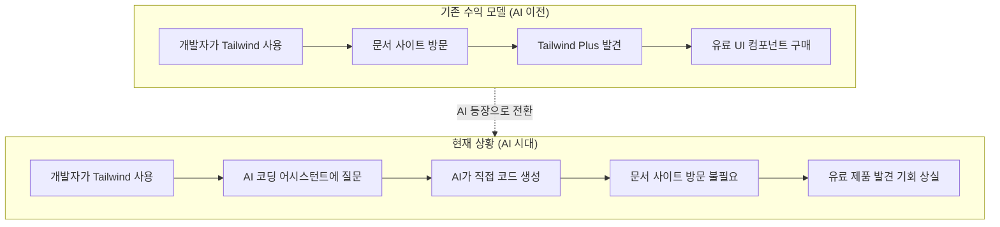
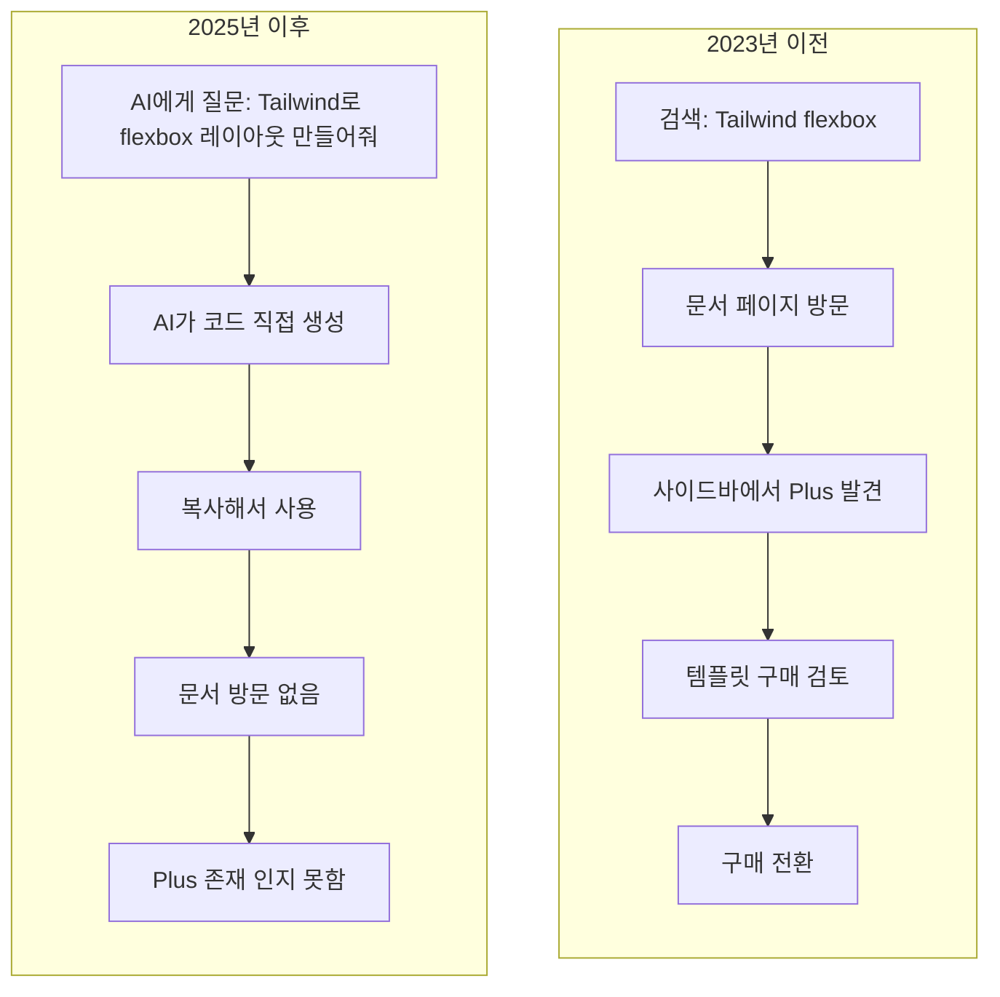
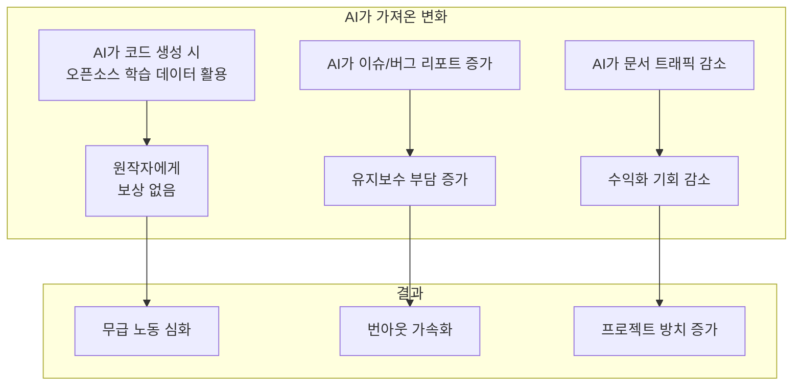
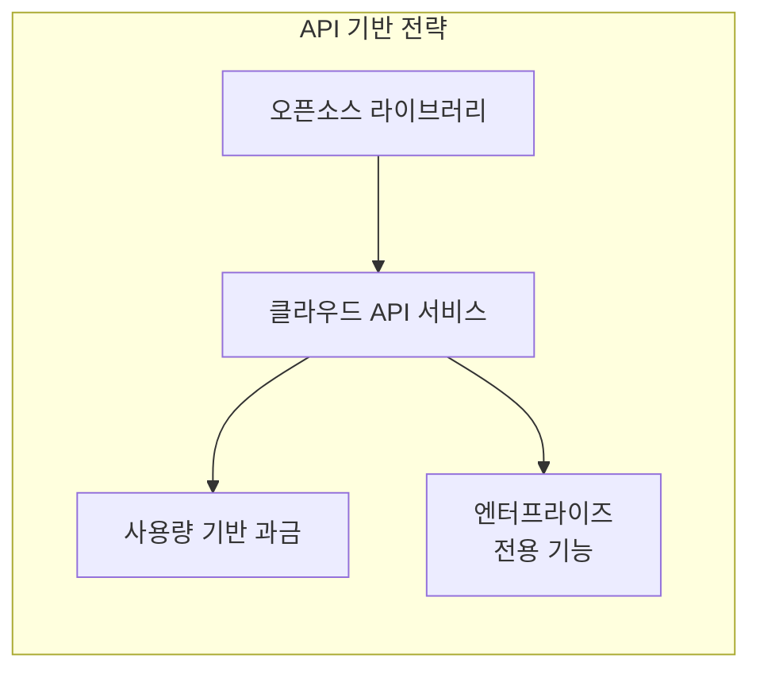

## 개요

2026년 1월 6일, 웹 개발자들 사이에서 가장 인기 있는 CSS 프레임워크 중 하나인 <strong>Tailwind CSS</strong>를 만든 Tailwind Labs가 엔지니어링 팀의 75%를 해고했다는 소식이 전해졌습니다. 창립자이자 CEO인 Adam Wathan은 이 결정의 원인으로 "AI가 우리 비즈니스에 미친 잔인한 영향"을 직접적으로 언급했습니다.

이 사건은 단순한 한 스타트업의 구조조정이 아닙니다. <strong>AI 시대에 오픈소스 프로젝트가 어떻게 수익을 창출하고 지속 가능성을 유지할 수 있는가</strong>라는 근본적인 질문을 던지고 있습니다.

## Tailwind Labs 사태: 무슨 일이 있었나

### 숫자로 보는 충격

| 지표 | 변화 |
|------|------|
| 엔지니어링 팀 | 4명 → 1명 (75% 감축) |
| 매출 | 약 80% 감소 |
| 문서 트래픽 | 2023년 초 대비 40% 감소 |
| 프레임워크 인기도 | 지속 상승 (617,000+ 웹사이트 사용) |

가장 아이러니한 점은 <strong>Tailwind CSS 자체는 그 어느 때보다 인기 있다</strong>는 것입니다. 사용자 수는 늘었지만 매출은 급감했습니다.

### 비즈니스 모델의 붕괴

Tailwind Labs의 수익 구조는 다음과 같았습니다:



<strong>핵심 문제</strong>: AI 코딩 어시스턴트(GitHub Copilot, Cursor, Claude 등)가 개발자의 질문에 직접 답변하면서, 개발자들이 더 이상 공식 문서를 방문할 필요가 없어졌습니다. 문서 트래픽이 유료 제품 발견의 유일한 경로였기 때문에, 트래픽 감소는 곧 매출 감소로 이어졌습니다.

### LLM 친화적 문서 요청의 거절

사태가 공개된 계기는 흥미롭습니다. 한 오픈소스 기여자가 Tailwind 문서를 <strong>LLM이 더 쉽게 소비할 수 있는 형식으로 병합</strong>하는 PR을 제출했습니다. Adam Wathan은 이 PR을 거절하며 다음과 같이 밝혔습니다:

> "이 변경은 우리 비즈니스를 더욱 지속 불가능하게 만들 것입니다."

문서를 AI에 더 친화적으로 만들면, AI가 더 정확한 답변을 제공하게 되고, 이는 문서 사이트 방문을 더욱 줄이는 악순환을 만들기 때문입니다.

## AI가 파괴한 "문서 → 유료 제품" 퍼널

### 전통적인 오픈소스 수익화 모델

지금까지 많은 오픈소스 프로젝트들이 사용해온 수익화 전략은 다음과 같습니다:

1. <strong>오픈코어(Open Core)</strong>: 핵심은 무료, 고급 기능은 유료
2. <strong>문서 기반 전환</strong>: 문서 사이트에서 유료 제품/서비스 홍보
3. <strong>SaaS/호스팅 서비스</strong>: 관리형 서비스 제공
4. <strong>컨설팅/교육</strong>: 전문 지식 기반 서비스
5. <strong>후원/기부</strong>: GitHub Sponsors, Open Collective 등

Tailwind Labs는 주로 <strong>2번 모델</strong>에 의존했습니다. Tailwind Plus라는 유료 UI 컴포넌트/템플릿을 판매했고, 개발자들이 문서를 보다가 자연스럽게 이를 발견하는 구조였습니다.

### AI 시대의 퍼널 붕괴



<strong>AI가 중개자 역할을 가져감</strong>으로써, 개발자와 문서 사이트 사이의 연결고리가 끊어졌습니다. 이는 Tailwind만의 문제가 아닙니다. 문서 트래픽에 의존하는 모든 비즈니스 모델이 위협받고 있습니다.

## 오픈소스 기여자들의 무급 노동 심화

### 충격적인 통계

Tailwind 사태는 더 큰 문제의 일부입니다:

- <strong>60%의 오픈소스 유지보수자</strong>가 번아웃으로 인해 프로젝트를 그만두었거나 그만둘 것을 고려 중
- 대부분의 유지보수자는 <strong>급여 없이</strong> 중요한 인프라를 관리
- 기업들은 오픈소스에 <strong>수십억 달러의 가치</strong>를 의존하면서도 기여는 미미

### AI가 악화시키는 무급 노동

AI 시대에 오픈소스 기여자들의 상황은 더욱 어려워지고 있습니다:



<strong>문제의 핵심</strong>: AI 기업들은 오픈소스 코드로 모델을 훈련시켜 수십억 달러를 벌지만, 그 코드를 작성한 유지보수자들에게는 거의 아무것도 돌아가지 않습니다.

### 지속 불가능한 생태계

현재의 오픈소스 생태계는 <strong>소수의 헌신적인 유지보수자들의 무급 노동</strong>에 의존하고 있습니다. 이는 지속 가능하지 않으며, 다음과 같은 위험을 내포합니다:

1. <strong>보안 취약점</strong>: 유지보수자 부재로 인한 패치 지연
2. <strong>혁신 둔화</strong>: 번아웃으로 인한 개발 중단
3. <strong>공급망 위험</strong>: 핵심 의존성의 갑작스러운 방치

## AI 시대의 지속 가능한 수익화 방안

### 1. API/서비스 기반 모델로 전환

문서 트래픽 대신 <strong>실제 사용량</strong>에 기반한 수익화:



<strong>예시</strong>:
- Vercel (Next.js) - 호스팅 및 배포 서비스
- Supabase - 관리형 PostgreSQL
- PlanetScale - 관리형 MySQL

### 2. AI 에이전트/플러그인 생태계 진입

AI 도구들과 <strong>협력</strong>하여 새로운 수익원 창출:

```typescript
// 가상의 Tailwind AI 플러그인 예시
const tailwindPlugin = {
  name: "tailwind-premium-components",
  capabilities: ["generate_ui", "suggest_design"],
  pricing: {
    free: { components: 10 },
    pro: { components: "unlimited", price: "$19/month" }
  },
  // AI가 이 플러그인을 통해 프리미엄 컴포넌트 제안
  onGenerate: async (context) => {
    if (context.needsComplexUI) {
      return suggestPremiumComponent(context);
    }
  }
};
```

<strong>전략</strong>: AI 코딩 어시스턴트의 <strong>플러그인/확장</strong>으로 존재하여, AI가 코드를 생성할 때 자연스럽게 프리미엄 제품을 추천하도록 함.

### 3. 엔터프라이즈 라이선싱 강화

개인 개발자는 무료, 기업은 유료:

| 티어 | 대상 | 가격 | 포함 사항 |
|------|------|------|----------|
| Community | 개인, 스타트업 | 무료 | 기본 기능 |
| Team | 중소기업 | $99/월 | 팀 협업, 우선 지원 |
| Enterprise | 대기업 | 맞춤 | SLA, 전용 지원, 보안 감사 |

### 4. AI 훈련 데이터 라이선스

새로운 수익원으로 <strong>AI 훈련 데이터 라이선스</strong>:


일부 프로젝트들은 이미 라이선스에 "AI 훈련 금지" 조항을 추가하기 시작했습니다. 이는 협상력을 확보하기 위한 전략입니다.

### 5. 커뮤니티 기반 지속가능성

<strong>GitHub Sponsors</strong>나 <strong>Open Collective</strong>를 넘어선 모델:

- <strong>기업 스폰서십 의무화</strong>: 특정 규모 이상의 기업은 의존하는 오픈소스에 기여 필수
- <strong>기여자 조합</strong>: 유지보수자들이 연합하여 협상력 확보
- <strong>공공 펀딩</strong>: 정부/재단 차원의 오픈소스 인프라 지원

## Tailwind가 선택할 수 있는 방향

Adam Wathan이 밝힌 앞으로의 계획과 함께, 다음과 같은 전략이 가능합니다:

### 단기 전략

1. <strong>Tailwind v4 출시</strong>: 새 버전으로 관심 재점화
2. <strong>AI 도구 통합</strong>: Cursor, Copilot 등과 공식 파트너십
3. <strong>프리미엄 CLI 도구</strong>: 개발 생산성 도구 유료화

### 장기 전략

1. <strong>디자인 시스템 플랫폼</strong>: 단순 CSS를 넘어 종합 디자인 도구로 진화
2. <strong>엔터프라이즈 시장 공략</strong>: B2B 라이선스 및 지원 서비스
3. <strong>교육 플랫폼</strong>: 공인 인증 교육 과정

## 우리가 배워야 할 교훈

### 개발자로서

- 오픈소스에 의존만 하지 말고 <strong>기여하거나 후원</strong>하기
- 사용하는 프로젝트의 <strong>지속가능성</strong> 확인하기
- AI 도구 사용 시에도 <strong>문서 사이트 방문</strong> 습관 유지

### 오픈소스 메인테이너로서

- <strong>문서 트래픽</strong>에만 의존하는 수익 모델 재검토
- <strong>다각화된 수익원</strong> 구축
- AI 생태계와의 <strong>협력 방안</strong> 모색

### 기업으로서

- 의존하는 오픈소스에 대한 <strong>적극적인 후원</strong>
- <strong>장기적 파트너십</strong> 구축
- 오픈소스 생태계의 건강함이 <strong>자사 비즈니스에도 중요</strong>하다는 인식

## 결론

Tailwind Labs의 인원 감축은 <strong>AI 시대 오픈소스 생태계의 구조적 변화</strong>를 보여주는 상징적 사건입니다.

문서 기반 수익 모델의 붕괴, 오픈소스 기여자들의 무급 노동 심화, 그리고 AI 기업들의 무임승차 문제는 모두 연결되어 있습니다. 이 문제들을 해결하지 않으면, 우리가 의존하는 오픈소스 생태계 자체가 위험에 처할 수 있습니다.

<strong>해결책은 존재합니다.</strong> API 기반 서비스, AI 에코시스템과의 협력, 엔터프라이즈 라이선싱, 그리고 커뮤니티 차원의 지원 강화. 하지만 이 모든 것은 <strong>생태계 전체의 인식 변화</strong>를 필요로 합니다.

오픈소스는 "무료"가 아닙니다. 누군가의 시간과 노력으로 만들어집니다. AI 시대에도 이 사실은 변하지 않습니다. 오히려 더 중요해졌습니다.

---

## 참고 자료

- [Tailwind Labs lays off 75 percent of its engineers - DEVCLASS](https://devclass.com/2026/01/08/tailwind-labs-lays-off-75-percent-of-its-engineers-thanks-to-brutal-impact-of-ai/)
- [Business Insider: Tailwind layoffs](https://www.businessinsider.com/tailwind-engineer-layoffs-ai-github-2026-1)
- [Open Source Trends for 2025 and Beyond - InfoWorld](https://www.infoworld.com/article/3800992/open-source-trends-for-2025-and-beyond.html)
- [The Decoder: Tailwind's shattered business model](https://the-decoder.com/tailwinds-shattered-business-model-is-a-grim-warning-for-every-business-relying-on-site-visits-in-the-ai-era/)
